\\newpage

# 深入理解 Claude Code 源码

> 系统剖析 Anthropic Claude Code CLI 的架构设计、工程实践与编程哲学

本书参考《Elasticsearch 源码解析与优化实战》《深入理解 Linux 内核》《C++ 编程思想》等经典技术书籍的架构风格，从源码层面系统剖析 Claude Code 的设计思想与工程实践。

---

## 这本书讲什么

Claude Code 是 Anthropic 推出的命令行 AI 编程助手，也是目前业界最复杂的终端 AI Agent 实现之一。本书覆盖其**全部核心子系统**：

- **查询引擎** —— 一次对话如何在 QueryEngine 状态机中流转
- **工具系统** —— 40+ 工具的注册、权限检查、并发执行
- **Agent 系统** —— Fork/Resume 编排、Skill 发现与执行
- **权限模型** —— 六层安全模式、Bash 命令语义分析
- **MCP 协议** —— 七种传输层、OAuth/XAA 认证体系
- **状态管理** —— 34 行 Store 如何撑起 450 行 AppState
- **性能优化** —— 并行预取、三层 Memoization、编译时 DCE

## 数据一览

| 指标 | 数值 |
|------|------|
| 章节 | 25 章 + 2 附录 |
| 总行数 | 14,500+ 行 |
| Mermaid 图表 | 101 个 |
| TypeScript 代码块 | 467 个 |
| 术语表 | 55 个条目 |
| 源码索引 | 90+ 关键文件 |

## 如何阅读

**推荐路线**：按顺序阅读 Part 1-2 建立全局认知，然后根据兴趣跳转到具体部分。

**快速入门**：如果时间有限，优先阅读以下章节：
- [第 1 章：全景概览](part1-foundation/ch01-overview.md) —— 建立整体认知
- [第 7 章：工具架构](part3-tool-system/ch07-tool-architecture.md) —— 理解核心接口
- [第 10 章：Agent 模型](part4-agent/ch10-agent-model.md) —— 理解 Agent 系统
- [第 25 章：工程哲学](part10-philosophy/ch25-philosophy.md) —— 提炼设计思想

## 源码版本

本书基于 Claude Code **v2.1.x** 版本的源码分析。源码文件路径可能随版本更新而变化，请参考[附录 B：源码导航](appendix/appendix-b-source-map.md)定位关键文件。


\\newpage

# 第 1 章 全景概览

> "理解一个大型系统，首先要站在足够高的地方俯瞰全局。"

Claude Code 是 Anthropic 推出的命令行 AI 编程助手，也是目前业界最复杂的终端 AI Agent 实现之一。本章将从产品定位出发，逐步深入其技术选型、代码组织和架构分层，最终通过一次完整对话的数据流追踪，帮助读者建立起对整个系统的全局认知。

## 1.1 Claude Code 是什么

Claude Code 本质上是一个**终端原生的 AI Agent 运行时**。它不仅仅是一个聊天界面或代码补全工具，而是一个完整的、可以自主执行复杂多步任务的智能体系统。其核心能力包括：

- **文件系统操作**：读写文件、搜索代码库、编辑代码（带精确的字符串替换语义）
- **命令执行**：在沙箱环境中运行 Bash/PowerShell 命令
- **多轮对话**：维护上下文窗口，支持自动压缩和会话恢复
- **工具编排**：并发执行多个工具调用，支持安全的并发控制
- **权限系统**：多层权限模型（用户设置、项目设置、策略设置、会话级别）
- **MCP 协议**：通过 Model Context Protocol 连接外部工具和资源
- **Sub-Agent 系统**：支持任务分解和多 Agent 协作

从 `src/tools.ts` 的 `getAllBaseTools()` 函数中可以看到，系统注册了超过 40 种内置工具：

```typescript
// src/tools.ts
export function getAllBaseTools(): Tools {
  return [
    AgentTool,
    TaskOutputTool,
    BashTool,
    ...(hasEmbeddedSearchTools() ? [] : [GlobTool, GrepTool]),
    ExitPlanModeV2Tool,
    FileReadTool,
    FileEditTool,
    FileWriteTool,
    NotebookEditTool,
    WebFetchTool,
    TodoWriteTool,
    WebSearchTool,
    // ... 省略其余工具
  ]
}
```

这个函数的设计有一个值得注意的特点：**工具列表不是静态的，而是根据 feature flag、环境变量和运行时状态动态组装的**。例如 `SleepTool` 只在 `PROACTIVE` 或 `KAIROS` feature flag 开启时才注册：

```typescript
const SleepTool =
  feature('PROACTIVE') || feature('KAIROS')
    ? require('./tools/SleepTool/SleepTool.js').SleepTool
    : null
```

这种条件注册模式贯穿整个工具系统，使得同一份代码可以构建出面向不同用户群体（内部员工 `ant` vs 外部用户 `external`）的不同产品形态。

## 1.2 技术栈选型

### Bun 作为运行时

Claude Code 选择了 Bun 而非 Node.js 作为运行时引擎。从源码的多处设计可以推断这一选择的动机：

**1. `bun:bundle` 的编译时 Feature Flag**

这是最关键的技术理由。Claude Code 大量使用 `feature()` 函数进行编译时死代码消除（Dead Code Elimination）：

```typescript
// src/tools.ts
import { feature } from 'bun:bundle'

const OverflowTestTool = feature('OVERFLOW_TEST_TOOL')
  ? require('./tools/OverflowTestTool/OverflowTestTool.js').OverflowTestTool
  : null
```

`feature()` 在 Bun 的 bundler 阶段被求值为编译时常量。当构建外部版本时，`OVERFLOW_TEST_TOOL` 为 `false`，整个 `require` 路径以及 `OverflowTestTool` 的全部代码会被 tree-shaker 完全移除。这对于一个包含大量内部功能（ant-only features）的代码库来说，意味着：

- 外部发布的 binary 中不包含任何内部功能的代码
- 无运行时开销 —— 不需要 `if (isInternal)` 的条件分支
- 安全性保证 —— 内部代码物理上不存在于外部产物中

**2. 单文件可执行二进制**

从 `src/entrypoints/cli.tsx` 的启动路径可以看出，Claude Code 被编译为单文件可执行程序。Bun 的 `bun build --compile` 能力使得整个 TypeScript + React 应用可以打包为一个无依赖的二进制文件。

**3. 启动性能**

`src/utils/startupProfiler.ts` 中定义的性能阶段度量揭示了启动性能的重要性：

```typescript
const PHASE_DEFINITIONS = {
  import_time: ['cli_entry', 'main_tsx_imports_loaded'],
  init_time: ['init_function_start', 'init_function_end'],
  settings_time: ['eagerLoadSettings_start', 'eagerLoadSettings_end'],
  total_time: ['cli_entry', 'main_after_run'],
} as const
```

Bun 的模块加载速度是 Node.js 的数倍，对于一个 CLI 工具来说，冷启动时间直接影响用户体验。

### React + Ink 作为 TUI 框架

Claude Code 使用 React 渲染终端 UI。这不是一个常见的选择，但从 `Tool` 类型定义中可以看到其必要性：

```typescript
// src/Tool.ts
export type Tool<Input, Output, P> = {
  renderToolResultMessage?(
    content: Output,
    progressMessagesForMessage: ProgressMessage<P>[],
    options: { style?: 'condensed'; theme: ThemeName; /* ... */ },
  ): React.ReactNode

  renderToolUseMessage(
    input: Partial<z.infer<Input>>,
    options: { theme: ThemeName; verbose: boolean },
  ): React.ReactNode

  renderToolUseProgressMessage?(
    progressMessagesForMessage: ProgressMessage<P>[],
    options: { tools: Tools; verbose: boolean; /* ... */ },
  ): React.ReactNode
  // ...
}
```

每个工具需要定义多种渲染方法：工具调用中的渲染、进度更新的渲染、结果的渲染、错误的渲染、被拒绝时的渲染。React 的声明式组件模型使得这种复杂的 UI 组合变得可管理。如果用传统的 ANSI 转义码手动渲染，代码复杂度将呈指数增长。

### Zod 作为运行时类型验证

系统使用 Zod v4 进行运行时类型验证，特别是在工具输入验证和 Hook 响应解析中：

```typescript
// src/types/hooks.ts
import { z } from 'zod/v4'

export const syncHookResponseSchema = lazySchema(() =>
  z.object({
    continue: z.boolean().optional(),
    suppressOutput: z.boolean().optional(),
    stopReason: z.string().optional(),
    decision: z.enum(['approve', 'block']).optional(),
    // ...
  }),
)
```

Zod 提供了 TypeScript 类型推断（`z.infer<T>`）和运行时验证的双重保障，这在一个需要处理大量外部输入（用户输入、API 响应、MCP 消息、Hook 输出）的系统中至关重要。

## 1.3 代码库全景

Claude Code 的 `src/` 目录包含超过 30 个顶层模块。以下是各模块的职责划分：

```
src/
├── main.tsx              # CLI 主入口 — Commander.js 命令定义与启动编排
├── entrypoints/          # 多入口：cli.tsx, init.ts, mcp.ts, sdk/
├── QueryEngine.ts        # 查询引擎 — 管理对话生命周期
├── query.ts              # 核心查询循环 — API 调用 + 工具执行的状态机
├── Tool.ts               # 工具抽象层 — Tool<I,O,P> 泛型定义
├── tools.ts              # 工具注册表 — 动态组装工具池
├── tools/                # 40+ 工具实现：BashTool, FileEditTool, AgentTool...
├── types/                # 纯类型文件 — 打破循环依赖
├── state/                # 应用状态管理 — AppState, store
├── services/             # 外部服务交互
│   ├── api/              # Anthropic API 客户端
│   ├── mcp/              # MCP 协议实现
│   ├── compact/          # 上下文压缩服务
│   ├── analytics/        # 遥测与分析
│   └── tools/            # 工具编排引擎（并发执行）
├── hooks/                # React hooks（useCanUseTool 等）
├── components/           # Ink UI 组件
├── screens/              # TUI 页面（权限对话框、设置等）
├── commands/             # 斜杠命令系统
├── skills/               # 技能系统（可扩展的命令集）
├── plugins/              # 插件系统
├── coordinator/          # 多 Agent 协调器
├── context/              # 上下文管理
├── migrations/           # 配置迁移脚本
├── utils/                # 工具函数集（最大的目录）
│   ├── permissions/      # 权限子系统
│   ├── model/            # 模型选择与配置
│   ├── settings/         # 分层配置系统
│   ├── sandbox/          # 命令沙箱
│   └── ...
├── bootstrap/            # 启动状态管理
├── remote/               # 远程会话管理
├── server/               # Direct Connect 服务端
├── assistant/            # 助手模式（Kairos）
└── voice/                # 语音输入
```

值得注意的是 `types/` 目录的存在。这个目录中的文件**只包含类型定义，没有运行时代码**。这是一个刻意的架构决策，用于打破循环依赖。文件头部的注释清楚说明了这一点：

```typescript
// src/types/permissions.ts
/**
 * Pure permission type definitions extracted to break import cycles.
 *
 * This file contains only type definitions and constants with no runtime dependencies.
 * Implementation files remain in src/utils/permissions/ but can now import from here
 * to avoid circular dependencies.
 */
```

## 1.4 架构分层

Claude Code 的架构可以分为五个清晰的层次。每一层向上提供抽象，向下依赖具体实现。

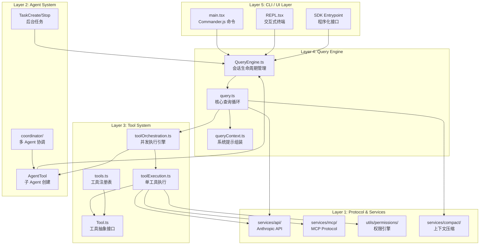

**Layer 5 —— CLI / UI 层**：负责命令行参数解析、终端渲染和用户交互。`main.tsx` 使用 Commander.js 定义了完整的 CLI 接口，`REPL.tsx` 提供交互式终端体验。SDK 入口则为程序化调用提供接口。

**Layer 4 —— Query Engine 层**：这是系统的大脑。`QueryEngine` 管理整个对话的生命周期状态，`query()` 函数实现核心的 API 调用 - 工具执行循环。

**Layer 3 —— Tool System 层**：定义了工具的抽象接口和执行引擎。`toolOrchestration.ts` 负责并发控制，将工具调用分为"并发安全"和"串行执行"两类：

```typescript
// src/services/tools/toolOrchestration.ts
export async function* runTools(
  toolUseMessages: ToolUseBlock[],
  assistantMessages: AssistantMessage[],
  canUseTool: CanUseToolFn,
  toolUseContext: ToolUseContext,
): AsyncGenerator<MessageUpdate, void> {
  let currentContext = toolUseContext
  for (const { isConcurrencySafe, blocks } of partitionToolCalls(
    toolUseMessages,
    currentContext,
  )) {
    if (isConcurrencySafe) {
      // 并发安全的工具（如 Glob、Grep、FileRead）并行执行
      for await (const update of runToolsConcurrently(
        blocks, assistantMessages, canUseTool, currentContext,
      )) {
        yield { message: update.message, newContext: currentContext }
      }
    }
    // 非并发安全的工具串行执行
    // ...
  }
}
```

**Layer 2 —— Agent System 层**：支持 Agent 嵌套和任务管理。`AgentTool` 可以创建子 Agent，每个子 Agent 拥有独立的 `QueryEngine` 实例，实现递归式的任务分解。

**Layer 1 —— Protocol & Services 层**：与外部世界交互的基础设施。包括 Anthropic API 客户端、MCP 协议实现、权限引擎和上下文压缩服务。

### 分层的关键设计原则

1. **单向依赖**：上层可以依赖下层，反之则通过类型注入或回调实现反向通信
2. **类型解耦**：`types/` 目录提供跨层共享的纯类型定义，避免运行时循环依赖
3. **AsyncGenerator 作为通信管道**：`query()` 和 `runTools()` 都返回 `AsyncGenerator`，支持惰性、流式的消息传递

## 1.5 核心数据流

理解 Claude Code 最有效的方式是跟踪一次完整对话的旅程。当用户在终端输入 "读取 src/main.tsx 并总结其功能" 时，系统内部发生了什么？

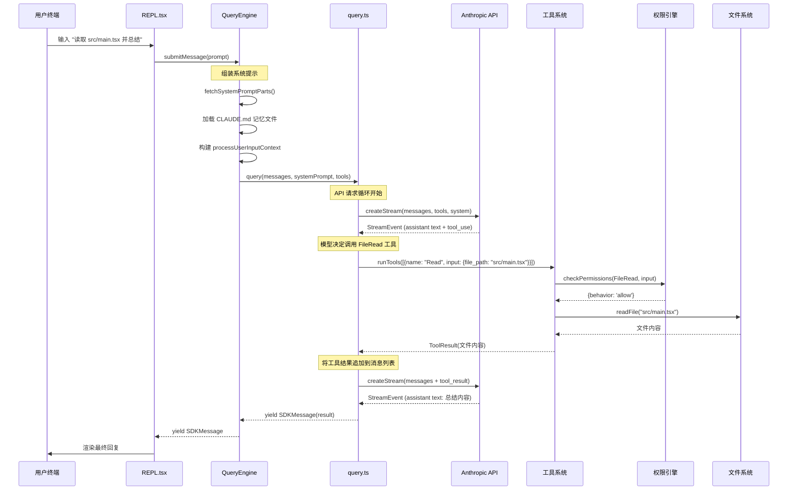

让我们深入每个关键阶段。

### 阶段 1：消息提交与上下文组装

当 `QueryEngine.submitMessage()` 被调用时，首先组装系统提示：

```typescript
// src/QueryEngine.ts
async *submitMessage(
  prompt: string | ContentBlockParam[],
  options?: { uuid?: string; isMeta?: boolean },
): AsyncGenerator<SDKMessage, void, unknown> {
  // ... 解构配置

  // 获取系统提示的各个组成部分
  const {
    defaultSystemPrompt,
    userContext: baseUserContext,
    systemContext,
  } = await fetchSystemPromptParts({
    tools,
    mainLoopModel: initialMainLoopModel,
    additionalWorkingDirectories: Array.from(
      initialAppState.toolPermissionContext
        .additionalWorkingDirectories.keys(),
    ),
    mcpClients,
    customSystemPrompt: customPrompt,
  })

  // 组装最终的系统提示
  const systemPrompt = asSystemPrompt([
    ...(customPrompt !== undefined ? [customPrompt] : defaultSystemPrompt),
    ...(memoryMechanicsPrompt ? [memoryMechanicsPrompt] : []),
    ...(appendSystemPrompt ? [appendSystemPrompt] : []),
  ])
```

系统提示由多个部分组成：默认提示（包含角色定义、工具使用指南、安全规则）、用户上下文（git 状态、工作目录信息）、系统上下文（操作系统、shell 类型），以及可选的记忆文件和自定义追加内容。

### 阶段 2：核心查询循环

`query()` 函数是一个 `AsyncGenerator`，实现了 API 调用和工具执行的交替循环：

```typescript
// src/query.ts (概念性简化)
export async function* query(params: QueryParams): AsyncGenerator<Message | StreamEvent> {
  while (true) {
    // 1. 调用 Anthropic API
    const stream = createStream(messages, systemPrompt, tools)

    // 2. 流式处理响应
    for await (const event of stream) {
      yield event  // 实时传递给上层
    }

    // 3. 如果模型请求了工具调用
    if (hasToolUse(lastAssistantMessage)) {
      // 4. 执行工具（可能并发）
      for await (const update of runTools(toolUseBlocks, ...)) {
        yield update.message
      }
      // 5. 继续循环（带上工具结果再次调用 API）
      continue
    }

    // 6. 模型完成回复，退出循环
    break
  }
}
```

这个循环的关键特性是**自动继续**：当模型输出包含 `tool_use` 块时，系统自动执行工具并将结果反馈给模型，无需用户干预。这就是 Agent 行为的核心 —— 模型可以自主决定执行多个步骤来完成任务。

### 阶段 3：工具执行与权限检查

每个工具调用都要经过权限引擎的审查。权限系统采用多层决策模型：

```typescript
// src/Tool.ts - 工具接口中的权限方法
checkPermissions(
  input: z.infer<Input>,
  context: ToolUseContext,
): Promise<PermissionResult>
```

`PermissionResult` 是一个判别联合类型，其 `behavior` 字段决定了后续流程：

```typescript
// src/types/permissions.ts
export type PermissionResult<Input> =
  | PermissionAllowDecision<Input>   // behavior: 'allow' — 放行
  | PermissionAskDecision<Input>     // behavior: 'ask'   — 询问用户
  | PermissionDenyDecision           // behavior: 'deny'  — 拒绝
  | { behavior: 'passthrough'; ... } // 交给通用权限系统
```

当工具被允许执行后，其结果通过 `ToolResult<T>` 返回：

```typescript
export type ToolResult<T> = {
  data: T                    // 工具输出数据
  newMessages?: Message[]    // 可选的附加消息
  contextModifier?: (context: ToolUseContext) => ToolUseContext  // 上下文修改器
  mcpMeta?: { ... }          // MCP 元数据透传
}
```

`contextModifier` 是一个精妙的设计：某些工具执行后会改变后续工具的执行上下文（例如切换工作目录），通过返回一个上下文修改函数而非直接修改全局状态，保证了并发安全性。

### 阶段 4：结果渲染与流式输出

整个数据流通过 `AsyncGenerator` 的 `yield` 机制实现了真正的流式传递。从 API 的 Server-Sent Events，到工具执行的进度更新，再到最终的渲染输出，数据在管道中逐级流动，无需缓冲整个响应。

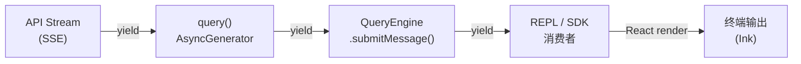

这种 AsyncGenerator 管道模式是 Claude Code 数据流架构的核心特征。它实现了：
- **背压控制**：消费者未拉取时，生产者暂停
- **惰性计算**：只有被消费的消息才会被处理
- **流式渲染**：用户可以在模型还在生成时就看到部分输出

## 本章小结

本章建立了对 Claude Code 的全局认知：

1. **产品本质**：不是简单的 CLI 聊天工具，而是一个完整的终端原生 AI Agent 运行时
2. **技术选型逻辑**：Bun 的编译时 feature flag 支撑了一套代码多产物的构建策略；React/Ink 解决了复杂工具 UI 的组合问题；Zod 桥接了静态类型与运行时验证
3. **五层架构**：从 CLI 到 Protocol，每一层有明确的职责边界
4. **数据流特征**：AsyncGenerator 管道实现了全链路流式传递

在接下来的章节中，我们将深入每一层的实现细节，从启动流程开始。


\\newpage

# 第 2 章 启动流程

> "一个 CLI 工具的启动时间决定了它能否被程序员日常使用。每多 100 毫秒的等待，就多一份切换回浏览器的冲动。"

Claude Code 的启动流程是一个精心编排的异步序列。从用户敲下 `claude` 命令到出现交互式提示符，中间经历了入口分发、并行预取、配置加载、迁移执行、权限初始化等十余个阶段。本章将逐一剖析这些阶段，揭示工程团队在启动性能上所做的极致优化。

## 2.1 入口点：从 cli.tsx 到 main.tsx

Claude Code 的启动流程始于 `src/entrypoints/cli.tsx`。这个文件是编译后的二进制文件的真正入口。它的设计体现了**快速路径优先**的原则：

```typescript
// src/entrypoints/cli.tsx
async function main(): Promise<void> {
  const args = process.argv.slice(2);

  // 快速路径：--version 零模块加载
  if (args.length === 1 && (args[0] === '--version' || args[0] === '-v')) {
    console.log(`${MACRO.VERSION} (Claude Code)`);
    return;
  }

  // 对于所有其他路径，加载启动分析器
  const { profileCheckpoint } = await import('../utils/startupProfiler.js');
  profileCheckpoint('cli_entry');

  // 快速路径：--dump-system-prompt
  if (feature('DUMP_SYSTEM_PROMPT') && args[0] === '--dump-system-prompt') {
    // ...直接输出后退出
  }

  // 主路径：加载完整 CLI
  const { main } = await import('../main.js');
  await main();
}
```

注意 `--version` 的处理：它甚至不加载 `startupProfiler` 模块。`MACRO.VERSION` 是一个构建时内联的常量，这意味着 `claude --version` 的执行路径上**零动态 import**。这种极致的启动优化意识贯穿整个代码库。

另一个值得注意的是 `cli.tsx` 中的环境预设逻辑：

```typescript
// 远程容器环境下增大 V8 堆上限
if (process.env.CLAUDE_CODE_REMOTE === 'true') {
  const existing = process.env.NODE_OPTIONS || '';
  process.env.NODE_OPTIONS = existing
    ? `${existing} --max-old-space-size=8192`
    : '--max-old-space-size=8192';
}
```

这段代码在任何模块加载之前就设置了内存限制，确保远程容器环境（Claude Code Remote，即 CCR）中的长时间会话不会因为默认的堆大小限制而 OOM。

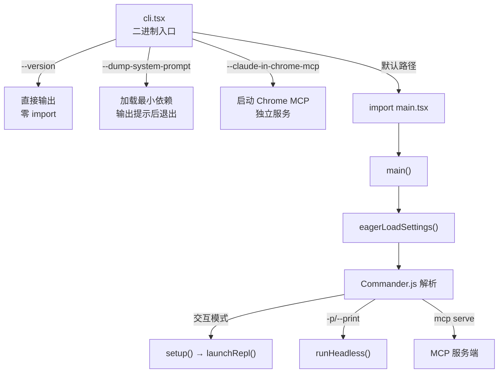

## 2.2 并行预取：与时间赛跑

`main.tsx` 文件的前 20 行是整个代码库中最精心设计的部分之一。它利用 JavaScript 的模块加载语义实现了**零成本并行预取**：

```typescript
// src/main.tsx — 文件最顶部
// 这些副作用必须在所有其他 import 之前运行：
// 1. profileCheckpoint 在模块求值开始前标记入口
// 2. startMdmRawRead 启动 MDM 子进程（plutil/reg query），
//    使其与后续约 135ms 的 import 并行运行
// 3. startKeychainPrefetch 并行启动两个 macOS keychain 读取
//    （OAuth + legacy API key），否则 isRemoteManagedSettingsEligible()
//    会在 applySafeConfigEnvironmentVariables() 内通过同步 spawn 顺序读取
//    （每次 macOS 启动约 65ms）

import { profileCheckpoint, profileReport } from './utils/startupProfiler.js';
profileCheckpoint('main_tsx_entry');

import { startMdmRawRead } from './utils/settings/mdm/rawRead.js';
startMdmRawRead();

import { ensureKeychainPrefetchCompleted, startKeychainPrefetch }
  from './utils/secureStorage/keychainPrefetch.js';
startKeychainPrefetch();
```

这段代码利用了一个关键事实：**ES 模块的 import 是同步求值的，但模块内部启动的异步操作会在后台并行执行**。

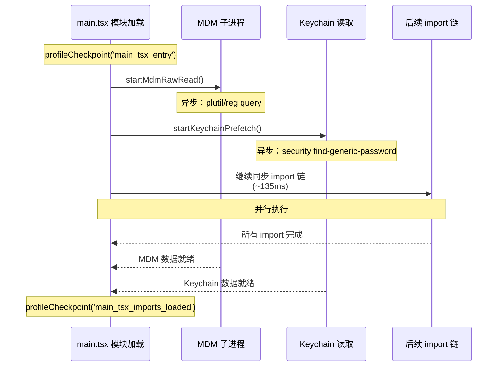

关键洞察：在 macOS 上，`startKeychainPrefetch()` 并行启动了两个 keychain 读取操作（OAuth token 和 legacy API key）。如果不进行这个预取，这两个操作会在后续的 `applySafeConfigEnvironmentVariables()` 中**同步串行执行**，每次约 32ms，合计约 65ms。通过将它们提前到模块加载的最开始，这 65ms 被完全隐藏在后续 import 的 135ms 之内。

这种并行预取模式在后续也被多次使用。在 `startDeferredPrefetches()` 中，还有更多的后台预取操作被推迟到首次渲染之后：

```typescript
// src/main.tsx
export function startDeferredPrefetches(): void {
  // 跳过条件：性能测量模式或 bare 模式
  if (isEnvTruthy(process.env.CLAUDE_CODE_EXIT_AFTER_FIRST_RENDER) ||
      isBareMode()) {
    return;
  }

  // 进程级预取（在用户输入第一条消息前完成）
  void initUser();
  void getUserContext();
  prefetchSystemContextIfSafe();
  void getRelevantTips();

  // 云提供商凭证预取
  if (isEnvTruthy(process.env.CLAUDE_CODE_USE_BEDROCK)) {
    void prefetchAwsCredentialsAndBedRockInfoIfSafe();
  }
  if (isEnvTruthy(process.env.CLAUDE_CODE_USE_VERTEX)) {
    void prefetchGcpCredentialsIfSafe();
  }

  // 文件计数（ripgrep，3秒超时）
  void countFilesRoundedRg(getCwd(), AbortSignal.timeout(3000), []);

  // 分析与 feature flag
  void initializeAnalyticsGates();
  void prefetchOfficialMcpUrls();
  void refreshModelCapabilities();

  // 文件变更检测器
  void settingsChangeDetector.initialize();
  void skillChangeDetector.initialize();
}
```

这些预取操作全部使用 `void` 前缀启动（fire-and-forget），不阻塞 REPL 的首次渲染。它们的结果会被缓存，在后续的第一次 API 调用时消费。设计理念是：**用户输入第一条消息通常需要几秒钟，这段时间足够完成所有预取操作**。

## 2.3 Feature Flag：编译时死代码消除

`feature()` 函数是 Claude Code 构建系统的核心机制之一。它来自 Bun 的 `bun:bundle` 模块，在编译期被求值为布尔常量：

```typescript
import { feature } from 'bun:bundle'

// 编译时求值：对于外部构建，feature('COORDINATOR_MODE') === false
const coordinatorModeModule = feature('COORDINATOR_MODE')
  ? require('./coordinator/coordinatorMode.js')
  : null
```

当 `feature('COORDINATOR_MODE')` 为 `false` 时，Bun 的 bundler 会将整个三元表达式优化为 `null`，并且 `require('./coordinator/coordinatorMode.js')` 所引入的整个模块树都会被 tree-shake 移除。

在 `src/tools.ts` 中，这种模式被大量使用：

```typescript
const SleepTool =
  feature('PROACTIVE') || feature('KAIROS')
    ? require('./tools/SleepTool/SleepTool.js').SleepTool
    : null

const cronTools = feature('AGENT_TRIGGERS')
  ? [
      require('./tools/ScheduleCronTool/CronCreateTool.js').CronCreateTool,
      require('./tools/ScheduleCronTool/CronDeleteTool.js').CronDeleteTool,
      require('./tools/ScheduleCronTool/CronListTool.js').CronListTool,
    ]
  : []

const WebBrowserTool = feature('WEB_BROWSER_TOOL')
  ? require('./tools/WebBrowserTool/WebBrowserTool.js').WebBrowserTool
  : null
```

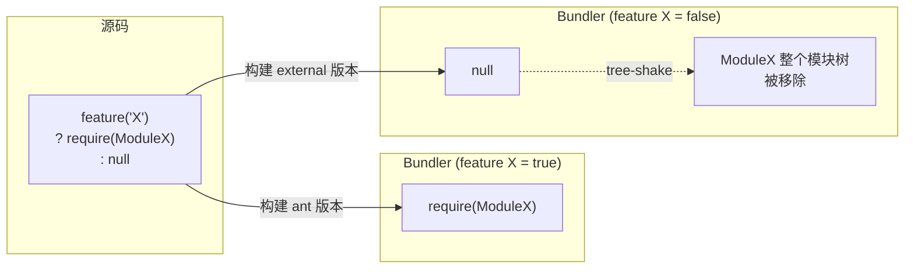

这种方法的优势对比运行时条件检查：

| 维度 | `feature()` 编译时消除 | `process.env.X` 运行时检查 |
|------|----------------------|--------------------------|
| 产物大小 | 未使用代码物理移除 | 全部代码打包 |
| 运行时开销 | 零 | 每次条件检查有分支预测成本 |
| 安全性 | 内部代码不在产物中 | 代码存在，可被逆向 |
| 调试 | 需要不同构建产物 | 同一产物，改环境变量即可 |

值得注意的是，`process.env.USER_TYPE` 的检查在代码中也大量存在，但它不是通过 `feature()` 实现的：

```typescript
...(process.env.USER_TYPE === 'ant' ? [ConfigTool] : []),
...(process.env.USER_TYPE === 'ant' ? [TungstenTool] : []),
```

对比 `feature()` 的编译时消除，这里使用了字面量字符串比较。从 `main.tsx` 第 266 行可以看到一个线索：

```typescript
if ("external" !== 'ant' && isBeingDebugged()) {
  process.exit(1);
}
```

这里的 `"external"` 是一个构建时被替换的宏 —— 在 ant 构建中它是 `"ant"`，在外部构建中它是 `"external"`。同样地，`process.env.USER_TYPE` 的值也是在构建时确定的，使得 bundler 可以进行同样的死代码消除。

## 2.4 延迟加载：require() 的策略性使用

在 `main.tsx` 和 `tools.ts` 中，大量使用了 `require()` 而非 `import`。这不是代码风格问题，而是一种**刻意的延迟加载策略**：

```typescript
// src/main.tsx — 打破循环依赖的延迟 require
const getTeammateUtils = () =>
  require('./utils/teammate.js') as typeof import('./utils/teammate.js');
const getTeammatePromptAddendum = () =>
  require('./utils/swarm/teammatePromptAddendum.js')
  as typeof import('./utils/swarm/teammatePromptAddendum.js');
```

```typescript
// src/tools.ts — 打破循环依赖
const getTeamCreateTool = () =>
  require('./tools/TeamCreateTool/TeamCreateTool.js')
    .TeamCreateTool as typeof import('./tools/TeamCreateTool/TeamCreateTool.js')
      .TeamCreateTool
```

这里有两种使用模式：

**模式 1：打破循环依赖**。`tools.ts` 导入 `TeamCreateTool`，而 `TeamCreateTool` 的模块链最终又会导入 `tools.ts`。通过将 `require()` 包装在函数中，模块求值时不会立即触发导入，只在函数被调用时才执行，此时循环链中的所有模块已经完成初始化。

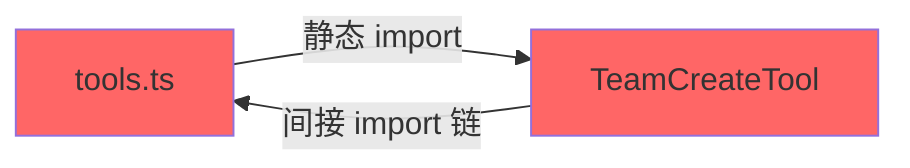

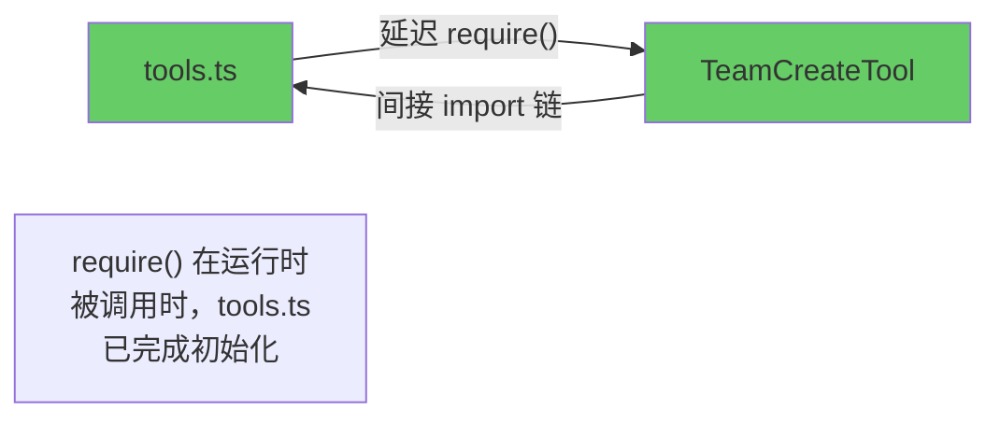

**模式 2：条件加载 + 类型安全**。`as typeof import(...)` 语法确保了即使是动态 `require()`，返回值也有完整的类型信息：

```typescript
const coordinatorModeModule = feature('COORDINATOR_MODE')
  ? require('./coordinator/coordinatorMode.js')
    as typeof import('./coordinator/coordinatorMode.js')
  : null;
```

这个模式同时实现了三个目标：
1. 编译时死代码消除（通过 `feature()`）
2. 延迟加载（通过 `require()`）
3. 类型安全（通过 `as typeof import(...)`）

## 2.5 启动性能：profileCheckpoint 系统

Claude Code 内建了一套启动性能打点系统，定义在 `src/utils/startupProfiler.ts` 中：

```typescript
// src/utils/startupProfiler.ts
const DETAILED_PROFILING = isEnvTruthy(process.env.CLAUDE_CODE_PROFILE_STARTUP)
const STATSIG_SAMPLE_RATE = 0.005
const STATSIG_LOGGING_SAMPLED =
  process.env.USER_TYPE === 'ant' || Math.random() < STATSIG_SAMPLE_RATE

const SHOULD_PROFILE = DETAILED_PROFILING || STATSIG_LOGGING_SAMPLED
```

这个系统有两种工作模式：

1. **采样日志模式**：100% 的内部用户和 0.5% 的外部用户自动启用，将性能数据上报到 Statsig 用于聚合分析
2. **详细分析模式**：通过 `CLAUDE_CODE_PROFILE_STARTUP=1` 环境变量手动启用，输出完整的时间线报告

```typescript
export function profileCheckpoint(name: string): void {
  if (!SHOULD_PROFILE) return

  const perf = getPerformance()
  perf.mark(name)

  // 仅在详细模式下捕获内存快照
  if (DETAILED_PROFILING) {
    memorySnapshots.push(process.memoryUsage())
  }
}
```

当 `SHOULD_PROFILE` 为 `false` 时，`profileCheckpoint()` 是一个立即返回的空函数，**零运行时开销**。这意味着生产环境中 99.5% 的外部用户不会受到任何性能影响。

打点散布在整个启动路径中，形成了一条精确的时间线：

```typescript
profileCheckpoint('main_tsx_entry')           // import 开始
// ... 135ms 的 import 链 ...
profileCheckpoint('main_tsx_imports_loaded')   // import 结束
profileCheckpoint('main_function_start')       // main() 函数入口
profileCheckpoint('main_warning_handler_initialized')
profileCheckpoint('eagerLoadSettings_start')   // 配置加载开始
profileCheckpoint('eagerLoadSettings_end')     // 配置加载结束
```

对应的阶段定义用于 Statsig 上报：

```typescript
const PHASE_DEFINITIONS = {
  import_time: ['cli_entry', 'main_tsx_imports_loaded'],
  init_time: ['init_function_start', 'init_function_end'],
  settings_time: ['eagerLoadSettings_start', 'eagerLoadSettings_end'],
  total_time: ['cli_entry', 'main_after_run'],
} as const
```

当启用详细模式时，会生成一份包含内存快照的完整报告：

```
================================================================================
STARTUP PROFILING REPORT
================================================================================

    0ms    +0ms  profiler_initialized                    [RSS: 45MB, Heap: 12MB]
    1ms    +1ms  cli_entry                               [RSS: 45MB, Heap: 12MB]
    2ms    +1ms  main_tsx_entry                           [RSS: 46MB, Heap: 13MB]
  137ms  +135ms  main_tsx_imports_loaded                  [RSS: 89MB, Heap: 42MB]
  138ms    +1ms  main_function_start                      [RSS: 89MB, Heap: 42MB]
  ...
  312ms  +174ms  main_after_run                           [RSS: 112MB, Heap: 58MB]

Total startup time: 312ms
================================================================================
```

## 2.6 init 流程：从配置到就绪

`main()` 函数中的 `init()` 调用（定义在 `src/entrypoints/init.ts`）是启动序列中最关键的一步。它被 `memoize` 包装，确保全局只执行一次：

```typescript
// src/entrypoints/init.ts
export const init = memoize(async (): Promise<void> => {
  const initStartTime = Date.now()
  profileCheckpoint('init_function_start')

  // 1. 启用配置系统 — 验证所有配置文件格式正确
  enableConfigs()
  profileCheckpoint('init_configs_enabled')

  // 2. 应用安全的环境变量（trust 对话框之前）
  applySafeConfigEnvironmentVariables()
  applyExtraCACertsFromConfig()
  profileCheckpoint('init_safe_env_vars_applied')

  // 3. 注册优雅退出处理
  setupGracefulShutdown()
  profileCheckpoint('init_after_graceful_shutdown')

  // 4. 初始化 1P 事件日志（异步，不阻塞）
  void Promise.all([
    import('../services/analytics/firstPartyEventLogger.js'),
    import('../services/analytics/growthbook.js'),
  ]).then(([fp, gb]) => {
    fp.initialize1PEventLogging()
    gb.onGrowthBookRefresh(() => {
      void fp.reinitialize1PEventLoggingIfConfigChanged()
    })
  })

  // 5. 填充 OAuth 账户信息
  void populateOAuthAccountInfoIfNeeded()

  // 6. 配置全局网络设置（mTLS + 代理）
  configureGlobalMTLS()
  configureGlobalAgents()
  profileCheckpoint('init_network_configured')

  // 7. API 预连接 — TCP+TLS 握手与后续工作并行
  preconnectAnthropicApi()

  // 8. 平台特定初始化
  setShellIfWindows()

  // 9. 远程管理设置加载（如果有资格）
  if (isEligibleForRemoteManagedSettings()) {
    initializeRemoteManagedSettingsLoadingPromise()
  }
  if (isPolicyLimitsEligible()) {
    initializePolicyLimitsLoadingPromise()
  }

  profileCheckpoint('init_function_end')
})
```

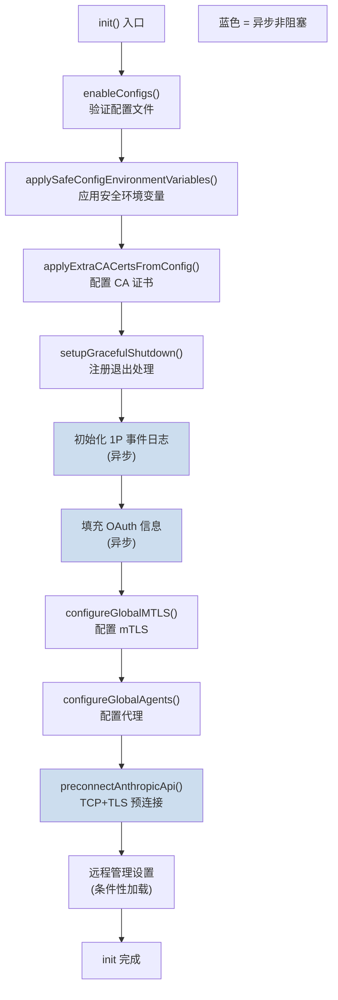

其中有几个值得深入分析的设计决策：

### applyConfigEnvironmentVariables 的分阶段执行

环境变量的应用被分为两个阶段：

- `applySafeConfigEnvironmentVariables()`：在 trust 对话框之前执行。只应用不涉及安全风险的环境变量（如代理设置、CA 证书路径）
- `applyConfigEnvironmentVariables()`：在 trust 建立之后执行。应用所有环境变量，包括可能影响安全行为的变量

这种分阶段设计确保了：在用户确认信任之前，不会执行任何可能被恶意项目配置利用的操作。

### preconnectAnthropicApi 的预连接优化

```typescript
// TCP+TLS 握手通常需要 100-200ms
// 在 CA 证书和代理配置完成后立即启动预连接
// 使其与后续 ~100ms 的初始化工作并行
preconnectAnthropicApi()
```

通过在配置网络参数后立即发起 TCP 连接，TLS 握手的延迟（100-200ms）被隐藏在后续的初始化工作中。这意味着当第一次 API 调用发生时，连接已经建立就绪。

### 迁移系统

`main.tsx` 中的 `runMigrations()` 负责执行配置迁移：

```typescript
const CURRENT_MIGRATION_VERSION = 11;

function runMigrations(): void {
  if (getGlobalConfig().migrationVersion !== CURRENT_MIGRATION_VERSION) {
    migrateAutoUpdatesToSettings();
    migrateBypassPermissionsAcceptedToSettings();
    migrateEnableAllProjectMcpServersToSettings();
    resetProToOpusDefault();
    migrateSonnet1mToSonnet45();
    migrateLegacyOpusToCurrent();
    migrateSonnet45ToSonnet46();
    migrateOpusToOpus1m();
    migrateReplBridgeEnabledToRemoteControlAtStartup();

    if (feature('TRANSCRIPT_CLASSIFIER')) {
      resetAutoModeOptInForDefaultOffer();
    }
    if ("external" === 'ant') {
      migrateFennecToOpus();
    }

    saveGlobalConfig(prev =>
      prev.migrationVersion === CURRENT_MIGRATION_VERSION
        ? prev
        : { ...prev, migrationVersion: CURRENT_MIGRATION_VERSION }
    );
  }
}
```

迁移系统的设计特点：

1. **版本门控**：通过 `migrationVersion` 整数避免重复执行
2. **幂等性**：每个迁移函数必须是幂等的（多次执行结果一致）
3. **全量执行**：不像数据库迁移那样逐版本递增，而是每次检查是否需要迁移时运行所有迁移。这简化了实现 —— 每个迁移函数自行检查是否需要执行
4. **异步迁移分离**：`migrateChangelogFromConfig()` 是异步的，使用 fire-and-forget 模式，不阻塞启动

模型字符串的迁移链清晰记录了 Claude 模型的演进历史：`Fennec → Opus → Legacy Opus → Sonnet 1M → Sonnet 4.5 → Sonnet 4.6 → Opus 1M`。每次模型更名都需要迁移用户存储的模型偏好设置。

### 安全前置检查

`main()` 函数的开头包含了一个安全检查：

```typescript
// src/main.tsx
// 安全：防止 Windows 从当前目录执行命令
process.env.NoDefaultCurrentDirectoryInExePath = '1';
```

以及反调试检测：

```typescript
// 外部构建中检测并阻止调试器附加
if ("external" !== 'ant' && isBeingDebugged()) {
  process.exit(1);
}
```

`isBeingDebugged()` 检查 `--inspect` 标志、`NODE_OPTIONS` 环境变量和活跃的 Inspector 连接。在外部构建中，调试模式被直接禁止。这是一种**安全纵深防御**措施，防止通过调试器绕过安全检查。

## 2.7 Commander.js 命令注册

`main()` 函数中使用 Commander.js 定义了完整的 CLI 接口。命令定义代码非常长（main.tsx 超过 4000 行），但架构模式是统一的。主命令处理交互模式，子命令处理各种非交互操作。

在进入 Commander 解析之前，有几个特殊路径通过直接的 argv 检查提前处理：

```typescript
// cc:// URL 协议处理
if (feature('DIRECT_CONNECT')) {
  const ccIdx = rawCliArgs.findIndex(
    a => a.startsWith('cc://') || a.startsWith('cc+unix://')
  );
  if (ccIdx !== -1 && _pendingConnect) {
    // 重写 argv，让主命令处理器接管
    _pendingConnect.url = parsed.serverUrl;
    _pendingConnect.authToken = parsed.authToken;
    process.argv = [process.argv[0]!, process.argv[1]!, ...stripped];
  }
}

// `claude assistant [sessionId]` 特殊处理
if (feature('KAIROS') && _pendingAssistantChat) {
  if (rawArgs[0] === 'assistant') {
    // ...
  }
}

// `claude ssh <host> [dir]` 特殊处理
if (feature('SSH_REMOTE') && _pendingSSH) {
  if (rawCliArgs[0] === 'ssh') {
    // 提取 --permission-mode, --local 等 SSH 特定标志
    // ...
  }
}
```

这些特殊路径通过修改 `process.argv` 来"注入"参数，使得 Commander.js 的主命令处理器能够统一处理。这种设计避免了在 Commander 中注册大量子命令，同时保持了主命令的交互式 TUI 体验。

## 本章小结

Claude Code 的启动流程体现了一套完整的性能工程方法论：

1. **快速路径优先**：`--version` 零 import，特殊入口延迟加载
2. **并行预取**：利用模块加载窗口并行执行 I/O 操作
3. **编译时优化**：`feature()` 实现物理级别的代码消除
4. **分阶段初始化**：安全敏感操作在 trust 建立后才执行
5. **延迟到首次使用**：预取操作的结果在第一次需要时才被消费
6. **可观测性内建**：profileCheckpoint 系统以零成本（非采样用户）实现启动性能监控

这些优化的叠加效果是：在典型的 macOS 环境下，从命令输入到终端就绪的时间控制在 300ms 左右，达到了"瞬间响应"的体验阈值。


\\newpage

# 第 3 章 类型系统设计

> "类型不是约束，而是思维的外化。一个好的类型系统设计，就是一份自我验证的架构文档。"

Claude Code 是一个深度依赖 TypeScript 类型系统的项目。其类型设计不仅仅是为了编译时检查，更是一种**架构级别的约束传播机制**：通过类型定义来强制执行模块边界、打破循环依赖、保证 API 契约，以及在 Agent 系统中实现类型安全的消息传递。本章将从三个维度剖析这套类型系统的设计思想。

## 3.1 TypeScript 严格模式的工程价值

在一个拥有 1900 多个文件的代码库中，TypeScript 严格模式不是可选的锦上添花，而是工程必需品。Claude Code 对类型严格性的要求体现在多个层面。

### 品牌类型（Branded Types）

`src/types/ids.ts` 展示了一种高级的类型安全技巧 —— 品牌类型：

```typescript
// src/types/ids.ts
export type SessionId = string & { readonly __brand: 'SessionId' }
export type AgentId = string & { readonly __brand: 'AgentId' }
```

`SessionId` 和 `AgentId` 在运行时都是普通的 `string`，但在编译时它们是不可互换的：

```typescript
function processSession(id: SessionId): void { /* ... */ }
function processAgent(id: AgentId): void { /* ... */ }

const sessionId: SessionId = asSessionId('abc-123')
const agentId: AgentId = asAgentId('a-deadbeef01234567')

processSession(sessionId)  // 编译通过
processSession(agentId)    // 编译错误：AgentId 不能赋值给 SessionId
```

这种设计消除了一类常见的 bug：在 Agent 系统中，Session ID 和 Agent ID 都是字符串，容易在参数传递中混淆。品牌类型将这种运行时 bug 提升为编译时错误。

创建品牌类型的函数提供了窄化入口：

```typescript
export function asSessionId(id: string): SessionId {
  return id as SessionId
}

export function asAgentId(id: string): AgentId {
  return id as AgentId
}
```

注意 `toAgentId()` 函数还包含运行时验证：

```typescript
const AGENT_ID_PATTERN = /^a(?:.+-)?[0-9a-f]{16}$/

export function toAgentId(s: string): AgentId | null {
  return AGENT_ID_PATTERN.test(s) ? (s as AgentId) : null
}
```

`toAgentId` 和 `asAgentId` 的区别在于：前者是**安全的窄化**（返回 `null` 表示无效输入），后者是**断言式窄化**（调用者保证输入合法）。在 Claude Code 的使用中，`toAgentId` 用于解析外部输入（如 URL 参数），`asAgentId` 用于内部已知合法的场景。

### DeepImmutable 类型

`ToolPermissionContext` 被 `DeepImmutable` 包装，确保权限上下文在传递过程中不会被意外修改：

```typescript
// src/Tool.ts
export type ToolPermissionContext = DeepImmutable<{
  mode: PermissionMode
  additionalWorkingDirectories: Map<string, AdditionalWorkingDirectory>
  alwaysAllowRules: ToolPermissionRulesBySource
  alwaysDenyRules: ToolPermissionRulesBySource
  alwaysAskRules: ToolPermissionRulesBySource
  isBypassPermissionsModeAvailable: boolean
  // ...
}>
```

`DeepImmutable` 递归地将所有属性标记为 `readonly`，将 `Map` 转为 `ReadonlyMap`，将数组转为 `readonly` 数组。这保证了权限上下文在工具执行的整个生命周期中是不可变的 —— 任何试图修改它的代码都会导致编译错误。

## 3.2 循环依赖破解：纯类型文件的架构模式

循环依赖是大型 TypeScript 项目中最常见的架构退化信号。Claude Code 采用了一种系统性的解决方案：**将共享类型提取到纯类型文件中**。

### 问题根源

考虑以下依赖场景：


`Tool.ts` 需要引用权限类型，权限模块也需要引用工具类型。在运行时，这种循环会导致模块初始化时某些导出为 `undefined`。

### 解决方案：types/ 目录

`src/types/` 目录中的文件遵循严格的规则：**只包含类型定义和编译时常量，没有运行时依赖**。

```typescript
// src/types/permissions.ts 文件头注释
/**
 * Pure permission type definitions extracted to break import cycles.
 *
 * This file contains only type definitions and constants with no
 * runtime dependencies.
 * Implementation files remain in src/utils/permissions/ but can now
 * import from here to avoid circular dependencies.
 */
```

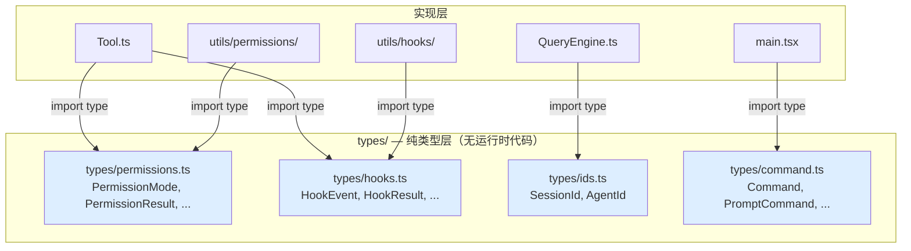

在 `Tool.ts` 中可以看到这种模式的具体应用：

```typescript
// src/Tool.ts
// 从集中位置导入权限类型以打破导入循环
import type {
  AdditionalWorkingDirectory,
  PermissionMode,
  PermissionResult,
} from './types/permissions.js'

// 从集中位置导入工具进度类型以打破导入循环
import type {
  AgentToolProgress,
  BashProgress,
  MCPProgress,
  REPLToolProgress,
  SkillToolProgress,
  TaskOutputProgress,
  ToolProgressData,
  WebSearchProgress,
} from './types/tools.js'
```

注释明确标注了 "to break import cycles"。同时，为了向后兼容，这些类型被重新导出：

```typescript
// 为了向后兼容，重新导出进度类型
export type {
  AgentToolProgress,
  BashProgress,
  MCPProgress,
  REPLToolProgress,
  SkillToolProgress,
  TaskOutputProgress,
  WebSearchProgress,
}
```

这意味着现有的消费者代码不需要修改导入路径 —— 它们仍然可以从 `Tool.ts` 导入这些类型，但 `Tool.ts` 自身的依赖链不再形成循环。

### types/permissions.ts 的完整剖析

`src/types/permissions.ts` 是这种模式的范例。它定义了完整的权限类型层次结构：

```typescript
// 权限模式 — 判别联合
export type ExternalPermissionMode = (typeof EXTERNAL_PERMISSION_MODES)[number]
export type InternalPermissionMode = ExternalPermissionMode | 'auto' | 'bubble'
export type PermissionMode = InternalPermissionMode

// 权限行为 — 三值枚举
export type PermissionBehavior = 'allow' | 'deny' | 'ask'

// 权限规则 — 来源标签
export type PermissionRuleSource =
  | 'userSettings'
  | 'projectSettings'
  | 'localSettings'
  | 'flagSettings'
  | 'policySettings'
  | 'cliArg'
  | 'command'
  | 'session'

// 权限决策 — 判别联合
export type PermissionDecision<Input> =
  | PermissionAllowDecision<Input>
  | PermissionAskDecision<Input>
  | PermissionDenyDecision
```

注意 `PermissionMode` 的定义方式：外部可见的模式（`ExternalPermissionMode`）是内部模式（`InternalPermissionMode`）的子集。`'auto'` 和 `'bubble'` 模式只在内部使用。通过 `feature()` 编译时开关，`'auto'` 模式甚至可以从运行时验证集合中完全移除：

```typescript
export const INTERNAL_PERMISSION_MODES = [
  ...EXTERNAL_PERMISSION_MODES,
  ...(feature('TRANSCRIPT_CLASSIFIER')
    ? (['auto'] as const)
    : ([] as const)),
] as const satisfies readonly PermissionMode[]
```

这是一个精妙的设计：类型系统中 `'auto'` 始终存在（因为 `InternalPermissionMode` 包含它），但运行时验证集合可以根据 feature flag 排除它。`satisfies` 关键字确保了数组内容与类型定义的一致性。

## 3.3 Zod Schema：运行时类型验证

TypeScript 的类型在编译后完全消失。对于需要处理外部输入的系统来说，仅靠编译时类型检查是不够的。Claude Code 使用 Zod v4 实现运行时类型验证，特别是在以下场景中：

### 工具输入验证

每个工具的 `inputSchema` 是一个 Zod schema：

```typescript
// 概念性示例：FileRead 工具的输入 schema
const inputSchema = z.object({
  file_path: z.string().describe("The absolute path to the file to read"),
  offset: z.number().optional().describe("Line number to start reading from"),
  limit: z.number().optional().describe("Number of lines to read"),
})
```

这个 schema 同时服务三个目的：

1. **API 契约**：自动生成 JSON Schema，发送给 Anthropic API 的 `tools` 参数
2. **运行时验证**：验证模型返回的工具调用参数是否合法
3. **类型推断**：通过 `z.infer<typeof inputSchema>` 自动推断 TypeScript 类型

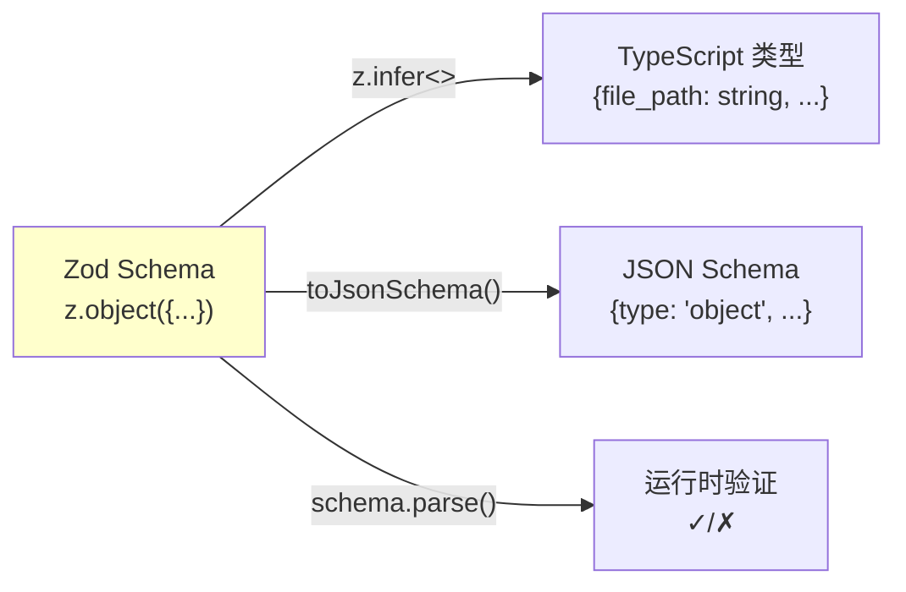

### Hook 响应验证

`src/types/hooks.ts` 中定义了 Hook 系统的响应 schema：

```typescript
// src/types/hooks.ts
export const syncHookResponseSchema = lazySchema(() =>
  z.object({
    continue: z.boolean()
      .describe('Whether Claude should continue after hook (default: true)')
      .optional(),
    suppressOutput: z.boolean()
      .describe('Hide stdout from transcript (default: false)')
      .optional(),
    stopReason: z.string()
      .describe('Message shown when continue is false')
      .optional(),
    decision: z.enum(['approve', 'block']).optional(),
    reason: z.string()
      .describe('Explanation for the decision')
      .optional(),
    hookSpecificOutput: z.union([
      z.object({
        hookEventName: z.literal('PreToolUse'),
        permissionDecision: permissionBehaviorSchema().optional(),
        updatedInput: z.record(z.string(), z.unknown()).optional(),
        additionalContext: z.string().optional(),
      }),
      z.object({
        hookEventName: z.literal('PostToolUse'),
        additionalContext: z.string().optional(),
        updatedMCPToolOutput: z.unknown().optional(),
      }),
      // ... 更多 hook 事件类型
    ]).optional(),
  }),
)
```

注意 `lazySchema()` 包装器。这是一种延迟初始化模式 —— Zod schema 的创建有非零成本（需要分配验证器对象），通过 lazy 包装可以推迟到首次使用时才初始化。

### 编译时类型一致性断言

在 `hooks.ts` 的末尾有一段引人注目的代码：

```typescript
// src/types/hooks.ts
import type { IsEqual } from 'type-fest'
type Assert<T extends true> = T
type _assertSDKTypesMatch = Assert<
  IsEqual<SchemaHookJSONOutput, HookJSONOutput>
>
```

这是一个**编译时断言**，确保 Zod schema 推断出的类型（`SchemaHookJSONOutput`）与 SDK 中手动定义的类型（`HookJSONOutput`）完全一致。如果两者不匹配，编译会失败。

这种模式解决了一个常见问题：当 Zod schema 和手动类型定义同时存在时，它们可能因为独立修改而产生不一致。编译时断言充当了两个类型定义之间的"契约验证器"。

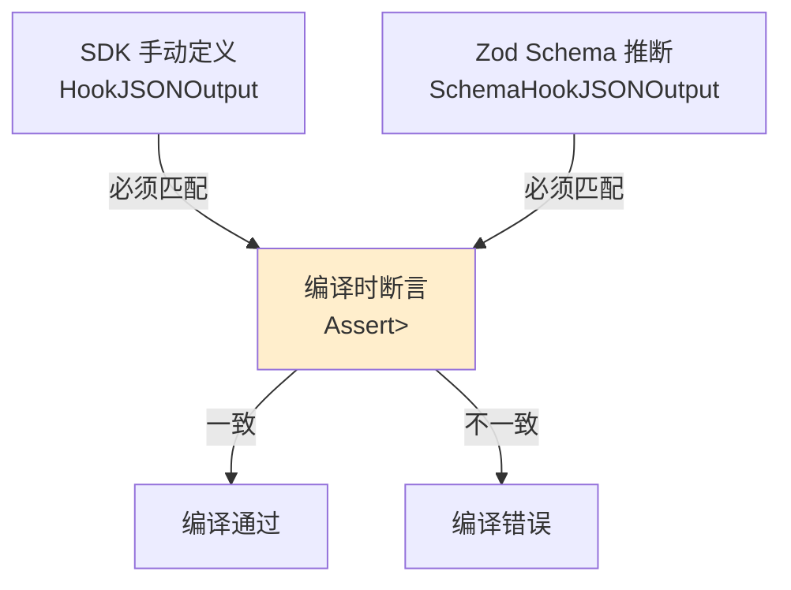

## 3.4 泛型工具类型：Tool<Input, Output, Progress>

`Tool` 类型是 Claude Code 类型系统的核心。它是一个三参数泛型类型，将输入验证、输出类型和进度报告统一在一个接口中：

```typescript
// src/Tool.ts
export type Tool<
  Input extends AnyObject = AnyObject,
  Output = unknown,
  P extends ToolProgressData = ToolProgressData,
> = {
  readonly name: string
  readonly inputSchema: Input

  call(
    args: z.infer<Input>,
    context: ToolUseContext,
    canUseTool: CanUseToolFn,
    parentMessage: AssistantMessage,
    onProgress?: ToolCallProgress<P>,
  ): Promise<ToolResult<Output>>

  description(
    input: z.infer<Input>,
    options: { /* ... */ },
  ): Promise<string>

  renderToolResultMessage?(
    content: Output,
    progressMessagesForMessage: ProgressMessage<P>[],
    options: { /* ... */ },
  ): React.ReactNode

  // ... 30+ 方法定义
}
```

三个类型参数的含义：

- **`Input extends AnyObject`**：工具输入的 Zod schema 类型。通过 `z.infer<Input>` 自动推断为 TypeScript 类型
- **`Output`**：工具执行结果的类型。不同工具有不同的输出结构
- **`P extends ToolProgressData`**：进度报告的类型。不同工具报告不同的进度信息

这种泛型设计确保了**方法签名之间的类型一致性**。例如，`call()` 方法返回 `ToolResult<Output>`，而 `renderToolResultMessage()` 接收 `Output` 类型的 `content` 参数 —— 编译器确保了产生结果和渲染结果使用相同的类型。

### buildTool 与 ToolDef

为了简化工具定义，Claude Code 引入了 `buildTool()` 工厂函数和 `ToolDef` 类型：

```typescript
// src/Tool.ts
type DefaultableToolKeys =
  | 'isEnabled'
  | 'isConcurrencySafe'
  | 'isReadOnly'
  | 'isDestructive'
  | 'checkPermissions'
  | 'toAutoClassifierInput'
  | 'userFacingName'

export type ToolDef<Input, Output, P> =
  Omit<Tool<Input, Output, P>, DefaultableToolKeys> &
  Partial<Pick<Tool<Input, Output, P>, DefaultableToolKeys>>
```

`ToolDef` 将 `Tool` 接口中的 7 个方法标记为可选。`buildTool()` 函数填充默认值：

```typescript
const TOOL_DEFAULTS = {
  isEnabled: () => true,
  isConcurrencySafe: (_input?: unknown) => false,  // 假设不安全
  isReadOnly: (_input?: unknown) => false,           // 假设有写操作
  isDestructive: (_input?: unknown) => false,
  checkPermissions: (input, _ctx?) =>
    Promise.resolve({ behavior: 'allow', updatedInput: input }),
  toAutoClassifierInput: (_input?: unknown) => '',
  userFacingName: (_input?: unknown) => '',
}

export function buildTool<D extends AnyToolDef>(def: D): BuiltTool<D> {
  return {
    ...TOOL_DEFAULTS,
    userFacingName: () => def.name,
    ...def,
  } as BuiltTool<D>
}
```

注意默认值的**安全倾向**设计：

- `isConcurrencySafe` 默认 `false`：假设工具不能并发执行（保守策略）
- `isReadOnly` 默认 `false`：假设工具有写操作（需要权限检查）
- `checkPermissions` 默认 `allow`：将权限决策交给通用权限系统

这种"安全默认"（fail-closed）的设计原则意味着：忘记实现某个方法不会导致安全漏洞，只会导致功能受限。

### BuiltTool 的类型级别 spread

`BuiltTool<D>` 的类型定义模拟了运行时的 `{ ...TOOL_DEFAULTS, ...def }` 操作：

```typescript
type BuiltTool<D> = Omit<D, DefaultableToolKeys> & {
  [K in DefaultableToolKeys]-?: K extends keyof D
    ? undefined extends D[K]
      ? ToolDefaults[K]     // D 中可选 → 使用默认值类型
      : D[K]                 // D 中必填 → 使用 D 的类型
    : ToolDefaults[K]        // D 中不存在 → 使用默认值类型
}
```

这段类型体操的核心是条件类型 `undefined extends D[K]` —— 它区分了"属性存在但可选"和"属性存在且必填"。这确保了当工具定义覆盖了某个默认方法时，返回类型精确反映覆盖后的签名。

## 3.5 判别联合类型

Claude Code 的消息系统和权限系统大量使用判别联合（Discriminated Union），通过 `type` 字段区分不同的消息/决策变体。

### 权限决策系统

`PermissionResult` 是一个经典的判别联合：

```typescript
// src/types/permissions.ts
export type PermissionResult<Input> =
  | PermissionAllowDecision<Input>
  | PermissionAskDecision<Input>
  | PermissionDenyDecision
  | { behavior: 'passthrough'; message: string; /* ... */ }
```

每个变体通过 `behavior` 字段判别：

```typescript
export type PermissionAllowDecision<Input> = {
  behavior: 'allow'
  updatedInput?: Input       // 可能修改后的输入
  userModified?: boolean     // 用户是否手动修改
  acceptFeedback?: string    // 用户接受时的反馈
  contentBlocks?: ContentBlockParam[]
}

export type PermissionAskDecision<Input> = {
  behavior: 'ask'
  message: string            // 询问用户的消息
  suggestions?: PermissionUpdate[]  // 建议的权限更新
  pendingClassifierCheck?: PendingClassifierCheck  // 异步分类器检查
}

export type PermissionDenyDecision = {
  behavior: 'deny'
  message: string            // 拒绝原因
  decisionReason: PermissionDecisionReason  // 必填：必须说明原因
}
```

注意类型设计中的**不对称性**：

- `allow` 的 `decisionReason` 是可选的（允许不需要解释）
- `deny` 的 `decisionReason` 是**必填的**（拒绝必须给出原因）
- `ask` 可以携带 `suggestions`（建议用户如何修改权限规则）

消费代码中的 narrowing：

```typescript
const result = await checkPermissions(input, context)

switch (result.behavior) {
  case 'allow':
    // TypeScript 知道 result 是 PermissionAllowDecision
    const finalInput = result.updatedInput ?? input
    break
  case 'ask':
    // TypeScript 知道 result 是 PermissionAskDecision
    showPrompt(result.message, result.suggestions)
    break
  case 'deny':
    // TypeScript 知道 result 是 PermissionDenyDecision
    logDenial(result.decisionReason)  // decisionReason 保证存在
    break
}
```

### PermissionDecisionReason 的深层判别

权限决策的原因本身也是一个判别联合，使用 `type` 字段：

```typescript
export type PermissionDecisionReason =
  | { type: 'rule'; rule: PermissionRule }
  | { type: 'mode'; mode: PermissionMode }
  | { type: 'subcommandResults'; reasons: Map<string, PermissionResult> }
  | { type: 'hook'; hookName: string; hookSource?: string; reason?: string }
  | { type: 'asyncAgent'; reason: string }
  | { type: 'sandboxOverride'; reason: 'excludedCommand' | 'dangerouslyDisableSandbox' }
  | { type: 'classifier'; classifier: string; reason: string }
  | { type: 'workingDir'; reason: string }
  | { type: 'safetyCheck'; reason: string; classifierApprovable: boolean }
  | { type: 'other'; reason: string }
```

这个类型精确表达了"一个权限决策可能由 10 种不同的原因产生"。`subcommandResults` 变体甚至包含了一个递归的 `PermissionResult` Map，用于表示 Bash 命令中子命令的权限结果组合。

`safetyCheck` 变体中的 `classifierApprovable` 布尔字段是一个精细的安全决策标记：

```typescript
{
  type: 'safetyCheck'
  reason: string
  // 当为 true 时，auto 模式允许分类器评估而非强制弹窗
  // 对于敏感文件路径（.claude/, .git/, shell configs）为 true
  // 对于 Windows 路径绕过和跨机器 bridge 消息为 false
  classifierApprovable: boolean
}
```

### 工具搜索与读取操作的类型判别

`Tool` 接口中的 `isSearchOrReadCommand` 方法返回一个结构化的操作分类：

```typescript
isSearchOrReadCommand?(input: z.infer<Input>): {
  isSearch: boolean    // grep, find, glob 模式
  isRead: boolean      // cat, head, tail, 文件读取
  isList?: boolean     // ls, tree, du
}
```

这个返回类型不是布尔值，而是一个三维的操作分类。UI 层使用它来决定是否将连续的搜索/读取操作折叠为紧凑显示。`isList` 标记为可选是因为它是后加的 —— `isSearch` 和 `isRead` 在初始设计中就存在。

### Command 类型的联合设计

`src/types/command.ts` 中的 `Command` 类型展示了另一种判别联合模式 —— **基类 + 变体联合**：

```typescript
export type Command = CommandBase &
  (PromptCommand | LocalCommand | LocalJSXCommand)
```

`CommandBase` 定义了所有命令共享的属性（name, description, isEnabled 等），而联合部分通过 `type` 字段区分三种执行模式：

```typescript
type PromptCommand = {
  type: 'prompt'             // 发送给模型执行
  progressMessage: string
  getPromptForCommand(args: string, context: ToolUseContext):
    Promise<ContentBlockParam[]>
}

type LocalCommand = {
  type: 'local'              // 本地执行（无 UI）
  supportsNonInteractive: boolean
  load: () => Promise<LocalCommandModule>
}

type LocalJSXCommand = {
  type: 'local-jsx'          // 本地执行（有 UI）
  load: () => Promise<LocalJSXCommandModule>
}
```

`PromptCommand` 是斜杠命令（如技能和插件）的类型：它们被转换为 prompt 发送给模型。`LocalCommand` 和 `LocalJSXCommand` 是本地执行的命令：前者是纯逻辑命令，后者需要渲染 React 组件。

注意 `load()` 方法的延迟加载设计：命令的实现代码只在用户实际调用时才加载，避免了注册数十个命令带来的启动开销。

## 3.6 类型系统作为架构文档

回顾本章讨论的类型设计，可以提炼出几条贯穿整个代码库的设计原则：

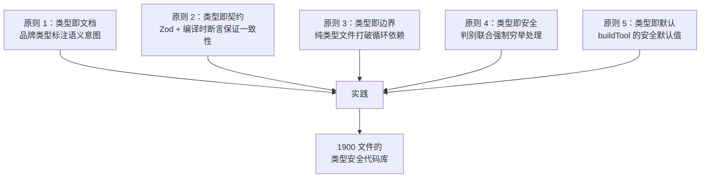

**1. 使不合法状态不可表示**（Make illegal states unrepresentable）。`SessionId` 和 `AgentId` 的品牌类型使得混淆两者在编译时就会被捕获。`PermissionDenyDecision` 的必填 `decisionReason` 使得"无理由拒绝"在类型层面不可能。

**2. 用编译时断言桥接两个类型世界**。当 Zod schema 和 SDK 类型并存时，`Assert<IsEqual<A, B>>` 确保它们永远一致。

**3. 将运行时验证与静态类型统一**。Zod 的 `z.infer<T>` 让 schema 和类型共享同一个真相来源，避免了手动维护两份定义的同步问题。

**4. 通过纯类型文件实现架构解耦**。`types/` 目录不包含运行时代码，这使得它可以被任何模块安全导入，而不会引入运行时依赖。

**5. 安全默认与显式覆盖**。`buildTool()` 的默认值选择了保守的安全策略（不可并发、非只读、交由通用权限系统），工具实现者必须显式声明更宽松的行为。

## 本章小结

Claude Code 的类型系统不是简单的"给 JavaScript 加类型注解"。它是一个精心设计的、多层次的类型架构：

1. **底层**：品牌类型和 DeepImmutable 提供编译时安全保障
2. **中层**：纯类型文件和重新导出解决循环依赖和模块边界问题
3. **上层**：Zod schema 和判别联合实现运行时验证和穷举性检查
4. **工具层**：泛型 Tool 接口和 buildTool 工厂函数统一了 40+ 工具的类型契约

这套类型系统的设计使得一个 1900 文件的代码库能够在快速迭代中保持结构完整性 —— 类型检查器充当了永不休息的架构审查员。


\\newpage

# 第 4 章：查询引擎

> "一个优秀的引擎设计，不在于它能跑多快，而在于它在出错时仍能保持可控。"

查询引擎（Query Engine）是 Claude Code 整个交互循环的心脏。无论用户是通过命令行 REPL 输入一条提示，还是通过 SDK 以编程方式发送消息，最终都会汇入同一条河流——`QueryEngine.submitMessage()` 方法。本章将深入剖析这一核心组件的设计哲学、状态管理与错误恢复机制。

## 4.1 QueryEngine 类

### 设计目标与职责划分

`QueryEngine` 的文件头注释道出了它的设计意图：

```typescript
/**
 * QueryEngine owns the query lifecycle and session state for a conversation.
 * It extracts the core logic from ask() into a standalone class that can be
 * used by both the headless/SDK path and (in a future phase) the REPL.
 *
 * One QueryEngine per conversation. Each submitMessage() call starts a new
 * turn within the same conversation. State (messages, file cache, usage, etc.)
 * persists across turns.
 */
export class QueryEngine {
```

这段注释揭示了三个关键设计决策：

1. **一个对话一个实例**：每个 `QueryEngine` 实例绑定一个完整的对话会话，状态在多轮交互之间持久化。
2. **从 ask() 提取**：它是从早期的 `ask()` 函数中重构而来，将会话状态从函数闭包提升为类字段。
3. **统一抽象**：SDK 和 REPL 共享同一个引擎，消除了两套代码路径的维护负担。

### 核心字段

```typescript
export class QueryEngine {
  private config: QueryEngineConfig
  private mutableMessages: Message[]
  private abortController: AbortController
  private permissionDenials: SDKPermissionDenial[]
  private totalUsage: NonNullableUsage
  private hasHandledOrphanedPermission = false
  private readFileState: FileStateCache
  private discoveredSkillNames = new Set<string>()
  private loadedNestedMemoryPaths = new Set<string>()
```

让我们逐一分析这些字段的设计考量：

**`mutableMessages: Message[]`** 是整个对话的消息历史，它贯穿多次 `submitMessage()` 调用。注意这里使用了 `mutable` 前缀——这是有意为之的命名。在函数式风格占主导的代码库中，显式标记可变状态是一种防御性编程实践。每次用户输入处理完成后，新消息通过 `push()` 追加：

```typescript
this.mutableMessages.push(...messagesFromUserInput)
```

**`readFileState: FileStateCache`** 缓存了已读取文件的状态，用于避免重复读取和检测文件变更。在多轮工具调用中，同一文件可能被多次引用——缓存避免了不必要的磁盘 I/O。

**`totalUsage: NonNullableUsage`** 追踪整个会话的 API 使用量（input tokens、output tokens、缓存命中等）。初始化为 `EMPTY_USAGE`，在每次 API 调用后累加。

**`permissionDenials: SDKPermissionDenial[]`** 记录被拒绝的工具使用请求。这不仅用于 SDK 消费者的状态报告，也是安全审计的关键数据源。

**`discoveredSkillNames`** 跟踪当前 turn 中发现的技能名称，用于分析反馈。注意注释中强调它在每次 `submitMessage` 开头清空：

```typescript
// Turn-scoped skill discovery tracking. Must persist across the two
// processUserInputContext rebuilds inside submitMessage, but is cleared
// at the start of each submitMessage to avoid unbounded growth across
// many turns in SDK mode.
private discoveredSkillNames = new Set<string>()
```

### 配置对象

`QueryEngineConfig` 类型是一个庞大的配置结构，将引擎初始化所需的一切依赖注入其中：

```typescript
export type QueryEngineConfig = {
  cwd: string
  tools: Tools
  commands: Command[]
  mcpClients: MCPServerConnection[]
  agents: AgentDefinition[]
  canUseTool: CanUseToolFn
  getAppState: () => AppState
  setAppState: (f: (prev: AppState) => AppState) => void
  initialMessages?: Message[]
  readFileCache: FileStateCache
  customSystemPrompt?: string
  appendSystemPrompt?: string
  maxTurns?: number
  maxBudgetUsd?: number
  taskBudget?: { total: number }
  jsonSchema?: Record<string, unknown>
  // ...
}
```

这种"配置对象"模式（有别于构造函数参数列表）有两个好处：第一，可选参数不需要固定位置；第二，新增配置项不会破坏现有调用方。

值得特别关注的是 `snipReplay` 回调：

```typescript
snipReplay?: (
  yieldedSystemMsg: Message,
  store: Message[],
) => { messages: Message[]; executed: boolean } | undefined
```

注释解释了为什么将这个功能注入而非硬编码——`feature('HISTORY_SNIP')` 是编译时条件，在 bun test 环境下返回 false，如果在 QueryEngine 内直接引用被 tree-shake 掉的模块字符串，测试会中断。这是一个典型的"依赖倒置解决编译约束"案例。

## 4.2 submitMessage 流程

`submitMessage` 是 QueryEngine 的唯一公共方法——或者更准确地说，是唯一的公共 **AsyncGenerator**。这个选择意味着调用方不是获得一个 Promise，而是获得一个可以逐步消费的异步流。

### 完整生命周期

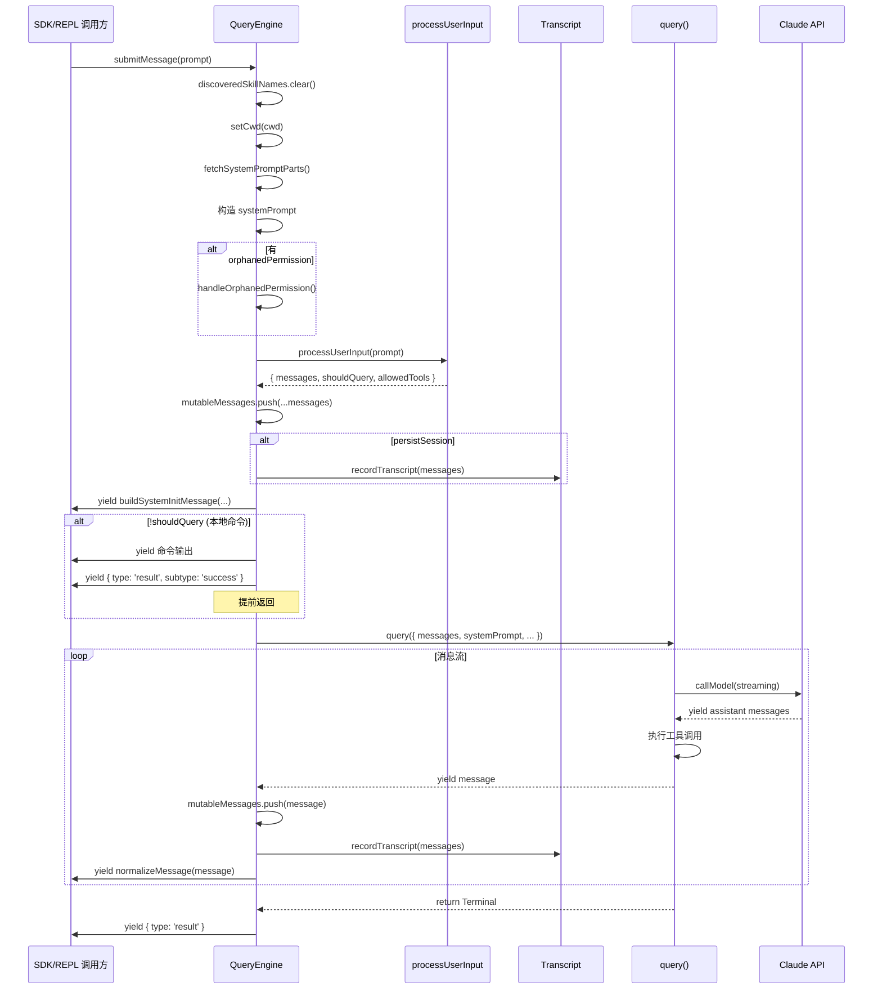

### 阶段一：上下文构建

`submitMessage` 的前半段是一个精心编排的上下文构建过程：

```typescript
const {
  defaultSystemPrompt,
  userContext: baseUserContext,
  systemContext,
} = await fetchSystemPromptParts({
  tools,
  mainLoopModel: initialMainLoopModel,
  additionalWorkingDirectories: Array.from(
    initialAppState.toolPermissionContext.additionalWorkingDirectories.keys(),
  ),
  mcpClients,
  customSystemPrompt: customPrompt,
})
```

系统提示由多个层次组成：默认系统提示、可选的自定义提示、内存机制提示和追加提示。它们通过 `asSystemPrompt()` 组合为最终的系统提示数组。

### 阶段二：用户输入处理

```typescript
const {
  messages: messagesFromUserInput,
  shouldQuery,
  allowedTools,
  model: modelFromUserInput,
  resultText,
} = await processUserInput({
  input: prompt,
  mode: 'prompt',
  // ...
})
```

`processUserInput` 负责将原始输入（可能是纯文本、斜杠命令或 ContentBlock 数组）转换为消息列表。如果是本地命令（如 `/compact`），`shouldQuery` 为 false，引擎不会调用 API。

### 阶段三：Transcript 预写

在进入查询循环之前，引擎将用户消息写入 transcript：

```typescript
if (persistSession && messagesFromUserInput.length > 0) {
  const transcriptPromise = recordTranscript(messages)
  if (isBareMode()) {
    void transcriptPromise  // fire-and-forget
  } else {
    await transcriptPromise
  }
}
```

这里有一个精妙的区分：在 `bare` 模式（脚本化调用）下不等待写入完成，因为这类场景不需要 `--resume` 能力。注释中甚至量化了性能影响："~4ms on SSD, ~30ms under disk contention"。

### 阶段四：查询循环

最终，引擎进入查询主循环：

```typescript
for await (const message of query({
  messages,
  systemPrompt,
  userContext,
  systemContext,
  canUseTool: wrappedCanUseTool,
  toolUseContext: processUserInputContext,
  fallbackModel,
  querySource: 'sdk',
  maxTurns,
  taskBudget,
})) {
  // 处理每个 yielded message...
}
```

`query()` 函数本身也是一个 AsyncGenerator——引擎在外层消费它的产出，同时向上层调用方再次 yield。这形成了一个 **Generator 管道**（我们将在第 6 章详细讨论）。

## 4.3 状态机模型

`query.ts` 中的 `queryLoop` 函数是一个显式的无限循环状态机。它的设计理念是：每次循环迭代要么以 `return` 终止（Terminal），要么以 `continue` 转向下一轮（Continue）。

### 状态定义

```typescript
type State = {
  messages: Message[]
  toolUseContext: ToolUseContext
  autoCompactTracking: AutoCompactTrackingState | undefined
  maxOutputTokensRecoveryCount: number
  hasAttemptedReactiveCompact: boolean
  maxOutputTokensOverride: number | undefined
  pendingToolUseSummary: Promise<ToolUseSummaryMessage | null> | undefined
  stopHookActive: boolean | undefined
  turnCount: number
  transition: Continue | undefined
}
```

`State` 是 queryLoop 的全部可变状态。每次 `continue` 都通过构建一个新的 `State` 对象来执行状态转换：

```typescript
const next: State = {
  messages: [...messagesForQuery, ...assistantMessages, ...toolResults],
  toolUseContext: toolUseContextWithQueryTracking,
  // ...
  transition: { reason: 'next_turn' },
}
state = next
```

### 状态转换图

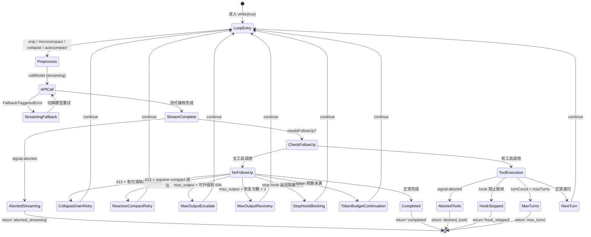

### Terminal 与 Continue 的类型约束

从源码中提取的所有终止原因（Terminal reasons）：

| reason | 触发条件 |
|--------|----------|
| `completed` | 模型正常完成回复（无工具调用） |
| `blocking_limit` | token 数超过硬性限制 |
| `aborted_streaming` | 用户中断（流式阶段） |
| `aborted_tools` | 用户中断（工具执行阶段） |
| `prompt_too_long` | 413 错误且无法恢复 |
| `image_error` | 图片/PDF 过大且无法恢复 |
| `model_error` | API 抛出非预期异常 |
| `stop_hook_prevented` | stop hook 明确阻止 |
| `hook_stopped` | 工具执行期间 hook 阻止 |
| `max_turns` | 达到最大轮次限制 |

Continue 转换原因：

| reason | 含义 |
|--------|------|
| `next_turn` | 正常的工具调用后递归 |
| `collapse_drain_retry` | 清除 context collapse 后重试 |
| `reactive_compact_retry` | reactive compact 后重试 |
| `max_output_tokens_escalate` | 从 8k 升级到 64k 重试 |
| `max_output_tokens_recovery` | 注入恢复消息后继续 |
| `stop_hook_blocking` | stop hook 错误后重试 |
| `token_budget_continuation` | token 预算内继续 |

`transition` 字段记录了上一次迭代的 Continue 原因，让下一次迭代能根据历史做出不同决策——例如，`collapse_drain_retry` 只尝试一次，如果重试后仍然 413，则退回到 reactive compact。

## 4.4 Token 预算

### BudgetTracker 机制

`src/query/tokenBudget.ts` 实现了一个轻量级的 token 预算追踪器：

```typescript
export type BudgetTracker = {
  continuationCount: number
  lastDeltaTokens: number
  lastGlobalTurnTokens: number
  startedAt: number
}

export function createBudgetTracker(): BudgetTracker {
  return {
    continuationCount: 0,
    lastDeltaTokens: 0,
    lastGlobalTurnTokens: 0,
    startedAt: Date.now(),
  }
}
```

预算检查在模型完成回复（无工具调用）时触发：

```typescript
export function checkTokenBudget(
  tracker: BudgetTracker,
  agentId: string | undefined,
  budget: number | null,
  globalTurnTokens: number,
): TokenBudgetDecision {
  if (agentId || budget === null || budget <= 0) {
    return { action: 'stop', completionEvent: null }
  }

  const turnTokens = globalTurnTokens
  const pct = Math.round((turnTokens / budget) * 100)
  const deltaSinceLastCheck = globalTurnTokens - tracker.lastGlobalTurnTokens

  const isDiminishing =
    tracker.continuationCount >= 3 &&
    deltaSinceLastCheck < DIMINISHING_THRESHOLD &&
    tracker.lastDeltaTokens < DIMINISHING_THRESHOLD

  if (!isDiminishing && turnTokens < budget * COMPLETION_THRESHOLD) {
    // 继续
    tracker.continuationCount++
    return { action: 'continue', nudgeMessage: ... }
  }
  // 停止
}
```

这个算法有三个关键阈值：

- **`COMPLETION_THRESHOLD = 0.9`**：当已使用 token 达到预算的 90% 时停止。
- **`DIMINISHING_THRESHOLD = 500`**：如果连续两次迭代的增量都小于 500 token，判定为"收益递减"。
- **连续检查次数 >= 3**：收益递减判定需要至少 3 次 continuation 历史。

### 子代理排除

注意第一个条件：`if (agentId || ...)`——子代理（subagent）不参与 token 预算。这是因为子代理有自己独立的生命周期，由父级的 `maxTurns` 控制。

### 与 task_budget 的区别

源码中有两种不同的"预算"概念：

1. **tokenBudget**：客户端侧的输出 token 追踪，通过 `checkTokenBudget` 在 queryLoop 内决策是否继续。
2. **taskBudget**：API 服务端的 `output_config.task_budget`，通过请求参数传递给服务端。跨越 compaction 边界时需要计算 `remaining`。

```typescript
// task_budget.remaining tracking across compaction boundaries.
// While context is uncompacted the server sees the full history
// and handles the countdown from {total} itself. After a compact,
// the server sees only the summary and would under-count spend.
let taskBudgetRemaining: number | undefined = undefined
```

## 4.5 错误恢复

Claude Code 的查询引擎实现了多层错误恢复策略，每一层都有明确的职责边界。

### max_output_tokens 恢复

当模型输出被截断（`apiError === 'max_output_tokens'`），引擎执行两阶段恢复：

**阶段一：升级输出限制**

如果当前使用的是默认的 8k 限制，且功能开关允许，引擎将 `maxOutputTokensOverride` 设置为 `ESCALATED_MAX_TOKENS`（64k）并重试同一请求：

```typescript
if (capEnabled && maxOutputTokensOverride === undefined) {
  const next: State = {
    // ...
    maxOutputTokensOverride: ESCALATED_MAX_TOKENS,
    transition: { reason: 'max_output_tokens_escalate' },
  }
  state = next
  continue
}
```

**阶段二：多轮恢复**

如果升级后仍然截断，引擎注入一条特殊的 meta 消息，引导模型继续输出：

```typescript
if (maxOutputTokensRecoveryCount < MAX_OUTPUT_TOKENS_RECOVERY_LIMIT) {
  const recoveryMessage = createUserMessage({
    content:
      `Output token limit hit. Resume directly — no apology, no recap. ` +
      `Pick up mid-thought if that is where the cut happened. ` +
      `Break remaining work into smaller pieces.`,
    isMeta: true,
  })
  // ...
}
```

`MAX_OUTPUT_TOKENS_RECOVERY_LIMIT = 3` 意味着最多重试 3 次。消息中的措辞是经过精心设计的——"no apology, no recap" 防止模型浪费 token 重复已说过的内容。

### Prompt-too-long 恢复链

当上下文超出模型窗口限制（HTTP 413），恢复链按优先级执行：

1. **Context Collapse 清除**（最轻量）：清除暂存的 collapse 操作，释放上下文空间。
2. **Reactive Compact**（全量压缩）：如果 collapse 不够，执行完整的上下文压缩。
3. **错误表面化**：如果压缩后仍然超限，向用户展示错误。

```typescript
if (isWithheld413) {
  // 第一步：drain collapses
  if (state.transition?.reason !== 'collapse_drain_retry') {
    const drained = contextCollapse.recoverFromOverflow(...)
    if (drained.committed > 0) {
      state = { ..., transition: { reason: 'collapse_drain_retry' } }
      continue
    }
  }
}
// 第二步：reactive compact
if ((isWithheld413 || isWithheldMedia) && reactiveCompact) {
  const compacted = await reactiveCompact.tryReactiveCompact({
    hasAttempted: hasAttemptedReactiveCompact,
    // ...
  })
}
```

### 模型降级回退

当主模型不可用时，引擎自动切换到备用模型：

```typescript
try {
  for await (const message of deps.callModel({...})) {
    // ...
  }
} catch (innerError) {
  if (innerError instanceof FallbackTriggeredError && fallbackModel) {
    currentModel = fallbackModel
    attemptWithFallback = true
    // 清理并重试
  }
}
```

降级过程中有一个关键细节——thinking 签名是模型绑定的：

```typescript
// Thinking signatures are model-bound: replaying a protected-thinking
// block (e.g. capybara) to an unprotected fallback (e.g. opus) 400s.
if (process.env.USER_TYPE === 'ant') {
  messagesForQuery = stripSignatureBlocks(messagesForQuery)
}
```

### 错误消息的"扣留"机制

查询引擎使用一种"扣留"（withhold）模式处理可恢复的错误：

```typescript
let withheld = false
if (reactiveCompact?.isWithheldPromptTooLong(message)) {
  withheld = true
}
if (isWithheldMaxOutputTokens(message)) {
  withheld = true
}
if (!withheld) {
  yield yieldMessage
}
```

被扣留的消息不会立即 yield 给调用方。只有当所有恢复手段用尽后，才将错误消息表面化。这防止了 SDK 消费者在恢复成功时收到虚假的错误信号。

## 4.6 SDK vs REPL

QueryEngine 通过构造函数参数的差异化实现了 SDK 和 REPL 两种模式的统一：

### SDK 模式

在 SDK 模式下，`QueryEngine` 是完全无头的（headless）：

```typescript
processUserInputContext = {
  // ...
  options: {
    debug: false,          // 不输出调试信息到 stdout
    isNonInteractiveSession: true,  // 标记为非交互
  },
  setInProgressToolUseIDs: () => {},   // 不需要 UI 更新
  setResponseLength: () => {},          // 不需要实时长度显示
}
```

SDK 调用方通过 `for await...of` 消费 `submitMessage` 的产出，每个 `SDKMessage` 都是自包含的——包括类型标签、session ID 和所有必要的元数据。

### REPL 模式

REPL 模式下，消息同时流向两个目标：

1. **UI 渲染**：通过 React/Ink 组件实时渲染到终端。
2. **状态持久化**：通过 `recordTranscript` 写入 JSONL 文件。

关键区别在于 snip 处理：

```typescript
/**
 * SDK-only: the REPL keeps full history for UI scrollback and
 * projects on demand via projectSnippedView; QueryEngine truncates
 * here to bound memory in long headless sessions (no UI to preserve).
 */
snipReplay?: (
  yieldedSystemMsg: Message,
  store: Message[],
) => { messages: Message[]; executed: boolean } | undefined
```

REPL 保留完整历史用于滚动回看，snip 只是一个"视图投影"；而 SDK 模式下，snip 会实际截断 `mutableMessages` 数组以控制内存。

### 权限追踪包装

两种模式共享同一个权限包装器：

```typescript
const wrappedCanUseTool: CanUseToolFn = async (
  tool, input, toolUseContext, assistantMessage, toolUseID, forceDecision,
) => {
  const result = await canUseTool(...)
  if (result.behavior !== 'allow') {
    this.permissionDenials.push({
      tool_name: sdkCompatToolName(tool.name),
      tool_use_id: toolUseID,
      tool_input: input,
    })
  }
  return result
}
```

被拒绝的权限请求被收集到 `permissionDenials` 数组中，最终包含在 `result` 消息的 `permission_denials` 字段中返回给 SDK 调用方。REPL 模式下，这些信息同样可用于权限审计和调试。

### 统一的生命周期信号

无论哪种模式，查询结束时都会 yield 一个统一的结果消息：

```typescript
yield {
  type: 'result',
  subtype: 'success',
  is_error: false,
  duration_ms: Date.now() - startTime,
  duration_api_ms: getTotalAPIDuration(),
  num_turns: messages.length - 1,
  result: resultText ?? '',
  total_cost_usd: getTotalCost(),
  usage: this.totalUsage,
  modelUsage: getModelUsage(),
  permission_denials: this.permissionDenials,
  fast_mode_state: getFastModeState(mainLoopModel, initialAppState.fastMode),
  // ...
}
```

这个 `result` 消息是查询引擎的"最终裁决"——它汇总了整个查询轮次的耗时、成本、token 使用量和权限事件，为上层（无论是 SDK 的 JSON 输出还是 REPL 的状态栏更新）提供了完整的查询报告。


\\newpage

# 第 5 章：消息系统

> "在一个以对话为核心的系统中，消息类型的设计就是系统架构的缩影。"

Claude Code 的消息系统远不止于"用户说了什么、助手回复了什么"的简单交替。它是一个精心分层的类型体系，涵盖了从流式事件到工具结果、从进度通知到墓碑标记的完整生命周期。本章将从类型定义出发，深入到工厂函数、序列化、持久化和 API 归一化的全过程。

## 5.1 消息类型层次

### 核心联合类型

Claude Code 的消息系统建立在一个判别式联合类型（discriminated union）之上。从 `src/query.ts` 的导入可以看出完整的类型全貌：

```typescript
import type {
  AssistantMessage,
  AttachmentMessage,
  Message,
  RequestStartEvent,
  StreamEvent,
  ToolUseSummaryMessage,
  UserMessage,
  TombstoneMessage,
} from './types/message.js'
```

`Message` 是所有消息类型的联合：

```mermaid
classDiagram
    class Message {
        <<union>>
    }

    class UserMessage {
        +type: "user"
        +uuid: UUID
        +timestamp: string
        +message.role: "user"
        +message.content: string | ContentBlockParam[]
        +isMeta?: true
        +isVirtual?: true
        +isCompactSummary?: true
        +toolUseResult?: unknown
        +sourceToolAssistantUUID?: UUID
        +permissionMode?: PermissionMode
        +origin?: MessageOrigin
        +imagePasteIds?: number[]
    }

    class AssistantMessage {
        +type: "assistant"
        +uuid: UUID
        +timestamp: string
        +message.role: "assistant"
        +message.content: ContentBlock[]
        +message.usage: Usage
        +message.model: string
        +message.stop_reason: string
        +requestId?: string
        +apiError?: string
        +error?: SDKAssistantMessageError
        +isApiErrorMessage: boolean
        +isVirtual?: true
        +advisorModel?: string
    }

    class SystemMessage {
        +type: "system"
        +subtype: string
        +uuid: UUID
        +timestamp: string
        +content?: string
    }

    class ProgressMessage {
        +type: "progress"
        +uuid: UUID
        +timestamp: string
        +toolUseID: string
        +parentToolUseID: string
        +data: Progress
    }

    class AttachmentMessage {
        +type: "attachment"
        +uuid: UUID
        +timestamp: string
        +attachment: Attachment
    }

    class TombstoneMessage {
        +type: "tombstone"
        +message: AssistantMessage
    }

    class StreamEvent {
        +type: "stream_event"
        +event: MessageStreamEvent
    }

    class RequestStartEvent {
        +type: "stream_request_start"
    }

    class ToolUseSummaryMessage {
        +type: "tool_use_summary"
        +uuid: UUID
        +summary: string
        +toolUseIds: string[]
    }

    Message <|-- UserMessage
    Message <|-- AssistantMessage
    Message <|-- SystemMessage
    Message <|-- ProgressMessage
    Message <|-- AttachmentMessage

    SystemMessage <|-- SystemCompactBoundaryMessage
    SystemMessage <|-- SystemLocalCommandMessage
    SystemMessage <|-- SystemAPIErrorMessage
    SystemMessage <|-- SystemInformationalMessage
    SystemMessage <|-- SystemMicrocompactBoundaryMessage
    SystemMessage <|-- SystemMemorySavedMessage
    SystemMessage <|-- SystemStopHookSummaryMessage
    SystemMessage <|-- SystemTurnDurationMessage
    SystemMessage <|-- SystemPermissionRetryMessage
    SystemMessage <|-- SystemBridgeStatusMessage
    SystemMessage <|-- SystemAwaySummaryMessage
    SystemMessage <|-- SystemApiMetricsMessage
    SystemMessage <|-- SystemScheduledTaskFireMessage
    SystemMessage <|-- SystemAgentsKilledMessage
```

### 判别字段

`type` 字段是主判别器。在处理消息的 switch 语句中，TypeScript 的控制流分析可以精确推断每个分支的类型：

```typescript
switch (message.type) {
  case 'tombstone':
    // message: TombstoneMessage
    break
  case 'assistant':
    // message: AssistantMessage
    this.mutableMessages.push(message)
    yield* normalizeMessage(message)
    break
  case 'progress':
    // message: ProgressMessage
    break
  case 'user':
    // message: UserMessage
    break
  case 'stream_event':
    // message: StreamEvent
    break
}
```

### UserMessage 的多面性

`UserMessage` 是系统中最多态的类型。同一个 `type: "user"` 下承载了截然不同的语义：

**人类输入**：用户在终端或 SDK 中输入的文本。

**工具结果**：模型的工具调用执行后返回的结果，通过 `tool_result` content block 标识。`toolUseResult` 字段存储原始输出，`sourceToolAssistantUUID` 指向触发这次工具调用的 assistant 消息。

**Meta 消息**：`isMeta: true` 标记的消息不会在 UI 中显示给用户，仅供模型消费。典型用例包括：
- 系统注入的警告提示
- max_output_tokens 恢复指令
- compact 后的摘要

**虚拟消息**：`isVirtual: true` 标记的消息存在于内存中用于 UI 渲染，但在发送给 API 时被过滤掉。

这种设计将所有"用户角色"（API 层面 role="user"）的消息统一到一个类型下，避免了 API 协议的 user/assistant 交替规则被破坏。

### AssistantMessage 的丰富元数据

```typescript
function baseCreateAssistantMessage({
  content,
  isApiErrorMessage = false,
  apiError,
  error,
  errorDetails,
  isVirtual,
  usage = {
    input_tokens: 0,
    output_tokens: 0,
    cache_creation_input_tokens: 0,
    cache_read_input_tokens: 0,
    server_tool_use: { web_search_requests: 0, web_fetch_requests: 0 },
    service_tier: null,
    cache_creation: {
      ephemeral_1h_input_tokens: 0,
      ephemeral_5m_input_tokens: 0,
    },
    inference_geo: null,
    iterations: null,
    speed: null,
  },
}: ...): AssistantMessage {
  return {
    type: 'assistant',
    uuid: randomUUID(),
    timestamp: new Date().toISOString(),
    message: {
      id: randomUUID(),
      container: null,
      model: SYNTHETIC_MODEL,
      role: 'assistant',
      stop_reason: 'stop_sequence',
      stop_sequence: '',
      type: 'message',
      usage,
      content,
      context_management: null,
    },
    requestId: undefined,
    apiError,
    error,
    errorDetails,
    isApiErrorMessage,
    isVirtual,
  }
}
```

注意 `usage` 的默认值结构——它镜像了 Claude API 响应的完整 usage 对象，包括缓存统计、服务层级、推理地理位置甚至迭代次数。合成消息（如错误消息）使用 `SYNTHETIC_MODEL = '<synthetic>'` 作为模型标识，这让下游的 `isSyntheticApiErrorMessage` 检查成为可能。

### TombstoneMessage：消息的墓碑

```typescript
// Tombstone messages are control signals for removing messages
case 'tombstone':
  break
```

当模型降级回退（streaming fallback）发生时，之前的 partial assistant 消息已经 yield 给了 UI。为了"撤回"这些消息，引擎发射 tombstone：

```typescript
for (const msg of assistantMessages) {
  yield { type: 'tombstone' as const, message: msg }
}
```

UI 层接收到 tombstone 后，应从显示列表中移除对应的消息。这是一种事件溯源（event sourcing）模式——不是直接修改历史，而是追加一个"删除"事件。

### SystemMessage 的子类型体系

SystemMessage 通过 `subtype` 字段进一步细分：

- `compact_boundary`：标记压缩边界，用于 --resume 恢复
- `local_command`：本地命令（如 /compact）的输出
- `api_error`：API 错误通知
- `informational`：一般性信息
- `microcompact_boundary`：微压缩边界
- `memory_saved`：内存保存通知
- `stop_hook_summary`：stop hook 执行摘要
- `turn_duration`：轮次耗时统计
- `api_metrics`：API 性能指标
- `permission_retry`：权限重试通知
- `bridge_status`：桥接状态变更
- `away_summary`：离开期间摘要
- `agents_killed`：代理终止通知
- `scheduled_task_fire`：定时任务触发

这种扁平的子类型枚举（而非深层继承）让 pattern matching 保持简洁，同时避免了面向对象继承链的刚性约束。

## 5.2 消息创建与序列化

### 工厂函数体系

Claude Code 不直接构造消息对象，而是通过一组工厂函数确保每条消息都满足不变量。

**createUserMessage** 是使用最频繁的工厂函数：

```typescript
export function createUserMessage({
  content,
  isMeta,
  isVisibleInTranscriptOnly,
  isVirtual,
  isCompactSummary,
  toolUseResult,
  mcpMeta,
  uuid,
  timestamp,
  imagePasteIds,
  sourceToolAssistantUUID,
  permissionMode,
  origin,
  // ...
}: { ... }): UserMessage {
  const m: UserMessage = {
    type: 'user',
    message: {
      role: 'user',
      content: content || NO_CONTENT_MESSAGE,
    },
    isMeta,
    isVisibleInTranscriptOnly,
    isVirtual,
    isCompactSummary,
    uuid: (uuid as UUID | undefined) || randomUUID(),
    timestamp: timestamp ?? new Date().toISOString(),
    toolUseResult,
    mcpMeta,
    imagePasteIds,
    sourceToolAssistantUUID,
    permissionMode,
    origin,
  }
  return m
}
```

关键不变量：
1. `content` 为空时替换为 `NO_CONTENT_MESSAGE`，防止向 API 发送空消息。
2. `uuid` 如果未提供则自动生成，确保每条消息都有唯一标识。
3. `timestamp` 如果未提供则使用当前时间。

**createAssistantMessage** 和 **createAssistantAPIErrorMessage** 分别用于正常回复和错误回复：

```typescript
export function createAssistantMessage({
  content,
  usage,
  isVirtual,
}: { ... }): AssistantMessage {
  return baseCreateAssistantMessage({
    content:
      typeof content === 'string'
        ? [{ type: 'text', text: content === '' ? NO_CONTENT_MESSAGE : content }]
        : content,
    usage,
    isVirtual,
  })
}
```

注意字符串到 ContentBlock 数组的自动转换——调用方可以传入纯文本，工厂函数会将其包装为 `[{ type: 'text', text: ... }]`。

**createProgressMessage** 创建工具执行进度消息：

```typescript
export function createProgressMessage<P extends Progress>({
  toolUseID,
  parentToolUseID,
  data,
}: { ... }): ProgressMessage<P> {
  return {
    type: 'progress',
    data,
    toolUseID,
    parentToolUseID,
    uuid: randomUUID(),
    timestamp: new Date().toISOString(),
  }
}
```

Progress 是泛型参数——不同工具可以定义自己的进度数据结构，类型安全地传递给 UI 层。

### 合成消息常量

系统定义了一组固定的合成消息文本：

```typescript
export const INTERRUPT_MESSAGE = '[Request interrupted by user]'
export const CANCEL_MESSAGE =
  "The user doesn't want to take this action right now. ..."
export const REJECT_MESSAGE =
  "The user doesn't want to proceed with this tool use. ..."

export const SYNTHETIC_MESSAGES = new Set([
  INTERRUPT_MESSAGE,
  INTERRUPT_MESSAGE_FOR_TOOL_USE,
  CANCEL_MESSAGE,
  REJECT_MESSAGE,
  NO_RESPONSE_REQUESTED,
])
```

`SYNTHETIC_MESSAGES` 集合用于 `isSyntheticMessage` 检查——这些消息是系统生成的控制信号，不应被计入用户消息统计。

### 确定性 UUID 派生

当消息需要拆分（normalizeMessages）时，子消息的 UUID 不是随机生成的，而是从父 UUID 确定性派生的：

```typescript
export function deriveUUID(parentUUID: UUID, index: number): UUID {
  const hex = index.toString(16).padStart(12, '0')
  return `${parentUUID.slice(0, 24)}${hex}` as UUID
}
```

这意味着同一条消息在不同时刻拆分总是产生相同的子 UUID，这对于 transcript 的一致性和 `--resume` 功能至关重要。

## 5.3 工具结果消息

### tool_result 的编码

工具执行结果被编码为 `UserMessage`，其 `content` 字段包含一个 `tool_result` content block：

```typescript
createUserMessage({
  content: [
    {
      type: 'tool_result',
      content: resultContent,
      is_error: isError,
      tool_use_id: toolUseBlock.id,
    },
  ],
  toolUseResult: originalOutput,
  sourceToolAssistantUUID: assistantMessage.uuid,
})
```

这里存在一个重要的双重存储：
- `content[0].content`：发送给 API 的序列化结果（字符串或 content block 数组）。
- `toolUseResult`：工具的原始输出（保持原始类型），用于 UI 渲染和 HFI 数据提取。

### 合成工具结果占位符

当工具执行被中断，或 API 调用意外抛出异常，可能出现 `tool_use` 没有对应 `tool_result` 的情况。`yieldMissingToolResultBlocks` 函数处理这个"悬空配对"问题：

```typescript
function* yieldMissingToolResultBlocks(
  assistantMessages: AssistantMessage[],
  errorMessage: string,
) {
  for (const assistantMessage of assistantMessages) {
    const toolUseBlocks = assistantMessage.message.content.filter(
      content => content.type === 'tool_use',
    ) as ToolUseBlock[]

    for (const toolUse of toolUseBlocks) {
      yield createUserMessage({
        content: [
          {
            type: 'tool_result',
            content: errorMessage,
            is_error: true,
            tool_use_id: toolUse.id,
          },
        ],
        toolUseResult: errorMessage,
        sourceToolAssistantUUID: assistantMessage.uuid,
      })
    }
  }
}
```

占位符的存在有一个训练数据安全影响：

```typescript
// Exported so HFI submission can reject any payload containing it —
// placeholder satisfies pairing structurally but the content is fake,
// which poisons training data if submitted.
export const SYNTHETIC_TOOL_RESULT_PLACEHOLDER =
  '[Tool result missing due to internal error]'
```

### 权限拒绝的精细消息

工具被拒绝时，消息根据上下文有不同的表述：

```typescript
// 用户手动拒绝
export const REJECT_MESSAGE =
  "The user doesn't want to proceed with this tool use. The tool use was rejected..."

// 子代理内的拒绝（无用户交互）
export const SUBAGENT_REJECT_MESSAGE =
  'Permission for this tool use was denied. The tool use was rejected...'

// 自动模式分类器拒绝
export function buildYoloRejectionMessage(reason: string): string {
  return `${AUTO_MODE_REJECTION_PREFIX}${reason}. ` +
    `If you have other tasks that don't depend on this action, continue working on those. ` +
    `${DENIAL_WORKAROUND_GUIDANCE} ` + ruleHint
}
```

`DENIAL_WORKAROUND_GUIDANCE` 是一段精心撰写的指导文本：

```typescript
export const DENIAL_WORKAROUND_GUIDANCE =
  `IMPORTANT: You *may* attempt to accomplish this action using other tools ` +
  `that might naturally be used to accomplish this goal, ` +
  `e.g. using head instead of cat. But you *should not* attempt to work ` +
  `around this denial in malicious ways...`
```

这段文本在安全工程和用户体验之间取得平衡——允许模型寻找合理替代方案，但明确禁止恶意绕过。

### 消息创建与工具结果的数据流

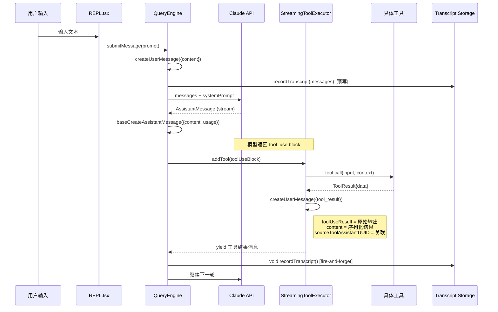

### 消息归一化管线

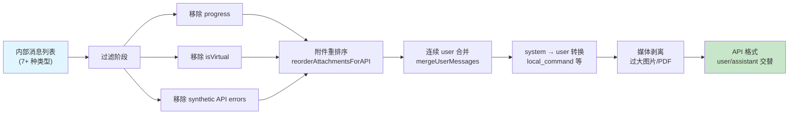

## 5.4 消息持久化

### Transcript 录制机制

Claude Code 使用 JSONL（JSON Lines）格式将对话消息持久化到磁盘。核心入口是 `recordTranscript` 函数：

```typescript
export async function recordTranscript(
  messages: Message[],
  teamInfo?: TeamInfo,
  startingParentUuidHint?: UUID,
  allMessages?: readonly Message[],
): Promise<UUID | null> {
  const cleanedMessages = cleanMessagesForLogging(messages, allMessages)
  const sessionId = getSessionId() as UUID
  const messageSet = await getSessionMessages(sessionId)
  const newMessages: typeof cleanedMessages = []
  let startingParentUuid: UUID | undefined = startingParentUuidHint
  let seenNewMessage = false
  for (const m of cleanedMessages) {
    if (messageSet.has(m.uuid as UUID)) {
      if (!seenNewMessage && isChainParticipant(m)) {
        startingParentUuid = m.uuid as UUID
      }
    } else {
      newMessages.push(m)
      seenNewMessage = true
    }
  }
  if (newMessages.length > 0) {
    await getProject().insertMessageChain(
      newMessages,
      false,
      undefined,
      startingParentUuid,
      teamInfo,
    )
  }
  return (lastRecorded?.uuid as UUID | undefined) ?? startingParentUuid ?? null
}
```

这个函数有几个关键的设计决策：

**增量录制**：通过 `messageSet` 跟踪已录制的消息 UUID，每次只写入新消息。这避免了在长对话中反复序列化整个历史。

**父链追踪**：`startingParentUuid` 维护消息之间的因果链。这对于 `--resume` 恢复和分支管理至关重要。

**前缀检测**：已录制消息只有在形成前缀时才更新 `startingParentUuid`。这处理了 compaction 场景——新的 compact boundary 和摘要消息出现在保留消息之前，不应被视为父链的一部分。

### Crashproof 设计

消息持久化的时序经过精心设计以实现崩溃安全：

```typescript
// 用户消息在进入查询循环之前写入
if (persistSession && messagesFromUserInput.length > 0) {
  const transcriptPromise = recordTranscript(messages)
  if (isBareMode()) {
    void transcriptPromise  // fire-and-forget for scripts
  } else {
    await transcriptPromise  // block for interactive sessions
  }
}
```

注释中详细解释了为什么用户消息必须在 API 调用之前写入：

```
// If the process is killed before that (e.g. user clicks Stop in cowork
// seconds after send), the transcript is left with only queue-operation
// entries; getLastSessionLog filters those out, returns null, and --resume
// fails with "No conversation found".
```

对于 assistant 消息，策略不同——使用 fire-and-forget：

```typescript
if (message.type === 'assistant') {
  void recordTranscript(messages)  // fire-and-forget
} else {
  await recordTranscript(messages)  // await for user messages
}
```

原因是 `claude.ts` 的流式机制——它 yield 一个 assistant 消息后会 mutate 该消息的 `usage` 和 `stop_reason` 字段。如果 await 写入，后续的 `message_delta` 事件就无法及时处理。写入队列的 100ms 延迟 jsonStringify 自然处理了这个竞态。

### Compact Boundary 的持久化

压缩边界需要特殊处理——在写入 compact boundary 之前，必须确保保留段的尾部消息已经写入：

```typescript
if (message.type === 'system' && message.subtype === 'compact_boundary') {
  const tailUuid = message.compactMetadata?.preservedSegment?.tailUuid
  if (tailUuid) {
    const tailIdx = this.mutableMessages.findLastIndex(
      m => m.uuid === tailUuid,
    )
    if (tailIdx !== -1) {
      await recordTranscript(this.mutableMessages.slice(0, tailIdx + 1))
    }
  }
}
```

如果跳过这一步，`--resume` 恢复时 `applyPreservedSegmentRelinks` 的 tail-to-head 遍历会因找不到已录制的尾部消息而失败。

## 5.5 消息归一化

### normalizeMessagesForAPI

`normalizeMessagesForAPI` 是消息发送给 API 前的最后一道转换。它的职责是将内部的丰富消息类型映射为 Claude API 接受的 user/assistant 交替格式。

```typescript
export function normalizeMessagesForAPI(
  messages: Message[],
  tools: Tools = [],
): (UserMessage | AssistantMessage)[] {
  const availableToolNames = new Set(tools.map(t => t.name))

  const reorderedMessages = reorderAttachmentsForAPI(messages).filter(
    m => !((m.type === 'user' || m.type === 'assistant') && m.isVirtual),
  )
```

转换过程包含多个阶段：

**第一阶段：过滤**

- 移除 `progress` 消息（仅用于 UI）
- 移除虚拟消息（`isVirtual: true`）
- 移除合成 API 错误消息（`isSyntheticApiErrorMessage`）

**第二阶段：附件重排序**

`reorderAttachmentsForAPI` 将 attachment 消息上移到它们相关的 tool_result 之前，因为 API 要求 user 消息不能出现在 tool_result 之间。

**第三阶段：连续 user 消息合并**

Bedrock API 不支持连续的 user 消息（1P API 支持但会自动合并），所以归一化函数主动合并它们：

```typescript
case 'user': {
  const lastMessage = last(result)
  if (lastMessage?.type === 'user') {
    result[result.length - 1] = mergeUserMessages(lastMessage, userMsg)
    return
  }
  result.push(userMsg)
  return
}
```

**第四阶段：System 消息转 User 消息**

`local_command` 类型的系统消息需要转换为 user 消息，因为 API 不接受 system role 的中间消息：

```typescript
case 'system': {
  const userMsg = createUserMessage({
    content: message.content,
    uuid: message.uuid,
    timestamp: message.timestamp,
  })
  // ...
}
```

**第五阶段：错误引起的媒体剥离**

如果之前的 API 调用因为图片/PDF 过大而失败，归一化函数会从对应的 user 消息中剥离这些媒体块，防止重复触发同样的错误：

```typescript
const typesToStrip = stripTargets.get(normalizedMessage.uuid)
if (typesToStrip && normalizedMessage.isMeta) {
  const content = normalizedMessage.message.content
  if (Array.isArray(content)) {
    const filtered = content.filter(
      block => !typesToStrip.has(block.type),
    )
    // ...
  }
}
```

### normalizeMessages（UI 归一化）

与 API 归一化不同，UI 归一化（`normalizeMessages`）将多 content block 的消息拆分为每条消息一个 block：

```typescript
export function normalizeMessages(messages: Message[]): NormalizedMessage[] {
  let isNewChain = false
  return messages.flatMap(message => {
    switch (message.type) {
      case 'assistant': {
        isNewChain = isNewChain || message.message.content.length > 1
        return message.message.content.map((_, index) => {
          const uuid = isNewChain
            ? deriveUUID(message.uuid, index)
            : message.uuid
          return {
            type: 'assistant',
            message: { ...message.message, content: [_] },
            uuid,
            // ...
          }
        })
      }
      // ...
    }
  })
}
```

`isNewChain` 标志确保一旦发生拆分，后续所有消息的 UUID 都重新派生。这维护了 UUID 的唯一性不变量——不会出现两条消息共享同一个 UUID 的情况。

### reorderMessagesInUI

UI 渲染需要的消息顺序与 API 不同。`reorderMessagesInUI` 将工具调用相关的消息按逻辑分组：

```
tool_use -> pre_hooks -> tool_result -> post_hooks
```

而非按时间顺序。这让用户看到的是一个完整的"工具调用故事"，而非零散的交错事件。

```typescript
// First pass: group messages by tool use ID
for (const message of messages) {
  if (isToolUseRequestMessage(message)) {
    toolUseGroups.set(toolUseID, {
      toolUse: null,
      preHooks: [],
      toolResult: null,
      postHooks: [],
    })
  }
}

// Second pass: reconstruct in logical order
for (const message of messages) {
  if (isToolUseRequestMessage(message)) {
    const group = toolUseGroups.get(toolUseID)
    result.push(group.toolUse)
    result.push(...group.preHooks)
    if (group.toolResult) result.push(group.toolResult)
    result.push(...group.postHooks)
  }
}
```

这种两遍扫描算法（first pass: group, second pass: reconstruct）在保持 O(n) 时间复杂度的同时，实现了任意交错消息的正确重排。


\\newpage

# 第 6 章：流式处理

> "在异步世界中，数据流的控制权比数据本身更重要。"

Claude Code 选择了 AsyncGenerator 作为其核心的流式数据传输范式。这不是一个随意的技术选型——它在背压控制、组合性、取消传播和类型安全四个维度上，都优于传统的 Callback 和 EventEmitter 模式。本章将从设计动机出发，深入分析流式响应的接收、工具执行的进度反馈、Generator 的组合与取消机制。

## 6.1 AsyncGenerator 范式

### 为什么不是 Callback？

Callback 模式是最原始的异步通知机制。如果用 callback 实现查询引擎，接口大致如下：

```typescript
// 假想的 callback 接口
function query(params: QueryParams, callbacks: {
  onAssistantMessage: (msg: AssistantMessage) => void
  onToolResult: (msg: UserMessage) => void
  onProgress: (msg: ProgressMessage) => void
  onError: (err: Error) => void
  onComplete: (terminal: Terminal) => void
}): void
```

这种模式的问题在于：
1. **调用方无法控制速度**：生产者不等消费者处理完就继续推送。
2. **取消困难**：需要额外的机制（如返回一个 cancel 函数）。
3. **组合困难**：嵌套 callback 导致"回调地狱"。
4. **返回值丢失**：`Terminal` 只能通过 callback 传递，不能用 `return`。

### 为什么不是 Promise？

Promise 表示单个异步值。查询引擎需要在一次调用中产生多个中间结果——assistant 消息、进度更新、工具结果——Promise 无法表达这种"多次产出"语义。可以用 `Promise<Message[]>` 返回所有消息的数组，但这要求等待查询完全结束才能开始处理，对于可能持续数十秒的长查询来说，用户体验是不可接受的。

### AsyncGenerator 的优势

Claude Code 的核心查询接口：

```typescript
export async function* query(
  params: QueryParams,
): AsyncGenerator<
  | StreamEvent
  | RequestStartEvent
  | Message
  | TombstoneMessage
  | ToolUseSummaryMessage,
  Terminal
> {
```

AsyncGenerator 提供了四个关键能力：

**拉取式消费（Pull-based）**：消费者通过 `for await...of` 或 `.next()` 主动拉取下一个值。在消费者没有准备好时，生产者自然地暂停在 `yield` 点。这是隐式的背压控制。

**返回值语义**：Generator 函数的 `return` 值（`Terminal`）通过 `IteratorResult.value` 在完成时传递，与中间 yield 的值类型独立。`query()` 的签名中，yield 类型是消息联合，return 类型是 `Terminal`——调用方既能逐步消费中间消息，又能获得最终的终止原因。

**取消传播**：调用方在 `for await...of` 中 break 或抛出异常，Generator 会自动触发 `return()` 方法，执行清理逻辑。这与 `using` 声明和 `AbortController` 配合，构成完整的取消链。

**类型安全的组合**：`yield*` 委托在 TypeScript 中保留类型信息，允许将多个 Generator 串联。

## 6.2 API 流式响应

### 消息流的接收

API 流式响应在 `queryLoop` 的内层 `for await` 循环中处理：

```typescript
for await (const message of deps.callModel({
  messages: prependUserContext(messagesForQuery, userContext),
  systemPrompt: fullSystemPrompt,
  thinkingConfig: toolUseContext.options.thinkingConfig,
  tools: toolUseContext.options.tools,
  signal: toolUseContext.abortController.signal,
  options: {
    model: currentModel,
    fallbackModel,
    onStreamingFallback: () => {
      streamingFallbackOccured = true
    },
    querySource,
    // ...
  },
})) {
  // 处理每个流式事件
}
```

`deps.callModel`（实际上是 `queryModelWithStreaming`）本身也是一个 AsyncGenerator，它将 Claude API 的 SSE（Server-Sent Events）流转换为结构化的消息对象。

### 流式数据流图

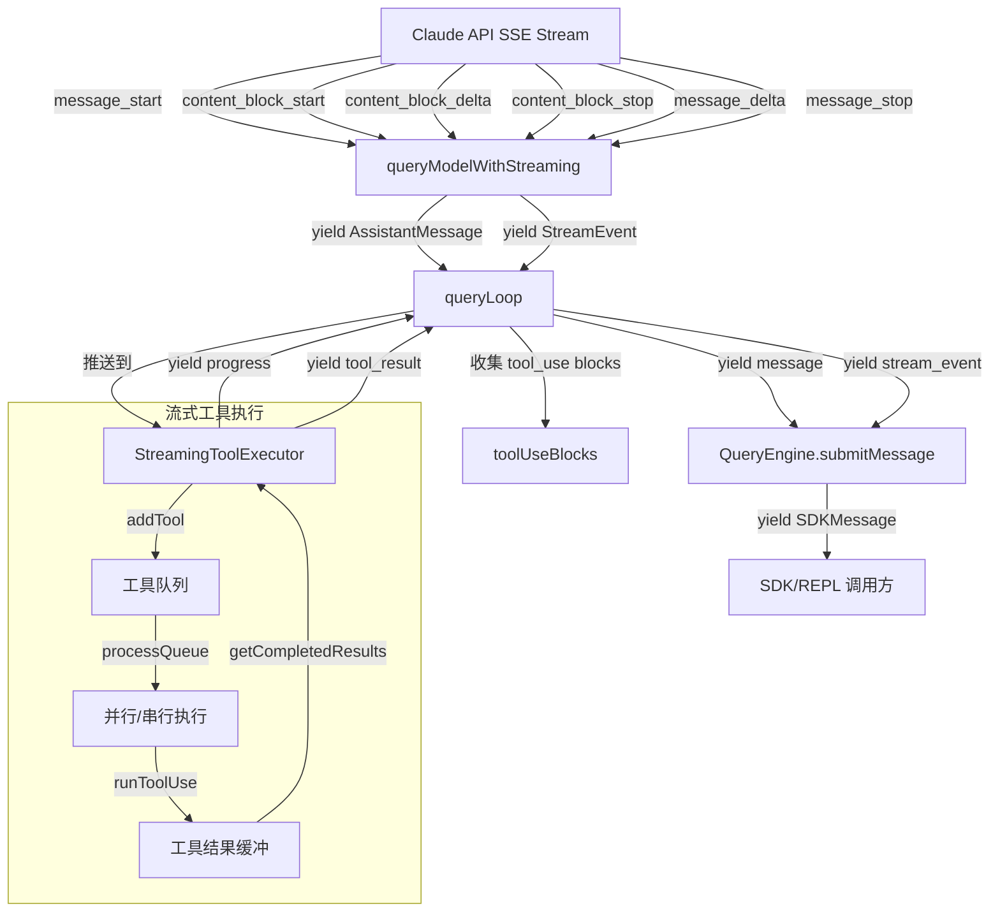

### 流中的消息降级处理

当流式接收过程中模型降级（fallback）发生，引擎需要处理已经 yield 出去的"孤儿"消息：

```typescript
if (streamingFallbackOccured) {
  // 发射墓碑以撤回已 yield 的 partial messages
  for (const msg of assistantMessages) {
    yield { type: 'tombstone' as const, message: msg }
  }

  // 清空所有状态
  assistantMessages.length = 0
  toolResults.length = 0
  toolUseBlocks.length = 0
  needsFollowUp = false

  // 废弃流式执行器并创建新的
  if (streamingToolExecutor) {
    streamingToolExecutor.discard()
    streamingToolExecutor = new StreamingToolExecutor(
      toolUseContext.options.tools,
      canUseTool,
      toolUseContext,
    )
  }
}
```

`discard()` 方法设置一个标志，阻止已入队的工具启动执行，已在执行中的工具收到合成错误：

```typescript
discard(): void {
  this.discarded = true
}
```

### 消息的"扣留"与延迟 yield

流式循环中有一个关键的"扣留"逻辑——某些错误消息不会立即 yield 给消费者：

```typescript
let withheld = false
if (reactiveCompact?.isWithheldPromptTooLong(message)) {
  withheld = true
}
if (isWithheldMaxOutputTokens(message)) {
  withheld = true
}
if (!withheld) {
  yield yieldMessage
}
```

被扣留的消息仍然被 push 到 `assistantMessages` 数组中，供流结束后的恢复逻辑检查。这种"先收集后决策"的模式避免了过早地向 SDK 消费者暴露可恢复的错误。

注释中专门解释了为什么 SDK 消费者不能看到这些中间错误：

```
// Yielding early leaks an intermediate error to SDK callers (e.g.
// cowork/desktop) that terminate the session on any `error` field —
// the recovery loop keeps running but nobody is listening.
```

## 6.3 工具执行进度流

### StreamingToolExecutor 架构

`StreamingToolExecutor` 是 Claude Code 中最精巧的并发控制器之一。它管理着工具的入队、并行执行、结果缓冲和进度传递。

```typescript
export class StreamingToolExecutor {
  private tools: TrackedTool[] = []
  private toolUseContext: ToolUseContext
  private hasErrored = false
  private siblingAbortController: AbortController
  private discarded = false
  private progressAvailableResolve?: () => void
```

每个工具被追踪为一个 `TrackedTool` 对象，拥有自己的生命周期状态：

```typescript
type ToolStatus = 'queued' | 'executing' | 'completed' | 'yielded'

type TrackedTool = {
  id: string
  block: ToolUseBlock
  assistantMessage: AssistantMessage
  status: ToolStatus
  isConcurrencySafe: boolean
  promise?: Promise<void>
  results?: Message[]
  pendingProgress: Message[]
  contextModifiers?: Array<(context: ToolUseContext) => ToolUseContext>
}
```

```mermaid
stateDiagram-v2
    [*] --> queued: addTool()
    queued --> executing: processQueue() + canExecuteTool()
    executing --> completed: 工具执行完成
    completed --> yielded: getCompletedResults()

    queued --> completed: 被中止（synthetic error）
    executing --> completed: 被兄弟工具错误中止

    note right of queued
        等待并发条件满足
    end note

    note right of executing
        进度消息实时传递
    end note
```

### 并发控制策略

并发安全性由工具自己声明：

```typescript
const parsedInput = toolDefinition.inputSchema.safeParse(block.input)
const isConcurrencySafe = parsedInput?.success
  ? (() => {
      try {
        return Boolean(toolDefinition.isConcurrencySafe(parsedInput.data))
      } catch {
        return false
      }
    })()
  : false
```

执行条件检查：

```typescript
private canExecuteTool(isConcurrencySafe: boolean): boolean {
  const executingTools = this.tools.filter(t => t.status === 'executing')
  return (
    executingTools.length === 0 ||
    (isConcurrencySafe && executingTools.every(t => t.isConcurrencySafe))
  )
}
```

规则很明确：
- 并发安全的工具可以与其他并发安全的工具并行。
- 非并发安全的工具必须独占执行——等待所有正在执行的工具完成后才能开始。

这意味着多个 `Read` 文件操作可以并行，但 `Bash` 命令会串行执行。

### 进度消息的即时传递

进度消息不经过结果缓冲区，而是通过独立的 `pendingProgress` 数组即时传递：

```typescript
for await (const update of generator) {
  if (update.message) {
    if (update.message.type === 'progress') {
      tool.pendingProgress.push(update.message)
      // 唤醒等待进度的消费者
      if (this.progressAvailableResolve) {
        this.progressAvailableResolve()
        this.progressAvailableResolve = undefined
      }
    } else {
      messages.push(update.message)
    }
  }
}
```

`getCompletedResults` 在每次调用时都先清空 pending progress：

```typescript
*getCompletedResults(): Generator<MessageUpdate, void> {
  for (const tool of this.tools) {
    // 先 yield 进度消息
    while (tool.pendingProgress.length > 0) {
      const progressMessage = tool.pendingProgress.shift()!
      yield { message: progressMessage, newContext: this.toolUseContext }
    }
    // 再 yield 完成结果（按序）
    if (tool.status === 'completed' && tool.results) {
      tool.status = 'yielded'
      for (const message of tool.results) {
        yield { message, newContext: this.toolUseContext }
      }
    }
  }
}
```

这确保了用户能实时看到工具的执行进度（如 Bash 命令的输出流），而最终结果仍然保持工具的入队顺序。

### 错误的级联中止

当一个 Bash 工具执行出错，`StreamingToolExecutor` 会级联中止所有兄弟工具：

```typescript
if (isErrorResult) {
  thisToolErrored = true
  if (tool.block.name === BASH_TOOL_NAME) {
    this.hasErrored = true
    this.erroredToolDescription = this.getToolDescription(tool)
    this.siblingAbortController.abort('sibling_error')
  }
}
```

注意只有 **Bash** 错误会触发级联中止。注释解释了原因：

```
// Only Bash errors cancel siblings. Bash commands often have implicit
// dependency chains (e.g. mkdir fails → subsequent commands pointless).
// Read/WebFetch/etc are independent — one failure shouldn't nuke the rest.
```

`siblingAbortController` 是 `toolUseContext.abortController` 的子控制器——中止兄弟工具不会中止整个查询循环。

## 6.4 Generator 组合

### yield* 委托

Claude Code 广泛使用 `yield*` 将 Generator 链式组合。`query()` 函数是第一层包装：

```typescript
export async function* query(
  params: QueryParams,
): AsyncGenerator<..., Terminal> {
  const consumedCommandUuids: string[] = []
  const terminal = yield* queryLoop(params, consumedCommandUuids)
  for (const uuid of consumedCommandUuids) {
    notifyCommandLifecycle(uuid, 'completed')
  }
  return terminal
}
```

`yield*` 的语义：将 `queryLoop` 的所有 yield 值透传给 `query` 的消费者，同时捕获 `queryLoop` 的 return 值（`Terminal`）赋给 `terminal`。

这种组合模式形成了一个三层 Generator 管道：

```
queryLoop (产生消息)
  ↓ yield*
query (后处理: command lifecycle)
  ↓ for await...of
QueryEngine.submitMessage (消息路由: transcript, SDK output)
  ↓ yield
SDK/REPL 调用方 (最终消费)
```

### Stop Hook 中的 Generator 委托

`handleStopHooks` 也是一个 AsyncGenerator，通过 `yield*` 在 queryLoop 中调用：

```typescript
const stopHookResult = yield* handleStopHooks(
  messagesForQuery,
  assistantMessages,
  systemPrompt,
  userContext,
  systemContext,
  toolUseContext,
  querySource,
  stopHookActive,
)
```

`handleStopHooks` 可能 yield 出额外的消息（如 hook 摘要、错误通知），这些消息自动透传给查询循环的消费者。同时，它的 return 值——`StopHookResult`——被解构用于控制流决策。

### 取消传播

Generator 的取消通过三种机制传播：

**1. AbortController 信号**

```typescript
const toolAbortController = createChildAbortController(
  this.siblingAbortController,
)
toolAbortController.signal.addEventListener('abort', () => {
  if (!this.toolUseContext.abortController.signal.aborted && !this.discarded) {
    this.toolUseContext.abortController.abort(toolAbortController.signal.reason)
  }
}, { once: true })
```

形成树状的 abort 传播：
```
toolUseContext.abortController (查询级)
  └─ siblingAbortController (工具批次级)
       └─ toolAbortController (单工具级)
```

**2. Generator.return()**

当 `for await...of` 循环被 `break` 或异常中断，Generator 的 `return()` 被自动调用。`using` 声明（如 `using pendingMemoryPrefetch = ...`）确保即使在异常退出路径上，资源清理也能执行。

**3. discarded 标志**

`StreamingToolExecutor.discard()` 不使用 abort 信号，而是设置一个简单的布尔标志：

```typescript
discard(): void {
  this.discarded = true
}
```

这比 abort 更轻量——被废弃的执行器只需要阻止新工具启动和停止结果产出，不需要中断正在运行的工具（那些工具的结果会被自然丢弃）。

## 6.5 背压控制

### 隐式背压

AsyncGenerator 的 pull-based 语义提供了天然的背压。考虑以下消费链：

```typescript
// QueryEngine.submitMessage
for await (const message of query({...})) {
  // 处理 message（可能涉及磁盘 I/O）
  if (persistSession) {
    await recordTranscript(messages)  // 阻塞
  }
  yield* normalizeMessage(message)    // 向上 yield
}
```

当 `recordTranscript` 执行磁盘写入时，`for await` 循环暂停，`query()` 的 Generator 在上一个 `yield` 点挂起，`queryModelWithStreaming` 的 Generator 也随之挂起。底层的 HTTP 流读取暂停，TCP 接收窗口填满，最终 API 服务端会降低发送速率。

这种从消费者到生产者的速率信号传播完全是隐式的——不需要任何显式的流量控制代码。

### 进度消息的无阻塞传递

然而，完全的背压并不总是理想的。进度消息不应阻塞工具执行——用户希望实时看到 Bash 命令的输出，即使 UI 层的渲染略有滞后。

`StreamingToolExecutor` 通过将进度消息存入独立的缓冲区来解决这个问题：

```typescript
// 工具执行中：进度不阻塞
if (update.message.type === 'progress') {
  tool.pendingProgress.push(update.message)
  if (this.progressAvailableResolve) {
    this.progressAvailableResolve()
  }
}
```

消费侧使用 `Promise.race` 实现非阻塞等待：

```typescript
async *getRemainingResults(): AsyncGenerator<MessageUpdate, void> {
  while (this.hasUnfinishedTools()) {
    await this.processQueue()

    for (const result of this.getCompletedResults()) {
      yield result
    }

    if (this.hasExecutingTools() && !this.hasCompletedResults()
        && !this.hasPendingProgress()) {
      const executingPromises = this.tools
        .filter(t => t.status === 'executing' && t.promise)
        .map(t => t.promise!)

      const progressPromise = new Promise<void>(resolve => {
        this.progressAvailableResolve = resolve
      })

      await Promise.race([...executingPromises, progressPromise])
    }
  }
}
```

`Promise.race` 确保只要有工具完成或有进度可用，循环就会唤醒——不会因为某个长时间运行的工具而阻塞其他工具的进度报告。

### 内存管理

长时间运行的查询会在 `mutableMessages` 中累积大量消息。Claude Code 使用多种策略控制内存增长：

**Snip Compact**：在 `HISTORY_SNIP` 功能开启时，旧消息被裁剪：

```typescript
if (feature('HISTORY_SNIP')) {
  const snipResult = snipModule!.snipCompactIfNeeded(messagesForQuery)
  messagesForQuery = snipResult.messages
  snipTokensFreed = snipResult.tokensFreed
}
```

**Tool Result Budget**：工具结果的大小受限：

```typescript
messagesForQuery = await applyToolResultBudget(
  messagesForQuery,
  toolUseContext.contentReplacementState,
  // ...
)
```

**Auto Compact**：当 token 数超过阈值时自动压缩：

```typescript
const { compactionResult } = await deps.autocompact(
  messagesForQuery,
  toolUseContext,
  { systemPrompt, userContext, systemContext, toolUseContext, forkContextMessages },
  querySource,
  tracking,
  snipTokensFreed,
)
```

**Fetch 闭包复用**：

```typescript
// Creating it once means only the latest request body is retained (~700KB),
// instead of all request bodies from the session (~500MB for long sessions).
const dumpPromptsFetch = config.gates.isAnt
  ? createDumpPromptsFetch(toolUseContext.agentId ?? config.sessionId)
  : undefined
```

注释中量化了这个优化的影响：从保留所有请求体（~500MB）到只保留最新的（~700KB）。

### Fire-and-forget 与 await 的选择

消息写入遵循一个明确的策略：

```typescript
// Assistant 消息：fire-and-forget
if (message.type === 'assistant') {
  void recordTranscript(messages)
}
// User 消息和 compact boundary：await
else {
  await recordTranscript(messages)
}
```

这是背压控制的一个精细调节：assistant 消息的 fire-and-forget 允许 API 流继续推进（避免流式更新被磁盘 I/O 阻塞），而 user 消息的 await 确保崩溃恢复的可靠性。写入队列的内部实现保证了顺序性——fire-and-forget 不会导致消息乱序。

### 流式工具执行与传统模式的抉择

查询循环中有一个运行时开关决定使用哪种工具执行模式：

```typescript
const useStreamingToolExecution = config.gates.streamingToolExecution
let streamingToolExecutor = useStreamingToolExecution
  ? new StreamingToolExecutor(
      toolUseContext.options.tools,
      canUseTool,
      toolUseContext,
    )
  : null
```

在流结束后，工具结果的收集也依据这个开关分叉：

```typescript
const toolUpdates = streamingToolExecutor
  ? streamingToolExecutor.getRemainingResults()
  : runTools(toolUseBlocks, assistantMessages, canUseTool, toolUseContext)
```

`runTools` 是传统的顺序执行路径——它本身也是一个 AsyncGenerator，但工具按顺序执行，不利用流式重叠。`StreamingToolExecutor` 则允许工具在 API 流仍在推送时就开始执行，显著减少了端到端延迟。

这种双轨设计体现了 Claude Code 的工程哲学——新特性通过功能开关渐进式发布，旧路径作为 fallback 保留，直到新路径经过充分验证。AsyncGenerator 的统一接口（`for await...of`）使得两种路径对消费者完全透明。


\\newpage

# 第 7 章：工具架构

> "好的架构允许重大决策推迟到最后一刻。" —— Robert C. Martin

Claude Code 的工具系统是整个交互循环中最关键的子系统。当模型决定调用一个工具时，控制权从 LLM 推理侧转移到宿主程序侧——文件被读写、命令被执行、网页被抓取。工具系统的设计直接决定了 Claude Code 的能力边界与安全底线。

本章将深入剖析工具系统的类型契约、工厂模式、依赖注入、注册发现和延迟加载五个层面，展示这套架构如何在保持极高可扩展性的同时实现"失败关闭"（fail-closed）的安全默认。

## 7.1 Tool 接口契约

### 7.1.1 接口全貌

Claude Code 的工具接口定义在 `src/Tool.ts` 中，是一个参数化的 TypeScript 泛型类型。该接口包含超过 30 个方法和属性，覆盖了工具生命周期的每一个阶段：输入验证、权限检查、执行、结果序列化和 UI 渲染。

```typescript
// src/Tool.ts（简化展示核心签名）
export type Tool<
  Input extends AnyObject = AnyObject,
  Output = unknown,
  P extends ToolProgressData = ToolProgressData,
> = {
  readonly name: string
  aliases?: string[]
  searchHint?: string
  readonly inputSchema: Input
  readonly inputJSONSchema?: ToolInputJSONSchema
  outputSchema?: z.ZodType<unknown>
  maxResultSizeChars: number
  readonly shouldDefer?: boolean
  readonly alwaysLoad?: boolean
  readonly strict?: boolean
  isMcp?: boolean
  isLsp?: boolean
  mcpInfo?: { serverName: string; toolName: string }

  // 生命周期方法
  call(args, context, canUseTool, parentMessage, onProgress?): Promise<ToolResult<Output>>
  description(input, options): Promise<string>
  prompt(options): Promise<string>
  validateInput?(input, context): Promise<ValidationResult>
  checkPermissions(input, context): Promise<PermissionResult>

  // 分类属性
  isConcurrencySafe(input): boolean
  isEnabled(): boolean
  isReadOnly(input): boolean
  isDestructive?(input): boolean
  interruptBehavior?(): 'cancel' | 'block'
  isSearchOrReadCommand?(input): { isSearch: boolean; isRead: boolean; isList?: boolean }
  isOpenWorld?(input): boolean
  requiresUserInteraction?(): boolean

  // 路径与权限
  getPath?(input): string
  preparePermissionMatcher?(input): Promise<(pattern: string) => boolean>
  backfillObservableInput?(input: Record<string, unknown>): void

  // UI 渲染（10+ 方法）
  userFacingName(input): string
  renderToolUseMessage(input, options): React.ReactNode
  renderToolResultMessage?(content, progressMessages, options): React.ReactNode
  renderToolUseProgressMessage?(progressMessages, options): React.ReactNode
  // ... 更多渲染方法

  // 序列化与分类器
  toAutoClassifierInput(input): unknown
  mapToolResultToToolResultBlockParam(content, toolUseID): ToolResultBlockParam
  inputsEquivalent?(a, b): boolean
}
```

这个接口的设计哲学体现了几个核心原则：

**原则一：输入驱动的属性推断。** 注意 `isConcurrencySafe`、`isReadOnly`、`isDestructive` 等方法都接收 `input` 参数。这意味着同一个工具可以根据不同输入表现出不同的安全特征。例如，`BashTool` 执行 `ls` 时是只读且并发安全的，但执行 `rm -rf /` 时是破坏性的。

**原则二：渲染与逻辑分离。** 接口中 UI 渲染方法占了近半数，包括 `renderToolUseMessage`、`renderToolResultMessage`、`renderToolUseProgressMessage`、`renderToolUseRejectedMessage`、`renderToolUseErrorMessage` 和 `renderGroupedToolUse` 等。每个工具完全掌控自己在终端中的呈现方式，这与 React 的组件化思想一脉相承。

**原则三：渐进式增强。** 大量方法标记为可选（`?`），工具可以只实现核心方法，让框架提供合理默认值。

### 7.1.2 核心方法详解

#### call —— 工具执行入口

```typescript
call(
  args: z.infer<Input>,
  context: ToolUseContext,
  canUseTool: CanUseToolFn,
  parentMessage: AssistantMessage,
  onProgress?: ToolCallProgress<P>,
): Promise<ToolResult<Output>>
```

`call` 是工具的核心执行方法。注意其返回类型 `ToolResult<Output>`：

```typescript
export type ToolResult<T> = {
  data: T
  newMessages?: (UserMessage | AssistantMessage | AttachmentMessage | SystemMessage)[]
  contextModifier?: (context: ToolUseContext) => ToolUseContext
  mcpMeta?: { _meta?: Record<string, unknown>; structuredContent?: Record<string, unknown> }
}
```

`ToolResult` 不仅包含工具输出数据，还可以携带新的消息（注入到对话历史中）和上下文修改器。这个 `contextModifier` 是一个精妙的设计——它允许非并发工具在执行后修改后续工具的执行环境。例如，一个切换目录的命令可以通过 `contextModifier` 更新后续工具看到的工作目录。

#### checkPermissions —— 权限闸门

```typescript
checkPermissions(
  input: z.infer<Input>,
  context: ToolUseContext,
): Promise<PermissionResult>
```

每个工具可以定义自己的权限检查逻辑。`PermissionResult` 的行为有三种：`allow`（允许执行）、`deny`（拒绝并告知原因）、`ask`（弹出交互式权限确认对话框）。这个方法只包含工具特有的逻辑，通用权限检查（如基于规则的匹配）在 `permissions.ts` 中处理。

#### isConcurrencySafe —— 并发安全标记

```typescript
isConcurrencySafe(input: z.infer<Input>): boolean
```

这个方法的返回值直接控制 `StreamingToolExecutor` 的调度策略。返回 `true` 的工具可以与其他并发安全工具并行执行；返回 `false` 的工具会独占执行槽位。稍后在第 9 章将详细分析调度器的工作原理。

#### isDestructive —— 破坏性标记

```typescript
isDestructive?(input: z.infer<Input>): boolean
```

注释说得很明确：*"Only set when the tool performs irreversible operations (delete, overwrite, send)."* 这个标记影响安全分类器的判断和 UI 的警告提示。

### 7.1.3 接口 UML 类图

```mermaid
classDiagram
    class Tool~Input, Output, P~ {
        <<interface>>
        +name: string
        +aliases?: string[]
        +searchHint?: string
        +inputSchema: Input
        +inputJSONSchema?: ToolInputJSONSchema
        +outputSchema?: ZodType
        +maxResultSizeChars: number
        +shouldDefer?: boolean
        +alwaysLoad?: boolean
        +strict?: boolean
        +isMcp?: boolean
        +mcpInfo?: McpInfo
        +call(args, context, canUseTool, parentMsg, onProgress?) ToolResult~Output~
        +description(input, options) string
        +prompt(options) string
        +validateInput?(input, context) ValidationResult
        +checkPermissions(input, context) PermissionResult
        +isConcurrencySafe(input) boolean
        +isEnabled() boolean
        +isReadOnly(input) boolean
        +isDestructive?(input) boolean
        +interruptBehavior?() cancel|block
        +isSearchOrReadCommand?(input) SearchReadResult
        +getPath?(input) string
        +preparePermissionMatcher?(input) MatcherFn
        +backfillObservableInput?(input) void
        +toAutoClassifierInput(input) unknown
        +userFacingName(input) string
        +mapToolResultToToolResultBlockParam(content, id) ToolResultBlockParam
        +renderToolUseMessage(input, options) ReactNode
        +renderToolResultMessage?(content, progress, options) ReactNode
        +renderToolUseProgressMessage?(progress, options) ReactNode
        +renderToolUseRejectedMessage?(input, options) ReactNode
        +renderToolUseErrorMessage?(result, options) ReactNode
        +renderGroupedToolUse?(toolUses, options) ReactNode
    }

    class ToolResult~T~ {
        +data: T
        +newMessages?: Message[]
        +contextModifier?: ContextModifierFn
        +mcpMeta?: McpMeta
    }

    class ToolDef~Input, Output, P~ {
        <<type>>
        Omit Tool without DefaultableKeys
        + Partial DefaultableKeys
    }

    class BuiltTool~D~ {
        <<type>>
        Omit D without DefaultableKeys
        + Required DefaultableKeys
    }

    Tool --> ToolResult : returns
    ToolDef --|> Tool : buildTool fills defaults
    BuiltTool --|> Tool : concrete tool type
```

## 7.2 buildTool 工厂 —— 失败关闭的默认值设计

### 7.2.1 设计动机

Claude Code 拥有 40+ 个内置工具，如果每个工具都必须实现 Tool 接口的全部 30+ 方法，代码将充斥着重复的样板。更危险的是，如果开发者忘记实现某个安全相关的方法，可能会留下安全漏洞。

`buildTool` 工厂函数的设计目标是：**让安全默认值自动生效，让开发者显式选择放宽。**

### 7.2.2 TOOL_DEFAULTS —— 失败关闭的守卫

```typescript
// src/Tool.ts
const TOOL_DEFAULTS = {
  isEnabled: () => true,
  isConcurrencySafe: (_input?: unknown) => false,    // 假定不安全
  isReadOnly: (_input?: unknown) => false,            // 假定会写入
  isDestructive: (_input?: unknown) => false,
  checkPermissions: (input, _ctx?) =>
    Promise.resolve({ behavior: 'allow', updatedInput: input }),
  toAutoClassifierInput: (_input?: unknown) => '',
  userFacingName: (_input?: unknown) => '',
}
```

这段代码的关键设计决策值得逐一分析：

| 默认值 | 值 | 安全含义 |
|--------|-----|---------|
| `isConcurrencySafe` | `false` | 新工具默认独占执行，不会与其他工具并发运行。这避免了潜在的竞态条件。 |
| `isReadOnly` | `false` | 新工具默认被视为有写操作。这确保权限系统不会错误地跳过写入检查。 |
| `isDestructive` | `false` | 这个看似违反"失败关闭"原则——新工具不会被标记为破坏性的。但这里的权衡是：将所有工具默认标记为破坏性会导致过多的用户确认弹窗，反而降低用户体验且造成"告警疲劳"。|
| `checkPermissions` | `allow` | 默认允许——工具级权限检查延迟到通用权限系统（`permissions.ts`）。这避免了工具漏实现 `checkPermissions` 就完全无法使用的问题。 |
| `toAutoClassifierInput` | `''`（空字符串） | 空字符串意味着该工具从安全分类器的视角被跳过。源码注释明确指出：*"skip classifier —— security-relevant tools must override"*。 |

### 7.2.3 buildTool 实现

```typescript
// src/Tool.ts
export function buildTool<D extends AnyToolDef>(def: D): BuiltTool<D> {
  return {
    ...TOOL_DEFAULTS,
    userFacingName: () => def.name,
    ...def,
  } as BuiltTool<D>
}
```

实现极为简洁——利用 JavaScript 对象展开的后值覆盖特性，工具定义中显式提供的方法会覆盖默认值。类型系统通过 `BuiltTool<D>` 保证结果始终是一个完整的 `Tool`。

### 7.2.4 DefaultableToolKeys —— 可省略的方法集

```typescript
type DefaultableToolKeys =
  | 'isEnabled'
  | 'isConcurrencySafe'
  | 'isReadOnly'
  | 'isDestructive'
  | 'checkPermissions'
  | 'toAutoClassifierInput'
  | 'userFacingName'
```

只有这 7 个方法被列为可省略。其他方法（如 `call`、`inputSchema`、`prompt`）是每个工具必须实现的——编译器会强制要求。

```mermaid
graph TD
    A[开发者定义 ToolDef] -->|省略 isConcurrencySafe| B[buildTool 工厂]
    A -->|省略 isReadOnly| B
    A -->|省略 checkPermissions| B
    B -->|注入 TOOL_DEFAULTS| C[完整的 Tool 对象]
    C -->|isConcurrencySafe = false| D[调度器独占执行]
    C -->|isReadOnly = false| E[权限系统检查写入]
    C -->|checkPermissions = allow| F[交由通用权限系统]

    style B fill:#f9f,stroke:#333,stroke-width:2px
    style D fill:#fbb,stroke:#333
    style E fill:#fbb,stroke:#333
```

## 7.3 ToolUseContext —— 依赖注入的核心载体

### 7.3.1 Context 的角色

在传统的面向对象设计中，工具可能是一个类实例，通过构造器注入依赖。Claude Code 选择了函数式的方式——每个工具的 `call` 方法接收一个 `ToolUseContext` 对象，其中包含了工具执行所需的全部上下文。

`ToolUseContext` 定义在 `src/Tool.ts` 中，是一个拥有 40+ 字段的大型结构体。这看似违反了"接口隔离原则"，但在 AI 编码工具的特殊场景下，这种设计有其合理性：工具需要的上下文是动态变化的（每次 API 调用可能有不同的配置），且工具之间共享大量上下文（如 MCP 客户端、权限配置、消息历史）。

### 7.3.2 Context 的核心字段分组

将 40+ 个字段按功能分组，可以看到清晰的层次结构：

**配置层（options）：**

```typescript
options: {
  commands: Command[]           // 可用斜杠命令
  debug: boolean                // 调试模式
  mainLoopModel: string         // 当前模型名称
  tools: Tools                  // 可用工具列表
  verbose: boolean              // 详细输出
  thinkingConfig: ThinkingConfig // 思考配置
  mcpClients: MCPServerConnection[] // MCP 服务器连接
  mcpResources: Record<string, ServerResource[]>
  isNonInteractiveSession: boolean  // 非交互模式（SDK/CI）
  agentDefinitions: AgentDefinitionsResult
  maxBudgetUsd?: number         // 成本预算上限
  customSystemPrompt?: string   // 自定义系统提示
  appendSystemPrompt?: string   // 追加系统提示
  refreshTools?: () => Tools    // 动态刷新工具列表
}
```

**状态管理层：**

```typescript
abortController: AbortController           // 取消信号
readFileState: FileStateCache              // 文件读取缓存
getAppState(): AppState                     // 获取全局状态
setAppState(f: (prev) => AppState): void   // 更新全局状态
setAppStateForTasks?: (f) => void          // 任务级状态更新（穿透子代理）
messages: Message[]                         // 对话消息历史
```

**UI 交互层：**

```typescript
setToolJSX?: SetToolJSXFn           // 自定义 JSX 渲染
addNotification?: (notif) => void    // 推送通知
appendSystemMessage?: (msg) => void  // 追加系统消息
sendOSNotification?: (opts) => void  // 系统级通知
setInProgressToolUseIDs: (f) => void // 标记进行中的工具
setHasInterruptibleToolInProgress?: (v) => void
setStreamMode?: (mode) => void       // 设置 spinner 模式
openMessageSelector?: () => void     // 打开消息选择器
```

**跟踪与遥测层：**

```typescript
setResponseLength: (f) => void      // 响应长度统计
pushApiMetricsEntry?: (ttftMs) => void // API 指标
updateFileHistoryState: (updater) => void
updateAttributionState: (updater) => void
queryTracking?: QueryChainTracking   // 查询链跟踪
toolDecisions?: Map<string, {...}>   // 工具决策记录
```

**子代理相关：**

```typescript
agentId?: AgentId            // 子代理 ID
agentType?: string           // 子代理类型
requireCanUseTool?: boolean  // 强制权限检查（推测执行用）
renderedSystemPrompt?: SystemPrompt // 父代理冻结的系统提示
localDenialTracking?: DenialTrackingState // 本地拒绝追踪
```

**内容管理层：**

```typescript
contentReplacementState?: ContentReplacementState  // 工具结果替换预算
fileReadingLimits?: { maxTokens?; maxSizeBytes? }  // 文件读取限制
globLimits?: { maxResults? }                        // Glob 结果限制
```

### 7.3.3 setAppState 与 setAppStateForTasks 的分裂

`ToolUseContext` 中有一个耐人寻味的设计——两个状态更新函数：

```typescript
setAppState(f: (prev: AppState) => AppState): void
setAppStateForTasks?: (f: (prev: AppState) => AppState) => void
```

注释解释了原因：

> *"Always-shared setAppState for session-scoped infrastructure (background tasks, session hooks). Unlike setAppState, which is no-op for async agents (see createSubagentContext), this always reaches the root store so agents at any nesting depth can register/clean up infrastructure that outlives a single turn."*

这是因为 Claude Code 支持多层嵌套的子代理（Agent 调用 Agent），每一层子代理有自己的 `ToolUseContext`。对于普通的状态更新，子代理的修改不应该泄漏到父代理；但对于全局基础设施（如后台任务注册），子代理必须能够穿透到根存储。这种双通道设计精确地解决了这个矛盾。

### 7.3.4 Context 传递的数据流

```mermaid
sequenceDiagram
    participant REPL as REPL.tsx
    participant Query as query.ts
    participant STE as StreamingToolExecutor
    participant TE as toolExecution.ts
    participant Tool as 具体工具

    REPL->>Query: 创建初始 ToolUseContext
    Note right of REPL: options, abortController,<br/>messages, setAppState...
    Query->>STE: new StreamingToolExecutor(tools, canUseTool, context)
    STE->>STE: addTool(block, assistantMessage)
    STE->>TE: runToolUse(block, assistantMessage, canUseTool, context)
    TE->>TE: 校验输入(zod safeParse)
    TE->>TE: runPreToolUseHooks
    TE->>TE: resolveHookPermissionDecision
    TE->>Tool: tool.call(input, context, canUseTool, msg, onProgress)
    Tool-->>TE: ToolResult { data, newMessages?, contextModifier? }
    TE->>TE: runPostToolUseHooks
    TE->>TE: processToolResultBlock(截断/持久化)
    TE-->>STE: yield MessageUpdate
    STE->>STE: 应用 contextModifier
    STE-->>Query: yield 结果消息
```

## 7.4 工具注册与发现 —— getAllBaseTools 函数的工具组装

### 7.4.1 工具注册表

Claude Code 没有使用装饰器模式或服务定位器模式来注册工具，而是采用了最直接的方式——在 `src/tools.ts` 中用一个函数显式列出所有工具：

```typescript
// src/tools.ts
export function getAllBaseTools(): Tools {
  return [
    AgentTool,
    TaskOutputTool,
    BashTool,
    ...(hasEmbeddedSearchTools() ? [] : [GlobTool, GrepTool]),
    ExitPlanModeV2Tool,
    FileReadTool,
    FileEditTool,
    FileWriteTool,
    NotebookEditTool,
    WebFetchTool,
    TodoWriteTool,
    WebSearchTool,
    TaskStopTool,
    AskUserQuestionTool,
    SkillTool,
    EnterPlanModeTool,
    ...(isTodoV2Enabled() ? [TaskCreateTool, TaskGetTool, TaskUpdateTool, TaskListTool] : []),
    ...(isWorktreeModeEnabled() ? [EnterWorktreeTool, ExitWorktreeTool] : []),
    ...(isToolSearchEnabledOptimistic() ? [ToolSearchTool] : []),
    // ... 更多条件工具
  ]
}
```

这种设计有几个重要特点：

**条件编译（Dead Code Elimination）。** 许多工具使用 `feature()` 标记进行条件加载：

```typescript
const REPLTool = process.env.USER_TYPE === 'ant'
  ? require('./tools/REPLTool/REPLTool.js').REPLTool
  : null

const SleepTool = feature('PROACTIVE') || feature('KAIROS')
  ? require('./tools/SleepTool/SleepTool.js').SleepTool
  : null
```

Bun 的打包器会在编译时对 `feature()` 调用求值，从而将未启用的工具完全从产物中删除。这不仅减少了包大小，还保证了未启用的功能不会泄漏任何代码路径。

**嵌入式搜索工具的去重。** 当内部构建（ant-native）内嵌了 bfs/ugrep 时，GlobTool 和 GrepTool 会被跳过：

```typescript
...(hasEmbeddedSearchTools() ? [] : [GlobTool, GrepTool]),
```

这是因为内嵌的搜索工具已经被别名到 shell 中的 `find` 和 `grep` 命令，GlobTool/GrepTool 就变得多余了。

### 7.4.2 工具池组装

`getAllBaseTools` 只是原始工具列表。实际交给模型使用的工具列表还要经过多层过滤：

```typescript
export function assembleToolPool(
  permissionContext: ToolPermissionContext,
  mcpTools: Tools,
): Tools {
  const builtInTools = getTools(permissionContext)         // 过滤后的内置工具
  const allowedMcpTools = filterToolsByDenyRules(mcpTools, permissionContext)  // 过滤后的 MCP 工具

  // 按名称排序以保证 prompt-cache 稳定性
  const byName = (a: Tool, b: Tool) => a.name.localeCompare(b.name)
  return uniqBy(
    [...builtInTools].sort(byName).concat(allowedMcpTools.sort(byName)),
    'name',
  )
}
```

注意这里的缓存稳定性设计：内置工具和 MCP 工具分别排序后拼接，内置工具作为前缀。源码注释解释了原因：

> *"The server's claude_code_system_cache_policy places a global cache breakpoint after the last prefix-matched built-in tool; a flat sort would interleave MCP tools into built-ins and invalidate all downstream cache keys whenever an MCP tool sorts between existing built-ins."*

这意味着 Anthropic 的 API 服务器会在系统提示中内置工具列表之后设置缓存断点。如果 MCP 工具穿插到内置工具之间，就会破坏这个缓存，导致每次 API 调用都需要重新处理整个工具列表。

### 7.4.3 过滤层次

```mermaid
graph TD
    A[getAllBaseTools<br/>40+ 工具] -->|feature 条件编译| B[条件工具过滤]
    B -->|isEnabled 检查| C[启用的工具]
    C -->|filterToolsByDenyRules| D[去除拒绝规则匹配的工具]
    D -->|REPL 模式过滤| E[隐藏 REPL 包装的原语工具]
    E -->|SIMPLE 模式过滤| F[仅保留 Bash/Read/Edit]
    F -->|assembleToolPool| G[合并 MCP 工具]
    G -->|uniqBy name| H[最终工具集]
    H -->|按名称排序| I[发送到 API]
```

## 7.5 延迟工具加载 —— ToolSearchTool 如何减少初始 prompt 大小

### 7.5.1 问题背景

Claude Code 支持大量工具——内置工具加上用户配置的 MCP 工具，总数很容易超过 50 个。每个工具的完整 JSON Schema 定义都要包含在系统提示中，这会消耗大量的上下文窗口空间。更关键的是，这些 token 会计入每次 API 调用的成本。

### 7.5.2 延迟加载机制

ToolSearchTool 实现了一个"按需加载"机制：

1. **初始加载时**，被标记为 `shouldDefer: true` 的工具只发送名称，不发送完整 schema
2. **模型需要时**，调用 `ToolSearch` 工具搜索并获取完整 schema
3. **后续调用**，已加载的工具 schema 对模型可见，可直接调用

```typescript
// src/tools/ToolSearchTool/prompt.ts
export function isDeferredTool(tool: Tool): boolean {
  // alwaysLoad 优先级最高——永不延迟
  if (tool.alwaysLoad) return false
  // MCP 工具始终延迟（工作流特定）
  if (tool.isMcp) return true
  // 工具自声明延迟
  return tool.shouldDefer === true
}
```

`ToolSearchTool` 支持三种查询模式：

```typescript
const inputSchema = z.object({
  query: z.string().describe(
    'Query to find deferred tools. Use "select:<tool_name>" for direct selection, ' +
    'or keywords to search.'
  ),
  max_results: z.number().optional().default(5),
})
```

- **精确选择**：`"select:Read,Edit,Grep"` —— 直接按名称获取
- **关键词搜索**：`"notebook jupyter"` —— 模糊匹配
- **名称约束搜索**：`"+slack send"` —— 要求名称包含 "slack"，按其余词排名

### 7.5.3 Schema 缺失检测

当模型尝试调用一个未加载 schema 的延迟工具时，输入参数往往会格式错误（因为模型没有看到参数定义）。`toolExecution.ts` 中有专门的检测逻辑：

```typescript
// src/services/tools/toolExecution.ts
export function buildSchemaNotSentHint(
  tool: Tool,
  messages: Message[],
  tools: readonly { name: string }[],
): string | null {
  if (!isToolSearchEnabledOptimistic()) return null
  if (!isToolSearchToolAvailable(tools)) return null
  if (!isDeferredTool(tool)) return null
  const discovered = extractDiscoveredToolNames(messages)
  if (discovered.has(tool.name)) return null
  return (
    `This tool's schema was not sent to the API... ` +
    `Load the tool first: call ${TOOL_SEARCH_TOOL_NAME} with query "select:${tool.name}"`
  )
}
```

这段代码会追加到 Zod 验证错误信息之后，引导模型先调用 ToolSearch 加载 schema 再重试。

### 7.5.4 缓存与性能

ToolSearchTool 使用 memoized 的工具描述缓存，并在延迟工具集变化时失效：

```typescript
const getToolDescriptionMemoized = memoize(
  async (toolName: string, tools: Tools): Promise<string> => {
    const tool = findToolByName(tools, toolName)
    if (!tool) return ''
    return tool.prompt({ /* 最小化参数 */ })
  },
  (toolName: string) => toolName,
)

function maybeInvalidateCache(deferredTools: Tools): void {
  const currentKey = getDeferredToolsCacheKey(deferredTools)
  if (cachedDeferredToolNames !== currentKey) {
    getToolDescriptionMemoized.cache.clear?.()
    cachedDeferredToolNames = currentKey
  }
}
```

### 7.5.5 延迟加载的工具分布

在当前代码库中，以下工具被标记为 `shouldDefer: true`：

| 工具 | 延迟原因 |
|------|---------|
| WebFetchTool | 非核心操作，使用频率低 |
| TaskCreateTool | 仅在 TodoV2 启用时有效 |
| TaskGetTool | 同上 |
| TaskUpdateTool | 同上 |
| TaskListTool | 同上 |
| 所有 MCP 工具 | 工作流特定，数量不可控 |

而以下工具通过 `alwaysLoad: true` 确保从不延迟（即使启用了 ToolSearch）：

- MCP 工具可通过 `_meta['anthropic/alwaysLoad']` 声明自己不应被延迟

```mermaid
graph LR
    subgraph 初始加载
        A[BashTool<br/>完整 schema]
        B[FileReadTool<br/>完整 schema]
        C[FileEditTool<br/>完整 schema]
        D[GlobTool<br/>完整 schema]
        E[GrepTool<br/>完整 schema]
        F[ToolSearchTool<br/>完整 schema]
    end

    subgraph 延迟加载
        G[WebFetchTool<br/>仅名称]
        H[TaskCreateTool<br/>仅名称]
        I[MCP工具1<br/>仅名称]
        J[MCP工具2<br/>仅名称]
    end

    F -->|select:WebFetchTool| G
    F -->|keyword search| H
    F -->|select:mcp__...| I

    style F fill:#ff9,stroke:#333,stroke-width:2px
    style G fill:#ddd,stroke:#999
    style H fill:#ddd,stroke:#999
    style I fill:#ddd,stroke:#999
    style J fill:#ddd,stroke:#999
```

## 本章小结

Claude Code 的工具架构通过以下设计决策构建了一个安全、可扩展、高性能的工具系统：

1. **泛型接口 + 输入驱动属性** —— 同一工具根据不同输入表现不同的安全特征
2. **buildTool 工厂 + 失败关闭默认值** —— 新工具自动获得保守的安全配置
3. **ToolUseContext 依赖注入** —— 40+ 字段的上下文对象承载了工具执行的全部环境
4. **显式注册 + 条件编译** —— 工具列表在编译时确定，死代码被完全消除
5. **ToolSearch 延迟加载** —— 按需加载 schema，在工具数量与 prompt 大小之间取得平衡

下一章将深入到具体工具的实现中，分析 BashTool 如何安全地执行 shell 命令、FileEditTool 如何保证编辑的原子性、以及 GrepTool 如何集成 Ripgrep 提供高速搜索。


\\newpage

# 第 8 章：内置工具深度解析

> "工具既是手的延伸，也是心智的延伸。" —— Marshall McLuhan

如果说 Tool 接口定义了工具的骨骼，那么具体的工具实现就是肌肉与血液。Claude Code 内置了超过 40 个工具，涵盖了 shell 执行、文件操作、代码搜索、网络访问和任务管理等核心能力。本章将选取最具代表性的工具进行深度剖析，揭示它们在安全性、性能和用户体验方面的精巧设计。

## 8.1 BashTool —— 最复杂的单一工具

### 8.1.1 复杂度概览

BashTool 是 Claude Code 中最复杂的单一工具。其实现涉及 18 个文件，从 `BashTool.tsx` 主文件到 `bashPermissions.ts`、`bashSecurity.ts`、`commandSemantics.ts`、`sedEditParser.ts`、`shouldUseSandbox.ts` 等辅助模块。这种复杂度源于 shell 命令执行在安全领域的特殊地位——它是所有工具中攻击面最大的。

```
src/tools/BashTool/
├── BashTool.tsx              # 主实现（schema 定义、call 方法、UI 渲染）
├── bashPermissions.ts        # 权限检查：命令解析、规则匹配、分类器
├── bashSecurity.ts           # 安全检查：命令安全性评估
├── commandSemantics.ts       # 命令语义解释（退出码含义）
├── sedEditParser.ts          # sed 命令特殊处理（作为文件编辑）
├── readOnlyValidation.ts     # 只读约束检查
├── modeValidation.ts         # 模式验证
├── pathValidation.ts         # 路径安全检查
├── sedValidation.ts          # sed 命令验证
├── shouldUseSandbox.ts       # 沙箱判断逻辑
├── bashCommandHelpers.ts     # 复合命令辅助函数
├── destructiveCommandWarning.ts # 破坏性命令警告
├── prompt.ts                 # 系统提示生成
├── toolName.ts               # 工具名称常量
├── commentLabel.ts           # 注释标签
├── utils.ts                  # 通用工具函数
├── UI.tsx                    # React UI 组件
└── BashToolResultMessage.tsx # 结果展示组件
```

### 8.1.2 输入 Schema

BashTool 的输入 schema 经过精心设计，包含多个字段：

```typescript
// src/tools/BashTool/BashTool.tsx
const fullInputSchema = lazySchema(() => z.strictObject({
  command: z.string().describe('The command to execute'),
  timeout: semanticNumber(z.number().optional()).describe(
    `Optional timeout in milliseconds (max ${getMaxTimeoutMs()})`
  ),
  description: z.string().optional().describe(
    'Clear, concise description of what this command does in active voice...'
  ),
  run_in_background: semanticBoolean(z.boolean().optional()).describe(
    'Set to true to run this command in the background.'
  ),
  dangerouslyDisableSandbox: semanticBoolean(z.boolean().optional()).describe(
    'Set this to true to dangerously override sandbox mode...'
  ),
  _simulatedSedEdit: z.object({
    filePath: z.string(),
    newContent: z.string()
  }).optional().describe('Internal: pre-computed sed edit result from preview')
}))
```

几个值得关注的设计点：

**`semanticNumber` / `semanticBoolean` 包装器。** 这些函数处理模型生成的"语义化"值——模型有时会把布尔值作为字符串 `"true"` 发送，或者把数字作为字符串 `"42"` 发送。这些包装器能容错地解析这些情况。

**`_simulatedSedEdit` 的隐藏与防注入。** 该字段是内部使用的，在发送给模型的 schema 中被显式移除：

```typescript
const inputSchema = lazySchema(() =>
  fullInputSchema().omit({ _simulatedSedEdit: true, /* ... */ })
)
```

同时，`toolExecution.ts` 中还有一道防线，如果模型试图在输入中注入这个字段，会被强制剥离：

```typescript
// src/services/tools/toolExecution.ts
if (tool.name === BASH_TOOL_NAME && processedInput &&
    typeof processedInput === 'object' && '_simulatedSedEdit' in processedInput) {
  const { _simulatedSedEdit: _, ...rest } = processedInput
  processedInput = rest
}
```

这是一个经典的纵深防御——即使 schema 验证被绕过，运行时也会拦截。

### 8.1.3 并发安全性与只读判断

BashTool 的 `isConcurrencySafe` 直接委托给 `isReadOnly`：

```typescript
isConcurrencySafe(input) {
  return this.isReadOnly?.(input) ?? false
},
isReadOnly(input) {
  const compoundCommandHasCd = commandHasAnyCd(input.command)
  const result = checkReadOnlyConstraints(input, compoundCommandHasCd)
  return result.behavior === 'allow'
},
```

这意味着只有确认为只读的命令才会被标记为并发安全。`checkReadOnlyConstraints` 会解析命令的 AST，检查是否包含任何写操作。

### 8.1.4 命令语义分类

BashTool 能够识别命令类型来优化 UI 呈现：

```typescript
// 搜索命令 -- 在 UI 中折叠显示
const BASH_SEARCH_COMMANDS = new Set([
  'find', 'grep', 'rg', 'ag', 'ack', 'locate', 'which', 'whereis'
])

// 读取命令 -- 在 UI 中折叠显示
const BASH_READ_COMMANDS = new Set([
  'cat', 'head', 'tail', 'less', 'more',
  'wc', 'stat', 'file', 'strings',
  'jq', 'awk', 'cut', 'sort', 'uniq', 'tr'
])

// 目录列表命令
const BASH_LIST_COMMANDS = new Set(['ls', 'tree', 'du'])

// 语义中立命令 -- 不改变管道的读/搜索性质
const BASH_SEMANTIC_NEUTRAL_COMMANDS = new Set([
  'echo', 'printf', 'true', 'false', ':'
])

// 静默命令 -- 成功时无输出，显示 "Done" 而非 "(No output)"
const BASH_SILENT_COMMANDS = new Set([
  'mv', 'cp', 'rm', 'mkdir', 'rmdir', 'chmod', 'chown',
  'chgrp', 'touch', 'ln', 'cd', 'export', 'unset', 'wait'
])
```

`isSearchOrReadBashCommand` 的分析逻辑对复合命令有特殊处理——对于管道（`|`）和链式命令（`&&`、`;`），所有部分都必须是搜索/读取命令，整个命令才被视为搜索/读取操作。语义中立命令被跳过，不影响判定：

```typescript
export function isSearchOrReadBashCommand(command: string) {
  const partsWithOperators = splitCommandWithOperators(command)
  let hasSearch = false, hasRead = false, hasList = false
  for (const part of partsWithOperators) {
    // 跳过操作符和重定向目标
    if (['||', '&&', '|', ';'].includes(part)) continue
    const baseCommand = part.trim().split(/\s+/)[0]
    // 语义中立命令不影响判断
    if (BASH_SEMANTIC_NEUTRAL_COMMANDS.has(baseCommand)) continue
    // 任何非搜索/读取命令都会使整个命令不可折叠
    if (!BASH_SEARCH_COMMANDS.has(baseCommand) &&
        !BASH_READ_COMMANDS.has(baseCommand) &&
        !BASH_LIST_COMMANDS.has(baseCommand)) {
      return { isSearch: false, isRead: false, isList: false }
    }
    // ... 累积标记
  }
}
```

### 8.1.5 权限检查的多层防线

BashTool 的权限检查通过 `bashToolHasPermission` 函数实现，是整个系统中最复杂的权限检查流程。它包括：

1. **模式检查**（`checkPermissionMode`）-- 检查当前是否在 plan 模式等特殊模式下
2. **路径约束检查**（`checkPathConstraints`）-- 确保命令不会操作受限路径
3. **沙箱判断**（`shouldUseSandbox`）-- 决定是否在沙箱中执行
4. **规则匹配** —— 与 `allow`/`deny`/`ask` 规则列表匹配
5. **安全分类器**（`classifyBashCommand`）-- 异步 ML 分类器判断命令安全性
6. **sed 特殊处理**（`checkSedConstraints`）-- sed in-place 编辑的特殊权限路径

权限检查还有一个性能优化——推测性分类器预启动：

```typescript
// src/services/tools/toolExecution.ts
if (tool.name === BASH_TOOL_NAME && parsedInput.data && 'command' in parsedInput.data) {
  startSpeculativeClassifierCheck(
    parsedInput.data.command,
    appState.toolPermissionContext,
    toolUseContext.abortController.signal,
    toolUseContext.options.isNonInteractiveSession,
  )
}
```

这段代码在输入验证通过后立即启动分类器检查，而不等到权限检查阶段。这样分类器可以与 pre-tool hooks 并行运行，减少用户等待时间。

### 8.1.6 安全校验流程

```mermaid
flowchart TD
    A[模型调用 BashTool] --> B[输入验证 Zod safeParse]
    B -->|失败| Z[返回错误]
    B -->|成功| C[剥离 _simulatedSedEdit]
    C --> D[推测性启动分类器]
    C --> E[Pre-tool hooks]
    D --> F{并行等待}
    E --> F
    F --> G[checkPermissionMode]
    G --> H[checkPathConstraints]
    H --> I[规则匹配 allow/deny/ask]
    I -->|allow 规则匹配| J[允许执行]
    I -->|deny 规则匹配| Z
    I -->|ask 或无匹配| K[分类器结果]
    K -->|allow| J
    K -->|deny| Z
    K -->|ask| L[弹出权限对话框]
    L -->|用户允许| J
    L -->|用户拒绝| Z
    J --> M{shouldUseSandbox?}
    M -->|是| N[沙箱执行]
    M -->|否| O[直接执行]
    N --> P[exec 命令]
    O --> P
    P --> Q[Post-tool hooks]
    Q --> R[返回结果]
```

## 8.2 文件操作三剑客 —— FileReadTool / FileEditTool / FileWriteTool

### 8.2.1 FileReadTool —— 智能文件读取

FileReadTool 不是一个简单的 `cat` 包装。它支持读取普通文本文件、图片（作为视觉内容返回）、PDF（按页提取）、Jupyter Notebook（解析所有 cell）等多种格式。

```typescript
// src/tools/FileReadTool/FileReadTool.ts（关键属性）
export const FileReadTool = buildTool({
  name: FILE_READ_TOOL_NAME,
  maxResultSizeChars: Infinity,  // 注意：Infinity！
  isConcurrencySafe() { return true },
  isReadOnly() { return true },
  // ...
})
```

`maxResultSizeChars: Infinity` 是一个关键设计——FileReadTool 的输出永远不会被持久化到磁盘。源码注释解释道：

> *"Set to Infinity for tools whose output must never be persisted (e.g. Read, where persisting creates a circular Read -> file -> Read loop and the tool already self-bounds via its own limits)."*

如果将读取结果保存到临时文件，模型可能会再次用 Read 读取那个临时文件，形成无限循环。

FileReadTool 还有一个安全特性——阻止读取危险的设备文件：

```typescript
const BLOCKED_DEVICE_PATHS = new Set([
  '/dev/zero',    // 无限输出，永远不会 EOF
  '/dev/random', '/dev/urandom',  // 同上
  '/dev/stdin', '/dev/fd/0',      // 阻塞等待输入
  // ...
])
```

### 8.2.2 FileEditTool —— 精确字符串替换

FileEditTool 的核心理念是"精确替换"而非"全文重写"——通过 `old_string` 和 `new_string` 实现对文件的最小化修改：

```typescript
// src/tools/FileEditTool/types.ts
const inputSchema = lazySchema(() => z.strictObject({
  file_path: z.string().describe('The absolute path to the file to modify'),
  old_string: z.string().describe('The text to replace'),
  new_string: z.string().describe('The text to replace it with'),
  replace_all: z.boolean().default(false).describe(
    'Replace all occurrences of old_string'
  ),
}))
```

FileEditTool 的几个关键设计：

**唯一性校验。** 当 `replace_all` 为 `false` 时，`old_string` 必须在文件中唯一出现。如果有多个匹配，工具会报错要求提供更多上下文来消除歧义。

**并发修改检测。** 利用 `readFileState`（FileStateCache）跟踪文件的最后读取时间戳。如果文件在上次读取后被外部修改，编辑会被拒绝：

```typescript
// 常量定义
export const FILE_UNEXPECTEDLY_MODIFIED_ERROR =
  'File was unexpectedly modified since last read'
```

**文件大小上限。** 设置了 1 GiB 的硬限制，防止处理超大文件导致 OOM：

```typescript
const MAX_EDIT_FILE_SIZE = 1024 * 1024 * 1024 // 1 GiB (stat bytes)
```

**权限检查。** 通过 `checkWritePermissionForTool` 验证文件路径是否在允许写入的范围内：

```typescript
async checkPermissions(input, context) {
  const appState = context.getAppState()
  return checkWritePermissionForTool(
    FileEditTool, input, appState.toolPermissionContext,
  )
},
```

**路径回填。** `backfillObservableInput` 方法将相对路径或 `~` 开头的路径展开为绝对路径，确保 hook 的 allowlist 不会被绕过：

```typescript
backfillObservableInput(input) {
  if (typeof input.file_path === 'string') {
    input.file_path = expandPath(input.file_path)
  }
},
```

### 8.2.3 FileWriteTool —— 全文件创建/覆写

FileWriteTool 用于创建新文件或完全覆写已有文件，其 schema 更为简洁：

```typescript
const inputSchema = lazySchema(() => z.strictObject({
  file_path: z.string().describe(
    'The absolute path to the file to write (must be absolute, not relative)'
  ),
  content: z.string().describe('The content to write to the file'),
}))
```

FileWriteTool 的输出 schema 包含丰富的变更信息，方便 UI 展示差异：

```typescript
const outputSchema = lazySchema(() => z.object({
  type: z.enum(['create', 'update']),  // 创建还是更新
  filePath: z.string(),
  content: z.string(),
  structuredPatch: z.array(hunkSchema()),  // diff patch
  originalFile: z.string().optional(),      // 原文件内容（如有）
}))
```

### 8.2.4 三剑客的设计对比

```mermaid
graph LR
    subgraph 文件操作工具
        R[FileReadTool]
        E[FileEditTool]
        W[FileWriteTool]
    end

    R -->|"maxResultSizeChars: Infinity<br/>isConcurrencySafe: true<br/>isReadOnly: true"| RR[读取文件]
    E -->|"maxResultSizeChars: 100K<br/>isConcurrencySafe: false<br/>isReadOnly: false<br/>strict: true"| EE[精确替换]
    W -->|"maxResultSizeChars: 100K<br/>isConcurrencySafe: false<br/>isReadOnly: false"| WW[完全覆写]

    RR -->|支持格式| F1[文本 / 图片 / PDF / Notebook]
    EE -->|保护机制| F2[唯一性校验 / 并发检测 / 大小限制]
    WW -->|输出信息| F3[类型 / diff patch / 原文件]
```

| 特性 | FileReadTool | FileEditTool | FileWriteTool |
|------|-------------|--------------|---------------|
| 并发安全 | 是 | 否 | 否 |
| 只读 | 是 | 否 | 否 |
| maxResultSizeChars | Infinity | 100,000 | 100,000 |
| strict 模式 | 否 | 是 | 否 |
| 格式支持 | 文本/图片/PDF/Notebook | 纯文本 | 纯文本 |
| 权限检查 | 读取权限 | 写入权限 | 写入权限 |
| shouldDefer | 否 | 否 | 否 |

## 8.3 GlobTool/GrepTool —— Ripgrep 集成

### 8.3.1 GlobTool —— 快速文件名搜索

GlobTool 通过内部的 `glob` 工具函数执行文件名模式匹配。它的设计注重简洁：

```typescript
// src/tools/GlobTool/GlobTool.ts
export const GlobTool = buildTool({
  name: GLOB_TOOL_NAME,
  searchHint: 'find files by name pattern or wildcard',
  maxResultSizeChars: 100_000,
  isConcurrencySafe() { return true },
  isReadOnly() { return true },
  isSearchOrReadCommand() { return { isSearch: true, isRead: false } },
  // ...
})
```

GlobTool 和 GrepTool 都是并发安全且只读的——它们可以与其他搜索工具并行执行。

输入 schema 只有两个字段：

```typescript
const inputSchema = lazySchema(() => z.strictObject({
  pattern: z.string().describe('The glob pattern to match files against'),
  path: z.string().optional().describe('The directory to search in.'),
}))
```

值得注意的是，当内部构建嵌入了搜索工具时，GlobTool 会被完全移除：

```typescript
// src/tools.ts
...(hasEmbeddedSearchTools() ? [] : [GlobTool, GrepTool]),
```

### 8.3.2 GrepTool —— Ripgrep 的深度集成

GrepTool 是 Claude Code 搜索能力的核心。它基于 Ripgrep（rg）实现，提供了远超 grep 的搜索体验。

**丰富的输入参数。** GrepTool 的 schema 几乎是 ripgrep 常用参数的一对一映射：

```typescript
const inputSchema = lazySchema(() => z.strictObject({
  pattern: z.string(),      // 正则表达式模式
  path: z.string().optional(),
  glob: z.string().optional(),  // 文件过滤 glob
  output_mode: z.enum(['content', 'files_with_matches', 'count']).optional(),
  '-B': semanticNumber(z.number().optional()),  // 前文行数
  '-A': semanticNumber(z.number().optional()),  // 后文行数
  '-C': semanticNumber(z.number().optional()),  // 上下文行数
  context: semanticNumber(z.number().optional()),
  '-n': semanticBoolean(z.boolean().optional()),  // 行号
  '-i': semanticBoolean(z.boolean().optional()),  // 忽略大小写
  type: z.string().optional(),     // 文件类型过滤
  head_limit: semanticNumber(z.number().optional()),  // 结果行数限制
  offset: semanticNumber(z.number().optional()),       // 偏移量
  multiline: semanticBoolean(z.boolean().optional()),  // 多行模式
}))
```

**默认结果限制。** 为防止上下文膨胀，GrepTool 默认只返回前 250 条结果：

```typescript
const DEFAULT_HEAD_LIMIT = 250
```

模型可以通过传 `head_limit: 0` 来获取无限结果，但这在源码注释中被标记为"谨慎使用"。

**VCS 目录自动排除。** 搜索时自动排除版本控制目录：

```typescript
const VCS_DIRECTORIES_TO_EXCLUDE = ['.git', '.svn', '.hg', '.bzr', '.jj', '.sl']
```

**分页支持。** 通过 `offset` 和 `head_limit` 的组合，GrepTool 支持结果分页：

```typescript
function applyHeadLimit<T>(items: T[], limit: number | undefined, offset: number = 0) {
  if (limit === 0) return { items: items.slice(offset), appliedLimit: undefined }
  const effectiveLimit = limit ?? DEFAULT_HEAD_LIMIT
  const sliced = items.slice(offset, offset + effectiveLimit)
  const wasTruncated = items.length - offset > effectiveLimit
  return { items: sliced, appliedLimit: wasTruncated ? effectiveLimit : undefined }
}
```

**GrepTool 与 BashTool grep 的关系。** 有趣的是，模型可以通过 BashTool 执行 `grep` 或 `rg` 命令，也可以使用 GrepTool。系统提示中明确引导模型使用 GrepTool 而非 BashTool 中的 grep。GrepTool 的优势在于：结构化的输出（文件名列表、匹配计数等）、内置的结果限制和分页、以及正确的权限检查。

### 8.3.3 搜索工具的设计模式

```mermaid
sequenceDiagram
    participant Model as 模型
    participant Grep as GrepTool
    participant RG as Ripgrep (rg)
    participant FS as 文件系统

    Model->>Grep: { pattern: "TODO", path: "src/", type: "ts" }
    Grep->>Grep: validateInput（路径存在性检查）
    Grep->>Grep: checkPermissions（读取权限）
    Grep->>RG: 构建 rg 命令参数
    Note right of Grep: --type ts --glob<br/>排除 .git 等目录
    RG->>FS: 遍历文件系统
    FS-->>RG: 匹配结果
    RG-->>Grep: 原始输出
    Grep->>Grep: applyHeadLimit(results, 250, 0)
    Grep-->>Model: { numFiles: 12, filenames: [...], content: "..." }
```

## 8.4 WebFetchTool / WebSearchTool —— 网络工具

### 8.4.1 WebFetchTool —— URL 内容抓取

WebFetchTool 从指定 URL 抓取内容，将 HTML 转为 Markdown，然后用一个小模型对内容进行总结：

```typescript
export const WebFetchTool = buildTool({
  name: WEB_FETCH_TOOL_NAME,
  searchHint: 'fetch and extract content from a URL',
  maxResultSizeChars: 100_000,
  shouldDefer: true,           // 延迟加载
  isConcurrencySafe() { return true },
  isReadOnly() { return true },
  // ...
})
```

WebFetchTool 被标记为 `shouldDefer: true`——它不是核心的编码工具，大多数对话不需要它，所以延迟加载以节省 prompt 空间。

**输入 schema。** 只有两个必填字段：

```typescript
const inputSchema = lazySchema(() => z.strictObject({
  url: z.string().url().describe('The URL to fetch content from'),
  prompt: z.string().describe('The prompt to run on the fetched content'),
}))
```

`prompt` 字段是一个巧妙设计——模型不是简单地抓取网页然后塞入上下文，而是告诉 WebFetchTool "要从页面提取什么信息"。内部使用一个较小的模型处理大量网页内容并提取相关部分，避免了将整个页面内容放入主对话的上下文窗口。

**权限模型。** WebFetchTool 的权限基于域名而非完整 URL：

```typescript
function webFetchToolInputToPermissionRuleContent(input: { [k: string]: unknown }): string {
  try {
    const { url } = parsedInput.data
    const hostname = new URL(url).hostname
    return `domain:${hostname}`
  } catch {
    return `input:${input.toString()}`
  }
}
```

这意味着用户可以授权 "允许访问 github.com" 而不需要逐一授权每个 URL。

**预批准主机。** 某些安全的主机（如文档网站）被预先批准，无需用户确认：

```typescript
// 通过 isPreapprovedHost 和 isPreapprovedUrl 函数检查
```

### 8.4.2 WebSearchTool —— 基于 API 的网络搜索

WebSearchTool 的实现方式与其他工具截然不同——它不是在本地执行搜索，而是利用 Anthropic API 的内置 web_search 工具：

```typescript
function makeToolSchema(input: Input): BetaWebSearchTool20250305 {
  return {
    type: 'web_search_20250305',
    name: 'web_search',
    allowed_domains: input.allowed_domains,
    blocked_domains: input.blocked_domains,
    max_uses: 8,  // 硬编码最多 8 次搜索
  }
}
```

WebSearchTool 实际上是一个 "工具中的工具"——它通过 `queryModelWithStreaming` 发起一次新的 API 调用，在该调用中配置了 `web_search` 工具。API 侧的模型执行搜索，然后 Claude Code 将搜索结果格式化返回给主对话。

```typescript
const outputSchema = lazySchema(() => z.object({
  query: z.string(),
  results: z.array(z.union([searchResultSchema(), z.string()])),
  durationSeconds: z.number(),
}))
```

结果是 `SearchResult | string` 的混合数组——搜索结果和模型生成的文本评论交替出现。

### 8.4.3 网络工具对比

| 特性 | WebFetchTool | WebSearchTool |
|------|-------------|---------------|
| 功能 | 抓取单个 URL 内容 | 网络搜索 |
| 实现方式 | 直接 HTTP 请求 | 嵌套 API 调用 |
| 内容处理 | HTML -> Markdown -> 小模型总结 | API 侧 web_search 工具 |
| 权限粒度 | 域名级别 | 通用（域名过滤在参数中） |
| shouldDefer | 是 | 否 |
| max_uses | N/A | 8 次搜索/调用 |

## 8.5 TaskTools —— 任务管理系统

### 8.5.1 设计背景

Task 工具族（TaskCreate、TaskGet、TaskUpdate、TaskList）是 Claude Code 的任务管理系统 v2（TodoV2），用于替代旧的 TodoWriteTool。它们在 `isTodoV2Enabled()` 为 true 时才可用。

### 8.5.2 TaskCreateTool

```typescript
// src/tools/TaskCreateTool/TaskCreateTool.ts
export const TaskCreateTool = buildTool({
  name: TASK_CREATE_TOOL_NAME,
  searchHint: 'create a task in the task list',
  maxResultSizeChars: 100_000,
  shouldDefer: true,
  isEnabled() { return isTodoV2Enabled() },
  isConcurrencySafe() { return true },
  // ...
  async call({ subject, description, activeForm, metadata }, context) {
    const taskListId = await getTaskListId(context)
    const task = await createTask(taskListId, {
      subject,
      description,
      activeForm,
      metadata,
      agentName: getAgentName(context),
      teamName: getTeamName(context),
    })
    // 执行 task-created hooks
    await executeTaskCreatedHooks(/* ... */)
    return { data: { task: { id: task.id, subject: task.subject } } }
  }
})
```

TaskCreateTool 的输入 schema：

```typescript
const inputSchema = lazySchema(() => z.strictObject({
  subject: z.string().describe('A brief title for the task'),
  description: z.string().describe('What needs to be done'),
  activeForm: z.string().optional().describe(
    'Present continuous form shown in spinner when in_progress (e.g., "Running tests")'
  ),
  metadata: z.record(z.string(), z.unknown()).optional().describe(
    'Arbitrary metadata to attach to the task'
  ),
}))
```

**`activeForm` 字段** 是一个 UX 优化——当任务处于进行中状态时，spinner 会显示这个描述（如 "Running tests"），而非通用的 "Working..."。

### 8.5.3 Task 工具族的设计模式

Task 工具族共享几个设计特征：

1. **全部 `shouldDefer: true`** —— 任务管理不是每次对话都需要的
2. **全部 `isConcurrencySafe: true`** —— 任务操作是独立的，可以并行
3. **条件启用** —— 通过 `isEnabled()` 检查功能标记
4. **与 hooks 集成** —— TaskCreate 执行后触发 task-created hooks

```mermaid
graph TD
    subgraph Task 工具族
        TC[TaskCreateTool<br/>创建任务]
        TG[TaskGetTool<br/>获取任务详情]
        TU[TaskUpdateTool<br/>更新任务状态]
        TL[TaskListTool<br/>列出所有任务]
    end

    TC -->|创建| DB[(任务存储)]
    TG -->|读取| DB
    TU -->|更新| DB
    TL -->|查询| DB

    TC -->|触发| H[task-created hooks]
    TU -->|触发| H2[task-updated hooks]

    subgraph 任务生命周期
        S1[created] --> S2[in_progress]
        S2 --> S3[completed]
        S2 --> S4[failed]
        S2 --> S5[cancelled]
    end
```

### 8.5.4 共同的工具模式

回顾本章分析的所有工具，可以提炼出几个共同的设计模式：

**模式一：lazySchema。** 所有工具都使用 `lazySchema` 延迟构建 Zod schema，避免模块加载时的开销：

```typescript
const inputSchema = lazySchema(() => z.strictObject({ /* ... */ }))
```

**模式二：buildTool 工厂。** 每个工具都通过 `buildTool` 构建，享受失败关闭的默认值。

**模式三：分离的 UI。** 工具的业务逻辑和 UI 渲染分布在不同文件中（如 `GrepTool.ts` 和 `UI.tsx`），但通过 Tool 接口统一暴露。

**模式四：权限委托。** 文件工具委托给 `checkReadPermissionForTool` / `checkWritePermissionForTool`，BashTool 有独立的权限链，网络工具基于域名。

## 本章小结

本章深入分析了 Claude Code 最核心的内置工具：

1. **BashTool** 是最复杂的工具，18 个文件、多层安全防线、命令语义分类、推测性分类器等设计使其在提供强大 shell 能力的同时保持安全
2. **FileRead/Edit/Write** 三剑客各司其职，Read 以 Infinity 的 maxResultSizeChars 避免循环读取，Edit 通过精确替换最小化修改，Write 提供完整的 diff 信息
3. **Glob/Grep** 工具与 Ripgrep 深度集成，提供结构化输出、分页、结果限制等高级功能
4. **WebFetch/WebSearch** 分别通过 HTTP 抓取和嵌套 API 调用提供网络能力
5. **Task 工具族** 展示了条件启用、延迟加载、hooks 集成等模式

下一章将分析这些工具如何在 StreamingToolExecutor 中被调度执行，以及工具结果如何被截断和持久化。


\\newpage

# 第 9 章：工具执行管线

> "并发不是并行，但并发能让并行成为可能。" —— Rob Pike

当模型在一次响应中调用多个工具时，Claude Code 面临一个核心调度问题：哪些工具可以并行？哪些必须串行？如果一个工具失败了，正在运行的兄弟工具怎么办？工具输出太大怎么处理？

本章深入分析 `StreamingToolExecutor` 并发调度器和 `toolExecution.ts` 执行管线的实现，揭示工具执行从队列入队到结果产出的完整数据通路。

## 9.1 StreamingToolExecutor —— 并发调度器的状态机

### 9.1.1 设计挑战

Claude 模型以流式方式生成响应，工具调用也是逐步"流入"的——模型可能先生成第一个工具调用的参数，接着是第二个，然后是第三个。`StreamingToolExecutor` 需要在工具调用流入的同时就开始执行，而不是等到所有工具调用都生成完毕才开始。

这带来了几个核心挑战：
1. 工具调用的到达是渐进的，需要即时调度
2. 并发安全的工具应该并行执行以提高效率
3. 非并发安全的工具必须独占执行
4. 结果必须按到达顺序输出（保持确定性）
5. 一个工具的失败（特别是 Bash）应该取消正在运行的兄弟工具

### 9.1.2 TrackedTool 与状态机

每个进入调度器的工具被封装为 `TrackedTool`：

```typescript
// src/services/tools/StreamingToolExecutor.ts
type ToolStatus = 'queued' | 'executing' | 'completed' | 'yielded'

type TrackedTool = {
  id: string
  block: ToolUseBlock
  assistantMessage: AssistantMessage
  status: ToolStatus
  isConcurrencySafe: boolean
  promise?: Promise<void>
  results?: Message[]
  pendingProgress: Message[]
  contextModifiers?: Array<(context: ToolUseContext) => ToolUseContext>
}
```

工具在其生命周期内经历四个状态：

```mermaid
stateDiagram-v2
    [*] --> queued: addTool()
    queued --> executing: canExecuteTool() = true
    queued --> completed: 已中止（合成错误）
    executing --> completed: 执行完成
    completed --> yielded: getCompletedResults()
    yielded --> [*]

    note right of queued
        等待调度。
        可能因为有非并发工具
        正在执行而阻塞。
    end note

    note right of executing
        正在运行。
        进度消息被立即转发。
    end note

    note right of completed
        执行完成，结果已缓冲。
        等待按序输出。
    end note

    note right of yielded
        结果已输出给调用方。
        终态。
    end note
```

### 9.1.3 调度器初始化

```typescript
export class StreamingToolExecutor {
  private tools: TrackedTool[] = []
  private toolUseContext: ToolUseContext
  private hasErrored = false
  private erroredToolDescription = ''
  private siblingAbortController: AbortController
  private discarded = false
  private progressAvailableResolve?: () => void

  constructor(
    private readonly toolDefinitions: Tools,
    private readonly canUseTool: CanUseToolFn,
    toolUseContext: ToolUseContext,
  ) {
    this.toolUseContext = toolUseContext
    this.siblingAbortController = createChildAbortController(
      toolUseContext.abortController,
    )
  }
}
```

注意 `siblingAbortController` 的设计：它是 `toolUseContext.abortController` 的子控制器。当一个 Bash 工具出错时，`siblingAbortController` 被中止，这会终止所有正在执行的兄弟工具的子进程，但**不会**中止父控制器——查询循环不会因此结束。

### 9.1.4 工具入队 —— addTool

```typescript
addTool(block: ToolUseBlock, assistantMessage: AssistantMessage): void {
  const toolDefinition = findToolByName(this.toolDefinitions, block.name)
  if (!toolDefinition) {
    // 未知工具：立即标记为 completed，返回错误
    this.tools.push({
      id: block.id, block, assistantMessage,
      status: 'completed',
      isConcurrencySafe: true,
      pendingProgress: [],
      results: [createUserMessage({
        content: [{
          type: 'tool_result',
          content: `Error: No such tool available: ${block.name}`,
          is_error: true, tool_use_id: block.id,
        }],
      })],
    })
    return
  }

  // 解析输入以确定并发安全性
  const parsedInput = toolDefinition.inputSchema.safeParse(block.input)
  const isConcurrencySafe = parsedInput?.success
    ? (() => {
        try {
          return Boolean(toolDefinition.isConcurrencySafe(parsedInput.data))
        } catch {
          return false  // 解析失败 -> 假定不安全
        }
      })()
    : false  // schema 验证失败 -> 假定不安全

  this.tools.push({
    id: block.id, block, assistantMessage,
    status: 'queued', isConcurrencySafe,
    pendingProgress: [],
  })

  void this.processQueue()
}
```

几个关键设计点：

1. **未知工具快速失败。** 找不到的工具立即被标记为 `completed` 并赋予错误结果，不进入队列。
2. **并发安全性是输入相关的。** `isConcurrencySafe` 在此时就被计算并固定，因为它取决于具体的输入参数。
3. **失败关闭。** schema 解析失败或 `isConcurrencySafe` 抛异常时，默认为 `false`。

### 9.1.5 调度决策 —— canExecuteTool

```typescript
private canExecuteTool(isConcurrencySafe: boolean): boolean {
  const executingTools = this.tools.filter(t => t.status === 'executing')
  return (
    executingTools.length === 0 ||
    (isConcurrencySafe && executingTools.every(t => t.isConcurrencySafe))
  )
}
```

这个函数定义了核心调度规则，可以用一个简洁的真值表表达：

| 正在执行的工具 | 新工具类型 | 能否执行 |
|--------------|-----------|---------|
| 无 | 任何 | 是 |
| 全部并发安全 | 并发安全 | 是 |
| 全部并发安全 | 非并发安全 | 否 |
| 任何非并发安全 | 任何 | 否 |

简言之：**并发安全的工具可以彼此并行，但非并发安全的工具必须独占执行。**

### 9.1.6 队列处理 —— processQueue

```typescript
private async processQueue(): Promise<void> {
  for (const tool of this.tools) {
    if (tool.status !== 'queued') continue

    if (this.canExecuteTool(tool.isConcurrencySafe)) {
      await this.executeTool(tool)
    } else {
      // 非并发工具无法执行时，停止扫描后续工具
      if (!tool.isConcurrencySafe) break
    }
  }
}
```

注意 `break` 的条件：当遇到一个无法执行的**非并发安全**工具时，停止扫描。这是因为非并发工具必须按顺序执行——后续的工具（无论是否并发安全）都不能跳过它先执行。

但如果无法执行的是并发安全工具（因为当前有非并发工具在执行），循环会继续扫描——可能后面还有其他需要处理的工具。

### 9.1.7 并发执行时序图

```mermaid
sequenceDiagram
    participant M as 模型流
    participant STE as StreamingToolExecutor
    participant T1 as GrepTool (并发安全)
    participant T2 as GlobTool (并发安全)
    participant T3 as FileEditTool (非并发)

    M->>STE: addTool(Grep, ...)
    STE->>STE: canExecuteTool(true) = true
    STE->>T1: executeTool (并行启动)
    M->>STE: addTool(Glob, ...)
    STE->>STE: canExecuteTool(true) = true
    Note right of STE: 当前执行: [Grep(并发), Glob(并发)]
    STE->>T2: executeTool (并行启动)
    M->>STE: addTool(FileEdit, ...)
    STE->>STE: canExecuteTool(false) = false
    Note right of STE: FileEdit 进入 queued 等待

    T1-->>STE: 完成
    T2-->>STE: 完成
    STE->>STE: processQueue() 重新扫描
    STE->>STE: canExecuteTool(false) = true
    STE->>T3: executeTool (独占启动)
    T3-->>STE: 完成
    STE-->>M: 按序输出所有结果
```

## 9.2 并发安全性 —— isConcurrencySafe 的语义和调度规则

### 9.2.1 工具的并发安全分类

在 Claude Code 的工具集中，并发安全属性的分布如下：

**始终并发安全：**
- `GlobTool` —— 纯文件名搜索，不修改任何状态
- `GrepTool` —— 纯内容搜索
- `FileReadTool` —— 纯读取
- `WebFetchTool` —— HTTP GET，无副作用
- `TaskCreateTool`/`TaskGetTool`/`TaskUpdateTool`/`TaskListTool` —— 任务操作互相独立

**始终非并发安全：**
- `FileEditTool` —— 修改文件内容
- `FileWriteTool` —— 创建/覆写文件

**输入相关的并发安全性：**
- `BashTool` —— 只有确认为只读的命令才并发安全

BashTool 的实现值得细看：

```typescript
// BashTool
isConcurrencySafe(input) {
  return this.isReadOnly?.(input) ?? false
},
isReadOnly(input) {
  const compoundCommandHasCd = commandHasAnyCd(input.command)
  const result = checkReadOnlyConstraints(input, compoundCommandHasCd)
  return result.behavior === 'allow'
},
```

这意味着 `ls -la` 会被并发执行（只读），但 `git push` 会独占执行（写操作）。

### 9.2.2 错误级联 —— Bash 特殊待遇

当工具执行失败时，`StreamingToolExecutor` 对 Bash 工具有特殊处理：

```typescript
// 在 executeTool 中
if (isErrorResult) {
  thisToolErrored = true
  // 只有 Bash 错误会取消兄弟工具
  if (tool.block.name === BASH_TOOL_NAME) {
    this.hasErrored = true
    this.erroredToolDescription = this.getToolDescription(tool)
    this.siblingAbortController.abort('sibling_error')
  }
}
```

源码注释解释了原因：

> *"Only Bash errors cancel siblings. Bash commands often have implicit dependency chains (e.g. mkdir fails -> subsequent commands pointless). Read/WebFetch/etc are independent —— one failure shouldn't nuke the rest."*

这是一个务实的设计决策：Bash 命令之间经常有隐式依赖（前一个创建目录，后一个在该目录中操作），所以一个 Bash 命令失败通常意味着后续 Bash 命令也会失败。但 Read、Grep 等独立工具彼此无关，一个失败不应影响其他。

### 9.2.3 中断行为 —— interruptBehavior

当用户在工具执行过程中提交新消息时，`StreamingToolExecutor` 需要决定每个工具的命运：

```typescript
private getToolInterruptBehavior(tool: TrackedTool): 'cancel' | 'block' {
  const definition = findToolByName(this.toolDefinitions, tool.block.name)
  if (!definition?.interruptBehavior) return 'block'  // 默认：阻塞
  try {
    return definition.interruptBehavior()
  } catch {
    return 'block'
  }
}
```

- `'cancel'` —— 停止工具，丢弃结果（用于可以安全中断的工具）
- `'block'` —— 继续运行，新消息等待（默认行为）

`updateInterruptibleState` 方法维护一个全局标志，告诉 UI 是否当前有可中断的工具在运行：

```typescript
private updateInterruptibleState(): void {
  const executing = this.tools.filter(t => t.status === 'executing')
  this.toolUseContext.setHasInterruptibleToolInProgress?.(
    executing.length > 0 &&
    executing.every(t => this.getToolInterruptBehavior(t) === 'cancel'),
  )
}
```

只有当所有正在执行的工具都是 `'cancel'` 类型时，UI 才会显示"可中断"状态。

## 9.3 工具结果截断 —— maxResultSizeChars 与磁盘持久化

### 9.3.1 问题背景

工具输出可能非常大——一次 `grep` 可能返回数千行匹配，一个 `bash` 命令可能产生 MB 级的日志。将所有这些塞入对话消息会迅速耗尽上下文窗口。

Claude Code 的解决方案是**磁盘持久化**：当工具输出超过阈值时，完整结果保存到磁盘文件，模型只看到一个预览和文件路径。

### 9.3.2 持久化阈值

每个工具通过 `maxResultSizeChars` 声明自己的阈值：

| 工具 | maxResultSizeChars | 说明 |
|------|-------------------|------|
| FileReadTool | Infinity | 永不持久化（避免循环读取） |
| BashTool | 30,000 | 30K 字符 |
| GrepTool | 20,000 | 20K 字符 |
| FileEditTool | 100,000 | 100K 字符 |
| GlobTool | 100,000 | 100K 字符 |
| WebFetchTool | 100,000 | 100K 字符 |

实际生效的阈值由 `getPersistenceThreshold` 函数决定：

```typescript
// src/utils/toolResultStorage.ts
export function getPersistenceThreshold(
  toolName: string,
  declaredMaxResultSizeChars: number,
): number {
  // Infinity = 硬性豁免（Read 工具）
  if (!Number.isFinite(declaredMaxResultSizeChars)) {
    return declaredMaxResultSizeChars
  }
  // GrowthBook 覆盖（A/B 测试用）
  const overrides = getFeatureValue_CACHED_MAY_BE_STALE(
    'tengu_satin_quoll', {}
  )
  const override = overrides?.[toolName]
  if (typeof override === 'number' && Number.isFinite(override) && override > 0) {
    return override
  }
  // 取 min(工具声明值, 全局默认值)
  return Math.min(declaredMaxResultSizeChars, DEFAULT_MAX_RESULT_SIZE_CHARS)
}
```

这里有三层：
1. `Infinity` 豁免——Read 工具永远不会被持久化
2. GrowthBook 远程配置覆盖——可以动态调整某个工具的阈值
3. 取 min(工具声明, 全局默认) —— 确保不超过全局上限

### 9.3.3 持久化流程

```typescript
// src/utils/toolResultStorage.ts
export async function persistToolResult(
  content: NonNullable<ToolResultBlockParam['content']>,
  toolUseId: string,
): Promise<PersistedToolResult | PersistToolResultError> {
  await ensureToolResultsDir()
  const filepath = getToolResultPath(toolUseId, isJson)
  const contentStr = isJson ? jsonStringify(content) : content

  // 使用 'wx' 标志 -- 如果文件已存在则跳过
  try {
    await writeFile(filepath, contentStr, { encoding: 'utf-8', flag: 'wx' })
  } catch (error) {
    if (getErrnoCode(error) !== 'EEXIST') {
      return { error: getFileSystemErrorMessage(toError(error)) }
    }
    // EEXIST: 之前的 turn 已经持久化过
  }

  const { preview, hasMore } = generatePreview(contentStr, PREVIEW_SIZE_BYTES)
  return { filepath, originalSize: contentStr.length, isJson, preview, hasMore }
}
```

`'wx'` 标志是一个性能优化——`tool_use_id` 是唯一的，同一个 ID 的内容是确定性的。使用 `wx`（独占创建）避免了重复写入，特别是在 microcompact（上下文压缩）重放原始消息时。

持久化后的结果消息格式：

```typescript
export function buildLargeToolResultMessage(result: PersistedToolResult): string {
  let message = `${PERSISTED_OUTPUT_TAG}\n`
  message += `Output too large (${formatFileSize(result.originalSize)}). `
  message += `Full output saved to: ${result.filepath}\n\n`
  message += `Preview (first ${formatFileSize(PREVIEW_SIZE_BYTES)}):\n`
  message += result.preview
  message += result.hasMore ? '\n...\n' : '\n'
  message += PERSISTED_OUTPUT_CLOSING_TAG
  return message
}
```

模型看到的是预览（前 2000 字节）和完整输出的文件路径。如果需要查看更多内容，模型可以使用 FileReadTool 读取持久化文件。

```mermaid
flowchart TD
    A[工具返回结果] --> B{结果大小 > 阈值?}
    B -->|否| C[直接包含在消息中]
    B -->|是| D[保存到磁盘]
    D --> E[生成预览 2000 字节]
    E --> F[构建引用消息]
    F --> G[模型看到预览 + 文件路径]
    G --> H{模型需要更多?}
    H -->|是| I[调用 FileReadTool 读取文件]
    H -->|否| J[继续对话]

    style D fill:#ff9,stroke:#333
    style G fill:#9f9,stroke:#333
```

## 9.4 工具钩子 —— Pre/Post 拦截器

### 9.4.1 钩子系统概览

Claude Code 的工具执行管线在工具调用前后插入了两类钩子：
- **PreToolUse** —— 工具执行前触发，可以修改输入、阻止执行、附加上下文
- **PostToolUse** —— 工具执行后触发，可以修改输出、阻止继续

这些钩子通过 `toolHooks.ts` 中的函数调度：

```typescript
// src/services/tools/toolHooks.ts
export async function* runPreToolUseHooks(
  toolUseContext: ToolUseContext,
  tool: Tool,
  processedInput: Record<string, unknown>,
  toolUseID: string,
  messageId: string,
  // ...
): AsyncGenerator<PreToolHookResult> {
  for await (const result of executePreToolHooks(
    tool.name, toolUseID, processedInput,
    toolUseContext, permissionMode,
    toolUseContext.abortController.signal,
  )) {
    // 处理各种钩子结果...
  }
}
```

### 9.4.2 PreToolUse 钩子的结果类型

PreToolUse 钩子可以产生多种类型的结果：

```typescript
// toolExecution.ts 中处理的结果类型
switch (result.type) {
  case 'message':         // 钩子产生的消息（进度或附件）
  case 'hookPermissionResult':  // 钩子做出的权限决策
  case 'hookUpdatedInput':      // 钩子修改了输入
  case 'preventContinuation':   // 钩子要求停止
  case 'stopReason':            // 停止原因
  case 'additionalContext':     // 额外上下文
  case 'stop':                  // 立即停止
}
```

**hookPermissionResult** 是最有趣的——钩子可以替代标准权限系统做出决策。这在 CI/CD 环境中特别有用，自定义钩子可以根据项目规则自动批准或拒绝工具调用。

**hookUpdatedInput** 允许钩子在不做权限决策的情况下修改输入。例如，一个钩子可以将相对路径转为绝对路径，或者添加安全标志。

### 9.4.3 PostToolUse 钩子

```typescript
export async function* runPostToolUseHooks<Input extends AnyObject, Output>(
  toolUseContext: ToolUseContext,
  tool: Tool<Input, Output>,
  toolUseID: string,
  messageId: string,
  toolInput: Record<string, unknown>,
  toolResponse: Output,
  // ...
): AsyncGenerator<PostToolUseHooksResult<Output>> {
  for await (const result of executePostToolHooks(
    tool.name, toolUseID, toolInput, toolOutput,
    toolUseContext, permissionMode,
    toolUseContext.abortController.signal,
  )) {
    // 处理各种钩子结果...
    // PostToolUse 钩子可以修改 MCP 工具的输出
    if (result.updatedOutput) {
      toolOutput = result.updatedOutput
      yield { updatedMCPToolOutput: toolOutput }
    }
  }
}
```

PostToolUse 钩子的一个特殊能力是修改 MCP 工具的输出——这对于过滤敏感信息或规范化输出格式非常有用。

### 9.4.4 钩子执行的性能监控

```typescript
// src/services/tools/toolExecution.ts
export const HOOK_TIMING_DISPLAY_THRESHOLD_MS = 500
const SLOW_PHASE_LOG_THRESHOLD_MS = 2000

// 钩子执行后
const preToolHookDurationMs = Date.now() - preToolHookStart
if (preToolHookDurationMs >= SLOW_PHASE_LOG_THRESHOLD_MS) {
  logForDebugging(
    `Slow PreToolUse hooks: ${preToolHookDurationMs}ms for ${tool.name}`,
    { level: 'info' },
  )
}

// 显示钩子执行摘要
if (preToolHookDurationMs > HOOK_TIMING_DISPLAY_THRESHOLD_MS) {
  resultingMessages.push({
    message: createStopHookSummaryMessage(
      preToolHookInfos.length, preToolHookInfos,
      /* ... timing info ... */
    ),
  })
}
```

当钩子执行时间超过 500ms 时，UI 会显示一个摘要；超过 2000ms 时，会记录调试日志。这帮助用户识别性能瓶颈。

### 9.4.5 完整的工具执行管线

```mermaid
sequenceDiagram
    participant STE as StreamingToolExecutor
    participant TE as toolExecution
    participant Pre as PreToolUse Hooks
    participant Perm as 权限系统
    participant Tool as 工具实现
    participant Post as PostToolUse Hooks
    participant Persist as 结果持久化

    STE->>TE: runToolUse(block, msg, canUseTool, ctx)
    TE->>TE: findToolByName / 别名回退
    TE->>TE: Zod safeParse(input)
    TE->>TE: tool.validateInput(input)
    TE->>TE: 推测性启动分类器(Bash)
    TE->>TE: backfillObservableInput(clone)

    TE->>Pre: runPreToolUseHooks
    Pre-->>TE: hookPermissionResult?<br/>hookUpdatedInput?<br/>stop?

    TE->>Perm: resolveHookPermissionDecision
    Note right of Perm: hook 决策 > 规则匹配 ><br/> 分类器 > 用户交互
    Perm-->>TE: allow / deny / ask

    alt 权限拒绝
        TE-->>STE: 错误消息
    else 权限允许
        TE->>TE: startToolSpan (OTel)
        TE->>Tool: tool.call(input, ctx, canUseTool, msg, onProgress)
        Tool-->>TE: ToolResult { data, newMessages?, contextModifier? }

        TE->>Post: runPostToolUseHooks
        Post-->>TE: updatedOutput? / blockingError?

        TE->>Persist: processToolResultBlock(tool, result, id)
        Note right of Persist: 大于阈值?<br/>保存到磁盘,<br/>返回预览
        Persist-->>TE: ToolResultBlockParam

        TE-->>STE: yield MessageUpdate
    end
```

## 9.5 内容替换预算 —— ContentReplacementState 的设计

### 9.5.1 问题：上下文窗口膨胀

即使有了 `maxResultSizeChars` 的单次截断，长对话中累积的工具结果仍然会逐渐填满上下文窗口。每次 API 调用都需要发送完整的消息历史，其中大量旧的工具输出可能已经不再相关。

`ContentReplacementState` 实现了一个**全局工具结果预算**——在总量超标时，自动将旧的工具结果替换为简短摘要。

### 9.5.2 核心数据结构

```typescript
// src/utils/toolResultStorage.ts
export type ContentReplacementState = {
  seenIds: Set<string>           // 已经处理过的 tool_use_id
  replacements: Map<string, string>  // id -> 替换后的内容
}

export function createContentReplacementState(): ContentReplacementState {
  return { seenIds: new Set(), replacements: new Map() }
}
```

结构非常简洁：
- `seenIds` 跟踪所有已评估过的工具结果 ID
- `replacements` 存储决定替换的结果及其替换内容

### 9.5.3 替换决策算法

```typescript
export async function enforceToolResultBudget(
  messages: Message[],
  state: ContentReplacementState,
  skipToolNames: ReadonlySet<string> = new Set(),
): Promise<{
  messages: Message[]
  newlyReplaced: ToolResultReplacementRecord[]
}> {
  // 1. 收集所有候选工具结果
  // 2. 按先前决策分区：已替换 / 已冻结 / 新增
  // 3. 对新增候选者，根据预算决定是否替换
  // 4. 应用替换到消息中
}
```

`enforceToolResultBudget` 的核心逻辑将候选工具结果分为三类：

1. **已替换（replaced）** —— 之前的调用已经决定替换，重新应用相同替换
2. **已冻结（frozen）** —— 已经在 seenIds 中但没有被替换，保持原样
3. **新增（fresh）** —— 从未见过，需要做替换决策

对于新增候选者，算法根据剩余预算和结果大小决定是否替换。较旧的、较大的结果优先被替换。

### 9.5.4 与子代理的交互

`ContentReplacementState` 在子代理场景下有特殊的行为：

```typescript
// 克隆状态用于缓存共享的 fork
export function cloneContentReplacementState(
  source: ContentReplacementState,
): ContentReplacementState {
  return {
    seenIds: new Set(source.seenIds),
    replacements: new Map(source.replacements),
  }
}

// 从消息历史重建状态（用于子代理恢复）
export function reconstructContentReplacementState(
  messages: Message[],
  records: ContentReplacementRecord[],
  inheritedReplacements?: ReadonlyMap<string, string>,
): ContentReplacementState {
  const state = createContentReplacementState()
  // 收集所有候选 ID
  // 从 records 重建替换映射
  // 合并父代理的替换
  return state
}
```

**fork 子代理**（如 agentSummary）需要与父代理做出相同的替换决策，以保证 prompt cache 命中。所以它们克隆父代理的状态。

**恢复的子代理**（如后台任务恢复）需要从 transcript 中记录的 `ContentReplacementRecord` 重建状态，因为它们没有父代理的活跃内存。

### 9.5.5 预算在 API 调用中的应用

```typescript
// 在 query.ts 的 API 调用前应用
export async function applyToolResultBudget(
  messages: Message[],
  state: ContentReplacementState | undefined,
  writeToTranscript?: (records) => void,
  skipToolNames?: ReadonlySet<string>,
): Promise<Message[]> {
  if (!state) return messages
  const result = await enforceToolResultBudget(messages, state, skipToolNames)
  if (result.newlyReplaced.length > 0 && writeToTranscript) {
    writeToTranscript(result.newlyReplaced)
  }
  return result.messages
}
```

这个函数在每次 API 调用前被调用：
1. 如果功能未启用（`state` 为 `undefined`），直接返回原消息
2. 否则，执行预算强制，可能替换某些工具结果
3. 新的替换决策被写入 transcript，以便后续恢复

### 9.5.6 替换预算的工作流

```mermaid
flowchart TD
    A[API 调用前] --> B{ContentReplacementState 存在?}
    B -->|否| C[直接使用原消息]
    B -->|是| D[collectCandidatesByMessage]
    D --> E[partitionByPriorDecision]
    E --> F[已替换: 重新应用]
    E --> G[已冻结: 保持原样]
    E --> H[新增: 评估预算]
    H --> I{总量 > 预算?}
    I -->|否| J[标记为 frozen]
    I -->|是| K[替换为摘要]
    F --> L[合并结果]
    G --> L
    J --> L
    K --> L
    L --> M[返回修改后的消息]
    K --> N[写入 transcript 记录]

    style K fill:#fbb,stroke:#333
    style J fill:#9f9,stroke:#333
```

## 9.6 完整的工具执行生命周期

将前面各节的内容综合起来，一个工具从模型生成到结果返回的完整生命周期如下：

```mermaid
flowchart TD
    A[模型流式生成 tool_use block] --> B[StreamingToolExecutor.addTool]
    B --> C{findToolByName?}
    C -->|未找到| D[立即 completed + 错误]
    C -->|找到| E[计算 isConcurrencySafe]
    E --> F[状态: queued]
    F --> G{canExecuteTool?}
    G -->|否| H[等待]
    G -->|是| I[状态: executing]

    I --> J[runToolUse]
    J --> K[Zod schema 验证]
    K -->|失败| L[返回 InputValidationError]
    K -->|成功| M[validateInput]
    M -->|失败| L
    M -->|成功| N[PreToolUse hooks]
    N --> O[权限检查]
    O -->|拒绝| P[返回权限错误]
    O -->|允许| Q[tool.call 执行]
    Q --> R[PostToolUse hooks]
    R --> S[processToolResultBlock]
    S --> T{结果 > 阈值?}
    T -->|否| U[直接返回]
    T -->|是| V[持久化到磁盘]
    V --> W[返回预览 + 路径]

    U --> X[状态: completed]
    W --> X
    L --> X
    P --> X
    D --> X

    X --> Y[getCompletedResults]
    Y --> Z[状态: yielded]
    Z --> AA[应用 contextModifier]
    AA --> BB[结果返回 query.ts]
    BB --> CC[applyToolResultBudget]
    CC --> DD[发送到 API]

    H -.->|前置工具完成后| G

    style F fill:#ff9,stroke:#333
    style I fill:#9bf,stroke:#333
    style X fill:#9f9,stroke:#333
    style Z fill:#ddd,stroke:#333
```

## 本章小结

工具执行管线是 Claude Code 中工程复杂度最高的子系统之一。其核心设计决策包括：

1. **StreamingToolExecutor 的四态状态机**（queued -> executing -> completed -> yielded）实现了渐进式调度，工具在流入的同时就开始执行
2. **并发安全性基于输入**而非工具类型，允许同一工具（如 BashTool）在不同输入下表现不同的并发行为
3. **Bash 错误级联**是唯一会取消兄弟工具的错误类型，其他工具的失败是独立的
4. **磁盘持久化**在单次调用层面控制工具输出大小，`maxResultSizeChars: Infinity` 豁免机制防止循环读取
5. **Pre/Post 钩子**提供了完整的拦截能力，支持权限覆盖、输入修改、输出过滤
6. **ContentReplacementState** 在全局层面管理工具结果的累积预算，通过替换旧结果保持上下文窗口在可控范围内

这三层防线——单次截断（maxResultSizeChars）、磁盘持久化（persistToolResult）和全局预算（enforceToolResultBudget）——共同确保了即使在长对话中，工具输出也不会压垮上下文窗口。


\\newpage

# 第 10 章：Agent 模型

> "任何足够复杂的 AI 系统都包含一个临时的、非正式指定的、充满 Bug 的、只实现了一半的 Agent 框架。"
> —— 改编自 Greenspun 第十定律

Claude Code 的 Agent 系统是整个架构中最具创新性的部分之一。它将"如何定义一个自治代理"这一抽象问题，转化为一个具体的工程实现：通过 Markdown frontmatter 声明式地定义 Agent 的元数据，通过 TypeScript 运行时对象驱动其执行。本章将深入分析这一模型的设计与实现。

## 10.1 Agent 的定义 —— 从 Markdown Frontmatter 到运行时对象

### 10.1.1 三源合一的类型体系

Claude Code 的 Agent 系统采用了一种优雅的类型层次结构。所有 Agent 共享一个基础类型 `BaseAgentDefinition`，然后通过联合类型（Union Type）分化为三种具体形态：

```typescript
// src/tools/AgentTool/loadAgentsDir.ts

export type BaseAgentDefinition = {
  agentType: string              // Agent 的唯一标识
  whenToUse: string              // 何时使用此 Agent 的描述
  tools?: string[]               // 允许使用的工具列表
  disallowedTools?: string[]     // 禁止使用的工具列表
  skills?: string[]              // 需预加载的 Skill 名称
  mcpServers?: AgentMcpServerSpec[]  // Agent 专属 MCP 服务器
  hooks?: HooksSettings          // 会话级钩子
  color?: AgentColorName         // UI 显示颜色
  model?: string                 // 模型选择
  effort?: EffortValue           // 推理努力级别
  permissionMode?: PermissionMode // 权限模式
  maxTurns?: number              // 最大交互轮次
  background?: boolean           // 是否作为后台任务运行
  memory?: AgentMemoryScope      // 持久化记忆范围
  isolation?: 'worktree' | 'remote' // 隔离模式
  omitClaudeMd?: boolean         // 是否省略 CLAUDE.md
  // ...更多字段
}

// 内置 Agent：动态系统提示词
export type BuiltInAgentDefinition = BaseAgentDefinition & {
  source: 'built-in'
  getSystemPrompt: (params: {
    toolUseContext: Pick<ToolUseContext, 'options'>
  }) => string
}

// 自定义 Agent：Markdown 文件定义
export type CustomAgentDefinition = BaseAgentDefinition & {
  getSystemPrompt: () => string
  source: SettingSource   // 'userSettings' | 'projectSettings' | 'policySettings'
}

// 插件 Agent：插件提供
export type PluginAgentDefinition = BaseAgentDefinition & {
  getSystemPrompt: () => string
  source: 'plugin'
  plugin: string
}

// 最终的联合类型
export type AgentDefinition =
  | BuiltInAgentDefinition
  | CustomAgentDefinition
  | PluginAgentDefinition
```

这个设计有几个值得注意的要点：

**第一，getSystemPrompt 是方法而非属性。** 内置 Agent 的 `getSystemPrompt` 接收 `toolUseContext` 参数，可以根据运行时环境动态生成系统提示词——例如 Claude Code Guide Agent 会根据当前配置的 MCP 服务器和自定义 Skill 来生成不同的提示词。自定义 Agent 的 `getSystemPrompt` 则是一个闭包，在加载时捕获 Markdown 内容和记忆配置。

**第二，source 字段实现了优先级覆盖。** `getActiveAgentsFromList` 函数按照 built-in → plugin → user → project → flag → managed 的顺序遍历所有 Agent，后加载的同名 Agent 会覆盖先加载的。这意味着项目级配置可以覆盖用户级配置，而组织策略可以覆盖一切：

```typescript
export function getActiveAgentsFromList(
  allAgents: AgentDefinition[],
): AgentDefinition[] {
  const agentGroups = [
    builtInAgents, pluginAgents, userAgents,
    projectAgents, flagAgents, managedAgents,
  ]
  const agentMap = new Map<string, AgentDefinition>()
  for (const agents of agentGroups) {
    for (const agent of agents) {
      agentMap.set(agent.agentType, agent) // 后者覆盖前者
    }
  }
  return Array.from(agentMap.values())
}
```

### 10.1.2 Markdown 解析流水线

自定义 Agent 的定义存储在 Markdown 文件中，使用 YAML frontmatter 声明元数据。解析流程如下：

```mermaid
flowchart TD
    A[".claude/agents/*.md 文件"] --> B["loadMarkdownFilesForSubdir('agents', cwd)"]
    B --> C["提取 YAML Frontmatter"]
    C --> D{frontmatter.name 存在?}
    D -- 否 --> E["静默跳过<br/>(可能是参考文档)"]
    D -- 是 --> F["parseAgentFromMarkdown()"]
    F --> G["验证必填字段<br/>name, description"]
    G --> H["解析可选字段<br/>model, effort, tools, memory..."]
    H --> I["构建 CustomAgentDefinition"]
    I --> J["getSystemPrompt 闭包<br/>捕获 Markdown content"]
```

`parseAgentFromMarkdown` 函数的核心逻辑展现了一种"宽进严出"的解析哲学——遇到无效值时记录日志但不中断，缺失可选字段时使用默认值：

```typescript
export function parseAgentFromMarkdown(
  filePath: string,
  baseDir: string,
  frontmatter: Record<string, unknown>,
  content: string,
  source: SettingSource,
): CustomAgentDefinition | null {
  const agentType = frontmatter['name']
  let whenToUse = frontmatter['description'] as string

  // 必填字段验证
  if (!agentType || typeof agentType !== 'string') return null
  if (!whenToUse || typeof whenToUse !== 'string') return null

  // 解析模型配置——支持 'inherit' 特殊值
  const modelRaw = frontmatter['model']
  let model: string | undefined
  if (typeof modelRaw === 'string' && modelRaw.trim().length > 0) {
    const trimmed = modelRaw.trim()
    model = trimmed.toLowerCase() === 'inherit' ? 'inherit' : trimmed
  }

  // 内存启用时自动注入文件读写工具
  let tools = parseAgentToolsFromFrontmatter(frontmatter['tools'])
  if (isAutoMemoryEnabled() && memory && tools !== undefined) {
    const toolSet = new Set(tools)
    for (const tool of [FILE_WRITE_TOOL_NAME, FILE_EDIT_TOOL_NAME, FILE_READ_TOOL_NAME]) {
      if (!toolSet.has(tool)) tools = [...tools, tool]
    }
  }

  // 系统提示词作为闭包：捕获 content 和 memory 配置
  const systemPrompt = content.trim()
  const agentDef: CustomAgentDefinition = {
    // ...
    getSystemPrompt: () => {
      if (isAutoMemoryEnabled() && memory) {
        return systemPrompt + '\n\n' + loadAgentMemoryPrompt(agentType, memory)
      }
      return systemPrompt
    },
    source,
    // ...所有解析出的可选字段
  }
  return agentDef
}
```

注意此处一个精巧的设计：当 Agent 启用了记忆功能时，系统提示词不是在解析阶段静态拼接的，而是通过闭包在每次调用 `getSystemPrompt()` 时动态加载最新的记忆内容。这确保了 Agent 每次运行时都能看到最新的持久化记忆。

### 10.1.3 JSON 格式解析

除了 Markdown 格式，系统还支持 JSON 格式的 Agent 定义，主要用于 Feature Flag 远程下发。JSON 解析通过 Zod schema 进行严格验证：

```typescript
const AgentJsonSchema = lazySchema(() =>
  z.object({
    description: z.string().min(1, 'Description cannot be empty'),
    tools: z.array(z.string()).optional(),
    disallowedTools: z.array(z.string()).optional(),
    prompt: z.string().min(1, 'Prompt cannot be empty'),
    model: z.string().trim().min(1).transform(
      m => (m.toLowerCase() === 'inherit' ? 'inherit' : m)
    ).optional(),
    effort: z.union([z.enum(EFFORT_LEVELS), z.number().int()]).optional(),
    permissionMode: z.enum(PERMISSION_MODES).optional(),
    mcpServers: z.array(AgentMcpServerSpecSchema()).optional(),
    hooks: HooksSchema().optional(),
    maxTurns: z.number().int().positive().optional(),
    // ...
  }),
)
```

`lazySchema` 包装器是一个值得注意的优化——它延迟 Zod schema 的构造，避免模块加载时的循环依赖问题（HooksSchema 依赖的类型链路会形成环）。

## 10.2 内置 Agent —— 五个专业化子系统

Claude Code 内置了若干 Agent，每个都针对特定场景进行了精心设计。通过 `getBuiltInAgents()` 函数可以看到它们的注册逻辑：

```typescript
// src/tools/AgentTool/builtInAgents.ts

export function getBuiltInAgents(): AgentDefinition[] {
  if (isEnvTruthy(process.env.CLAUDE_AGENT_SDK_DISABLE_BUILTIN_AGENTS)
      && getIsNonInteractiveSession()) {
    return []  // SDK 用户可以禁用所有内置 Agent
  }

  const agents: AgentDefinition[] = [
    GENERAL_PURPOSE_AGENT,   // 始终可用
    STATUSLINE_SETUP_AGENT,  // 始终可用
  ]

  if (areExplorePlanAgentsEnabled()) {
    agents.push(EXPLORE_AGENT, PLAN_AGENT)  // A/B 测试控制
  }

  if (isNonSdkEntrypoint) {
    agents.push(CLAUDE_CODE_GUIDE_AGENT)    // 非 SDK 入口才有
  }

  if (feature('VERIFICATION_AGENT') && growthbook flag) {
    agents.push(VERIFICATION_AGENT)          // Feature flag 控制
  }

  return agents
}
```

```mermaid
graph LR
    subgraph "内置 Agent 体系"
        GP["GeneralPurpose<br/>通用 Agent<br/>tools: ['*']<br/>model: 默认子代模型"]
        EX["Explore<br/>代码搜索专家<br/>只读工具集<br/>model: haiku/inherit"]
        PL["Plan<br/>架构规划师<br/>只读 + 无嵌套 Agent<br/>model: inherit"]
        GD["Guide<br/>使用指南<br/>WebFetch + Search<br/>model: haiku"]
        VF["Verification<br/>验证专家<br/>只读 + 后台运行<br/>model: inherit"]
    end

    GP -.- |"无限制"| TOOLS1["所有工具"]
    EX -.- |"只读"| TOOLS2["Glob/Grep/Read/Bash"]
    PL -.- |"只读"| TOOLS3["同 Explore + 无 Agent"]
    GD -.- |"查询"| TOOLS4["Read/WebFetch/WebSearch"]
    VF -.- |"验证"| TOOLS5["Bash/Read + 后台"]
```

### 10.2.1 GeneralPurpose Agent —— 万能工兵

GeneralPurpose Agent 是最基础的 Agent 类型，也是默认选择。它的定义极为简洁：

```typescript
// src/tools/AgentTool/built-in/generalPurposeAgent.ts

export const GENERAL_PURPOSE_AGENT: BuiltInAgentDefinition = {
  agentType: 'general-purpose',
  whenToUse: 'General-purpose agent for researching complex questions, '
    + 'searching for code, and executing multi-step tasks...',
  tools: ['*'],           // 可使用所有工具
  source: 'built-in',
  baseDir: 'built-in',
  // model 故意省略——使用 getDefaultSubagentModel()
  getSystemPrompt: getGeneralPurposeSystemPrompt,
}
```

`tools: ['*']` 的通配符意味着该 Agent 继承父级所有可用工具（经过安全过滤后）。model 字段的刻意省略使其使用系统默认的子代模型，而非继承父级的模型——这是一个关键的成本优化决策。

### 10.2.2 Explore Agent —— 快速代码探索

Explore Agent 是一个专门优化过的只读搜索代理。其系统提示词中有一段关键指令：

```
NOTE: You are meant to be a fast agent that returns output as quickly as possible.
In order to achieve this you must:
- Make efficient use of the tools that you have at your disposal
- Wherever possible you should try to spawn multiple parallel tool calls
```

它通过 `disallowedTools` 显式禁止了写入类操作和递归 Agent 调用：

```typescript
export const EXPLORE_AGENT: BuiltInAgentDefinition = {
  agentType: 'Explore',
  disallowedTools: [
    AGENT_TOOL_NAME,           // 禁止嵌套 Agent
    EXIT_PLAN_MODE_TOOL_NAME,
    FILE_EDIT_TOOL_NAME,       // 禁止编辑
    FILE_WRITE_TOOL_NAME,      // 禁止写入
    NOTEBOOK_EDIT_TOOL_NAME,
  ],
  model: process.env.USER_TYPE === 'ant' ? 'inherit' : 'haiku',
  omitClaudeMd: true,  // 关键优化：不注入 CLAUDE.md
  // ...
}
```

`omitClaudeMd: true` 是一个重要的 token 节省优化。源码注释中记录了其原因：

> Dropping claudeMd here saves ~5-15 Gtok/week across 34M+ Explore spawns.

也就是说，Explore Agent 每周被调用超过 3400 万次。每次省略 CLAUDE.md 可以节省数十亿 token，这是一个通过数据驱动做出的工程决策。

### 10.2.3 Plan Agent —— 软件架构师

Plan Agent 继承了 Explore Agent 的工具集，同时添加了规划专用的系统提示词：

```typescript
export const PLAN_AGENT: BuiltInAgentDefinition = {
  agentType: 'Plan',
  disallowedTools: [
    AGENT_TOOL_NAME, EXIT_PLAN_MODE_TOOL_NAME,
    FILE_EDIT_TOOL_NAME, FILE_WRITE_TOOL_NAME, NOTEBOOK_EDIT_TOOL_NAME,
  ],
  tools: EXPLORE_AGENT.tools,   // 复用 Explore 的工具集
  model: 'inherit',              // 继承父级模型（需要强推理能力）
  omitClaudeMd: true,
  getSystemPrompt: () => getPlanV2SystemPrompt(),
}
```

Plan Agent 使用 `model: 'inherit'` 而非 Explore 的 haiku，因为规划任务需要更强的推理能力。其系统提示词要求输出结构化的实施方案，包含"Critical Files for Implementation"这样的固定格式。

### 10.2.4 Claude Code Guide Agent —— 动态知识助手

Guide Agent 是内置 Agent 中最特殊的一个——它的 `getSystemPrompt` 方法接收 `toolUseContext` 参数，在运行时动态构建提示词：

```typescript
export const CLAUDE_CODE_GUIDE_AGENT: BuiltInAgentDefinition = {
  agentType: 'claude-code-guide',
  tools: [GLOB_TOOL_NAME, GREP_TOOL_NAME, FILE_READ_TOOL_NAME,
          WEB_FETCH_TOOL_NAME, WEB_SEARCH_TOOL_NAME],
  model: 'haiku',
  permissionMode: 'dontAsk',  // 不需要用户确认权限
  getSystemPrompt({ toolUseContext }) {
    // 动态注入当前配置的 Skill、Agent、MCP 服务器信息
    const customCommands = commands.filter(cmd => cmd.type === 'prompt')
    const customAgents = toolUseContext.options.agentDefinitions
      .activeAgents.filter(a => a.source !== 'built-in')
    const mcpClients = toolUseContext.options.mcpClients
    // ...拼接为上下文信息
  },
}
```

这种动态提示词生成使得 Guide Agent 能够感知用户的个性化配置，提供真正针对性的帮助。

### 10.2.5 Verification Agent —— 对抗性验证者

Verification Agent 的设计哲学与其他 Agent 截然不同——它的核心使命是**试图打破**实现，而非确认其正确性。其系统提示词长达数百行，包含详细的验证策略矩阵：

```typescript
export const VERIFICATION_AGENT: BuiltInAgentDefinition = {
  agentType: 'verification',
  color: 'red',          // 红色标识——强调其对抗性质
  background: true,       // 始终在后台运行
  model: 'inherit',       // 需要强推理能力
  getSystemPrompt: () => VERIFICATION_SYSTEM_PROMPT,
  criticalSystemReminder_EXPERIMENTAL:
    'CRITICAL: This is a VERIFICATION-ONLY task. You CANNOT edit files...',
}
```

`criticalSystemReminder_EXPERIMENTAL` 是一个实验性字段，会在每个用户轮次重新注入，防止模型在长对话中"遗忘"其只读约束。`background: true` 确保验证不会阻塞主线程的交互。

Verification Agent 的系统提示词包含了自我反省机制，这在 AI Agent 设计中是罕见的：

```
=== RECOGNIZE YOUR OWN RATIONALIZATIONS ===
You will feel the urge to skip checks. These are the exact excuses you reach for:
- "The code looks correct based on my reading" — reading is not verification. Run it.
- "The implementer's tests already pass" — the implementer is an LLM. Verify independently.
- "This is probably fine" — probably is not verified. Run it.
```

## 10.3 自定义 Agent —— .claude/agents/ 目录结构

### 10.3.1 文件组织

自定义 Agent 存储在多层配置目录中，通过 `loadMarkdownFilesForSubdir('agents', cwd)` 统一加载：

```
~/.claude/agents/            # 用户级 Agent（所有项目可用）
  my-reviewer.md
  code-helper.md

<project>/.claude/agents/    # 项目级 Agent（仅当前项目可用）
  deploy-checker.md
  test-runner.md

<managed>/.claude/agents/    # 组织策略 Agent（管理员配置）
  security-auditor.md
```

### 10.3.2 Markdown 格式规范

一个完整的自定义 Agent 定义文件如下：

```markdown
---
name: code-reviewer
description: "审查代码变更并提供改进建议。当用户要求 review 代码或检查 PR 时使用。"
model: inherit
tools:
  - Glob
  - Grep
  - Read
  - Bash
disallowedTools:
  - Write
  - Edit
color: blue
effort: high
permissionMode: dontAsk
maxTurns: 50
memory: project
background: false
isolation: worktree
skills:
  - simplify
mcpServers:
  - github
  - name: custom-lint-server
    command: node
    args: ["/path/to/lint-server.js"]
hooks:
  PreToolUse:
    - matcher: Bash
      hooks:
        - type: command
          command: "echo 'Agent running Bash command'"
---

你是一个代码审查专家。你的职责是：

1. 仔细阅读提交的代码变更
2. 检查潜在的 Bug、安全隐患和性能问题
3. 评估代码风格与项目约定的一致性
4. 提出具体、可操作的改进建议

审查时遵循以下原则：
- 不要纠结于格式问题，关注逻辑正确性
- 提供修复建议时要包含代码示例
- 如果某个问题不确定，明确标注为"建议"而非"必须修复"
```

### 10.3.3 MCP 服务器规格

Agent 可以声明自己的 MCP 服务器依赖，支持两种形式：

```typescript
export type AgentMcpServerSpec =
  | string                              // 引用已有服务器名称
  | { [name: string]: McpServerConfig } // 内联定义新服务器

const AgentMcpServerSpecSchema = lazySchema(() =>
  z.union([
    z.string(),
    z.record(z.string(), McpServerConfigSchema()),
  ]),
)
```

在 `runAgent` 的 `initializeAgentMcpServers` 函数中，引用型和内联型有不同的生命周期管理：引用型使用 memoized 的共享连接，内联型创建独立连接并在 Agent 结束时清理。

## 10.4 Agent 的工具集 —— resolveAgentTools 的筛选逻辑

Agent 的工具集经过多层过滤，从全局工具池逐步收窄到 Agent 实际可用的工具子集。

### 10.4.1 基础过滤层

`filterToolsForAgent` 实现了第一层过滤，根据 Agent 的类型和运行模式裁剪工具：

```typescript
// src/tools/AgentTool/agentToolUtils.ts

export function filterToolsForAgent({
  tools, isBuiltIn, isAsync = false, permissionMode,
}: { tools: Tools; isBuiltIn: boolean; isAsync?: boolean;
     permissionMode?: PermissionMode }): Tools {
  return tools.filter(tool => {
    // MCP 工具始终放行
    if (tool.name.startsWith('mcp__')) return true

    // Plan 模式特殊放行 ExitPlanMode
    if (toolMatchesName(tool, EXIT_PLAN_MODE_V2_TOOL_NAME)
        && permissionMode === 'plan') return true

    // 全局禁止列表（如 TodoWrite、某些内部工具）
    if (ALL_AGENT_DISALLOWED_TOOLS.has(tool.name)) return false

    // 自定义 Agent 额外禁止列表
    if (!isBuiltIn && CUSTOM_AGENT_DISALLOWED_TOOLS.has(tool.name)) return false

    // 异步 Agent 只能使用白名单工具
    if (isAsync && !ASYNC_AGENT_ALLOWED_TOOLS.has(tool.name)) {
      // 特例：进程内队友可以使用 Agent 工具（spawn 同步子代）
      if (isAgentSwarmsEnabled() && isInProcessTeammate()) {
        if (toolMatchesName(tool, AGENT_TOOL_NAME)) return true
        if (IN_PROCESS_TEAMMATE_ALLOWED_TOOLS.has(tool.name)) return true
      }
      return false
    }
    return true
  })
}
```

这段代码揭示了几个安全设计原则：

1. **MCP 工具总是可用**——因为 MCP 工具已经通过独立的信任链验证
2. **自定义 Agent 比内置 Agent 受到更严格限制**——防止用户定义的 Agent 访问敏感内部工具
3. **异步 Agent 使用白名单模式**——默认拒绝，只允许经过审查的工具

### 10.4.2 精细化解析层

`resolveAgentTools` 在基础过滤之上，处理 Agent 定义中的 `tools` 和 `disallowedTools` 声明：

```typescript
export function resolveAgentTools(
  agentDefinition: Pick<AgentDefinition, 'tools' | 'disallowedTools' | ...>,
  availableTools: Tools,
  isAsync = false,
  isMainThread = false,
): ResolvedAgentTools {
  // 主线程跳过 filterToolsForAgent——工具池已由 useMergedTools() 正确组装
  const filteredAvailableTools = isMainThread
    ? availableTools
    : filterToolsForAgent({ tools: availableTools, isBuiltIn, isAsync, permissionMode })

  // 应用 disallowedTools 黑名单
  const disallowedToolSet = new Set(disallowedTools?.map(/* ... */))
  const allowedAvailableTools = filteredAvailableTools.filter(
    tool => !disallowedToolSet.has(tool.name)
  )

  // 通配符展开：tools 为 undefined 或 ['*'] 时返回全部工具
  const hasWildcard = agentTools === undefined
    || (agentTools.length === 1 && agentTools[0] === '*')
  if (hasWildcard) {
    return { hasWildcard: true, resolvedTools: allowedAvailableTools, ... }
  }

  // 逐个解析工具名称，收集有效/无效列表
  for (const toolSpec of agentTools) {
    const { toolName, ruleContent } = permissionRuleValueFromString(toolSpec)
    // Agent 工具的特殊处理：提取 allowedAgentTypes
    if (toolName === AGENT_TOOL_NAME && ruleContent) {
      allowedAgentTypes = ruleContent.split(',').map(s => s.trim())
    }
    const tool = availableToolMap.get(toolName)
    if (tool) { validTools.push(toolSpec); resolved.push(tool) }
    else { invalidTools.push(toolSpec) }
  }

  return { hasWildcard: false, validTools, invalidTools, resolvedTools: resolved,
           allowedAgentTypes }
}
```

```mermaid
flowchart TD
    A["全局工具池<br/>(所有已注册工具)"] --> B["filterToolsForAgent"]
    B --> B1["移除 ALL_AGENT_DISALLOWED_TOOLS"]
    B1 --> B2{"是自定义 Agent?"}
    B2 -- 是 --> B3["移除 CUSTOM_AGENT_DISALLOWED_TOOLS"]
    B2 -- 否 --> B4["保留"]
    B3 --> B5{"是异步 Agent?"}
    B4 --> B5
    B5 -- 是 --> B6["只保留 ASYNC_AGENT_ALLOWED_TOOLS"]
    B5 -- 否 --> B7["全部保留"]
    B6 --> C["resolveAgentTools"]
    B7 --> C
    C --> C1["应用 disallowedTools 黑名单"]
    C1 --> C2{"tools 有通配符?"}
    C2 -- 是 --> D1["返回全部剩余工具"]
    C2 -- 否 --> C3["按名称匹配 tools 白名单"]
    C3 --> D2["返回匹配的工具子集"]
```

注意 `Agent(worker, researcher)` 这种语法——它允许通过工具规格字符串限制 Agent 可以调用的子代类型，实现了一种细粒度的递归控制。

## 10.5 Agent 的 Token 预算与模型选择

### 10.5.1 模型解析策略

Agent 的模型选择是一个多层回退的过程，由 `getAgentModel` 函数实现：

```typescript
// src/utils/model/agent.ts (概念简化)

export function getAgentModel(
  agentModel: string | undefined,      // Agent 定义的 model 字段
  mainLoopModel: string,               // 父级主循环模型
  overrideModel: ModelAlias | undefined, // 调用时的覆盖
  permissionMode: PermissionMode,
): string {
  // 1. 调用时覆盖 > Agent 定义 > 默认子代模型
  // 2. 'inherit' 特殊值：使用父级模型
  // 3. GrowthBook feature flag 可以覆盖特定 Agent 类型的模型
}
```

不同 Agent 的模型策略体现了明确的成本-质量权衡：

| Agent | model 配置 | 实际效果 | 设计考量 |
|-------|-----------|---------|---------|
| GeneralPurpose | 省略 | 默认子代模型（较便宜） | 通用任务不需要最强模型 |
| Explore | `'haiku'` (外部) / `'inherit'` (内部) | 最快最便宜 / A/B 测试 | 搜索场景追求速度 |
| Plan | `'inherit'` | 与父级相同 | 规划需要强推理能力 |
| Guide | `'haiku'` | 最便宜 | 文档查询不需要强模型 |
| Verification | `'inherit'` | 与父级相同 | 验证需要理解复杂代码 |
| Fork | `'inherit'` | 与父级相同 | 缓存共享要求模型一致 |

### 10.5.2 Token 预算控制

Agent 的 token 使用受多个维度约束：

1. **maxTurns**：限制 Agent 的最大交互轮次，防止无限循环。`FORK_AGENT` 的默认值是 200 轮，而自定义 Agent 可以通过 frontmatter 设置。

2. **effort**：影响模型的推理深度，支持字符串级别（`'low'`, `'medium'`, `'high'`）和整数值，通过 `parseEffortValue` 统一解析。

3. **omitClaudeMd**：对于只读 Agent（Explore、Plan），省略 CLAUDE.md 可以显著降低 token 消耗。源码注释量化了这一优化的效果——每周节省数十亿 token。

4. **prompt cache sharing**：Fork Agent 特别设计了 `useExactTools: true` 和 `model: 'inherit'`，确保子代的 API 请求前缀与父代字节完全一致，从而最大化 prompt cache 命中率。这是一个高度工程化的优化——FORK_AGENT 的注释中写道：

> Reconstructing by re-calling getSystemPrompt() can diverge (GrowthBook cold->warm) and bust the prompt cache; threading the rendered bytes is byte-exact.

### 10.5.3 Agent 生命周期状态图

```mermaid
stateDiagram-v2
    [*] --> Defined: 解析 Markdown/JSON
    Defined --> Registered: getAgentDefinitionsWithOverrides
    Registered --> Active: getActiveAgentsFromList<br/>(优先级覆盖后)
    Active --> ToolResolved: resolveAgentTools<br/>(工具集确定)
    ToolResolved --> Running: runAgent
    Running --> Running: query() 循环
    Running --> Completed: 正常结束
    Running --> Failed: 异常
    Running --> Killed: 用户终止
    Completed --> [*]
    Failed --> [*]
    Killed --> [*]

    state Running {
        [*] --> Turn
        Turn --> ToolUse: 模型输出工具调用
        ToolUse --> ToolResult: 执行工具
        ToolResult --> Turn: 继续下一轮
        Turn --> FinalMessage: 模型输出最终响应
    }
```

## 10.6 本章小结

Claude Code 的 Agent 模型展现了一种"配置即代码"的设计哲学。通过 Markdown frontmatter 声明式定义和 TypeScript 类型系统的严格约束，它在灵活性和安全性之间找到了精妙的平衡：

1. **声明式定义**：用户通过简单的 Markdown 文件即可创建功能完备的 Agent，降低了定制门槛。
2. **类型安全**：`AgentDefinition` 联合类型和 Zod schema 验证确保运行时不会出现非法配置。
3. **多层工具过滤**：从全局禁止列表到 Agent 级白名单/黑名单，形成了纵深防御。
4. **数据驱动优化**：`omitClaudeMd`、prompt cache sharing 等优化都基于真实的 fleet 数据——每周 3400 万次 Explore 调用。
5. **可覆盖的优先级链**：built-in → plugin → user → project → flag → managed 的覆盖链，使得组织策略能够安全地控制 Agent 行为。

下一章我们将深入 Agent 的运行时——如何 fork 子代、如何恢复中断的会话、如何在多个 Agent 之间协调。


\\newpage

# 第 11 章：子 Agent 编排

> "并发不是并行。并发是关于如何组织你的代码；并行是关于如何执行它。"
> —— Rob Pike

如果说上一章描述了 Agent 的"静态定义"，那么本章将进入 Agent 的"动态世界"——当一个 Agent 被实际启动时，系统如何克隆上下文、如何隔离状态、如何在后台运行、如何从中断处恢复、如何在多个 Agent 之间传递信息。这些机制共同构成了 Claude Code 的子 Agent 编排层（Sub-Agent Orchestration Layer）。

## 11.1 Fork 机制 —— 上下文克隆与隔离

### 11.1.1 Fork 的哲学

Fork 是 Claude Code 中最优雅的子代生成机制。受 Unix `fork()` 系统调用的启发，它创建一个继承父代完整对话上下文的子 Agent，但运行在独立的执行空间中。与传统的子代 Agent（通过 `subagent_type` 指定类型、从空白上下文开始）不同，Fork 子代从诞生那一刻起就"知道"父代所有的对话历史。

`forkSubagent.ts` 中的 Feature Gate 函数定义了 Fork 机制的启用条件：

```typescript
// src/tools/AgentTool/forkSubagent.ts

export function isForkSubagentEnabled(): boolean {
  if (feature('FORK_SUBAGENT')) {
    if (isCoordinatorMode()) return false   // 与 Coordinator 模式互斥
    if (getIsNonInteractiveSession()) return false  // SDK 模式不支持
    return true
  }
  return false
}
```

Fork 与 Coordinator 模式互斥——这是一个架构约束而非实现限制。Coordinator 已经拥有自己的委派模型（Worker Agent），让 Fork 同时存在会导致编排语义冲突。

### 11.1.2 Fork Agent 的定义

Fork Agent 不通过 `builtInAgents.ts` 注册（它不在 `getBuiltInAgents()` 的返回列表中），只在用户省略 `subagent_type` 参数时隐式触发：

```typescript
export const FORK_AGENT = {
  agentType: FORK_SUBAGENT_TYPE,  // 'fork'
  whenToUse: 'Implicit fork — inherits full conversation context...',
  tools: ['*'],
  maxTurns: 200,
  model: 'inherit',           // 必须与父代一致以共享 prompt cache
  permissionMode: 'bubble',    // 权限提示冒泡到父代终端
  source: 'built-in',
  baseDir: 'built-in',
  getSystemPrompt: () => '',   // 不使用——Fork 直接传递父代的已渲染系统提示词
} satisfies BuiltInAgentDefinition
```

三个关键设计选择值得深入分析：

1. **`model: 'inherit'`**：Fork 必须使用与父代相同的模型。原因是 Anthropic API 的 prompt cache key 包含模型标识——不同模型无法共享缓存，Fork 的核心优势就会丧失。

2. **`getSystemPrompt: () => ''`**：这个空函数看似是 Bug，实际是刻意为之。Fork 的系统提示词通过 `override.systemPrompt` 传递父代已渲染的系统提示词字节流，而非重新调用 `getSystemPrompt()` 重建。源码注释中解释：GrowthBook feature flag 的冷启动/热启动状态可能导致 `getSystemPrompt()` 产生不同输出，破坏 prompt cache。

3. **`permissionMode: 'bubble'`**：Fork 子代的权限请求会"冒泡"到父代的终端界面，而非在后台默默失败。

### 11.1.3 构建 Fork 消息

`buildForkedMessages` 是 Fork 机制中最精妙的函数。它构建子代的初始对话消息，同时确保所有 Fork 子代共享字节完全一致的 API 请求前缀：

```typescript
export function buildForkedMessages(
  directive: string,
  assistantMessage: AssistantMessage,
): MessageType[] {
  // 1. 克隆父代的 assistant 消息（保留所有 thinking/text/tool_use 块）
  const fullAssistantMessage: AssistantMessage = {
    ...assistantMessage,
    uuid: randomUUID(),
    message: { ...assistantMessage.message,
               content: [...assistantMessage.message.content] },
  }

  // 2. 收集所有 tool_use 块
  const toolUseBlocks = assistantMessage.message.content.filter(
    (block): block is BetaToolUseBlock => block.type === 'tool_use',
  )

  // 3. 为每个 tool_use 构建占位 tool_result——所有子代使用完全相同的文本
  const toolResultBlocks = toolUseBlocks.map(block => ({
    type: 'tool_result' as const,
    tool_use_id: block.id,
    content: [{
      type: 'text' as const,
      text: 'Fork started — processing in background',  // 固定文本！
    }],
  }))

  // 4. 构建用户消息：占位 tool_results + 独特的 directive
  const toolResultMessage = createUserMessage({
    content: [
      ...toolResultBlocks,          // 所有子代共享
      { type: 'text' as const,
        text: buildChildMessage(directive) }, // 每个子代独特
    ],
  })

  return [fullAssistantMessage, toolResultMessage]
}
```

```mermaid
sequenceDiagram
    participant Parent as 父代 Agent
    participant API as Anthropic API
    participant Fork1 as Fork 子代 1
    participant Fork2 as Fork 子代 2

    Parent->>API: 请求（含 tool_use: Agent 调用）
    API-->>Parent: assistant 消息（含多个 tool_use 块）

    Note over Parent: 构建 Fork 消息

    par 并行 Fork
        Parent->>Fork1: [history, assistant_msg, user(placeholder_results... + directive_1)]
        Parent->>Fork2: [history, assistant_msg, user(placeholder_results... + directive_2)]
    end

    Note over Fork1,Fork2: 共享前缀（history + assistant + placeholder_results）<br/>prompt cache 命中！
    Note over Fork1: 独特后缀：directive_1
    Note over Fork2: 独特后缀：directive_2

    Fork1->>API: 请求（prefix 缓存命中 + directive_1）
    Fork2->>API: 请求（prefix 缓存命中 + directive_2）
```

这个设计的精妙之处在于：`FORK_PLACEHOLDER_RESULT`（`'Fork started — processing in background'`）是一个常量，所有 Fork 子代的 tool_result 部分都完全一致。唯一不同的是最后追加的 directive 文本块。这使得：

- 第一个 Fork 子代的请求创建 prompt cache
- 后续 Fork 子代的请求命中缓存（差异只在最后几十个 token）
- 极大降低了并行 Fork 的 API 成本

### 11.1.4 Fork 子代的指令模板

`buildChildMessage` 构建了一个严格的指令框架，防止 Fork 子代偏离预期行为：

```typescript
export function buildChildMessage(directive: string): string {
  return `<fork-boilerplate>
STOP. READ THIS FIRST.

You are a forked worker process. You are NOT the main agent.

RULES (non-negotiable):
1. Your system prompt says "default to forking." IGNORE IT — that's for the parent.
   You ARE the fork. Do NOT spawn sub-agents; execute directly.
2. Do NOT converse, ask questions, or suggest next steps
3. Do NOT editorialize or add meta-commentary
4. USE your tools directly: Bash, Read, Write, etc.
5. If you modify files, commit your changes before reporting.
6. Do NOT emit text between tool calls. Use tools silently, then report once at the end.
7. Stay strictly within your directive's scope.
8. Keep your report under 500 words.
9. Your response MUST begin with "Scope:".
10. REPORT structured facts, then stop

Output format:
  Scope: <echo back your assigned scope>
  Result: <key findings>
  Key files: <relevant file paths>
  Files changed: <list with commit hash>
  Issues: <list if any>
</fork-boilerplate>

<fork-directive>${directive}`
}
```

规则 1 特别值得注意——它解决了递归 Fork 问题。由于 Fork 子代继承了父代的完整系统提示词（其中可能包含"遇到复杂任务时 Fork 子代"的指令），如果不显式禁止，子代可能会无限递归 Fork。`isInForkChild` 函数通过检查对话历史中是否存在 `<fork-boilerplate>` 标签来防御这一情况：

```typescript
export function isInForkChild(messages: MessageType[]): boolean {
  return messages.some(m => {
    if (m.type !== 'user') return false
    return m.message.content.some(
      block => block.type === 'text'
        && block.text.includes(`<${FORK_BOILERPLATE_TAG}>`)
    )
  })
}
```

### 11.1.5 工作树隔离

当 Fork 子代需要修改文件时，可以在隔离的 Git worktree 中运行。`buildWorktreeNotice` 函数生成上下文切换说明：

```typescript
export function buildWorktreeNotice(
  parentCwd: string, worktreeCwd: string,
): string {
  return `You've inherited the conversation context above from a parent agent
working in ${parentCwd}. You are operating in an isolated git worktree at
${worktreeCwd} — same repository, same relative file structure, separate
working copy. Paths in the inherited context refer to the parent's working
directory; translate them to your worktree root. Re-read files before editing
if the parent may have modified them since they appear in the context.
Your changes stay in this worktree and will not affect the parent's files.`
}
```

## 11.2 Resume 机制 —— 状态恢复与续航

### 11.2.1 为什么需要 Resume

Agent 可能因多种原因需要恢复执行：用户主动发送后续消息（通过 `SendMessageTool`）、Agent 被暂时挂起后重新激活、或系统重启后恢复之前的任务。`resumeAgent.ts` 实现了这一机制。

### 11.2.2 恢复流程详解

```typescript
// src/tools/AgentTool/resumeAgent.ts

export async function resumeAgentBackground({
  agentId, prompt, toolUseContext, canUseTool, invokingRequestId,
}: { ... }): Promise<ResumeAgentResult> {
  // 1. 加载持久化的对话转录和元数据
  const [transcript, meta] = await Promise.all([
    getAgentTranscript(asAgentId(agentId)),
    readAgentMetadata(asAgentId(agentId)),
  ])
  if (!transcript) throw new Error(`No transcript found for agent ID: ${agentId}`)

  // 2. 清洗恢复的消息——去除不完整的工具调用
  const resumedMessages = filterWhitespaceOnlyAssistantMessages(
    filterOrphanedThinkingOnlyMessages(
      filterUnresolvedToolUses(transcript.messages),
    ),
  )

  // 3. 重建 content replacement state（prompt cache 稳定性）
  const resumedReplacementState = reconstructForSubagentResume(
    toolUseContext.contentReplacementState,
    resumedMessages,
    transcript.contentReplacements,
  )

  // 4. 检查 worktree 是否仍然存在
  const resumedWorktreePath = meta?.worktreePath
    ? await fsp.stat(meta.worktreePath).then(
        s => s.isDirectory() ? meta.worktreePath : undefined,
        () => undefined,  // worktree 已被删除，回退到父级 cwd
      )
    : undefined

  // 5. 识别 Agent 类型——Fork 需要特殊处理
  let selectedAgent: AgentDefinition
  if (meta?.agentType === FORK_AGENT.agentType) {
    selectedAgent = FORK_AGENT
    isResumedFork = true
  } else if (meta?.agentType) {
    const found = toolUseContext.options.agentDefinitions
      .activeAgents.find(a => a.agentType === meta.agentType)
    selectedAgent = found ?? GENERAL_PURPOSE_AGENT  // 类型找不到时回退
  } else {
    selectedAgent = GENERAL_PURPOSE_AGENT
  }

  // 6. 对于 Fork 恢复，必须重建父代的系统提示词
  if (isResumedFork) {
    if (toolUseContext.renderedSystemPrompt) {
      forkParentSystemPrompt = toolUseContext.renderedSystemPrompt
    } else {
      // 重新构建系统提示词（最后手段）
      const defaultSystemPrompt = await getSystemPrompt(...)
      forkParentSystemPrompt = buildEffectiveSystemPrompt({...})
    }
  }

  // 7. 注册后台任务并启动
  const agentBackgroundTask = registerAsyncAgent({
    agentId, description: uiDescription, prompt,
    selectedAgent, setAppState: rootSetAppState, toolUseId,
  })

  // 8. 在恢复的 worktree 上下文中运行
  void runWithAgentContext(asyncAgentContext, () =>
    wrapWithCwd(() =>
      runAsyncAgentLifecycle({ /* ... */ })
    ),
  )

  return { agentId, description: uiDescription, outputFile }
}
```

```mermaid
sequenceDiagram
    participant User as 用户
    participant Main as 主 Agent
    participant Resume as Resume 逻辑
    participant Storage as 会话存储
    participant SubAgent as 恢复的子 Agent

    User->>Main: SendMessage(agentId, "继续处理")
    Main->>Resume: resumeAgentBackground(agentId, prompt)
    Resume->>Storage: getAgentTranscript(agentId)
    Storage-->>Resume: 历史消息 + contentReplacements
    Resume->>Storage: readAgentMetadata(agentId)
    Storage-->>Resume: agentType, worktreePath, description

    Resume->>Resume: filterUnresolvedToolUses<br/>filterOrphanedThinkingOnlyMessages<br/>reconstructForSubagentResume

    alt Fork Agent 恢复
        Resume->>Resume: 重建父代系统提示词
    end

    Resume->>SubAgent: runAgent(resumedMessages + newPrompt)

    loop 执行循环
        SubAgent->>SubAgent: query() → 工具调用 → 记录消息
    end

    SubAgent-->>Main: 通知完成（task-notification）
    Main-->>User: 转发结果
```

### 11.2.3 Sidechain 记录

每个子 Agent 的对话转录都作为"侧链"（sidechain）独立于主对话记录。这是通过 `recordSidechainTranscript` 函数实现的：

```typescript
// runAgent.ts 中的消息记录逻辑
for await (const msg of query({ ... })) {
  if (isRecordableMessage(msg)) {
    agentMessages.push(msg)
    // 异步写入侧链转录——不阻塞主循环
    void recordSidechainTranscript([msg], agentId, lastRecordedUuid)
    lastRecordedUuid = msg.uuid
  }
  yield msg
}
```

Sidechain 设计允许 Resume 操作精确恢复子代的完整对话状态，而不会污染主对话流。

### 11.2.4 消息清洗的三道过滤

恢复时的消息清洗（message hygiene）是一个细致的工程问题。三个过滤器按顺序应用：

1. **`filterUnresolvedToolUses`**：移除没有对应 `tool_result` 的 `tool_use` 块。如果 Agent 在工具执行中间被中断，这些"悬空"的工具调用必须被清理，否则 API 会返回 400 错误。

2. **`filterOrphanedThinkingOnlyMessages`**：移除只包含 thinking 内容块的 assistant 消息。这些消息可能在模型被中断时产生——模型开始"思考"但尚未输出任何实际内容。

3. **`filterWhitespaceOnlyAssistantMessages`**：移除只包含空白文本的 assistant 消息。

这三道过滤确保恢复的对话是 API 可接受的合法序列。

## 11.3 后台任务 —— LocalAgentTask 与 RemoteAgentTask

### 11.3.1 任务注册与生命周期

当 Agent 以异步模式运行时，它被注册为一个后台任务：

```typescript
// agentToolUtils.ts 中的生命周期管理

export async function runAsyncAgentLifecycle({
  taskId, abortController, makeStream, metadata,
  description, toolUseContext, rootSetAppState, ...
}: { ... }): Promise<void> {
  const tracker = createProgressTracker()
  const resolveActivity = createActivityDescriptionResolver(
    toolUseContext.options.tools)

  try {
    // 可选：启动定期摘要生成
    const onCacheSafeParams = enableSummarization
      ? (params: CacheSafeParams) => {
          const { stop } = startAgentSummarization(
            taskId, asAgentId(taskId), params, rootSetAppState)
          stopSummarization = stop
        }
      : undefined

    // 消费 Agent 的消息流
    for await (const message of makeStream(onCacheSafeParams)) {
      agentMessages.push(message)

      // 实时更新 AppState 中的任务进度
      rootSetAppState(prev => {
        const t = prev.tasks[taskId]
        if (!isLocalAgentTask(t) || !t.retain) return prev
        return { ...prev, tasks: { ...prev.tasks,
          [taskId]: { ...t, messages: [...(t.messages ?? []), message] } } }
      })

      // 更新进度追踪器
      updateProgressFromMessage(tracker, message, resolveActivity, tools)
      updateAsyncAgentProgress(taskId, getProgressUpdate(tracker), rootSetAppState)
    }

    // 正常完成
    const agentResult = finalizeAgentTool(agentMessages, taskId, metadata)
    completeAsyncAgent(agentResult, rootSetAppState)

    // 可选：安全分类器审查子代输出
    const handoffWarning = await classifyHandoffIfNeeded({ agentMessages, ... })

    // 发送完成通知
    enqueueAgentNotification({
      taskId, description, status: 'completed',
      finalMessage, usage: { totalTokens, toolUses, durationMs },
    })
  } catch (error) {
    if (error instanceof AbortError) {
      // 用户主动终止
      killAsyncAgent(taskId, rootSetAppState)
      enqueueAgentNotification({ status: 'killed', ... })
    } else {
      // 异常失败
      failAsyncAgent(taskId, msg, rootSetAppState)
      enqueueAgentNotification({ status: 'failed', error: msg, ... })
    }
  } finally {
    clearInvokedSkillsForAgent(agentIdForCleanup)
    clearDumpState(agentIdForCleanup)
  }
}
```

### 11.3.2 任务状态模型

```mermaid
stateDiagram-v2
    [*] --> Registered: registerAsyncAgent
    Registered --> Running: makeStream 开始产出消息

    Running --> Completed: 所有轮次完成
    Running --> Killed: 用户终止<br/>(AbortError)
    Running --> Failed: 异常发生

    Completed --> Notified: enqueueAgentNotification<br/>(status: completed)
    Killed --> Notified: enqueueAgentNotification<br/>(status: killed)
    Failed --> Notified: enqueueAgentNotification<br/>(status: failed)

    Notified --> [*]: 通知进入父代消息流

    state Running {
        [*] --> Processing
        Processing --> ProgressUpdate: updateAsyncAgentProgress
        ProgressUpdate --> Processing
        Processing --> Summarizing: startAgentSummarization<br/>(可选)
        Summarizing --> Processing
    }
```

### 11.3.3 Handoff 分类器

当子 Agent 完成并将控制权交还父代时，一个可选的"Handoff 分类器"会审查子代的所有动作：

```typescript
export async function classifyHandoffIfNeeded({
  agentMessages, tools, toolPermissionContext,
  abortSignal, subagentType, totalToolUseCount,
}: { ... }): Promise<string | null> {
  if (feature('TRANSCRIPT_CLASSIFIER')) {
    if (toolPermissionContext.mode !== 'auto') return null

    const agentTranscript = buildTranscriptForClassifier(agentMessages, tools)
    const classifierResult = await classifyYoloAction(
      agentMessages,
      { role: 'user', content: [{
        type: 'text',
        text: "Sub-agent has finished and is handing back control. Review..."
      }] },
      tools, toolPermissionContext, abortSignal,
    )

    if (classifierResult.shouldBlock) {
      return `SECURITY WARNING: This sub-agent performed actions that may
violate security policy. Reason: ${classifierResult.reason}.`
    }
  }
  return null
}
```

这是一种"信任但验证"的安全模型——子 Agent 在执行时不受阻碍（避免交互延迟），但其输出在交回前经过独立审查。

## 11.4 Agent 记忆 —— agentMemory.ts 快照与持久化

### 11.4.1 三级记忆范围

Agent 的持久化记忆（Persistent Memory）是 Agent 系统中最具前瞻性的设计之一。它允许 Agent 跨会话保留学到的知识，分为三个范围：

```typescript
// src/tools/AgentTool/agentMemory.ts

export type AgentMemoryScope = 'user' | 'project' | 'local'

export function getAgentMemoryDir(
  agentType: string, scope: AgentMemoryScope,
): string {
  const dirName = sanitizeAgentTypeForPath(agentType)
  switch (scope) {
    case 'project':
      return join(getCwd(), '.claude', 'agent-memory', dirName) + sep
    case 'local':
      return getLocalAgentMemoryDir(dirName)  // 支持远程目录
    case 'user':
      return join(getMemoryBaseDir(), 'agent-memory', dirName) + sep
  }
}
```

```mermaid
graph TD
    subgraph "记忆层次结构"
        U["User 范围<br/>~/.claude/agent-memory/<agentType>/"]
        P["Project 范围<br/>.claude/agent-memory/<agentType>/<br/>(可提交到 VCS)"]
        L["Local 范围<br/>.claude/agent-memory-local/<agentType>/<br/>(不提交到 VCS)"]
    end

    U --> |"适用于"| U1["跨项目通用知识<br/>个人编码偏好<br/>常用工具链"]
    P --> |"适用于"| P1["项目特定约定<br/>团队共享知识<br/>架构决策"]
    L --> |"适用于"| L1["本机特定配置<br/>临时工作笔记<br/>个人调试日志"]
```

每种范围的适用场景不同，Agent 定义通过 `memory` 字段声明其记忆类型。当记忆被启用时，两件事会自动发生：

1. **工具注入**：如果 Agent 定义了 `tools` 白名单，系统会自动注入 `Write`、`Edit`、`Read` 工具，确保 Agent 有能力读写记忆文件。

2. **提示词增强**：`getSystemPrompt` 闭包会在运行时拼接记忆提示词。

### 11.4.2 记忆提示词构建

```typescript
export function loadAgentMemoryPrompt(
  agentType: string, scope: AgentMemoryScope,
): string {
  let scopeNote: string
  switch (scope) {
    case 'user':
      scopeNote = '- Since this memory is user-scope, keep learnings general'
      break
    case 'project':
      scopeNote = '- Since this memory is project-scope and shared with your team'
      break
    case 'local':
      scopeNote = '- Since this memory is local-scope (not checked into VCS)'
      break
  }

  const memoryDir = getAgentMemoryDir(agentType, scope)
  void ensureMemoryDirExists(memoryDir)  // Fire-and-forget

  return buildMemoryPrompt({
    displayName: 'Persistent Agent Memory',
    memoryDir,
    extraGuidelines: [scopeNote],
  })
}
```

注意 `ensureMemoryDirExists` 的 fire-and-forget 模式：它在同步的 `getSystemPrompt` 回调中被调用（React 渲染期间），因此不能 await。但这是安全的——Agent 在第一次 API 往返后才会尝试写入，此时目录早已创建完毕。即使竞态发生，`FileWriteTool` 也会自行创建父目录。

### 11.4.3 快照机制

Agent 记忆支持项目级快照（snapshot），允许团队共享记忆的初始状态：

```typescript
// src/tools/AgentTool/agentMemorySnapshot.ts

export async function checkAgentMemorySnapshot(
  agentType: string, scope: AgentMemoryScope,
): Promise<{ action: 'none' | 'initialize' | 'prompt-update';
             snapshotTimestamp?: string }> {
  // 读取项目级快照元数据
  const snapshotMeta = await readJsonFile(
    getSnapshotJsonPath(agentType), snapshotMetaSchema())
  if (!snapshotMeta) return { action: 'none' }

  // 检查本地是否已有记忆
  let hasLocalMemory = false
  try {
    const dirents = await readdir(localMemDir, { withFileTypes: true })
    hasLocalMemory = dirents.some(d => d.isFile() && d.name.endsWith('.md'))
  } catch { /* 目录不存在 */ }

  // 首次初始化：从快照复制
  if (!hasLocalMemory) {
    return { action: 'initialize', snapshotTimestamp: snapshotMeta.updatedAt }
  }

  // 检查是否有更新的快照
  const syncedMeta = await readJsonFile(getSyncedJsonPath(...), syncedMetaSchema())
  if (!syncedMeta || new Date(snapshotMeta.updatedAt) > new Date(syncedMeta.syncedFrom)) {
    return { action: 'prompt-update', snapshotTimestamp: snapshotMeta.updatedAt }
  }

  return { action: 'none' }
}
```

快照流程的三种结果：

| 结果 | 条件 | 动作 |
|------|------|------|
| `none` | 没有快照或已同步 | 无需操作 |
| `initialize` | 有快照但本地无记忆 | 复制快照文件到本地 |
| `prompt-update` | 快照比本地同步版本新 | 在 Agent 定义上标记待更新 |

`initializeFromSnapshot` 执行实际的文件复制：

```typescript
export async function initializeFromSnapshot(
  agentType: string, scope: AgentMemoryScope, snapshotTimestamp: string,
): Promise<void> {
  await copySnapshotToLocal(agentType, scope)
  await saveSyncedMeta(agentType, scope, snapshotTimestamp)
}
```

## 11.5 Agent 间通信 —— SendMessageTool 的设计

### 11.5.1 通信模型

Claude Code 的 Agent 间通信采用异步消息传递模型。父代通过 `SendMessageTool` 向已有的子代发送后续指令，子代通过 `task-notification` 机制向父代报告结果。

`SendMessageTool` 的典型使用场景：

1. 用户想要继续一个之前的研究子代的工作
2. 父代需要向运行中的后台 Agent 发送额外上下文
3. Claude Code Guide Agent 被反复查询不同问题（避免每次重新启动）

从 `prompt.ts` 中可以看到 Agent 工具的提示词对此有明确指导：

```
- To continue a previously spawned agent, use SendMessage with the agent's
  ID or name as the `to` field. The agent resumes with its full context
  preserved. Each fresh Agent invocation with a subagent_type starts
  without context — provide a complete task description.
```

### 11.5.2 多 Agent 编排架构

```mermaid
graph TD
    subgraph "主 Agent（前台）"
        MA["主循环<br/>接收用户输入<br/>调度子代"]
    end

    subgraph "同步子代"
        S1["Explore Agent<br/>（前台阻塞）"]
        S2["Plan Agent<br/>（前台阻塞）"]
    end

    subgraph "异步子代"
        A1["Fork 子代 1<br/>（后台）"]
        A2["Fork 子代 2<br/>（后台）"]
        A3["Verification Agent<br/>（后台）"]
    end

    subgraph "通信机制"
        SM["SendMessageTool<br/>（恢复已有子代）"]
        NT["task-notification<br/>（子代→父代通知）"]
    end

    MA -->|"Agent(subagent_type=Explore)"| S1
    MA -->|"Agent(subagent_type=Plan)"| S2
    S1 -->|"结果直接返回"| MA
    S2 -->|"结果直接返回"| MA

    MA -->|"Agent(省略 type, directive)"| A1
    MA -->|"Agent(省略 type, directive)"| A2
    MA -->|"Agent(type=verification, background=true)"| A3

    A1 -.->|"task-notification"| NT
    A2 -.->|"task-notification"| NT
    A3 -.->|"task-notification"| NT
    NT -.->|"注入为 user 消息"| MA

    MA -->|"SendMessage(agentId)"| SM
    SM -->|"resumeAgentBackground"| A1
```

### 11.5.3 createSubagentContext —— 上下文隔离的核心

无论是 Fork、Resume 还是 Skill 执行，所有子代 Agent 都通过 `createSubagentContext` 获得隔离的执行上下文：

```typescript
// src/utils/forkedAgent.ts

export function createSubagentContext(
  parentContext: ToolUseContext,
  overrides?: SubagentContextOverrides,
): ToolUseContext {
  // 1. AbortController：显式覆盖 > 共享父代的 > 创建子级的
  const abortController = overrides?.abortController
    ?? (overrides?.shareAbortController
      ? parentContext.abortController
      : createChildAbortController(parentContext.abortController))

  // 2. getAppState：非共享模式下自动设置 shouldAvoidPermissionPrompts
  const getAppState = overrides?.getAppState
    ? overrides.getAppState
    : overrides?.shareAbortController
      ? parentContext.getAppState  // 交互式子代共享 UI
      : () => ({
          ...parentContext.getAppState(),
          toolPermissionContext: {
            ...parentContext.getAppState().toolPermissionContext,
            shouldAvoidPermissionPrompts: true,  // 后台子代不弹权限确认
          },
        })

  // 3. 独立的文件状态缓存（Fork 复制，新建清空）
  // 4. 独立的内容替换状态
  // 5. 独立的拒绝追踪状态
  // ...
}
```

`createSubagentContext` 的设计遵循"默认隔离、显式共享"原则：

- **默认隔离**：AbortController、文件状态缓存、内容替换状态都是独立副本
- **显式共享**：通过 `shareAbortController`、`shareSetAppState` 等选项明确声明共享需求
- **安全降级**：非交互式子代自动禁用权限提示，避免后台 Agent 阻塞等待用户输入

## 11.6 本章小结

Claude Code 的子 Agent 编排层展现了一个经过深思熟虑的并发执行框架：

1. **Fork 机制**通过字节精确的消息构建实现了极高的 prompt cache 命中率，使并行 Fork 的成本仅为单次调用的边际增量。

2. **Resume 机制**通过三道消息清洗过滤器和 sidechain 转录存储，实现了可靠的状态恢复——即使 Agent 在工具执行中途被中断。

3. **后台任务管理**通过 `runAsyncAgentLifecycle` 统一了任务注册、进度追踪、摘要生成、异常处理和通知发送的完整生命周期。

4. **Agent 记忆**通过三级范围（user/project/local）和快照同步机制，使 Agent 能够跨会话积累知识。

5. **上下文隔离**通过 `createSubagentContext` 的"默认隔离、显式共享"原则，在安全性和灵活性之间取得平衡。

这些机制共同构成了一个可扩展的多 Agent 运行时——从简单的单次搜索到数十个并行 Fork 的大规模批处理，系统都能可靠地编排执行。下一章我们将转向 Skill 系统——一种更高层次的抽象，它将 Agent 和 Prompt 模板封装为可复用的能力单元。


\\newpage

# 第 12 章：Skill 系统

> "好的抽象不是隐藏复杂性，而是将复杂性放在正确的位置。"
> —— Kevlin Henney

如果说 Agent 是 Claude Code 的"执行单元"，那么 Skill 就是它的"能力包"。Skill 系统将特定领域的专业知识（以 Markdown 编写的 Prompt 模板）、工具约束和执行策略封装为一个可发现、可调用、可复用的单元。用户看到的是 `/commit`、`/review-pr` 这样的斜杠命令，背后则是一套精密的发现、解析和执行机制。

## 12.1 Skill 的本质 —— Prompt 模板 + Agent 封装

### 12.1.1 Command 类型作为统一抽象

在 Claude Code 的类型体系中，Skill 并没有独立的类型——它是 `Command` 类型中 `type: 'prompt'` 的子集。这种"Skill 即 Command"的设计使得 Skill 可以无缝集成到已有的命令系统中：

```typescript
// src/types/command.ts (概念简化)

export type Command = {
  type: 'prompt'              // 区分于 'action' 等其他命令类型
  name: string                 // 唯一名称，如 'commit', 'review-pr'
  description: string          // 人可读描述
  hasUserSpecifiedDescription: boolean
  allowedTools: string[]       // 此 Skill 允许使用的工具
  argumentHint?: string        // 参数提示
  whenToUse?: string           // 何时自动调用的描述
  model?: string               // 模型覆盖
  disableModelInvocation: boolean  // 是否禁止模型自动调用
  userInvocable: boolean       // 用户是否可手动调用
  context?: 'inline' | 'fork'  // 执行上下文
  agent?: string               // 绑定的 Agent 类型
  effort?: EffortValue         // 推理努力级别
  paths?: string[]             // 路径匹配模式
  hooks?: HooksSettings        // Skill 级钩子
  skillRoot?: string           // Skill 的根目录
  source: 'bundled' | 'user' | 'project' | 'managed' | 'plugin'
  loadedFrom: 'skills' | 'plugin' | 'managed' | 'bundled' | 'mcp'
  getPromptForCommand: (args: string, context: ToolUseContext)
    => Promise<ContentBlockParam[]>
}
```

`getPromptForCommand` 是每个 Skill 的核心——它接收用户参数和工具使用上下文，返回一组内容块（ContentBlockParam），这些内容块将被注入到对话中。

### 12.1.2 两种执行模式

Skill 有两种执行模式，由 `context` 字段控制：

```mermaid
graph TD
    subgraph "Inline 模式（默认）"
        I1["SkillTool 调用"] --> I2["加载 Skill 提示词"]
        I2 --> I3["注入到主对话上下文"]
        I3 --> I4["主 Agent 在当前轮次执行"]
        I4 --> I5["返回成功标志"]
    end

    subgraph "Fork 模式"
        F1["SkillTool 调用"] --> F2["加载 Skill 提示词"]
        F2 --> F3["创建子 Agent 上下文"]
        F3 --> F4["prepareForkedCommandContext"]
        F4 --> F5["runAgent 执行子 Agent"]
        F5 --> F6["提取结果文本"]
        F6 --> F7["返回结果到主 Agent"]
    end
```

**Inline 模式**是轻量级的——Skill 提示词被注入到当前对话中，主 Agent 在同一轮次内执行。适用于简单的配置变更或信息查询。

**Fork 模式**会启动一个独立的子 Agent 来执行 Skill，拥有独立的 token 预算和执行空间。适用于复杂的多步骤任务，如代码审查或部署验证。

### 12.1.3 BundledSkillDefinition

内置 Skill（bundled skills）通过代码注册，而非文件系统加载：

```typescript
// src/skills/bundledSkills.ts

export type BundledSkillDefinition = {
  name: string
  description: string
  aliases?: string[]
  whenToUse?: string
  argumentHint?: string
  allowedTools?: string[]
  model?: string
  disableModelInvocation?: boolean
  userInvocable?: boolean
  isEnabled?: () => boolean         // 动态启用/禁用
  hooks?: HooksSettings
  context?: 'inline' | 'fork'
  agent?: string                     // 绑定到特定 Agent
  files?: Record<string, string>    // 附带的参考文件
  getPromptForCommand: (args: string, context: ToolUseContext)
    => Promise<ContentBlockParam[]>
}
```

`files` 字段是一个值得注意的设计——它允许 Skill 携带参考文件（如 API 文档、代码模板），这些文件在首次调用时被提取到磁盘：

```typescript
export function registerBundledSkill(definition: BundledSkillDefinition): void {
  const { files } = definition

  if (files && Object.keys(files).length > 0) {
    skillRoot = getBundledSkillExtractDir(definition.name)
    let extractionPromise: Promise<string | null> | undefined
    const inner = definition.getPromptForCommand

    getPromptForCommand = async (args, ctx) => {
      // 惰性提取：首次调用时写入磁盘，后续复用
      extractionPromise ??= extractBundledSkillFiles(definition.name, files)
      const extractedDir = await extractionPromise
      const blocks = await inner(args, ctx)
      if (extractedDir === null) return blocks
      return prependBaseDir(blocks, extractedDir)  // 前缀 "Base directory: ..."
    }
  }

  // 注册为 Command 对象
  bundledSkills.push({
    type: 'prompt',
    name: definition.name,
    // ...
    getPromptForCommand,
  })
}
```

`extractionPromise` 的 memoization 确保了并发调用不会产生竞态条件——多个调用者 await 同一个 Promise。

文件提取过程经过安全加固——使用 `O_NOFOLLOW | O_EXCL` 标志防止符号链接攻击，配合 `0o600`/`0o700` 权限确保仅文件所有者可访问：

```typescript
const SAFE_WRITE_FLAGS = process.platform === 'win32'
  ? 'wx'
  : fsConstants.O_WRONLY | fsConstants.O_CREAT | fsConstants.O_EXCL | O_NOFOLLOW

async function safeWriteFile(p: string, content: string): Promise<void> {
  const fh = await open(p, SAFE_WRITE_FLAGS, 0o600)
  try { await fh.writeFile(content, 'utf8') }
  finally { await fh.close() }
}
```

## 12.2 Skill 发现 —— 文件系统、插件、MCP 三种来源

### 12.2.1 发现架构总览

Skill 的发现是一个多源聚合过程：

```mermaid
flowchart TD
    subgraph "文件系统来源"
        FS1["~/.claude/skills/*.md<br/>(用户级)"]
        FS2[".claude/skills/*.md<br/>(项目级)"]
        FS3["<managed>/.claude/skills/*.md<br/>(策略级)"]
    end

    subgraph "代码注册来源"
        B1["initBundledSkills()<br/>(内置 Skill)"]
    end

    subgraph "插件来源"
        P1["插件 Manifest<br/>中声明的 Skill"]
    end

    subgraph "MCP 来源"
        M1["MCP Server 提供的<br/>Prompt 类型资源"]
    end

    FS1 --> MERGE["loadSkillsDir"]
    FS2 --> MERGE
    FS3 --> MERGE
    B1 --> REG["getBundledSkills()"]
    P1 --> PLUG["loadPluginAgents"]
    M1 --> MCP["mcpSkillBuilders"]

    MERGE --> CMD["getCommands()"]
    REG --> CMD
    PLUG --> CMD
    MCP --> APPSTATE["AppState.mcp.commands"]

    CMD --> FINAL["getAllCommands()"]
    APPSTATE --> FINAL
    FINAL --> SKILL["SkillTool 可用 Skill 列表"]
```

### 12.2.2 文件系统 Skill 加载

`loadSkillsDir.ts` 是文件系统 Skill 加载的核心模块。它从多个配置目录加载 Markdown 文件，每个文件的 frontmatter 定义了 Skill 的元数据：

```yaml
---
name: deploy-check
description: "检查部署前的准备工作"
allowed-tools:
  - Bash
  - Read
  - Glob
when_to_use: "当用户说 'deploy'、'部署' 或 '上线' 时自动调用"
context: fork
model: inherit
effort: high
---

你是一个部署检查专家。在部署之前...
```

`parseSkillFrontmatterFields` 函数解析所有 frontmatter 字段：

```typescript
// src/skills/loadSkillsDir.ts

export function parseSkillFrontmatterFields(
  frontmatter: FrontmatterData,
  markdownContent: string,
  resolvedName: string,
): {
  displayName: string | undefined
  description: string
  allowedTools: string[]
  whenToUse: string | undefined
  model: string | undefined
  executionContext: 'fork' | undefined
  agent: string | undefined
  effort: EffortValue | undefined
  hooks: HooksSettings | undefined
  // ... 更多字段
} {
  const description = coerceDescriptionToString(frontmatter.description, resolvedName)
    ?? extractDescriptionFromMarkdown(markdownContent, 'Skill')

  const model = frontmatter.model === 'inherit'
    ? undefined
    : frontmatter.model ? parseUserSpecifiedModel(frontmatter.model) : undefined

  return {
    displayName: frontmatter.name != null ? String(frontmatter.name) : undefined,
    description,
    allowedTools: parseSlashCommandToolsFromFrontmatter(frontmatter['allowed-tools']),
    executionContext: frontmatter.context === 'fork' ? 'fork' : undefined,
    agent: frontmatter.agent as string | undefined,
    // ...
  }
}
```

然后 `createSkillCommand` 将解析结果包装为完整的 `Command` 对象：

```typescript
export function createSkillCommand({
  skillName, description, markdownContent,
  allowedTools, executionContext, agent, source, loadedFrom,
  // ...
}: { ... }): Command {
  return {
    type: 'prompt',
    name: skillName,
    description,
    allowedTools,
    context: executionContext,
    agent,
    source,
    loadedFrom,
    async getPromptForCommand(args, toolUseContext) {
      let finalContent = baseDir
        ? `Base directory for this skill: ${baseDir}\n\n${markdownContent}`
        : markdownContent

      // 参数替换：$ARGUMENTS, $ARG1, $ARG2 等
      finalContent = substituteArguments(finalContent, args, argumentNames)

      // Shell 命令执行：{{ shell_command }} 模板
      if (shell) {
        finalContent = await executeShellCommandsInPrompt(finalContent, shell)
      }

      return [{ type: 'text', text: finalContent }]
    },
  }
}
```

注意两个重要的运行时特性：

1. **参数替换**：Skill 提示词中的 `$ARGUMENTS`、`$ARG1` 等占位符会在调用时被替换为实际参数。
2. **Shell 模板执行**：`{{ ls -la }}` 这样的模板会在 Skill 加载时执行对应的 Shell 命令并将输出嵌入提示词。

### 12.2.3 MCP Skill 发现

MCP 服务器可以暴露 Prompt 类型的资源，这些资源被 Claude Code 桥接为 Skill。`mcpSkillBuilders.ts` 通过写一次注册（Write-Once Registration）模式解决了循环依赖问题：

```typescript
// src/skills/mcpSkillBuilders.ts

export type MCPSkillBuilders = {
  createSkillCommand: typeof createSkillCommand
  parseSkillFrontmatterFields: typeof parseSkillFrontmatterFields
}

let builders: MCPSkillBuilders | null = null

export function registerMCPSkillBuilders(b: MCPSkillBuilders): void {
  builders = b  // loadSkillsDir.ts 模块初始化时注册
}

export function getMCPSkillBuilders(): MCPSkillBuilders {
  if (!builders) {
    throw new Error('MCP skill builders not registered — '
      + 'loadSkillsDir.ts has not been evaluated yet')
  }
  return builders
}
```

为什么需要这个间接层？源码注释中有详细解释：

> The non-literal dynamic-import approach ("await import(variable)") fails at runtime in Bun-bundled binaries — the specifier is resolved against the chunk's /$bunfs/root/... path, not the original source tree. A literal dynamic import works in bunfs but dependency-cruiser tracks it, and because loadSkillsDir transitively reaches almost everything, the single new edge fans out into many new cycle violations.

简单说：MCP 客户端模块需要调用 `createSkillCommand`，但 `loadSkillsDir` 又间接依赖 MCP 客户端，形成循环。`mcpSkillBuilders` 作为一个"依赖图叶子"打破了这个环。

### 12.2.4 Skill 发现的预算管理

Skill 列表被注入到系统提示词中供模型发现，但过多的 Skill 描述会消耗宝贵的上下文窗口。`prompt.ts` 实现了精细的预算管理：

```typescript
// src/tools/SkillTool/prompt.ts

export const SKILL_BUDGET_CONTEXT_PERCENT = 0.01  // 上下文窗口的 1%
export const CHARS_PER_TOKEN = 4
export const DEFAULT_CHAR_BUDGET = 8_000  // 默认 200k × 4 × 1%
export const MAX_LISTING_DESC_CHARS = 250  // 单条描述硬上限

export function formatCommandsWithinBudget(
  commands: Command[], contextWindowTokens?: number,
): string {
  const budget = getCharBudget(contextWindowTokens)

  // 1. 尝试完整描述
  const fullEntries = commands.map(cmd => ({
    cmd, full: formatCommandDescription(cmd),
  }))
  const fullTotal = fullEntries.reduce((sum, e) => sum + stringWidth(e.full), 0)
  if (fullTotal <= budget) return fullEntries.map(e => e.full).join('\n')

  // 2. 分区：内置 Skill 永远完整，其他 Skill 可截断
  const bundledIndices = new Set<number>()
  // ...

  // 3. 计算非内置 Skill 的最大描述长度
  const availableForDescs = remainingBudget - restNameOverhead
  const maxDescLen = Math.floor(availableForDescs / restCommands.length)

  // 4. 极端情况：非内置 Skill 只显示名称
  if (maxDescLen < MIN_DESC_LENGTH) {
    return commands.map((cmd, i) =>
      bundledIndices.has(i) ? fullEntries[i]!.full : `- ${cmd.name}`
    ).join('\n')
  }

  // 5. 正常截断非内置 Skill 的描述
  return commands.map((cmd, i) => {
    if (bundledIndices.has(i)) return fullEntries[i]!.full
    return `- ${cmd.name}: ${truncate(description, maxDescLen)}`
  }).join('\n')
}
```

这个预算分配算法的优先级是：
1. 内置 Skill 的描述永远完整保留
2. 其他 Skill 先尝试完整描述
3. 超预算时等比例截断非内置 Skill 的描述
4. 极端情况下非内置 Skill 只保留名称

## 12.3 Skill 执行 —— executeForkedSkill 的 Fork 子 Agent 模式

### 12.3.1 SkillTool 的整体结构

`SkillTool.ts` 是 Skill 系统的执行入口，它实现了完整的 Tool 接口：

```typescript
// src/tools/SkillTool/SkillTool.ts

export const SkillTool: Tool<InputSchema, Output, Progress> = buildTool({
  name: SKILL_TOOL_NAME,
  searchHint: 'invoke a slash-command skill',
  maxResultSizeChars: 100_000,

  inputSchema: z.object({
    skill: z.string().describe('The skill name'),
    args: z.string().optional().describe('Optional arguments'),
  }),

  outputSchema: z.union([
    // Inline 模式输出
    z.object({ success: z.boolean(), commandName: z.string(),
               status: z.literal('inline') }),
    // Fork 模式输出
    z.object({ success: z.boolean(), commandName: z.string(),
               status: z.literal('forked'), agentId: z.string(),
               result: z.string() }),
  ]),

  // ... call, validate 等方法
})
```

### 12.3.2 命令解析与查找

SkillTool 的第一步是将用户指定的 skill 名称解析为 Command 对象。它通过 `getAllCommands` 整合本地和 MCP 来源：

```typescript
async function getAllCommands(context: ToolUseContext): Promise<Command[]> {
  // MCP Skill（不是普通 MCP Prompt）
  const mcpSkills = context.getAppState().mcp.commands.filter(
    cmd => cmd.type === 'prompt' && cmd.loadedFrom === 'mcp',
  )
  if (mcpSkills.length === 0) return getCommands(getProjectRoot())
  const localCommands = await getCommands(getProjectRoot())
  return uniqBy([...localCommands, ...mcpSkills], 'name')
}
```

### 12.3.3 Fork 执行详解

当 Skill 的 `context` 为 `'fork'` 时，`executeForkedSkill` 被调用。这个函数是 Skill 系统与 Agent 系统的交汇点：

```typescript
async function executeForkedSkill(
  command: Command & { type: 'prompt' },
  commandName: string,
  args: string | undefined,
  context: ToolUseContext,
  canUseTool: CanUseToolFn,
  parentMessage: AssistantMessage,
  onProgress?: ToolCallProgress<Progress>,
): Promise<ToolResult<Output>> {
  const startTime = Date.now()
  const agentId = createAgentId()

  // 1. 准备 Fork 上下文——创建隔离的 AppState 和提示词消息
  const { modifiedGetAppState, baseAgent, promptMessages, skillContent } =
    await prepareForkedCommandContext(command, args || '', context)

  // 2. 合并 Skill 的 effort 到 Agent 定义
  const agentDefinition = command.effort !== undefined
    ? { ...baseAgent, effort: command.effort }
    : baseAgent

  const agentMessages: Message[] = []

  // 3. 运行子 Agent
  for await (const message of runAgent({
    agentDefinition,
    promptMessages,
    toolUseContext: { ...context, getAppState: modifiedGetAppState },
    canUseTool,
    isAsync: false,            // Skill 的 Fork 默认同步
    querySource: 'agent:custom',
    model: command.model as ModelAlias | undefined,
    availableTools: context.options.tools,
    override: { agentId },
  })) {
    agentMessages.push(message)

    // 4. 报告进度（工具调用）
    if ((message.type === 'assistant' || message.type === 'user') && onProgress) {
      const normalizedNew = normalizeMessages([message])
      for (const m of normalizedNew) {
        if (m.message.content.some(c =>
          c.type === 'tool_use' || c.type === 'tool_result')) {
          onProgress({
            toolUseID: `skill_${parentMessage.message.id}`,
            data: { message: m, type: 'skill_progress', prompt: skillContent, agentId },
          })
        }
      }
    }
  }

  // 5. 提取最终结果
  const resultText = extractResultText(agentMessages, 'Skill execution completed')
  agentMessages.length = 0  // 释放消息内存

  return {
    data: { success: true, commandName, status: 'forked', agentId, result: resultText },
  }
}
```

```mermaid
sequenceDiagram
    participant User as 用户
    participant Main as 主 Agent
    participant SkillTool as SkillTool
    participant Prep as prepareForkedCommandContext
    participant SubAgent as Fork 子 Agent

    User->>Main: "帮我检查部署准备"
    Main->>SkillTool: Skill(skill="deploy-check")
    SkillTool->>SkillTool: getAllCommands → 查找 deploy-check
    SkillTool->>SkillTool: context === 'fork'?
    SkillTool->>Prep: prepareForkedCommandContext
    Prep->>Prep: 加载 Skill 提示词
    Prep->>Prep: 创建 modifiedGetAppState
    Prep->>Prep: 构建 promptMessages
    Prep-->>SkillTool: { baseAgent, promptMessages, ... }

    SkillTool->>SubAgent: runAgent(agentDefinition, promptMessages)

    loop 子 Agent 执行
        SubAgent->>SubAgent: query() → tool_use → tool_result
        SubAgent-->>SkillTool: message（进度报告）
    end

    SubAgent-->>SkillTool: 最终 assistant 消息
    SkillTool->>SkillTool: extractResultText
    SkillTool-->>Main: { success: true, status: 'forked', result: "..." }
    Main-->>User: 转述 Skill 执行结果
```

`prepareForkedCommandContext` 是连接 Skill 系统和 Agent 系统的桥梁函数，定义在 `forkedAgent.ts` 中。它做三件核心工作：

1. **构建 Agent 定义**：基于 Skill 的 `agent` 字段选择 Agent 类型（默认 general-purpose），并合并 Skill 的 `allowedTools`。
2. **创建隔离的 AppState**：修改 `getAppState` 以注入 Skill 特定的权限规则。
3. **构建提示词消息**：将 Skill 的 `getPromptForCommand` 输出包装为用户消息。

## 12.4 内置 Skill —— 核心能力分析

### 12.4.1 注册入口

所有内置 Skill 在 `initBundledSkills()` 中注册：

```typescript
// src/skills/bundled/index.ts

export function initBundledSkills(): void {
  registerUpdateConfigSkill()    // /update-config
  registerKeybindingsSkill()     // /keybindings
  registerVerifySkill()          // /verify（仅内部用户）
  registerDebugSkill()           // /debug
  registerLoremIpsumSkill()      // /lorem（测试用）
  registerSkillifySkill()        // /skillify
  registerRememberSkill()        // /remember（仅内部用户）
  registerSimplifySkill()        // /simplify
  registerBatchSkill()           // /batch
  registerStuckSkill()           // /stuck

  // Feature flag 控制的 Skill
  if (feature('AGENT_TRIGGERS')) {
    const { registerLoopSkill } = require('./loop.js')
    registerLoopSkill()           // /loop
  }
  if (feature('AGENT_TRIGGERS_REMOTE')) {
    const { registerScheduleRemoteAgentsSkill } = require('./scheduleRemoteAgents.js')
    registerScheduleRemoteAgentsSkill()  // /schedule
  }
  if (feature('BUILDING_CLAUDE_APPS')) {
    const { registerClaudeApiSkill } = require('./claudeApi.js')
    registerClaudeApiSkill()      // /claude-api
  }
  // ...
}
```

这里大量使用了 `require()` 而非 `import`，原因是这些模块可能很大（如 `claudeApi.js` 包含 247KB 的文档字符串），惰性加载避免了不必要的启动成本。

### 12.4.2 /batch —— 并行工作编排

`/batch` 是 Skill 系统中最复杂的内置 Skill。它实现了一个完整的三阶段工作流：

```
Phase 1: Research and Plan（Plan 模式）
  ├── 深度研究代码库
  ├── 分解为 5-30 个独立工作单元
  ├── 确定端到端测试方案
  └── 提交计划供用户审批

Phase 2: Spawn Workers（计划批准后）
  ├── 每个工作单元一个后台 Agent
  ├── 所有 Agent 使用 isolation: "worktree"
  └── 在单条消息中并发启动

Phase 3: Track Progress
  └── 维护状态表直到所有 Worker 完成
```

其提示词中明确指定了 Worker 的行为约束：

```typescript
const WORKER_INSTRUCTIONS = `After you finish implementing the change:
1. **Simplify** — Invoke the Skill tool with skill: "simplify"
2. **Run unit tests** — Run the project's test suite
3. **Test end-to-end** — Follow the e2e test recipe
4. **Commit and push** — Commit, push, create PR with gh pr create
5. **Report** — End with: PR: <url>`
```

这展示了 Skill 和 Agent 的嵌套组合能力——`/batch` Skill 编排了 Plan 模式、多个并行 Agent（每个在独立 worktree 中）以及对 `/simplify` Skill 的递归调用。

### 12.4.3 /remember —— 记忆管理

`/remember` Skill 是 Agent 记忆系统的用户界面。它审查所有记忆层（auto-memory、CLAUDE.md、CLAUDE.local.md），并提出整理建议：

```typescript
registerBundledSkill({
  name: 'remember',
  description: 'Review auto-memory entries and propose promotions...',
  whenToUse: 'Use when the user wants to review, organize, '
    + 'or promote their auto-memory entries...',
  isEnabled: () => isAutoMemoryEnabled(),  // 仅在自动记忆启用时可用
  async getPromptForCommand(args) {
    let prompt = SKILL_PROMPT  // 详细的审查流程指令
    if (args) prompt += `\n## Additional context from user\n\n${args}`
    return [{ type: 'text', text: prompt }]
  },
})
```

`isEnabled` 回调使得 Skill 的可见性与系统配置动态关联——当自动记忆未启用时，`/remember` 不会出现在 Skill 列表中。

### 12.4.4 /loop —— 循环执行调度

`/loop` 展示了 Skill 如何与底层的 Cron 系统集成：

```typescript
function buildPrompt(args: string): string {
  return `# /loop — schedule a recurring prompt

Parse the input below into [interval] <prompt...> and schedule it
with ${CRON_CREATE_TOOL_NAME}.

## Parsing (in priority order)
1. **Leading token**: if first token matches ^\\d+[smhd]$ → interval
2. **Trailing "every" clause**: if ends with "every <N><unit>" → extract interval
3. **Default**: interval is 10m, entire input is prompt

## Interval → cron
| Pattern | Cron | Notes |
|---------|------|-------|
| Nm (N≤59) | */N * * * * | every N minutes |
| Nm (N≥60) | 0 */H * * * | round to hours |
| Nh | 0 */N * * * | every N hours |
| Nd | 0 0 */N * * | every N days |

## Action
1. Call ${CRON_CREATE_TOOL_NAME}
2. Confirm schedule details
3. Execute the prompt immediately

## Input
${args}`
}
```

这个 Skill 不直接操作 Cron 系统——它生成一个结构化的指令提示词，让模型自行调用 `ScheduleCronTool`。这种"Prompt as Controller"的模式是 Skill 系统的核心设计理念。

### 12.4.5 /claude-api —— 智能文档注入

`/claude-api` 是一个资源密集型 Skill，它根据项目语言环境动态加载相关的 API 文档：

```typescript
async function detectLanguage(): Promise<DetectedLanguage | null> {
  const cwd = getCwd()
  const entries = await readdir(cwd)
  for (const [lang, indicators] of Object.entries(LANGUAGE_INDICATORS)) {
    for (const indicator of indicators) {
      if (indicator.startsWith('.')) {
        if (entries.some(e => e.endsWith(indicator))) return lang
      } else {
        if (entries.includes(indicator)) return lang
      }
    }
  }
  return null
}
```

检测到 Python 项目时加载 Python SDK 文档，检测到 TypeScript 时加载 TS SDK 文档。由于文档总计 247KB，使用惰性加载避免启动时的内存开销：

```typescript
type SkillContent = typeof import('./claudeApiContent.js')
// 只在 /claude-api 被调用时才 require
```

### 12.4.6 /verify —— 结构化验证

`/verify` Skill 通过 `files` 字段携带参考文件，让模型在运行时按需读取验证策略文档：

```typescript
registerBundledSkill({
  name: 'verify',
  description: DESCRIPTION,
  files: SKILL_FILES,  // 验证策略、检查清单等参考文件
  async getPromptForCommand(args) {
    const parts: string[] = [SKILL_BODY.trimStart()]
    if (args) parts.push(`## User Request\n\n${args}`)
    return [{ type: 'text', text: parts.join('\n\n') }]
  },
})
```

## 12.5 Skill 与插件的关系

### 12.5.1 插件 Skill 的集成路径

插件（Plugin）可以通过其 Manifest 声明 Skill。这些 Skill 经过 `loadPluginAgents` 加载后，以 `source: 'plugin'` 的身份加入 Skill 列表。插件 Skill 与文件系统 Skill 有相同的功能（frontmatter 配置、Fork 执行等），但多了安全约束：

1. **`CUSTOM_AGENT_DISALLOWED_TOOLS`**：非内置 Agent（包括插件 Agent）被禁止使用某些敏感工具
2. **pluginOnlyPolicy**：组织管理员可以要求所有 Skill 必须来自已批准的插件

### 12.5.2 MCP 与 Skill 的交叉

MCP 服务器可以暴露 Prompt 资源，Claude Code 将其桥接为 Skill。但不是所有 MCP Prompt 都是 Skill——只有带有 Skill frontmatter 的 Prompt 才会被识别为 Skill：

```typescript
// SkillTool.ts 中的过滤逻辑
const mcpSkills = context.getAppState().mcp.commands.filter(
  cmd => cmd.type === 'prompt' && cmd.loadedFrom === 'mcp',
)
```

```mermaid
graph TD
    subgraph "MCP Prompt"
        MP1["普通 MCP Prompt<br/>（不可通过 SkillTool 调用）"]
        MP2["MCP Skill<br/>（loadedFrom === 'mcp'）"]
    end

    subgraph "Skill 系统"
        S1["文件系统 Skill"]
        S2["内置 Skill"]
        S3["插件 Skill"]
    end

    MP2 --> |"桥接为 Command"| SKILL["SkillTool 可调用"]
    S1 --> SKILL
    S2 --> SKILL
    S3 --> SKILL
    MP1 --> |"不桥接"| EXCLUDED["不可通过 SkillTool 访问"]
```

### 12.5.3 Skill 的安全模型

Skill 的安全性通过多层机制保障：

1. **权限模式继承**：Fork 模式的 Skill 运行在子 Agent 中，受父代权限模式约束
2. **工具白名单**：`allowedTools` 限制 Skill 可以使用的工具
3. **路径限制**：`paths` 字段限制 Skill 仅在特定目录下生效
4. **钩子审计**：Skill 级 `hooks` 可以在工具调用前后执行审计逻辑
5. **分类器审查**：异步执行的 Skill 结果经过 Handoff 分类器审查

## 12.6 本章小结

Skill 系统是 Claude Code 架构中"最高层次的抽象"——它站在 Agent、工具、MCP 之上，将复杂的多步骤工作流封装为用户可以一键触发的能力单元。

1. **统一的 Command 抽象**：Skill 不是独立类型，而是 `Command` 类型的一个变体。这使得 Skill 可以无缝集成到命令系统中，复用已有的发现和路由机制。

2. **三源聚合的发现机制**：文件系统、代码注册（bundled）和 MCP 三种来源通过统一的 `Command` 接口聚合，为用户提供一致的体验。

3. **Inline/Fork 双模执行**：简单 Skill 以 Inline 模式直接注入上下文，复杂 Skill 以 Fork 模式启动独立子 Agent——两种模式通过 `context` 字段声明式选择。

4. **预算感知的发现列表**：Skill 列表的展示严格控制在上下文窗口的 1% 以内，内置 Skill 优先保留完整描述。

5. **"Prompt as Controller"模式**：Skill 不直接操作系统——它生成结构化的提示词，引导模型使用已有工具完成工作。这种间接层使得 Skill 具有极高的灵活性和可组合性。

6. **安全纵深**：从 `allowedTools` 白名单到路径限制，从权限模式继承到 Handoff 分类器审查，Skill 的安全性建立在多重防线之上。

至此，本书的第四部分——Agent 系统——全部完成。我们从 Agent 的静态定义出发，经过子代编排的动态运行时，最终到达 Skill 这个最高层次的抽象。这三层共同构成了 Claude Code 的"智能执行层"——它不仅仅是一个工具调用框架，更是一个能够自主规划、并发执行、持久记忆的 Agent 操作系统。


\\newpage

# 第 13 章：权限模型

Claude Code 的权限系统是整个产品安全架构的核心支柱。它在"让 AI 自由完成任务"和"保护用户系统安全"之间构建了一条精密的平衡线。本章将深入源码，逐层剖析这一权限模型的设计与实现。

## 13.1 六层权限模式

权限模式（Permission Mode）定义了 Claude Code 在与工具交互时的基本安全姿态。源码中在 `src/types/permissions.ts` 明确定义了所有模式：

```typescript
// src/types/permissions.ts
export const EXTERNAL_PERMISSION_MODES = [
  'acceptEdits',
  'bypassPermissions',
  'default',
  'dontAsk',
  'plan',
] as const

export type InternalPermissionMode = ExternalPermissionMode | 'auto' | 'bubble'
export type PermissionMode = InternalPermissionMode
```

这段定义揭示了一个重要的架构决策：权限模式分为**外部模式**（面向用户的公开 API）和**内部模式**（包含 `auto` 和 `bubble` 等内部专用模式）。让我们逐一分析每种模式的语义。

### 13.1.1 default 模式

这是系统的默认安全姿态。在此模式下，每个可能产生副作用的工具调用都需要用户明确授权。文件读取等只读操作可以自动通过，但写入、删除、执行命令等操作必须获得人类确认。

### 13.1.2 plan 模式

Plan 模式是一种受限的"只规划不执行"模式，Claude 只能提出行动计划，不能实际执行修改操作。在 `PermissionMode.ts` 中的配置如下：

```typescript
// src/utils/permissions/PermissionMode.ts
plan: {
  title: 'Plan Mode',
  shortTitle: 'Plan',
  symbol: PAUSE_ICON,
  color: 'planMode',
  external: 'plan',
},
```

使用暂停图标（`PAUSE_ICON`）作为视觉标识，直观表达其"停下来思考"的语义。

### 13.1.3 acceptEdits 模式

这是一种中间信任级别。在工作目录内的文件编辑操作可以自动通过，但执行 shell 命令等高风险操作仍需用户确认。这是大多数开发者日常使用时的推荐模式——编辑代码无需反复确认，但执行命令仍然受控。

### 13.1.4 bypassPermissions 模式

这是最宽松的模式，几乎所有操作都会自动批准。源码用红色（`error`）标注这一模式，暗示其危险性：

```typescript
bypassPermissions: {
  title: 'Bypass Permissions',
  shortTitle: 'Bypass',
  symbol: '⏵⏵',
  color: 'error',
  external: 'bypassPermissions',
},
```

此模式还受到一个 killswitch 机制的约束（`bypassPermissionsKillswitch.ts`），可以在发现安全问题时远程禁用。

### 13.1.5 dontAsk 模式

与 `bypassPermissions` 类似，但策略不同：当遇到需要确认的操作时，不是自动批准，而是**自动拒绝**。这在无人值守的自动化场景中很有用——宁可操作失败也不要执行未授权的操作。

### 13.1.6 auto 模式（内部）

这是最精密的模式，仅在内部构建中可用（通过 `feature('TRANSCRIPT_CLASSIFIER')` 门控）。它使用 AI 分类器来自动判断操作是否安全，无需人工干预。

```typescript
...(feature('TRANSCRIPT_CLASSIFIER')
  ? {
      auto: {
        title: 'Auto mode',
        shortTitle: 'Auto',
        symbol: '⏵⏵',
        color: 'warning' as ModeColorKey,
        external: 'default' as ExternalPermissionMode,
      },
    }
  : {}),
```

注意 `external: 'default'`——auto 模式在对外 API 中被映射为 `default`，外部用户无法直接感知到它的存在。

### 权限模式状态转换

```mermaid
stateDiagram-v2
    [*] --> default: 启动默认
    default --> plan: 用户切换 / Shift+Tab
    default --> acceptEdits: 用户切换
    default --> auto: 内部启用分类器
    plan --> default: 退出计划模式
    acceptEdits --> default: 用户切换
    acceptEdits --> bypassPermissions: 用户提权
    bypassPermissions --> default: 用户降级
    auto --> default: 分类器不可用时回退
    default --> dontAsk: CI/CD 环境设定
    dontAsk --> default: 用户切换
```

## 13.2 规则系统

权限模式定义了全局策略，而规则系统提供了细粒度的工具级控制。规则系统的核心是一个 **Allow / Deny / Ask 三元决策模型**。

### 13.2.1 规则结构

```typescript
// src/types/permissions.ts
export type PermissionBehavior = 'allow' | 'deny' | 'ask'

export type PermissionRule = {
  source: PermissionRuleSource
  ruleBehavior: PermissionBehavior
  ruleValue: PermissionRuleValue
}

export type PermissionRuleValue = {
  toolName: string
  ruleContent?: string
}
```

一条规则由三部分组成：**来源**（source）——规定了规则从哪里加载；**行为**（ruleBehavior）——Allow、Deny 或 Ask；**值**（ruleValue）——指定哪个工具、什么条件下触发。

`ruleContent` 是可选的，它允许对工具进行更精细的控制。例如 `Bash(npm test:*)` 表示仅对以 `npm test` 为前缀的 Bash 命令生效。

### 13.2.2 多源规则合并

规则可以来自多个来源，按优先级从高到低排列：

```typescript
// src/utils/permissions/permissions.ts
const PERMISSION_RULE_SOURCES = [
  ...SETTING_SOURCES,    // userSettings, projectSettings, localSettings, flagSettings, policySettings
  'cliArg',              // 命令行参数
  'command',             // 运行时命令
  'session',             // 会话级临时规则
] as const satisfies readonly PermissionRuleSource[]
```

每种来源的规则独立维护。获取 Allow 规则的实现如下：

```typescript
export function getAllowRules(context: ToolPermissionContext): PermissionRule[] {
  return PERMISSION_RULE_SOURCES.flatMap(source =>
    (context.alwaysAllowRules[source] || []).map(ruleString => ({
      source,
      ruleBehavior: 'allow',
      ruleValue: permissionRuleValueFromString(ruleString),
    })),
  )
}
```

所有来源的规则被 `flatMap` 扁平化为一个统一的列表。获取 Deny 和 Ask 规则的方式完全对称。

### 13.2.3 工具匹配逻辑

规则匹配分为两个层次——整体工具匹配和内容级匹配：

```typescript
function toolMatchesRule(
  tool: Pick<Tool, 'name' | 'mcpInfo'>,
  rule: PermissionRule,
): boolean {
  // 规则不含 ruleContent 时，匹配整个工具
  if (rule.ruleValue.ruleContent !== undefined) {
    return false
  }
  const nameForRuleMatch = getToolNameForPermissionCheck(tool)
  if (rule.ruleValue.toolName === nameForRuleMatch) {
    return true
  }
  // MCP 服务级权限：规则 "mcp__server1" 匹配 "mcp__server1__tool1"
  const ruleInfo = mcpInfoFromString(rule.ruleValue.toolName)
  const toolInfo = mcpInfoFromString(nameForRuleMatch)
  return (
    ruleInfo !== null && toolInfo !== null &&
    (ruleInfo.toolName === undefined || ruleInfo.toolName === '*') &&
    ruleInfo.serverName === toolInfo.serverName
  )
}
```

MCP 工具支持服务级别的权限控制——一条 `mcp__server1` 的规则可以匹配该服务器下的所有工具，实现批量授权。

## 13.3 权限检查流水线

权限检查的核心入口是 `hasPermissionsToUseTool` 函数，它是整个权限系统的调度中心。

```typescript
// src/utils/permissions/permissions.ts
export const hasPermissionsToUseTool: CanUseToolFn = async (
  tool, input, context, assistantMessage, toolUseID,
): Promise<PermissionDecision> => {
  const result = await hasPermissionsToUseToolInner(tool, input, context)

  // 成功的工具调用重置连续拒绝计数
  if (result.behavior === 'allow') {
    // ...重置 denial tracking
    return result
  }

  // dontAsk 模式：将 ask 转换为 deny
  if (result.behavior === 'ask') {
    const appState = context.getAppState()
    if (appState.toolPermissionContext.mode === 'dontAsk') {
      return {
        behavior: 'deny',
        message: DONT_ASK_REJECT_MESSAGE(tool.name),
      }
    }
    // auto 模式：使用分类器代替人工确认
    // ...（详见 13.4 节）
  }
  return result
}
```

完整的权限检查流水线如下图所示：

```mermaid
flowchart TD
    A[工具调用请求] --> B{hasPermissionsToUseToolInner}
    B -->|allow| C[重置 denial tracking]
    C --> D[返回 allow]
    B -->|deny| E[返回 deny]
    B -->|ask| F{检查权限模式}
    F -->|dontAsk| G[转换为 deny]
    F -->|auto| H{安全检查不可分类器审批?}
    H -->|是| I[保持 ask / deny]
    H -->|否| J{acceptEdits 快速路径?}
    J -->|通过| K[返回 allow]
    J -->|不通过| L{安全工具白名单?}
    L -->|匹配| M[返回 allow]
    L -->|不匹配| N[运行 auto 分类器]
    N -->|允许| O[返回 allow]
    N -->|拒绝| P{连续拒绝超限?}
    P -->|是| Q[回退到人工确认]
    P -->|否| R[返回 deny]
    F -->|default/acceptEdits| S{shouldAvoidPermissionPrompts?}
    S -->|是| T[运行 Hook]
    T -->|Hook 决策| U[返回 Hook 结果]
    T -->|无 Hook 决策| V[自动 deny]
    S -->|否| W[显示权限提示 UI]
```

`hasPermissionsToUseToolInner` 的内部流程更加复杂，它按以下优先级依次检查：

1. **Plan 模式检查**：plan 模式下拒绝非只读工具
2. **Deny 规则匹配**：优先级最高，命中即拒绝
3. **Allow 规则匹配**：匹配到的 allow 规则可以直接放行
4. **工具自身的 checkPermissions**：每个工具实现自己的权限逻辑
5. **bypassPermissions 模式**：在安全检查通过后放行
6. **默认 ask**：以上都不命中，返回 ask 交给用户决定

## 13.4 分类器辅助

当权限检查返回 `ask` 且系统处于 `auto` 模式时，不是直接弹出对话框，而是启用 AI 分类器来自动决策。

### 13.4.1 BASH_CLASSIFIER 特性

Bash 命令分类器（`BASH_CLASSIFIER`）是一个专门针对 shell 命令的安全分析模块。其接口在 `bashClassifier.ts` 中定义（外部构建是 stub）：

```typescript
// src/utils/permissions/bashClassifier.ts (外部构建的 stub)
export async function classifyBashCommand(
  _command: string,
  _cwd: string,
  _descriptions: string[],
  _behavior: ClassifierBehavior,
  _signal: AbortSignal,
  _isNonInteractiveSession: boolean,
): Promise<ClassifierResult> {
  return {
    matches: false,
    confidence: 'high',
    reason: 'This feature is disabled',
  }
}
```

分类器返回三个关键字段：`matches`（是否匹配规则描述）、`confidence`（置信度：high/medium/low）和 `reason`（人类可读的解释）。

### 13.4.2 speculativeClassifierCheck 竞赛设计

在 `useCanUseTool.tsx` 中，当权限检查返回 `ask` 时，系统并行发起了分类器检查和用户确认对话：

```typescript
// src/hooks/useCanUseTool.tsx
case "ask": {
  if (appState.toolPermissionContext.awaitAutomatedChecksBeforeDialog) {
    const coordinatorDecision = await handleCoordinatorPermission({
      ctx,
      ...(feature("BASH_CLASSIFIER") ? {
        pendingClassifierCheck: result.pendingClassifierCheck
      } : {}),
      // ...
    });
    if (coordinatorDecision) {
      resolve(coordinatorDecision);
      return;
    }
  }
  // 显示交互式权限对话框...
  const swarmDecision = await handleSwarmWorkerPermission({
    ctx, description,
    ...(feature("BASH_CLASSIFIER") ? {
      pendingClassifierCheck: result.pendingClassifierCheck
    } : {}),
    // ...
  });
```

`pendingClassifierCheck` 是一个在 `bashPermissions.ts` 中预先启动的 Promise。它实现了一种"投机性检查"（speculative check）——在用户看到确认对话框之前，分类器可能已经完成了判断。如果分类器判定安全，用户甚至不会看到对话框；如果分类器判定不安全或超时，系统才回退到人工确认。

这种竞赛设计（race）在 `consumeSpeculativeClassifierCheck` 和 `peekSpeculativeClassifierCheck` 中实现，确保分类器结果只被消费一次。

### 13.4.3 YOLO 分类器（auto 模式）

auto 模式的核心是 `yoloClassifier.ts` 中的全局分类器。它不仅分析单条命令，还分析**完整的对话上下文**（transcript）来判断操作是否安全：

```typescript
// src/utils/permissions/yoloClassifier.ts
classifierResult = await classifyYoloAction(
  context.messages,     // 完整对话历史
  action,               // 当前操作描述
  context.options.tools, // 可用工具列表
  appState.toolPermissionContext,
  context.abortController.signal,
)
```

在调用分类器之前，系统会尝试多个快速路径来避免昂贵的 API 调用：

```typescript
// 快速路径 1：acceptEdits 检查
if (result.behavior === 'ask' && tool.name !== AGENT_TOOL_NAME) {
  const acceptEditsResult = await tool.checkPermissions(parsedInput, {
    ...context,
    getAppState: () => ({
      ...state,
      toolPermissionContext: {
        ...state.toolPermissionContext,
        mode: 'acceptEdits' as const,
      },
    }),
  })
  if (acceptEditsResult.behavior === 'allow') {
    // 跳过分类器，直接允许
    return { behavior: 'allow', ... }
  }
}

// 快速路径 2：安全工具白名单
if (classifierDecisionModule!.isAutoModeAllowlistedTool(tool.name)) {
  return { behavior: 'allow', ... }
}
```

安全工具白名单（`SAFE_YOLO_ALLOWLISTED_TOOLS`）在 `classifierDecision.ts` 中定义，包含了所有确认安全的只读工具：

```typescript
const SAFE_YOLO_ALLOWLISTED_TOOLS = new Set([
  FILE_READ_TOOL_NAME,
  GREP_TOOL_NAME, GLOB_TOOL_NAME, LSP_TOOL_NAME,
  TODO_WRITE_TOOL_NAME,
  ASK_USER_QUESTION_TOOL_NAME,
  SLEEP_TOOL_NAME,
  // ...
])
```

## 13.5 拒绝追踪

当 auto 模式分类器连续拒绝操作时，可能意味着分类器的判断与用户意图不一致。`denialTracking.ts` 实现了一个升级机制来处理这种情况：

```typescript
// src/utils/permissions/denialTracking.ts
export type DenialTrackingState = {
  consecutiveDenials: number
  totalDenials: number
}

export const DENIAL_LIMITS = {
  maxConsecutive: 3,
  maxTotal: 20,
} as const

export function shouldFallbackToPrompting(state: DenialTrackingState): boolean {
  return (
    state.consecutiveDenials >= DENIAL_LIMITS.maxConsecutive ||
    state.totalDenials >= DENIAL_LIMITS.maxTotal
  )
}
```

设计精要在于两个独立的阈值：

- **连续拒绝阈值**（3 次）：检测短期的分类器-用户不一致。连续 3 次拒绝后回退到人工确认，让用户有机会纠正。
- **总拒绝阈值**（20 次）：检测长期的系统性问题。即使每次连续拒绝都被成功操作打断，积累到 20 次也会触发回退。

状态管理函数是纯函数，返回新状态而非修改原状态：

```typescript
export function recordDenial(state: DenialTrackingState): DenialTrackingState {
  return {
    ...state,
    consecutiveDenials: state.consecutiveDenials + 1,
    totalDenials: state.totalDenials + 1,
  }
}

export function recordSuccess(state: DenialTrackingState): DenialTrackingState {
  if (state.consecutiveDenials === 0) return state // 无需变化
  return { ...state, consecutiveDenials: 0 }
}
```

`recordSuccess` 中的短路优化很精巧——如果连续拒绝计数已经是 0，直接返回原对象，避免无意义的对象创建。

在 `permissions.ts` 中的使用方式：

```typescript
if (result.behavior === 'allow') {
  const currentDenialState =
    context.localDenialTracking ?? appState.denialTracking
  if (appState.toolPermissionContext.mode === 'auto' &&
      currentDenialState && currentDenialState.consecutiveDenials > 0) {
    const newDenialState = recordSuccess(currentDenialState)
    persistDenialState(context, newDenialState)
  }
  return result
}
```

注意 `context.localDenialTracking` 的优先级高于 `appState.denialTracking`——这是为异步子代理设计的。子代理的 `setAppState` 是 no-op，不能通过全局状态传递拒绝追踪信息，因此需要本地独立跟踪。

## 13.6 权限持久化

权限规则的持久化分为两个级别：会话级和全局级。

### 13.6.1 会话级权限

会话级权限存储在 `ToolPermissionContext` 的 `session` 来源中，随会话结束而消失。当用户在权限对话框中选择"允许一次"或"拒绝一次"时，产生的就是会话级规则。

### 13.6.2 全局级权限

全局级权限持久化到设置文件中，有多个目标位置：

```typescript
// src/types/permissions.ts
export type PermissionUpdateDestination =
  | 'userSettings'       // ~/.claude/settings.json
  | 'projectSettings'    // .claude/settings.json
  | 'localSettings'      // .claude/settings.local.json
  | 'session'            // 内存中
  | 'cliArg'             // CLI 参数
```

持久化操作由 `PermissionUpdate.ts` 中的 `persistPermissionUpdates` 处理。一个典型的权限更新操作：

```typescript
// 用户点击"Always allow for this project"
const update: PermissionUpdate = {
  type: 'addRules',
  rules: [{ toolName: 'Bash', ruleContent: 'npm test:*' }],
  behavior: 'allow',
  destination: 'localSettings',
}
```

这条规则会被写入项目本地的 `.claude/settings.local.json` 文件（不入 Git），允许在该项目中自动执行以 `npm test` 开头的命令。

权限的加载在 `permissionsLoader.ts` 中实现，它从所有配置来源收集规则，合并到 `ToolPermissionContext` 对象中。加载顺序保证了优先级——策略设置（policySettings）优先于用户设置（userSettings），用户设置优先于项目设置（projectSettings）。

这种分层持久化设计允许企业通过策略（policy）强制某些安全约束，同时让开发者在项目级别自定义便捷规则，实现了安全性与可用性的平衡。


\\newpage

# 第 14 章：Bash 安全分析

Bash 工具是 Claude Code 中最强大也最危险的能力——它赋予 AI 直接在用户系统上执行任意 shell 命令的权力。这种能力的安全边界完全依赖于本章所述的多层安全分析机制。我们将从底层的命令解析开始，逐层上升到沙箱隔离，完整剖析这一安全体系。

## 14.1 命令解析

在进行任何安全判断之前，系统必须首先理解命令的语义结构。这一过程涉及 shell 引号处理、命令分割、环境变量剥离等多个步骤。

### 14.1.1 引号内容提取

`bashSecurity.ts` 中的 `extractQuotedContent` 函数实现了一个精确的 shell 引号状态机：

```typescript
// src/tools/BashTool/bashSecurity.ts
function extractQuotedContent(command: string, isJq = false): QuoteExtraction {
  let withDoubleQuotes = ''
  let fullyUnquoted = ''
  let unquotedKeepQuoteChars = ''
  let inSingleQuote = false
  let inDoubleQuote = false
  let escaped = false

  for (let i = 0; i < command.length; i++) {
    const char = command[i]

    if (escaped) {
      escaped = false
      if (!inSingleQuote) withDoubleQuotes += char
      if (!inSingleQuote && !inDoubleQuote) fullyUnquoted += char
      if (!inSingleQuote && !inDoubleQuote) unquotedKeepQuoteChars += char
      continue
    }

    if (char === '\\' && !inSingleQuote) {
      escaped = true
      // ...
      continue
    }
    // ...
  }
  return { withDoubleQuotes, fullyUnquoted, unquotedKeepQuoteChars }
}
```

这个函数产生三种不同的"去引号"视图：

- `withDoubleQuotes`：仅剥离单引号内容，保留双引号内容（因为双引号内仍可能有变量展开）
- `fullyUnquoted`：剥离所有引号内容，仅保留裸露的 shell 语法
- `unquotedKeepQuoteChars`：剥离引号内容但保留引号字符本身，用于检测引号相邻的特殊模式（如 `'x'#`）

这三个视图服务于不同的安全验证器。例如，命令替换检测（`$(...)`）需要在 `fullyUnquoted` 上进行，因为单引号内的 `$(` 不会被 shell 展开；而 mid-word hash 检测需要 `unquotedKeepQuoteChars`，因为 `echo 'x'#comment` 中引号的位置关系对 shell 解析有影响。

### 14.1.2 命令替换模式检测

系统维护了一个完整的命令替换模式列表：

```typescript
const COMMAND_SUBSTITUTION_PATTERNS = [
  { pattern: /<\(/, message: 'process substitution <()' },
  { pattern: />\(/, message: 'process substitution >()' },
  { pattern: /=\(/, message: 'Zsh process substitution =()' },
  { pattern: /(?:^|[\s;&|])=[a-zA-Z_]/, message: 'Zsh equals expansion (=cmd)' },
  { pattern: /\$\(/, message: '$() command substitution' },
  { pattern: /\$\{/, message: '${} parameter substitution' },
  { pattern: /\$\[/, message: '$[] legacy arithmetic expansion' },
  { pattern: /~\[/, message: 'Zsh-style parameter expansion' },
  { pattern: /\(e:/, message: 'Zsh-style glob qualifiers' },
  { pattern: /\(\+/, message: 'Zsh glob qualifier with command execution' },
  { pattern: /\}\s*always\s*\{/, message: 'Zsh always block' },
  { pattern: /<#/, message: 'PowerShell comment syntax' },
]
```

这份列表涵盖了 Bash 和 Zsh 两种 shell 的命令替换语法。特别值得注意的是 Zsh 的等号展开（`=cmd`）——`=curl evil.com` 在 Zsh 中等价于 `/usr/bin/curl evil.com`，可以绕过 `Bash(curl:*)` 的 deny 规则。

### 14.1.3 Zsh 危险命令集

系统额外维护了一个 Zsh 特有的危险命令列表：

```typescript
const ZSH_DANGEROUS_COMMANDS = new Set([
  'zmodload',    // 模块加载 - 可以启用文件 I/O、网络、伪终端等
  'emulate',     // 带 -c 标志时是 eval 等价物
  'sysopen', 'sysread', 'syswrite', 'sysseek',  // zsh/system 模块
  'zpty',        // 伪终端命令执行
  'ztcp', 'zsocket',  // 网络连接
  'zf_rm', 'zf_mv', 'zf_ln', 'zf_chmod',  // zsh/files 内建命令
  // ...
])
```

`zmodload` 是 Zsh 安全的关键威胁——它可以加载 `zsh/mapfile`（通过数组赋值实现隐形文件 I/O）、`zsh/net/tcp`（通过 `ztcp` 进行网络外泄）等模块，使得许多"安全"的命令变成攻击向量。

### 14.1.4 安全检查编号系统

为了日志和分析，每个安全检查都有一个数值 ID：

```typescript
const BASH_SECURITY_CHECK_IDS = {
  INCOMPLETE_COMMANDS: 1,
  JQ_SYSTEM_FUNCTION: 2,
  JQ_FILE_ARGUMENTS: 3,
  OBFUSCATED_FLAGS: 4,
  SHELL_METACHARACTERS: 5,
  DANGEROUS_VARIABLES: 6,
  NEWLINES: 7,
  DANGEROUS_PATTERNS_COMMAND_SUBSTITUTION: 8,
  // ...
  COMMENT_QUOTE_DESYNC: 22,
  QUOTED_NEWLINE: 23,
} as const
```

使用数值而非字符串避免了在遥测数据中泄露安全检查的具体逻辑。

## 14.2 危险命令检测

### 14.2.1 危险模式列表

`dangerousPatterns.ts` 维护了一组跨平台的代码执行入口点：

```typescript
// src/utils/permissions/dangerousPatterns.ts
export const CROSS_PLATFORM_CODE_EXEC = [
  'python', 'python3', 'python2',
  'node', 'deno', 'tsx',
  'ruby', 'perl', 'php', 'lua',
  'npx', 'bunx',
  'npm run', 'yarn run', 'pnpm run', 'bun run',
  'bash', 'sh',
  'ssh',
] as const

export const DANGEROUS_BASH_PATTERNS: readonly string[] = [
  ...CROSS_PLATFORM_CODE_EXEC,
  'zsh', 'fish', 'eval', 'exec', 'env', 'xargs', 'sudo',
  ...(process.env.USER_TYPE === 'ant' ? [
    'fa run', 'coo',
    'gh', 'gh api', 'curl', 'wget',
    'git', 'kubectl', 'aws', 'gcloud', 'gsutil',
  ] : []),
]
```

这些模式被用于 `permissionSetup.ts` 中的 `isDangerousBashPermission`——当用户进入 auto 模式时，类似 `Bash(python:*)` 这种过于宽泛的 allow 规则会被自动剥离，因为它们本质上等于允许执行任意代码。

注意 Anthropic 内部用户（`USER_TYPE === 'ant'`）有更严格的限制，额外禁止了 `gh`（GitHub CLI）、`curl`/`wget`（网络请求）、`git`（可通过 hooks 执行代码）等工具的宽泛授权。

### 14.2.2 验证器流水线

`bashSecurity.ts` 实现了一系列验证函数，构成了安全验证流水线：

```mermaid
flowchart TD
    A[原始命令] --> B[extractQuotedContent]
    B --> C[ValidationContext 构造]
    C --> D[validateEmpty]
    D -->|非空| E[validateIncompleteCommands]
    E -->|完整| F[validateJqCommand]
    F --> G[validateObfuscatedFlags]
    G --> H[validateShellMetacharacters]
    H --> I[validateDangerousVariables]
    I --> J[validateNewlines]
    J --> K[validateDangerousPatterns]
    K --> L[validateIFSInjection]
    L --> M[validateGitCommitSubstitution]
    M --> N[validateProcEnviron]
    N --> O[validateMalformedTokens]
    O --> P[validateBackslashEscapedWhitespace]
    P --> Q[validateBraceExpansion]
    Q --> R[validateControlCharacters]
    R --> S[validateUnicodeWhitespace]
    S --> T[validateMidWordHash]
    T --> U[validateZshDangerousCommands]
    U --> V[validateBackslashEscapedOperators]
    V --> W[validateCommentQuoteDesync]
    W --> X[validateQuotedNewline]
    X --> Y{所有验证通过?}
    Y -->|是| Z[返回 allow]
    Y -->|任一 ask/deny| AA[返回该结果]
```

每个验证器返回 `PermissionResult`，其 `behavior` 可以是 `allow`（确认安全）、`ask`（需要人工确认）或 `passthrough`（此验证器无法判断，交给下一个）。流水线在遇到第一个非 `passthrough` 结果时停止。

### 14.2.3 反转义后门检测

`hasUnescapedChar` 是一个关键的底层函数，用于在引号剥离后的内容中检测未转义的危险字符：

```typescript
function hasUnescapedChar(content: string, char: string): boolean {
  if (char.length !== 1) {
    throw new Error('hasUnescapedChar only works with single characters')
  }
  let i = 0
  while (i < content.length) {
    if (content[i] === '\\' && i + 1 < content.length) {
      i += 2  // 跳过转义序列
      continue
    }
    if (content[i] === char) {
      return true
    }
    i++
  }
  return false
}
```

函数注释中的安全警告值得深思：它故意限制只接受单字符，因为多字符字符串匹配需要处理 ANSI-C 引号（如 `$'\n'`、`$'\x41'`）的编码问题，错误处理可能引入绕过漏洞。

## 14.3 路径边界校验

`pathValidation.ts` 实现了文件系统路径的安全校验，确保工具操作不会超出授权范围。

### 14.3.1 路径分层检查

`isPathAllowed` 函数按优先级执行五层检查：

```typescript
// src/utils/permissions/pathValidation.ts
export function isPathAllowed(
  resolvedPath: string,
  context: ToolPermissionContext,
  operationType: FileOperationType,
): PathCheckResult {
  // 1. Deny 规则优先
  const denyRule = matchingRuleForInput(resolvedPath, context, permissionType, 'deny')
  if (denyRule !== null) {
    return { allowed: false, decisionReason: { type: 'rule', rule: denyRule } }
  }

  // 2. 内部可编辑路径（计划文件、暂存区、代理内存）
  if (operationType !== 'read') {
    const internalEditResult = checkEditableInternalPath(resolvedPath, {})
    if (internalEditResult.behavior === 'allow') {
      return { allowed: true }
    }
  }

  // 2.5. 安全性检查（Windows 模式、Claude 配置文件、危险文件）
  if (operationType !== 'read') {
    const safetyCheck = checkPathSafetyForAutoEdit(resolvedPath)
    if (!safetyCheck.safe) {
      return { allowed: false, decisionReason: { type: 'safetyCheck', ... } }
    }
  }

  // 3. 工作目录检查
  const isInWorkingDir = pathInAllowedWorkingPath(resolvedPath, context)
  if (isInWorkingDir) {
    if (operationType === 'read' || context.mode === 'acceptEdits') {
      return { allowed: true }
    }
  }

  // 3.7. 沙箱写入白名单
  if (operationType !== 'read' && !isInWorkingDir &&
      isPathInSandboxWriteAllowlist(resolvedPath)) {
    return { allowed: true }
  }

  // 4. Allow 规则
  const allowRule = matchingRuleForInput(resolvedPath, context, permissionType, 'allow')
  if (allowRule !== null) {
    return { allowed: true, decisionReason: { type: 'rule', rule: allowRule } }
  }

  // 5. 默认不允许
  return { allowed: false }
}
```

步骤 2 必须在步骤 2.5 之前——因为内部可编辑路径位于 `~/.claude/` 目录下，而该目录在安全性检查中被标记为危险目录。如果顺序颠倒，计划文件等内部功能将无法写入。

### 14.3.2 TOCTOU 防护

`validatePath` 函数包含了多层 TOCTOU（Time-of-Check-Time-of-Use）防护：

```typescript
export function validatePath(path: string, cwd: string, ...): ResolvedPathCheckResult {
  const cleanPath = expandTilde(path.replace(/^['"]|['"]$/g, ''))

  // 安全：阻止可泄露凭据的 UNC 路径
  if (containsVulnerableUncPath(cleanPath)) {
    return { allowed: false, resolvedPath: cleanPath,
      decisionReason: { type: 'other', reason: 'UNC network paths require manual approval' } }
  }

  // 安全：拒绝 expandTilde 未处理的波浪号变体
  // ~root, ~+, ~- 会被保留为字面文本并解析为相对路径
  // 但 shell 会不同地展开它们，造成 TOCTOU 漏洞
  if (cleanPath.startsWith('~')) {
    return { allowed: false, ... }
  }

  // 安全：拒绝包含 Shell 展开语法的路径
  // $VAR, ${VAR}, $(cmd), %VAR%, =cmd
  if (cleanPath.includes('$') || cleanPath.includes('%') || cleanPath.startsWith('=')) {
    return { allowed: false, ... }
  }

  // 安全：写操作中禁止 glob 模式
  if (GLOB_PATTERN_REGEX.test(cleanPath)) {
    if (operationType === 'write' || operationType === 'create') {
      return { allowed: false, ... }
    }
    return validateGlobPattern(cleanPath, cwd, ...)
  }
  // ...
}
```

TOCTOU 漏洞的典型场景：检查时 `$HOME` 等于 `/home/user`，验证通过；但执行时环境变量已被修改，实际路径变为其他位置。通过拒绝所有包含 shell 展开语法的路径，系统从根本上消除了这类攻击。

### 14.3.3 危险删除路径检测

```typescript
export function isDangerousRemovalPath(resolvedPath: string): boolean {
  const forwardSlashed = resolvedPath.replace(/[\\/]+/g, '/')

  if (forwardSlashed === '*' || forwardSlashed.endsWith('/*')) return true
  if (normalizedPath === '/') return true
  if (WINDOWS_DRIVE_ROOT_REGEX.test(normalizedPath)) return true

  const normalizedHome = homedir().replace(/[\\/]+/g, '/')
  if (normalizedPath === normalizedHome) return true

  // 根目录的直接子目录：/usr, /tmp, /etc
  const parentDir = dirname(normalizedPath)
  if (parentDir === '/') return true
  if (WINDOWS_DRIVE_CHILD_REGEX.test(normalizedPath)) return true

  return false
}
```

路径标准化（`replace(/[\\/]+/g, '/')`）确保 `C:\\Windows` 和 `C:/Windows` 被同等对待，防止通过混合斜杠格式绕过检测。

## 14.4 sed 命令验证

`sed` 是一个特殊的工具——它既能安全地搜索文本（`sed -n 's/old/new/p'`），也能危险地就地修改文件（`sed -i 's/old/new/' file`）。`sedValidation.ts` 实现了专门的逻辑来区分这两种情况。

在 `readOnlyValidation.ts` 的只读命令配置中，`sed` 有特殊的回调验证：

```typescript
// src/tools/BashTool/readOnlyValidation.ts (概念表示)
additionalCommandIsDangerousCallback: (rawCommand, args) => {
  // 检查 -i 标志（就地编辑）
  // 检查 w 命令（写入文件）
  // 检查 r/R 命令（读取文件并插入）
  // ...
}
```

sed 的 `-i` 标志尤其需要小心处理，因为它在 GNU sed 和 BSD sed 中的行为不同——GNU sed 的 `-i` 后可以跟可选的备份后缀（`-i.bak`），而 BSD sed 的 `-i` 需要一个强制参数。验证器必须理解两种变体才能正确判断命令是否安全。

## 14.5 只读模式

`readOnlyValidation.ts` 实现了一个强大的命令只读验证系统，它能识别哪些命令调用本质上是安全的只读操作。

### 14.5.1 统一命令配置系统

```typescript
// src/tools/BashTool/readOnlyValidation.ts
type CommandConfig = {
  safeFlags: Record<string, FlagArgType>
  regex?: RegExp
  additionalCommandIsDangerousCallback?: (rawCommand: string, args: string[]) => boolean
  respectsDoubleDash?: boolean
}
```

每个命令的安全配置包含四个维度：

1. **安全标志列表**（`safeFlags`）：枚举该命令的所有安全标志及其参数类型
2. **正则验证**（`regex`）：额外的正则表达式验证
3. **自定义回调**（`additionalCommandIsDangerousCallback`）：复杂逻辑的自定义验证
4. **双横线尊重**（`respectsDoubleDash`）：该命令是否遵守 POSIX `--` 标志终止约定

以 `fd`（文件查找工具）为例，其安全标志配置极为详尽：

```typescript
const FD_SAFE_FLAGS: Record<string, FlagArgType> = {
  '-h': 'none', '--help': 'none',
  '-H': 'none', '--hidden': 'none',
  '-s': 'none', '--case-sensitive': 'none',
  '-d': 'number', '--max-depth': 'number',
  '-t': 'string', '--type': 'string',
  '-e': 'string', '--extension': 'string',
  // ...
  // 安全：-x/--exec 和 -X/--exec-batch 被故意排除
  // 因为它们为每个搜索结果执行任意命令
  // 安全：-l/--list-details 被排除
  // 因为它内部执行 ls 子进程，存在 PATH 劫持风险
}
```

注释中的安全推理令人印象深刻：即使是看似无害的 `--list-details` 标志也被排除，因为它内部启动 `ls` 子进程，如果 PATH 被劫持就可能执行恶意代码。

### 14.5.2 内置只读命令集

系统维护了多组只读命令列表：

```typescript
// src/utils/shell/readOnlyCommandValidation.ts
export const GIT_READ_ONLY_COMMANDS = [/* git 只读子命令 */]
export const GH_READ_ONLY_COMMANDS = [/* GitHub CLI 只读子命令 */]
export const DOCKER_READ_ONLY_COMMANDS = [/* Docker 只读子命令 */]
export const RIPGREP_READ_ONLY_COMMANDS = [/* ripgrep 安全标志 */]
export const PYRIGHT_READ_ONLY_COMMANDS = [/* pyright 安全标志 */]
```

### 14.5.3 子命令数量限制

复合命令（使用 `&&`、`||`、`;` 连接的命令）的子命令数量被限制：

```typescript
// src/tools/BashTool/bashPermissions.ts
export const MAX_SUBCOMMANDS_FOR_SECURITY_CHECK = 50
```

超过 50 个子命令时直接回退到 `ask`。注释解释了原因：`splitCommand_DEPRECATED` 在复杂复合命令上可能产生指数级增长的子命令数组，每个子命令都需要运行 tree-sitter 解析和 20 多个验证器，会导致事件循环饥饿和 UI 冻结。

## 14.6 沙箱模式

沙箱是最后一道防线——即使所有上层安全检查都被绕过，沙箱也能限制命令的实际系统影响。

### 14.6.1 沙箱启用逻辑

```typescript
// src/tools/BashTool/shouldUseSandbox.ts
export function shouldUseSandbox(input: Partial<SandboxInput>): boolean {
  if (!SandboxManager.isSandboxingEnabled()) {
    return false
  }

  // 用户显式禁用且策略允许
  if (input.dangerouslyDisableSandbox &&
      SandboxManager.areUnsandboxedCommandsAllowed()) {
    return false
  }

  if (!input.command) return false

  // 用户配置的排除命令
  if (containsExcludedCommand(input.command)) {
    return false
  }

  return true
}
```

三个退出条件：
1. 全局未启用沙箱
2. 工具参数 `dangerouslyDisableSandbox` 被设置，且策略允许（注意命名中的 `dangerously` 前缀，是 API 设计中的"摩擦力"模式）
3. 命令匹配用户配置的排除列表

### 14.6.2 排除命令匹配

排除命令的匹配逻辑处理了环境变量前缀和包装命令的情况：

```typescript
function containsExcludedCommand(command: string): boolean {
  // ...
  for (const subcommand of subcommands) {
    const trimmed = subcommand.trim()
    // 迭代地剥离环境变量和包装命令
    const candidates = [trimmed]
    const seen = new Set(candidates)
    let startIdx = 0
    while (startIdx < candidates.length) {
      const endIdx = candidates.length
      for (let i = startIdx; i < endIdx; i++) {
        const cmd = candidates[i]!
        const envStripped = stripAllLeadingEnvVars(cmd, BINARY_HIJACK_VARS)
        if (!seen.has(envStripped)) {
          candidates.push(envStripped)
          seen.add(envStripped)
        }
        const wrapperStripped = stripSafeWrappers(cmd)
        if (!seen.has(wrapperStripped)) {
          candidates.push(wrapperStripped)
          seen.add(wrapperStripped)
        }
      }
      startIdx = endIdx
    }
    // 对每个候选进行模式匹配
    // ...
  }
}
```

这个固定点迭代算法处理了交错的环境变量和包装命令模式：`timeout 300 FOO=bar bazel run` 经过多轮剥离后能正确提取到 `bazel run` 并匹配 `bazel:*` 排除规则。

注释中特别强调：排除命令**不是安全边界**——它是用户便利性功能。真正的安全控制是沙箱权限系统本身。即使能绕过排除命令检测，命令仍然在沙箱内执行。

### 14.6.3 沙箱写入白名单与路径验证的交互

沙箱的写入白名单会影响路径验证的行为：

```typescript
// src/utils/permissions/pathValidation.ts
export function isPathInSandboxWriteAllowlist(resolvedPath: string): boolean {
  if (!SandboxManager.isSandboxingEnabled()) return false

  const { allowOnly, denyWithinAllow } = SandboxManager.getFsWriteConfig()
  const pathsToCheck = getPathsForPermissionCheck(resolvedPath)
  const resolvedAllow = allowOnly.flatMap(getResolvedSandboxConfigPath)
  const resolvedDeny = denyWithinAllow.flatMap(getResolvedSandboxConfigPath)

  return pathsToCheck.every(p => {
    for (const denyPath of resolvedDeny) {
      if (pathInWorkingPath(p, denyPath)) return false
    }
    return resolvedAllow.some(allowPath => pathInWorkingPath(p, allowPath))
  })
}
```

沙箱配置路径使用 memoize 缓存了符号链接解析结果，避免每次路径检查都进行昂贵的 `lstat`/`realpath` 系统调用。`denyWithinAllow` 列表确保即使父目录在白名单中，某些敏感文件（如 `.claude/settings.json`）仍然被保护。

```mermaid
flowchart TD
    A[命令执行请求] --> B{沙箱已启用?}
    B -->|否| C[直接执行]
    B -->|是| D{dangerouslyDisableSandbox?}
    D -->|是+策略允许| C
    D -->|否| E{命令匹配排除列表?}
    E -->|是| C
    E -->|否| F[沙箱内执行]
    F --> G[文件系统限制: allowOnly]
    F --> H[网络限制]
    F --> I[进程限制]
    G --> J{路径在 denyWithinAllow?}
    J -->|是| K[拒绝写入]
    J -->|否| L{路径在 allowOnly?}
    L -->|是| M[允许写入]
    L -->|否| K
```

整个 Bash 安全体系的设计哲学是**纵深防御**（defense in depth）：从命令解析、模式检测、路径校验到沙箱隔离，每一层都假设前面的层可能被绕过，独立提供保护。即使攻击者找到了某一层的绕过方法，其他层仍然能够限制损害范围。


\\newpage

# 第 15 章：MCP 协议实现

Model Context Protocol（MCP）是 Claude Code 可扩展性的核心基础设施。通过 MCP，外部服务可以将自己的工具、资源和提示注入到 Claude 的能力空间中，使其能够操作数据库、调用 API、访问设计工具等几乎任何外部系统。本章将深入 `src/services/mcp/client.ts` 这个超过 3300 行的协议引擎，解析其连接管理、工具转换和资源系统的完整实现。

## 15.1 MCP 协议概述

MCP 建立在 JSON-RPC 2.0 之上，通过多种传输层（Transport）承载消息。其核心思想是将 AI 工具调用抽象为标准化的请求-响应协议，使得工具提供者和 AI 客户端可以独立演进。

协议的基本交互模式：

```mermaid
sequenceDiagram
    participant CC as Claude Code (Client)
    participant MCP as MCP Server

    CC->>MCP: initialize (capabilities, protocolVersion)
    MCP-->>CC: initialize response (serverCapabilities)
    CC->>MCP: initialized (通知)

    Note over CC,MCP: 连接已建立

    CC->>MCP: tools/list
    MCP-->>CC: tools (name, description, inputSchema)

    CC->>MCP: resources/list
    MCP-->>CC: resources (uri, name, mimeType)

    CC->>MCP: tools/call (name, arguments)
    MCP-->>CC: result (content[])

    MCP->>CC: elicitation/request (URL/Form)
    CC-->>MCP: elicitation/response
```

Claude Code 作为 MCP 客户端，使用 `@modelcontextprotocol/sdk` 官方 SDK 实现协议层。但在 SDK 之上，Claude Code 构建了大量的工程逻辑：连接池管理、认证处理、工具类型转换、输出截断、错误恢复等。

## 15.2 七种传输层

Claude Code 支持多种 MCP 传输层，覆盖了从本地进程到远程服务的完整场景。

### 15.2.1 stdio 传输

最基础的传输方式——启动一个子进程，通过标准输入/输出传递 JSON-RPC 消息：

```typescript
// src/services/mcp/client.ts (connectToServer 函数内)
if (!serverRef.type || serverRef.type === 'stdio') {
  transport = new StdioClientTransport({
    command: serverRef.command,
    args: serverRef.args,
    env: { ...subprocessEnv(), ...expandedEnv },
    cwd: getOriginalCwd(),
  })
}
```

stdio 是本地 MCP 服务器的首选传输。它的优势是简单、安全（进程隔离）、不需要网络端口。

### 15.2.2 SSE 传输（Server-Sent Events）

用于远程 HTTP MCP 服务器的旧式传输：

```typescript
if (serverRef.type === 'sse') {
  const authProvider = new ClaudeAuthProvider(name, serverRef)
  const combinedHeaders = await getMcpServerHeaders(name, serverRef)

  const transportOptions: SSEClientTransportOptions = {
    authProvider,
    fetch: wrapFetchWithTimeout(
      wrapFetchWithStepUpDetection(createFetchWithInit(), authProvider),
    ),
    requestInit: {
      headers: {
        'User-Agent': getMCPUserAgent(),
        ...combinedHeaders,
      },
    },
  }

  // EventSource 连接不能使用超时包装——它是长连接
  transportOptions.eventSourceInit = {
    fetch: async (url, init) => {
      const authHeaders: Record<string, string> = {}
      const tokens = await authProvider.tokens()
      if (tokens) {
        authHeaders.Authorization = `Bearer ${tokens.access_token}`
      }
      return fetch(url, { ...init, ...proxyOptions, headers: {
        'User-Agent': getMCPUserAgent(),
        ...authHeaders, ...init?.headers, ...combinedHeaders,
        Accept: 'text/event-stream',
      }})
    },
  }

  transport = new SSEClientTransport(new URL(serverRef.url), transportOptions)
}
```

SSE 传输的关键设计：POST 请求使用超时包装（60 秒），但 EventSource 连接（GET）不使用——因为 SSE 流是持久连接，加超时会错误地断开它。

### 15.2.3 HTTP Streamable 传输

这是 MCP 2025-03-26 规范定义的新一代传输：

```typescript
// MCP Streamable HTTP 规范要求客户端声明接受 JSON 和 SSE
const MCP_STREAMABLE_HTTP_ACCEPT = 'application/json, text/event-stream'
```

HTTP Streamable 传输统一了请求-响应和流式通知，是 SSE 传输的演进版本。

### 15.2.4 WebSocket 传输

用于需要全双工通信的场景，特别是 IDE 集成：

```typescript
if (serverRef.type === 'ws-ide') {
  const tlsOptions = getWebSocketTLSOptions()
  const wsHeaders = {
    'User-Agent': getMCPUserAgent(),
    ...(serverRef.authToken && {
      'X-Claude-Code-Ide-Authorization': serverRef.authToken,
    }),
  }
  // Bun 和 Node.js ws 模块的差异处理
  let wsClient: WsClientLike
  if (typeof Bun !== 'undefined') {
    // Bun WebSocket
  } else {
    wsClient = await createNodeWsClient(url, { headers: wsHeaders, ...tlsOptions })
  }
  transport = new WebSocketTransport(wsClient)
}
```

### 15.2.5 SDK 传输

用于同进程的 MCP 服务器（如 Agent SDK 嵌入场景）：

```typescript
if (serverRef.type === 'sdk') {
  transport = new SdkControlClientTransport(serverRef)
}
```

### 15.2.6 IDE 变体（sse-ide, ws-ide）

IDE 传输是 SSE 和 WebSocket 的简化版本，去掉了 OAuth 认证层，因为 IDE 服务器运行在本地，通过锁文件或 token 进行身份验证。

### 15.2.7 claudeai-proxy 传输

这是 claude.ai 网页版的代理传输，通过 Anthropic 的基础设施中转 MCP 请求：

```typescript
export function createClaudeAiProxyFetch(innerFetch: FetchLike): FetchLike {
  return async (url, init) => {
    const doRequest = async () => {
      await checkAndRefreshOAuthTokenIfNeeded()
      const currentTokens = getClaudeAIOAuthTokens()
      if (!currentTokens) throw new Error('No claude.ai OAuth token available')
      const headers = new Headers(init?.headers)
      headers.set('Authorization', `Bearer ${currentTokens.accessToken}`)
      const response = await innerFetch(url, { ...init, headers })
      return { response, sentToken: currentTokens.accessToken }
    }

    const { response, sentToken } = await doRequest()
    if (response.status !== 401) return response

    // 401 重试逻辑
    const tokenChanged = await handleOAuth401Error(sentToken).catch(() => false)
    if (!tokenChanged) {
      const now = getClaudeAIOAuthTokens()?.accessToken
      if (!now || now === sentToken) return response
    }
    try {
      return (await doRequest()).response
    } catch {
      return response // 重试失败，返回原始 401
    }
  }
}
```

401 重试逻辑的设计值得研究：它精确地捕获了发送时使用的 token，避免在并发 401 场景下出现 ABA 问题——另一个连接器可能已经在你检查之前刷新了 token。

## 15.3 客户端实现

### 15.3.1 连接管理

连接建立使用了 memoize 模式，确保每个服务器只维护一个连接：

```typescript
export const connectToServer = memoize(
  async (name: string, serverRef: ScopedMcpServerConfig, serverStats?):
    Promise<MCPServerConnection> => {
    const connectStartTime = Date.now()
    try {
      let transport
      // ... 根据 serverRef.type 创建传输层

      // 创建 MCP SDK Client
      const client = new Client(
        { name: 'claude-code', version: '...' },
        { capabilities: { ... } },
      )

      await client.connect(transport)

      return {
        name, type: 'connected', client,
        capabilities: client.getServerCapabilities(),
        config: serverRef,
      }
    } catch (error) {
      // 认证失败 -> needs-auth
      // 其他失败 -> error
    }
  },
  (name, serverRef) => getServerCacheKey(name, serverRef),
)
```

memoize 的 key 是服务器名称和完整配置的 JSON 序列化——这确保了同名但不同配置的服务器不会共用连接。

### 15.3.2 连接批次控制

```typescript
export function getMcpServerConnectionBatchSize(): number {
  return parseInt(process.env.MCP_SERVER_CONNECTION_BATCH_SIZE || '', 10) || 3
}

function getRemoteMcpServerConnectionBatchSize(): number {
  return parseInt(process.env.MCP_REMOTE_SERVER_CONNECTION_BATCH_SIZE || '', 10) || 20
}
```

本地服务器（stdio）的并发连接限制为 3——因为每个连接都会启动子进程，过多的并发进程会拖慢系统。远程服务器的限制为 20——网络请求的开销更小。

### 15.3.3 会话过期与重连

```typescript
export function isMcpSessionExpiredError(error: Error): boolean {
  const httpStatus =
    'code' in error ? (error as Error & { code?: number }).code : undefined
  if (httpStatus !== 404) return false
  return (
    error.message.includes('"code":-32001') ||
    error.message.includes('"code": -32001')
  )
}
```

MCP 规范要求服务器在会话过期时返回 HTTP 404 + JSON-RPC 错误码 -32001。客户端同时检查两个信号来避免误判——普通的 404（错误 URL、服务器宕机）不会触发重连逻辑。

## 15.4 工具转换

MCP 服务器返回的工具定义需要转换为 Claude Code 内部的 `Tool` 类型。这个转换过程发生在 `fetchToolsForClient` 中。

### 15.4.1 工具名称构建

```typescript
// src/services/mcp/mcpStringUtils.ts
export function buildMcpToolName(serverName: string, toolName: string): string {
  return `${getMcpPrefix(serverName)}${normalizeNameForMCP(toolName)}`
}

export function getMcpPrefix(serverName: string): string {
  return `mcp__${normalizeNameForMCP(serverName)}__`
}
```

MCP 工具名称遵循 `mcp__<server>__<tool>` 的三段式格式。这个设计确保了：
1. 不同服务器的同名工具不会冲突
2. 权限规则可以在服务器级别批量控制
3. 用户可以通过命名约定理解工具来源

### 15.4.2 工具属性映射

```typescript
export const fetchToolsForClient = memoizeWithLRU(
  async (client: MCPServerConnection): Promise<Tool[]> => {
    // ...
    return toolsToProcess.map((tool): Tool => {
      const fullyQualifiedName = buildMcpToolName(client.name, tool.name)
      return {
        ...MCPTool,
        name: skipPrefix ? tool.name : fullyQualifiedName,
        mcpInfo: { serverName: client.name, toolName: tool.name },
        isMcp: true,

        // MCP annotations → 内部属性
        searchHint: typeof tool._meta?.['anthropic/searchHint'] === 'string'
          ? tool._meta['anthropic/searchHint'].replace(/\s+/g, ' ').trim() || undefined
          : undefined,
        alwaysLoad: tool._meta?.['anthropic/alwaysLoad'] === true,

        isConcurrencySafe() { return tool.annotations?.readOnlyHint ?? false },
        isReadOnly() { return tool.annotations?.readOnlyHint ?? false },
        isDestructive() { return tool.annotations?.destructiveHint ?? false },
        isOpenWorld() { return tool.annotations?.openWorldHint ?? false },

        inputJSONSchema: tool.inputSchema as Tool['inputJSONSchema'],

        async checkPermissions() {
          return {
            behavior: 'passthrough' as const,
            message: 'MCPTool requires permission.',
            suggestions: [{
              type: 'addRules' as const,
              rules: [{ toolName: fullyQualifiedName, ruleContent: undefined }],
              behavior: 'allow' as const,
              destination: 'localSettings' as const,
            }],
          }
        },
        // ...
      }
    })
  },
  (client) => client.name,
  MCP_FETCH_CACHE_SIZE,
)
```

转换的关键映射关系：

```mermaid
flowchart LR
    subgraph "MCP Tool 定义"
        A[tool.name]
        B[tool.description]
        C[tool.inputSchema]
        D[tool.annotations.readOnlyHint]
        E[tool.annotations.destructiveHint]
        F[tool.annotations.openWorldHint]
        G["tool._meta['anthropic/searchHint']"]
        H["tool._meta['anthropic/alwaysLoad']"]
    end
    subgraph "内部 Tool 类型"
        I[name: mcp__server__tool]
        J[description/prompt]
        K[inputJSONSchema]
        L[isReadOnly / isConcurrencySafe]
        M[isDestructive]
        N[isOpenWorld]
        O[searchHint]
        P[alwaysLoad]
    end
    A --> I
    B --> J
    C --> K
    D --> L
    E --> M
    F --> N
    G --> O
    H --> P
```

MCP 工具的 `checkPermissions` 默认返回 `passthrough`——意味着 MCP 工具没有自定义的权限逻辑，完全依赖全局的规则系统。同时它提供了一个 `suggestion`，建议用户将该工具添加到本地设置的 allow 列表中。

### 15.4.3 工具描述截断

```typescript
const MAX_MCP_DESCRIPTION_LENGTH = 2048

async prompt() {
  const desc = tool.description ?? ''
  return desc.length > MAX_MCP_DESCRIPTION_LENGTH
    ? desc.slice(0, MAX_MCP_DESCRIPTION_LENGTH) + '... [truncated]'
    : desc
}
```

OpenAPI 生成的 MCP 服务器经常把完整的端点文档（15-60KB）塞进工具描述。2048 字符的截断限制在保留核心意图的同时，防止上下文窗口被淹没。

### 15.4.4 工具调用与会话恢复

```typescript
async call(args, context, _canUseTool, parentMessage, onProgress?) {
  const MAX_SESSION_RETRIES = 1
  for (let attempt = 0; ; attempt++) {
    try {
      const connectedClient = await ensureConnectedClient(client)
      const mcpResult = await callMCPToolWithUrlElicitationRetry({
        client: connectedClient, clientConnection: client,
        tool: tool.name, args, meta,
        signal: context.abortController.signal,
        setAppState: context.setAppState,
        onProgress: ...,
        handleElicitation: context.handleElicitation,
      })
      // 处理结果...
    } catch (error) {
      if (attempt < MAX_SESSION_RETRIES && isMcpSessionExpiredError(error)) {
        // 清除缓存，重新连接
        connectToServer.cache.delete(key)
        fetchToolsForClient.cache.delete(name)
        continue
      }
      throw error
    }
  }
}
```

会话过期时自动重连一次。重连前清除所有相关缓存（连接、工具列表、资源列表），确保下次使用全新的连接状态。

## 15.5 资源系统

MCP 资源让服务器向 Claude 暴露结构化数据（文件、数据库记录、API 响应等）。

```typescript
export const fetchResourcesForClient = memoizeWithLRU(
  async (client: MCPServerConnection): Promise<ServerResource[]> => {
    if (client.type !== 'connected') return []

    try {
      if (!client.capabilities?.resources) return []

      const result = await client.client.request(
        { method: 'resources/list' },
        ListResourcesResultSchema,
      )

      if (!result.resources) return []
      return result.resources.map(resource => ({
        ...resource,
        server: client.name,  // 附加服务器名称
      }))
    } catch (error) {
      logMCPError(client.name, `Failed to fetch resources: ${errorMessage(error)}`)
      return []
    }
  },
  (client) => client.name,
  MCP_FETCH_CACHE_SIZE,
)
```

资源获取使用 LRU 缓存来避免重复请求。每个资源被标注了来源服务器名称，方便后续的权限检查和 UI 展示。

MCP Prompt 同样被转换为 Claude Code 的 Command 系统：

```typescript
export const fetchCommandsForClient = memoizeWithLRU(
  async (client: MCPServerConnection): Promise<Command[]> => {
    // ...
    return promptsToProcess.map(prompt => ({
      type: 'prompt' as const,
      name: 'mcp__' + normalizeNameForMCP(client.name) + '__' + prompt.name,
      description: prompt.description ?? '',
      isMcp: true,
      source: 'mcp',
      async getPromptForCommand(args) {
        const connectedClient = await ensureConnectedClient(client)
        const result = await connectedClient.client.getPrompt({
          name: prompt.name,
          arguments: zipObject(argNames, argsArray),
        })
        return result.messages.map(message =>
          transformResultContent(message.content, connectedClient.name),
        ).flat()
      },
    }))
  },
)
```

## 15.6 进度流与 Elicitation

### 15.6.1 进度报告

MCP 工具在执行过程中可以报告进度：

```typescript
if (onProgress && toolUseId) {
  onProgress({
    toolUseID: toolUseId,
    data: {
      type: 'mcp_progress',
      status: 'started',
      serverName: client.name,
      toolName: tool.name,
    },
  })
}

// ... 执行完成后
onProgress({
  toolUseID: toolUseId,
  data: {
    type: 'mcp_progress',
    status: 'completed',
    serverName: client.name,
    toolName: tool.name,
    elapsedTimeMs: Date.now() - startTime,
  },
})
```

### 15.6.2 Elicitation 机制

Elicitation 是 MCP 的一种交互模式，允许服务器在工具执行过程中请求用户输入。有两种模式：

```typescript
// src/services/mcp/elicitationHandler.ts
function getElicitationMode(params: ElicitRequestParams): 'form' | 'url' {
  return params.mode === 'url' ? 'url' : 'form'
}
```

**URL 模式**：服务器提供一个 URL（通常是 OAuth 回调页面），Claude Code 打开浏览器让用户完成交互，然后等待完成通知：

```typescript
export type ElicitationRequestEvent = {
  serverName: string
  requestId: string | number
  params: ElicitRequestParams
  signal: AbortSignal
  respond: (response: ElicitResult) => void
  waitingState?: ElicitationWaitingState
  onWaitingDismiss?: (action: 'dismiss' | 'retry' | 'cancel') => void
  completed?: boolean
}
```

**Form 模式**：服务器定义一个表单 Schema，Claude Code 在终端中渲染交互式表单，收集用户输入后返回。

Elicitation 还支持 Hook 拦截，允许自动化环境在不需要人工交互的情况下处理 elicitation 请求：

```typescript
export function registerElicitationHandler(
  client: Client,
  serverName: string,
  setAppState: (f: (prevState: AppState) => AppState) => void,
): void {
  try {
    client.setRequestHandler(ElicitRequestSchema, async (request, extra) => {
      // 首先运行 Hook
      // 如果 Hook 提供了响应，直接返回
      // 否则显示 UI 让用户交互
    })
  } catch { /* 服务器未声明 elicitation 能力 */ }
}
```

完成通知使用专门的 `ElicitationCompleteNotificationSchema` 处理，通过 `elicitationId` 将完成事件关联到等待中的 elicitation 请求。

```mermaid
sequenceDiagram
    participant Claude as Claude Code
    participant Server as MCP Server
    participant Browser as 浏览器
    participant Hook as Elicitation Hook

    Claude->>Server: tools/call
    Server->>Claude: elicitation/request (URL mode)

    alt Hook 处理
        Claude->>Hook: 执行 Hook
        Hook-->>Claude: 返回响应
    else 用户交互
        Claude->>Browser: 打开 URL
        Browser->>Server: 用户完成交互
        Server->>Claude: elicitation/complete 通知
    end

    Claude-->>Server: elicitation/response
    Server-->>Claude: tools/call result
```

这种设计实现了 MCP 协议的完整交互能力——工具不仅可以被动地接收输入、返回结果，还可以在执行过程中主动请求额外信息，打开浏览器进行身份验证，或展示表单收集配置参数。


\\newpage

# 第 16 章：MCP 认证体系

远程 MCP 服务器需要认证机制来保护其暴露的工具和资源。Claude Code 实现了一个完整的 OAuth 2.0 认证体系，支持从基本的授权码流到企业级的跨账户访问（XAA）。本章将深入 `src/services/mcp/auth.ts` 和 `xaa.ts`，剖析这一认证体系的每个层面。

## 16.1 OAuth 授权流

### 16.1.1 ClaudeAuthProvider 架构

`ClaudeAuthProvider` 是 MCP SDK 的 `OAuthClientProvider` 接口的完整实现，它管理了一个 MCP 服务器连接的完整 OAuth 生命周期：

```typescript
// src/services/mcp/auth.ts
export class ClaudeAuthProvider implements OAuthClientProvider {
  private serverName: string
  private serverConfig: McpSSEServerConfig | McpHTTPServerConfig
  private redirectUri: string
  private _codeVerifier?: string
  private _authorizationUrl?: string
  private _state?: string
  private _scopes?: string
  private _metadata?: Awaited<ReturnType<typeof discoverAuthorizationServerMetadata>>
  private _refreshInProgress?: Promise<OAuthTokens | undefined>
  private _pendingStepUpScope?: string

  constructor(
    serverName: string,
    serverConfig: McpSSEServerConfig | McpHTTPServerConfig,
    redirectUri: string = buildRedirectUri(),
    handleRedirection = false,
    onAuthorizationUrl?: (url: string) => void,
    skipBrowserOpen?: boolean,
  ) {
    this.serverName = serverName
    this.serverConfig = serverConfig
    this.redirectUri = redirectUri
    this.handleRedirection = handleRedirection
    this.onAuthorizationUrlCallback = onAuthorizationUrl
    this.skipBrowserOpen = skipBrowserOpen ?? false
  }
```

设计要点：
1. `_refreshInProgress` 使用 Promise 作为锁——当一个 token 刷新正在进行时，并发请求等待同一个 Promise 而不是各自发起刷新
2. `_pendingStepUpScope` 支持 OAuth Step-Up 认证——当服务器要求更高权限（scope elevation）时，标记待提升的 scope

### 16.1.2 客户端元数据与 CIMD

```typescript
get clientMetadata(): OAuthClientMetadata {
  const metadata: OAuthClientMetadata = {
    client_name: `Claude Code (${this.serverName})`,
    redirect_uris: [this.redirectUri],
    grant_types: ['authorization_code', 'refresh_token'],
    response_types: ['code'],
    token_endpoint_auth_method: 'none', // 公共客户端
  }
  const metadataScope = getScopeFromMetadata(this._metadata)
  if (metadataScope) {
    metadata.scope = metadataScope
  }
  return metadata
}

// CIMD (SEP-991): URL 形式的 client_id
get clientMetadataUrl(): string | undefined {
  const override = process.env.MCP_OAUTH_CLIENT_METADATA_URL
  if (override) return override
  return MCP_CLIENT_METADATA_URL
}
```

Claude Code 使用 `token_endpoint_auth_method: 'none'` 声明自己为公共客户端（Public Client）——因为 CLI 工具无法安全地存储 client_secret。CIMD（Client ID Metadata Document，SEP-991）允许使用 URL 作为 client_id，这是 MCP 生态的一个重要创新。

### 16.1.3 授权服务器发现

```typescript
async function fetchAuthServerMetadata(
  serverName: string,
  serverUrl: string,
  configuredMetadataUrl: string | undefined,
  fetchFn?: FetchLike,
  resourceMetadataUrl?: URL,
): Promise<...> {
  if (configuredMetadataUrl) {
    // 用户配置的元数据 URL
    if (!configuredMetadataUrl.startsWith('https://')) {
      throw new Error(`authServerMetadataUrl must use https://`)
    }
    const authFetch = fetchFn ?? createAuthFetch()
    const response = await authFetch(configuredMetadataUrl, { ... })
    return OAuthMetadataSchema.parse(await response.json())
  }

  try {
    // RFC 9728: Protected Resource Metadata → 发现授权服务器
    const { authorizationServerMetadata } = await discoverOAuthServerInfo(serverUrl, {
      ...(fetchFn && { fetchFn }),
      ...(resourceMetadataUrl && { resourceMetadataUrl }),
    })
    if (authorizationServerMetadata) return authorizationServerMetadata
  } catch (err) {
    logMCPDebug(serverName, `RFC 9728 discovery failed, falling back: ${errorMessage(err)}`)
  }

  // 回退: RFC 8414 路径感知发现
  const url = new URL(serverUrl)
  if (url.pathname === '/') return undefined
  return discoverAuthorizationServerMetadata(url, { ...(fetchFn && { fetchFn }) })
}
```

发现流程遵循三步回退策略：

```mermaid
flowchart TD
    A[开始发现] --> B{配置了 metadataUrl?}
    B -->|是| C[直接获取配置 URL]
    C -->|成功| D[返回元数据]
    C -->|失败| E[抛出错误]
    B -->|否| F[RFC 9728 PRM 发现]
    F -->|成功| G[通过 PRM 找到 AS]
    G --> D
    F -->|失败| H{URL 有路径?}
    H -->|是| I[RFC 8414 路径感知回退]
    I -->|成功| D
    I -->|失败| J[返回 undefined]
    H -->|否| J
```

### 16.1.4 本地回调服务器

OAuth 授权码流需要一个本地 HTTP 服务器来接收回调：

```typescript
// src/services/mcp/oauthPort.ts
export function buildRedirectUri(port?: number): string {
  return `http://127.0.0.1:${port || findAvailablePort()}/callback`
}
```

回调服务器在 `127.0.0.1` 上监听，接收授权码并用它交换 access token。端口号动态分配以避免冲突。

### 16.1.5 OAuth 错误规范化

某些 OAuth 服务器（特别是 Slack）不遵守标准的错误响应格式：

```typescript
// src/services/mcp/auth.ts
const NONSTANDARD_INVALID_GRANT_ALIASES = new Set([
  'invalid_refresh_token',
  'expired_refresh_token',
  'token_expired',
])

export async function normalizeOAuthErrorBody(response: Response): Promise<Response> {
  if (!response.ok) return response
  const text = await response.text()
  let parsed: unknown
  try { parsed = jsonParse(text) } catch { return new Response(text, response) }

  // 如果是有效的 token 响应，直接返回
  if (OAuthTokensSchema.safeParse(parsed).success) {
    return new Response(text, response)
  }

  // 检查是否是错误响应包装在 200 中
  const result = OAuthErrorResponseSchema.safeParse(parsed)
  if (!result.success) return new Response(text, response)

  // 规范化非标准错误码
  const normalized = NONSTANDARD_INVALID_GRANT_ALIASES.has(result.data.error)
    ? { error: 'invalid_grant', error_description: `...` }
    : result.data

  return new Response(jsonStringify(normalized), {
    status: 400, statusText: 'Bad Request',
    headers: response.headers,
  })
}
```

Slack 等服务器返回 HTTP 200 + `{"error":"invalid_refresh_token"}`，而 RFC 6749 规定应该返回 HTTP 400 + `{"error":"invalid_grant"}`。这个规范化层将非标准响应转换为标准格式，确保 SDK 的错误处理逻辑正确工作。

## 16.2 Token 管理

### 16.2.1 安全存储

Token 通过 `SecureStorage` 接口存储，在 macOS 上使用系统 Keychain：

```typescript
async tokens(): Promise<OAuthTokens | undefined> {
  const storage = getSecureStorage()
  const data = await storage.readAsync()
  const serverKey = getServerKey(this.serverName, this.serverConfig)
  const tokenData = data?.mcpOAuth?.[serverKey]
  // ...
}
```

存储 key 是服务器名称和配置哈希的组合，防止同名不同配置的服务器共享凭据：

```typescript
export function getServerKey(
  serverName: string,
  serverConfig: McpSSEServerConfig | McpHTTPServerConfig,
): string {
  const configJson = jsonStringify({
    type: serverConfig.type,
    url: serverConfig.url,
    headers: serverConfig.headers || {},
  })
  const hash = createHash('sha256').update(configJson).digest('hex').substring(0, 16)
  return `${serverName}|${hash}`
}
```

### 16.2.2 Token 刷新

Token 刷新有多层保护机制：

1. **锁文件**：使用文件锁防止多个 Claude Code 实例同时刷新
2. **重试策略**：区分瞬时错误（重试）和永久错误（失效）
3. **跨进程感知**：Keychain 缓存的 TTL 允许一个实例看到另一个实例的刷新结果

```typescript
// tokens() 方法中的性能注释
// 我们不在这里 clearKeychainCache()——tokens() 被 MCP SDK 的
// _commonHeaders 在每次请求中调用，强制 cache miss 会触发
// 30-40 次/秒的阻塞 spawnSync(`security find-generic-password`)
```

这条注释揭示了一个重要的性能考量：`tokens()` 在每次 MCP 请求中都被调用，如果每次都读取 Keychain 会导致严重的 CPU 消耗（在 CPU profile 中占到 7.2%）。

### 16.2.3 Token 撤销

```typescript
export async function revokeServerTokens(
  serverName: string,
  serverConfig: McpSSEServerConfig | McpHTTPServerConfig,
  { preserveStepUpState = false } = {},
): Promise<void> {
  // 1. 发现撤销端点
  const metadata = await fetchAuthServerMetadata(serverName, asUrl, ...)

  // 2. 先撤销 refresh_token（更重要——防止生成新的 access_token）
  if (tokenData.refreshToken) {
    await revokeToken({ ..., tokenTypeHint: 'refresh_token' })
  }

  // 3. 再撤销 access_token
  if (tokenData.accessToken) {
    await revokeToken({ ..., tokenTypeHint: 'access_token' })
  }

  // 4. 清除本地存储
  clearServerTokensFromLocalStorage(serverName, serverConfig)

  // 5. 可选保留 Step-Up 状态
  if (preserveStepUpState && tokenData.stepUpScope) {
    // 保留 scope 和 discovery 状态，方便下次认证
  }
}
```

撤销顺序很重要：先撤销 refresh_token，因为它是长期凭证。即使 access_token 撤销失败，只要 refresh_token 被撤销就无法生成新的 access_token。

RFC 7009 的两种认证方式都被支持：

```typescript
async function revokeToken({ endpoint, token, tokenTypeHint, clientId, clientSecret, ... }) {
  // 优先使用 client_secret_basic（RFC 7009 标准）
  if (clientId && clientSecret) {
    if (authMethod === 'client_secret_post') {
      params.set('client_id', clientId)
      params.set('client_secret', clientSecret)
    } else {
      const basic = Buffer.from(`${encodeURIComponent(clientId)}:${encodeURIComponent(clientSecret)}`).toString('base64')
      headers.Authorization = `Basic ${basic}`
    }
  }

  try {
    await axios.post(endpoint, params, { headers })
  } catch (error) {
    // 回退：某些非 RFC 7009 兼容的服务器需要 Bearer auth
    if (error.response?.status === 401 && accessToken) {
      params.delete('client_id')
      params.delete('client_secret')
      await axios.post(endpoint, params, {
        headers: { ...headers, Authorization: `Bearer ${accessToken}` },
      })
    }
  }
}
```

## 16.3 XAA 跨账户访问

Cross-App Access（XAA）是 MCP 认证体系中最精密的部分，它允许在不弹出浏览器的情况下获取 MCP 访问令牌。

### 16.3.1 XAA 协议链

XAA 基于三个 RFC 标准构建了一条 token 交换链：

```mermaid
sequenceDiagram
    participant CC as Claude Code
    participant IdP as 身份提供商 (IdP)
    participant AS as 授权服务器 (AS)
    participant MCP as MCP Server

    Note over CC: 步骤 0: 缓存检查
    CC->>CC: 检查缓存的 id_token

    Note over CC,IdP: 步骤 1: 获取 id_token (仅首次)
    CC->>IdP: OIDC 授权码流 (PKCE)
    IdP-->>CC: id_token (缓存到 Keychain)

    Note over CC,MCP: 步骤 2: PRM 发现
    CC->>MCP: RFC 9728 PRM 发现
    MCP-->>CC: resource, authorization_servers[]

    Note over CC,AS: 步骤 3: AS 元数据发现
    CC->>AS: RFC 8414 AS 元数据
    AS-->>CC: issuer, token_endpoint, grant_types

    Note over CC,IdP: 步骤 4: Token Exchange (RFC 8693)
    CC->>IdP: id_token → ID-JAG
    IdP-->>CC: ID-JAG (Identity Assertion Authorization Grant)

    Note over CC,AS: 步骤 5: JWT Bearer Grant (RFC 7523)
    CC->>AS: ID-JAG → access_token
    AS-->>CC: access_token + refresh_token
```

### 16.3.2 XAA 核心实现

```typescript
// src/services/mcp/xaa.ts
export async function performCrossAppAccess(
  serverUrl: string,
  config: XaaConfig,
  serverName = 'xaa',
  abortSignal?: AbortSignal,
): Promise<XaaResult> {
  const fetchFn = makeXaaFetch(abortSignal)

  // Layer 2: PRM 发现
  const prm = await discoverProtectedResource(serverUrl, { fetchFn })

  // Layer 2: AS 发现（遍历所有广告的 AS，找到支持 jwt-bearer 的）
  let asMeta: AuthorizationServerMetadata | undefined
  for (const asUrl of prm.authorization_servers) {
    let candidate = await discoverAuthorizationServer(asUrl, { fetchFn })
    if (candidate.grant_types_supported &&
        !candidate.grant_types_supported.includes(JWT_BEARER_GRANT)) {
      continue
    }
    asMeta = candidate
    break
  }
  if (!asMeta) throw new Error('XAA: no authorization server supports jwt-bearer')

  // 选择认证方法
  const authMethods = asMeta.token_endpoint_auth_methods_supported
  const authMethod = authMethods &&
    !authMethods.includes('client_secret_basic') &&
    authMethods.includes('client_secret_post')
      ? 'client_secret_post' : 'client_secret_basic'

  // Layer 2: Token Exchange (id_token → ID-JAG)
  const jag = await requestJwtAuthorizationGrant({
    tokenEndpoint: config.idpTokenEndpoint,
    audience: asMeta.issuer,
    resource: prm.resource,
    idToken: config.idpIdToken,
    clientId: config.idpClientId,
    clientSecret: config.idpClientSecret,
    fetchFn,
  })

  // Layer 2: JWT Bearer Grant (ID-JAG → access_token)
  const tokens = await exchangeJwtAuthGrant({
    tokenEndpoint: asMeta.token_endpoint,
    assertion: jag.jwtAuthGrant,
    clientId: config.clientId,
    clientSecret: config.clientSecret,
    authMethod,
    fetchFn,
  })

  return { ...tokens, authorizationServerUrl: asMeta.issuer }
}
```

### 16.3.3 安全验证

XAA 实现了多层安全验证：

**RFC 9728 资源不匹配保护**：
```typescript
export async function discoverProtectedResource(serverUrl: string, opts?): Promise<...> {
  const prm = await discoverOAuthProtectedResourceMetadata(serverUrl, ...)
  if (normalizeUrl(prm.resource) !== normalizeUrl(serverUrl)) {
    throw new Error(`XAA: PRM resource mismatch: expected ${serverUrl}, got ${prm.resource}`)
  }
  return { resource: prm.resource, authorization_servers: prm.authorization_servers }
}
```

**RFC 8414 发行者不匹配保护**：
```typescript
export async function discoverAuthorizationServer(asUrl: string, opts?): Promise<...> {
  if (normalizeUrl(meta.issuer) !== normalizeUrl(asUrl)) {
    throw new Error(`XAA: issuer mismatch: expected ${asUrl}, got ${meta.issuer}`)
  }
  // HTTPS 强制
  if (new URL(meta.token_endpoint).protocol !== 'https:') {
    throw new Error(`XAA: refusing non-HTTPS token endpoint: ${meta.token_endpoint}`)
  }
}
```

**Token 泄露防护**：
```typescript
const SENSITIVE_TOKEN_RE =
  /"(access_token|refresh_token|id_token|assertion|subject_token|client_secret)"\s*:\s*"[^"]*"/g

function redactTokens(raw: unknown): string {
  const s = typeof raw === 'string' ? raw : jsonStringify(raw)
  return s.replace(SENSITIVE_TOKEN_RE, (_, k) => `"${k}":"[REDACTED]"`)
}
```

所有包含 token 的日志输出都经过 `redactTokens` 处理，确保调试日志不会泄露敏感凭据。正则表达式匹配六种 token 相关字段，无论 JSON 嵌套深度如何。

### 16.3.4 错误分类与 id_token 缓存策略

`XaaTokenExchangeError` 携带了是否应该清除缓存 id_token 的信息：

```typescript
export class XaaTokenExchangeError extends Error {
  readonly shouldClearIdToken: boolean
  constructor(message: string, shouldClearIdToken: boolean) {
    super(message)
    this.name = 'XaaTokenExchangeError'
    this.shouldClearIdToken = shouldClearIdToken
  }
}
```

- **4xx 错误**（invalid_grant 等）：id_token 被拒绝，清除缓存
- **5xx 错误**：IdP 暂时不可用，id_token 可能仍有效，保留缓存
- **200 但格式错误**：协议违规，清除缓存

## 16.4 IdP 集成

`xaaIdpLogin.ts` 管理与身份提供商（Identity Provider）的集成。

### 16.4.1 OIDC 发现

```typescript
// src/services/mcp/xaaIdpLogin.ts
export async function discoverOidc(issuer: string): Promise<OidcDiscovery> {
  // 标准 OIDC 发现：/.well-known/openid-configuration
  // 返回 authorization_endpoint, token_endpoint 等
}
```

### 16.4.2 id_token 生命周期

id_token 的获取和缓存遵循以下流程：

1. 首次使用时通过 OIDC 授权码流（带 PKCE）获取 id_token
2. id_token 缓存到系统 Keychain，按 IdP issuer 键控
3. 后续的 XAA 请求直接使用缓存的 id_token
4. 如果 id_token 过期或被拒绝，重新发起 OIDC 流程

这个设计的关键优势是**一次浏览器登录即可访问所有 XAA 配置的 MCP 服务器**——id_token 是按 IdP 缓存的，而非按 MCP 服务器。

### 16.4.3 XAA 配置

```typescript
export type XaaConfig = {
  clientId: string       // MCP 服务器 AS 的 client_id
  clientSecret: string   // MCP 服务器 AS 的 client_secret
  idpClientId: string    // IdP 的 client_id
  idpClientSecret?: string // IdP 的 client_secret（可选）
  idpIdToken: string     // 用户的 id_token
  idpTokenEndpoint: string // IdP 的 token endpoint
}
```

注意 IdP client_secret 是可选的——某些 IdP 将 Claude Code 注册为 Public Client，只需要 PKCE 而不需要 secret。

## 16.5 通道权限

`channelPermissions.ts` 实现了通过外部通道（如 Telegram）进行权限审批的机制。

### 16.5.1 通道权限架构

```typescript
// src/services/mcp/channelPermissions.ts
export type ChannelPermissionCallbacks = {
  onResponse(requestId: string, handler: (response: ChannelPermissionResponse) => void): () => void
  resolve(requestId: string, behavior: 'allow' | 'deny', fromServer: string): boolean
}
```

当 Claude Code 遇到权限请求时，它不仅显示本地 UI 对话框，还同时通过活跃的通道 MCP 服务器发送审批请求。第一个响应者（本地 UI 或远程通道）获胜。

### 16.5.2 短 ID 生成

```typescript
const ID_ALPHABET = 'abcdefghijkmnopqrstuvwxyz'  // 25 字母，无 'l'

export function shortRequestId(toolUseID: string): string {
  let candidate = hashToId(toolUseID)
  for (let salt = 0; salt < 10; salt++) {
    if (!ID_AVOID_SUBSTRINGS.some(bad => candidate.includes(bad))) {
      return candidate
    }
    candidate = hashToId(`${toolUseID}:${salt}`)
  }
  return candidate
}
```

短 ID 的设计考虑周到：
- 使用 25 个字母（排除了 `l`，因为它在很多字体中与 `1`/`I` 混淆）
- 5 字母给出 25^5 = 9.8M 的空间，对单会话内的并发请求绰绰有余
- 纯字母避免手机用户切换键盘模式
- 脏词过滤确保 ID 可以安全地出现在手机短信中

### 16.5.3 通道能力检查

```typescript
export function filterPermissionRelayClients<T extends {
  type: string; name: string;
  capabilities?: { experimental?: Record<string, unknown> }
}>(
  clients: readonly T[],
  isInAllowlist: (name: string) => boolean,
): (T & { type: 'connected' })[] {
  return clients.filter(
    (c): c is T & { type: 'connected' } =>
      c.type === 'connected' &&
      isInAllowlist(c.name) &&
      c.capabilities?.experimental?.['claude/channel'] !== undefined &&
      c.capabilities?.experimental?.['claude/channel/permission'] !== undefined,
  )
}
```

一个 MCP 服务器必须同时满足四个条件才能成为权限审批通道：
1. 已连接状态
2. 在会话的 `--channels` 允许列表中
3. 声明了 `claude/channel` 能力
4. 声明了 `claude/channel/permission` 能力

第四个条件是服务器的**显式 opt-in**——一个聊天中继通道不会因为它能转发消息就自动成为权限审批表面。源码注释中引用了一位安全审查者的顾虑："users may be unpleasantly surprised"，这个四重检查就是对此的回应。

### 16.5.4 安全边界分析

源码注释中的安全分析值得完整引用：

```typescript
/**
 * Kenneth's "would this let Claude self-approve?": the approving party is
 * the human via the channel, not Claude. But the trust boundary isn't the
 * terminal — it's the allowlist (tengu_harbor_ledger). A compromised
 * channel server CAN fabricate "yes <id>" without the human seeing the
 * prompt. Accepted risk: a compromised channel already has unlimited
 * conversation-injection turns (social-engineer over time, wait for
 * acceptEdits, etc.); inject-then-self-approve is faster, not more
 * capable. The dialog slows a compromised channel; it doesn't stop one.
 */
```

这段分析承认了一个已接受的风险：被入侵的通道服务器可以伪造审批。但它论证了这不会**增加**攻击者的能力——一个已入侵的通道已经可以注入任意对话内容，等待 acceptEdits 模式后执行任意操作。权限对话框增加了攻击的延迟，但不能阻止已经控制了通道的攻击者。

通道权限的回复格式使用结构化事件而非文本匹配：

```typescript
// CC 生成 ID 并发送提示
// 服务器解析用户回复 "yes tbxkq"
// 服务器发送结构化事件：notifications/claude/channel/permission
//   { request_id: "tbxkq", behavior: "allow" }
// CC 匹配 pending map，不做文本正则匹配
```

CC 永远不对通道中的文本做正则匹配——只接受服务器发送的结构化事件。这确保了通道中的普通对话文本不会意外触发权限审批。

```mermaid
flowchart TD
    A[权限请求] --> B{通道权限已启用?}
    B -->|否| C[仅本地 UI]
    B -->|是| D[过滤合格通道]
    D --> E{有合格通道?}
    E -->|否| C
    E -->|是| F[生成短 ID]
    F --> G[并行发送]
    G --> H[本地 UI 对话框]
    G --> I[通道审批请求]
    H --> J{竞赛: 谁先响应?}
    I --> J
    J -->|本地 UI| K[应用本地决策]
    J -->|通道| L[应用通道决策]
    K --> M[取消另一方]
    L --> M
```

整个 MCP 认证体系展现了对真实世界复杂性的深刻理解：OAuth 服务器的非标准行为、跨进程的 token 管理、企业级的 IdP 集成、移动通道的安全模型。每一层都在标准协议的基础上增加了防御性工程，确保在各种边界条件下仍能正确运作。


\\newpage

# 第 17 章：状态管理

> "状态是程序的记忆，而如何组织这份记忆，决定了整个系统的可维护性。"

Claude Code 的状态管理体系是一套精心设计的响应式架构。它没有依赖 Redux 等重量级框架，而是从零构建了一个轻量级的 Zustand 风格 Store，配合 React 18 的 `useSyncExternalStore` 实现精准的响应式订阅。本章将深入剖析这一架构的每个层面。

## 17.1 React Store 模式 —— createStore 工厂

### 17.1.1 核心实现

Claude Code 的状态管理基石位于 `src/state/store.ts`，这是一个仅 34 行的微型 Store 实现。其简洁程度令人惊叹，却蕴含了响应式系统的全部本质：

```typescript
// src/state/store.ts
type Listener = () => void
type OnChange<T> = (args: { newState: T; oldState: T }) => void

export type Store<T> = {
  getState: () => T
  setState: (updater: (prev: T) => T) => void
  subscribe: (listener: Listener) => () => void
}

export function createStore<T>(
  initialState: T,
  onChange?: OnChange<T>,
): Store<T> {
  let state = initialState
  const listeners = new Set<Listener>()

  return {
    getState: () => state,

    setState: (updater: (prev: T) => T) => {
      const prev = state
      const next = updater(prev)
      if (Object.is(next, prev)) return
      state = next
      onChange?.({ newState: next, oldState: prev })
      for (const listener of listeners) listener()
    },

    subscribe: (listener: Listener) => {
      listeners.add(listener)
      return () => listeners.delete(listener)
    },
  }
}
```

这段代码看似简单，但每一行都经过深思熟虑。让我们逐一分析其设计决策。

### 17.1.2 设计决策解析

**函数式更新器模式**。`setState` 接受一个 `(prev: T) => T` 函数而非直接的新状态值。这是一个关键的设计选择 —— 它保证了并发更新的正确性。当多个组件同时修改状态时，每个更新器都基于最新的 `prev` 进行计算，避免了"丢失更新"问题。这与 React 自身的 `useState(prev => ...)` 模式完全一致。

**Object.is 相等性检查**。在更新状态前，Store 使用 `Object.is(next, prev)` 进行严格相等性检查。如果更新器返回了完全相同的引用，则跳过通知。这是一个重要的性能优化 —— 避免不必要的重渲染。`Object.is` 而非 `===` 是因为前者能正确处理 `NaN` 和 `+0/-0` 的边界情况。

**Set 作为监听器容器**。使用 `Set<Listener>` 而非数组，保证了同一个监听器不会被注册两次，且删除操作是 O(1) 的。返回取消订阅函数是标准的 teardown 模式，与 React 的 `useEffect` 清理函数无缝配合。

**onChange 回调**。除了通知 React 组件的 listener 之外，Store 还支持一个全局的 `onChange` 回调。这是一个关键的扩展点 —— Claude Code 利用它实现了副作用系统，当状态变化时自动同步到磁盘、通知远程会话等。

### 17.1.3 与 Zustand 的对比

```mermaid
graph LR
    subgraph "Zustand"
        Z1[createStore] --> Z2[immer middleware]
        Z2 --> Z3[devtools middleware]
        Z3 --> Z4[persist middleware]
    end
    subgraph "Claude Code Store"
        C1[createStore] --> C2[onChange callback]
        C2 --> C3[onChangeAppState]
        C3 --> C4[saveGlobalConfig / notify]
    end
```

Claude Code 的 Store 可以被看作 Zustand 的极简子集。Zustand 提供了中间件系统（immer、devtools、persist），而 Claude Code 通过 `onChange` 回调和外部函数实现了等效功能，但没有引入任何额外的抽象层。这种"恰到好处"的设计哲学贯穿整个项目。

## 17.2 AppState —— 全局状态字段分析

### 17.2.1 状态结构概览

`AppState` 是 Claude Code 的全局状态类型，定义在 `src/state/AppStateStore.ts` 中。它是一个庞大而有组织的类型，包含了应用运行所需的全部状态：

```typescript
// src/state/AppStateStore.ts
export type AppState = DeepImmutable<{
  settings: SettingsJson
  verbose: boolean
  mainLoopModel: ModelSetting
  mainLoopModelForSession: ModelSetting
  statusLineText: string | undefined
  expandedView: 'none' | 'tasks' | 'teammates'
  isBriefOnly: boolean
  toolPermissionContext: ToolPermissionContext
  kairosEnabled: boolean
  remoteSessionUrl: string | undefined
  remoteConnectionStatus: 'connecting' | 'connected' | 'reconnecting' | 'disconnected'
  // ... 40+ 更多字段
}> & {
  tasks: { [taskId: string]: TaskState }
  agentNameRegistry: Map<string, AgentId>
  mcp: { clients: MCPServerConnection[]; tools: Tool[]; commands: Command[]; ... }
  plugins: { enabled: LoadedPlugin[]; disabled: LoadedPlugin[]; ... }
  // ... 更多可变字段
}
```

### 17.2.2 状态分域

AppState 的字段可以按职责划分为以下几个域：

```mermaid
graph TB
    AppState --> UI[UI 状态]
    AppState --> Session[会话状态]
    AppState --> Tools[工具状态]
    AppState --> Agent[Agent 状态]
    AppState --> Bridge[Bridge 状态]
    AppState --> Speculation[推测执行状态]

    UI --> |verbose, expandedView| UIFields[显示控制]
    UI --> |footerSelection, activeOverlays| UIInteraction[交互状态]

    Session --> |mainLoopModel, thinkingEnabled| SessionConfig[会话配置]
    Session --> |toolPermissionContext| Permissions[权限上下文]

    Tools --> |mcp.clients, mcp.tools| MCPState[MCP 状态]
    Tools --> |plugins.enabled| PluginState[插件状态]

    Agent --> |tasks, agentNameRegistry| AgentState[子 Agent 注册表]
    Agent --> |teamContext| TeamState[团队状态]

    Bridge --> |replBridgeEnabled, replBridgeConnected| BridgeConn[连接状态]
```

**UI 状态域**。控制终端界面的显示。`expandedView` 决定任务面板是否展开，`footerSelection` 追踪底部栏的焦点位置，`activeOverlays` 记录当前打开的对话框（用于 Escape 键协调）。

**会话配置域**。`mainLoopModel` 存储当前使用的模型，支持会话级别和全局级别两个层次的设置。`toolPermissionContext` 是权限系统的核心，包含当前权限模式（default/plan/auto 等）和所有已授权的工具规则。

**Agent 状态域**。`tasks` 是一个以 taskId 为键的字典，存储所有后台任务（子 Agent、远程 Agent 等）的状态。`agentNameRegistry` 将人类可读的名称映射到 AgentId，用于 `SendMessage` 工具的名称路由。

**推测执行状态域**。这是 Claude Code 最前沿的特性之一 —— 在用户输入时预测可能的操作并提前执行。`speculation` 字段追踪推测执行的完整生命周期。

### 17.2.3 DeepImmutable 与可变区域

注意 AppState 类型的特殊结构：主体被 `DeepImmutable<...>` 包裹，但通过交叉类型 `& { ... }` 排除了部分字段。这是因为某些字段（如 `tasks`、`agentNameRegistry`）包含函数类型或 `Map`/`Set`，无法被 TypeScript 的 `Readonly` 完全冻结。

```typescript
// DeepImmutable 将所有属性递归设为 readonly
// 但 TaskState 包含函数类型，必须排除
export type AppState = DeepImmutable<{
  // 这些字段是深度不可变的
  settings: SettingsJson
  verbose: boolean
  // ...
}> & {
  // 这些字段因包含函数/Map/Set 而排除
  tasks: { [taskId: string]: TaskState }
  agentNameRegistry: Map<string, AgentId>
  // ...
}
```

### 17.2.4 默认状态工厂

`getDefaultAppState()` 函数构建完整的默认状态。值得注意的是它的懒加载策略 —— 使用 `require()` 而非顶层 `import` 来避免循环依赖：

```typescript
export function getDefaultAppState(): AppState {
  const teammateUtils =
    require('../utils/teammate.js') as typeof import('../utils/teammate.js')
  const initialMode: PermissionMode =
    teammateUtils.isTeammate() && teammateUtils.isPlanModeRequired()
      ? 'plan'
      : 'default'

  return {
    settings: getInitialSettings(),
    tasks: {},
    agentNameRegistry: new Map(),
    verbose: false,
    mainLoopModel: null,
    toolPermissionContext: {
      ...getEmptyToolPermissionContext(),
      mode: initialMode,
    },
    // ... 60+ 字段的默认值
    speculation: IDLE_SPECULATION_STATE,
    activeOverlays: new Set<string>(),
  }
}
```

## 17.3 useSyncExternalStore —— 响应式订阅机制

### 17.3.1 Hook 实现

`useAppState` 是连接 Store 与 React 组件的桥梁，基于 React 18 的 `useSyncExternalStore`：

```typescript
// src/state/AppState.tsx
export function useAppState(selector) {
  const $ = _c(3);  // React Compiler 缓存槽
  const store = useAppStore();
  let t0;
  if ($[0] !== selector || $[1] !== store) {
    t0 = () => {
      const state = store.getState();
      const selected = selector(state);
      return selected;
    };
    $[0] = selector;
    $[1] = store;
    $[2] = t0;
  } else {
    t0 = $[2];
  }
  // ...
  return useSyncExternalStore(store.subscribe, getSnapshot);
}
```

### 17.3.2 选择器优化模式

文档注释中明确了使用规范：

```typescript
/**
 * 对于多个独立字段，多次调用 hook：
 * const verbose = useAppState(s => s.verbose)
 * const model = useAppState(s => s.mainLoopModel)
 *
 * 不要从选择器返回新对象 -- Object.is 会始终认为它们已改变：
 * const { text, promptId } = useAppState(s => s.promptSuggestion) // 正确
 */
```

这里的关键洞察是：每次调用 `useAppState` 都独立订阅 Store。当 Store 更新时，每个订阅会独立运行选择器并比较结果。如果选择器每次返回新对象（如 `s => ({ a: s.a, b: s.b })`），则 `Object.is` 永远返回 `false`，导致无限重渲染。

```mermaid
sequenceDiagram
    participant Store
    participant useAppState
    participant Component

    Store->>Store: setState(updater)
    Store->>useAppState: notify listener
    useAppState->>Store: getSnapshot()
    useAppState->>useAppState: selector(state)
    useAppState->>useAppState: Object.is(prev, next)?
    alt 值未变化
        useAppState-->>Component: 不重渲染
    else 值已变化
        useAppState->>Component: 触发重渲染
    end
```

### 17.3.3 Context 注入

Store 通过 React Context 注入组件树：

```typescript
export const AppStoreContext = React.createContext<AppStateStore | null>(null);

export function AppStateProvider({ children, initialState, onChangeAppState }) {
  const [store] = useState(
    () => createStore(initialState ?? getDefaultAppState(), onChangeAppState)
  );

  return (
    <HasAppStateContext.Provider value={true}>
      <AppStoreContext.Provider value={store}>
        <MailboxProvider>
          <VoiceProvider>{children}</VoiceProvider>
        </MailboxProvider>
      </AppStoreContext.Provider>
    </HasAppStateContext.Provider>
  );
}
```

注意 `HasAppStateContext` 的嵌套保护 —— 如果检测到已有 Provider，则抛出错误，防止状态树分裂。

## 17.4 React Compiler —— _c() 自动 Memoization

### 17.4.1 编译器输出分析

Claude Code 使用了 React Compiler（前身 React Forget），从编译后的 `AppState.tsx` 可以清楚地看到其输出特征：

```typescript
import { c as _c } from "react/compiler-runtime";

export function AppStateProvider(t0) {
  const $ = _c(13);  // 分配 13 个缓存槽位
  const { children, initialState, onChangeAppState } = t0;

  // 槽位 0-2: createStore 工厂的 memoization
  let t1;
  if ($[0] !== initialState || $[1] !== onChangeAppState) {
    t1 = () => createStore(initialState ?? getDefaultAppState(), onChangeAppState);
    $[0] = initialState;
    $[1] = onChangeAppState;
    $[2] = t1;
  } else {
    t1 = $[2];
  }

  // 槽位 8-9: JSX children 的 memoization
  let t5;
  if ($[8] !== children) {
    t5 = <MailboxProvider><VoiceProvider>{children}</VoiceProvider></MailboxProvider>;
    $[8] = children;
    $[9] = t5;
  } else {
    t5 = $[9];
  }

  // 槽位 10-12: 最终 Provider 树的 memoization
  let t6;
  if ($[10] !== store || $[11] !== t5) {
    t6 = <HasAppStateContext.Provider value={true}>
           <AppStoreContext.Provider value={store}>{t5}</AppStoreContext.Provider>
         </HasAppStateContext.Provider>;
    $[10] = store;
    $[11] = t5;
    $[12] = t6;
  } else {
    t6 = $[12];
  }
  return t6;
}
```

### 17.4.2 _c() 的工作机制

`_c(n)` 函数来自 `react/compiler-runtime`，它在组件 Fiber 上分配一个固定大小的缓存数组。每次渲染时，编译器生成的代码会逐个检查依赖项是否变化，只在变化时重新计算。这等效于手动编写的 `useMemo`，但有以下优势：

```mermaid
graph TD
    subgraph "手动 useMemo"
        M1[开发者判断依赖] --> M2[可能遗漏依赖]
        M2 --> M3[陈旧闭包 Bug]
    end
    subgraph "React Compiler _c()"
        C1[编译器分析数据流] --> C2[自动追踪所有依赖]
        C2 --> C3[保证正确性]
        C3 --> C4[零运行时开销]
    end
```

在整个 Claude Code 代码库中，几乎所有 `.tsx` 组件都经过 React Compiler 处理，包括 5000 行的 REPL 主组件。这意味着开发者无需手动优化 `useMemo`/`useCallback`，编译器自动完成。

## 17.5 文件状态缓存 —— FileStateCache LRU 策略

### 17.5.1 缓存实现

`FileStateCache` 是 Claude Code 用于追踪已读取文件内容的缓存系统，定义在 `src/utils/fileStateCache.ts`：

```typescript
export type FileState = {
  content: string
  timestamp: number
  offset: number | undefined
  limit: number | undefined
  isPartialView?: boolean  // 部分视图标记
}

export const READ_FILE_STATE_CACHE_SIZE = 100
const DEFAULT_MAX_CACHE_SIZE_BYTES = 25 * 1024 * 1024  // 25MB

export class FileStateCache {
  private cache: LRUCache<string, FileState>

  constructor(maxEntries: number, maxSizeBytes: number) {
    this.cache = new LRUCache<string, FileState>({
      max: maxEntries,
      maxSize: maxSizeBytes,
      sizeCalculation: value => Math.max(1, Buffer.byteLength(value.content)),
    })
  }

  get(key: string): FileState | undefined {
    return this.cache.get(normalize(key))
  }

  set(key: string, value: FileState): this {
    this.cache.set(normalize(key), value)
    return this
  }
  // ...
}
```

### 17.5.2 双维度驱逐策略

FileStateCache 采用了双维度的 LRU 驱逐策略：

1. **条目数上限** (`max: 100`)：最多缓存 100 个文件的状态
2. **总大小上限** (`maxSize: 25MB`)：缓存内容的总字节数不超过 25MB

`sizeCalculation` 回调使用 `Buffer.byteLength(value.content)` 计算每个条目的实际内存占用。`Math.max(1, ...)` 确保空文件也占据至少 1 字节的配额，避免除零错误。

```mermaid
graph LR
    subgraph "FileStateCache"
        LRU[LRU Cache<br/>max=100 entries<br/>maxSize=25MB]
        LRU --> E1[file_a.ts<br/>3KB, t=100]
        LRU --> E2[file_b.py<br/>15KB, t=95]
        LRU --> E3[file_c.md<br/>1KB, t=80]
        LRU --> E4[...<br/>更多条目]
    end

    New[新文件读取] -->|超出限制| LRU
    LRU -->|驱逐最久未用| Evict[释放内存]
```

### 17.5.3 路径归一化

所有缓存操作都通过 `normalize(key)` 对路径进行归一化。这解决了一个微妙但重要的问题 —— 相同文件可能通过不同路径被引用：

```typescript
// 以下路径指向同一个文件，但字符串不同
cache.get('/home/user/project/./src/../src/main.ts')
cache.get('/home/user/project/src/main.ts')
// normalize() 确保它们命中同一个缓存条目
```

### 17.5.4 isPartialView 标记

`isPartialView` 字段标记了"部分视图"条目 —— 当文件通过自动注入（如 CLAUDE.md）进入缓存，且注入内容经过处理（去除 HTML 注释、截断等）时设置为 `true`。此时 Edit/Write 工具必须要求先执行显式的 Read 操作，确保模型看到完整内容后再进行修改。

### 17.5.5 缓存合并

`mergeFileStateCaches` 实现了基于时间戳的缓存合并，用于会话恢复场景：

```typescript
export function mergeFileStateCaches(
  first: FileStateCache,
  second: FileStateCache,
): FileStateCache {
  const merged = cloneFileStateCache(first)
  for (const [filePath, fileState] of second.entries()) {
    const existing = merged.get(filePath)
    if (!existing || fileState.timestamp > existing.timestamp) {
      merged.set(filePath, fileState)
    }
  }
  return merged
}
```

当用户通过 `--resume` 恢复会话时，需要合并恢复的缓存与当前的缓存。时间戳比较确保了"新的数据胜出"，这在文件可能在会话之间被外部修改时至关重要。

## 17.6 状态变更副作用 —— onChangeAppState

### 17.6.1 集中式副作用处理

`src/state/onChangeAppState.ts` 实现了状态变更的副作用系统。它作为 `createStore` 的 `onChange` 回调注入，在每次状态变化时被调用：

```typescript
export function onChangeAppState({
  newState,
  oldState,
}: {
  newState: AppState
  oldState: AppState
}) {
  // 权限模式变更 → 通知 CCR 和 SDK
  const prevMode = oldState.toolPermissionContext.mode
  const newMode = newState.toolPermissionContext.mode
  if (prevMode !== newMode) {
    const prevExternal = toExternalPermissionMode(prevMode)
    const newExternal = toExternalPermissionMode(newMode)
    if (prevExternal !== newExternal) {
      notifySessionMetadataChanged({
        permission_mode: newExternal,
      })
    }
    notifyPermissionModeChanged(newMode)
  }

  // 模型变更 → 持久化到 settings
  if (newState.mainLoopModel !== oldState.mainLoopModel) {
    if (newState.mainLoopModel === null) {
      updateSettingsForSource('userSettings', { model: undefined })
    } else {
      updateSettingsForSource('userSettings', { model: newState.mainLoopModel })
    }
  }

  // verbose → 持久化到 globalConfig
  if (newState.verbose !== oldState.verbose) {
    saveGlobalConfig(current => ({ ...current, verbose: newState.verbose }))
  }

  // settings 变更 → 清除认证缓存
  if (newState.settings !== oldState.settings) {
    clearApiKeyHelperCache()
    clearAwsCredentialsCache()
    clearGcpCredentialsCache()
    if (newState.settings.env !== oldState.settings.env) {
      applyConfigEnvironmentVariables()
    }
  }
}
```

### 17.6.2 "单一咽喉点"模式

代码注释中对权限模式同步的说明尤为精彩。之前，权限模式变更通过 8 个以上的分散路径发生（Shift+Tab 循环、ExitPlanMode 对话框、`/plan` 命令、rewind 等），但只有 2 个路径正确通知了 CCR（Claude Code Remote）。将同步逻辑移到 `onChangeAppState` 后，任何修改权限模式的 `setState` 调用都会自动触发通知，零代码改动：

```mermaid
graph TB
    subgraph "旧架构（分散通知）"
        P1[Shift+Tab] --> |手动通知| CCR1[CCR]
        P2[ExitPlanMode] --> |忘记通知| CCR1
        P3[/plan 命令] --> |手动通知| CCR1
        P4[rewind] --> |忘记通知| CCR1
        P5[Bridge] --> |忘记通知| CCR1
    end

    subgraph "新架构（集中通知）"
        Q1[Shift+Tab] --> Store
        Q2[ExitPlanMode] --> Store
        Q3[/plan 命令] --> Store
        Q4[rewind] --> Store
        Q5[Bridge] --> Store
        Store --> |onChangeAppState| CCR2[CCR / SDK]
    end
```

## 17.7 Selectors —— 派生状态

### 17.7.1 纯函数选择器

`src/state/selectors.ts` 定义了从 AppState 派生计算状态的纯函数：

```typescript
export function getViewedTeammateTask(
  appState: Pick<AppState, 'viewingAgentTaskId' | 'tasks'>,
): InProcessTeammateTaskState | undefined {
  const { viewingAgentTaskId, tasks } = appState
  if (!viewingAgentTaskId) return undefined
  const task = tasks[viewingAgentTaskId]
  if (!task || !isInProcessTeammateTask(task)) return undefined
  return task
}

export type ActiveAgentForInput =
  | { type: 'leader' }
  | { type: 'viewed'; task: InProcessTeammateTaskState }
  | { type: 'named_agent'; task: LocalAgentTaskState }

export function getActiveAgentForInput(appState: AppState): ActiveAgentForInput {
  const viewedTask = getViewedTeammateTask(appState)
  if (viewedTask) return { type: 'viewed', task: viewedTask }

  const { viewingAgentTaskId, tasks } = appState
  if (viewingAgentTaskId) {
    const task = tasks[viewingAgentTaskId]
    if (task?.type === 'local_agent') return { type: 'named_agent', task }
  }

  return { type: 'leader' }
}
```

选择器使用 `Pick<AppState, ...>` 精确声明所需字段，这既是文档也是接口契约 —— 调用者只需提供必要的状态切片，测试时无需构造完整的 AppState。

## 本章小结

Claude Code 的状态管理体系展示了一种"极简主义工程"的典范。34 行的 `createStore` 替代了 Redux 的数千行代码，`onChangeAppState` 用简单的 diff 比较实现了分散在多处的副作用统一管理，`FileStateCache` 的双维度 LRU 策略在内存效率和功能正确性之间取得了精妙的平衡。

React Compiler 的引入更是将"手动优化"这一开发者心智负担完全自动化。当一个 5000 行的 REPL 组件都无需手写 `useMemo` 时，我们看到了编译器辅助开发的未来。

下一章我们将探讨会话管理与压缩 —— 当对话历史超出上下文窗口时，Claude Code 如何优雅地处理这一根本性挑战。


\\newpage

# 第 18 章：会话管理与压缩

> "大型语言模型的上下文窗口是有限的，但用户的工作流是无限的。如何在有限中容纳无限，是 Agent 工程的核心挑战。"

当一个开发者与 Claude Code 持续工作数小时，对话历史可能积累到数十万 Token。一旦超出模型的上下文窗口限制，对话将无法继续。Claude Code 通过一套精密的会话压缩体系解决这一问题 —— 自动检测阈值、智能裁剪历史、保留关键上下文，并在需要时恢复先前的会话。本章将深入这一机制的每个层面。

## 18.1 会话持久化 —— Transcript 机制

### 18.1.1 JSONL 日志格式

Claude Code 将每条消息以 JSON Lines 格式追加写入磁盘文件，即所谓的 Transcript 文件。这是一种只追加的日志结构：

```
~/.claude/projects/<project-hash>/sessions/<session-id>.jsonl
```

每条消息是一行 JSON，包含消息内容、UUID、时间戳和父消息引用。这种格式有几个重要的工程优势：

1. **崩溃安全**：只追加写入，即使进程崩溃也不会损坏已有数据
2. **链式结构**：`parentUuid` 字段形成消息链，支持分支会话
3. **增量写入**：无需重写整个文件

### 18.1.2 会话链重建

从 JSONL 文件恢复消息时，系统需要重建消息链。`loadMessagesFromJsonlPath` 实现了这一逻辑：

```typescript
// src/utils/conversationRecovery.ts
export async function loadMessagesFromJsonlPath(path: string): Promise<{
  messages: SerializedMessage[]
  sessionId: UUID | undefined
}> {
  const { messages: byUuid, leafUuids } = await loadTranscriptFile(path)

  // 找到最新的非侧链叶节点
  let tip: ... | null = null
  let tipTs = 0
  for (const m of byUuid.values()) {
    if (m.isSidechain || !leafUuids.has(m.uuid)) continue
    const ts = new Date(m.timestamp).getTime()
    if (ts > tipTs) { tipTs = ts; tip = m }
  }
  if (!tip) return { messages: [], sessionId: undefined }

  // 从叶节点回溯构建完整链
  const chain = buildConversationChain(byUuid, tip)
  return {
    messages: removeExtraFields(chain),
    sessionId: tip.sessionId as UUID | undefined,
  }
}
```

```mermaid
graph LR
    subgraph "JSONL 文件中的消息"
        M1[msg-1<br/>parentUuid: null] --> M2[msg-2<br/>parentUuid: msg-1]
        M2 --> M3[msg-3<br/>parentUuid: msg-2]
        M3 --> M4[msg-4<br/>parentUuid: msg-3]
        M3 --> S1[sidechain-1<br/>parentUuid: msg-3]
        M4 --> M5[msg-5 ★ leaf<br/>parentUuid: msg-4]
    end

    subgraph "重建的链"
        C1[msg-1] --> C2[msg-2] --> C3[msg-3] --> C4[msg-4] --> C5[msg-5]
    end
```

`leafUuids` 是所有没有被其他消息引用为 parent 的 UUID 集合 —— 即链的末端。系统选择最新的非侧链叶节点作为起点，向上回溯重建主会话链。

## 18.2 自动压缩 —— Token 触发的历史裁剪

### 18.2.1 阈值计算

自动压缩的核心是阈值检测。当对话的 Token 数量逼近上下文窗口限制时，系统自动触发压缩：

```typescript
// src/services/compact/autoCompact.ts
export const AUTOCOMPACT_BUFFER_TOKENS = 13_000
export const WARNING_THRESHOLD_BUFFER_TOKENS = 20_000
const MAX_OUTPUT_TOKENS_FOR_SUMMARY = 20_000

export function getEffectiveContextWindowSize(model: string): number {
  const reservedTokensForSummary = Math.min(
    getMaxOutputTokensForModel(model),
    MAX_OUTPUT_TOKENS_FOR_SUMMARY,
  )
  let contextWindow = getContextWindowForModel(model, getSdkBetas())
  return contextWindow - reservedTokensForSummary
}

export function getAutoCompactThreshold(model: string): number {
  const effectiveContextWindow = getEffectiveContextWindowSize(model)
  return effectiveContextWindow - AUTOCOMPACT_BUFFER_TOKENS
}
```

对于一个 200K 上下文窗口的模型，计算过程如下：

```mermaid
graph LR
    A[上下文窗口<br/>200,000 tokens] --> B[减去输出预留<br/>-20,000]
    B --> C[有效窗口<br/>180,000]
    C --> D[减去缓冲区<br/>-13,000]
    D --> E[自动压缩阈值<br/>167,000 tokens]
```

### 18.2.2 压缩决策流程

`shouldAutoCompact` 函数实现了复杂的决策逻辑，包含多个递归守卫和实验性特性开关：

```typescript
export async function shouldAutoCompact(
  messages: Message[],
  model: string,
  querySource?: QuerySource,
  snipTokensFreed = 0,
): Promise<boolean> {
  // 递归守卫：compact 和 session_memory 查询源不应触发自身
  if (querySource === 'session_memory' || querySource === 'compact') {
    return false
  }

  if (!isAutoCompactEnabled()) return false

  const tokenCount = tokenCountWithEstimation(messages) - snipTokensFreed
  const threshold = getAutoCompactThreshold(model)

  const { isAboveAutoCompactThreshold } = calculateTokenWarningState(
    tokenCount, model,
  )

  return isAboveAutoCompactThreshold
}
```

### 18.2.3 断路器模式

一个精巧的工程细节是连续失败的断路器：

```typescript
const MAX_CONSECUTIVE_AUTOCOMPACT_FAILURES = 3

export async function autoCompactIfNeeded(
  messages: Message[],
  toolUseContext: ToolUseContext,
  cacheSafeParams: CacheSafeParams,
  querySource?: QuerySource,
  tracking?: AutoCompactTrackingState,
): Promise<{ wasCompacted: boolean; consecutiveFailures?: number }> {
  // 断路器：连续失败 3 次后停止尝试
  if (
    tracking?.consecutiveFailures !== undefined &&
    tracking.consecutiveFailures >= MAX_CONSECUTIVE_AUTOCOMPACT_FAILURES
  ) {
    return { wasCompacted: false }
  }
  // ...
}
```

注释中引用了真实的数据 —— "BQ 2026-03-10: 1,279 sessions had 50+ consecutive failures (up to 3,272)"，说明在没有断路器之前，某些会话在上下文不可恢复时会无限重试压缩，浪费约 250K API 调用/天。断路器限制为 3 次后，这些浪费被消除。

### 18.2.4 压缩执行

实际的压缩过程分为两个策略，按优先级尝试：

```mermaid
flowchart TD
    Start[Token 超过阈值] --> SM{Session Memory<br/>压缩可用?}
    SM -->|是| SMCompact[Session Memory 压缩<br/>基于增量摘要]
    SM -->|否| Legacy[传统全量压缩<br/>Fork Agent 生成摘要]
    SMCompact -->|成功| Done[压缩完成]
    SMCompact -->|失败| Legacy
    Legacy -->|成功| Done
    Legacy -->|失败| Retry{重试次数 < 3?}
    Retry -->|是| Legacy
    Retry -->|否| CircuitBreak[断路器触发<br/>停止尝试]
```

## 18.3 Snip 压缩 —— HISTORY_SNIP 特性

### 18.3.1 MicroCompact 机制

在触发全量压缩之前，Claude Code 先尝试一种更轻量的压缩方式 —— MicroCompact（微压缩），又称 Snip：

```typescript
// src/services/compact/microCompact.ts
const COMPACTABLE_TOOLS = new Set<string>([
  FILE_READ_TOOL_NAME,
  ...SHELL_TOOL_NAMES,
  GREP_TOOL_NAME,
  GLOB_TOOL_NAME,
  WEB_SEARCH_TOOL_NAME,
  WEB_FETCH_TOOL_NAME,
  FILE_EDIT_TOOL_NAME,
  FILE_WRITE_TOOL_NAME,
])
```

MicroCompact 的核心思想是：许多工具调用的原始输出（文件内容、命令输出、搜索结果）占据大量 Token，但在后续对话中已不再需要。系统可以将这些输出替换为简短的摘要标记，释放 Token 空间而不丢失关键语义。

### 18.3.2 时间维度的压缩策略

MicroCompact 采用基于时间的配置：

```typescript
export type TimeBasedMCConfig = {
  minTokens: number          // 最小压缩 Token 阈值
  minTextBlockMessages: number  // 保留的最小文本消息数
  maxTokens: number          // 最大保留 Token 数
}
```

越老的工具输出越可能被压缩。`TIME_BASED_MC_CLEARED_MESSAGE` 标记（`'[Old tool result content cleared]'`）替换被清除的内容，让模型知道该位置曾有内容但已被清理。

### 18.3.3 缓存微压缩

对于内部使用的 `CACHED_MICROCOMPACT` 特性，系统维护了一个更精细的状态：

```typescript
let cachedMCModule: typeof import('./cachedMicrocompact.js') | null = null
let cachedMCState: import('./cachedMicrocompact.js').CachedMCState | null = null
let pendingCacheEdits: import('./cachedMicrocompact.js').CacheEditsBlock | null = null
```

这些模块通过 `feature()` 宏进行条件加载 —— 在外部构建中，整个模块会被死代码消除，避免未使用的代码进入产品包。

## 18.4 压缩边界 —— compact_boundary 标记

### 18.4.1 CompactBoundary 消息

压缩的结果需要在消息流中标记一个清晰的边界。`SystemCompactBoundaryMessage` 类型承担了这一职责：

```typescript
// 来自 types/message.ts
export type SystemCompactBoundaryMessage = {
  type: 'system'
  isCompactBoundary: true
  // 可选的重链接元数据
  preservedSegment?: {
    anchorUuid: UUID
    headUuid: UUID
    tailUuid: UUID
  }
}
```

### 18.4.2 消息分组 —— API 轮次边界

压缩前需要将消息按 API 轮次分组，确保在安全的边界处切割：

```typescript
// src/services/compact/grouping.ts
export function groupMessagesByApiRound(messages: Message[]): Message[][] {
  const groups: Message[][] = []
  let current: Message[] = []
  let lastAssistantId: string | undefined

  for (const msg of messages) {
    if (
      msg.type === 'assistant' &&
      msg.message.id !== lastAssistantId &&
      current.length > 0
    ) {
      groups.push(current)
      current = [msg]
    } else {
      current.push(msg)
    }
    if (msg.type === 'assistant') {
      lastAssistantId = msg.message.id
    }
  }

  if (current.length > 0) groups.push(current)
  return groups
}
```

分组以"新的 assistant 响应开始"为边界。同一个 API 响应中的多个消息（如流式传输的多个内容块）通过 `message.id` 识别 —— 它们共享同一个 ID，因此会被归入同一组。

```mermaid
graph TD
    subgraph "Group 1 (API Round 1)"
        U1[User: "读取 main.ts"]
        A1[Assistant id=abc: tool_use Read]
        R1[User: tool_result]
        A2[Assistant id=abc: "文件内容是..."]
    end

    subgraph "Group 2 (API Round 2)"
        U2[User: "修改第 10 行"]
        A3[Assistant id=def: tool_use Edit]
        R2[User: tool_result]
        A4[Assistant id=def: "已修改"]
    end
```

### 18.4.3 压缩摘要生成

压缩的核心是通过一个分叉的 Agent 生成对话摘要。摘要 Prompt 要求模型产出结构化的九段式总结：

```typescript
// src/services/compact/prompt.ts
const BASE_COMPACT_PROMPT = `Your task is to create a detailed summary...

Your summary should include the following sections:

1. Primary Request and Intent
2. Key Technical Concepts
3. Files and Code Sections
4. Errors and fixes
5. Problem Solving
6. All user messages
7. Pending Tasks
8. Current Work
9. Optional Next Step
`
```

摘要使用 `<analysis>` 和 `<summary>` XML 标签包裹。`<analysis>` 是模型的"草稿本"，最终会被 `formatCompactSummary()` 剥离 —— 它的存在是为了提升摘要质量（让模型先思考再总结），但不占用后续对话的 Token。

### 18.4.4 PTL 重试机制

当压缩请求本身超出上下文窗口时（压缩需要发送全部消息给模型），系统有一个降级策略：

```typescript
export function truncateHeadForPTLRetry(
  messages: Message[],
  ptlResponse: AssistantMessage,
): Message[] | null {
  const groups = groupMessagesByApiRound(input)
  if (groups.length < 2) return null

  const tokenGap = getPromptTooLongTokenGap(ptlResponse)
  let dropCount: number
  if (tokenGap !== undefined) {
    // 精确丢弃足够的轮次
    let acc = 0
    dropCount = 0
    for (const g of groups) {
      acc += roughTokenCountEstimationForMessages(g)
      dropCount++
      if (acc >= tokenGap) break
    }
  } else {
    // 降级：丢弃 20% 的最老轮次
    dropCount = Math.max(1, Math.floor(groups.length * 0.2))
  }

  dropCount = Math.min(dropCount, groups.length - 1)  // 至少保留一组
  return groups.slice(dropCount).flat()
}
```

这是一个"有损但解除阻塞"的逃生通道 —— 当用户在极端情况下被卡住时，丢弃最老的上下文比完全无法继续要好。

## 18.5 会话恢复 —— --resume 实现

### 18.5.1 恢复入口

`loadConversationForResume` 是会话恢复的统一入口，支持多种来源：

```typescript
// src/utils/conversationRecovery.ts
export async function loadConversationForResume(
  source: string | LogOption | undefined,
  sourceJsonlFile: string | undefined,
): Promise<{
  messages: Message[]
  turnInterruptionState: TurnInterruptionState
  fileHistorySnapshots?: FileHistorySnapshot[]
  sessionId: UUID | undefined
  agentName?: string
  agentColor?: string
  // ... 更多会话元数据
} | null> {
  // source === undefined: --continue，加载最近的会话
  // source === string: --resume <session-id>
  // source === LogOption: 已加载的会话数据
  // sourceJsonlFile: --resume <path.jsonl>
}
```

### 18.5.2 反序列化与中断检测

恢复过程中最复杂的部分是检测会话是否在中途被中断：

```typescript
export function deserializeMessagesWithInterruptDetection(
  serializedMessages: Message[],
): DeserializeResult {
  // 1. 迁移旧版附件类型
  const migratedMessages = serializedMessages.map(migrateLegacyAttachmentTypes)

  // 2. 过滤未解决的 tool_use（崩溃时可能遗留）
  const filteredToolUses = filterUnresolvedToolUses(migratedMessages)

  // 3. 过滤孤立的 thinking-only 消息
  const filteredThinking = filterOrphanedThinkingOnlyMessages(filteredToolUses)

  // 4. 过滤只有空白的 assistant 消息
  const filteredMessages = filterWhitespaceOnlyAssistantMessages(filteredThinking)

  // 5. 检测中断状态
  const internalState = detectTurnInterruption(filteredMessages)

  // 6. 将"中途中断"转化为"中断的 prompt"
  if (internalState.kind === 'interrupted_turn') {
    filteredMessages.push(/* synthetic "Continue from where you left off." */)
  }

  return { messages: filteredMessages, turnInterruptionState }
}
```

```mermaid
flowchart TD
    Raw[原始 JSONL 消息] --> Migrate[迁移旧版附件]
    Migrate --> FilterTU[过滤未解决 tool_use]
    FilterTU --> FilterThink[过滤孤立 thinking]
    FilterThink --> FilterWS[过滤空白 assistant]
    FilterWS --> Detect{检测中断类型}

    Detect -->|最后是 user 消息| IP[interrupted_prompt<br/>用户输入未被响应]
    Detect -->|最后是 tool_result| IT[interrupted_turn<br/>工具执行后中断]
    Detect -->|最后是 assistant| None[无中断<br/>正常结束]

    IT --> Synthetic[注入 "Continue from where you left off."]
    IP --> Ready[准备恢复]
    None --> Ready
    Synthetic --> Ready
```

### 18.5.3 终端工具结果检测

一个微妙的边界情况处理 —— 当最后一条消息是 `tool_result` 时，需要判断这是否是正常的轮次结束（如 Brief 模式下 SendUserMessage 是最后一步），还是真正的中断：

```typescript
function isTerminalToolResult(
  result: NormalizedUserMessage,
  messages: NormalizedMessage[],
  resultIdx: number,
): boolean {
  // 从 tool_result 中提取 tool_use_id
  const block = content[0]
  if (block?.type !== 'tool_result') return false
  const toolUseId = block.tool_use_id

  // 回溯查找对应的 tool_use
  for (let i = resultIdx - 1; i >= 0; i--) {
    const msg = messages[i]!
    if (msg.type !== 'assistant') continue
    for (const b of msg.message.content) {
      if (b.type === 'tool_use' && b.id === toolUseId) {
        // Brief 模式的终端工具
        return (
          b.name === BRIEF_TOOL_NAME ||
          b.name === LEGACY_BRIEF_TOOL_NAME ||
          b.name === SEND_USER_FILE_TOOL_NAME
        )
      }
    }
  }
  return false
}
```

### 18.5.4 技能状态恢复

压缩后，之前通过 `/skill` 加载的技能内容会丢失。恢复时需要从消息中重建技能状态：

```typescript
export function restoreSkillStateFromMessages(messages: Message[]): void {
  for (const message of messages) {
    if (message.type !== 'attachment') continue
    if (message.attachment.type === 'invoked_skills') {
      for (const skill of message.attachment.skills) {
        if (skill.name && skill.path && skill.content) {
          addInvokedSkill(skill.name, skill.path, skill.content, null)
        }
      }
    }
    if (message.attachment.type === 'skill_listing') {
      suppressNextSkillListing()  // 避免重复注入技能列表
    }
  }
}
```

### 18.5.5 Session Memory 压缩

Session Memory 是一种实验性的增量压缩策略。与传统的全量压缩不同，它在会话进行过程中持续维护一个"会话记忆"摘要：

```typescript
// src/services/compact/sessionMemoryCompact.ts
export const DEFAULT_SM_COMPACT_CONFIG: SessionMemoryCompactConfig = {
  minTokens: 10_000,        // 压缩后至少保留 10K tokens
  minTextBlockMessages: 5,  // 至少保留 5 条带文本的消息
  maxTokens: 40_000,        // 压缩后最多保留 40K tokens
}
```

当 Session Memory 压缩可用时，它优先于传统压缩执行。优势在于摘要是增量维护的，无需每次重新总结整个对话。

## 18.6 压缩后的上下文重建

### 18.6.1 Post-Compact 消息构建

压缩完成后，需要构建新的消息列表：

```typescript
export function buildPostCompactMessages(result: CompactionResult): Message[] {
  return [
    result.boundaryMarker,      // compact_boundary 标记
    ...result.summaryMessages,  // 摘要消息
    ...(result.messagesToKeep ?? []),  // 保留的近期消息
    ...result.attachments,      // 重新注入的附件
    ...result.hookResults,      // 会话钩子结果
  ]
}
```

顺序至关重要：boundary 标记在最前（标明这是一个压缩恢复点），摘要紧随其后（提供上下文），保留的消息原样保持，最后是重新注入的附件（MCP 指令、技能列表等）。

### 18.6.2 摘要格式化

原始摘要包含 `<analysis>` 和 `<summary>` 标签。在发送给用户之前，`formatCompactSummary` 会清理格式：

```typescript
export function formatCompactSummary(summary: string): string {
  let formattedSummary = summary
  // 剥离分析部分（仅用于提升摘要质量的草稿）
  formattedSummary = formattedSummary.replace(
    /<analysis>[\s\S]*?<\/analysis>/, ''
  )
  // 将 <summary> 标签替换为可读的标题
  const summaryMatch = formattedSummary.match(/<summary>([\s\S]*?)<\/summary>/)
  if (summaryMatch) {
    formattedSummary = formattedSummary.replace(
      /<summary>[\s\S]*?<\/summary>/,
      `Summary:\n${summaryMatch[1].trim()}`
    )
  }
  return formattedSummary.trim()
}
```

## 本章小结

会话管理与压缩是 Claude Code 最体现"工程深度"的模块之一。从 JSONL 链式日志结构保证崩溃安全，到基于 Token 阈值的自动压缩触发，从按 API 轮次的安全分组到 PTL 降级重试，从中断检测的五层过滤管道到技能状态的跨压缩恢复 —— 每一个细节都在解决真实的用户痛点。

断路器模式的引入尤其值得品味。一行 `if (consecutiveFailures >= 3)` 的简单检查，基于 BQ 数据中 1,279 个异常会话的观察，消除了每天 250K 次浪费的 API 调用。这就是数据驱动工程的典范。

下一章我们将进入 Claude Code 的界面层 —— 看它如何在终端中运行一个完整的 React 应用。


\\newpage

# 第 19 章：React + Ink 终端 UI

> "当我们说 Claude Code 是一个 React 应用时，这不是比喻 —— 它真的是一个 React 应用，只不过渲染目标不是浏览器 DOM，而是终端字符矩阵。"

Claude Code 做出了一个大胆的架构决策：使用 React 和 Ink 框架在终端中构建完整的用户界面。这意味着组件化、响应式更新、Hooks、Context、虚拟 DOM diff —— 所有 React 生态的能力都被带入了终端世界。本章将深入剖析这一架构的工作原理。

## 19.1 Ink 框架 —— 在终端中运行 React 的原理

### 19.1.1 架构概览

Ink 是一个将 React 渲染到终端的框架。Claude Code 不仅使用了 Ink，还对其进行了深度定制 —— `src/ink/` 目录包含了完整的 Ink 实现，而非作为外部依赖引入：

```
src/ink/
├── ink.tsx           # Ink 主类 - 渲染循环核心
├── reconciler.ts     # React Reconciler 自定义实现
├── dom.ts            # 终端 DOM 节点定义
├── renderer.ts       # 帧渲染器
├── output.ts         # 输出缓冲区
├── screen.ts         # 屏幕字符矩阵
├── optimizer.ts      # 输出优化
├── selection.ts      # 文本选择系统
├── focus.ts          # 焦点管理
├── components/       # 基础组件 (Box, Text, ScrollBox...)
├── hooks/            # 自定义 Hooks
├── events/           # 事件系统
├── layout/           # Yoga 布局引擎接口
├── termio/           # ANSI 终端 I/O
└── termio.ts         # ANSI 解析器入口
```

### 19.1.2 渲染管线

```mermaid
flowchart LR
    JSX[React JSX<br/>组件树] --> Reconciler[React Reconciler<br/>Fiber 树 diff]
    Reconciler --> DOM[Ink DOM<br/>虚拟节点树]
    DOM --> Yoga[Yoga Layout<br/>Flexbox 计算]
    Yoga --> Render[renderNodeToOutput<br/>遍历节点树]
    Render --> Screen[Screen<br/>字符矩阵]
    Screen --> Diff[终端 Diff<br/>最小更新]
    Diff --> Terminal[ANSI 输出<br/>终端显示]
```

整个渲染管线可以类比浏览器的渲染流程：

| 浏览器 | Ink 终端 |
|--------|---------|
| HTML DOM | Ink DOM (`DOMElement`, `TextNode`) |
| CSS Layout | Yoga Flexbox |
| Paint | `renderNodeToOutput` |
| Compositing | `Screen` 字符矩阵 |
| Display | ANSI escape sequences |

### 19.1.3 Ink 主类

`src/ink/ink.tsx` 中的 `Ink` 类是渲染循环的核心。它使用 `react-reconciler` 创建 Fiber 树，并通过节流的帧循环将变更刷新到终端：

```typescript
// src/ink/ink.tsx
import createReconciler from 'react-reconciler'
import { ConcurrentRoot } from 'react-reconciler/constants.js'

// 使用 Concurrent Mode 创建 Reconciler
const reconciler = createReconciler({
  // React Reconciler 宿主配置
  createInstance,
  createTextInstance,
  appendChildToContainer,
  appendChild,
  removeChild,
  commitUpdate,
  // ... 30+ 方法实现
})

// 帧间隔：默认约 16ms (60fps)
import { FRAME_INTERVAL_MS } from './constants.js'
```

关键设计：使用 `ConcurrentRoot` 而非 `LegacyRoot`，这意味着 React 的并发特性（Suspense、startTransition、useDeferredValue）在终端中同样可用。REPL 组件大量使用了 `useDeferredValue` 来延迟非关键更新。

### 19.1.4 Alt-Screen 模式

Claude Code 运行在终端的备用屏幕（Alt-Screen）中。这是一种终端特性，允许程序拥有独立的屏幕缓冲区，退出时自动恢复原始内容：

```typescript
// Alt-screen 下，光标始终不可见（使用固定对象避免每帧分配）
const ALT_SCREEN_ANCHOR_CURSOR = Object.freeze({
  x: 0,
  y: 0,
  visible: false
});
```

进入/退出 Alt-Screen 通过 DEC 私有模式序列控制：

```typescript
// src/ink/termio/dec.ts
export const ENTER_ALT_SCREEN = '\x1b[?1049h'
export const EXIT_ALT_SCREEN = '\x1b[?1049l'
```

## 19.2 Yoga 布局 —— Flexbox 在终端的适配

### 19.2.1 Yoga 布局引擎

Yoga 是 Facebook 开发的跨平台 Flexbox 布局引擎，最初用于 React Native。Claude Code 将其编译为 WASM 并集成到终端渲染中。每个 `Box` 组件对应一个 Yoga 节点：

```typescript
// src/ink/reconciler.ts
function applyProp(node: DOMElement, key: string, value: unknown): void {
  if (key === 'style') {
    setStyle(node, value as Styles)
    if (node.yogaNode) {
      applyStyles(node.yogaNode, value as Styles)
    }
    return
  }
  // ...
}
```

### 19.2.2 终端 Flexbox 约束

终端 Flexbox 与 Web Flexbox 有关键差异：

```mermaid
graph TB
    subgraph "Web Flexbox"
        W1[像素级精度]
        W2[浮点数尺寸]
        W3[子像素渲染]
        W4[无限画布]
    end

    subgraph "终端 Flexbox"
        T1[字符级精度]
        T2[整数列/行]
        T3[等宽字符<br/>但 CJK 字符占 2 列]
        T4[固定终端尺寸]
    end
```

终端中一个"字符"是最小的布局单元。CJK 字符（中日韩）占据 2 列宽度，这在宽度计算中必须特殊处理。`src/ink/stringWidth.ts` 和 `src/ink/line-width-cache.ts` 专门处理这一问题。

### 19.2.3 Yoga 节点生命周期

```typescript
// 创建节点时分配 Yoga 节点
const createNode = (tagName: ElementNames): DOMElement => {
  const node = { /* ... */ }
  node.yogaNode = Yoga.Node.create()
  return node
}

// 清理节点时释放 WASM 内存
const cleanupYogaNode = (node: DOMElement | TextNode): void => {
  const yogaNode = node.yogaNode
  if (yogaNode) {
    yogaNode.unsetMeasureFunc()
    clearYogaNodeReferences(node)
    yogaNode.freeRecursive()  // 释放 WASM 内存
  }
}
```

注意 `freeRecursive()` 调用 —— Yoga 节点存在于 WASM 内存中，不受 JavaScript GC 管理，必须手动释放。`clearYogaNodeReferences` 在释放前清除所有引用，防止其他代码在并发操作中访问已释放的 WASM 内存。

## 19.3 组件体系 —— 340+ 组件的设计分层

### 19.3.1 组件层次结构

Claude Code 的组件分为三个层次：

```mermaid
graph TD
    subgraph "Layer 1: Ink 基础组件 (15)"
        B[Box] --- T[Text]
        B --- SB[ScrollBox]
        B --- NL[Newline]
        B --- SP[Spacer]
        B --- BTN[Button]
        B --- LK[Link]
    end

    subgraph "Layer 2: 设计系统组件"
        DS[design-system/]
        DS --- TT[ThemedText]
        DS --- TI[TextInput]
        DS --- SL[Select]
    end

    subgraph "Layer 3: 业务组件 (340+)"
        PI[PromptInput/] --- MS[Messages]
        MS --- MR[MessageRow]
        MR --- HC[HighlightedCode]
        PI --- PIF[PromptInputFooter]
        PI --- MI[ModeIndicator]
    end
```

### 19.3.2 Ink 基础组件

`src/ink/components/` 中的基础组件是整个 UI 的构建块：

**Box** —— 终端中的 `<div>`，支持 Flexbox 布局：

```typescript
// src/ink/components/Box.tsx
// 支持的样式属性包括：
// flexDirection, alignItems, justifyContent,
// width, height, minWidth, minHeight, maxWidth,
// padding, margin, borderStyle, overflow
```

**ScrollBox** —— 可滚动容器，这是终端 UI 中最复杂的组件之一。它需要处理虚拟化（不渲染屏幕外的内容）、滚动条、鼠标滚轮事件：

```typescript
// src/ink/components/ScrollBox.tsx
export type ScrollBoxHandle = {
  scrollTo: (offset: number) => void
  scrollToBottom: () => void
  getScrollTop: () => number
  getContentHeight: () => number
}
```

**Text** —— 终端中的文本节点，支持颜色、加粗、斜体、下划线、链接等样式。

### 19.3.3 业务组件矩阵

`src/components/` 目录包含 340+ 个业务组件，覆盖了应用的每个功能面：

| 类别 | 代表组件 | 数量 |
|------|---------|------|
| 输入 | PromptInput, TextInput, VimTextInput | ~20 |
| 消息 | Messages, MessageRow, VirtualMessageList | ~30 |
| 权限 | PermissionRequest, TrustDialog | ~15 |
| Diff | StructuredDiff, FileEditToolDiff | ~10 |
| MCP | MCPServerApprovalDialog | ~10 |
| Agent | CoordinatorAgentStatus, TeammateViewHeader | ~15 |
| 设置 | Settings, ModelPicker, ThemePicker | ~15 |
| 代码 | HighlightedCode, Markdown | ~10 |

### 19.3.4 VirtualMessageList —— 虚拟列表

对话界面使用虚拟列表优化性能，只渲染可见区域的消息：

```typescript
// src/components/VirtualMessageList.tsx
export type JumpHandle = {
  jumpToIndex: (i: number) => void
  setSearchQuery: (q: string) => void
  nextMatch: () => void
  prevMatch: () => void
  setAnchor: () => void
}
```

虚拟列表维护搜索高亮状态，支持 `/` 搜索和 `n`/`N` 跳转 —— 这是仿 Vim 的交互模式。`WeakMap` 用于缓存每条消息的搜索文本（小写化后），避免重复计算。

## 19.4 键盘事件 —— 全局快捷键系统

### 19.4.1 键绑定架构

Claude Code 实现了一套完整的键绑定系统，支持上下文感知、用户自定义和组合键：

```
src/keybindings/
├── defaultBindings.ts      # 默认键绑定
├── KeybindingContext.tsx    # React Context
├── KeybindingProviderSetup.tsx  # Provider 设置
├── loadUserBindings.ts     # 用户自定义加载
├── match.ts               # 按键匹配算法
├── parser.ts              # 按键序列解析
├── reservedShortcuts.ts   # 不可覆盖的快捷键
├── resolver.ts            # 绑定解析器
├── schema.ts              # 配置 Schema
├── shortcutFormat.ts      # 显示格式化
├── template.ts            # 模板引擎
├── useKeybinding.ts       # Hook API
├── useShortcutDisplay.ts  # 快捷键提示显示
└── validate.ts            # 配置验证
```

### 19.4.2 上下文分层

键绑定按上下文（Context）组织，不同的 UI 状态激活不同的绑定集：

```typescript
// src/keybindings/defaultBindings.ts
export const DEFAULT_BINDINGS: KeybindingBlock[] = [
  {
    context: 'Global',
    bindings: {
      'ctrl+c': 'app:interrupt',
      'ctrl+d': 'app:exit',
      'ctrl+l': 'app:redraw',
      'ctrl+t': 'app:toggleTodos',
      'ctrl+o': 'app:toggleTranscript',
      'ctrl+r': 'history:search',
    },
  },
  {
    context: 'Chat',
    bindings: {
      escape: 'chat:cancel',
      'ctrl+x ctrl+k': 'chat:killAgents',  // 组合键（chord）
      'shift+tab': 'chat:cycleMode',
      'meta+p': 'chat:modelPicker',
      enter: 'chat:submit',
      up: 'history:previous',
      down: 'history:next',
      'ctrl+_': 'chat:undo',
      'ctrl+g': 'chat:externalEditor',
      'ctrl+s': 'chat:stash',
    },
  },
  {
    context: 'Autocomplete',
    bindings: {
      tab: 'autocomplete:accept',
      escape: 'autocomplete:dismiss',
    },
  },
]
```

### 19.4.3 Chord 键（组合键序列）

注意 `'ctrl+x ctrl+k': 'chat:killAgents'` —— 这是 Emacs 风格的 chord 键，需要按顺序按下两个组合键。实现上，系统维护一个 chord 前缀状态：

```mermaid
stateDiagram-v2
    [*] --> Idle
    Idle --> ChordWait: ctrl+x 按下
    ChordWait --> Execute: ctrl+k 按下 → chat:killAgents
    ChordWait --> Idle: 超时或其他键
    Idle --> Execute: ctrl+c 按下 → app:interrupt（直接执行）
```

### 19.4.4 平台适配

键绑定包含平台特定的适配：

```typescript
// Windows 上 ctrl+v 是系统粘贴，用 alt+v 代替
const IMAGE_PASTE_KEY = getPlatform() === 'windows' ? 'alt+v' : 'ctrl+v'

// Windows Terminal 在没有 VT mode 时 shift+tab 不工作
const MODE_CYCLE_KEY = SUPPORTS_TERMINAL_VT_MODE ? 'shift+tab' : 'meta+m'
```

代码中引用了具体的 Node.js/Bun 版本号（`satisfies(process.versions.bun, '>=1.2.23')`），说明团队对终端兼容性问题有深入的追踪。

### 19.4.5 保留快捷键

某些快捷键（`ctrl+c`、`ctrl+d`）使用特殊的双击时间窗口处理，且不允许用户覆盖：

```typescript
// ctrl+c 和 ctrl+d 使用特殊的基于时间的双击处理。
// 它们在这里定义以便 resolver 可以找到它们，
// 但不能被用户重绑定 — reservedShortcuts.ts 中的验证
// 会在用户尝试覆盖这些键时显示错误。
'ctrl+c': 'app:interrupt',
'ctrl+d': 'app:exit',
```

## 19.5 终端 I/O —— 抽象层设计

### 19.5.1 ANSI 解析器

`src/ink/termio.ts` 导出了一个完整的 ANSI 转义序列解析器，灵感来自 ghostty、tmux 和 iTerm2：

```typescript
/**
 * ANSI Parser Module
 *
 * Key features:
 * - Semantic output: produces structured actions, not string tokens
 * - Streaming: can parse input incrementally via Parser class
 * - Style tracking: maintains text style state across parse calls
 * - Comprehensive: supports SGR, CSI, OSC, ESC sequences
 */

// 用法：
const parser = new Parser()
const actions = parser.feed('\x1b[31mred\x1b[0m')
// => [{ type: 'text', graphemes: [...],
//       style: { fg: { type: 'named', name: 'red' } } }]
```

### 19.5.2 CSI/OSC/DEC 序列

终端 I/O 层按序列类型组织：

```
src/ink/termio/
├── parser.ts    # 主解析器状态机
├── tokenize.ts  # 字节流分词
├── sgr.ts       # Select Graphic Rendition (颜色、样式)
├── csi.ts       # Control Sequence Introducer (光标、清屏)
├── osc.ts       # Operating System Command (标题、剪贴板)
├── dec.ts       # DEC Private Mode (鼠标、Alt-Screen)
├── esc.ts       # 基本 Escape 序列
├── ansi.ts      # ANSI 常量
└── types.ts     # 类型定义
```

关键序列示例：

```typescript
// src/ink/termio/csi.ts
export const CURSOR_HOME = '\x1b[H'           // 光标回到原点
export const ERASE_SCREEN = '\x1b[2J'         // 清除屏幕
export function cursorMove(dx: number, dy: number): string {
  // 生成相对光标移动序列
}

// src/ink/termio/dec.ts
export const ENABLE_MOUSE_TRACKING = '\x1b[?1000h\x1b[?1003h\x1b[?1006h'
export const DISABLE_MOUSE_TRACKING = '\x1b[?1000l\x1b[?1003l\x1b[?1006l'

// src/ink/termio/osc.ts
export function setClipboard(data: string): string {
  // OSC 52 序列，将数据写入终端剪贴板
}
```

### 19.5.3 Screen 字符矩阵

`src/ink/screen.ts` 实现了一个高性能的屏幕缓冲区，使用对象池（Pool）优化内存分配：

```typescript
// src/ink/screen.ts
export const CellWidth = { NARROW: 1, WIDE: 2 }

// 对象池避免频繁的 GC
export const CharPool = /* ... */     // 字符对象池
export const StylePool = /* ... */    // 样式对象池
export const HyperlinkPool = /* ... */ // 超链接对象池

export function createScreen(width: number, height: number): Screen {
  // 创建字符矩阵
}

export function cellAt(screen: Screen, x: number, y: number): Cell {
  // 访问指定位置的字符单元
}
```

### 19.5.4 差异化输出

`writeDiffToTerminal` 实现了终端的增量更新 —— 比较前后两帧的 Screen，只输出变化的部分：

```mermaid
graph LR
    subgraph "Frame N"
        F1["H e l l o"]
        F2["W o r l d"]
    end

    subgraph "Frame N+1"
        G1["H e l l o"]
        G2["C l a u d e"]
    end

    subgraph "Diff Output"
        D1[移动光标到 (0,1)]
        D2[输出 "Claude"]
    end

    F1 --> |不变| G1
    F2 --> |变化| D1
    D1 --> D2
```

这种差异化更新是终端应用流畅的关键。不同于 Web 浏览器的增量 DOM 更新，终端中每次"全屏重绘"意味着输出整个屏幕的字符序列，会导致明显的闪烁。差异化只在必要位置发送 ANSI 序列，最小化输出量。

### 19.5.5 Kitty 键盘协议

Claude Code 支持 Kitty 键盘协议，这是一种现代终端扩展，能区分按键修饰符的组合：

```typescript
// src/ink/termio/csi.ts
export const ENABLE_KITTY_KEYBOARD = '\x1b[>1u'
export const DISABLE_KITTY_KEYBOARD = '\x1b[<u'
export const ENABLE_MODIFY_OTHER_KEYS = '\x1b[>4;1m'
export const DISABLE_MODIFY_OTHER_KEYS = '\x1b[>4;0m'
```

Kitty 协议允许区分 `ctrl+shift+f` 和 `ctrl+f` —— 在传统终端中这两者会产生相同的控制字符。Claude Code 利用这一能力实现了更丰富的快捷键（如 `cmd+shift+f` 用于全局搜索）。

## 本章小结

React + Ink 的终端 UI 架构是 Claude Code 最富创新性的技术决策之一。它证明了 React 的组件模型和渲染管线可以适配到任何输出目标 —— 浏览器 DOM、Native View、甚至字符矩阵。

深度定制的 Ink 框架（而非作为外部依赖使用）给予了团队完全的控制权：从 Yoga WASM 内存管理到 Kitty 键盘协议支持，从差异化终端输出到对象池内存优化。340+ 个业务组件的规模也说明，这不是一个"玩具级"的终端 UI，而是一个生产级的富应用。

下一章我们将聚焦 REPL 组件 —— 这个 5000 行的巨型组件如何组织代码、处理输入、渲染消息、管理权限对话。


\\newpage

# 第 20 章：REPL 实现

> "REPL —— Read-Eval-Print Loop，一个看似简单的概念，在 Agent 系统中却演化为一个包含查询循环、权限协商、推测执行、多 Agent 路由的复杂有机体。"

`src/screens/REPL.tsx` 是 Claude Code 的主界面组件，5000+ 行代码使其成为整个代码库中最大的单个文件。它不仅仅是一个"输入-输出"界面，而是整个应用的中枢神经系统 —— 管理着消息流、工具调用、权限协商、会话恢复、多 Agent 协调等几乎所有核心功能。本章将解构这一巨型组件的内部结构。

## 20.1 REPL 组件 —— 5000 行主界面的结构

### 20.1.1 导入分析

REPL 组件的导入列表本身就是一份架构文档。仅前 200 行就导入了超过 100 个模块：

```typescript
// src/screens/REPL.tsx
import { c as _c } from "react/compiler-runtime";
import { feature } from 'bun:bundle';

// 状态管理
import { useAppState, useSetAppState, useAppStateStore } from '../state/AppState.js';

// 核心查询引擎
import { query } from '../query.js';

// 消息处理
import { handleMessageFromStream, createUserMessage, createAssistantMessage,
         isCompactBoundaryMessage, getMessagesAfterCompactBoundary } from '../utils/messages.js';

// 工具系统
import { getTools, assembleToolPool } from '../tools.js';
import useCanUseTool from '../hooks/useCanUseTool.js';

// 权限系统
import { applyPermissionUpdate, persistPermissionUpdate } from '../utils/permissions/PermissionUpdate.js';
import { PermissionRequest } from '../components/permissions/PermissionRequest.js';

// 会话管理
import { deserializeMessages } from '../utils/conversationRecovery.js';
import { partialCompactConversation } from '../services/compact/compact.js';

// 多 Agent
import { injectUserMessageToTeammate } from '../tasks/InProcessTeammateTask/InProcessTeammateTask.js';
import { isLocalAgentTask, queuePendingMessage } from '../tasks/LocalAgentTask/LocalAgentTask.js';
```

### 20.1.2 条件导入与死代码消除

REPL 大量使用 `feature()` 宏进行条件导入，确保内部特性不泄露到外部构建：

```typescript
// 语音集成 -- 仅 VOICE_MODE 特性开启时加载
const useVoiceIntegration = feature('VOICE_MODE')
  ? require('../hooks/useVoiceIntegration.js').useVoiceIntegration
  : () => ({ stripTrailing: () => 0, handleKeyEvent: () => {}, resetAnchor: () => {} });

// 挫折检测 -- 仅内部(ant)构建
const useFrustrationDetection = "external" === 'ant'
  ? require('../components/FeedbackSurvey/useFrustrationDetection.js').useFrustrationDetection
  : () => ({ state: 'closed', handleTranscriptSelect: () => {} });

// 协调器模式
const getCoordinatorUserContext = feature('COORDINATOR_MODE')
  ? require('../coordinator/coordinatorMode.js').getCoordinatorUserContext
  : () => ({});
```

这种模式的精妙之处在于：当 `feature('VOICE_MODE')` 在编译时为 `false` 时，整个 `require` 分支被消除，相关模块根本不会进入产品包。替代的空实现保持了类型兼容性，调用方无需任何条件判断。

### 20.1.3 组件结构

REPL 的渲染输出可以分解为以下布局结构：

```mermaid
graph TD
    REPL[REPL Component]
    REPL --> KBS[KeybindingSetup<br/>键绑定初始化]
    REPL --> GKH[GlobalKeybindingHandlers<br/>全局快捷键]
    REPL --> CKH[CommandKeybindingHandlers<br/>命令快捷键]
    REPL --> CRH[CancelRequestHandler<br/>取消请求处理]

    REPL --> Layout[主布局 Box]
    Layout --> Header[状态栏区域]
    Layout --> MsgArea[消息区域]
    Layout --> InputArea[输入区域]

    MsgArea --> VML[VirtualMessageList<br/>虚拟消息列表]
    MsgArea --> TaskList[TaskListV2<br/>任务面板]
    MsgArea --> TVH[TeammateViewHeader<br/>队友视图]

    InputArea --> PI[PromptInput<br/>输入框]
    InputArea --> PIC[PromptInputQueuedCommands<br/>排队命令]

    REPL --> Dialogs[对话框层]
    Dialogs --> PR[PermissionRequest<br/>权限请求]
    Dialogs --> ED[ElicitationDialog<br/>MCP 表单]
    Dialogs --> PD[PromptDialog<br/>Hook 提示]
    Dialogs --> CTD[CostThresholdDialog<br/>费用阈值]
    Dialogs --> IRD[IdleReturnDialog<br/>空闲返回]
```

## 20.2 输入处理 —— PromptInput 组件

### 20.2.1 输入组件体系

`src/components/PromptInput/` 目录包含 21 个文件，构成一个完整的输入子系统：

```
PromptInput/
├── PromptInput.tsx              # 主输入组件
├── PromptInputFooter.tsx        # 底部栏（模式指示器、快捷键提示）
├── PromptInputFooterLeftSide.tsx # 底部左侧（成本、Token 统计）
├── PromptInputFooterSuggestions.tsx # 自动补全建议
├── PromptInputHelpMenu.tsx      # 帮助菜单
├── PromptInputModeIndicator.tsx # 模式指示器（default/plan/auto）
├── PromptInputQueuedCommands.tsx # 排队的命令显示
├── PromptInputStashNotice.tsx   # Stash 提示
├── ShimmeredInput.tsx           # 推测执行的闪烁输入
├── inputModes.ts               # 输入模式逻辑
├── inputPaste.ts               # 粘贴处理
├── useMaybeTruncateInput.ts    # 超长输入截断
├── usePromptInputPlaceholder.ts # 占位符文本
├── useShowFastIconHint.ts      # Fast 模式提示
├── useSwarmBanner.ts           # Swarm 模式横幅
├── VoiceIndicator.tsx          # 语音指示器
└── utils.ts                    # 工具函数
```

### 20.2.2 输入模式

Claude Code 支持多种输入模式，每种模式改变输入的解释方式：

```typescript
// src/components/PromptInput/inputModes.ts
export function prependModeCharacterToInput(
  input: string,
  mode: PromptInputMode,
): string {
  // 不同模式使用不同前缀字符
  // '!' -> bash 模式（直接执行 shell 命令）
  // '#' -> 注释模式
  // 其他特殊前缀
}
```

模式切换通过 `Shift+Tab`（或 Windows 上的 `Meta+M`）循环：

```mermaid
stateDiagram-v2
    [*] --> Default: 启动
    Default --> Plan: Shift+Tab
    Plan --> Auto: Shift+Tab
    Auto --> Default: Shift+Tab

    Default: 默认模式（需确认工具使用）
    Plan: 计划模式（只规划不执行）
    Auto: 自动模式（自动确认所有工具）
```

### 20.2.3 输入历史与搜索

REPL 维护命令历史，支持 `Up`/`Down` 浏览和 `Ctrl+R` 反向搜索：

```typescript
// src/screens/REPL.tsx 导入
import { addToHistory, removeLastFromHistory, expandPastedTextRefs, parseReferences } from '../history.js';
import { useSearchInput } from '../hooks/useSearchInput.js';
```

`HistorySearchInput` 组件实现了类似 Bash 的 `Ctrl+R` 交互 —— 输入搜索词实时过滤历史记录，`Enter` 选择当前匹配项。

### 20.2.4 Vim 模式

Claude Code 内置了完整的 Vim 模式输入编辑器。状态机定义在 `src/vim/types.ts`：

```typescript
export type VimState =
  | { mode: 'INSERT'; insertedText: string }
  | { mode: 'NORMAL'; command: CommandState }

export type CommandState =
  | { type: 'idle' }
  | { type: 'count'; digits: string }
  | { type: 'operator'; op: Operator; count: number }
  | { type: 'operatorCount'; op: Operator; count: number; digits: string }
  | { type: 'operatorFind'; op: Operator; count: number; find: FindType }
  | { type: 'operatorTextObj'; op: Operator; count: number; scope: TextObjScope }
  | { type: 'find'; find: FindType; count: number }
  | { type: 'g'; count: number }
  | { type: 'replace'; count: number }
  | { type: 'indent'; dir: '>' | '<'; count: number }
```

```mermaid
stateDiagram-v2
    state NORMAL {
        idle --> count: 数字键
        idle --> operator: d/c/y
        idle --> find: f/F/t/T
        idle --> g: g
        idle --> replace: r

        operator --> operatorCount: 数字键
        operator --> operatorFind: f/F/t/T
        operator --> operatorTextObj: i/a
        operator --> idle: motion 键 → 执行

        count --> idle: motion 键 → 执行
        count --> operator: d/c/y
    }

    INSERT --> NORMAL: Escape
    NORMAL --> INSERT: i/a/o/I/A/O
```

Vim 模式支持完整的 motion（`h/j/k/l/w/b/e/0/$`）、operator（`d/c/y`）、text object（`iw/aw/i"/a(`）和 dot repeat（`.`），堪比一个嵌入式的 mini-vim。

## 20.3 消息渲染 —— 虚拟列表与 Diff 可视化

### 20.3.1 消息类型

REPL 需要渲染多种消息类型：

```typescript
// 来自 types/message.ts
export type RenderableMessage =
  | UserMessage      // 用户输入
  | AssistantMessage // 模型响应
  | ToolUseMessage   // 工具调用
  | ToolResultMessage // 工具结果
  | AttachmentMessage // 附件（CLAUDE.md、技能等）
  | SystemMessage    // 系统消息
  | ProgressMessage  // 进度信息
```

### 20.3.2 Diff 可视化

文件编辑操作使用结构化 Diff 展示变更：

```
src/components/
├── diff/                    # 基础 diff 算法
├── StructuredDiff.tsx       # 主 diff 组件
├── StructuredDiffList.tsx   # diff 列表
├── FileEditToolDiff.tsx     # FileEdit 工具的 diff 展示
└── FileEditToolUpdatedMessage.tsx  # 更新消息
```

Diff 渲染使用 `HighlightedCode` 组件配合语法高亮，在终端中实现了类似 GitHub PR 页面的 diff 视图：

```
  src/utils/auth.ts
  ┌──────────────────────────────
  │ - function getApiKey() {
  │ + function getApiKey(): string {
  │     const key = process.env.ANTHROPIC_API_KEY
  │ -   return key
  │ +   if (!key) throw new Error('Missing API key')
  │ +   return key
  │   }
  └──────────────────────────────
```

### 20.3.3 流式渲染

模型响应是流式到达的。`handleMessageFromStream` 处理每个流式块，增量更新消息列表：

```typescript
// REPL 中的查询调用
const result = await query(
  messages,
  systemPrompt,
  tools,
  // ... 配置
  {
    onMessage: (msg) => {
      // 流式消息到达时增量更新
      setMessages(prev => handleMessageFromStream(prev, msg))
    },
    onToolUse: (toolUse) => {
      // 工具调用触发权限检查
    },
  }
)
```

### 20.3.4 消息选择器

`MessageSelector` 组件允许用户通过 `Shift+Up` 导航历史消息并执行操作（编辑、重试、复制）：

```typescript
// src/components/MessageSelector.tsx
export function selectableUserMessagesFilter(msg: RenderableMessage): boolean {
  // 过滤出可选择的用户消息
  // 排除 meta 消息、compact summary、tool results 等
}

export function messagesAfterAreOnlySynthetic(
  messages: RenderableMessage[],
  index: number,
): boolean {
  // 检查选中消息之后是否只有合成消息
  // 用于判断是否可以"从此处重试"
}
```

## 20.4 权限对话框 —— 交互式权限确认

### 20.4.1 权限请求流程

当模型请求使用工具时，REPL 需要决定是否需要用户确认。整个流程涉及多个异步参与者的竞争：

```mermaid
sequenceDiagram
    participant Model as AI Model
    participant Query as Query Engine
    participant REPL as REPL
    participant Classifier as Permission Classifier
    participant User as User

    Model->>Query: tool_use (e.g., BashTool)
    Query->>REPL: onToolUse callback
    REPL->>Classifier: 评估权限规则

    alt 已授权
        Classifier-->>REPL: allow
        REPL-->>Query: 执行
    else 需要确认
        Classifier-->>REPL: needs_confirm
        REPL->>User: 显示 PermissionRequest 对话框
        User->>REPL: Allow / Deny / Always Allow
        REPL-->>Query: 执行 / 拒绝
    else 拒绝
        Classifier-->>REPL: deny
        REPL-->>Query: 拒绝
    end
```

### 20.4.2 多通道权限竞争

在连接了 Claude.ai Bridge 的场景下，权限确认可以来自多个通道：

```typescript
// 权限确认可以来自：
// 1. 本地终端 UI（PermissionRequest 对话框）
// 2. Bridge（claude.ai 网页端）
// 3. Channel（Telegram 等消息通道）
// 4. Hook（自动化钩子）
// 5. Classifier（权限分类器自动决策）
```

第一个响应的通道"赢得"控制权，其他通道被取消。这通过 `claim()` 机制实现 —— 类似分布式系统中的"领导选举"。

### 20.4.3 权限更新持久化

用户的权限决定可以被持久化，避免反复确认相同的操作：

```typescript
import { applyPermissionUpdate, persistPermissionUpdate }
  from '../utils/permissions/PermissionUpdate.js';

// "Always Allow" 选项
function handleAlwaysAllow(toolName: string, command: string) {
  const update = { type: 'allow', tool: toolName, pattern: command }
  applyPermissionUpdate(update, store.setState)
  persistPermissionUpdate(update)  // 写入 settings.json
}
```

## 20.5 全局快捷键 —— Vim 模式、命令快捷键

### 20.5.1 快捷键处理器层次

REPL 中有三层快捷键处理器：

```typescript
// 1. 全局快捷键（始终活跃）
<GlobalKeybindingHandlers />

// 2. 命令快捷键（Chat 上下文）
<CommandKeybindingHandlers />

// 3. 取消请求处理器（Escape 键）
<CancelRequestHandler />
```

### 20.5.2 Transcript 搜索

在查看转录时，REPL 支持 Vim 风格的搜索：

```typescript
// REPL.tsx 中的注释
// eslint-disable-next-line custom-rules/prefer-use-keybindings --
// / n N Esc [ v 是裸字母键在转录模态上下文中，
// 与 ScrollKeybindingHandler 中的 g/G/j/k 同类
import { useInput } from '../ink.js';
```

- `/` —— 打开搜索框
- `n` —— 下一个匹配
- `N` —— 上一个匹配
- `g`/`G` —— 跳到开头/结尾
- `j`/`k` —— 上下滚动

### 20.5.3 特殊交互模式

**Stash**。`Ctrl+S` 将当前输入"暂存"，允许用户临时输入其他内容后恢复：

```typescript
'ctrl+s': 'chat:stash',
```

**External Editor**。`Ctrl+G` 或 `Ctrl+X Ctrl+E` 打开系统编辑器编辑当前输入，这对于编写长提示尤为有用：

```typescript
import { openFileInExternalEditor } from '../utils/editor.js';
```

**Image Paste**。`Ctrl+V`（或 Windows 上 `Alt+V`）粘贴剪贴板中的图片：

```typescript
[IMAGE_PASTE_KEY]: 'chat:imagePaste',
```

### 20.5.4 Token 预算系统

REPL 集成了 Token 预算追踪：

```typescript
import {
  snapshotOutputTokensForTurn,
  getCurrentTurnTokenBudget,
  getTurnOutputTokens,
  getBudgetContinuationCount,
  getTotalInputTokens,
} from '../bootstrap/state.js';
import { parseTokenBudget } from '../utils/tokenBudget.js';
```

当用户设置了输出 Token 预算时，REPL 在每个轮次结束后检查累计输出是否超出预算。这是控制 Agent 成本的重要机制。

### 20.5.5 推测执行集成

REPL 的底层集成了推测执行（Speculation）系统：

```typescript
import { ShimmeredInput } from '../components/PromptInput/ShimmeredInput.js';
```

当用户输入时，系统可能已经在后台预测用户的意图并预执行。`ShimmeredInput` 以"闪烁"效果显示推测建议，用户按 Tab 接受。这类似于代码编辑器的自动补全，但作用于整个 Agent 操作序列。

## 20.6 查询循环

### 20.6.1 核心循环

REPL 的查询循环是整个应用的"心跳"。用户提交输入后，循环启动：

```mermaid
flowchart TD
    Input[用户输入] --> Preprocess[预处理<br/>解析引用、展开粘贴]
    Preprocess --> BuildContext[构建上下文<br/>系统提示、工具集]
    BuildContext --> Query[调用 query()<br/>流式 API 请求]
    Query --> Stream[处理流式响应]
    Stream --> ToolUse{工具调用?}
    ToolUse -->|是| Permission{需要权限?}
    Permission -->|是| Ask[显示权限对话框]
    Permission -->|否| Execute[执行工具]
    Ask -->|允许| Execute
    Ask -->|拒绝| Reject[返回拒绝结果]
    Execute --> Result[工具结果]
    Result --> Query
    ToolUse -->|否 (end_turn)| Done[轮次结束]
    Done --> AutoCompact{需要压缩?}
    AutoCompact -->|是| Compact[执行压缩]
    AutoCompact -->|否| Idle[等待下一次输入]
    Compact --> Idle
    Reject --> Query
```

### 20.6.2 会话恢复集成

REPL 启动时可能需要恢复之前的会话：

```typescript
import { computeStandaloneAgentContext, restoreAgentFromSession,
         restoreSessionStateFromLog, restoreWorktreeForResume,
         exitRestoredWorktree } from '../utils/sessionRestore.js';
```

恢复过程包括：加载消息历史、重建文件状态缓存、恢复 Agent 上下文（名称、颜色）、恢复 worktree 状态、重播 session hooks。

## 本章小结

5000 行的 REPL 组件是 Claude Code 的"大脑"。它不仅是一个用户界面，更是整个 Agent 系统的编排中心。从输入处理到消息渲染，从权限协商到推测执行，从会话恢复到多 Agent 路由 —— 所有这些功能在一个组件中交织运行。

React Compiler 的自动 memoization 使得这个巨型组件能够高效运行而无需手动优化。`feature()` 宏的条件导入确保了内部特性不泄露到外部构建。Vim 模式的完整状态机实现则体现了对开发者体验的极致追求。

下一章我们将从 UI 层上升到工程层面，探讨 Claude Code 的性能优化策略。


\\newpage

# 第 21 章：性能优化

> "在 Agent 系统中，性能不仅关乎用户体验，更关乎成本 —— 每一个浪费的 Token 都是真实的金钱。"

Claude Code 运行在终端环境中，面对的性能约束与 Web 应用截然不同。它不需要考虑首屏渲染时间，但需要在数十万 Token 的对话中保持流畅的交互。它不需要优化图片加载，但需要控制每次 API 调用的 Token 预算。本章将系统性地分析 Claude Code 的性能优化策略。

## 21.1 启动优化 —— 并行预取 + 懒加载

### 21.1.1 Bootstrap 状态

Claude Code 的启动状态集中管理在 `src/bootstrap/state.ts` 中。这个文件开头有一个醒目的注释：

```typescript
// DO NOT ADD MORE STATE HERE - BE JUDICIOUS WITH GLOBAL STATE
```

这说明团队对全局状态的扩散有明确的警惕。Bootstrap 状态包含：

```typescript
type State = {
  originalCwd: string
  projectRoot: string
  totalCostUSD: number
  totalAPIDuration: number
  totalAPIDurationWithoutRetries: number
  totalToolDuration: number
  turnHookDurationMs: number
  turnToolDurationMs: number
  turnClassifierDurationMs: number
  startTime: number
  lastInteractionTime: number
  totalLinesAdded: number
  totalLinesRemoved: number
  modelUsage: { [modelName: string]: ModelUsage }
  mainLoopModelOverride: ModelSetting | undefined
  // ...
}
```

### 21.1.2 条件导入与懒加载

Claude Code 大量使用条件 `require()` 代替顶层 `import`，实现真正的懒加载：

```typescript
// 不在启动时加载，仅在需要时加载
const teammateUtils =
  require('../utils/teammate.js') as typeof import('../utils/teammate.js')

// feature() 宏控制的条件加载
const proactiveModule = feature('PROACTIVE')
  ? require('../proactive/index.js')
  : null
```

这种模式的关键优势是：

1. **启动时间减少** —— 未使用的模块不会被解析和执行
2. **内存节省** —— 条件分支中的模块只在需要时占用内存
3. **死代码消除** —— `feature()` 在编译时求值，假分支的 `require` 被完全移除

### 21.1.3 并行初始化

启动过程中的独立初始化步骤是并行执行的。例如设置加载、API key 验证、GrowthBook 特性开关拉取可以同时进行：

```mermaid
gantt
    title Claude Code 启动时间线
    dateFormat X
    axisFormat %L ms

    section 串行
    CLI 参数解析      :a1, 0, 10
    配置文件加载       :a2, after a1, 20

    section 并行
    API Key 验证      :b1, after a2, 50
    GrowthBook 拉取   :b2, after a2, 40
    MCP 服务器连接     :b3, after a2, 60
    插件加载          :b4, after a2, 30

    section 渲染
    React 树挂载      :c1, after b3, 30
```

## 21.2 运行时优化 —— Memoization + LRU Cache

### 21.2.1 三层 Memoization 体系

Claude Code 在 `src/utils/memoize.ts` 中实现了三种不同特征的 memoization 函数，每种针对不同的使用场景：

**memoizeWithTTL —— 带 TTL 的写透缓存**

```typescript
export function memoizeWithTTL<Args extends unknown[], Result>(
  f: (...args: Args) => Result,
  cacheLifetimeMs: number = 5 * 60 * 1000,
): MemoizedFunction<Args, Result> {
  const cache = new Map<string, CacheEntry<Result>>()

  const memoized = (...args: Args): Result => {
    const key = jsonStringify(args)
    const cached = cache.get(key)
    const now = Date.now()

    // 无缓存：阻塞计算
    if (!cached) {
      const value = f(...args)
      cache.set(key, { value, timestamp: now, refreshing: false })
      return value
    }

    // 缓存过期：返回旧值，后台刷新
    if (now - cached.timestamp > cacheLifetimeMs && !cached.refreshing) {
      cached.refreshing = true
      Promise.resolve().then(() => {
        const newValue = f(...args)
        if (cache.get(key) === cached) {  // identity guard
          cache.set(key, { value: newValue, timestamp: Date.now(), refreshing: false })
        }
      }).catch(e => {
        logError(e)
        if (cache.get(key) === cached) cache.delete(key)
      })
      return cached.value  // 立即返回旧值
    }

    return cache.get(key)!.value
  }
  return memoized
}
```

```mermaid
stateDiagram-v2
    [*] --> ColdMiss: 首次调用
    ColdMiss --> Fresh: 计算并缓存（阻塞）
    Fresh --> Fresh: TTL 内调用 → 返回缓存
    Fresh --> Stale: TTL 过期
    Stale --> Refreshing: 调用 → 返回旧值 + 后台刷新
    Refreshing --> Fresh: 刷新完成
    Refreshing --> ColdMiss: 刷新失败 → 删除缓存
```

这个设计的精妙之处在于 **identity guard**。当后台刷新进行中时，如果有人调用了 `cache.clear()`，新的冷启动会创建一个新条目。后台刷新完成时，`cache.get(key) === cached` 检查确保不会用旧的刷新结果覆盖新的缓存条目。

**memoizeWithTTLAsync —— 异步版本**

异步版本增加了一个关键优化 —— `inFlight` 去重映射：

```typescript
const inFlight = new Map<string, Promise<Result>>()

// 并发冷启动去重
if (!cached) {
  const pending = inFlight.get(key)
  if (pending) return pending  // 复用进行中的请求
  const promise = f(...args)
  inFlight.set(key, promise)
  // ...
}
```

注释中解释了原因：对于 `refreshAndGetAwsCredentials` 这样的函数，并发冷启动会导致 N 个 `aws sso login` 进程同时生成。`inFlight` 去重确保相同参数只有一个计算在进行中。

**memoizeWithLRU —— 带 LRU 驱逐的 Memoization**

```typescript
export function memoizeWithLRU<Args extends unknown[], Result>(
  f: (...args: Args) => Result,
  cacheFn: (...args: Args) => string,
  maxCacheSize: number = 100,
): LRUMemoizedFunction<Args, Result> {
  const cache = new LRUCache<string, Result>({ max: maxCacheSize })

  const memoized = (...args: Args): Result => {
    const key = cacheFn(...args)
    const cached = cache.get(key)
    if (cached !== undefined) return cached
    const result = f(...args)
    cache.set(key, result)
    return result
  }
  // ...
}
```

注释中有一个重要的历史教训：

```typescript
// Cache size for memoized message processing functions
// Chosen to prevent unbounded memory growth (was 300MB+ with lodash memoize)
// while maintaining good cache hit rates for typical conversations.
```

之前使用 lodash 的 `memoize`（无限缓存），消息处理函数的缓存增长到 300MB 以上。替换为 LRU 后，缓存被限制在固定大小。

### 21.2.2 缓存管理接口

每种 memoize 都暴露了 `cache` 管理接口：

```typescript
// memoizeWithLRU 的缓存接口
memoized.cache = {
  clear: () => cache.clear(),
  size: () => cache.size,
  delete: (key: string) => cache.delete(key),
  get: (key: string) => cache.peek(key),  // peek 不更新 recency
  has: (key: string) => cache.has(key),
}
```

注意 `get` 使用的是 `peek()` 而非 `get()` —— 观察缓存不应改变 LRU 顺序。

## 21.3 Feature Flag —— 编译时死代码消除

### 21.3.1 feature() 宏

`feature()` 是 Claude Code 最重要的编译时优化工具：

```typescript
import { feature } from 'bun:bundle'

// 编译时求值 -- 不满足的分支被完全删除
if (feature('VOICE_MODE')) {
  // 仅在 ant 内部构建中保留
  const voiceModule = require('../voice/...')
}

if (feature('COORDINATOR_MODE')) {
  // 仅在启用协调器模式的构建中保留
}
```

### 21.3.2 消除效果

在外部构建中，所有 `feature('ANT_ONLY_FEATURE')` 会被替换为 `false`，触发 JavaScript 打包器的死代码消除（DCE）。这不仅移除了条件分支内的代码，还移除了仅被该分支引用的 `require` 目标模块：

```mermaid
graph TD
    subgraph "源码"
        A[REPL.tsx]
        A --> B{feature VOICE_MODE}
        B -->|true| C[voice/module.js]
        B -->|false| D[空实现]
        A --> E{feature COORDINATOR}
        E -->|true| F[coordinator/module.js]
        E -->|false| G[空实现]
    end

    subgraph "外部构建产物"
        A2[REPL.tsx]
        A2 --> D2[空实现]
        A2 --> G2[空实现]
    end

    subgraph "内部构建产物"
        A3[REPL.tsx]
        A3 --> C3[voice/module.js]
        A3 --> F3[coordinator/module.js]
    end
```

### 21.3.3 字符串保护

敏感字符串（如内部特性名称、UUID）被放入 `excluded-strings.txt`，确保它们不会出现在外部构建中。`feature()` 包裹的代码块内的字符串字面量会被自动排除。

## 21.4 Prompt Cache —— 共享机制

### 21.4.1 API 级缓存

Claude API 支持 Prompt Caching —— 当连续请求的前缀相同时，API 会重用已处理的上下文，大幅减少延迟和成本。Claude Code 的系统提示和工具定义被精心组织以最大化缓存命中：

```mermaid
graph LR
    subgraph "请求 1"
        S1[系统提示<br/>★ 缓存写入]
        T1[工具定义<br/>★ 缓存写入]
        M1[消息历史]
        N1[新消息]
    end

    subgraph "请求 2"
        S2[系统提示<br/>★ 缓存命中]
        T2[工具定义<br/>★ 缓存命中]
        M2[消息历史<br/>★ 部分命中]
        N2[新消息]
    end
```

### 21.4.2 Cache Break 检测

`src/services/api/promptCacheBreakDetection.ts` 追踪缓存命中率。当缓存命中率异常下降时，系统会记录事件并尝试诊断原因：

```typescript
// 压缩后重置缓存基线
export function notifyCompaction(querySource: QuerySource, agentId: AgentId) {
  // 压缩会改变消息前缀，导致缓存失效
  // 在这里重置基线，避免将压缩导致的缓存失效误报为异常
}
```

注释中引用了真实数据 —— "BQ 2026-03-01: missing this made 20% of tengu_prompt_cache_break events false positives"，说明缓存检测的精确度直接影响诊断的可靠性。

### 21.4.3 CacheSafeParams

分叉 Agent（如压缩 Agent）需要使用与父进程相同的缓存参数以命中缓存：

```typescript
// src/utils/forkedAgent.ts
export type CacheSafeParams = {
  // 与父进程相同的系统提示和工具集
  // 确保 API 请求的前缀匹配，命中 prompt cache
}
```

## 21.5 Token 预算 —— 控制策略

### 21.5.1 Token 追踪

Bootstrap 状态中维护了精细的 Token 统计：

```typescript
type State = {
  totalCostUSD: number
  totalAPIDuration: number
  totalAPIDurationWithoutRetries: number
  totalToolDuration: number
  turnHookDurationMs: number
  turnToolDurationMs: number
  turnClassifierDurationMs: number
  turnToolCount: number
  turnHookCount: number
  turnClassifierCount: number
  modelUsage: { [modelName: string]: ModelUsage }
  // ...
}
```

REPL 在每个轮次中追踪输出 Token：

```typescript
import {
  snapshotOutputTokensForTurn,
  getCurrentTurnTokenBudget,
  getTurnOutputTokens,
  getBudgetContinuationCount,
  getTotalInputTokens,
} from '../bootstrap/state.js';
import { parseTokenBudget } from '../utils/tokenBudget.js';
```

### 21.5.2 上下文窗口管理

上下文窗口是最关键的 Token 预算。其管理涉及多个层次：

```mermaid
graph TD
    CW[上下文窗口 200K]
    CW --> SP[系统提示<br/>~2-5K tokens]
    CW --> Tools[工具定义<br/>~10-20K tokens]
    CW --> History[消息历史<br/>可变]
    CW --> Output[输出预留<br/>~20K tokens]
    CW --> Buffer[安全缓冲<br/>~13K tokens]

    History --> |超过阈值| AutoCompact[自动压缩]
    History --> |微压缩| MicroCompact[Snip 旧工具输出]
```

### 21.5.3 成本控制

REPL 集成了成本阈值对话框：

```typescript
import { CostThresholdDialog } from '../components/CostThresholdDialog.js';
import { getTotalCost, saveCurrentSessionCosts, resetCostState } from '../cost-tracker.js';
```

当会话成本达到预设阈值时，系统暂停并要求用户确认是否继续。这是防止意外高额成本的安全网。

### 21.5.4 Token 估算

精确的 Token 计数需要调用 tokenizer，代价较高。Claude Code 使用估算函数加速常见操作：

```typescript
import { roughTokenCountEstimation, roughTokenCountEstimationForMessages }
  from '../services/tokenEstimation.js';
import { tokenCountWithEstimation } from '../../utils/tokens.js';
```

估算函数使用字符数/4 的经验公式（英文平均每个 Token 约 4 个字符），在需要精确计数时才调用完整的 tokenizer。

## 21.6 渲染性能

### 21.6.1 FPS 追踪

```typescript
import { useFpsMetrics } from '../context/fpsMetrics.js';
```

Claude Code 追踪终端渲染的帧率指标。当帧率下降时，可以通过 DevBar 查看诊断信息。

### 21.6.2 对象池

`src/ink/screen.ts` 中的 `CharPool`、`StylePool`、`HyperlinkPool` 使用对象池模式，避免每帧创建大量临时对象导致 GC 压力。

### 21.6.3 useDeferredValue

REPL 使用 React 18 的 `useDeferredValue` 延迟非关键更新：

```typescript
import { useDeferredValue } from 'react';
// 消息列表的搜索高亮是延迟更新的，不阻塞输入响应
```

## 本章小结

Claude Code 的性能优化体系展现了一种务实的工程哲学。`memoizeWithTTL` 的写透缓存策略、`feature()` 的编译时死代码消除、三层 memoization 的差异化设计 —— 每一种优化都针对具体的性能瓶颈。

最深刻的教训来自真实数据：lodash memoize 的 300MB 内存泄漏引出了 LRU 限制，1,279 个异常会话引出了断路器，20% 的缓存误报引出了压缩后的基线重置。性能优化不是猜测游戏，而是数据驱动的工程实践。


\\newpage

# 第 22 章：测试策略

> "测试 AI Agent 系统是软件工程中最具挑战性的任务之一 —— 当被测对象本身是非确定性的，传统的断言模型几乎全部失效。"

Claude Code 面临一个独特的测试难题：它的核心行为依赖于大型语言模型的输出，而这个输出是非确定性的。如何在这种条件下构建可靠的测试体系？本章将揭示 Claude Code 的测试策略。

## 22.1 测试分层

### 22.1.1 测试金字塔

Claude Code 的测试分为四个层次：

```mermaid
graph TD
    subgraph "测试金字塔"
        E2E[端到端测试<br/>真实 API 集成]
        Integration[集成测试<br/>模块间交互]
        Component[组件测试<br/>React 组件]
        Unit[单元测试<br/>纯函数逻辑]
    end

    E2E --> |少量，高成本| Real[真实 API 调用]
    Integration --> |中等数量| Mock[模拟 API 响应]
    Component --> |大量| Snapshot[快照测试]
    Unit --> |最多| Pure[纯逻辑测试]

    style E2E fill:#ff9999
    style Integration fill:#ffcc99
    style Component fill:#ffff99
    style Unit fill:#99ff99
```

### 22.1.2 单元测试策略

纯函数是最容易测试的部分。消息处理、Token 估算、路径归一化等函数有确定性的输入输出映射：

```typescript
// 示例：compact grouping 的测试
describe('groupMessagesByApiRound', () => {
  it('should group messages by assistant message id boundaries', () => {
    const messages = [
      createUserMessage({ content: 'hello' }),
      createAssistantMessage({ id: 'a1', content: 'response 1' }),
      createUserMessage({ content: 'follow up' }),
      createAssistantMessage({ id: 'a2', content: 'response 2' }),
    ]
    const groups = groupMessagesByApiRound(messages)
    expect(groups).toHaveLength(2)
    expect(groups[0]).toHaveLength(2)  // user + assistant a1
    expect(groups[1]).toHaveLength(2)  // user + assistant a2
  })
})
```

### 22.1.3 权限系统测试

权限分类器是 Claude Code 的安全关键路径，需要特别详尽的测试：

```typescript
// 测试 Bash 命令的安全分类
describe('bashPermissions', () => {
  it('should block rm -rf /', () => {
    const result = classifyCommand('rm -rf /')
    expect(result).toBe('deny')
  })

  it('should allow ls -la', () => {
    const result = classifyCommand('ls -la')
    expect(result).toBe('allow')
  })

  it('should require confirmation for pip install', () => {
    const result = classifyCommand('pip install requests')
    expect(result).toBe('needs_confirm')
  })
})
```

## 22.2 Harness Engineering —— 测试基础设施

### 22.2.1 测试工具库

Claude Code 的测试中有一个重要的概念 —— Harness（测试夹具）。这些是可复用的测试基础设施，处理常见的测试场景：

```typescript
// 消息工厂函数
function createTestUserMessage(content: string): UserMessage {
  return {
    type: 'user',
    message: { role: 'user', content },
    uuid: randomUUID(),
    timestamp: new Date().toISOString(),
  }
}

function createTestAssistantMessage(content: string): AssistantMessage {
  return {
    type: 'assistant',
    message: {
      id: `msg_${randomUUID()}`,
      type: 'message',
      role: 'assistant',
      content: [{ type: 'text', text: content }],
    },
    uuid: randomUUID(),
    timestamp: new Date().toISOString(),
  }
}
```

### 22.2.2 Store 测试

Store 的测试验证状态管理的核心契约：

```typescript
describe('createStore', () => {
  it('should not notify when state is identical (Object.is)', () => {
    const listener = jest.fn()
    const store = createStore({ count: 0 })
    store.subscribe(listener)

    // 返回相同引用 → 不通知
    store.setState(prev => prev)
    expect(listener).not.toHaveBeenCalled()

    // 返回不同引用 → 通知
    store.setState(prev => ({ ...prev, count: 1 }))
    expect(listener).toHaveBeenCalledTimes(1)
  })

  it('should call onChange with old and new state', () => {
    const onChange = jest.fn()
    const store = createStore({ count: 0 }, onChange)

    store.setState(prev => ({ ...prev, count: 1 }))

    expect(onChange).toHaveBeenCalledWith({
      newState: { count: 1 },
      oldState: { count: 0 },
    })
  })
})
```

### 22.2.3 会话恢复测试

会话恢复涉及复杂的边界情况，需要系统性测试：

```typescript
describe('deserializeMessages', () => {
  it('should filter unresolved tool uses', () => {
    const messages = [
      createTestUserMessage('hello'),
      createTestAssistantMessage('I will read a file'),
      // tool_use 没有对应的 tool_result（崩溃场景）
      createToolUseMessage('Read', { file_path: '/tmp/test' }),
    ]
    const result = deserializeMessages(messages)
    // tool_use 没有匹配的 result → 被过滤
    expect(result).toHaveLength(2)
  })

  it('should detect interrupted prompt', () => {
    const messages = [
      createTestUserMessage('hello'),
      createTestAssistantMessage('response'),
      createTestUserMessage('do something'),
      // 没有后续 assistant 响应 → 中断
    ]
    const result = deserializeMessagesWithInterruptDetection(messages)
    expect(result.turnInterruptionState.kind).toBe('interrupted_prompt')
  })
})
```

## 22.3 AI 系统测试

### 22.3.1 非确定性系统的测试策略

测试 AI Agent 的关键挑战在于非确定性。Claude Code 采用以下策略：

```mermaid
graph TD
    subgraph "确定性层（完全可测）"
        A1[消息序列化/反序列化]
        A2[Token 计算]
        A3[权限分类]
        A4[路径处理]
    end

    subgraph "半确定性层（结构化测试）"
        B1[压缩摘要格式]
        B2[工具输入验证]
        B3[系统提示构建]
    end

    subgraph "非确定性层（行为测试）"
        C1[模型响应质量]
        C2[工具选择策略]
        C3[多轮对话一致性]
    end
```

**确定性层** —— 使用传统的断言测试。消息处理、Token 计算等函数有确定性的输入输出映射。

**半确定性层** —— 使用结构验证。例如压缩摘要必须包含 `<summary>` 标签，但标签内的内容是非确定性的。

**非确定性层** —— 使用行为特征测试。不断言精确输出，而是断言输出的结构特征（如"应该包含文件名"、"不应该包含被删除的上下文"）。

### 22.3.2 Compact 摘要测试

```typescript
describe('formatCompactSummary', () => {
  it('should strip analysis section', () => {
    const summary = `<analysis>
thinking process here...
</analysis>

<summary>
1. Primary Request: Fix the bug
2. Key Technical Concepts: React, TypeScript
</summary>`

    const result = formatCompactSummary(summary)
    expect(result).not.toContain('<analysis>')
    expect(result).toContain('Summary:')
    expect(result).toContain('Fix the bug')
  })
})
```

### 22.3.3 Feature Flag 测试

`feature()` 宏在不同构建配置下会产生不同的代码路径。测试需要覆盖两种构建：

```typescript
// 外部构建：feature('VOICE_MODE') === false
describe('external build', () => {
  it('should use noop voice integration', () => {
    const integration = useVoiceIntegration()
    expect(integration.handleKeyEvent).toBeDefined()
    // 空实现不应抛出
    integration.handleKeyEvent()
  })
})
```

### 22.3.4 FileStateCache 测试

```typescript
describe('FileStateCache', () => {
  it('should normalize paths for consistent access', () => {
    const cache = createFileStateCacheWithSizeLimit(10)
    cache.set('/a/b/../c/file.ts', { content: 'test', timestamp: 1, offset: undefined, limit: undefined })

    // 归一化路径应命中同一条目
    expect(cache.get('/a/c/file.ts')).toBeDefined()
    expect(cache.get('/a/c/file.ts')!.content).toBe('test')
  })

  it('should evict by size before reaching max entries', () => {
    // 1MB 大小限制，100 条目限制
    const cache = createFileStateCacheWithSizeLimit(100, 1024 * 1024)

    // 写入超过大小限制的内容
    for (let i = 0; i < 50; i++) {
      cache.set(`/file${i}.ts`, {
        content: 'x'.repeat(100 * 1024), // 100KB each
        timestamp: i,
        offset: undefined,
        limit: undefined,
      })
    }

    // 由于大小限制，不会保留全部 50 个
    expect(cache.size).toBeLessThan(50)
  })
})
```

## 22.4 测试文化与实践

### 22.4.1 测试命名规范

从代码注释中可以看到测试的命名传统：

```typescript
// @internal Exported for testing - use loadConversationForResume instead
export function deserializeMessages(serializedMessages: Message[]): Message[] { ... }
```

内部函数如果需要测试，会标记为 `@internal Exported for testing`，并注明正常调用方应使用的公共接口。

### 22.4.2 数据驱动的测试决策

代码中频繁出现的 BQ（BigQuery）数据引用说明团队使用生产数据指导测试优先级：

```typescript
// BQ 2026-03-10: 1,279 sessions had 50+ consecutive failures
// → 引出了断路器测试

// BQ 2026-03-01: missing this made 20% of tengu_prompt_cache_break events false positives
// → 引出了压缩后缓存基线重置的测试
```

### 22.4.3 防回归测试

一些测试直接针对历史 Bug：

```typescript
// 测试 drift assertion: microCompact 中内联的常量字符串
// 必须与源文件保持一致
it('TIME_BASED_MC_CLEARED_MESSAGE must match toolResultStorage.ts', () => {
  // Drift is caught by a test asserting equality with the source-of-truth.
})
```

这种"常量一致性"测试防止了跨文件复制的字符串出现漂移。

## 22.5 Harness Engineering —— AI Agent 的质量保证方法论

### 22.5.1 什么是 Harness Engineering

Harness Engineering 是为 AI Agent 系统构建专用测试基础设施的工程实践。与传统软件测试不同，AI Agent 的核心行为依赖非确定性的模型输出，传统的"输入 → 断言精确输出"模式不再适用。Claude Code 的 Harness Engineering 包含三个支柱：

```mermaid
graph TD
    HE[Harness Engineering] --> Infra[测试基础设施]
    HE --> Strategy[分层测试策略]
    HE --> Safety[安全回归防线]

    Infra --> TF[测试工厂函数<br/>createTestUserMessage 等]
    Infra --> TP[TestingPermissionTool<br/>权限测试夹具]
    Infra --> MC[模拟 Context<br/>ToolUseContext 构建器]

    Strategy --> Det[确定性层: 精确断言]
    Strategy --> Semi[半确定性层: 结构验证]
    Strategy --> NonDet[非确定性层: 行为特征]

    Safety --> Classifier[分类器回归测试<br/>200+ 命令用例]
    Safety --> Drift[常量漂移检测]
    Safety --> BQ[BQ 数据驱动]
```

### 22.5.2 TestingPermissionTool —— 权限测试的专用夹具

`TestingPermissionTool` 是一个仅在测试环境中启用的工具，它的唯一目的是验证权限系统的端到端行为：

```typescript
// src/tools/testing/TestingPermissionTool.tsx
export const TestingPermissionTool: Tool<InputSchema, string> = buildTool({
  name: 'TestingPermission',
  isEnabled() {
    return process.env.NODE_ENV === 'test'  // 仅测试环境
  },
  isConcurrencySafe() { return true },
  isReadOnly() { return true },
  async checkPermissions() {
    return {
      behavior: 'ask' as const,   // 始终触发权限对话框
      message: 'Run test?',
    }
  },
  async call() {
    return { data: 'TestingPermission executed successfully' }
  },
})
```

注册机制同样受环境门控：

```typescript
// src/tools.ts
...(process.env.NODE_ENV === 'test' ? [TestingPermissionTool] : []),
```

这个工具的设计体现了 Harness Engineering 的核心理念：**为测试创建专用的可控组件，而非在生产代码中注入测试逻辑**。TestingPermissionTool 的 `checkPermissions` 始终返回 `ask`，使得 E2E 测试可以稳定地验证权限对话框的显示、用户确认和拒绝流程。

### 22.5.3 安全分类器的回归测试

Bash 安全分类器是 Claude Code 最关键的安全组件，其回归测试覆盖了数百个命令用例：

```typescript
// 分类器回归测试的结构
describe('Bash security classifier', () => {
  // 明确安全的命令
  const SAFE_COMMANDS = [
    'ls -la', 'cat README.md', 'git status', 'node --version',
    'echo hello', 'pwd', 'which node', 'head -n 10 file.txt',
  ]

  // 明确危险的命令
  const DANGEROUS_COMMANDS = [
    'rm -rf /', 'rm -rf ~', 'dd if=/dev/zero of=/dev/sda',
    'chmod -R 777 /', 'mkfs.ext4 /dev/sda',
    ':(){ :|:& };:',  // fork bomb
  ]

  // 需要确认但非危险的命令
  const NEEDS_CONFIRMATION = [
    'pip install requests', 'npm install -g',
    'curl https://example.com | bash',
    'docker rm $(docker ps -aq)',
  ]

  // 绕过检测（Zsh 特有）
  const ZSH_BYPASS_ATTEMPTS = [
    '=rm -rf /',           // Zsh equals expansion
    "echo 'safe'$(rm -rf /)",  // 命令替换注入
  ]

  for (const cmd of SAFE_COMMANDS) {
    it(`should allow: ${cmd}`, () => {
      expect(classifyCommand(cmd).behavior).toBe('allow')
    })
  }

  for (const cmd of DANGEROUS_COMMANDS) {
    it(`should deny: ${cmd}`, () => {
      expect(classifyCommand(cmd).behavior).toBe('deny')
    })
  }
})
```

这种"正例 + 反例 + 绕过尝试"的测试矩阵确保了分类器在安全关键场景下的可靠性。每当生产环境发现新的绕过方式，都会立即添加对应的回归用例。

### 22.5.4 常量漂移检测（Drift Detection）

跨文件复制的常量容易出现漂移。Claude Code 使用断言测试来防止这种问题（参见第 9 章 ContentReplacementState 的 TIME_BASED_MC_CLEARED_MESSAGE）：

```typescript
// 测试内联常量与源文件保持一致
it('inlined constant must match source of truth', () => {
  const inlined = require('../services/compact/microCompact.js')
    .TIME_BASED_MC_CLEARED_MESSAGE
  const sourceOfTruth = require('../utils/toolResultStorage.js')
    .TIME_BASED_MC_CLEARED_MESSAGE
  expect(inlined).toBe(sourceOfTruth)
})
```

这是一种"编译器做不到的验证" —— TypeScript 无法检测两个不同文件中的字符串常量是否保持同步，但测试可以。

### 22.5.5 可复现的 Agent 测试模式

测试 Agent 行为时，Claude Code 采用"固定输入 + 结构断言"模式：

```typescript
// 不断言精确的模型输出
// BAD: expect(response.text).toBe('I will read the file for you')

// 断言行为结构
// GOOD: expect(response.toolCalls).toContainEqual(
//   expect.objectContaining({ name: 'Read', input: { file_path: '/test' } })
// )
```

对于需要更强确定性的场景，测试通过 Mock API 注入固定的 Assistant 响应，绕过模型的非确定性：

```typescript
const mockApiResponse = createAssistantMessage({
  content: [
    { type: 'tool_use', id: 'tu_1', name: 'Read',
      input: { file_path: '/tmp/test.txt' } },
  ],
})
// 注入 mock → 验证工具执行流程 → 断言结果
```

## 22.6 端到端测试考量

### 22.5.1 成本与覆盖率的平衡

端到端测试需要真实的 API 调用，每次测试都产生成本。Claude Code 的策略是：

1. 单元测试覆盖所有确定性逻辑
2. 集成测试使用模拟 API 响应覆盖交互逻辑
3. 端到端测试仅覆盖关键用户路径（启动、查询、压缩、恢复）
4. 回归测试仅在发现 Bug 后添加端到端用例

### 22.5.2 快照测试

组件渲染使用快照测试验证 UI 不发生意外变化。终端渲染的快照是 ANSI 字符串，比 HTML 快照更紧凑。

## 本章小结

Claude Code 的测试策略体现了一个核心原则：**在确定性层面追求完美覆盖，在非确定性层面追求结构验证**。通过将系统分层为确定性/半确定性/非确定性三个层面，团队能够为每个层面选择最适合的测试方法。

数据驱动的测试决策（基于 BQ 生产数据）和防回归测试（基于历史 Bug）确保了测试投资的回报最大化。这不是为了测试覆盖率的数字好看，而是为了系统的实际可靠性。


\\newpage

# 第 23 章：构建系统

> "构建系统是软件的骨架 —— 用户看不到它，但它决定了软件的形态、大小和到达用户手中的速度。"

Claude Code 选择了 Bun 作为运行时和打包器，这一决策深刻影响了整个项目的架构。本章将分析其构建系统的设计、依赖管理策略和发布流程。

## 23.1 Bun Runtime

### 23.1.1 为什么选择 Bun

Claude Code 在构建和运行时都依赖 Bun。从源码中可以看到直接使用 Bun 特有的 API：

```typescript
import { feature } from 'bun:bundle'  // Bun 编译时宏
```

`bun:bundle` 是 Bun 打包器的专有模块，`feature()` 函数在打包时被求值为字面量（`true` 或 `false`），实现编译时条件分支。这是 Node.js 生态中没有直接对应物的能力。

选择 Bun 的技术理由包括：

1. **启动速度** —— Bun 的 JavaScript 引擎（JavaScriptCore）启动速度快于 V8
2. **内置打包器** —— 无需 webpack/esbuild 等额外工具
3. **编译时宏** —— `feature()` 实现了零运行时开销的特性开关
4. **TypeScript 原生支持** —— 无需编译步骤即可运行 `.ts` 文件

### 23.1.2 兼容性层

尽管使用 Bun，Claude Code 仍保留了 Node.js 兼容性检查：

```typescript
// src/keybindings/defaultBindings.ts
import { isRunningWithBun } from '../utils/bundledMode.js'

const SUPPORTS_TERMINAL_VT_MODE =
  getPlatform() !== 'windows' ||
  (isRunningWithBun()
    ? satisfies(process.versions.bun, '>=1.2.23')
    : satisfies(process.versions.node, '>=22.17.0 <23.0.0 || >=24.2.0'))
```

这说明 Claude Code 可以同时在 Bun 和 Node.js 上运行，但某些特性的可用性取决于具体的运行时版本。

## 23.2 Bundle 策略

### 23.2.1 双构建配置

Claude Code 有两种构建配置：

```mermaid
graph LR
    Source[源码<br/>1884 个 .ts/.tsx 文件]
    Source --> Internal[内部构建 ant]
    Source --> External[外部构建 external]

    Internal --> |feature flags ON| InternalBundle[完整功能包<br/>VOICE_MODE, COORDINATOR,<br/>PROACTIVE, etc.]

    External --> |feature flags OFF + DCE| ExternalBundle[精简包<br/>仅公开功能]
```

### 23.2.2 死代码消除（DCE）

`feature()` 宏与 Bun 打包器的 DCE 配合，实现了精确的代码裁剪：

```typescript
// 源码
const VoiceProvider = feature('VOICE_MODE')
  ? require('../context/voice.js').VoiceProvider
  : ({ children }) => children

// 外部构建后
const VoiceProvider = ({ children }) => children
// voice.js 模块完全不会被打包
```

这种模式遍布整个代码库。在 REPL.tsx 中：

```typescript
// 每个条件导入在外部构建中都被替换为空实现
const useVoiceIntegration = feature('VOICE_MODE')
  ? require('...').useVoiceIntegration
  : () => ({ stripTrailing: () => 0, handleKeyEvent: () => {} })

const useFrustrationDetection = "external" === 'ant'
  ? require('...').useFrustrationDetection
  : () => ({ state: 'closed' })

const getCoordinatorUserContext = feature('COORDINATOR_MODE')
  ? require('...').getCoordinatorUserContext
  : () => ({})
```

### 23.2.3 字符串排除

敏感字符串的保护是构建系统的重要职责。`excluded-strings.txt` 列出了不应出现在外部构建中的字符串：

```
# 内部特性名称
VOICE_MODE
COORDINATOR_MODE
marble_origami

# 内部 UUID 和标识符
<sensitive-uuid>
```

构建后验证步骤会扫描产物，确保这些字符串不存在。

## 23.3 依赖管理

### 23.3.1 依赖策略

从导入分析可以看到 Claude Code 的依赖策略：

```typescript
// 核心 SDK
import { APIUserAbortError } from '@anthropic-ai/sdk'

// React 生态
import React from 'react'
import createReconciler from 'react-reconciler'

// 工具库（使用 lodash-es 的 tree-shakeable 导入）
import uniqBy from 'lodash-es/uniqBy.js'
import throttle from 'lodash-es/throttle.js'
import noop from 'lodash-es/noop.js'

// LRU 缓存
import { LRUCache } from 'lru-cache'

// Yoga 布局
import { getYogaCounters } from 'src/native-ts/yoga-layout/index.js'
```

关键决策：

1. **lodash-es 逐函数导入** —— 而非 `import _ from 'lodash'`，确保 tree shaking 有效
2. **Ink 内部化** —— 而非作为 npm 依赖，获得完全控制权
3. **Yoga WASM** —— 通过 `native-ts/yoga-layout` 加载，而非 npm 的 yoga-layout
4. **Anthropic SDK** —— 使用官方 SDK，但也有自定义 API 层

### 23.3.2 循环依赖管理

代码中有多处明确处理循环依赖的注释：

```typescript
// Inline from utils/toolResultStorage.ts — importing that file pulls in
// sessionStorage → utils/messages → services/api/errors, completing a
// circular-deps loop back through this file via promptCacheBreakDetection.
// Drift is caught by a test asserting equality with the source-of-truth.
export const TIME_BASED_MC_CLEARED_MESSAGE = '[Old tool result content cleared]'
```

```typescript
// Use lazy require to avoid circular dependency with teammate.ts
const teammateUtils =
  require('../utils/teammate.js') as typeof import('../utils/teammate.js')
```

循环依赖管理策略：
1. **内联常量** —— 复制小的常量值并用测试保证一致性
2. **懒加载 require** —— 在函数体内而非顶层导入
3. **类型独立文件** —— 将类型定义放在独立文件（如 `AppStateStore.ts` vs `AppState.tsx`）

### 23.3.3 类型与运行时分离

```typescript
// src/state/AppState.tsx 的注释
// TODO: Remove these re-exports once all callers import directly from
// ./AppStateStore.js. Kept for back-compat during migration so .ts callers
// can incrementally move off the .tsx import and stop pulling React.
export { type AppState, type AppStateStore, type CompletionBoundary,
         getDefaultAppState, IDLE_SPECULATION_STATE,
         type SpeculationResult, type SpeculationState }
  from './AppStateStore.js';
```

`AppStateStore.ts` 是纯类型和逻辑文件（不依赖 React），`AppState.tsx` 包含 React 组件。将类型从 `.tsx` 迁移到 `.ts` 是一个进行中的重构，目标是让非 React 的 `.ts` 文件不需要引入 React 依赖。

## 23.4 发布流程

### 23.4.1 版本管理

从代码中的版本检查可以推断发布流程的严谨性：

```typescript
import { satisfies } from 'src/utils/semver.js'

// 精确到补丁版本的兼容性检查
satisfies(process.versions.bun, '>=1.2.23')
satisfies(process.versions.node, '>=22.17.0 <23.0.0 || >=24.2.0')
```

### 23.4.2 构建验证

```mermaid
flowchart LR
    Build[构建] --> TypeCheck[TypeScript 类型检查]
    TypeCheck --> DCEVerify[DCE 验证<br/>检查排除字符串]
    DCEVerify --> Tests[运行测试]
    Tests --> SizeCheck[包大小检查]
    SizeCheck --> Publish[发布]
```

### 23.4.3 NPM 发布产物分析

Claude Code 的 NPM 包 `@anthropic-ai/claude-code` 的发布产物结构揭示了构建系统的最终输出：

| 文件 | 类型 | 大小 | 说明 |
|------|------|------|------|
| `cli.js` | application/javascript | ~13 MB | 单文件打包的完整应用 |
| `cli.js.map` | application/json | ~59.8 MB | Source Map（调试用） |
| `vendor/` | folder | ~29.8 MB | 第三方依赖（WASM、native 模块等） |
| `sdk-tools.d.ts` | application/typescript | ~117 KB | SDK 工具类型定义 |
| `package.json` | application/json | ~1.24 KB | 包元数据 |
| `bun.lock` | text/plain | ~596 B | Bun 锁文件 |

几个关键观察：

**单文件打包**：1884 个 TypeScript 源文件被打包为单个 `cli.js`（~13MB）。这意味着 Bun 的 bundler 进行了完整的 tree-shaking、DCE、模块拼接。

**Source Map 体积**：`cli.js.map` 是 `cli.js` 的 4.6 倍大。这是因为 Source Map 保留了原始源码的完整映射，用于 `--inspect` 调试和错误堆栈的源码定位。

**vendor 目录**：不可打包的资源（如 WASM 模块、native addon）通过 `vendor/` 目录分发，而非嵌入到 `cli.js` 中。

### 23.4.4 自动更新

Claude Code 内置了自动更新机制，支持多种安装方式：

```typescript
// src/components/AutoUpdater.tsx
import type { AutoUpdaterResult } from '../utils/autoUpdater.js';

// 两种更新器，根据安装方式自动选择：
// NativeAutoUpdater -- 原生安装（如 Homebrew, snap）
// PackageManagerAutoUpdater -- npm/yarn/bun 安装
```

更新检测在后台异步执行，不阻塞主交互循环。当检测到新版本时，会在 REPL 的状态栏显示更新提示，用户可以选择立即更新或稍后处理。

### 23.4.5 迁移系统 —— 跨版本数据兼容

迁移系统是 Claude Code 版本升级的关键保障。`src/main.tsx` 中定义了迁移的核心机制：

```typescript
// src/main.tsx
// @[MODEL LAUNCH]: Consider any migrations you may need for model strings.
// Bump this when adding a new sync migration so existing users re-run the set.
const CURRENT_MIGRATION_VERSION = 11;

function runMigrations(): void {
  if (getGlobalConfig().migrationVersion !== CURRENT_MIGRATION_VERSION) {
    migrateAutoUpdatesToSettings();
    migrateBypassPermissionsAcceptedToSettings();
    migrateEnableAllProjectMcpServersToSettings();
    migrateSonnet1mToSonnet45();
    migrateSonnet45ToSonnet46();
    migrateOpusToOpus1m();
    migrateLegacyOpusToCurrent();
    migrateReplBridgeEnabledToRemoteControlAtStartup();
    resetAutoModeOptInForDefaultOffer();
    resetProToOpusDefault();

    if ("external" === 'ant') {
      migrateFennecToOpus();  // 仅内部构建
    }

    saveGlobalConfig(prev =>
      prev.migrationVersion === CURRENT_MIGRATION_VERSION
        ? prev
        : { ...prev, migrationVersion: CURRENT_MIGRATION_VERSION }
    );
  }

  // 异步迁移 -- fire-and-forget（非阻塞）
  void migrateInstalledPlugins();
}
```

迁移系统的设计要点：

**版本门控**：`migrationVersion` 记录在全局配置中。只有当本地版本低于 `CURRENT_MIGRATION_VERSION` 时才执行迁移，避免每次启动重复运行 11 次 `saveGlobalConfig`。

**模型重命名链**：多个迁移函数形成了一条模型名称的演进链：
```
Fennec → Opus → Opus 1M → Current
Sonnet 1M → Sonnet 4.5 → Sonnet 4.6
```
这确保了无论用户从哪个版本升级，模型配置都能正确迁移到最新名称。

**同步 vs 异步**：核心配置迁移是同步的（必须在 init 完成前生效），而插件迁移是异步的（`void migrateInstalledPlugins()`），避免阻塞启动。

**幂等性**：每个迁移函数内部检查是否需要执行。例如 `migrateSonnet45ToSonnet46` 只有在发现旧模型名时才修改配置。这保证了迁移可以安全地重复运行。

```mermaid
flowchart TD
    A[启动] --> B{migrationVersion == 11?}
    B -- 是 --> C[跳过迁移]
    B -- 否 --> D[执行 11 个同步迁移]
    D --> D1[设置迁移]
    D --> D2[模型重命名链]
    D --> D3[权限迁移]
    D1 & D2 & D3 --> E[保存 migrationVersion = 11]
    E --> F[异步: 插件迁移]
    C --> G[继续启动]
    F --> G
```

## 本章小结

Claude Code 的构建系统体现了"不多不少，恰到好处"的工程哲学：

1. **Bun 选型**：编译时宏 `feature()` 实现了零运行时开销的多构建配置，一份代码服务内外部用户
2. **Bundle 策略**：DCE + 字符串排除确保外部构建不泄漏内部功能
3. **依赖管理**：lodash-es 逐函数导入、Ink 内部化、循环依赖的三种处理策略
4. **发布产物**：单文件 `cli.js`（13MB）+ vendor 目录，Source Map 保留完整调试能力
5. **迁移系统**：版本门控 + 幂等迁移 + 模型重命名链，确保无缝升级


\\newpage

# 第 24 章：设计模式提炼

> "设计模式不是教条，而是对反复出现的问题的最佳回答的提炼。在 Claude Code 中，这些模式被重新演绎为 Agent 时代的变体。"

本章从 Claude Code 的源码中提炼出最具特色的设计模式。这些模式不是照搬 GoF 经典，而是在 AI Agent 系统的独特约束下演化出的新形态。

## 24.1 依赖注入 —— ToolUseContext

### 24.1.1 模式描述

`ToolUseContext` 是 Claude Code 中最核心的依赖注入容器。每个工具调用都接收一个 ToolUseContext 对象，其中包含了工具执行所需的全部环境信息：

```typescript
// src/Tool.ts
export type ToolUseContext = {
  options: {
    mainLoopModel: string
    maxThinkingTokens: number | undefined
  }
  agentId: AgentId
  readFileState: FileStateCache
  writeFileState: FileStateCache
  tools: Tool[]
  mcpClients: MCPServerConnection[]
  canUseTool: CanUseToolFn
  // ... 更多上下文
}
```

### 24.1.2 为什么不用传统 DI 框架

Claude Code 没有使用 InversifyJS 或 tsyringe 等 DI 框架。ToolUseContext 是一个显式的参数对象（Parameter Object），而非容器管理的服务。原因在于：

1. **生命周期明确** —— Context 在每个查询轮次中创建，随轮次结束销毁
2. **类型安全** —— TypeScript 的结构类型系统已经提供了足够的接口抽象
3. **可测试性** —— 在测试中构造 Context 对象比配置 DI 容器更直观

```mermaid
graph TD
    QueryLoop[查询循环] --> |每轮创建| Context[ToolUseContext]
    Context --> BashTool[BashTool.call context]
    Context --> EditTool[FileEditTool.call context]
    Context --> ReadTool[FileReadTool.call context]
    Context --> AgentTool[AgentTool.call context]

    Context --> |包含| Model[model 配置]
    Context --> |包含| Cache[文件缓存]
    Context --> |包含| Perms[权限函数]
```

### 24.1.3 Context 传播

工具调用时，Context 被向下传播。子 Agent 接收父 Agent 的 Context 变体：

```typescript
// AgentTool 创建子 Context
const childContext: ToolUseContext = {
  ...parentContext,
  agentId: childAgentId,
  readFileState: createFileStateCacheWithSizeLimit(READ_FILE_STATE_CACHE_SIZE),
  // 子 Agent 获得独立的文件缓存但共享工具集
}
```

## 24.2 失败关闭 —— 安全默认值

### 24.2.1 模式描述

在安全关键系统中，"失败关闭"意味着当系统无法确定正确的行为时，选择更安全（更限制性的）默认值。Claude Code 在权限系统中严格遵循这一原则。

### 24.2.2 权限默认值

```typescript
// src/state/AppStateStore.ts
export function getDefaultAppState(): AppState {
  return {
    toolPermissionContext: {
      ...getEmptyToolPermissionContext(),
      mode: initialMode,  // 默认为 'default'（需要确认）
    },
    // ...
  }
}
```

默认权限模式是 `'default'` —— 需要用户确认每个工具操作。用户必须显式选择 `'auto'` 模式才能跳过确认。

### 24.2.3 Bypass 权限的保护

```typescript
// src/state/AppState.tsx
useEffect(() => {
  const { toolPermissionContext } = store.getState()
  if (toolPermissionContext.isBypassPermissionsModeAvailable
      && isBypassPermissionsModeDisabled()) {
    logForDebugging("Disabling bypass permissions mode on mount")
    store.setState(prev => ({
      ...prev,
      toolPermissionContext: createDisabledBypassPermissionsContext(
        prev.toolPermissionContext
      ),
    }))
  }
}, [])
```

即使 bypass 模式在本地可用，远程设置（可能在挂载后才加载）仍可以禁用它。这是"失败关闭"在时序问题上的应用 —— 在安全信号到达前，保持最安全的状态。

### 24.2.4 断路器也是失败关闭

```typescript
// 连续失败 3 次后停止重试
if (tracking?.consecutiveFailures >= MAX_CONSECUTIVE_AUTOCOMPACT_FAILURES) {
  return { wasCompacted: false }
}
```

压缩的断路器也遵循失败关闭 —— 当压缩反复失败时，停止尝试而非无限重试。"不做事"比"做错事"更安全。

## 24.3 Generator 流水线 —— AsyncGenerator 组合

### 24.3.1 模式描述

Claude Code 的查询引擎使用 AsyncGenerator 模式处理流式响应。每个处理阶段是一个 generator，通过组合形成流水线。

### 24.3.2 流式处理链

```typescript
// 概念模型
async function* queryModelWithStreaming(
  messages: Message[],
  systemPrompt: string,
  tools: Tool[],
): AsyncGenerator<StreamEvent> {
  const stream = await api.messages.stream(/* ... */)

  for await (const event of stream) {
    // 每个事件被逐一 yield
    yield transformEvent(event)
  }
}

// REPL 消费流
for await (const event of queryModelWithStreaming(messages, system, tools)) {
  if (event.type === 'content_block_delta') {
    // 增量更新 UI
    updateMessages(event)
  } else if (event.type === 'tool_use') {
    // 触发工具调用
    yield* handleToolUse(event)  // yield* 委托到子 generator
  }
}
```

### 24.3.3 流水线优势

```mermaid
graph LR
    API[API Stream] --> |event| Transform[Transform<br/>事件转换]
    Transform --> |event| Filter[Filter<br/>过滤噪音]
    Filter --> |event| Accumulate[Accumulate<br/>累积内容块]
    Accumulate --> |message| ToolDispatch[ToolDispatch<br/>工具调度]
    ToolDispatch --> |result| UI[UI Update<br/>界面更新]
```

AsyncGenerator 组合的优势在于：
1. **背压** —— 下游处理慢时自动暂停上游
2. **懒求值** —— 只在需要时拉取下一个事件
3. **取消** —— 可以随时终止流水线（用户按 Escape）
4. **组合性** —— 每个阶段独立可测试

## 24.4 观察者模式 —— Hook 系统

### 24.4.1 模式描述

Claude Code 的 Hook 系统是观察者模式的一种变体。Hook 允许用户在关键事件（会话开始、压缩前后、工具调用前后）注入自定义逻辑。

### 24.4.2 会话钩子

```typescript
// Hook 类型
export type SessionHooksState = Map<string, HookState>

// Hook 执行点
import { processSessionStartHooks } from '../utils/sessionStart.js'
import { executeSessionEndHooks } from '../utils/hooks.js'
import { executePreCompactHooks, executePostCompactHooks } from '../utils/hooks.js'
```

### 24.4.3 onChange 作为观察者

Store 的 `onChange` 回调也是一种观察者实现：

```typescript
const store = createStore(initialState, onChangeAppState)

// onChangeAppState 观察所有状态变化
function onChangeAppState({ newState, oldState }) {
  // 权限模式变化 → 通知 CCR
  // 模型变化 → 更新 settings
  // 详细模式变化 → 更新 globalConfig
  // 设置变化 → 清除认证缓存
}
```

## 24.5 策略模式 —— 权限分类器

### 24.5.1 模式描述

权限分类器使用策略模式 —— 根据当前权限模式选择不同的决策策略。

### 24.5.2 权限模式策略

```mermaid
graph TD
    Request[工具调用请求] --> Mode{权限模式?}
    Mode -->|default| DefaultStrategy[Default 策略<br/>检查允许列表<br/>否则需要确认]
    Mode -->|plan| PlanStrategy[Plan 策略<br/>仅规划不执行<br/>全部拒绝]
    Mode -->|auto| AutoStrategy[Auto 策略<br/>分类器自动决策<br/>高风险仍需确认]

    DefaultStrategy --> |需要确认| UI[显示权限对话框]
    DefaultStrategy --> |已授权| Execute[执行]
    PlanStrategy --> Reject[拒绝执行]
    AutoStrategy --> |低风险| Execute
    AutoStrategy --> |高风险| UI
```

### 24.5.3 可扩展性

新的权限模式可以通过添加新的策略实现来扩展，无需修改现有代码。`PermissionMode` 联合类型确保了所有策略都被穷尽处理：

```typescript
export type PermissionMode =
  | 'default'
  | 'plan'
  | 'auto'
  | 'bubble'
  | 'ungated_auto'
  // ...
```

## 24.6 工厂模式 —— buildTool, createStore

### 24.6.1 Store 工厂

`createStore` 是最纯粹的工厂函数 —— 接收配置（初始状态、onChange），返回一个完整的 Store 实例：

```typescript
export function createStore<T>(
  initialState: T,
  onChange?: OnChange<T>,
): Store<T> {
  let state = initialState
  const listeners = new Set<Listener>()
  return { getState, setState, subscribe }
}
```

### 24.6.2 缓存工厂

```typescript
export function createFileStateCacheWithSizeLimit(
  maxEntries: number,
  maxSizeBytes: number = DEFAULT_MAX_CACHE_SIZE_BYTES,
): FileStateCache {
  return new FileStateCache(maxEntries, maxSizeBytes)
}
```

### 24.6.3 默认状态工厂

```typescript
export function getDefaultAppState(): AppState {
  // 60+ 个字段的默认值构建
  return { ... }
}
```

工厂模式在 Claude Code 中的应用特点是：**工厂函数通常是纯函数**（或接近纯函数），不依赖全局状态。这使得它们在测试中特别容易使用 —— 每次调用都产生一个独立的实例。

### 24.6.4 CompactionResult 构建器

```typescript
export function buildPostCompactMessages(result: CompactionResult): Message[] {
  return [
    result.boundaryMarker,
    ...result.summaryMessages,
    ...(result.messagesToKeep ?? []),
    ...result.attachments,
    ...result.hookResults,
  ]
}
```

这是一个构建器（Builder）变体 —— 从结构化的中间表示构建最终的消息列表。顺序封装在函数内部，调用者无需了解消息组装规则。

## 24.7 双通道模式 —— 隔离与共享的平衡

### 24.7.1 模式描述

当一个子系统需要同时支持"默认隔离"和"显式共享"两种语义时，Claude Code 使用双通道设计。最典型的例子是 `ToolUseContext` 中的 `setAppState` 与 `setAppStateForTasks`（参见第 7 章 §7.3.3）。

### 24.7.2 隔离通道 vs 共享通道

```mermaid
graph TD
    Parent[父 Agent] --> |setAppState| ParentStore[父 Store]
    Parent --> |setAppStateForTasks| RootStore[根 Store]

    SubAgent[子 Agent] --> |setAppState| NoOp["no-op<br/>(隔离：不影响父)"]
    SubAgent --> |setAppStateForTasks| RootStore

    SubAgent2[孙 Agent] --> |setAppState| NoOp2["no-op<br/>(隔离)"]
    SubAgent2 --> |setAppStateForTasks| RootStore

    style NoOp fill:#fdd
    style NoOp2 fill:#fdd
    style RootStore fill:#dfd
```

- **隔离通道**（`setAppState`）：子 Agent 的状态修改不泄漏到父 Agent，防止多层嵌套 Agent 之间的状态污染
- **共享通道**（`setAppStateForTasks`）：穿透到根 Store，用于全局基础设施（后台任务注册、会话钩子）

### 24.7.3 模式应用矩阵

| 场景 | 通道 | 原因 |
|------|------|------|
| 普通状态更新 | 隔离 | 防止子 Agent 副作用泄漏 |
| 后台任务注册 | 共享 | 任务需要在 Agent 结束后存活 |
| 会话钩子 | 共享 | 钩子是全局基础设施 |
| 文件缓存 | 隔离 | 每个 Agent 独立缓存，避免缓存膨胀 |
| 权限追踪 | 隔离 | 拒绝计数不应跨 Agent 累计 |

## 24.8 编译时多态 —— feature() 宏

### 24.8.1 模式描述

传统的策略模式在运行时通过接口和多态实现分支。Claude Code 使用 `feature()` 宏实现**编译时多态** —— 不同构建配置产生不同的代码，运行时无分支开销。

### 24.8.2 与运行时策略的对比

```typescript
// 运行时策略（传统方式）
function getVoiceProvider() {
  if (config.voiceEnabled) {        // 运行时检查
    return new VoiceProvider()       // 代码始终在包中
  }
  return new NoopProvider()
}

// 编译时多态（Claude Code 方式）
const VoiceProvider = feature('VOICE_MODE')
  ? require('../context/voice.js').VoiceProvider   // 内部构建：包含
  : ({ children }) => children                      // 外部构建：DCE 移除 voice.js
```

编译时多态的优势：
1. **零运行时开销** —— 无条件分支
2. **安全保证** —— 内部代码物理上不存在于外部产物中
3. **包大小优化** —— 未启用的模块及其依赖树被完全移除

### 24.8.3 已知的 Feature Flag 清单

从源码中提取的完整 feature flag 列表：

| Feature Flag | 功能 | 外部构建 |
|-------------|------|---------|
| `VOICE_MODE` | 语音输入 | 移除 |
| `COORDINATOR_MODE` | 多 Agent 协调器 | 移除 |
| `PROACTIVE` | 后台主动 Agent | 移除 |
| `KAIROS` | 助手/通道模式 | 移除 |
| `FORK_SUBAGENT` | Fork 子 Agent | 移除 |
| `TRANSCRIPT_CLASSIFIER` | 自动权限模式 | 移除 |
| `BASH_CLASSIFIER` | Bash 命令分类器 | 移除 |
| `HISTORY_SNIP` | 上下文片段压缩 | 移除 |
| `VERIFICATION_AGENT` | 验证 Agent | 移除 |
| `BRIDGE_MODE` | IDE 桥接 | 移除 |

## 24.9 反模式警示

### 24.7.1 巨型组件

REPL.tsx 的 5000 行是一个需要关注的信号。虽然 React Compiler 的自动 memoization 缓解了性能问题，但维护性仍然是挑战。团队通过将逻辑提取到 hooks（`useTasksV2WithCollapseEffect`、`useReplBridge` 等）来逐步减小主组件的体积。

### 24.7.2 全局可变状态

`src/bootstrap/state.ts` 文件头的警告说明了团队的态度：

```typescript
// DO NOT ADD MORE STATE HERE - BE JUDICIOUS WITH GLOBAL STATE
```

全局状态虽然方便，但增加了不可见的耦合。团队正在将状态逐步迁移到 AppState Store 中，通过 `onChange` 机制统一管理副作用。

## 本章小结

Claude Code 的设计模式展现了一种实用主义的工程审美。ToolUseContext 的显式依赖注入避免了框架的复杂性，`feature()` 宏的策略模式实现了编译时多态，AsyncGenerator 流水线为流式处理提供了优雅的抽象。

最值得注意的是"失败关闭"原则的无处不在 —— 从默认权限模式到断路器，从 bypass 权限的动态禁用到 identity guard 的并发保护。在一个运行着实际代码的 AI Agent 中，安全不是可选项，而是设计的起点。


\\newpage

# 第 25 章：工程哲学

> "代码是一种思想的结晶。当我们审视一个大型系统的架构时，我们看到的不仅是技术决策，更是一种工程文化的表达。"

通过前 24 章对 Claude Code 源码的深入分析，我们可以提炼出其背后的工程哲学。这些原则不是事后总结的空洞口号，而是从代码中浮现的、经过实践检验的设计信条。

## 25.1 安全优先

### 25.1.1 安全是设计的起点，不是事后补丁

在 Claude Code 的架构中，安全不是一个独立的模块，而是渗透在每个设计决策中的基本原则。

**默认拒绝**。权限系统的默认模式是 `'default'`（需要确认），不是 `'auto'`（自动允许）。用户必须显式选择更宽松的模式。这意味着任何新功能如果遗忘了权限检查，其行为是"阻塞等待确认"而非"静默执行"。

**多层防线**。一个工具调用需要通过多层检查：

```mermaid
graph TD
    Tool[工具调用] --> L1[Layer 1: 权限模式检查]
    L1 --> L2[Layer 2: 允许列表匹配]
    L2 --> L3[Layer 3: 命令语义分析]
    L3 --> L4[Layer 4: 路径验证]
    L4 --> L5[Layer 5: 沙箱隔离]

    L1 -->|plan 模式| Block1[阻止]
    L2 -->|不在列表中| Confirm[需要确认]
    L3 -->|破坏性命令| Warn[警告]
    L4 -->|越界路径| Block2[阻止]
```

**动态降级**。即使某个安全检查在启动时可用，后续加载的远程配置仍可以禁用它（`isBypassPermissionsModeDisabled`）。安全级别只能提升，不能降低。

### 25.1.2 安全边界的显式表达

代码中的安全边界不是隐含的约定，而是类型系统强制的契约：

```typescript
// 敏感分析数据使用特殊类型名防止误用
type AnalyticsMetadata_I_VERIFIED_THIS_IS_NOT_CODE_OR_FILEPATHS = {
  [key: string]: string | number | boolean
}
```

这个类型名本身就是一份声明 —— 每个使用者都必须确认数据不包含代码或文件路径。类型名的冗长是故意的，它迫使开发者在使用时停下来思考。

## 25.2 可扩展性

### 25.2.1 Plugin-First 思维

Claude Code 的工具系统、MCP 服务器、命令系统都是可扩展的。核心并不"硬编码"功能，而是提供扩展点：

```mermaid
graph TD
    Core[核心引擎] --> ToolExtension[工具扩展点]
    Core --> MCPExtension[MCP 扩展点]
    Core --> CommandExtension[命令扩展点]
    Core --> HookExtension[Hook 扩展点]
    Core --> PluginExtension[插件扩展点]

    ToolExtension --> BashTool[BashTool]
    ToolExtension --> ReadTool[FileReadTool]
    ToolExtension --> MCPTool[MCPTool]
    ToolExtension --> CustomTool[自定义工具]

    MCPExtension --> FigmaMCP[Figma MCP]
    MCPExtension --> ChromeMCP[Chrome MCP]
    MCPExtension --> UserMCP[用户 MCP 服务器]
```

### 25.2.2 AppState 的"有机增长"

AppState 的 450 行类型定义看似庞大，但它的增长是有机的 —— 每个字段都对应一个具体的功能需求，而非预先设计的空壳。注释清楚地解释了每个字段的来由：

```typescript
// Agent name from --agent CLI flag or settings (for logo display)
agent: string | undefined

// Assistant mode fully enabled (settings + GrowthBook gate + trust).
// Single source of truth - computed once in main.tsx before option
// mutation, consumers read this instead of re-calling isAssistantMode().
kairosEnabled: boolean

// Accumulated by onAppsHidden, cleared + unhidden at turn end.
hiddenDuringTurn?: ReadonlySet<string>
```

### 25.2.3 编译时可扩展性

`feature()` 宏提供了编译时的可扩展性 —— 不同构建可以包含不同的功能集，而源码保持统一。这比运行时特性开关更高效，因为不满足的代码路径被完全消除。

## 25.3 可观测性

### 25.3.1 日志与追踪

Claude Code 集成了 OpenTelemetry 追踪：

```typescript
// src/bootstrap/state.ts
import type { Attributes, Meter, MetricOptions } from '@opentelemetry/api'
import type { logs } from '@opentelemetry/api-logs'
import type { LoggerProvider } from '@opentelemetry/sdk-logs'
import type { MeterProvider } from '@opentelemetry/sdk-metrics'
import type { BasicTracerProvider } from '@opentelemetry/sdk-trace-base'
```

### 25.3.2 分析事件

关键操作都附带分析事件：

```typescript
import { logEvent, type AnalyticsMetadata_I_VERIFIED_THIS_IS_NOT_CODE_OR_FILEPATHS }
  from '../services/analytics/index.js'

// 压缩事件
logEvent('tengu_compact', {
  isRecompaction: recompactionInfo.isRecompactionInChain,
  turnsSincePreviousCompact: recompactionInfo.turnsSincePreviousCompact,
  autoCompactThreshold: recompactionInfo.autoCompactThreshold,
})
```

### 25.3.3 数据驱动的改进

代码注释中反复引用的 BQ（BigQuery）数据分析，展示了一个完整的可观测性闭环：

```
事件记录 → BigQuery 分析 → 发现问题 → 代码修复 → 新事件验证
```

示例：
- "BQ 2026-03-10: 1,279 sessions had 50+ consecutive failures" → 引入断路器
- "BQ 2026-03-01: 20% false positives in cache break detection" → 修复基线重置

### 25.3.4 调试日志

`logForDebugging` 函数提供了条件调试日志，仅在 verbose 模式下可见：

```typescript
logForDebugging(
  `autocompact: tokens=${tokenCount} threshold=${threshold} effectiveWindow=${effectiveWindow}`,
)
```

## 25.4 渐进式复杂性

### 25.4.1 简单的事情保持简单

Store 的 34 行实现是这一原则的极致体现。它没有中间件、没有 devtools、没有时间旅行调试。当你只需要一个状态容器时，34 行就够了。

### 25.4.2 复杂的事情被分层管理

当简单不够时，复杂性被分层注入：

```mermaid
graph BT
    L1[Layer 1: createStore<br/>34 行，纯状态管理]
    L2[Layer 2: AppStateStore<br/>类型定义 + 默认值]
    L3[Layer 3: onChangeAppState<br/>副作用系统]
    L4[Layer 4: AppStateProvider<br/>React 集成]
    L5[Layer 5: useAppState<br/>选择器 + 订阅]

    L1 --> L2 --> L3 --> L4 --> L5
```

每一层只添加它负责的复杂性。Layer 1 不知道 React，Layer 2 不知道副作用，Layer 3 不知道 UI。

### 25.4.3 特性的渐进式暴露

用户界面也遵循渐进式复杂性：

- **默认**：简单的输入框和消息列表
- **Shift+Tab**：权限模式切换
- **Ctrl+T**：任务面板
- **Vim 模式**：完整的 Vim 编辑
- **配置文件**：键绑定自定义、主题、插件

新用户不需要了解 Vim 模式就能使用 Claude Code。专家用户可以逐步发现高级功能。

## 25.5 生产级 Agent 工程法则

### 25.5.1 法则一：永远假设会崩溃

JSONL 只追加日志保证崩溃安全。`filterUnresolvedToolUses` 处理崩溃后的残留状态。`deserializeMessages` 的五层过滤管道清理各种异常数据。

### 25.5.2 法则二：非确定性是常态，不是异常

AI 模型的输出是非确定性的。Claude Code 的设计接受这一现实：
- 压缩摘要使用结构化 Prompt 而非精确模板
- 权限系统不依赖模型的"承诺"
- 断路器处理"有时失败"的操作

### 25.5.3 法则三：成本是一等约束

每个 API 调用都有真实成本。Token 预算追踪、自动压缩、MicroCompact 的工具输出裁剪 —— 所有这些都是成本优化措施。`CostThresholdDialog` 是最后的安全网。

### 25.5.4 法则四：上下文是最宝贵的资源

200K Token 的上下文窗口看似很大，但在数小时的编码会话中会迅速耗尽。Claude Code 围绕上下文管理构建了一整套体系：

- **精确注入** —— 只注入相关的 CLAUDE.md 和上下文
- **及时裁剪** —— MicroCompact 移除过时的工具输出
- **智能压缩** —— 分层压缩策略（Session Memory → 全量压缩）
- **增量保持** —— Partial Compact 保留最近的消息原文

### 25.5.5 法则五：用户信任是最难获得也最易失去的

权限系统的严格默认、成本阈值警告、自动更新的用户确认 —— 所有这些都在保护用户信任。一次意外的 `rm -rf` 就能毁掉所有积累的信任。

```mermaid
graph TD
    Trust[用户信任] --> Security[安全默认值]
    Trust --> Transparency[操作透明性]
    Trust --> Control[用户控制权]
    Trust --> Recovery[可恢复性]

    Security --> |默认需确认| PermDefault[权限默认模式]
    Transparency --> |显示工具调用| ShowTool[工具调用可视化]
    Control --> |可中断| Escape[Escape 取消]
    Recovery --> |可回退| FileHistory[文件历史快照]
```

### 25.5.6 法则六：可组合性胜过单体

Store + onChange + Selector 的组合胜过一个大而全的状态管理框架。AsyncGenerator 的组合胜过一个复杂的事件总线。`feature()` + DCE 的组合胜过运行时条件分支。

选择小的、可组合的原语，而非大的、不可分割的框架。

## 25.6 数据驱动的工程文化

### 25.6.1 BQ 注释：代码与生产数据的桥梁

Claude Code 源码中最独特的文化标识之一是遍布各处的 BQ（BigQuery）注释。这些注释将代码变更与真实的生产数据直接关联：

```typescript
// BQ 2026-03-10: 1,279 sessions had 50+ consecutive failures
//   → 引入 autoCompact 断路器

// BQ 2026-03-01: missing this made 20% of tengu_prompt_cache_break
//   events false positives → 修复基线重置

// Dropping claudeMd here saves ~5-15 Gtok/week across 34M+ Explore spawns
//   → omitClaudeMd 优化
```

这些注释不仅是历史记录，更是**设计决策的证据链**。每个优化都有数据支撑，每个安全措施都有事故教训。

### 25.6.2 量化一切

Claude Code 团队对性能的量化精度令人印象深刻：

| 量化指标 | 数据来源 | 设计决策 |
|---------|---------|---------|
| Explore Agent 3400 万次/周调用 | Fleet 统计 | omitClaudeMd 节省十亿 token |
| Transcript 写入 ~4ms (SSD) / ~30ms (争用) | 启动剖析 | bare 模式 fire-and-forget |
| MDM 读取 + Keychain 预取 65ms | profileCheckpoint | 并行预取隐藏在 135ms 模块加载后 |
| 1,279 个会话遭遇 50+ 连续失败 | BigQuery | 引入断路器 |
| 20% 的缓存中断检测是误报 | BigQuery | 修复基线重置逻辑 |

这不是"我觉得这可能有性能问题"式的优化，而是"数据显示这里每周浪费 X 十亿 token"式的精准打击。

### 25.6.3 反馈闭环

```mermaid
graph LR
    Code[代码变更] --> Deploy[部署]
    Deploy --> Events[分析事件<br/>logEvent]
    Events --> BQ[BigQuery<br/>数据分析]
    BQ --> Insight[洞察<br/>BQ 注释]
    Insight --> Code

    style BQ fill:#e8f5e9
    style Insight fill:#fff3e0
```

这个闭环确保了工程决策不是基于直觉，而是基于证据。当一个优化被提出时，它必须回答："数据说什么？"

## 25.7 给后来者的建议

### 25.6.1 阅读注释

Claude Code 的代码注释不是冗余的文档，而是设计决策的记录。特别是以 "BQ"、"CC-" 开头的注释，它们连接了代码变更与真实的生产问题。

### 25.6.2 理解 feature() 的边界

在阅读代码时，`feature()` 包裹的代码块标记了内部特性的边界。外部构建中这些代码不存在，理解这一点对理解代码的"可见范围"至关重要。

### 25.7.3 从 Store 开始

如果只有时间读一个文件，读 `src/state/store.ts`。34 行代码中包含了 Claude Code 架构哲学的精华 —— 简洁、显式、可组合。

### 25.7.4 三个阅读入口

根据你的兴趣，选择不同的源码阅读路径：

```mermaid
graph TD
    Start[你关注什么？] --> Arch[系统架构]
    Start --> Safety[安全设计]
    Start --> Perf[性能优化]

    Arch --> A1["1. src/state/store.ts (34 行)<br/>状态管理哲学"]
    A1 --> A2["2. src/Tool.ts<br/>工具接口契约"]
    A2 --> A3["3. src/QueryEngine.ts<br/>查询生命周期"]
    A3 --> A4["4. src/query.ts<br/>状态机实现"]

    Safety --> S1["1. src/types/permissions.ts<br/>权限类型定义"]
    S1 --> S2["2. src/utils/permissions/permissions.ts<br/>权限检查流水线"]
    S2 --> S3["3. src/tools/BashTool/bashSecurity.ts<br/>命令安全分析"]
    S3 --> S4["4. src/utils/permissions/denialTracking.ts<br/>拒绝追踪"]

    Perf --> P1["1. src/utils/startupProfiler.ts<br/>启动性能"]
    P1 --> P2["2. src/utils/memoize.ts<br/>缓存策略"]
    P2 --> P3["3. src/services/compact/<br/>会话压缩"]
    P3 --> P4["4. src/tools/ToolSearchTool/<br/>延迟加载"]
```

## 本章小结

Claude Code 的工程哲学可以用一句话概括：**在安全的框架内，用最简单的手段解决真实的问题**。

安全是不可协商的底线。简单是持续追求的目标。真实问题（而非假想的需求）是每个设计决策的起点。数据（而非直觉）是改进的依据。

这些原则不是 Claude Code 独创的，但它在一个前所未有的领域 —— 生产级 AI Agent 工程 —— 中忠实地实践了它们。当我们回顾这个项目时，最令人敬佩的不是任何单个技术创新，而是在不确定性的海洋中保持工程纪律的能力。


\\newpage

# 附录 A：术语表

本术语表收录了《深入理解 Claude Code 源码》中出现的关键技术术语，按英文字母顺序排列。每个术语包含英文名、中文译名、一句话定义，以及在本书中首次出现的章节。

---

## A

| 术语 | 中文 | 定义 | 首见章节 |
|------|------|------|----------|
| **AbortController** | 中止控制器 | Web API 标准的信号控制器，Claude Code 用于取消正在进行的 API 请求和工具执行，通过 `createAbortController` 封装支持用户中断和超时传播 | Ch4 查询引擎 |
| **Agent** | 智能体 | Claude Code 中可自主执行任务的子系统，通过 Markdown frontmatter 定义，拥有独立的工具集、模型选择和权限模式，经 `AgentTool` 派生并运行 | Ch10 Agent 模型 |
| **AgentDefinition** | Agent 定义 | 描述一个 Agent 的联合类型，分为 `BuiltInAgentDefinition`、`CustomAgentDefinition`、`PluginAgentDefinition` 三种形态，由 `loadAgentsDir.ts` 从 `.claude/agents/` 目录解析 | Ch10 Agent 模型 |
| **AppState** | 应用状态 | 全局状态树对象，包含对话消息列表（`messages`）、权限上下文、设置、工具执行状态等所有运行时数据，通过 Zustand-like Store 管理 | Ch17 状态管理 |
| **AssistantMessage** | 助手消息 | `Message` 联合类型的一个分支，表示 Claude 模型的回复内容，可包含文本块、思考过程（thinking）和工具调用块（`tool_use`） | Ch5 消息系统 |
| **AsyncGenerator** | 异步生成器 | TypeScript 的 `async function*` 语法，Claude Code 全栈使用的流式处理范式，支持背压控制、取消传播和 `yield*` 组合 | Ch6 流式处理 |
| **AttributionState** | 归因状态 | 记录文件修改归属信息的状态对象，由 `commitAttribution.ts` 管理，用于追踪哪些文件变更是 Claude 做出的 | Ch17 状态管理 |
| **AutoCompact** | 自动压缩 | 监控 token 用量并在接近上限时自动触发 Compaction 的机制，由 `autoCompact.ts` 实现阈值判断（`calculateTokenWarningState`）和触发逻辑 | Ch18 对话管理 |

## B

| 术语 | 中文 | 定义 | 首见章节 |
|------|------|------|----------|
| **BashTool** | Bash 工具 | 最复杂的内置工具（18 个源文件），赋予 AI 执行 shell 命令的能力，配备命令安全分类、路径验证、只读模式强制和破坏性操作检测等多层安全机制 | Ch8 内置工具 |
| **Branded Type** | 品牌类型 | TypeScript 中通过交叉类型 `string & { __brand: 'X' }` 创建的名义类型（如 `SessionId`、`AgentId`），在编译期防止不同 ID 类型的意外混用 | Ch3 类型系统 |
| **BridgeAPI** | 桥接 API | 连接 Claude Code CLI 与外部 IDE（VS Code 等）的通信层，通过 `bridge/` 目录下的模块实现 HTTP/WebSocket 双向消息传递 | Ch20 REPL |
| **buildTool** | 工具工厂 | `src/Tool.ts` 中的工厂函数，将 `ToolDef` 注入失败关闭的安全默认值（如 `isConcurrencySafe: false`）并补全为完整的 `Tool` 对象 | Ch7 工具架构 |
| **Bundle** | 打包产物 | 通过 Bun 打包器将 TypeScript 源码编译为单个可分发 JavaScript 文件的最终产物，包含 tree-shaking、DCE 和 `feature()` 宏展开等优化 | Ch23 构建系统 |

## C

| 术语 | 中文 | 定义 | 首见章节 |
|------|------|------|----------|
| **CanUseToolFn** | 工具可用性判断函数 | 类型签名为 `(tool, input, toolUseContext, assistantMessage, toolUseID) => Promise<PermissionDecision>` 的回调，决定某个工具调用是否被允许 | Ch13 权限模型 |
| **CircularBuffer** | 循环缓冲区 | 固定容量的环形数据结构（`utils/CircularBuffer.ts`），写满后覆盖最早数据，用于日志记录和终端输出等需要限制内存用量的场景 | Ch21 性能优化 |
| **Claude Code** | Claude Code | Anthropic 官方推出的 CLI 编码助手，基于 Claude 模型构建，集成工具调用、Agent 系统、MCP 协议等能力的终端原生 AI 开发工具，约 49 万行 TypeScript 源码 | Ch1 项目概览 |
| **Compaction** | 上下文压缩 | 当对话 token 超过阈值时，自动裁剪历史消息并生成摘要以释放 token 空间的机制，包括 `compact`、`microCompact`、`snipCompaction` 等策略层级 | Ch18 对话管理 |
| **ContentBlockParam** | 内容块参数 | Anthropic SDK 中表示消息内容块的类型，包括 `text`、`tool_use`、`tool_result`、`image` 等变体，构成 API 请求/响应的基本内容单元 | Ch5 消息系统 |
| **Coordinator Mode** | 协调者模式 | 多 Agent 协作的运行模式，一个主 Agent 充当协调者分配任务给多个子 Agent 并行执行，由 `coordinator/coordinatorMode.ts` 实现 | Ch11 子智能体 |
| **CostTracker** | 成本追踪器 | 追踪 API 调用的 token 用量和费用的模块（`cost-tracker.ts`，约 320 行），提供 `getModelUsage`、`getTotalCost` 等聚合函数 | Ch4 查询引擎 |
| **createStore** | 创建存储 | Zustand-like 的响应式状态存储工厂函数（`state/store.ts`），支持 `useSyncExternalStore` 订阅和 `onChangeAppState` 回调 | Ch17 状态管理 |

## D

| 术语 | 中文 | 定义 | 首见章节 |
|------|------|------|----------|
| **DCE (Dead Code Elimination)** | 死代码消除 | 构建时通过 `feature()` 宏和 `process.env` 条件判断，在 Bun 打包阶段移除不会执行到的代码分支，减小产物体积并隔离内部/外部功能 | Ch23 构建系统 |
| **DeepImmutable\<T\>** | 深度不可变 | 递归地将对象所有属性标记为 `readonly` 的工具类型，用于权限上下文等安全关键数据结构，防止意外修改 | Ch3 类型系统 |
| **DenialTracking** | 拒绝追踪 | 记录工具调用被用户拒绝次数的机制（`DenialTrackingState`），连续拒绝超过阈值时自动升级为人工确认，避免反复打扰 | Ch13 权限模型 |
| **Discriminated Union** | 可辨识联合 | TypeScript 中通过共享的字面量字段（如 `type: 'user' | 'assistant'`）区分联合类型各分支的设计模式，`Message` 类型体系的核心架构 | Ch3 类型系统 |

## E

| 术语 | 中文 | 定义 | 首见章节 |
|------|------|------|----------|
| **Elicitation** | 信息征询 | MCP 协议中 Server 向 Client 主动请求额外输入信息的机制（如请求 OAuth 凭据或用户确认），由 `services/mcp/elicitationHandler.ts`（约 310 行）处理 | Ch15 MCP 协议 |
| **ExploreAgent** | 探索智能体 | 内置 Agent 之一，专用于代码库探索和信息收集的只读任务，使用低成本模型并跳过 CLAUDE.md 加载以最大化效率 | Ch10 Agent 模型 |

## F

| 术语 | 中文 | 定义 | 首见章节 |
|------|------|------|----------|
| **Feature Flag** | 特性开关 | 通过 GrowthBook 远程配置或 `feature()` 编译时宏控制的功能开关，用于渐进式发布新功能、A/B 测试和内外部功能隔离 | Ch23 构建系统 |
| **feature()** | 特性宏 | `bun:bundle` 提供的编译时宏函数，返回布尔常量，在打包阶段决定条件分支的去留，实现零运行时开销的特性开关 | Ch2 启动流程 |
| **FileHistoryState** | 文件历史状态 | 记录工具执行过程中文件修改前后快照的状态对象（`utils/fileHistory.ts`），支持用户回滚（undo）单个文件或整轮变更 | Ch17 状态管理 |
| **FileStateCache** | 文件状态缓存 | LRU 缓存结构（`utils/fileStateCache.ts`），存储已读取文件的内容和元数据，避免同一轮工具执行中重复磁盘 I/O，通过 `cloneFileStateCache` 在 Agent fork 时克隆 | Ch9 工具执行 |
| **Fork (subagent)** | 派生（子智能体） | 从主 Agent 创建独立子 Agent 的操作（`forkSubagent.ts`，约 210 行），子 Agent 继承部分上下文但拥有独立消息历史和工具集，通过共享 prompt cache 前缀最大化缓存命中 | Ch11 子智能体 |

## G

| 术语 | 中文 | 定义 | 首见章节 |
|------|------|------|----------|
| **Generator Pipeline** | 生成器管道 | `query()` -> `queryLoop()` -> tool execution 构成的三层 `AsyncGenerator` 嵌套管道，通过 `yield` 逐层冒泡进度事件，再由外层收集器聚合为最终结果 | Ch6 流式处理 |
| **GrowthBook** | GrowthBook | 开源的特性开关和 A/B 测试平台，Claude Code 通过 `services/analytics/growthbook.ts`（约 1150 行）集成，控制远程功能发布和实验分组 | Ch2 启动流程 |

## H

| 术语 | 中文 | 定义 | 首见章节 |
|------|------|------|----------|
| **Harness Engineering** | 骨架工程 | 一种 AI 应用开发方法论，将应用分为确定性的"骨架"（Harness）和非确定性的"模型"（Model）两部分；骨架负责工具注册、权限、UI 等基础设施，模型负责推理和决策 | Ch1 项目概览 |
| **Hook System** | 钩子系统 | 允许用户在工具执行前后注入自定义脚本的扩展机制，通过 `settings.json` 配置 `hooks` 字段，支持 `PreToolUse`、`PostToolUse`、`Notification`、`Stop` 等事件类型 | Ch9 工具执行 |

## I

| 术语 | 中文 | 定义 | 首见章节 |
|------|------|------|----------|
| **Ink** | Ink 框架 | 基于 React 的终端 UI 框架，Claude Code 使用其深度定制的内部 fork 版本（`src/ink/`，50+ 模块），支持 Flexbox 布局、焦点管理、搜索高亮和虚拟滚动 | Ch19 Ink/React |
| **InputSchema** | 输入模式 | 每个工具使用 Zod（v4）定义的参数验证 schema，在工具注册时声明，运行时自动验证 Claude 返回的 JSON 参数是否合法，同时驱动 TypeScript 类型推断 | Ch7 工具架构 |
| **isConcurrencySafe** | 并发安全 | Tool 接口的布尔方法，返回 `true` 时允许该工具与其他标记为并发安全的工具并行执行；默认为 `false`（失败关闭原则） | Ch7 工具架构 |

## J

| 术语 | 中文 | 定义 | 首见章节 |
|------|------|------|----------|
| **JSON-RPC** | JSON 远程过程调用 | 基于 JSON 的轻量远程过程调用协议（2.0 规范），MCP 协议的底层传输格式，通过 `jsonrpc: "2.0"` 标记，支持请求/响应和单向通知两种消息模式 | Ch15 MCP 协议 |
| **JSX** | JSX | JavaScript XML 语法扩展，Claude Code 使用 JSX 编写终端 UI 组件（`.tsx` 文件），通过 Ink 框架将 React 组件树渲染到终端而非浏览器 DOM | Ch19 Ink/React |

## L

| 术语 | 中文 | 定义 | 首见章节 |
|------|------|------|----------|
| **lazySchema** | 惰性模式 | 延迟构造 Zod schema 的包装器（`utils/lazySchema.ts`），用于打破模块加载时的循环依赖，避免启动时同步解析所有工具 schema | Ch7 工具架构 |
| **LRU Cache** | 最近最少使用缓存 | 一种缓存淘汰策略，当容量满时移除最久未被访问的条目；Claude Code 中用于 `FileStateCache`、MCP 连接缓存等多个场景 | Ch21 性能优化 |

## M

| 术语 | 中文 | 定义 | 首见章节 |
|------|------|------|----------|
| **MCP (Model Context Protocol)** | 模型上下文协议 | Anthropic 提出的开放协议标准，定义 AI 应用（Client）与外部工具/数据源（Server）之间的标准化 JSON-RPC 通信接口，支持 stdio 和 SSE 两种传输方式 | Ch15 MCP 协议 |
| **MCPServerConnection** | MCP 服务器连接 | 表示一个已建立 MCP Server 连接的对象（定义于 `services/mcp/types.ts`），包含连接状态、可用工具列表、资源目录和提示模板等运行时信息 | Ch15 MCP 协议 |
| **Memoization** | 记忆化 | 缓存函数调用结果的优化技术，Claude Code 有三层体系：`memoize`（永久缓存）、`memoizeWithTTL`（定时过期）和 React Compiler 自动 memoization | Ch21 性能优化 |
| **Message (类型体系)** | 消息（类型体系） | 以 Discriminated Union 模式定义的消息类型族，包含 `UserMessage`、`AssistantMessage`、`SystemMessage`、`ProgressMessage`、`TombstoneMessage`、`AttachmentMessage` 等 7+ 种变体 | Ch5 消息系统 |
| **MicroCompact** | 微压缩 | Compaction 的最轻量级策略（`services/compact/microCompact.ts`，约 530 行），使用快速模型对单条过长工具结果进行局部摘要，不触碰整体对话结构 | Ch18 对话管理 |

## N

| 术语 | 中文 | 定义 | 首见章节 |
|------|------|------|----------|
| **normalizeMessagesForAPI** | API 消息标准化 | 将内部 `Message[]` 转换为 Anthropic API 可接受的 user/assistant 交替格式的多阶段转换函数，处理消息合并、进度消息过滤、附件转换等，定义在 `utils/messages.ts`（约 5500 行） | Ch5 消息系统 |

## O

| 术语 | 中文 | 定义 | 首见章节 |
|------|------|------|----------|
| **OAuth** | 开放授权 | 标准授权框架（2.0 + PKCE），Claude Code 通过 `services/oauth/` 实现完整的授权码流程，用于 claude.ai 登录认证和 MCP Server 授权 | Ch16 MCP 认证 |
| **omitClaudeMd** | 省略 CLAUDE.md | Agent 配置选项，指示在子 Agent 或 SDK 模式下跳过加载 `CLAUDE.md` 项目配置文件以节省 token；Explore Agent 利用此选项每周节省大量 token 消耗 | Ch10 Agent 模型 |

## P

| 术语 | 中文 | 定义 | 首见章节 |
|------|------|------|----------|
| **PermissionMode** | 权限模式 | 控制工具执行审批策略的枚举，包含 `default`（逐一确认）、`auto`（自动批准安全操作）、`bypassPermissions`（跳过所有确认）、`plan`（只读规划）等多种模式 | Ch13 权限模型 |
| **PermissionResult** | 权限结果 | 工具权限检查的返回值类型（定义在 `utils/permissions/PermissionResult.ts`），行为分为 `allow`（允许）、`deny`（拒绝）、`ask`（需要用户确认）三种 | Ch13 权限模型 |
| **ProgressMessage** | 进度消息 | `Message` 类型的一个分支，表示工具执行过程中的实时进度更新，泛型参数 `<T>` 允许工具自定义进度数据结构，最终结果产出后被替换 | Ch6 流式处理 |
| **Prompt Cache** | 提示缓存 | Anthropic API 的缓存机制，对已发送的 system prompt 和历史消息前缀进行缓存，后续请求可复用已处理的 token；Fork Agent 通过 `model: 'inherit'` 最大化缓存命中率 | Ch11 子智能体 |

## Q

| 术语 | 中文 | 定义 | 首见章节 |
|------|------|------|----------|
| **QueryEngine** | 查询引擎 | Claude Code 的核心引擎类（`QueryEngine.ts`，约 1300 行），一个对话对应一个实例，封装 `submitMessage` 入口、消息流管理和上下文压缩调度，SDK 和 REPL 共享同一抽象 | Ch4 查询引擎 |
| **queryLoop** | 查询循环 | `query.ts` 中实现的核心状态机（约 1700 行），每次迭代执行"发送 API 请求 -> 接收流式响应 -> 执行工具 -> 判断终止/继续"循环，直至任务完成 | Ch4 查询引擎 |

## R

| 术语 | 中文 | 定义 | 首见章节 |
|------|------|------|----------|
| **React Compiler** | React 编译器 | Meta 开发的编译器插件，Claude Code 集成该编译器（可在 `AppState.tsx` 的 `_c()` 调用中观察到）自动为 React 组件添加 memoization，无需手动 `useMemo`/`useCallback` | Ch19 Ink/React |
| **Reconciler** | 协调器 | React 渲染管道中负责比较虚拟树差异并更新实际输出的模块，Claude Code 的 `ink/reconciler.ts`（约 510 行）为终端字符矩阵渲染定制了专用协调器 | Ch19 Ink/React |
| **REPL** | 交互式执行环境 | Read-Eval-Print Loop 的缩写，既指 Claude Code 的主交互界面（`screens/REPL.tsx`），也指通过 `REPLTool` 提供的交互式代码执行工具 | Ch20 REPL |
| **Resume (Agent)** | Agent 恢复 | 从持久化的会话 Transcript 中恢复 Agent 执行状态的机制，通过 `resumeAgent.ts`（约 265 行）实现 sidechain 重建，支持 `--resume` 断点续跑 | Ch11 子智能体 |

## S

| 术语 | 中文 | 定义 | 首见章节 |
|------|------|------|----------|
| **SDKMessage** | SDK 消息 | 通过 Agent SDK 接口传递的消息类型（定义于 `entrypoints/agentSdkTypes.ts`），是内部 `Message` 类型的外部投影，适配 SDK 调用方的集成需求 | Ch1 项目概览 |
| **SessionMemory** | 会话记忆 | 跨会话持久化的关键信息摘要，Compaction 时自动由 `services/compact/sessionMemoryCompact.ts` 提取并存储，支持下次会话恢复上下文 | Ch18 对话管理 |
| **Skill** | 技能 | 由 Markdown frontmatter 定义触发条件、系统提示词和工具白名单的可复用能力模块，对应用户的 `/slash-command`，通过 `SkillTool` 注入会话，支持 bundled 内置和用户自定义两种来源 | Ch12 技能系统 |
| **SnipCompaction** | 片段压缩 | Compaction 策略之一，将过长的工具结果（如大文件内容）截断为摘要并标注被省略的行数，比完整 Compaction 更精细更轻量 | Ch18 对话管理 |
| **StreamingToolExecutor** | 流式工具执行器 | `services/tools/StreamingToolExecutor.ts`（约 530 行）中定义的并发调度引擎，管理工具的四态生命周期（queued -> executing -> completed -> yielded） | Ch9 工具执行 |
| **SystemMessage** | 系统消息 | `Message` 类型的一个分支，由系统自动生成的内部控制消息，包含 15+ 种子类型（`compact_boundary`、`local_command`、`api_error` 等），不直接暴露给用户 | Ch5 消息系统 |

## T

| 术语 | 中文 | 定义 | 首见章节 |
|------|------|------|----------|
| **Tool** | 工具 | Claude Code 的核心接口（`Tool.ts`，约 790 行），定义了 30+ 方法覆盖输入验证、权限检查、执行函数、UI 渲染和并发控制的完整生命周期 | Ch7 工具架构 |
| **ToolDef** | 工具定义 | `Tool` 接口的部分实现类型，开发者只需定义关键方法（`inputSchema`、`call`、`userFacingName` 等），通过 `buildTool` 工厂函数补全默认值后成为完整 Tool | Ch7 工具架构 |
| **ToolResult** | 工具结果 | 工具执行完成后的返回值类型，包含 `data`（内容块数组）、`newMessages`（注入消息）和 `contextModifier`（上下文修改器）等字段 | Ch7 工具架构 |
| **ToolSearchTool** | 工具搜索工具 | 延迟加载机制的核心工具（`tools/ToolSearchTool/`，约 470 行），当可用工具过多时，Claude 先通过搜索发现相关工具再按需加载 schema，避免一次性注册所有工具占满 prompt | Ch7 工具架构 |
| **ToolUseContext** | 工具使用上下文 | 依赖注入的核心载体，传递给每个工具执行函数的大型结构体（40+ 字段），包含 `AppState`、`AbortController`、`FileStateCache`、配置、跟踪器等运行时信息 | Ch7 工具架构 |
| **TombstoneMessage** | 墓碑消息 | `Message` 类型的一个分支，标记已被 Compaction 移除的消息占位符，保留消息 ID 但清空内容，确保消息索引序列不断裂 | Ch18 对话管理 |
| **Transcript** | 对话记录 | 完整的会话消息历史，以 JSONL 格式通过 `utils/sessionStorage.ts` 持久化到磁盘（`~/.claude/sessions/`），支持增量录制和 `--resume` 恢复 | Ch5 消息系统 |

## U

| 术语 | 中文 | 定义 | 首见章节 |
|------|------|------|----------|
| **UserMessage** | 用户消息 | `Message` 类型的一个分支，表示用户输入的消息，包含文本内容和可选附件（图片、文件等），是查询循环的触发点，由 `createUserMessage` 工厂函数构建 | Ch5 消息系统 |

## V

| 术语 | 中文 | 定义 | 首见章节 |
|------|------|------|----------|
| **Verification Agent** | 验证智能体 | 内置 Agent 之一，专用于对抗性验证代码变更的正确性，红色标识表示审查角色，通过运行测试、lint 和自我反省确认修改符合预期 | Ch10 Agent 模型 |

## X

| 术语 | 中文 | 定义 | 首见章节 |
|------|------|------|----------|
| **XAA (Cross-Account Access)** | 跨账户访问 | 企业级 MCP 认证扩展机制（`services/mcp/xaa.ts`，约 510 行），基于 RFC 8693 Token Exchange + RFC 7523 JWT Bearer 实现跨组织的 MCP Server 授权 | Ch16 MCP 认证 |

## Y

| 术语 | 中文 | 定义 | 首见章节 |
|------|------|------|----------|
| **yield\*** | 委托生成 | JavaScript 生成器语法，将一个 Generator 的所有产出值委托给另一个 Generator，Claude Code 的 Generator Pipeline 中大量使用此语法链接子管道实现组合 | Ch6 流式处理 |
| **Yoga Layout** | Yoga 布局引擎 | Meta 开发的跨平台 Flexbox 布局引擎，Ink 框架底层通过 WASM 调用 Yoga 在终端中计算 UI 组件的尺寸和位置，支持 `flexDirection`、`padding`、`margin` 等属性 | Ch19 Ink/React |

## Z

| 术语 | 中文 | 定义 | 首见章节 |
|------|------|------|----------|
| **Zod Schema** | Zod 验证模式 | 使用 Zod 库（v4）定义的运行时类型验证模式，Claude Code 的所有工具输入参数均通过 Zod schema 声明，同时服务于参数验证、TypeScript 类型推断和 JSON Schema 生成供 API 使用 | Ch3 类型系统 |

---

> **注**：本术语表共收录 65 个术语。部分术语在多个章节中反复出现，"首见章节"仅标注其首次被系统性讨论的位置。


\\newpage

# 附录 B：源码导航

本附录提供 Claude Code 源码库的功能分类索引，帮助读者快速定位关键源码文件。所有路径相对于 `src/` 目录。源码总量约 1800 个 TypeScript/TSX 文件，合计约 49 万行代码。

---

## 1. 入口点与启动

| 文件 | 大小估计 | 职责 | 相关章节 |
|------|----------|------|----------|
| `entrypoints/cli.tsx` | ~300 行 | CLI 入口点，处理 `--version` 快速路径，委托启动流程给 `main.tsx` | Ch2 启动流程 |
| `main.tsx` | ~4700 行 | 主启动编排，Commander.js 命令注册，init 流程，迁移系统调度，是整个应用最大的单文件之一 | Ch2 启动流程, Ch23 构建系统 |
| `entrypoints/init.ts` | ~340 行 | 初始化逻辑：身份认证、设置加载、性能 profiling 初始化 | Ch2 启动流程 |
| `entrypoints/sdk/` | 目录 | SDK 入口和对外暴露的类型定义，供 Agent SDK 集成方使用 | Ch4 查询引擎 |
| `entrypoints/mcp.ts` | ~200 行 | MCP 服务器模式入口，将 Claude Code 自身作为 MCP Server 暴露 | Ch15 MCP 协议 |
| `entrypoints/agentSdkTypes.ts` | ~200 行 | Agent SDK 的公共类型定义，包括 `SDKMessage`、`SDKStatus` 等外部投影类型 | Ch1 项目概览 |
| `setup.ts` | ~480 行 | 环境检测与初始设置，包括终端能力检测、默认配置写入 | Ch2 启动流程 |
| `bootstrap/state.ts` | ~1760 行 | 全局 bootstrap 状态管理，包含会话 ID 生成、全局计数器、成本追踪初始化 | Ch2 启动流程, Ch21 性能优化 |
| `migrations/` | 11 个文件 | 配置迁移脚本集合，处理模型重命名链（如 `sonnet45 -> sonnet46`）、设置格式升级等向后兼容逻辑 | Ch23 构建系统 |

## 2. 核心引擎

| 文件 | 大小估计 | 职责 | 相关章节 |
|------|----------|------|----------|
| `QueryEngine.ts` | ~1300 行 | 查询引擎类，一个对话对应一个实例，封装 `submitMessage` 入口、消息流管理、上下文压缩调度和 Agent SDK 适配 | Ch4 查询引擎 |
| `query.ts` | ~1730 行 | 查询循环核心状态机（`queryLoop`），驱动 API 请求 -> 流式响应 -> 工具执行 -> 终止判断的迭代过程 | Ch4 查询引擎 |
| `query/tokenBudget.ts` | ~90 行 | Token 预算追踪器（`BudgetTracker`），监控输入/输出 token 用量并判断是否触发压缩 | Ch4 查询引擎 |
| `query/stopHooks.ts` | ~50 行 | Turn 终止逻辑，判断当前轮次是否应该结束（`Terminal`）还是继续（`Continue`） | Ch4 查询引擎 |
| `query/deps.ts` | ~50 行 | 查询依赖注入接口定义 | Ch4 查询引擎 |
| `query/config.ts` | ~50 行 | 查询循环的配置参数定义 | Ch4 查询引擎 |
| `utils/messages.ts` | ~5500 行 | 消息核心工具库：`createUserMessage` 等工厂函数、`normalizeMessagesForAPI` 多阶段转换、消息合并与过滤逻辑 | Ch5 消息系统 |
| `cost-tracker.ts` | ~320 行 | API 调用成本追踪，提供 `getModelUsage`、`getTotalAPIDuration`、`getTotalCost` 等聚合函数 | Ch4 查询引擎 |
| `services/api/claude.ts` | ~3400 行 | Anthropic API 客户端核心，封装流式请求、重试逻辑、用量累计和错误处理 | Ch4 查询引擎 |
| `services/api/errors.ts` | ~200 行 | API 错误分类与处理，区分可重试和不可重试错误，处理 prompt 过长等特殊情况 | Ch4 查询引擎 |
| `services/api/withRetry.ts` | ~200 行 | 通用重试机制，支持指数退避和 fallback 触发 | Ch4 查询引擎 |
| `utils/conversationRecovery.ts` | ~300 行 | 会话恢复逻辑，支持 `--resume` 从中断处恢复对话 | Ch18 对话管理 |

## 3. 工具系统

| 文件 | 大小估计 | 职责 | 相关章节 |
|------|----------|------|----------|
| `Tool.ts` | ~790 行 | Tool 接口定义（30+ 方法）、`ToolUseContext` 类型、`buildTool` 工厂函数、`TOOL_DEFAULTS` 默认值 | Ch7 工具架构 |
| `tools.ts` | ~390 行 | 工具注册表，`getAllBaseTools` 收集所有内置工具、条件加载 ant-only 工具和 feature-gated 工具 | Ch7 工具架构 |
| `tools/BashTool/` | 18 个文件 | Bash 工具完整实现：命令执行（`BashTool.tsx`，~1140 行）、安全分类（`bashSecurity.ts`）、权限检查（`bashPermissions.ts`）、路径验证、sed 验证、只读模式强制、破坏性命令警告等 | Ch8 内置工具, Ch14 Bash 安全 |
| `tools/FileReadTool/` | ~1180 行 | 文件读取工具，支持文本文件、图片、PDF、Jupyter Notebook 等多种格式 | Ch8 内置工具 |
| `tools/FileEditTool/` | ~630 行 | 文件编辑工具，基于唯一性字符串匹配的精确替换机制，支持并发编辑检测 | Ch8 内置工具 |
| `tools/FileWriteTool/` | ~500 行 | 文件写入工具，整文件覆盖写入 | Ch8 内置工具 |
| `tools/GlobTool/` | ~400 行 | 文件名模式搜索工具，底层集成 Ripgrep | Ch8 内置工具 |
| `tools/GrepTool/` | ~580 行 | 文件内容搜索工具，底层集成 Ripgrep，支持正则、上下文行、多行匹配 | Ch8 内置工具 |
| `tools/WebFetchTool/` | ~320 行 | URL 内容抓取工具，HTML 转 Markdown 处理 | Ch8 内置工具 |
| `tools/WebSearchTool/` | ~440 行 | 网络搜索工具 | Ch8 内置工具 |
| `tools/NotebookEditTool/` | ~300 行 | Jupyter Notebook 单元格编辑工具 | Ch8 内置工具 |
| `tools/ToolSearchTool/` | ~470 行 | 延迟工具加载的核心，按需搜索和加载工具 schema 以减少初始 prompt 大小 | Ch7 工具架构 |
| `tools/MCPTool/` | ~80 行 | MCP 工具代理，将 MCP Server 暴露的工具包装为本地 Tool 接口 | Ch15 MCP 协议 |
| `tools/AskUserQuestionTool/` | ~200 行 | 交互式用户提问工具，允许 Claude 主动向用户征求输入 | Ch8 内置工具 |
| `tools/TaskCreateTool/` | ~300 行 | 后台任务创建工具 | Ch8 内置工具 |
| `tools/REPLTool/` | ~500 行 | 交互式代码执行工具（ant-only），支持 JavaScript/Python 等语言的 REPL | Ch8 内置工具 |
| `services/tools/StreamingToolExecutor.ts` | ~530 行 | 流式并发调度器，管理工具的四态生命周期（queued -> executing -> completed -> yielded） | Ch9 工具执行 |
| `services/tools/toolExecution.ts` | ~1750 行 | 工具执行管线核心，`runToolUse` 入口、schema 验证、结果处理、`buildSchemaNotSentHint` 延迟加载提示 | Ch9 工具执行 |
| `services/tools/toolHooks.ts` | ~650 行 | Pre/Post 工具钩子执行引擎，处理 `PreToolUse` 和 `PostToolUse` 事件的钩子注册与调度 | Ch9 工具执行 |
| `services/tools/toolOrchestration.ts` | ~190 行 | 工具编排层，协调多工具并发执行和结果聚合 | Ch9 工具执行 |
| `tools/shared/spawnMultiAgent.ts` | ~1090 行 | 多 Agent 并行派生的共享实现，被 AgentTool 和 TaskTool 复用 | Ch11 子智能体 |

## 4. Agent 系统

| 文件 | 大小估计 | 职责 | 相关章节 |
|------|----------|------|----------|
| `tools/AgentTool/AgentTool.tsx` | ~1400 行 | Agent 工具主入口，处理 Agent 定义解析、工具过滤、消息构建和 UI 渲染 | Ch10 Agent 模型 |
| `tools/AgentTool/loadAgentsDir.ts` | ~760 行 | Agent 定义加载器，从 `.claude/agents/` 目录解析 Markdown frontmatter 并转换为 `AgentDefinition` 类型 | Ch10 Agent 模型 |
| `tools/AgentTool/builtInAgents.ts` | ~200 行 | 内置 Agent 注册中心（`getBuiltInAgents`），汇总 Explore、Plan、Verification 等预定义 Agent | Ch10 Agent 模型 |
| `tools/AgentTool/built-in/` | 目录 | 内置 Agent 定义目录：`exploreAgent.ts`（只读探索）、`planAgent.ts`（规划）、`verificationAgent.ts`（对抗验证）、`generalPurposeAgent.ts`（通用）、`claudeCodeGuideAgent.ts`（动态指南） | Ch10 Agent 模型 |
| `tools/AgentTool/agentToolUtils.ts` | ~300 行 | Agent 工具辅助函数：`resolveAgentTools`（工具解析）、`filterToolsForAgent`（工具过滤） | Ch10 Agent 模型 |
| `tools/AgentTool/forkSubagent.ts` | ~210 行 | Fork 机制实现，`buildForkedMessages` 构建子 Agent 的初始消息，克隆父 Agent 上下文并共享 prompt cache | Ch11 子智能体 |
| `tools/AgentTool/runAgent.ts` | ~970 行 | Agent 运行时核心，`runAgent` 函数启动查询循环、`initializeAgentMcpServers` 初始化 Agent 专属的 MCP 连接 | Ch11 子智能体 |
| `tools/AgentTool/resumeAgent.ts` | ~270 行 | Agent 恢复机制，从 sidechain transcript 重建中断的 Agent 执行状态 | Ch11 子智能体 |
| `tools/AgentTool/agentMemory.ts` | ~200 行 | Agent 记忆系统，三级范围（session/project/global）的记忆读写 | Ch11 子智能体 |
| `tools/AgentTool/prompt.ts` | ~300 行 | Agent 系统提示词构建，根据 Agent 类型和配置动态组装 system prompt | Ch10 Agent 模型 |
| `coordinator/coordinatorMode.ts` | ~370 行 | 协调者模式实现，支持一个主 Agent 分配任务给多个子 Agent 并行执行 | Ch11 子智能体 |
| `tools/SkillTool/SkillTool.ts` | ~1110 行 | Skill 执行引擎，`executeForkedSkill` 将 Skill 定义转化为 Agent 调用 | Ch12 技能系统 |
| `skills/bundledSkills.ts` | ~220 行 | 内置 Skill 注册表，列举所有随 Claude Code 分发的预置技能 | Ch12 技能系统 |
| `skills/loadSkillsDir.ts` | ~1090 行 | 文件系统 Skill 发现器，扫描 `.claude/skills/` 目录并解析 Markdown frontmatter 定义 | Ch12 技能系统 |
| `skills/mcpSkillBuilders.ts` | ~200 行 | 将 MCP 提供的 prompt template 转换为 Skill 定义的适配层 | Ch12 技能系统 |

## 5. 权限与安全

| 文件 | 大小估计 | 职责 | 相关章节 |
|------|----------|------|----------|
| `types/permissions.ts` | ~440 行 | 权限类型定义核心：`PermissionMode`（多种模式枚举）、`PermissionRule`、`PermissionResult` 等基础类型 | Ch13 权限模型 |
| `utils/permissions/permissions.ts` | ~500 行 | 权限检查入口：`hasPermissionsToUseTool`、权限规则匹配引擎 | Ch13 权限模型 |
| `utils/permissions/PermissionMode.ts` | ~200 行 | 权限模式配置（每种模式的符号、颜色、行为定义） | Ch13 权限模型 |
| `utils/permissions/PermissionResult.ts` | ~100 行 | 权限结果类型（allow/deny/ask）的构造和判断辅助函数 | Ch13 权限模型 |
| `utils/permissions/permissionSetup.ts` | ~1530 行 | 权限系统初始化，配置各工具的默认权限规则和 bypass 模式设置 | Ch13 权限模型 |
| `utils/permissions/permissionsLoader.ts` | ~300 行 | 从 settings.json 加载和解析用户自定义权限规则 | Ch13 权限模型 |
| `utils/permissions/permissionRuleParser.ts` | ~200 行 | 权限规则的 glob/正则匹配解析器 | Ch13 权限模型 |
| `utils/permissions/bashClassifier.ts` | ~500 行 | Bash 命令自动分类器，判断命令是读取、修改还是危险操作 | Ch14 Bash 安全 |
| `utils/permissions/yoloClassifier.ts` | ~400 行 | Auto 模式（"YOLO"模式）自动审批分类器，判断哪些操作可以自动批准 | Ch13 权限模型 |
| `utils/permissions/denialTracking.ts` | ~50 行 | 拒绝计数器，追踪连续拒绝次数并触发升级机制 | Ch13 权限模型 |
| `utils/permissions/dangerousPatterns.ts` | ~300 行 | 危险命令模式库，定义需要特别警告的 shell 命令模式 | Ch14 Bash 安全 |
| `tools/BashTool/bashSecurity.ts` | ~500 行 | Bash 命令安全深度分析引擎 | Ch14 Bash 安全 |
| `tools/BashTool/readOnlyValidation.ts` | ~400 行 | 只读模式强制执行器，在 Plan 模式下阻止所有写入操作 | Ch14 Bash 安全 |
| `tools/BashTool/sedValidation.ts` | ~300 行 | sed 命令专项安全验证器 | Ch14 Bash 安全 |
| `tools/BashTool/pathValidation.ts` | ~300 行 | 路径边界校验器，确保命令不超出允许的目录范围 | Ch14 Bash 安全 |
| `hooks/useCanUseTool.tsx` | ~200 行 | 权限检查 React hook，`CanUseToolFn` 的实际实现，串联所有权限检查逻辑 | Ch13 权限模型 |

## 6. MCP 协议

| 文件 | 大小估计 | 职责 | 相关章节 |
|------|----------|------|----------|
| `services/mcp/client.ts` | ~3350 行 | MCP 客户端核心实现，连接管理、工具发现、资源读取、prompt template 获取、采样请求处理 | Ch15 MCP 协议 |
| `services/mcp/config.ts` | ~500 行 | MCP 配置管理，多源合并（全局配置、项目配置、settings.json），支持环境变量展开 | Ch15 MCP 协议 |
| `services/mcp/types.ts` | ~300 行 | MCP 类型定义：`MCPServerConnection`（连接对象）、`ServerResource`（资源）、`MCPToolConfig`（工具配置） | Ch15 MCP 协议 |
| `services/mcp/auth.ts` | ~2470 行 | MCP OAuth 认证核心，`ClaudeAuthProvider` 实现完整的 OAuth 2.0 + PKCE 授权码流程 | Ch16 MCP 认证 |
| `services/mcp/xaa.ts` | ~510 行 | XAA 跨账户访问实现，基于 RFC 8693 Token Exchange + RFC 7523 JWT Bearer 的企业级认证 | Ch16 MCP 认证 |
| `services/mcp/xaaIdpLogin.ts` | ~200 行 | XAA 身份提供商（IdP）登录集成 | Ch16 MCP 认证 |
| `services/mcp/elicitationHandler.ts` | ~310 行 | MCP Elicitation 处理器，处理 Server 向 Client 主动请求额外输入信息的交互流程 | Ch15 MCP 协议 |
| `services/mcp/channelPermissions.ts` | ~200 行 | MCP 通道权限控制，管理不同 MCP Server 的信任级别和工具调用权限 | Ch16 MCP 认证 |
| `services/mcp/normalization.ts` | ~150 行 | MCP 工具名称标准化，处理命名冲突和工具名映射 | Ch15 MCP 协议 |
| `services/mcp/InProcessTransport.ts` | ~100 行 | 进程内 MCP 传输实现，用于将内置功能包装为 MCP Server 接口 | Ch15 MCP 协议 |
| `services/mcp/SdkControlTransport.ts` | ~100 行 | SDK 控制传输层，通过 Agent SDK 暴露的 MCP 消息通道 | Ch15 MCP 协议 |
| `services/mcp/MCPConnectionManager.tsx` | ~70 行 | MCP 连接生命周期管理的 React 组件包装 | Ch15 MCP 协议 |
| `services/mcp/useManageMCPConnections.ts` | ~300 行 | MCP 连接生命周期管理的 React hook，处理连接建立、重连和清理 | Ch15 MCP 协议 |

## 7. 状态管理

| 文件 | 大小估计 | 职责 | 相关章节 |
|------|----------|------|----------|
| `state/AppState.tsx` | ~200 行 | React Context Provider，通过 `AppStateProvider` 向组件树注入全局状态，集成 React Compiler | Ch17 状态管理 |
| `state/AppStateStore.ts` | ~570 行 | 状态存储定义核心，`AppState` 类型声明、`getDefaultAppState` 初始值工厂、`SpeculationState` 推测执行状态 | Ch17 状态管理 |
| `state/store.ts` | ~34 行 | Zustand-like 的 `createStore` 工厂函数，支持 `useSyncExternalStore` 订阅模式 | Ch17 状态管理 |
| `state/selectors.ts` | ~100 行 | 状态选择器函数，从 `AppState` 中高效提取派生数据 | Ch17 状态管理 |
| `state/onChangeAppState.ts` | ~100 行 | 状态变更监听器，处理状态变化时的副作用（如 UI 更新通知） | Ch17 状态管理 |
| `services/compact/compact.ts` | ~1710 行 | 会话压缩核心引擎，`buildPostCompactMessages` 构建压缩后的消息列表，支持多种压缩策略 | Ch18 对话管理 |
| `services/compact/autoCompact.ts` | ~350 行 | 自动压缩触发器，`calculateTokenWarningState` 判断 token 用量阈值并触发压缩 | Ch18 对话管理 |
| `services/compact/microCompact.ts` | ~530 行 | 微压缩策略，使用快速模型对单条过长工具结果进行局部摘要 | Ch18 对话管理 |
| `services/compact/sessionMemoryCompact.ts` | ~300 行 | 会话记忆压缩，从 Compaction 中提取跨会话有价值的关键信息 | Ch18 对话管理 |
| `services/compact/prompt.ts` | ~200 行 | Compaction 提示词模板，指导 Claude 如何生成对话摘要 | Ch18 对话管理 |
| `services/compact/grouping.ts` | ~200 行 | 消息分组逻辑，将相关消息组合为可压缩的单元 | Ch18 对话管理 |
| `utils/sessionStorage.ts` | ~500 行 | Transcript 录制器（`recordTranscript`），JSONL 格式增量写入会话消息到磁盘 | Ch5 消息系统, Ch18 对话管理 |
| `history.ts` | ~460 行 | 会话历史管理，列举、加载和搜索历史对话 | Ch18 对话管理 |
| `utils/fileStateCache.ts` | ~140 行 | 文件状态缓存，LRU 策略缓存文件内容，`cloneFileStateCache` 支持 Agent fork 时的缓存克隆 | Ch9 工具执行 |

## 8. UI 组件

| 文件 | 大小估计 | 职责 | 相关章节 |
|------|----------|------|----------|
| `components/App.tsx` | ~55 行 | 根应用组件，组装 Provider 树并渲染主界面 | Ch19 Ink/React |
| `components/Messages.tsx` | ~300 行 | 消息列表组件，渲染对话中的所有消息 | Ch20 REPL |
| `components/Message.tsx` | ~400 行 | 单条消息渲染组件，根据消息类型分发到对应的子组件 | Ch20 REPL |
| `components/MessageRow.tsx` | ~300 行 | 消息行布局组件，处理消息的缩进、图标和时间戳 | Ch20 REPL |
| `components/PromptInput/` | 目录 | 用户输入组件群，处理多行输入、自动补全、附件拖拽等交互 | Ch20 REPL |
| `components/messages/` | 目录 | 消息类型渲染组件群，为不同消息类型（工具结果、错误、Markdown 等）提供专门的渲染逻辑 | Ch20 REPL |
| `components/permissions/` | 目录 | 权限对话框组件群，渲染工具执行确认、权限模式选择等交互界面 | Ch13 权限模型, Ch20 REPL |
| `components/diff/` | 目录 | Diff 显示组件，文件编辑工具的结果可视化 | Ch20 REPL |
| `components/StructuredDiff.tsx` | ~300 行 | 结构化 Diff 渲染，语法高亮的行级差异展示 | Ch20 REPL |
| `components/Markdown.tsx` | ~200 行 | Markdown 渲染组件，将 Markdown 文本渲染为终端格式化输出 | Ch20 REPL |
| `components/StatusLine.tsx` | ~200 行 | 状态栏组件，显示当前模型、token 用量、权限模式等运行时信息 | Ch20 REPL |
| `components/mcp/` | 目录 | MCP 相关 UI 组件，包括 Server 审批对话框、连接状态显示等 | Ch15 MCP 协议 |
| `components/Settings/` | 目录 | 设置界面组件，交互式配置管理 | Ch20 REPL |
| `components/agents/` | 14 个文件 | Agent 管理界面：Agent 列表、编辑器、创建向导、工具/模型选择器等 | Ch10 Agent 模型 |
| `ink/` | 50+ 模块 | Ink 框架深度定制 fork：React 终端渲染器核心，包含 reconciler、renderer、DOM 抽象、焦点管理、搜索高亮、虚拟滚动等 | Ch19 Ink/React |
| `ink/ink.tsx` | ~1720 行 | Ink 框架主入口，React 组件到终端字符矩阵的渲染管线 | Ch19 Ink/React |
| `ink/reconciler.ts` | ~510 行 | 终端专用 React 协调器（reconciler），处理虚拟 DOM 差异比较 | Ch19 Ink/React |
| `ink/renderer.ts` | ~180 行 | 终端渲染器，将协调器输出的变更应用到终端屏幕 | Ch19 Ink/React |
| `ink/dom.ts` | ~300 行 | 终端 DOM 抽象层，模拟浏览器 DOM 接口供 React 使用 | Ch19 Ink/React |
| `ink/focus.ts` | ~200 行 | 终端焦点管理系统 | Ch19 Ink/React |
| `ink/output.ts` | ~200 行 | 终端输出缓冲和优化 | Ch19 Ink/React |
| `native-ts/` | 目录 | 原生 TypeScript 模块，包含 Yoga WASM 布局引擎绑定 | Ch19 Ink/React |
| `hooks/useGlobalKeybindings.tsx` | ~300 行 | 全局快捷键绑定 hook，处理 Ctrl+C、Ctrl+D、搜索等系统级按键 | Ch20 REPL |
| `keybindings/` | 14 个文件 | 快捷键系统：schema 定义、用户自定义绑定加载、冲突检测、chord 组合键支持 | Ch20 REPL |

## 9. 工程基础设施

| 文件 | 大小估计 | 职责 | 相关章节 |
|------|----------|------|----------|
| `utils/config.ts` | ~1820 行 | 全局配置管理核心，`getGlobalConfig` 入口、配置文件读写、多层配置合并（全局/项目/环境） | Ch23 构建系统 |
| `utils/claudemd.ts` | ~1480 行 | CLAUDE.md 文件加载与解析，支持层级式加载（全局 -> 项目 -> 子目录）、外部 include、安全检查 | Ch2 启动流程 |
| `services/analytics/growthbook.ts` | ~1160 行 | GrowthBook 特性开关集成，远程配置拉取、实验分组、事件追踪 | Ch2 启动流程 |
| `services/analytics/` | 目录 | 遥测分析服务集合，事件日志、使用统计、实验数据上报 | Ch23 构建系统 |
| `utils/lazySchema.ts` | ~8 行 | Zod schema 延迟构造包装器，一行代码打破模块循环依赖 | Ch3 类型系统 |
| `schemas/hooks.ts` | ~200 行 | Hook 配置的 Zod 验证 schema，定义 settings.json 中 hooks 字段的合法结构 | Ch9 工具执行 |
| `utils/hooks/` | 17 个文件 | 异步 Hook 注册与执行基础设施：`AsyncHookRegistry`（注册中心）、`hookHelpers`（辅助函数）、`hooksConfigManager`（配置管理）、各类 Hook 执行器 | Ch9 工具执行 |
| `utils/hooks/hookHelpers.ts` | ~300 行 | Hook 执行辅助函数，处理 Hook 脚本的调用、超时和错误处理 | Ch9 工具执行 |
| `services/lsp/` | 7 个文件 | LSP（Language Server Protocol）集成：`LSPClient`（客户端）、`LSPServerManager`（服务器管理）、`LSPDiagnosticRegistry`（诊断注册） | Ch8 内置工具 |
| `services/oauth/` | 5 个文件 | OAuth 2.0 认证流程实现：`auth-code-listener`（授权码监听）、`crypto`（PKCE 计算）、`getOauthProfile`（用户信息获取） | Ch16 MCP 认证 |
| `services/plugins/` | 3 个文件 | 插件系统：`PluginInstallationManager`（安装管理）、`pluginOperations`（操作接口）、`pluginCliCommands`（CLI 命令） | Ch12 技能系统 |
| `plugins/builtinPlugins.ts` | ~100 行 | 内置插件注册表 | Ch12 技能系统 |
| `types/ids.ts` | ~44 行 | 品牌类型 ID 定义，`SessionId`、`AgentId` 等强类型标识符 | Ch3 类型系统 |
| `types/permissions.ts` | ~440 行 | 权限相关类型的集中定义，`AdditionalWorkingDirectory`、`PermissionMode` 枚举等 | Ch13 权限模型 |
| `types/hooks.ts` | ~100 行 | Hook 事件类型定义 | Ch9 工具执行 |
| `utils/envUtils.ts` | ~100 行 | 环境变量工具函数，`isBareMode`、`isEnvTruthy` 等判断辅助 | Ch2 启动流程 |
| `utils/cwd.ts` | ~100 行 | 工作目录管理，`getCwd` 获取当前工作目录 | Ch2 启动流程 |
| `utils/abortController.ts` | ~50 行 | 增强版 AbortController 封装，支持超时和级联取消 | Ch4 查询引擎 |
| `utils/systemPrompt.ts` | ~120 行 | 系统提示词构建辅助函数，`asSystemPrompt` 类型标记 | Ch4 查询引擎 |
| `commands.ts` | ~750 行 | 斜杠命令注册中心，定义 `/help`、`/clear`、`/model` 等内置命令 | Ch20 REPL |
| `bridge/` | 15 个文件 | IDE 桥接通信层：`bridgeApi`（HTTP API）、`replBridgeTransport`（传输层）、`sessionRunner`（远程会话运行）、`bridgePermissionCallbacks`（权限回调） | Ch20 REPL |
| `voice/` | 目录 | 语音交互模块（ant-only），语音输入转文字和语音输出 | Ch20 REPL |
| `vim/` | 5 个文件 | Vim 模式支持：`motions`（光标移动）、`operators`（操作符）、`textObjects`（文本对象）、`transitions`（模式转换） | Ch20 REPL |
| `context/` | 9 个文件 | React Context 定义：`mailbox`（消息邮箱）、`notifications`（通知）、`modalContext`（模态框）、`voice`（语音）等全局上下文 | Ch17 状态管理 |

---

> **提示**：源码文件路径和行数可能随版本更新而变化。本索引基于 Claude Code 的当前源码编写，大小估计以源码行数计。实际打包产物的体积会因 DCE 和 minification 而显著缩小。

