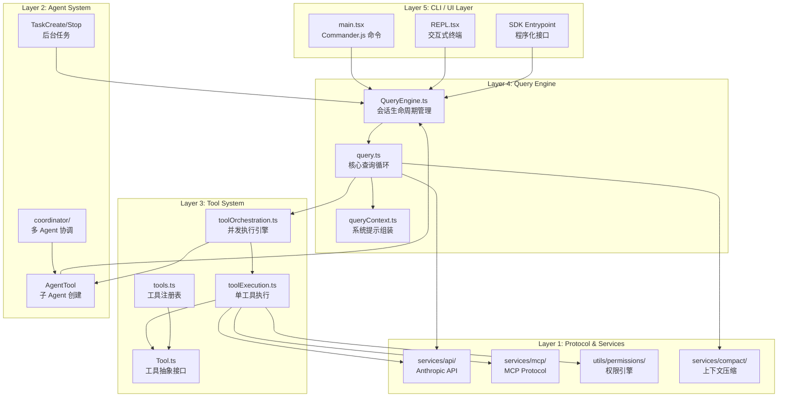
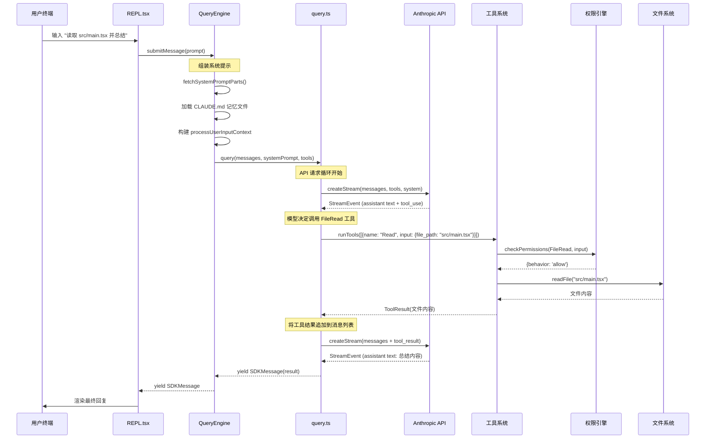
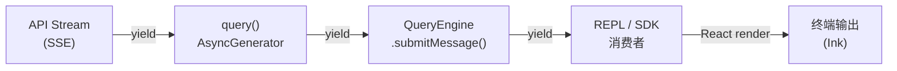

# 第 1 章 全景概览

> "理解一个大型系统，首先要站在足够高的地方俯瞰全局。"

Claude Code 是 Anthropic 推出的命令行 AI 编程助手，也是目前业界最复杂的终端 AI Agent 实现之一。本章将从产品定位出发，逐步深入其技术选型、代码组织和架构分层，最终通过一次完整对话的数据流追踪，帮助读者建立起对整个系统的全局认知。

## 1.1 Claude Code 是什么

Claude Code 本质上是一个**终端原生的 AI Agent 运行时**。它不仅仅是一个聊天界面或代码补全工具，而是一个完整的、可以自主执行复杂多步任务的智能体系统。其核心能力包括：

- **文件系统操作**：读写文件、搜索代码库、编辑代码（带精确的字符串替换语义）
- **命令执行**：在沙箱环境中运行 Bash/PowerShell 命令
- **多轮对话**：维护上下文窗口，支持自动压缩和会话恢复
- **工具编排**：并发执行多个工具调用，支持安全的并发控制
- **权限系统**：多层权限模型（用户设置、项目设置、策略设置、会话级别）
- **MCP 协议**：通过 Model Context Protocol 连接外部工具和资源
- **Sub-Agent 系统**：支持任务分解和多 Agent 协作

从 `src/tools.ts` 的 `getAllBaseTools()` 函数中可以看到，系统注册了超过 40 种内置工具：

```typescript
// src/tools.ts
export function getAllBaseTools(): Tools {
  return [
    AgentTool,
    TaskOutputTool,
    BashTool,
    ...(hasEmbeddedSearchTools() ? [] : [GlobTool, GrepTool]),
    ExitPlanModeV2Tool,
    FileReadTool,
    FileEditTool,
    FileWriteTool,
    NotebookEditTool,
    WebFetchTool,
    TodoWriteTool,
    WebSearchTool,
    // ... 省略其余工具
  ]
}
```

这个函数的设计有一个值得注意的特点：**工具列表不是静态的，而是根据 feature flag、环境变量和运行时状态动态组装的**。例如 `SleepTool` 只在 `PROACTIVE` 或 `KAIROS` feature flag 开启时才注册：

```typescript
const SleepTool =
  feature('PROACTIVE') || feature('KAIROS')
    ? require('./tools/SleepTool/SleepTool.js').SleepTool
    : null
```

这种条件注册模式贯穿整个工具系统，使得同一份代码可以构建出面向不同用户群体（内部员工 `ant` vs 外部用户 `external`）的不同产品形态。

## 1.2 技术栈选型

### Bun 作为运行时

Claude Code 选择了 Bun 而非 Node.js 作为运行时引擎。从源码的多处设计可以推断这一选择的动机：

**1. `bun:bundle` 的编译时 Feature Flag**

这是最关键的技术理由。Claude Code 大量使用 `feature()` 函数进行编译时死代码消除（Dead Code Elimination）：

```typescript
// src/tools.ts
import { feature } from 'bun:bundle'

const OverflowTestTool = feature('OVERFLOW_TEST_TOOL')
  ? require('./tools/OverflowTestTool/OverflowTestTool.js').OverflowTestTool
  : null
```

`feature()` 在 Bun 的 bundler 阶段被求值为编译时常量。当构建外部版本时，`OVERFLOW_TEST_TOOL` 为 `false`，整个 `require` 路径以及 `OverflowTestTool` 的全部代码会被 tree-shaker 完全移除。这对于一个包含大量内部功能（ant-only features）的代码库来说，意味着：

- 外部发布的 binary 中不包含任何内部功能的代码
- 无运行时开销 —— 不需要 `if (isInternal)` 的条件分支
- 安全性保证 —— 内部代码物理上不存在于外部产物中

**2. 单文件可执行二进制**

从 `src/entrypoints/cli.tsx` 的启动路径可以看出，Claude Code 被编译为单文件可执行程序。Bun 的 `bun build --compile` 能力使得整个 TypeScript + React 应用可以打包为一个无依赖的二进制文件。

**3. 启动性能**

`src/utils/startupProfiler.ts` 中定义的性能阶段度量揭示了启动性能的重要性：

```typescript
const PHASE_DEFINITIONS = {
  import_time: ['cli_entry', 'main_tsx_imports_loaded'],
  init_time: ['init_function_start', 'init_function_end'],
  settings_time: ['eagerLoadSettings_start', 'eagerLoadSettings_end'],
  total_time: ['cli_entry', 'main_after_run'],
} as const
```

Bun 的模块加载速度是 Node.js 的数倍，对于一个 CLI 工具来说，冷启动时间直接影响用户体验。

### React + Ink 作为 TUI 框架

Claude Code 使用 React 渲染终端 UI。这不是一个常见的选择，但从 `Tool` 类型定义中可以看到其必要性：

```typescript
// src/Tool.ts
export type Tool<Input, Output, P> = {
  renderToolResultMessage?(
    content: Output,
    progressMessagesForMessage: ProgressMessage<P>[],
    options: { style?: 'condensed'; theme: ThemeName; /* ... */ },
  ): React.ReactNode

  renderToolUseMessage(
    input: Partial<z.infer<Input>>,
    options: { theme: ThemeName; verbose: boolean },
  ): React.ReactNode

  renderToolUseProgressMessage?(
    progressMessagesForMessage: ProgressMessage<P>[],
    options: { tools: Tools; verbose: boolean; /* ... */ },
  ): React.ReactNode
  // ...
}
```

每个工具需要定义多种渲染方法：工具调用中的渲染、进度更新的渲染、结果的渲染、错误的渲染、被拒绝时的渲染。React 的声明式组件模型使得这种复杂的 UI 组合变得可管理。如果用传统的 ANSI 转义码手动渲染，代码复杂度将呈指数增长。

### Zod 作为运行时类型验证

系统使用 Zod v4 进行运行时类型验证，特别是在工具输入验证和 Hook 响应解析中：

```typescript
// src/types/hooks.ts
import { z } from 'zod/v4'

export const syncHookResponseSchema = lazySchema(() =>
  z.object({
    continue: z.boolean().optional(),
    suppressOutput: z.boolean().optional(),
    stopReason: z.string().optional(),
    decision: z.enum(['approve', 'block']).optional(),
    // ...
  }),
)
```

Zod 提供了 TypeScript 类型推断（`z.infer<T>`）和运行时验证的双重保障，这在一个需要处理大量外部输入（用户输入、API 响应、MCP 消息、Hook 输出）的系统中至关重要。

## 1.3 代码库全景

Claude Code 的 `src/` 目录包含超过 30 个顶层模块。以下是各模块的职责划分：

```
src/
├── main.tsx              # CLI 主入口 — Commander.js 命令定义与启动编排
├── entrypoints/          # 多入口：cli.tsx, init.ts, mcp.ts, sdk/
├── QueryEngine.ts        # 查询引擎 — 管理对话生命周期
├── query.ts              # 核心查询循环 — API 调用 + 工具执行的状态机
├── Tool.ts               # 工具抽象层 — Tool<I,O,P> 泛型定义
├── tools.ts              # 工具注册表 — 动态组装工具池
├── tools/                # 40+ 工具实现：BashTool, FileEditTool, AgentTool...
├── types/                # 纯类型文件 — 打破循环依赖
├── state/                # 应用状态管理 — AppState, store
├── services/             # 外部服务交互
│   ├── api/              # Anthropic API 客户端
│   ├── mcp/              # MCP 协议实现
│   ├── compact/          # 上下文压缩服务
│   ├── analytics/        # 遥测与分析
│   └── tools/            # 工具编排引擎（并发执行）
├── hooks/                # React hooks（useCanUseTool 等）
├── components/           # Ink UI 组件
├── screens/              # TUI 页面（权限对话框、设置等）
├── commands/             # 斜杠命令系统
├── skills/               # 技能系统（可扩展的命令集）
├── plugins/              # 插件系统
├── coordinator/          # 多 Agent 协调器
├── context/              # 上下文管理
├── migrations/           # 配置迁移脚本
├── utils/                # 工具函数集（最大的目录）
│   ├── permissions/      # 权限子系统
│   ├── model/            # 模型选择与配置
│   ├── settings/         # 分层配置系统
│   ├── sandbox/          # 命令沙箱
│   └── ...
├── bootstrap/            # 启动状态管理
├── remote/               # 远程会话管理
├── server/               # Direct Connect 服务端
├── assistant/            # 助手模式（Kairos）
└── voice/                # 语音输入
```

值得注意的是 `types/` 目录的存在。这个目录中的文件**只包含类型定义，没有运行时代码**。这是一个刻意的架构决策，用于打破循环依赖。文件头部的注释清楚说明了这一点：

```typescript
// src/types/permissions.ts
/**
 * Pure permission type definitions extracted to break import cycles.
 *
 * This file contains only type definitions and constants with no runtime dependencies.
 * Implementation files remain in src/utils/permissions/ but can now import from here
 * to avoid circular dependencies.
 */
```

## 1.4 架构分层

Claude Code 的架构可以分为五个清晰的层次。每一层向上提供抽象，向下依赖具体实现。



**Layer 5 —— CLI / UI 层**：负责命令行参数解析、终端渲染和用户交互。`main.tsx` 使用 Commander.js 定义了完整的 CLI 接口，`REPL.tsx` 提供交互式终端体验。SDK 入口则为程序化调用提供接口。

**Layer 4 —— Query Engine 层**：这是系统的大脑。`QueryEngine` 管理整个对话的生命周期状态，`query()` 函数实现核心的 API 调用 - 工具执行循环。

**Layer 3 —— Tool System 层**：定义了工具的抽象接口和执行引擎。`toolOrchestration.ts` 负责并发控制，将工具调用分为"并发安全"和"串行执行"两类：

```typescript
// src/services/tools/toolOrchestration.ts
export async function* runTools(
  toolUseMessages: ToolUseBlock[],
  assistantMessages: AssistantMessage[],
  canUseTool: CanUseToolFn,
  toolUseContext: ToolUseContext,
): AsyncGenerator<MessageUpdate, void> {
  let currentContext = toolUseContext
  for (const { isConcurrencySafe, blocks } of partitionToolCalls(
    toolUseMessages,
    currentContext,
  )) {
    if (isConcurrencySafe) {
      // 并发安全的工具（如 Glob、Grep、FileRead）并行执行
      for await (const update of runToolsConcurrently(
        blocks, assistantMessages, canUseTool, currentContext,
      )) {
        yield { message: update.message, newContext: currentContext }
      }
    }
    // 非并发安全的工具串行执行
    // ...
  }
}
```

**Layer 2 —— Agent System 层**：支持 Agent 嵌套和任务管理。`AgentTool` 可以创建子 Agent，每个子 Agent 拥有独立的 `QueryEngine` 实例，实现递归式的任务分解。

**Layer 1 —— Protocol & Services 层**：与外部世界交互的基础设施。包括 Anthropic API 客户端、MCP 协议实现、权限引擎和上下文压缩服务。

### 分层的关键设计原则

1. **单向依赖**：上层可以依赖下层，反之则通过类型注入或回调实现反向通信
2. **类型解耦**：`types/` 目录提供跨层共享的纯类型定义，避免运行时循环依赖
3. **AsyncGenerator 作为通信管道**：`query()` 和 `runTools()` 都返回 `AsyncGenerator`，支持惰性、流式的消息传递

## 1.5 核心数据流

理解 Claude Code 最有效的方式是跟踪一次完整对话的旅程。当用户在终端输入 "读取 src/main.tsx 并总结其功能" 时，系统内部发生了什么？



让我们深入每个关键阶段。

### 阶段 1：消息提交与上下文组装

当 `QueryEngine.submitMessage()` 被调用时，首先组装系统提示：

```typescript
// src/QueryEngine.ts
async *submitMessage(
  prompt: string | ContentBlockParam[],
  options?: { uuid?: string; isMeta?: boolean },
): AsyncGenerator<SDKMessage, void, unknown> {
  // ... 解构配置

  // 获取系统提示的各个组成部分
  const {
    defaultSystemPrompt,
    userContext: baseUserContext,
    systemContext,
  } = await fetchSystemPromptParts({
    tools,
    mainLoopModel: initialMainLoopModel,
    additionalWorkingDirectories: Array.from(
      initialAppState.toolPermissionContext
        .additionalWorkingDirectories.keys(),
    ),
    mcpClients,
    customSystemPrompt: customPrompt,
  })

  // 组装最终的系统提示
  const systemPrompt = asSystemPrompt([
    ...(customPrompt !== undefined ? [customPrompt] : defaultSystemPrompt),
    ...(memoryMechanicsPrompt ? [memoryMechanicsPrompt] : []),
    ...(appendSystemPrompt ? [appendSystemPrompt] : []),
  ])
```

系统提示由多个部分组成：默认提示（包含角色定义、工具使用指南、安全规则）、用户上下文（git 状态、工作目录信息）、系统上下文（操作系统、shell 类型），以及可选的记忆文件和自定义追加内容。

### 阶段 2：核心查询循环

`query()` 函数是一个 `AsyncGenerator`，实现了 API 调用和工具执行的交替循环：

```typescript
// src/query.ts (概念性简化)
export async function* query(params: QueryParams): AsyncGenerator<Message | StreamEvent> {
  while (true) {
    // 1. 调用 Anthropic API
    const stream = createStream(messages, systemPrompt, tools)

    // 2. 流式处理响应
    for await (const event of stream) {
      yield event  // 实时传递给上层
    }

    // 3. 如果模型请求了工具调用
    if (hasToolUse(lastAssistantMessage)) {
      // 4. 执行工具（可能并发）
      for await (const update of runTools(toolUseBlocks, ...)) {
        yield update.message
      }
      // 5. 继续循环（带上工具结果再次调用 API）
      continue
    }

    // 6. 模型完成回复，退出循环
    break
  }
}
```

这个循环的关键特性是**自动继续**：当模型输出包含 `tool_use` 块时，系统自动执行工具并将结果反馈给模型，无需用户干预。这就是 Agent 行为的核心 —— 模型可以自主决定执行多个步骤来完成任务。

### 阶段 3：工具执行与权限检查

每个工具调用都要经过权限引擎的审查。权限系统采用多层决策模型：

```typescript
// src/Tool.ts - 工具接口中的权限方法
checkPermissions(
  input: z.infer<Input>,
  context: ToolUseContext,
): Promise<PermissionResult>
```

`PermissionResult` 是一个判别联合类型，其 `behavior` 字段决定了后续流程：

```typescript
// src/types/permissions.ts
export type PermissionResult<Input> =
  | PermissionAllowDecision<Input>   // behavior: 'allow' — 放行
  | PermissionAskDecision<Input>     // behavior: 'ask'   — 询问用户
  | PermissionDenyDecision           // behavior: 'deny'  — 拒绝
  | { behavior: 'passthrough'; ... } // 交给通用权限系统
```

当工具被允许执行后，其结果通过 `ToolResult<T>` 返回：

```typescript
export type ToolResult<T> = {
  data: T                    // 工具输出数据
  newMessages?: Message[]    // 可选的附加消息
  contextModifier?: (context: ToolUseContext) => ToolUseContext  // 上下文修改器
  mcpMeta?: { ... }          // MCP 元数据透传
}
```

`contextModifier` 是一个精妙的设计：某些工具执行后会改变后续工具的执行上下文（例如切换工作目录），通过返回一个上下文修改函数而非直接修改全局状态，保证了并发安全性。

### 阶段 4：结果渲染与流式输出

整个数据流通过 `AsyncGenerator` 的 `yield` 机制实现了真正的流式传递。从 API 的 Server-Sent Events，到工具执行的进度更新，再到最终的渲染输出，数据在管道中逐级流动，无需缓冲整个响应。



这种 AsyncGenerator 管道模式是 Claude Code 数据流架构的核心特征。它实现了：
- **背压控制**：消费者未拉取时，生产者暂停
- **惰性计算**：只有被消费的消息才会被处理
- **流式渲染**：用户可以在模型还在生成时就看到部分输出

## 本章小结

本章建立了对 Claude Code 的全局认知：

1. **产品本质**：不是简单的 CLI 聊天工具，而是一个完整的终端原生 AI Agent 运行时
2. **技术选型逻辑**：Bun 的编译时 feature flag 支撑了一套代码多产物的构建策略；React/Ink 解决了复杂工具 UI 的组合问题；Zod 桥接了静态类型与运行时验证
3. **五层架构**：从 CLI 到 Protocol，每一层有明确的职责边界
4. **数据流特征**：AsyncGenerator 管道实现了全链路流式传递

在接下来的章节中，我们将深入每一层的实现细节，从启动流程开始。
