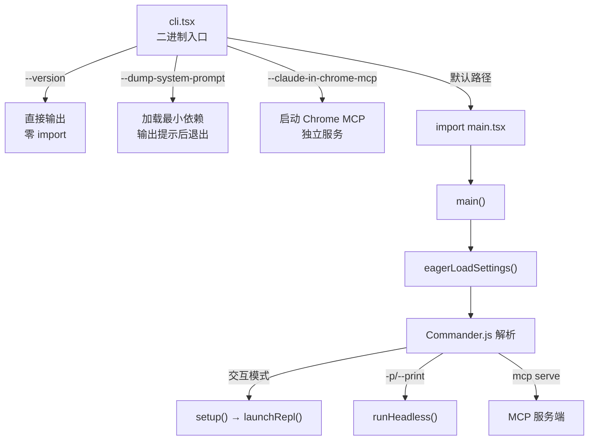
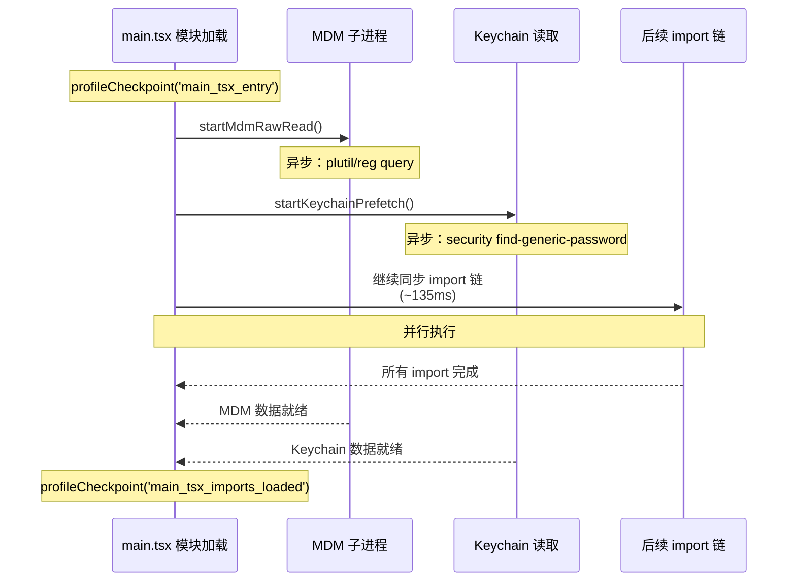
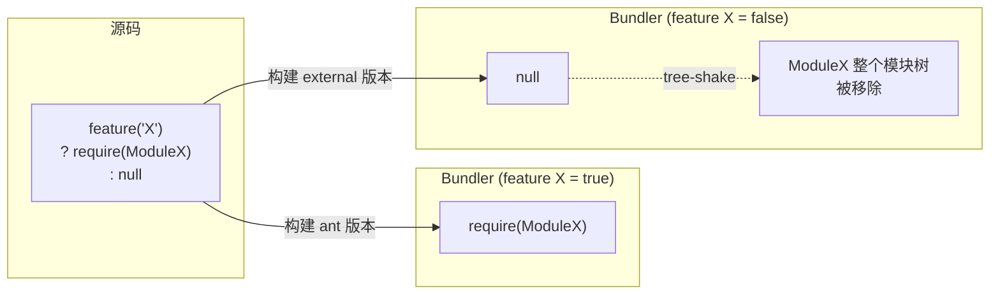
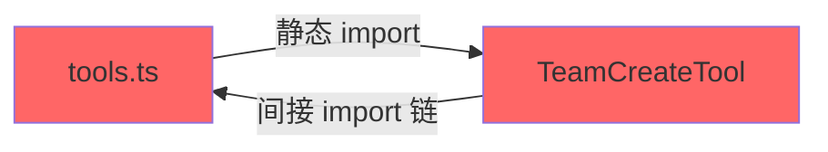
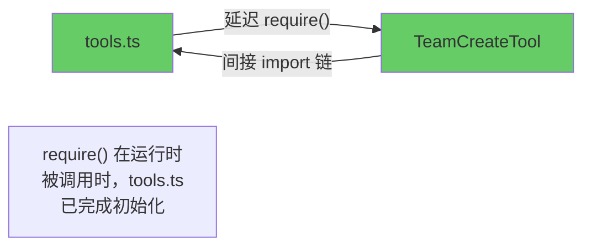
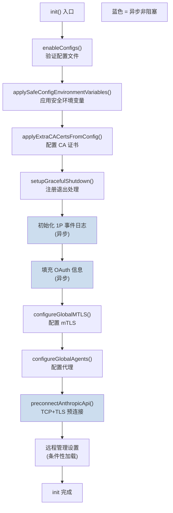

# 第 2 章 启动流程

> "一个 CLI 工具的启动时间决定了它能否被程序员日常使用。每多 100 毫秒的等待，就多一份切换回浏览器的冲动。"

Claude Code 的启动流程是一个精心编排的异步序列。从用户敲下 `claude` 命令到出现交互式提示符，中间经历了入口分发、并行预取、配置加载、迁移执行、权限初始化等十余个阶段。本章将逐一剖析这些阶段，揭示工程团队在启动性能上所做的极致优化。

## 2.1 入口点：从 cli.tsx 到 main.tsx

Claude Code 的启动流程始于 `src/entrypoints/cli.tsx`。这个文件是编译后的二进制文件的真正入口。它的设计体现了**快速路径优先**的原则：

```typescript
// src/entrypoints/cli.tsx
async function main(): Promise<void> {
  const args = process.argv.slice(2);

  // 快速路径：--version 零模块加载
  if (args.length === 1 && (args[0] === '--version' || args[0] === '-v')) {
    console.log(`${MACRO.VERSION} (Claude Code)`);
    return;
  }

  // 对于所有其他路径，加载启动分析器
  const { profileCheckpoint } = await import('../utils/startupProfiler.js');
  profileCheckpoint('cli_entry');

  // 快速路径：--dump-system-prompt
  if (feature('DUMP_SYSTEM_PROMPT') && args[0] === '--dump-system-prompt') {
    // ...直接输出后退出
  }

  // 主路径：加载完整 CLI
  const { main } = await import('../main.js');
  await main();
}
```

注意 `--version` 的处理：它甚至不加载 `startupProfiler` 模块。`MACRO.VERSION` 是一个构建时内联的常量，这意味着 `claude --version` 的执行路径上**零动态 import**。这种极致的启动优化意识贯穿整个代码库。

另一个值得注意的是 `cli.tsx` 中的环境预设逻辑：

```typescript
// 远程容器环境下增大 V8 堆上限
if (process.env.CLAUDE_CODE_REMOTE === 'true') {
  const existing = process.env.NODE_OPTIONS || '';
  process.env.NODE_OPTIONS = existing
    ? `${existing} --max-old-space-size=8192`
    : '--max-old-space-size=8192';
}
```

这段代码在任何模块加载之前就设置了内存限制，确保远程容器环境（Claude Code Remote，即 CCR）中的长时间会话不会因为默认的堆大小限制而 OOM。



## 2.2 并行预取：与时间赛跑

`main.tsx` 文件的前 20 行是整个代码库中最精心设计的部分之一。它利用 JavaScript 的模块加载语义实现了**零成本并行预取**：

```typescript
// src/main.tsx — 文件最顶部
// 这些副作用必须在所有其他 import 之前运行：
// 1. profileCheckpoint 在模块求值开始前标记入口
// 2. startMdmRawRead 启动 MDM 子进程（plutil/reg query），
//    使其与后续约 135ms 的 import 并行运行
// 3. startKeychainPrefetch 并行启动两个 macOS keychain 读取
//    （OAuth + legacy API key），否则 isRemoteManagedSettingsEligible()
//    会在 applySafeConfigEnvironmentVariables() 内通过同步 spawn 顺序读取
//    （每次 macOS 启动约 65ms）

import { profileCheckpoint, profileReport } from './utils/startupProfiler.js';
profileCheckpoint('main_tsx_entry');

import { startMdmRawRead } from './utils/settings/mdm/rawRead.js';
startMdmRawRead();

import { ensureKeychainPrefetchCompleted, startKeychainPrefetch }
  from './utils/secureStorage/keychainPrefetch.js';
startKeychainPrefetch();
```

这段代码利用了一个关键事实：**ES 模块的 import 是同步求值的，但模块内部启动的异步操作会在后台并行执行**。



关键洞察：在 macOS 上，`startKeychainPrefetch()` 并行启动了两个 keychain 读取操作（OAuth token 和 legacy API key）。如果不进行这个预取，这两个操作会在后续的 `applySafeConfigEnvironmentVariables()` 中**同步串行执行**，每次约 32ms，合计约 65ms。通过将它们提前到模块加载的最开始，这 65ms 被完全隐藏在后续 import 的 135ms 之内。

这种并行预取模式在后续也被多次使用。在 `startDeferredPrefetches()` 中，还有更多的后台预取操作被推迟到首次渲染之后：

```typescript
// src/main.tsx
export function startDeferredPrefetches(): void {
  // 跳过条件：性能测量模式或 bare 模式
  if (isEnvTruthy(process.env.CLAUDE_CODE_EXIT_AFTER_FIRST_RENDER) ||
      isBareMode()) {
    return;
  }

  // 进程级预取（在用户输入第一条消息前完成）
  void initUser();
  void getUserContext();
  prefetchSystemContextIfSafe();
  void getRelevantTips();

  // 云提供商凭证预取
  if (isEnvTruthy(process.env.CLAUDE_CODE_USE_BEDROCK)) {
    void prefetchAwsCredentialsAndBedRockInfoIfSafe();
  }
  if (isEnvTruthy(process.env.CLAUDE_CODE_USE_VERTEX)) {
    void prefetchGcpCredentialsIfSafe();
  }

  // 文件计数（ripgrep，3秒超时）
  void countFilesRoundedRg(getCwd(), AbortSignal.timeout(3000), []);

  // 分析与 feature flag
  void initializeAnalyticsGates();
  void prefetchOfficialMcpUrls();
  void refreshModelCapabilities();

  // 文件变更检测器
  void settingsChangeDetector.initialize();
  void skillChangeDetector.initialize();
}
```

这些预取操作全部使用 `void` 前缀启动（fire-and-forget），不阻塞 REPL 的首次渲染。它们的结果会被缓存，在后续的第一次 API 调用时消费。设计理念是：**用户输入第一条消息通常需要几秒钟，这段时间足够完成所有预取操作**。

## 2.3 Feature Flag：编译时死代码消除

`feature()` 函数是 Claude Code 构建系统的核心机制之一。它来自 Bun 的 `bun:bundle` 模块，在编译期被求值为布尔常量：

```typescript
import { feature } from 'bun:bundle'

// 编译时求值：对于外部构建，feature('COORDINATOR_MODE') === false
const coordinatorModeModule = feature('COORDINATOR_MODE')
  ? require('./coordinator/coordinatorMode.js')
  : null
```

当 `feature('COORDINATOR_MODE')` 为 `false` 时，Bun 的 bundler 会将整个三元表达式优化为 `null`，并且 `require('./coordinator/coordinatorMode.js')` 所引入的整个模块树都会被 tree-shake 移除。

在 `src/tools.ts` 中，这种模式被大量使用：

```typescript
const SleepTool =
  feature('PROACTIVE') || feature('KAIROS')
    ? require('./tools/SleepTool/SleepTool.js').SleepTool
    : null

const cronTools = feature('AGENT_TRIGGERS')
  ? [
      require('./tools/ScheduleCronTool/CronCreateTool.js').CronCreateTool,
      require('./tools/ScheduleCronTool/CronDeleteTool.js').CronDeleteTool,
      require('./tools/ScheduleCronTool/CronListTool.js').CronListTool,
    ]
  : []

const WebBrowserTool = feature('WEB_BROWSER_TOOL')
  ? require('./tools/WebBrowserTool/WebBrowserTool.js').WebBrowserTool
  : null
```



这种方法的优势对比运行时条件检查：

| 维度 | `feature()` 编译时消除 | `process.env.X` 运行时检查 |
|------|----------------------|--------------------------|
| 产物大小 | 未使用代码物理移除 | 全部代码打包 |
| 运行时开销 | 零 | 每次条件检查有分支预测成本 |
| 安全性 | 内部代码不在产物中 | 代码存在，可被逆向 |
| 调试 | 需要不同构建产物 | 同一产物，改环境变量即可 |

值得注意的是，`process.env.USER_TYPE` 的检查在代码中也大量存在，但它不是通过 `feature()` 实现的：

```typescript
...(process.env.USER_TYPE === 'ant' ? [ConfigTool] : []),
...(process.env.USER_TYPE === 'ant' ? [TungstenTool] : []),
```

对比 `feature()` 的编译时消除，这里使用了字面量字符串比较。从 `main.tsx` 第 266 行可以看到一个线索：

```typescript
if ("external" !== 'ant' && isBeingDebugged()) {
  process.exit(1);
}
```

这里的 `"external"` 是一个构建时被替换的宏 —— 在 ant 构建中它是 `"ant"`，在外部构建中它是 `"external"`。同样地，`process.env.USER_TYPE` 的值也是在构建时确定的，使得 bundler 可以进行同样的死代码消除。

## 2.4 延迟加载：require() 的策略性使用

在 `main.tsx` 和 `tools.ts` 中，大量使用了 `require()` 而非 `import`。这不是代码风格问题，而是一种**刻意的延迟加载策略**：

```typescript
// src/main.tsx — 打破循环依赖的延迟 require
const getTeammateUtils = () =>
  require('./utils/teammate.js') as typeof import('./utils/teammate.js');
const getTeammatePromptAddendum = () =>
  require('./utils/swarm/teammatePromptAddendum.js')
  as typeof import('./utils/swarm/teammatePromptAddendum.js');
```

```typescript
// src/tools.ts — 打破循环依赖
const getTeamCreateTool = () =>
  require('./tools/TeamCreateTool/TeamCreateTool.js')
    .TeamCreateTool as typeof import('./tools/TeamCreateTool/TeamCreateTool.js')
      .TeamCreateTool
```

这里有两种使用模式：

**模式 1：打破循环依赖**。`tools.ts` 导入 `TeamCreateTool`，而 `TeamCreateTool` 的模块链最终又会导入 `tools.ts`。通过将 `require()` 包装在函数中，模块求值时不会立即触发导入，只在函数被调用时才执行，此时循环链中的所有模块已经完成初始化。





**模式 2：条件加载 + 类型安全**。`as typeof import(...)` 语法确保了即使是动态 `require()`，返回值也有完整的类型信息：

```typescript
const coordinatorModeModule = feature('COORDINATOR_MODE')
  ? require('./coordinator/coordinatorMode.js')
    as typeof import('./coordinator/coordinatorMode.js')
  : null;
```

这个模式同时实现了三个目标：
1. 编译时死代码消除（通过 `feature()`）
2. 延迟加载（通过 `require()`）
3. 类型安全（通过 `as typeof import(...)`）

## 2.5 启动性能：profileCheckpoint 系统

Claude Code 内建了一套启动性能打点系统，定义在 `src/utils/startupProfiler.ts` 中：

```typescript
// src/utils/startupProfiler.ts
const DETAILED_PROFILING = isEnvTruthy(process.env.CLAUDE_CODE_PROFILE_STARTUP)
const STATSIG_SAMPLE_RATE = 0.005
const STATSIG_LOGGING_SAMPLED =
  process.env.USER_TYPE === 'ant' || Math.random() < STATSIG_SAMPLE_RATE

const SHOULD_PROFILE = DETAILED_PROFILING || STATSIG_LOGGING_SAMPLED
```

这个系统有两种工作模式：

1. **采样日志模式**：100% 的内部用户和 0.5% 的外部用户自动启用，将性能数据上报到 Statsig 用于聚合分析
2. **详细分析模式**：通过 `CLAUDE_CODE_PROFILE_STARTUP=1` 环境变量手动启用，输出完整的时间线报告

```typescript
export function profileCheckpoint(name: string): void {
  if (!SHOULD_PROFILE) return

  const perf = getPerformance()
  perf.mark(name)

  // 仅在详细模式下捕获内存快照
  if (DETAILED_PROFILING) {
    memorySnapshots.push(process.memoryUsage())
  }
}
```

当 `SHOULD_PROFILE` 为 `false` 时，`profileCheckpoint()` 是一个立即返回的空函数，**零运行时开销**。这意味着生产环境中 99.5% 的外部用户不会受到任何性能影响。

打点散布在整个启动路径中，形成了一条精确的时间线：

```typescript
profileCheckpoint('main_tsx_entry')           // import 开始
// ... 135ms 的 import 链 ...
profileCheckpoint('main_tsx_imports_loaded')   // import 结束
profileCheckpoint('main_function_start')       // main() 函数入口
profileCheckpoint('main_warning_handler_initialized')
profileCheckpoint('eagerLoadSettings_start')   // 配置加载开始
profileCheckpoint('eagerLoadSettings_end')     // 配置加载结束
```

对应的阶段定义用于 Statsig 上报：

```typescript
const PHASE_DEFINITIONS = {
  import_time: ['cli_entry', 'main_tsx_imports_loaded'],
  init_time: ['init_function_start', 'init_function_end'],
  settings_time: ['eagerLoadSettings_start', 'eagerLoadSettings_end'],
  total_time: ['cli_entry', 'main_after_run'],
} as const
```

当启用详细模式时，会生成一份包含内存快照的完整报告：

```
================================================================================
STARTUP PROFILING REPORT
================================================================================

    0ms    +0ms  profiler_initialized                    [RSS: 45MB, Heap: 12MB]
    1ms    +1ms  cli_entry                               [RSS: 45MB, Heap: 12MB]
    2ms    +1ms  main_tsx_entry                           [RSS: 46MB, Heap: 13MB]
  137ms  +135ms  main_tsx_imports_loaded                  [RSS: 89MB, Heap: 42MB]
  138ms    +1ms  main_function_start                      [RSS: 89MB, Heap: 42MB]
  ...
  312ms  +174ms  main_after_run                           [RSS: 112MB, Heap: 58MB]

Total startup time: 312ms
================================================================================
```

## 2.6 init 流程：从配置到就绪

`main()` 函数中的 `init()` 调用（定义在 `src/entrypoints/init.ts`）是启动序列中最关键的一步。它被 `memoize` 包装，确保全局只执行一次：

```typescript
// src/entrypoints/init.ts
export const init = memoize(async (): Promise<void> => {
  const initStartTime = Date.now()
  profileCheckpoint('init_function_start')

  // 1. 启用配置系统 — 验证所有配置文件格式正确
  enableConfigs()
  profileCheckpoint('init_configs_enabled')

  // 2. 应用安全的环境变量（trust 对话框之前）
  applySafeConfigEnvironmentVariables()
  applyExtraCACertsFromConfig()
  profileCheckpoint('init_safe_env_vars_applied')

  // 3. 注册优雅退出处理
  setupGracefulShutdown()
  profileCheckpoint('init_after_graceful_shutdown')

  // 4. 初始化 1P 事件日志（异步，不阻塞）
  void Promise.all([
    import('../services/analytics/firstPartyEventLogger.js'),
    import('../services/analytics/growthbook.js'),
  ]).then(([fp, gb]) => {
    fp.initialize1PEventLogging()
    gb.onGrowthBookRefresh(() => {
      void fp.reinitialize1PEventLoggingIfConfigChanged()
    })
  })

  // 5. 填充 OAuth 账户信息
  void populateOAuthAccountInfoIfNeeded()

  // 6. 配置全局网络设置（mTLS + 代理）
  configureGlobalMTLS()
  configureGlobalAgents()
  profileCheckpoint('init_network_configured')

  // 7. API 预连接 — TCP+TLS 握手与后续工作并行
  preconnectAnthropicApi()

  // 8. 平台特定初始化
  setShellIfWindows()

  // 9. 远程管理设置加载（如果有资格）
  if (isEligibleForRemoteManagedSettings()) {
    initializeRemoteManagedSettingsLoadingPromise()
  }
  if (isPolicyLimitsEligible()) {
    initializePolicyLimitsLoadingPromise()
  }

  profileCheckpoint('init_function_end')
})
```



其中有几个值得深入分析的设计决策：

### applyConfigEnvironmentVariables 的分阶段执行

环境变量的应用被分为两个阶段：

- `applySafeConfigEnvironmentVariables()`：在 trust 对话框之前执行。只应用不涉及安全风险的环境变量（如代理设置、CA 证书路径）
- `applyConfigEnvironmentVariables()`：在 trust 建立之后执行。应用所有环境变量，包括可能影响安全行为的变量

这种分阶段设计确保了：在用户确认信任之前，不会执行任何可能被恶意项目配置利用的操作。

### preconnectAnthropicApi 的预连接优化

```typescript
// TCP+TLS 握手通常需要 100-200ms
// 在 CA 证书和代理配置完成后立即启动预连接
// 使其与后续 ~100ms 的初始化工作并行
preconnectAnthropicApi()
```

通过在配置网络参数后立即发起 TCP 连接，TLS 握手的延迟（100-200ms）被隐藏在后续的初始化工作中。这意味着当第一次 API 调用发生时，连接已经建立就绪。

### 迁移系统

`main.tsx` 中的 `runMigrations()` 负责执行配置迁移：

```typescript
const CURRENT_MIGRATION_VERSION = 11;

function runMigrations(): void {
  if (getGlobalConfig().migrationVersion !== CURRENT_MIGRATION_VERSION) {
    migrateAutoUpdatesToSettings();
    migrateBypassPermissionsAcceptedToSettings();
    migrateEnableAllProjectMcpServersToSettings();
    resetProToOpusDefault();
    migrateSonnet1mToSonnet45();
    migrateLegacyOpusToCurrent();
    migrateSonnet45ToSonnet46();
    migrateOpusToOpus1m();
    migrateReplBridgeEnabledToRemoteControlAtStartup();

    if (feature('TRANSCRIPT_CLASSIFIER')) {
      resetAutoModeOptInForDefaultOffer();
    }
    if ("external" === 'ant') {
      migrateFennecToOpus();
    }

    saveGlobalConfig(prev =>
      prev.migrationVersion === CURRENT_MIGRATION_VERSION
        ? prev
        : { ...prev, migrationVersion: CURRENT_MIGRATION_VERSION }
    );
  }
}
```

迁移系统的设计特点：

1. **版本门控**：通过 `migrationVersion` 整数避免重复执行
2. **幂等性**：每个迁移函数必须是幂等的（多次执行结果一致）
3. **全量执行**：不像数据库迁移那样逐版本递增，而是每次检查是否需要迁移时运行所有迁移。这简化了实现 —— 每个迁移函数自行检查是否需要执行
4. **异步迁移分离**：`migrateChangelogFromConfig()` 是异步的，使用 fire-and-forget 模式，不阻塞启动

模型字符串的迁移链清晰记录了 Claude 模型的演进历史：`Fennec → Opus → Legacy Opus → Sonnet 1M → Sonnet 4.5 → Sonnet 4.6 → Opus 1M`。每次模型更名都需要迁移用户存储的模型偏好设置。

### 安全前置检查

`main()` 函数的开头包含了一个安全检查：

```typescript
// src/main.tsx
// 安全：防止 Windows 从当前目录执行命令
process.env.NoDefaultCurrentDirectoryInExePath = '1';
```

以及反调试检测：

```typescript
// 外部构建中检测并阻止调试器附加
if ("external" !== 'ant' && isBeingDebugged()) {
  process.exit(1);
}
```

`isBeingDebugged()` 检查 `--inspect` 标志、`NODE_OPTIONS` 环境变量和活跃的 Inspector 连接。在外部构建中，调试模式被直接禁止。这是一种**安全纵深防御**措施，防止通过调试器绕过安全检查。

## 2.7 Commander.js 命令注册

`main()` 函数中使用 Commander.js 定义了完整的 CLI 接口。命令定义代码非常长（main.tsx 超过 4000 行），但架构模式是统一的。主命令处理交互模式，子命令处理各种非交互操作。

在进入 Commander 解析之前，有几个特殊路径通过直接的 argv 检查提前处理：

```typescript
// cc:// URL 协议处理
if (feature('DIRECT_CONNECT')) {
  const ccIdx = rawCliArgs.findIndex(
    a => a.startsWith('cc://') || a.startsWith('cc+unix://')
  );
  if (ccIdx !== -1 && _pendingConnect) {
    // 重写 argv，让主命令处理器接管
    _pendingConnect.url = parsed.serverUrl;
    _pendingConnect.authToken = parsed.authToken;
    process.argv = [process.argv[0]!, process.argv[1]!, ...stripped];
  }
}

// `claude assistant [sessionId]` 特殊处理
if (feature('KAIROS') && _pendingAssistantChat) {
  if (rawArgs[0] === 'assistant') {
    // ...
  }
}

// `claude ssh <host> [dir]` 特殊处理
if (feature('SSH_REMOTE') && _pendingSSH) {
  if (rawCliArgs[0] === 'ssh') {
    // 提取 --permission-mode, --local 等 SSH 特定标志
    // ...
  }
}
```

这些特殊路径通过修改 `process.argv` 来"注入"参数，使得 Commander.js 的主命令处理器能够统一处理。这种设计避免了在 Commander 中注册大量子命令，同时保持了主命令的交互式 TUI 体验。

## 本章小结

Claude Code 的启动流程体现了一套完整的性能工程方法论：

1. **快速路径优先**：`--version` 零 import，特殊入口延迟加载
2. **并行预取**：利用模块加载窗口并行执行 I/O 操作
3. **编译时优化**：`feature()` 实现物理级别的代码消除
4. **分阶段初始化**：安全敏感操作在 trust 建立后才执行
5. **延迟到首次使用**：预取操作的结果在第一次需要时才被消费
6. **可观测性内建**：profileCheckpoint 系统以零成本（非采样用户）实现启动性能监控

这些优化的叠加效果是：在典型的 macOS 环境下，从命令输入到终端就绪的时间控制在 300ms 左右，达到了"瞬间响应"的体验阈值。
