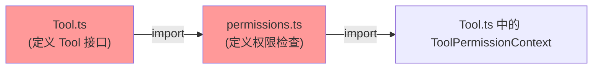
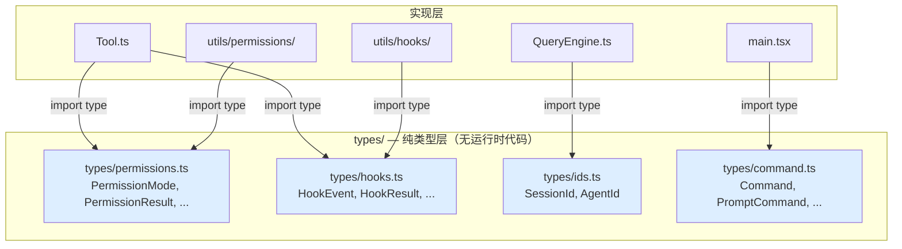
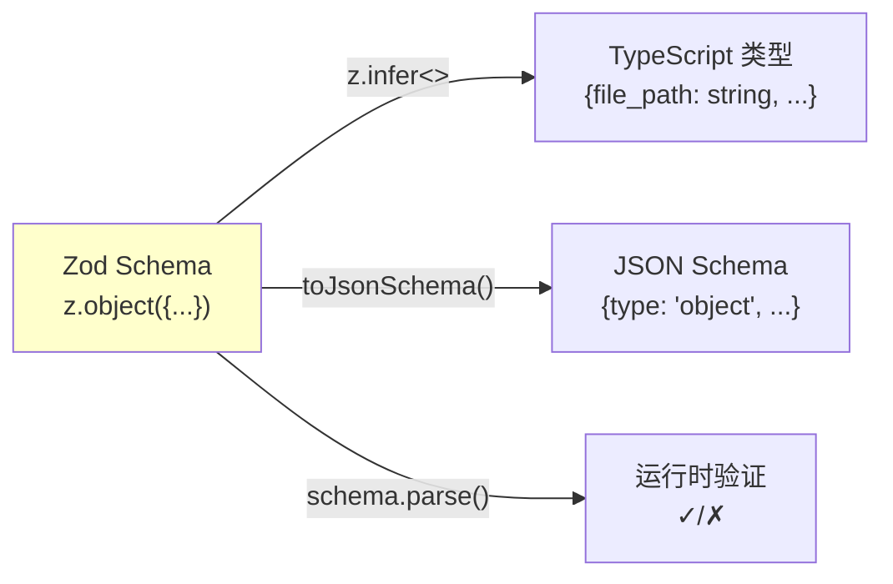
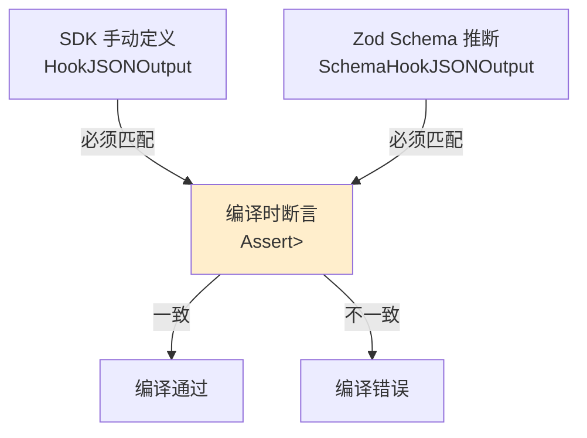
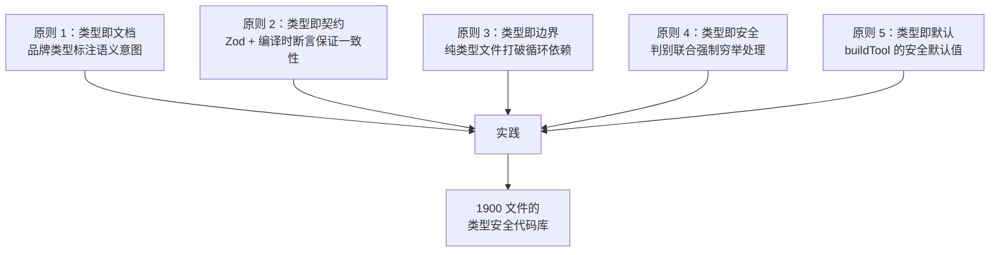

# 第 3 章 类型系统设计

> "类型不是约束，而是思维的外化。一个好的类型系统设计，就是一份自我验证的架构文档。"

Claude Code 是一个深度依赖 TypeScript 类型系统的项目。其类型设计不仅仅是为了编译时检查，更是一种**架构级别的约束传播机制**：通过类型定义来强制执行模块边界、打破循环依赖、保证 API 契约，以及在 Agent 系统中实现类型安全的消息传递。本章将从三个维度剖析这套类型系统的设计思想。

## 3.1 TypeScript 严格模式的工程价值

在一个拥有 1900 多个文件的代码库中，TypeScript 严格模式不是可选的锦上添花，而是工程必需品。Claude Code 对类型严格性的要求体现在多个层面。

### 品牌类型（Branded Types）

`src/types/ids.ts` 展示了一种高级的类型安全技巧 —— 品牌类型：

```typescript
// src/types/ids.ts
export type SessionId = string & { readonly __brand: 'SessionId' }
export type AgentId = string & { readonly __brand: 'AgentId' }
```

`SessionId` 和 `AgentId` 在运行时都是普通的 `string`，但在编译时它们是不可互换的：

```typescript
function processSession(id: SessionId): void { /* ... */ }
function processAgent(id: AgentId): void { /* ... */ }

const sessionId: SessionId = asSessionId('abc-123')
const agentId: AgentId = asAgentId('a-deadbeef01234567')

processSession(sessionId)  // 编译通过
processSession(agentId)    // 编译错误：AgentId 不能赋值给 SessionId
```

这种设计消除了一类常见的 bug：在 Agent 系统中，Session ID 和 Agent ID 都是字符串，容易在参数传递中混淆。品牌类型将这种运行时 bug 提升为编译时错误。

创建品牌类型的函数提供了窄化入口：

```typescript
export function asSessionId(id: string): SessionId {
  return id as SessionId
}

export function asAgentId(id: string): AgentId {
  return id as AgentId
}
```

注意 `toAgentId()` 函数还包含运行时验证：

```typescript
const AGENT_ID_PATTERN = /^a(?:.+-)?[0-9a-f]{16}$/

export function toAgentId(s: string): AgentId | null {
  return AGENT_ID_PATTERN.test(s) ? (s as AgentId) : null
}
```

`toAgentId` 和 `asAgentId` 的区别在于：前者是**安全的窄化**（返回 `null` 表示无效输入），后者是**断言式窄化**（调用者保证输入合法）。在 Claude Code 的使用中，`toAgentId` 用于解析外部输入（如 URL 参数），`asAgentId` 用于内部已知合法的场景。

### DeepImmutable 类型

`ToolPermissionContext` 被 `DeepImmutable` 包装，确保权限上下文在传递过程中不会被意外修改：

```typescript
// src/Tool.ts
export type ToolPermissionContext = DeepImmutable<{
  mode: PermissionMode
  additionalWorkingDirectories: Map<string, AdditionalWorkingDirectory>
  alwaysAllowRules: ToolPermissionRulesBySource
  alwaysDenyRules: ToolPermissionRulesBySource
  alwaysAskRules: ToolPermissionRulesBySource
  isBypassPermissionsModeAvailable: boolean
  // ...
}>
```

`DeepImmutable` 递归地将所有属性标记为 `readonly`，将 `Map` 转为 `ReadonlyMap`，将数组转为 `readonly` 数组。这保证了权限上下文在工具执行的整个生命周期中是不可变的 —— 任何试图修改它的代码都会导致编译错误。

## 3.2 循环依赖破解：纯类型文件的架构模式

循环依赖是大型 TypeScript 项目中最常见的架构退化信号。Claude Code 采用了一种系统性的解决方案：**将共享类型提取到纯类型文件中**。

### 问题根源

考虑以下依赖场景：



`Tool.ts` 需要引用权限类型，权限模块也需要引用工具类型。在运行时，这种循环会导致模块初始化时某些导出为 `undefined`。

### 解决方案：types/ 目录

`src/types/` 目录中的文件遵循严格的规则：**只包含类型定义和编译时常量，没有运行时依赖**。

```typescript
// src/types/permissions.ts 文件头注释
/**
 * Pure permission type definitions extracted to break import cycles.
 *
 * This file contains only type definitions and constants with no
 * runtime dependencies.
 * Implementation files remain in src/utils/permissions/ but can now
 * import from here to avoid circular dependencies.
 */
```



在 `Tool.ts` 中可以看到这种模式的具体应用：

```typescript
// src/Tool.ts
// 从集中位置导入权限类型以打破导入循环
import type {
  AdditionalWorkingDirectory,
  PermissionMode,
  PermissionResult,
} from './types/permissions.js'

// 从集中位置导入工具进度类型以打破导入循环
import type {
  AgentToolProgress,
  BashProgress,
  MCPProgress,
  REPLToolProgress,
  SkillToolProgress,
  TaskOutputProgress,
  ToolProgressData,
  WebSearchProgress,
} from './types/tools.js'
```

注释明确标注了 "to break import cycles"。同时，为了向后兼容，这些类型被重新导出：

```typescript
// 为了向后兼容，重新导出进度类型
export type {
  AgentToolProgress,
  BashProgress,
  MCPProgress,
  REPLToolProgress,
  SkillToolProgress,
  TaskOutputProgress,
  WebSearchProgress,
}
```

这意味着现有的消费者代码不需要修改导入路径 —— 它们仍然可以从 `Tool.ts` 导入这些类型，但 `Tool.ts` 自身的依赖链不再形成循环。

### types/permissions.ts 的完整剖析

`src/types/permissions.ts` 是这种模式的范例。它定义了完整的权限类型层次结构：

```typescript
// 权限模式 — 判别联合
export type ExternalPermissionMode = (typeof EXTERNAL_PERMISSION_MODES)[number]
export type InternalPermissionMode = ExternalPermissionMode | 'auto' | 'bubble'
export type PermissionMode = InternalPermissionMode

// 权限行为 — 三值枚举
export type PermissionBehavior = 'allow' | 'deny' | 'ask'

// 权限规则 — 来源标签
export type PermissionRuleSource =
  | 'userSettings'
  | 'projectSettings'
  | 'localSettings'
  | 'flagSettings'
  | 'policySettings'
  | 'cliArg'
  | 'command'
  | 'session'

// 权限决策 — 判别联合
export type PermissionDecision<Input> =
  | PermissionAllowDecision<Input>
  | PermissionAskDecision<Input>
  | PermissionDenyDecision
```

注意 `PermissionMode` 的定义方式：外部可见的模式（`ExternalPermissionMode`）是内部模式（`InternalPermissionMode`）的子集。`'auto'` 和 `'bubble'` 模式只在内部使用。通过 `feature()` 编译时开关，`'auto'` 模式甚至可以从运行时验证集合中完全移除：

```typescript
export const INTERNAL_PERMISSION_MODES = [
  ...EXTERNAL_PERMISSION_MODES,
  ...(feature('TRANSCRIPT_CLASSIFIER')
    ? (['auto'] as const)
    : ([] as const)),
] as const satisfies readonly PermissionMode[]
```

这是一个精妙的设计：类型系统中 `'auto'` 始终存在（因为 `InternalPermissionMode` 包含它），但运行时验证集合可以根据 feature flag 排除它。`satisfies` 关键字确保了数组内容与类型定义的一致性。

## 3.3 Zod Schema：运行时类型验证

TypeScript 的类型在编译后完全消失。对于需要处理外部输入的系统来说，仅靠编译时类型检查是不够的。Claude Code 使用 Zod v4 实现运行时类型验证，特别是在以下场景中：

### 工具输入验证

每个工具的 `inputSchema` 是一个 Zod schema：

```typescript
// 概念性示例：FileRead 工具的输入 schema
const inputSchema = z.object({
  file_path: z.string().describe("The absolute path to the file to read"),
  offset: z.number().optional().describe("Line number to start reading from"),
  limit: z.number().optional().describe("Number of lines to read"),
})
```

这个 schema 同时服务三个目的：

1. **API 契约**：自动生成 JSON Schema，发送给 Anthropic API 的 `tools` 参数
2. **运行时验证**：验证模型返回的工具调用参数是否合法
3. **类型推断**：通过 `z.infer<typeof inputSchema>` 自动推断 TypeScript 类型



### Hook 响应验证

`src/types/hooks.ts` 中定义了 Hook 系统的响应 schema：

```typescript
// src/types/hooks.ts
export const syncHookResponseSchema = lazySchema(() =>
  z.object({
    continue: z.boolean()
      .describe('Whether Claude should continue after hook (default: true)')
      .optional(),
    suppressOutput: z.boolean()
      .describe('Hide stdout from transcript (default: false)')
      .optional(),
    stopReason: z.string()
      .describe('Message shown when continue is false')
      .optional(),
    decision: z.enum(['approve', 'block']).optional(),
    reason: z.string()
      .describe('Explanation for the decision')
      .optional(),
    hookSpecificOutput: z.union([
      z.object({
        hookEventName: z.literal('PreToolUse'),
        permissionDecision: permissionBehaviorSchema().optional(),
        updatedInput: z.record(z.string(), z.unknown()).optional(),
        additionalContext: z.string().optional(),
      }),
      z.object({
        hookEventName: z.literal('PostToolUse'),
        additionalContext: z.string().optional(),
        updatedMCPToolOutput: z.unknown().optional(),
      }),
      // ... 更多 hook 事件类型
    ]).optional(),
  }),
)
```

注意 `lazySchema()` 包装器。这是一种延迟初始化模式 —— Zod schema 的创建有非零成本（需要分配验证器对象），通过 lazy 包装可以推迟到首次使用时才初始化。

### 编译时类型一致性断言

在 `hooks.ts` 的末尾有一段引人注目的代码：

```typescript
// src/types/hooks.ts
import type { IsEqual } from 'type-fest'
type Assert<T extends true> = T
type _assertSDKTypesMatch = Assert<
  IsEqual<SchemaHookJSONOutput, HookJSONOutput>
>
```

这是一个**编译时断言**，确保 Zod schema 推断出的类型（`SchemaHookJSONOutput`）与 SDK 中手动定义的类型（`HookJSONOutput`）完全一致。如果两者不匹配，编译会失败。

这种模式解决了一个常见问题：当 Zod schema 和手动类型定义同时存在时，它们可能因为独立修改而产生不一致。编译时断言充当了两个类型定义之间的"契约验证器"。



## 3.4 泛型工具类型：Tool<Input, Output, Progress>

`Tool` 类型是 Claude Code 类型系统的核心。它是一个三参数泛型类型，将输入验证、输出类型和进度报告统一在一个接口中：

```typescript
// src/Tool.ts
export type Tool<
  Input extends AnyObject = AnyObject,
  Output = unknown,
  P extends ToolProgressData = ToolProgressData,
> = {
  readonly name: string
  readonly inputSchema: Input

  call(
    args: z.infer<Input>,
    context: ToolUseContext,
    canUseTool: CanUseToolFn,
    parentMessage: AssistantMessage,
    onProgress?: ToolCallProgress<P>,
  ): Promise<ToolResult<Output>>

  description(
    input: z.infer<Input>,
    options: { /* ... */ },
  ): Promise<string>

  renderToolResultMessage?(
    content: Output,
    progressMessagesForMessage: ProgressMessage<P>[],
    options: { /* ... */ },
  ): React.ReactNode

  // ... 30+ 方法定义
}
```

三个类型参数的含义：

- **`Input extends AnyObject`**：工具输入的 Zod schema 类型。通过 `z.infer<Input>` 自动推断为 TypeScript 类型
- **`Output`**：工具执行结果的类型。不同工具有不同的输出结构
- **`P extends ToolProgressData`**：进度报告的类型。不同工具报告不同的进度信息

这种泛型设计确保了**方法签名之间的类型一致性**。例如，`call()` 方法返回 `ToolResult<Output>`，而 `renderToolResultMessage()` 接收 `Output` 类型的 `content` 参数 —— 编译器确保了产生结果和渲染结果使用相同的类型。

### buildTool 与 ToolDef

为了简化工具定义，Claude Code 引入了 `buildTool()` 工厂函数和 `ToolDef` 类型：

```typescript
// src/Tool.ts
type DefaultableToolKeys =
  | 'isEnabled'
  | 'isConcurrencySafe'
  | 'isReadOnly'
  | 'isDestructive'
  | 'checkPermissions'
  | 'toAutoClassifierInput'
  | 'userFacingName'

export type ToolDef<Input, Output, P> =
  Omit<Tool<Input, Output, P>, DefaultableToolKeys> &
  Partial<Pick<Tool<Input, Output, P>, DefaultableToolKeys>>
```

`ToolDef` 将 `Tool` 接口中的 7 个方法标记为可选。`buildTool()` 函数填充默认值：

```typescript
const TOOL_DEFAULTS = {
  isEnabled: () => true,
  isConcurrencySafe: (_input?: unknown) => false,  // 假设不安全
  isReadOnly: (_input?: unknown) => false,           // 假设有写操作
  isDestructive: (_input?: unknown) => false,
  checkPermissions: (input, _ctx?) =>
    Promise.resolve({ behavior: 'allow', updatedInput: input }),
  toAutoClassifierInput: (_input?: unknown) => '',
  userFacingName: (_input?: unknown) => '',
}

export function buildTool<D extends AnyToolDef>(def: D): BuiltTool<D> {
  return {
    ...TOOL_DEFAULTS,
    userFacingName: () => def.name,
    ...def,
  } as BuiltTool<D>
}
```

注意默认值的**安全倾向**设计：

- `isConcurrencySafe` 默认 `false`：假设工具不能并发执行（保守策略）
- `isReadOnly` 默认 `false`：假设工具有写操作（需要权限检查）
- `checkPermissions` 默认 `allow`：将权限决策交给通用权限系统

这种"安全默认"（fail-closed）的设计原则意味着：忘记实现某个方法不会导致安全漏洞，只会导致功能受限。

### BuiltTool 的类型级别 spread

`BuiltTool<D>` 的类型定义模拟了运行时的 `{ ...TOOL_DEFAULTS, ...def }` 操作：

```typescript
type BuiltTool<D> = Omit<D, DefaultableToolKeys> & {
  [K in DefaultableToolKeys]-?: K extends keyof D
    ? undefined extends D[K]
      ? ToolDefaults[K]     // D 中可选 → 使用默认值类型
      : D[K]                 // D 中必填 → 使用 D 的类型
    : ToolDefaults[K]        // D 中不存在 → 使用默认值类型
}
```

这段类型体操的核心是条件类型 `undefined extends D[K]` —— 它区分了"属性存在但可选"和"属性存在且必填"。这确保了当工具定义覆盖了某个默认方法时，返回类型精确反映覆盖后的签名。

## 3.5 判别联合类型

Claude Code 的消息系统和权限系统大量使用判别联合（Discriminated Union），通过 `type` 字段区分不同的消息/决策变体。

### 权限决策系统

`PermissionResult` 是一个经典的判别联合：

```typescript
// src/types/permissions.ts
export type PermissionResult<Input> =
  | PermissionAllowDecision<Input>
  | PermissionAskDecision<Input>
  | PermissionDenyDecision
  | { behavior: 'passthrough'; message: string; /* ... */ }
```

每个变体通过 `behavior` 字段判别：

```typescript
export type PermissionAllowDecision<Input> = {
  behavior: 'allow'
  updatedInput?: Input       // 可能修改后的输入
  userModified?: boolean     // 用户是否手动修改
  acceptFeedback?: string    // 用户接受时的反馈
  contentBlocks?: ContentBlockParam[]
}

export type PermissionAskDecision<Input> = {
  behavior: 'ask'
  message: string            // 询问用户的消息
  suggestions?: PermissionUpdate[]  // 建议的权限更新
  pendingClassifierCheck?: PendingClassifierCheck  // 异步分类器检查
}

export type PermissionDenyDecision = {
  behavior: 'deny'
  message: string            // 拒绝原因
  decisionReason: PermissionDecisionReason  // 必填：必须说明原因
}
```

注意类型设计中的**不对称性**：

- `allow` 的 `decisionReason` 是可选的（允许不需要解释）
- `deny` 的 `decisionReason` 是**必填的**（拒绝必须给出原因）
- `ask` 可以携带 `suggestions`（建议用户如何修改权限规则）

消费代码中的 narrowing：

```typescript
const result = await checkPermissions(input, context)

switch (result.behavior) {
  case 'allow':
    // TypeScript 知道 result 是 PermissionAllowDecision
    const finalInput = result.updatedInput ?? input
    break
  case 'ask':
    // TypeScript 知道 result 是 PermissionAskDecision
    showPrompt(result.message, result.suggestions)
    break
  case 'deny':
    // TypeScript 知道 result 是 PermissionDenyDecision
    logDenial(result.decisionReason)  // decisionReason 保证存在
    break
}
```

### PermissionDecisionReason 的深层判别

权限决策的原因本身也是一个判别联合，使用 `type` 字段：

```typescript
export type PermissionDecisionReason =
  | { type: 'rule'; rule: PermissionRule }
  | { type: 'mode'; mode: PermissionMode }
  | { type: 'subcommandResults'; reasons: Map<string, PermissionResult> }
  | { type: 'hook'; hookName: string; hookSource?: string; reason?: string }
  | { type: 'asyncAgent'; reason: string }
  | { type: 'sandboxOverride'; reason: 'excludedCommand' | 'dangerouslyDisableSandbox' }
  | { type: 'classifier'; classifier: string; reason: string }
  | { type: 'workingDir'; reason: string }
  | { type: 'safetyCheck'; reason: string; classifierApprovable: boolean }
  | { type: 'other'; reason: string }
```

这个类型精确表达了"一个权限决策可能由 10 种不同的原因产生"。`subcommandResults` 变体甚至包含了一个递归的 `PermissionResult` Map，用于表示 Bash 命令中子命令的权限结果组合。

`safetyCheck` 变体中的 `classifierApprovable` 布尔字段是一个精细的安全决策标记：

```typescript
{
  type: 'safetyCheck'
  reason: string
  // 当为 true 时，auto 模式允许分类器评估而非强制弹窗
  // 对于敏感文件路径（.claude/, .git/, shell configs）为 true
  // 对于 Windows 路径绕过和跨机器 bridge 消息为 false
  classifierApprovable: boolean
}
```

### 工具搜索与读取操作的类型判别

`Tool` 接口中的 `isSearchOrReadCommand` 方法返回一个结构化的操作分类：

```typescript
isSearchOrReadCommand?(input: z.infer<Input>): {
  isSearch: boolean    // grep, find, glob 模式
  isRead: boolean      // cat, head, tail, 文件读取
  isList?: boolean     // ls, tree, du
}
```

这个返回类型不是布尔值，而是一个三维的操作分类。UI 层使用它来决定是否将连续的搜索/读取操作折叠为紧凑显示。`isList` 标记为可选是因为它是后加的 —— `isSearch` 和 `isRead` 在初始设计中就存在。

### Command 类型的联合设计

`src/types/command.ts` 中的 `Command` 类型展示了另一种判别联合模式 —— **基类 + 变体联合**：

```typescript
export type Command = CommandBase &
  (PromptCommand | LocalCommand | LocalJSXCommand)
```

`CommandBase` 定义了所有命令共享的属性（name, description, isEnabled 等），而联合部分通过 `type` 字段区分三种执行模式：

```typescript
type PromptCommand = {
  type: 'prompt'             // 发送给模型执行
  progressMessage: string
  getPromptForCommand(args: string, context: ToolUseContext):
    Promise<ContentBlockParam[]>
}

type LocalCommand = {
  type: 'local'              // 本地执行（无 UI）
  supportsNonInteractive: boolean
  load: () => Promise<LocalCommandModule>
}

type LocalJSXCommand = {
  type: 'local-jsx'          // 本地执行（有 UI）
  load: () => Promise<LocalJSXCommandModule>
}
```

`PromptCommand` 是斜杠命令（如技能和插件）的类型：它们被转换为 prompt 发送给模型。`LocalCommand` 和 `LocalJSXCommand` 是本地执行的命令：前者是纯逻辑命令，后者需要渲染 React 组件。

注意 `load()` 方法的延迟加载设计：命令的实现代码只在用户实际调用时才加载，避免了注册数十个命令带来的启动开销。

## 3.6 类型系统作为架构文档

回顾本章讨论的类型设计，可以提炼出几条贯穿整个代码库的设计原则：



**1. 使不合法状态不可表示**（Make illegal states unrepresentable）。`SessionId` 和 `AgentId` 的品牌类型使得混淆两者在编译时就会被捕获。`PermissionDenyDecision` 的必填 `decisionReason` 使得"无理由拒绝"在类型层面不可能。

**2. 用编译时断言桥接两个类型世界**。当 Zod schema 和 SDK 类型并存时，`Assert<IsEqual<A, B>>` 确保它们永远一致。

**3. 将运行时验证与静态类型统一**。Zod 的 `z.infer<T>` 让 schema 和类型共享同一个真相来源，避免了手动维护两份定义的同步问题。

**4. 通过纯类型文件实现架构解耦**。`types/` 目录不包含运行时代码，这使得它可以被任何模块安全导入，而不会引入运行时依赖。

**5. 安全默认与显式覆盖**。`buildTool()` 的默认值选择了保守的安全策略（不可并发、非只读、交由通用权限系统），工具实现者必须显式声明更宽松的行为。

## 本章小结

Claude Code 的类型系统不是简单的"给 JavaScript 加类型注解"。它是一个精心设计的、多层次的类型架构：

1. **底层**：品牌类型和 DeepImmutable 提供编译时安全保障
2. **中层**：纯类型文件和重新导出解决循环依赖和模块边界问题
3. **上层**：Zod schema 和判别联合实现运行时验证和穷举性检查
4. **工具层**：泛型 Tool 接口和 buildTool 工厂函数统一了 40+ 工具的类型契约

这套类型系统的设计使得一个 1900 文件的代码库能够在快速迭代中保持结构完整性 —— 类型检查器充当了永不休息的架构审查员。
