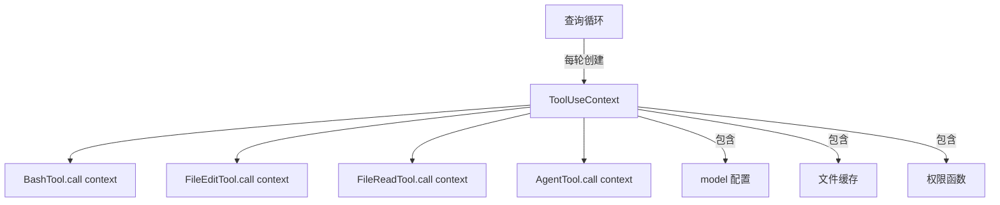
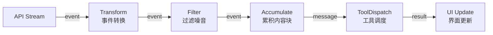
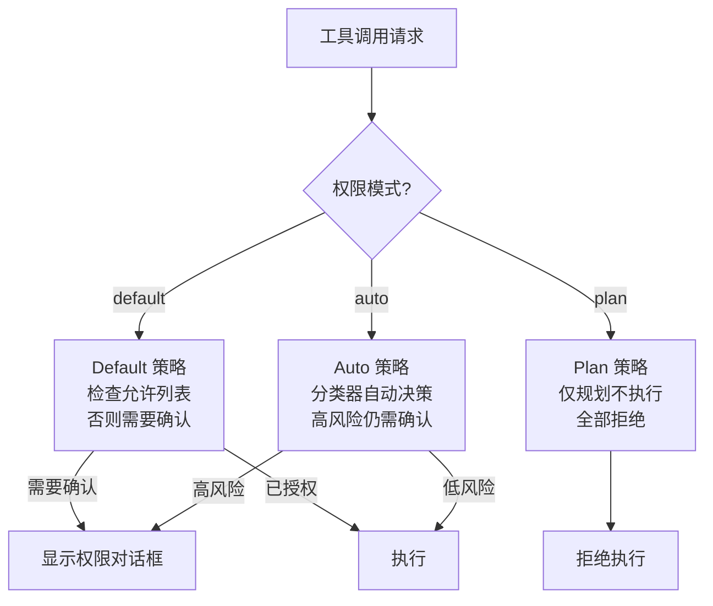
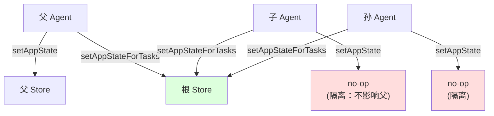

# 第 24 章：设计模式提炼

> "设计模式不是教条，而是对反复出现的问题的最佳回答的提炼。在 Claude Code 中，这些模式被重新演绎为 Agent 时代的变体。"

本章从 Claude Code 的源码中提炼出最具特色的设计模式。这些模式不是照搬 GoF 经典，而是在 AI Agent 系统的独特约束下演化出的新形态。

## 24.1 依赖注入 —— ToolUseContext

### 24.1.1 模式描述

`ToolUseContext` 是 Claude Code 中最核心的依赖注入容器。每个工具调用都接收一个 ToolUseContext 对象，其中包含了工具执行所需的全部环境信息：

```typescript
// src/Tool.ts
export type ToolUseContext = {
  options: {
    mainLoopModel: string
    maxThinkingTokens: number | undefined
  }
  agentId: AgentId
  readFileState: FileStateCache
  writeFileState: FileStateCache
  tools: Tool[]
  mcpClients: MCPServerConnection[]
  canUseTool: CanUseToolFn
  // ... 更多上下文
}
```

### 24.1.2 为什么不用传统 DI 框架

Claude Code 没有使用 InversifyJS 或 tsyringe 等 DI 框架。ToolUseContext 是一个显式的参数对象（Parameter Object），而非容器管理的服务。原因在于：

1. **生命周期明确** —— Context 在每个查询轮次中创建，随轮次结束销毁
2. **类型安全** —— TypeScript 的结构类型系统已经提供了足够的接口抽象
3. **可测试性** —— 在测试中构造 Context 对象比配置 DI 容器更直观



### 24.1.3 Context 传播

工具调用时，Context 被向下传播。子 Agent 接收父 Agent 的 Context 变体：

```typescript
// AgentTool 创建子 Context
const childContext: ToolUseContext = {
  ...parentContext,
  agentId: childAgentId,
  readFileState: createFileStateCacheWithSizeLimit(READ_FILE_STATE_CACHE_SIZE),
  // 子 Agent 获得独立的文件缓存但共享工具集
}
```

## 24.2 失败关闭 —— 安全默认值

### 24.2.1 模式描述

在安全关键系统中，"失败关闭"意味着当系统无法确定正确的行为时，选择更安全（更限制性的）默认值。Claude Code 在权限系统中严格遵循这一原则。

### 24.2.2 权限默认值

```typescript
// src/state/AppStateStore.ts
export function getDefaultAppState(): AppState {
  return {
    toolPermissionContext: {
      ...getEmptyToolPermissionContext(),
      mode: initialMode,  // 默认为 'default'（需要确认）
    },
    // ...
  }
}
```

默认权限模式是 `'default'` —— 需要用户确认每个工具操作。用户必须显式选择 `'auto'` 模式才能跳过确认。

### 24.2.3 Bypass 权限的保护

```typescript
// src/state/AppState.tsx
useEffect(() => {
  const { toolPermissionContext } = store.getState()
  if (toolPermissionContext.isBypassPermissionsModeAvailable
      && isBypassPermissionsModeDisabled()) {
    logForDebugging("Disabling bypass permissions mode on mount")
    store.setState(prev => ({
      ...prev,
      toolPermissionContext: createDisabledBypassPermissionsContext(
        prev.toolPermissionContext
      ),
    }))
  }
}, [])
```

即使 bypass 模式在本地可用，远程设置（可能在挂载后才加载）仍可以禁用它。这是"失败关闭"在时序问题上的应用 —— 在安全信号到达前，保持最安全的状态。

### 24.2.4 断路器也是失败关闭

```typescript
// 连续失败 3 次后停止重试
if (tracking?.consecutiveFailures >= MAX_CONSECUTIVE_AUTOCOMPACT_FAILURES) {
  return { wasCompacted: false }
}
```

压缩的断路器也遵循失败关闭 —— 当压缩反复失败时，停止尝试而非无限重试。"不做事"比"做错事"更安全。

## 24.3 Generator 流水线 —— AsyncGenerator 组合

### 24.3.1 模式描述

Claude Code 的查询引擎使用 AsyncGenerator 模式处理流式响应。每个处理阶段是一个 generator，通过组合形成流水线。

### 24.3.2 流式处理链

```typescript
// 概念模型
async function* queryModelWithStreaming(
  messages: Message[],
  systemPrompt: string,
  tools: Tool[],
): AsyncGenerator<StreamEvent> {
  const stream = await api.messages.stream(/* ... */)

  for await (const event of stream) {
    // 每个事件被逐一 yield
    yield transformEvent(event)
  }
}

// REPL 消费流
for await (const event of queryModelWithStreaming(messages, system, tools)) {
  if (event.type === 'content_block_delta') {
    // 增量更新 UI
    updateMessages(event)
  } else if (event.type === 'tool_use') {
    // 触发工具调用
    yield* handleToolUse(event)  // yield* 委托到子 generator
  }
}
```

### 24.3.3 流水线优势



AsyncGenerator 组合的优势在于：
1. **背压** —— 下游处理慢时自动暂停上游
2. **懒求值** —— 只在需要时拉取下一个事件
3. **取消** —— 可以随时终止流水线（用户按 Escape）
4. **组合性** —— 每个阶段独立可测试

## 24.4 观察者模式 —— Hook 系统

### 24.4.1 模式描述

Claude Code 的 Hook 系统是观察者模式的一种变体。Hook 允许用户在关键事件（会话开始、压缩前后、工具调用前后）注入自定义逻辑。

### 24.4.2 会话钩子

```typescript
// Hook 类型
export type SessionHooksState = Map<string, HookState>

// Hook 执行点
import { processSessionStartHooks } from '../utils/sessionStart.js'
import { executeSessionEndHooks } from '../utils/hooks.js'
import { executePreCompactHooks, executePostCompactHooks } from '../utils/hooks.js'
```

### 24.4.3 onChange 作为观察者

Store 的 `onChange` 回调也是一种观察者实现：

```typescript
const store = createStore(initialState, onChangeAppState)

// onChangeAppState 观察所有状态变化
function onChangeAppState({ newState, oldState }) {
  // 权限模式变化 → 通知 CCR
  // 模型变化 → 更新 settings
  // 详细模式变化 → 更新 globalConfig
  // 设置变化 → 清除认证缓存
}
```

## 24.5 策略模式 —— 权限分类器

### 24.5.1 模式描述

权限分类器使用策略模式 —— 根据当前权限模式选择不同的决策策略。

### 24.5.2 权限模式策略



### 24.5.3 可扩展性

新的权限模式可以通过添加新的策略实现来扩展，无需修改现有代码。`PermissionMode` 联合类型确保了所有策略都被穷尽处理：

```typescript
export type PermissionMode =
  | 'default'
  | 'plan'
  | 'auto'
  | 'bubble'
  | 'ungated_auto'
  // ...
```

## 24.6 工厂模式 —— buildTool, createStore

### 24.6.1 Store 工厂

`createStore` 是最纯粹的工厂函数 —— 接收配置（初始状态、onChange），返回一个完整的 Store 实例：

```typescript
export function createStore<T>(
  initialState: T,
  onChange?: OnChange<T>,
): Store<T> {
  let state = initialState
  const listeners = new Set<Listener>()
  return { getState, setState, subscribe }
}
```

### 24.6.2 缓存工厂

```typescript
export function createFileStateCacheWithSizeLimit(
  maxEntries: number,
  maxSizeBytes: number = DEFAULT_MAX_CACHE_SIZE_BYTES,
): FileStateCache {
  return new FileStateCache(maxEntries, maxSizeBytes)
}
```

### 24.6.3 默认状态工厂

```typescript
export function getDefaultAppState(): AppState {
  // 60+ 个字段的默认值构建
  return { ... }
}
```

工厂模式在 Claude Code 中的应用特点是：**工厂函数通常是纯函数**（或接近纯函数），不依赖全局状态。这使得它们在测试中特别容易使用 —— 每次调用都产生一个独立的实例。

### 24.6.4 CompactionResult 构建器

```typescript
export function buildPostCompactMessages(result: CompactionResult): Message[] {
  return [
    result.boundaryMarker,
    ...result.summaryMessages,
    ...(result.messagesToKeep ?? []),
    ...result.attachments,
    ...result.hookResults,
  ]
}
```

这是一个构建器（Builder）变体 —— 从结构化的中间表示构建最终的消息列表。顺序封装在函数内部，调用者无需了解消息组装规则。

## 24.7 双通道模式 —— 隔离与共享的平衡

### 24.7.1 模式描述

当一个子系统需要同时支持"默认隔离"和"显式共享"两种语义时，Claude Code 使用双通道设计。最典型的例子是 `ToolUseContext` 中的 `setAppState` 与 `setAppStateForTasks`（参见第 7 章 §7.3.3）。

### 24.7.2 隔离通道 vs 共享通道



- **隔离通道**（`setAppState`）：子 Agent 的状态修改不泄漏到父 Agent，防止多层嵌套 Agent 之间的状态污染
- **共享通道**（`setAppStateForTasks`）：穿透到根 Store，用于全局基础设施（后台任务注册、会话钩子）

### 24.7.3 模式应用矩阵

| 场景 | 通道 | 原因 |
|------|------|------|
| 普通状态更新 | 隔离 | 防止子 Agent 副作用泄漏 |
| 后台任务注册 | 共享 | 任务需要在 Agent 结束后存活 |
| 会话钩子 | 共享 | 钩子是全局基础设施 |
| 文件缓存 | 隔离 | 每个 Agent 独立缓存，避免缓存膨胀 |
| 权限追踪 | 隔离 | 拒绝计数不应跨 Agent 累计 |

## 24.8 编译时多态 —— feature() 宏

### 24.8.1 模式描述

传统的策略模式在运行时通过接口和多态实现分支。Claude Code 使用 `feature()` 宏实现**编译时多态** —— 不同构建配置产生不同的代码，运行时无分支开销。

### 24.8.2 与运行时策略的对比

```typescript
// 运行时策略（传统方式）
function getVoiceProvider() {
  if (config.voiceEnabled) {        // 运行时检查
    return new VoiceProvider()       // 代码始终在包中
  }
  return new NoopProvider()
}

// 编译时多态（Claude Code 方式）
const VoiceProvider = feature('VOICE_MODE')
  ? require('../context/voice.js').VoiceProvider   // 内部构建：包含
  : ({ children }) => children                      // 外部构建：DCE 移除 voice.js
```

编译时多态的优势：
1. **零运行时开销** —— 无条件分支
2. **安全保证** —— 内部代码物理上不存在于外部产物中
3. **包大小优化** —— 未启用的模块及其依赖树被完全移除

### 24.8.3 已知的 Feature Flag 清单

从源码中提取的完整 feature flag 列表：

| Feature Flag | 功能 | 外部构建 |
|-------------|------|---------|
| `VOICE_MODE` | 语音输入 | 移除 |
| `COORDINATOR_MODE` | 多 Agent 协调器 | 移除 |
| `PROACTIVE` | 后台主动 Agent | 移除 |
| `KAIROS` | 助手/通道模式 | 移除 |
| `FORK_SUBAGENT` | Fork 子 Agent | 移除 |
| `TRANSCRIPT_CLASSIFIER` | 自动权限模式 | 移除 |
| `BASH_CLASSIFIER` | Bash 命令分类器 | 移除 |
| `HISTORY_SNIP` | 上下文片段压缩 | 移除 |
| `VERIFICATION_AGENT` | 验证 Agent | 移除 |
| `BRIDGE_MODE` | IDE 桥接 | 移除 |

## 24.9 反模式警示

### 24.7.1 巨型组件

REPL.tsx 的 5000 行是一个需要关注的信号。虽然 React Compiler 的自动 memoization 缓解了性能问题，但维护性仍然是挑战。团队通过将逻辑提取到 hooks（`useTasksV2WithCollapseEffect`、`useReplBridge` 等）来逐步减小主组件的体积。

### 24.7.2 全局可变状态

`src/bootstrap/state.ts` 文件头的警告说明了团队的态度：

```typescript
// DO NOT ADD MORE STATE HERE - BE JUDICIOUS WITH GLOBAL STATE
```

全局状态虽然方便，但增加了不可见的耦合。团队正在将状态逐步迁移到 AppState Store 中，通过 `onChange` 机制统一管理副作用。

## 本章小结

Claude Code 的设计模式展现了一种实用主义的工程审美。ToolUseContext 的显式依赖注入避免了框架的复杂性，`feature()` 宏的策略模式实现了编译时多态，AsyncGenerator 流水线为流式处理提供了优雅的抽象。

最值得注意的是"失败关闭"原则的无处不在 —— 从默认权限模式到断路器，从 bypass 权限的动态禁用到 identity guard 的并发保护。在一个运行着实际代码的 AI Agent 中，安全不是可选项，而是设计的起点。
