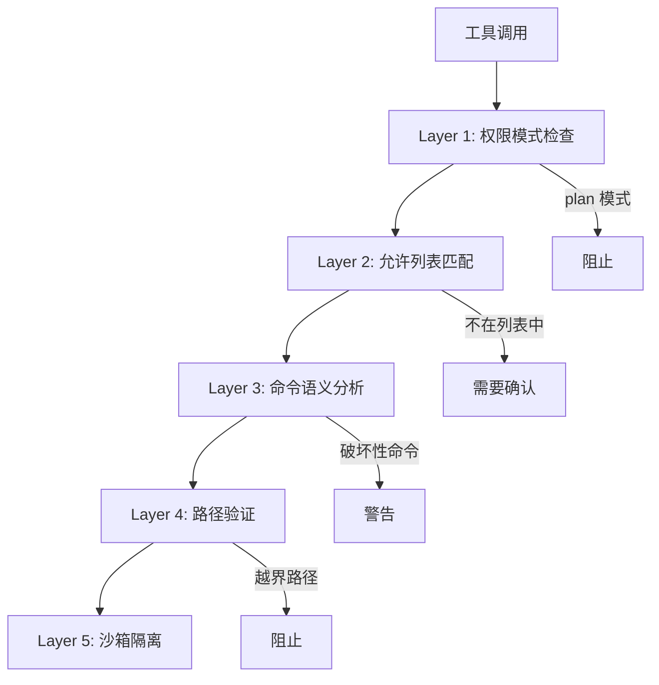
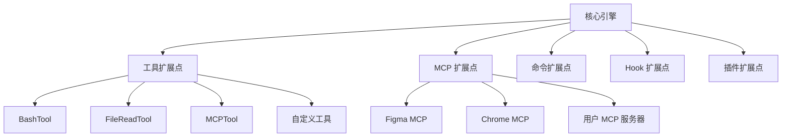
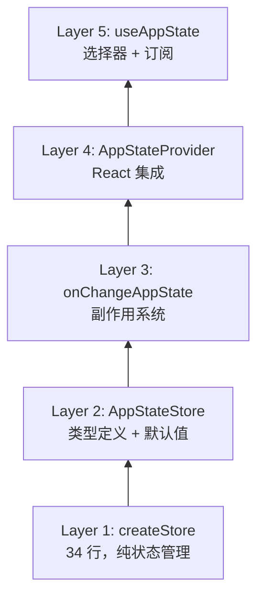
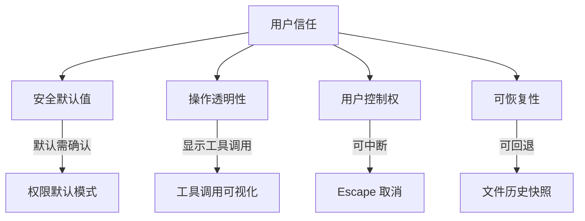
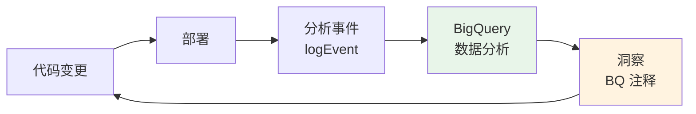
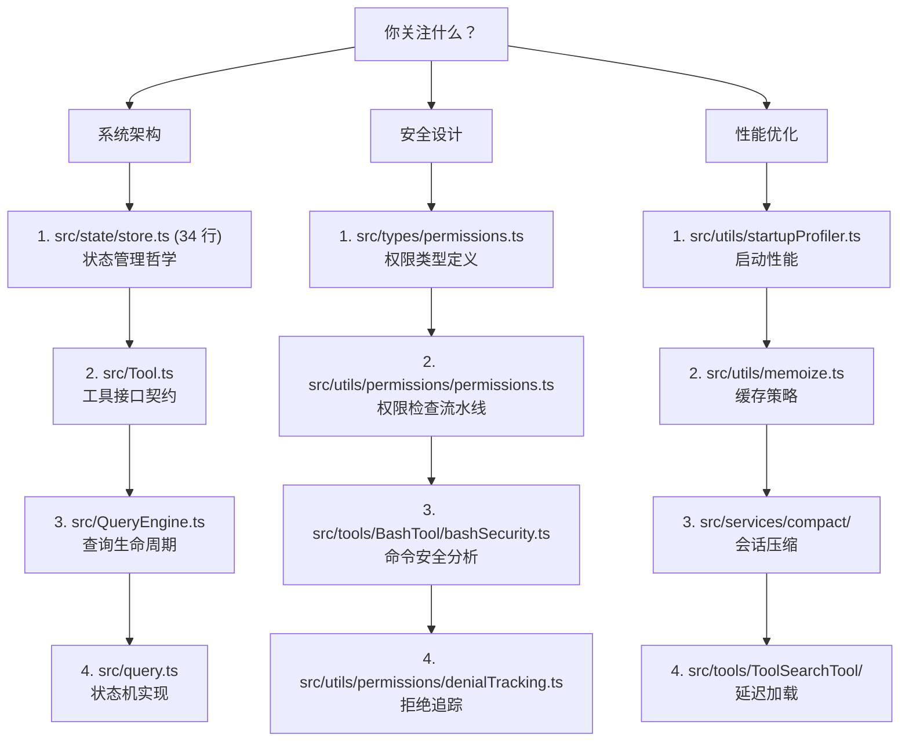

# 第 25 章：工程哲学

> "代码是一种思想的结晶。当我们审视一个大型系统的架构时，我们看到的不仅是技术决策，更是一种工程文化的表达。"

通过前 24 章对 Claude Code 源码的深入分析，我们可以提炼出其背后的工程哲学。这些原则不是事后总结的空洞口号，而是从代码中浮现的、经过实践检验的设计信条。

## 25.1 安全优先

### 25.1.1 安全是设计的起点，不是事后补丁

在 Claude Code 的架构中，安全不是一个独立的模块，而是渗透在每个设计决策中的基本原则。

**默认拒绝**。权限系统的默认模式是 `'default'`（需要确认），不是 `'auto'`（自动允许）。用户必须显式选择更宽松的模式。这意味着任何新功能如果遗忘了权限检查，其行为是"阻塞等待确认"而非"静默执行"。

**多层防线**。一个工具调用需要通过多层检查：



**动态降级**。即使某个安全检查在启动时可用，后续加载的远程配置仍可以禁用它（`isBypassPermissionsModeDisabled`）。安全级别只能提升，不能降低。

### 25.1.2 安全边界的显式表达

代码中的安全边界不是隐含的约定，而是类型系统强制的契约：

```typescript
// 敏感分析数据使用特殊类型名防止误用
type AnalyticsMetadata_I_VERIFIED_THIS_IS_NOT_CODE_OR_FILEPATHS = {
  [key: string]: string | number | boolean
}
```

这个类型名本身就是一份声明 —— 每个使用者都必须确认数据不包含代码或文件路径。类型名的冗长是故意的，它迫使开发者在使用时停下来思考。

## 25.2 可扩展性

### 25.2.1 Plugin-First 思维

Claude Code 的工具系统、MCP 服务器、命令系统都是可扩展的。核心并不"硬编码"功能，而是提供扩展点：



### 25.2.2 AppState 的"有机增长"

AppState 的 450 行类型定义看似庞大，但它的增长是有机的 —— 每个字段都对应一个具体的功能需求，而非预先设计的空壳。注释清楚地解释了每个字段的来由：

```typescript
// Agent name from --agent CLI flag or settings (for logo display)
agent: string | undefined

// Assistant mode fully enabled (settings + GrowthBook gate + trust).
// Single source of truth - computed once in main.tsx before option
// mutation, consumers read this instead of re-calling isAssistantMode().
kairosEnabled: boolean

// Accumulated by onAppsHidden, cleared + unhidden at turn end.
hiddenDuringTurn?: ReadonlySet<string>
```

### 25.2.3 编译时可扩展性

`feature()` 宏提供了编译时的可扩展性 —— 不同构建可以包含不同的功能集，而源码保持统一。这比运行时特性开关更高效，因为不满足的代码路径被完全消除。

## 25.3 可观测性

### 25.3.1 日志与追踪

Claude Code 集成了 OpenTelemetry 追踪：

```typescript
// src/bootstrap/state.ts
import type { Attributes, Meter, MetricOptions } from '@opentelemetry/api'
import type { logs } from '@opentelemetry/api-logs'
import type { LoggerProvider } from '@opentelemetry/sdk-logs'
import type { MeterProvider } from '@opentelemetry/sdk-metrics'
import type { BasicTracerProvider } from '@opentelemetry/sdk-trace-base'
```

### 25.3.2 分析事件

关键操作都附带分析事件：

```typescript
import { logEvent, type AnalyticsMetadata_I_VERIFIED_THIS_IS_NOT_CODE_OR_FILEPATHS }
  from '../services/analytics/index.js'

// 压缩事件
logEvent('tengu_compact', {
  isRecompaction: recompactionInfo.isRecompactionInChain,
  turnsSincePreviousCompact: recompactionInfo.turnsSincePreviousCompact,
  autoCompactThreshold: recompactionInfo.autoCompactThreshold,
})
```

### 25.3.3 数据驱动的改进

代码注释中反复引用的 BQ（BigQuery）数据分析，展示了一个完整的可观测性闭环：

```
事件记录 → BigQuery 分析 → 发现问题 → 代码修复 → 新事件验证
```

示例：
- "BQ 2026-03-10: 1,279 sessions had 50+ consecutive failures" → 引入断路器
- "BQ 2026-03-01: 20% false positives in cache break detection" → 修复基线重置

### 25.3.4 调试日志

`logForDebugging` 函数提供了条件调试日志，仅在 verbose 模式下可见：

```typescript
logForDebugging(
  `autocompact: tokens=${tokenCount} threshold=${threshold} effectiveWindow=${effectiveWindow}`,
)
```

## 25.4 渐进式复杂性

### 25.4.1 简单的事情保持简单

Store 的 34 行实现是这一原则的极致体现。它没有中间件、没有 devtools、没有时间旅行调试。当你只需要一个状态容器时，34 行就够了。

### 25.4.2 复杂的事情被分层管理

当简单不够时，复杂性被分层注入：



每一层只添加它负责的复杂性。Layer 1 不知道 React，Layer 2 不知道副作用，Layer 3 不知道 UI。

### 25.4.3 特性的渐进式暴露

用户界面也遵循渐进式复杂性：

- **默认**：简单的输入框和消息列表
- **Shift+Tab**：权限模式切换
- **Ctrl+T**：任务面板
- **Vim 模式**：完整的 Vim 编辑
- **配置文件**：键绑定自定义、主题、插件

新用户不需要了解 Vim 模式就能使用 Claude Code。专家用户可以逐步发现高级功能。

## 25.5 生产级 Agent 工程法则

### 25.5.1 法则一：永远假设会崩溃

JSONL 只追加日志保证崩溃安全。`filterUnresolvedToolUses` 处理崩溃后的残留状态。`deserializeMessages` 的五层过滤管道清理各种异常数据。

### 25.5.2 法则二：非确定性是常态，不是异常

AI 模型的输出是非确定性的。Claude Code 的设计接受这一现实：
- 压缩摘要使用结构化 Prompt 而非精确模板
- 权限系统不依赖模型的"承诺"
- 断路器处理"有时失败"的操作

### 25.5.3 法则三：成本是一等约束

每个 API 调用都有真实成本。Token 预算追踪、自动压缩、MicroCompact 的工具输出裁剪 —— 所有这些都是成本优化措施。`CostThresholdDialog` 是最后的安全网。

### 25.5.4 法则四：上下文是最宝贵的资源

200K Token 的上下文窗口看似很大，但在数小时的编码会话中会迅速耗尽。Claude Code 围绕上下文管理构建了一整套体系：

- **精确注入** —— 只注入相关的 CLAUDE.md 和上下文
- **及时裁剪** —— MicroCompact 移除过时的工具输出
- **智能压缩** —— 分层压缩策略（Session Memory → 全量压缩）
- **增量保持** —— Partial Compact 保留最近的消息原文

### 25.5.5 法则五：用户信任是最难获得也最易失去的

权限系统的严格默认、成本阈值警告、自动更新的用户确认 —— 所有这些都在保护用户信任。一次意外的 `rm -rf` 就能毁掉所有积累的信任。



### 25.5.6 法则六：可组合性胜过单体

Store + onChange + Selector 的组合胜过一个大而全的状态管理框架。AsyncGenerator 的组合胜过一个复杂的事件总线。`feature()` + DCE 的组合胜过运行时条件分支。

选择小的、可组合的原语，而非大的、不可分割的框架。

## 25.6 数据驱动的工程文化

### 25.6.1 BQ 注释：代码与生产数据的桥梁

Claude Code 源码中最独特的文化标识之一是遍布各处的 BQ（BigQuery）注释。这些注释将代码变更与真实的生产数据直接关联：

```typescript
// BQ 2026-03-10: 1,279 sessions had 50+ consecutive failures
//   → 引入 autoCompact 断路器

// BQ 2026-03-01: missing this made 20% of tengu_prompt_cache_break
//   events false positives → 修复基线重置

// Dropping claudeMd here saves ~5-15 Gtok/week across 34M+ Explore spawns
//   → omitClaudeMd 优化
```

这些注释不仅是历史记录，更是**设计决策的证据链**。每个优化都有数据支撑，每个安全措施都有事故教训。

### 25.6.2 量化一切

Claude Code 团队对性能的量化精度令人印象深刻：

| 量化指标 | 数据来源 | 设计决策 |
|---------|---------|---------|
| Explore Agent 3400 万次/周调用 | Fleet 统计 | omitClaudeMd 节省十亿 token |
| Transcript 写入 ~4ms (SSD) / ~30ms (争用) | 启动剖析 | bare 模式 fire-and-forget |
| MDM 读取 + Keychain 预取 65ms | profileCheckpoint | 并行预取隐藏在 135ms 模块加载后 |
| 1,279 个会话遭遇 50+ 连续失败 | BigQuery | 引入断路器 |
| 20% 的缓存中断检测是误报 | BigQuery | 修复基线重置逻辑 |

这不是"我觉得这可能有性能问题"式的优化，而是"数据显示这里每周浪费 X 十亿 token"式的精准打击。

### 25.6.3 反馈闭环



这个闭环确保了工程决策不是基于直觉，而是基于证据。当一个优化被提出时，它必须回答："数据说什么？"

## 25.7 给后来者的建议

### 25.6.1 阅读注释

Claude Code 的代码注释不是冗余的文档，而是设计决策的记录。特别是以 "BQ"、"CC-" 开头的注释，它们连接了代码变更与真实的生产问题。

### 25.6.2 理解 feature() 的边界

在阅读代码时，`feature()` 包裹的代码块标记了内部特性的边界。外部构建中这些代码不存在，理解这一点对理解代码的"可见范围"至关重要。

### 25.7.3 从 Store 开始

如果只有时间读一个文件，读 `src/state/store.ts`。34 行代码中包含了 Claude Code 架构哲学的精华 —— 简洁、显式、可组合。

### 25.7.4 三个阅读入口

根据你的兴趣，选择不同的源码阅读路径：



## 本章小结

Claude Code 的工程哲学可以用一句话概括：**在安全的框架内，用最简单的手段解决真实的问题**。

安全是不可协商的底线。简单是持续追求的目标。真实问题（而非假想的需求）是每个设计决策的起点。数据（而非直觉）是改进的依据。

这些原则不是 Claude Code 独创的，但它在一个前所未有的领域 —— 生产级 AI Agent 工程 —— 中忠实地实践了它们。当我们回顾这个项目时，最令人敬佩的不是任何单个技术创新，而是在不确定性的海洋中保持工程纪律的能力。
