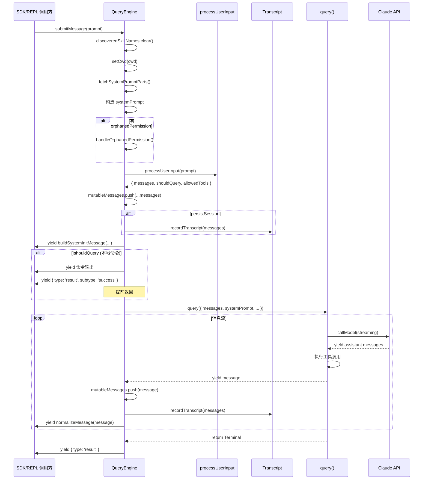
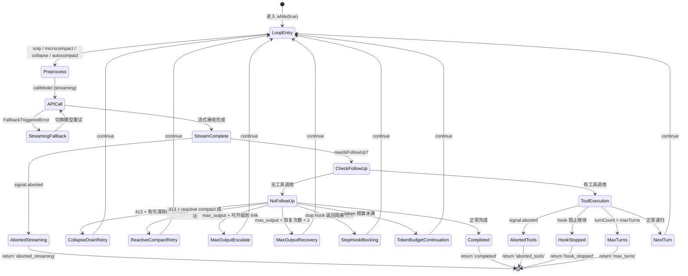

# 第 4 章：查询引擎

> "一个优秀的引擎设计，不在于它能跑多快，而在于它在出错时仍能保持可控。"

查询引擎（Query Engine）是 Claude Code 整个交互循环的心脏。无论用户是通过命令行 REPL 输入一条提示，还是通过 SDK 以编程方式发送消息，最终都会汇入同一条河流——`QueryEngine.submitMessage()` 方法。本章将深入剖析这一核心组件的设计哲学、状态管理与错误恢复机制。

## 4.1 QueryEngine 类

### 设计目标与职责划分

`QueryEngine` 的文件头注释道出了它的设计意图：

```typescript
/**
 * QueryEngine owns the query lifecycle and session state for a conversation.
 * It extracts the core logic from ask() into a standalone class that can be
 * used by both the headless/SDK path and (in a future phase) the REPL.
 *
 * One QueryEngine per conversation. Each submitMessage() call starts a new
 * turn within the same conversation. State (messages, file cache, usage, etc.)
 * persists across turns.
 */
export class QueryEngine {
```

这段注释揭示了三个关键设计决策：

1. **一个对话一个实例**：每个 `QueryEngine` 实例绑定一个完整的对话会话，状态在多轮交互之间持久化。
2. **从 ask() 提取**：它是从早期的 `ask()` 函数中重构而来，将会话状态从函数闭包提升为类字段。
3. **统一抽象**：SDK 和 REPL 共享同一个引擎，消除了两套代码路径的维护负担。

### 核心字段

```typescript
export class QueryEngine {
  private config: QueryEngineConfig
  private mutableMessages: Message[]
  private abortController: AbortController
  private permissionDenials: SDKPermissionDenial[]
  private totalUsage: NonNullableUsage
  private hasHandledOrphanedPermission = false
  private readFileState: FileStateCache
  private discoveredSkillNames = new Set<string>()
  private loadedNestedMemoryPaths = new Set<string>()
```

让我们逐一分析这些字段的设计考量：

**`mutableMessages: Message[]`** 是整个对话的消息历史，它贯穿多次 `submitMessage()` 调用。注意这里使用了 `mutable` 前缀——这是有意为之的命名。在函数式风格占主导的代码库中，显式标记可变状态是一种防御性编程实践。每次用户输入处理完成后，新消息通过 `push()` 追加：

```typescript
this.mutableMessages.push(...messagesFromUserInput)
```

**`readFileState: FileStateCache`** 缓存了已读取文件的状态，用于避免重复读取和检测文件变更。在多轮工具调用中，同一文件可能被多次引用——缓存避免了不必要的磁盘 I/O。

**`totalUsage: NonNullableUsage`** 追踪整个会话的 API 使用量（input tokens、output tokens、缓存命中等）。初始化为 `EMPTY_USAGE`，在每次 API 调用后累加。

**`permissionDenials: SDKPermissionDenial[]`** 记录被拒绝的工具使用请求。这不仅用于 SDK 消费者的状态报告，也是安全审计的关键数据源。

**`discoveredSkillNames`** 跟踪当前 turn 中发现的技能名称，用于分析反馈。注意注释中强调它在每次 `submitMessage` 开头清空：

```typescript
// Turn-scoped skill discovery tracking. Must persist across the two
// processUserInputContext rebuilds inside submitMessage, but is cleared
// at the start of each submitMessage to avoid unbounded growth across
// many turns in SDK mode.
private discoveredSkillNames = new Set<string>()
```

### 配置对象

`QueryEngineConfig` 类型是一个庞大的配置结构，将引擎初始化所需的一切依赖注入其中：

```typescript
export type QueryEngineConfig = {
  cwd: string
  tools: Tools
  commands: Command[]
  mcpClients: MCPServerConnection[]
  agents: AgentDefinition[]
  canUseTool: CanUseToolFn
  getAppState: () => AppState
  setAppState: (f: (prev: AppState) => AppState) => void
  initialMessages?: Message[]
  readFileCache: FileStateCache
  customSystemPrompt?: string
  appendSystemPrompt?: string
  maxTurns?: number
  maxBudgetUsd?: number
  taskBudget?: { total: number }
  jsonSchema?: Record<string, unknown>
  // ...
}
```

这种"配置对象"模式（有别于构造函数参数列表）有两个好处：第一，可选参数不需要固定位置；第二，新增配置项不会破坏现有调用方。

值得特别关注的是 `snipReplay` 回调：

```typescript
snipReplay?: (
  yieldedSystemMsg: Message,
  store: Message[],
) => { messages: Message[]; executed: boolean } | undefined
```

注释解释了为什么将这个功能注入而非硬编码——`feature('HISTORY_SNIP')` 是编译时条件，在 bun test 环境下返回 false，如果在 QueryEngine 内直接引用被 tree-shake 掉的模块字符串，测试会中断。这是一个典型的"依赖倒置解决编译约束"案例。

## 4.2 submitMessage 流程

`submitMessage` 是 QueryEngine 的唯一公共方法——或者更准确地说，是唯一的公共 **AsyncGenerator**。这个选择意味着调用方不是获得一个 Promise，而是获得一个可以逐步消费的异步流。

### 完整生命周期



### 阶段一：上下文构建

`submitMessage` 的前半段是一个精心编排的上下文构建过程：

```typescript
const {
  defaultSystemPrompt,
  userContext: baseUserContext,
  systemContext,
} = await fetchSystemPromptParts({
  tools,
  mainLoopModel: initialMainLoopModel,
  additionalWorkingDirectories: Array.from(
    initialAppState.toolPermissionContext.additionalWorkingDirectories.keys(),
  ),
  mcpClients,
  customSystemPrompt: customPrompt,
})
```

系统提示由多个层次组成：默认系统提示、可选的自定义提示、内存机制提示和追加提示。它们通过 `asSystemPrompt()` 组合为最终的系统提示数组。

### 阶段二：用户输入处理

```typescript
const {
  messages: messagesFromUserInput,
  shouldQuery,
  allowedTools,
  model: modelFromUserInput,
  resultText,
} = await processUserInput({
  input: prompt,
  mode: 'prompt',
  // ...
})
```

`processUserInput` 负责将原始输入（可能是纯文本、斜杠命令或 ContentBlock 数组）转换为消息列表。如果是本地命令（如 `/compact`），`shouldQuery` 为 false，引擎不会调用 API。

### 阶段三：Transcript 预写

在进入查询循环之前，引擎将用户消息写入 transcript：

```typescript
if (persistSession && messagesFromUserInput.length > 0) {
  const transcriptPromise = recordTranscript(messages)
  if (isBareMode()) {
    void transcriptPromise  // fire-and-forget
  } else {
    await transcriptPromise
  }
}
```

这里有一个精妙的区分：在 `bare` 模式（脚本化调用）下不等待写入完成，因为这类场景不需要 `--resume` 能力。注释中甚至量化了性能影响："~4ms on SSD, ~30ms under disk contention"。

### 阶段四：查询循环

最终，引擎进入查询主循环：

```typescript
for await (const message of query({
  messages,
  systemPrompt,
  userContext,
  systemContext,
  canUseTool: wrappedCanUseTool,
  toolUseContext: processUserInputContext,
  fallbackModel,
  querySource: 'sdk',
  maxTurns,
  taskBudget,
})) {
  // 处理每个 yielded message...
}
```

`query()` 函数本身也是一个 AsyncGenerator——引擎在外层消费它的产出，同时向上层调用方再次 yield。这形成了一个 **Generator 管道**（我们将在第 6 章详细讨论）。

## 4.3 状态机模型

`query.ts` 中的 `queryLoop` 函数是一个显式的无限循环状态机。它的设计理念是：每次循环迭代要么以 `return` 终止（Terminal），要么以 `continue` 转向下一轮（Continue）。

### 状态定义

```typescript
type State = {
  messages: Message[]
  toolUseContext: ToolUseContext
  autoCompactTracking: AutoCompactTrackingState | undefined
  maxOutputTokensRecoveryCount: number
  hasAttemptedReactiveCompact: boolean
  maxOutputTokensOverride: number | undefined
  pendingToolUseSummary: Promise<ToolUseSummaryMessage | null> | undefined
  stopHookActive: boolean | undefined
  turnCount: number
  transition: Continue | undefined
}
```

`State` 是 queryLoop 的全部可变状态。每次 `continue` 都通过构建一个新的 `State` 对象来执行状态转换：

```typescript
const next: State = {
  messages: [...messagesForQuery, ...assistantMessages, ...toolResults],
  toolUseContext: toolUseContextWithQueryTracking,
  // ...
  transition: { reason: 'next_turn' },
}
state = next
```

### 状态转换图



### Terminal 与 Continue 的类型约束

从源码中提取的所有终止原因（Terminal reasons）：

| reason | 触发条件 |
|--------|----------|
| `completed` | 模型正常完成回复（无工具调用） |
| `blocking_limit` | token 数超过硬性限制 |
| `aborted_streaming` | 用户中断（流式阶段） |
| `aborted_tools` | 用户中断（工具执行阶段） |
| `prompt_too_long` | 413 错误且无法恢复 |
| `image_error` | 图片/PDF 过大且无法恢复 |
| `model_error` | API 抛出非预期异常 |
| `stop_hook_prevented` | stop hook 明确阻止 |
| `hook_stopped` | 工具执行期间 hook 阻止 |
| `max_turns` | 达到最大轮次限制 |

Continue 转换原因：

| reason | 含义 |
|--------|------|
| `next_turn` | 正常的工具调用后递归 |
| `collapse_drain_retry` | 清除 context collapse 后重试 |
| `reactive_compact_retry` | reactive compact 后重试 |
| `max_output_tokens_escalate` | 从 8k 升级到 64k 重试 |
| `max_output_tokens_recovery` | 注入恢复消息后继续 |
| `stop_hook_blocking` | stop hook 错误后重试 |
| `token_budget_continuation` | token 预算内继续 |

`transition` 字段记录了上一次迭代的 Continue 原因，让下一次迭代能根据历史做出不同决策——例如，`collapse_drain_retry` 只尝试一次，如果重试后仍然 413，则退回到 reactive compact。

## 4.4 Token 预算

### BudgetTracker 机制

`src/query/tokenBudget.ts` 实现了一个轻量级的 token 预算追踪器：

```typescript
export type BudgetTracker = {
  continuationCount: number
  lastDeltaTokens: number
  lastGlobalTurnTokens: number
  startedAt: number
}

export function createBudgetTracker(): BudgetTracker {
  return {
    continuationCount: 0,
    lastDeltaTokens: 0,
    lastGlobalTurnTokens: 0,
    startedAt: Date.now(),
  }
}
```

预算检查在模型完成回复（无工具调用）时触发：

```typescript
export function checkTokenBudget(
  tracker: BudgetTracker,
  agentId: string | undefined,
  budget: number | null,
  globalTurnTokens: number,
): TokenBudgetDecision {
  if (agentId || budget === null || budget <= 0) {
    return { action: 'stop', completionEvent: null }
  }

  const turnTokens = globalTurnTokens
  const pct = Math.round((turnTokens / budget) * 100)
  const deltaSinceLastCheck = globalTurnTokens - tracker.lastGlobalTurnTokens

  const isDiminishing =
    tracker.continuationCount >= 3 &&
    deltaSinceLastCheck < DIMINISHING_THRESHOLD &&
    tracker.lastDeltaTokens < DIMINISHING_THRESHOLD

  if (!isDiminishing && turnTokens < budget * COMPLETION_THRESHOLD) {
    // 继续
    tracker.continuationCount++
    return { action: 'continue', nudgeMessage: ... }
  }
  // 停止
}
```

这个算法有三个关键阈值：

- **`COMPLETION_THRESHOLD = 0.9`**：当已使用 token 达到预算的 90% 时停止。
- **`DIMINISHING_THRESHOLD = 500`**：如果连续两次迭代的增量都小于 500 token，判定为"收益递减"。
- **连续检查次数 >= 3**：收益递减判定需要至少 3 次 continuation 历史。

### 子代理排除

注意第一个条件：`if (agentId || ...)`——子代理（subagent）不参与 token 预算。这是因为子代理有自己独立的生命周期，由父级的 `maxTurns` 控制。

### 与 task_budget 的区别

源码中有两种不同的"预算"概念：

1. **tokenBudget**：客户端侧的输出 token 追踪，通过 `checkTokenBudget` 在 queryLoop 内决策是否继续。
2. **taskBudget**：API 服务端的 `output_config.task_budget`，通过请求参数传递给服务端。跨越 compaction 边界时需要计算 `remaining`。

```typescript
// task_budget.remaining tracking across compaction boundaries.
// While context is uncompacted the server sees the full history
// and handles the countdown from {total} itself. After a compact,
// the server sees only the summary and would under-count spend.
let taskBudgetRemaining: number | undefined = undefined
```

## 4.5 错误恢复

Claude Code 的查询引擎实现了多层错误恢复策略，每一层都有明确的职责边界。

### max_output_tokens 恢复

当模型输出被截断（`apiError === 'max_output_tokens'`），引擎执行两阶段恢复：

**阶段一：升级输出限制**

如果当前使用的是默认的 8k 限制，且功能开关允许，引擎将 `maxOutputTokensOverride` 设置为 `ESCALATED_MAX_TOKENS`（64k）并重试同一请求：

```typescript
if (capEnabled && maxOutputTokensOverride === undefined) {
  const next: State = {
    // ...
    maxOutputTokensOverride: ESCALATED_MAX_TOKENS,
    transition: { reason: 'max_output_tokens_escalate' },
  }
  state = next
  continue
}
```

**阶段二：多轮恢复**

如果升级后仍然截断，引擎注入一条特殊的 meta 消息，引导模型继续输出：

```typescript
if (maxOutputTokensRecoveryCount < MAX_OUTPUT_TOKENS_RECOVERY_LIMIT) {
  const recoveryMessage = createUserMessage({
    content:
      `Output token limit hit. Resume directly — no apology, no recap. ` +
      `Pick up mid-thought if that is where the cut happened. ` +
      `Break remaining work into smaller pieces.`,
    isMeta: true,
  })
  // ...
}
```

`MAX_OUTPUT_TOKENS_RECOVERY_LIMIT = 3` 意味着最多重试 3 次。消息中的措辞是经过精心设计的——"no apology, no recap" 防止模型浪费 token 重复已说过的内容。

### Prompt-too-long 恢复链

当上下文超出模型窗口限制（HTTP 413），恢复链按优先级执行：

1. **Context Collapse 清除**（最轻量）：清除暂存的 collapse 操作，释放上下文空间。
2. **Reactive Compact**（全量压缩）：如果 collapse 不够，执行完整的上下文压缩。
3. **错误表面化**：如果压缩后仍然超限，向用户展示错误。

```typescript
if (isWithheld413) {
  // 第一步：drain collapses
  if (state.transition?.reason !== 'collapse_drain_retry') {
    const drained = contextCollapse.recoverFromOverflow(...)
    if (drained.committed > 0) {
      state = { ..., transition: { reason: 'collapse_drain_retry' } }
      continue
    }
  }
}
// 第二步：reactive compact
if ((isWithheld413 || isWithheldMedia) && reactiveCompact) {
  const compacted = await reactiveCompact.tryReactiveCompact({
    hasAttempted: hasAttemptedReactiveCompact,
    // ...
  })
}
```

### 模型降级回退

当主模型不可用时，引擎自动切换到备用模型：

```typescript
try {
  for await (const message of deps.callModel({...})) {
    // ...
  }
} catch (innerError) {
  if (innerError instanceof FallbackTriggeredError && fallbackModel) {
    currentModel = fallbackModel
    attemptWithFallback = true
    // 清理并重试
  }
}
```

降级过程中有一个关键细节——thinking 签名是模型绑定的：

```typescript
// Thinking signatures are model-bound: replaying a protected-thinking
// block (e.g. capybara) to an unprotected fallback (e.g. opus) 400s.
if (process.env.USER_TYPE === 'ant') {
  messagesForQuery = stripSignatureBlocks(messagesForQuery)
}
```

### 错误消息的"扣留"机制

查询引擎使用一种"扣留"（withhold）模式处理可恢复的错误：

```typescript
let withheld = false
if (reactiveCompact?.isWithheldPromptTooLong(message)) {
  withheld = true
}
if (isWithheldMaxOutputTokens(message)) {
  withheld = true
}
if (!withheld) {
  yield yieldMessage
}
```

被扣留的消息不会立即 yield 给调用方。只有当所有恢复手段用尽后，才将错误消息表面化。这防止了 SDK 消费者在恢复成功时收到虚假的错误信号。

## 4.6 SDK vs REPL

QueryEngine 通过构造函数参数的差异化实现了 SDK 和 REPL 两种模式的统一：

### SDK 模式

在 SDK 模式下，`QueryEngine` 是完全无头的（headless）：

```typescript
processUserInputContext = {
  // ...
  options: {
    debug: false,          // 不输出调试信息到 stdout
    isNonInteractiveSession: true,  // 标记为非交互
  },
  setInProgressToolUseIDs: () => {},   // 不需要 UI 更新
  setResponseLength: () => {},          // 不需要实时长度显示
}
```

SDK 调用方通过 `for await...of` 消费 `submitMessage` 的产出，每个 `SDKMessage` 都是自包含的——包括类型标签、session ID 和所有必要的元数据。

### REPL 模式

REPL 模式下，消息同时流向两个目标：

1. **UI 渲染**：通过 React/Ink 组件实时渲染到终端。
2. **状态持久化**：通过 `recordTranscript` 写入 JSONL 文件。

关键区别在于 snip 处理：

```typescript
/**
 * SDK-only: the REPL keeps full history for UI scrollback and
 * projects on demand via projectSnippedView; QueryEngine truncates
 * here to bound memory in long headless sessions (no UI to preserve).
 */
snipReplay?: (
  yieldedSystemMsg: Message,
  store: Message[],
) => { messages: Message[]; executed: boolean } | undefined
```

REPL 保留完整历史用于滚动回看，snip 只是一个"视图投影"；而 SDK 模式下，snip 会实际截断 `mutableMessages` 数组以控制内存。

### 权限追踪包装

两种模式共享同一个权限包装器：

```typescript
const wrappedCanUseTool: CanUseToolFn = async (
  tool, input, toolUseContext, assistantMessage, toolUseID, forceDecision,
) => {
  const result = await canUseTool(...)
  if (result.behavior !== 'allow') {
    this.permissionDenials.push({
      tool_name: sdkCompatToolName(tool.name),
      tool_use_id: toolUseID,
      tool_input: input,
    })
  }
  return result
}
```

被拒绝的权限请求被收集到 `permissionDenials` 数组中，最终包含在 `result` 消息的 `permission_denials` 字段中返回给 SDK 调用方。REPL 模式下，这些信息同样可用于权限审计和调试。

### 统一的生命周期信号

无论哪种模式，查询结束时都会 yield 一个统一的结果消息：

```typescript
yield {
  type: 'result',
  subtype: 'success',
  is_error: false,
  duration_ms: Date.now() - startTime,
  duration_api_ms: getTotalAPIDuration(),
  num_turns: messages.length - 1,
  result: resultText ?? '',
  total_cost_usd: getTotalCost(),
  usage: this.totalUsage,
  modelUsage: getModelUsage(),
  permission_denials: this.permissionDenials,
  fast_mode_state: getFastModeState(mainLoopModel, initialAppState.fastMode),
  // ...
}
```

这个 `result` 消息是查询引擎的"最终裁决"——它汇总了整个查询轮次的耗时、成本、token 使用量和权限事件，为上层（无论是 SDK 的 JSON 输出还是 REPL 的状态栏更新）提供了完整的查询报告。
