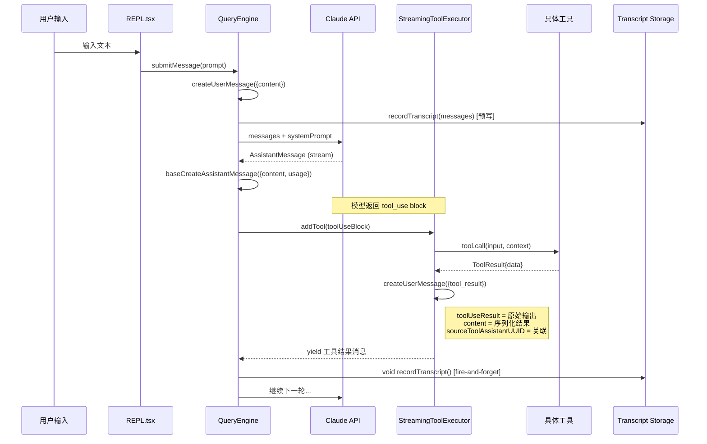
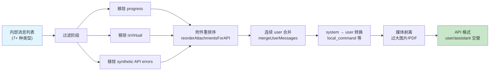

# 第 5 章：消息系统

> "在一个以对话为核心的系统中，消息类型的设计就是系统架构的缩影。"

Claude Code 的消息系统远不止于"用户说了什么、助手回复了什么"的简单交替。它是一个精心分层的类型体系，涵盖了从流式事件到工具结果、从进度通知到墓碑标记的完整生命周期。本章将从类型定义出发，深入到工厂函数、序列化、持久化和 API 归一化的全过程。

## 5.1 消息类型层次

### 核心联合类型

Claude Code 的消息系统建立在一个判别式联合类型（discriminated union）之上。从 `src/query.ts` 的导入可以看出完整的类型全貌：

```typescript
import type {
  AssistantMessage,
  AttachmentMessage,
  Message,
  RequestStartEvent,
  StreamEvent,
  ToolUseSummaryMessage,
  UserMessage,
  TombstoneMessage,
} from './types/message.js'
```

`Message` 是所有消息类型的联合：

```mermaid
classDiagram
    class Message {
        <<union>>
    }

    class UserMessage {
        +type: "user"
        +uuid: UUID
        +timestamp: string
        +message.role: "user"
        +message.content: string | ContentBlockParam[]
        +isMeta?: true
        +isVirtual?: true
        +isCompactSummary?: true
        +toolUseResult?: unknown
        +sourceToolAssistantUUID?: UUID
        +permissionMode?: PermissionMode
        +origin?: MessageOrigin
        +imagePasteIds?: number[]
    }

    class AssistantMessage {
        +type: "assistant"
        +uuid: UUID
        +timestamp: string
        +message.role: "assistant"
        +message.content: ContentBlock[]
        +message.usage: Usage
        +message.model: string
        +message.stop_reason: string
        +requestId?: string
        +apiError?: string
        +error?: SDKAssistantMessageError
        +isApiErrorMessage: boolean
        +isVirtual?: true
        +advisorModel?: string
    }

    class SystemMessage {
        +type: "system"
        +subtype: string
        +uuid: UUID
        +timestamp: string
        +content?: string
    }

    class ProgressMessage {
        +type: "progress"
        +uuid: UUID
        +timestamp: string
        +toolUseID: string
        +parentToolUseID: string
        +data: Progress
    }

    class AttachmentMessage {
        +type: "attachment"
        +uuid: UUID
        +timestamp: string
        +attachment: Attachment
    }

    class TombstoneMessage {
        +type: "tombstone"
        +message: AssistantMessage
    }

    class StreamEvent {
        +type: "stream_event"
        +event: MessageStreamEvent
    }

    class RequestStartEvent {
        +type: "stream_request_start"
    }

    class ToolUseSummaryMessage {
        +type: "tool_use_summary"
        +uuid: UUID
        +summary: string
        +toolUseIds: string[]
    }

    Message <|-- UserMessage
    Message <|-- AssistantMessage
    Message <|-- SystemMessage
    Message <|-- ProgressMessage
    Message <|-- AttachmentMessage

    SystemMessage <|-- SystemCompactBoundaryMessage
    SystemMessage <|-- SystemLocalCommandMessage
    SystemMessage <|-- SystemAPIErrorMessage
    SystemMessage <|-- SystemInformationalMessage
    SystemMessage <|-- SystemMicrocompactBoundaryMessage
    SystemMessage <|-- SystemMemorySavedMessage
    SystemMessage <|-- SystemStopHookSummaryMessage
    SystemMessage <|-- SystemTurnDurationMessage
    SystemMessage <|-- SystemPermissionRetryMessage
    SystemMessage <|-- SystemBridgeStatusMessage
    SystemMessage <|-- SystemAwaySummaryMessage
    SystemMessage <|-- SystemApiMetricsMessage
    SystemMessage <|-- SystemScheduledTaskFireMessage
    SystemMessage <|-- SystemAgentsKilledMessage
```



### 判别字段

`type` 字段是主判别器。在处理消息的 switch 语句中，TypeScript 的控制流分析可以精确推断每个分支的类型：

```typescript
switch (message.type) {
  case 'tombstone':
    // message: TombstoneMessage
    break
  case 'assistant':
    // message: AssistantMessage
    this.mutableMessages.push(message)
    yield* normalizeMessage(message)
    break
  case 'progress':
    // message: ProgressMessage
    break
  case 'user':
    // message: UserMessage
    break
  case 'stream_event':
    // message: StreamEvent
    break
}
```

### UserMessage 的多面性

`UserMessage` 是系统中最多态的类型。同一个 `type: "user"` 下承载了截然不同的语义：

**人类输入**：用户在终端或 SDK 中输入的文本。

**工具结果**：模型的工具调用执行后返回的结果，通过 `tool_result` content block 标识。`toolUseResult` 字段存储原始输出，`sourceToolAssistantUUID` 指向触发这次工具调用的 assistant 消息。

**Meta 消息**：`isMeta: true` 标记的消息不会在 UI 中显示给用户，仅供模型消费。典型用例包括：
- 系统注入的警告提示
- max_output_tokens 恢复指令
- compact 后的摘要

**虚拟消息**：`isVirtual: true` 标记的消息存在于内存中用于 UI 渲染，但在发送给 API 时被过滤掉。

这种设计将所有"用户角色"（API 层面 role="user"）的消息统一到一个类型下，避免了 API 协议的 user/assistant 交替规则被破坏。

### AssistantMessage 的丰富元数据

```typescript
function baseCreateAssistantMessage({
  content,
  isApiErrorMessage = false,
  apiError,
  error,
  errorDetails,
  isVirtual,
  usage = {
    input_tokens: 0,
    output_tokens: 0,
    cache_creation_input_tokens: 0,
    cache_read_input_tokens: 0,
    server_tool_use: { web_search_requests: 0, web_fetch_requests: 0 },
    service_tier: null,
    cache_creation: {
      ephemeral_1h_input_tokens: 0,
      ephemeral_5m_input_tokens: 0,
    },
    inference_geo: null,
    iterations: null,
    speed: null,
  },
}: ...): AssistantMessage {
  return {
    type: 'assistant',
    uuid: randomUUID(),
    timestamp: new Date().toISOString(),
    message: {
      id: randomUUID(),
      container: null,
      model: SYNTHETIC_MODEL,
      role: 'assistant',
      stop_reason: 'stop_sequence',
      stop_sequence: '',
      type: 'message',
      usage,
      content,
      context_management: null,
    },
    requestId: undefined,
    apiError,
    error,
    errorDetails,
    isApiErrorMessage,
    isVirtual,
  }
}
```

注意 `usage` 的默认值结构——它镜像了 Claude API 响应的完整 usage 对象，包括缓存统计、服务层级、推理地理位置甚至迭代次数。合成消息（如错误消息）使用 `SYNTHETIC_MODEL = '<synthetic>'` 作为模型标识，这让下游的 `isSyntheticApiErrorMessage` 检查成为可能。

### TombstoneMessage：消息的墓碑

```typescript
// Tombstone messages are control signals for removing messages
case 'tombstone':
  break
```

当模型降级回退（streaming fallback）发生时，之前的 partial assistant 消息已经 yield 给了 UI。为了"撤回"这些消息，引擎发射 tombstone：

```typescript
for (const msg of assistantMessages) {
  yield { type: 'tombstone' as const, message: msg }
}
```

UI 层接收到 tombstone 后，应从显示列表中移除对应的消息。这是一种事件溯源（event sourcing）模式——不是直接修改历史，而是追加一个"删除"事件。

### SystemMessage 的子类型体系

SystemMessage 通过 `subtype` 字段进一步细分：

- `compact_boundary`：标记压缩边界，用于 --resume 恢复
- `local_command`：本地命令（如 /compact）的输出
- `api_error`：API 错误通知
- `informational`：一般性信息
- `microcompact_boundary`：微压缩边界
- `memory_saved`：内存保存通知
- `stop_hook_summary`：stop hook 执行摘要
- `turn_duration`：轮次耗时统计
- `api_metrics`：API 性能指标
- `permission_retry`：权限重试通知
- `bridge_status`：桥接状态变更
- `away_summary`：离开期间摘要
- `agents_killed`：代理终止通知
- `scheduled_task_fire`：定时任务触发

这种扁平的子类型枚举（而非深层继承）让 pattern matching 保持简洁，同时避免了面向对象继承链的刚性约束。

## 5.2 消息创建与序列化

### 工厂函数体系

Claude Code 不直接构造消息对象，而是通过一组工厂函数确保每条消息都满足不变量。

**createUserMessage** 是使用最频繁的工厂函数：

```typescript
export function createUserMessage({
  content,
  isMeta,
  isVisibleInTranscriptOnly,
  isVirtual,
  isCompactSummary,
  toolUseResult,
  mcpMeta,
  uuid,
  timestamp,
  imagePasteIds,
  sourceToolAssistantUUID,
  permissionMode,
  origin,
  // ...
}: { ... }): UserMessage {
  const m: UserMessage = {
    type: 'user',
    message: {
      role: 'user',
      content: content || NO_CONTENT_MESSAGE,
    },
    isMeta,
    isVisibleInTranscriptOnly,
    isVirtual,
    isCompactSummary,
    uuid: (uuid as UUID | undefined) || randomUUID(),
    timestamp: timestamp ?? new Date().toISOString(),
    toolUseResult,
    mcpMeta,
    imagePasteIds,
    sourceToolAssistantUUID,
    permissionMode,
    origin,
  }
  return m
}
```

关键不变量：
1. `content` 为空时替换为 `NO_CONTENT_MESSAGE`，防止向 API 发送空消息。
2. `uuid` 如果未提供则自动生成，确保每条消息都有唯一标识。
3. `timestamp` 如果未提供则使用当前时间。

**createAssistantMessage** 和 **createAssistantAPIErrorMessage** 分别用于正常回复和错误回复：

```typescript
export function createAssistantMessage({
  content,
  usage,
  isVirtual,
}: { ... }): AssistantMessage {
  return baseCreateAssistantMessage({
    content:
      typeof content === 'string'
        ? [{ type: 'text', text: content === '' ? NO_CONTENT_MESSAGE : content }]
        : content,
    usage,
    isVirtual,
  })
}
```

注意字符串到 ContentBlock 数组的自动转换——调用方可以传入纯文本，工厂函数会将其包装为 `[{ type: 'text', text: ... }]`。

**createProgressMessage** 创建工具执行进度消息：

```typescript
export function createProgressMessage<P extends Progress>({
  toolUseID,
  parentToolUseID,
  data,
}: { ... }): ProgressMessage<P> {
  return {
    type: 'progress',
    data,
    toolUseID,
    parentToolUseID,
    uuid: randomUUID(),
    timestamp: new Date().toISOString(),
  }
}
```

Progress 是泛型参数——不同工具可以定义自己的进度数据结构，类型安全地传递给 UI 层。

### 合成消息常量

系统定义了一组固定的合成消息文本：

```typescript
export const INTERRUPT_MESSAGE = '[Request interrupted by user]'
export const CANCEL_MESSAGE =
  "The user doesn't want to take this action right now. ..."
export const REJECT_MESSAGE =
  "The user doesn't want to proceed with this tool use. ..."

export const SYNTHETIC_MESSAGES = new Set([
  INTERRUPT_MESSAGE,
  INTERRUPT_MESSAGE_FOR_TOOL_USE,
  CANCEL_MESSAGE,
  REJECT_MESSAGE,
  NO_RESPONSE_REQUESTED,
])
```

`SYNTHETIC_MESSAGES` 集合用于 `isSyntheticMessage` 检查——这些消息是系统生成的控制信号，不应被计入用户消息统计。

### 确定性 UUID 派生

当消息需要拆分（normalizeMessages）时，子消息的 UUID 不是随机生成的，而是从父 UUID 确定性派生的：

```typescript
export function deriveUUID(parentUUID: UUID, index: number): UUID {
  const hex = index.toString(16).padStart(12, '0')
  return `${parentUUID.slice(0, 24)}${hex}` as UUID
}
```

这意味着同一条消息在不同时刻拆分总是产生相同的子 UUID，这对于 transcript 的一致性和 `--resume` 功能至关重要。

## 5.3 工具结果消息

### tool_result 的编码

工具执行结果被编码为 `UserMessage`，其 `content` 字段包含一个 `tool_result` content block：

```typescript
createUserMessage({
  content: [
    {
      type: 'tool_result',
      content: resultContent,
      is_error: isError,
      tool_use_id: toolUseBlock.id,
    },
  ],
  toolUseResult: originalOutput,
  sourceToolAssistantUUID: assistantMessage.uuid,
})
```

这里存在一个重要的双重存储：
- `content[0].content`：发送给 API 的序列化结果（字符串或 content block 数组）。
- `toolUseResult`：工具的原始输出（保持原始类型），用于 UI 渲染和 HFI 数据提取。

### 合成工具结果占位符

当工具执行被中断，或 API 调用意外抛出异常，可能出现 `tool_use` 没有对应 `tool_result` 的情况。`yieldMissingToolResultBlocks` 函数处理这个"悬空配对"问题：

```typescript
function* yieldMissingToolResultBlocks(
  assistantMessages: AssistantMessage[],
  errorMessage: string,
) {
  for (const assistantMessage of assistantMessages) {
    const toolUseBlocks = assistantMessage.message.content.filter(
      content => content.type === 'tool_use',
    ) as ToolUseBlock[]

    for (const toolUse of toolUseBlocks) {
      yield createUserMessage({
        content: [
          {
            type: 'tool_result',
            content: errorMessage,
            is_error: true,
            tool_use_id: toolUse.id,
          },
        ],
        toolUseResult: errorMessage,
        sourceToolAssistantUUID: assistantMessage.uuid,
      })
    }
  }
}
```

占位符的存在有一个训练数据安全影响：

```typescript
// Exported so HFI submission can reject any payload containing it —
// placeholder satisfies pairing structurally but the content is fake,
// which poisons training data if submitted.
export const SYNTHETIC_TOOL_RESULT_PLACEHOLDER =
  '[Tool result missing due to internal error]'
```

### 权限拒绝的精细消息

工具被拒绝时，消息根据上下文有不同的表述：

```typescript
// 用户手动拒绝
export const REJECT_MESSAGE =
  "The user doesn't want to proceed with this tool use. The tool use was rejected..."

// 子代理内的拒绝（无用户交互）
export const SUBAGENT_REJECT_MESSAGE =
  'Permission for this tool use was denied. The tool use was rejected...'

// 自动模式分类器拒绝
export function buildYoloRejectionMessage(reason: string): string {
  return `${AUTO_MODE_REJECTION_PREFIX}${reason}. ` +
    `If you have other tasks that don't depend on this action, continue working on those. ` +
    `${DENIAL_WORKAROUND_GUIDANCE} ` + ruleHint
}
```

`DENIAL_WORKAROUND_GUIDANCE` 是一段精心撰写的指导文本：

```typescript
export const DENIAL_WORKAROUND_GUIDANCE =
  `IMPORTANT: You *may* attempt to accomplish this action using other tools ` +
  `that might naturally be used to accomplish this goal, ` +
  `e.g. using head instead of cat. But you *should not* attempt to work ` +
  `around this denial in malicious ways...`
```

这段文本在安全工程和用户体验之间取得平衡——允许模型寻找合理替代方案，但明确禁止恶意绕过。

### 消息创建与工具结果的数据流



### 消息归一化管线



## 5.4 消息持久化

### Transcript 录制机制

Claude Code 使用 JSONL（JSON Lines）格式将对话消息持久化到磁盘。核心入口是 `recordTranscript` 函数：

```typescript
export async function recordTranscript(
  messages: Message[],
  teamInfo?: TeamInfo,
  startingParentUuidHint?: UUID,
  allMessages?: readonly Message[],
): Promise<UUID | null> {
  const cleanedMessages = cleanMessagesForLogging(messages, allMessages)
  const sessionId = getSessionId() as UUID
  const messageSet = await getSessionMessages(sessionId)
  const newMessages: typeof cleanedMessages = []
  let startingParentUuid: UUID | undefined = startingParentUuidHint
  let seenNewMessage = false
  for (const m of cleanedMessages) {
    if (messageSet.has(m.uuid as UUID)) {
      if (!seenNewMessage && isChainParticipant(m)) {
        startingParentUuid = m.uuid as UUID
      }
    } else {
      newMessages.push(m)
      seenNewMessage = true
    }
  }
  if (newMessages.length > 0) {
    await getProject().insertMessageChain(
      newMessages,
      false,
      undefined,
      startingParentUuid,
      teamInfo,
    )
  }
  return (lastRecorded?.uuid as UUID | undefined) ?? startingParentUuid ?? null
}
```

这个函数有几个关键的设计决策：

**增量录制**：通过 `messageSet` 跟踪已录制的消息 UUID，每次只写入新消息。这避免了在长对话中反复序列化整个历史。

**父链追踪**：`startingParentUuid` 维护消息之间的因果链。这对于 `--resume` 恢复和分支管理至关重要。

**前缀检测**：已录制消息只有在形成前缀时才更新 `startingParentUuid`。这处理了 compaction 场景——新的 compact boundary 和摘要消息出现在保留消息之前，不应被视为父链的一部分。

### Crashproof 设计

消息持久化的时序经过精心设计以实现崩溃安全：

```typescript
// 用户消息在进入查询循环之前写入
if (persistSession && messagesFromUserInput.length > 0) {
  const transcriptPromise = recordTranscript(messages)
  if (isBareMode()) {
    void transcriptPromise  // fire-and-forget for scripts
  } else {
    await transcriptPromise  // block for interactive sessions
  }
}
```

注释中详细解释了为什么用户消息必须在 API 调用之前写入：

```
// If the process is killed before that (e.g. user clicks Stop in cowork
// seconds after send), the transcript is left with only queue-operation
// entries; getLastSessionLog filters those out, returns null, and --resume
// fails with "No conversation found".
```

对于 assistant 消息，策略不同——使用 fire-and-forget：

```typescript
if (message.type === 'assistant') {
  void recordTranscript(messages)  // fire-and-forget
} else {
  await recordTranscript(messages)  // await for user messages
}
```

原因是 `claude.ts` 的流式机制——它 yield 一个 assistant 消息后会 mutate 该消息的 `usage` 和 `stop_reason` 字段。如果 await 写入，后续的 `message_delta` 事件就无法及时处理。写入队列的 100ms 延迟 jsonStringify 自然处理了这个竞态。

### Compact Boundary 的持久化

压缩边界需要特殊处理——在写入 compact boundary 之前，必须确保保留段的尾部消息已经写入：

```typescript
if (message.type === 'system' && message.subtype === 'compact_boundary') {
  const tailUuid = message.compactMetadata?.preservedSegment?.tailUuid
  if (tailUuid) {
    const tailIdx = this.mutableMessages.findLastIndex(
      m => m.uuid === tailUuid,
    )
    if (tailIdx !== -1) {
      await recordTranscript(this.mutableMessages.slice(0, tailIdx + 1))
    }
  }
}
```

如果跳过这一步，`--resume` 恢复时 `applyPreservedSegmentRelinks` 的 tail-to-head 遍历会因找不到已录制的尾部消息而失败。

## 5.5 消息归一化

### normalizeMessagesForAPI

`normalizeMessagesForAPI` 是消息发送给 API 前的最后一道转换。它的职责是将内部的丰富消息类型映射为 Claude API 接受的 user/assistant 交替格式。

```typescript
export function normalizeMessagesForAPI(
  messages: Message[],
  tools: Tools = [],
): (UserMessage | AssistantMessage)[] {
  const availableToolNames = new Set(tools.map(t => t.name))

  const reorderedMessages = reorderAttachmentsForAPI(messages).filter(
    m => !((m.type === 'user' || m.type === 'assistant') && m.isVirtual),
  )
```

转换过程包含多个阶段：

**第一阶段：过滤**

- 移除 `progress` 消息（仅用于 UI）
- 移除虚拟消息（`isVirtual: true`）
- 移除合成 API 错误消息（`isSyntheticApiErrorMessage`）

**第二阶段：附件重排序**

`reorderAttachmentsForAPI` 将 attachment 消息上移到它们相关的 tool_result 之前，因为 API 要求 user 消息不能出现在 tool_result 之间。

**第三阶段：连续 user 消息合并**

Bedrock API 不支持连续的 user 消息（1P API 支持但会自动合并），所以归一化函数主动合并它们：

```typescript
case 'user': {
  const lastMessage = last(result)
  if (lastMessage?.type === 'user') {
    result[result.length - 1] = mergeUserMessages(lastMessage, userMsg)
    return
  }
  result.push(userMsg)
  return
}
```

**第四阶段：System 消息转 User 消息**

`local_command` 类型的系统消息需要转换为 user 消息，因为 API 不接受 system role 的中间消息：

```typescript
case 'system': {
  const userMsg = createUserMessage({
    content: message.content,
    uuid: message.uuid,
    timestamp: message.timestamp,
  })
  // ...
}
```

**第五阶段：错误引起的媒体剥离**

如果之前的 API 调用因为图片/PDF 过大而失败，归一化函数会从对应的 user 消息中剥离这些媒体块，防止重复触发同样的错误：

```typescript
const typesToStrip = stripTargets.get(normalizedMessage.uuid)
if (typesToStrip && normalizedMessage.isMeta) {
  const content = normalizedMessage.message.content
  if (Array.isArray(content)) {
    const filtered = content.filter(
      block => !typesToStrip.has(block.type),
    )
    // ...
  }
}
```

### normalizeMessages（UI 归一化）

与 API 归一化不同，UI 归一化（`normalizeMessages`）将多 content block 的消息拆分为每条消息一个 block：

```typescript
export function normalizeMessages(messages: Message[]): NormalizedMessage[] {
  let isNewChain = false
  return messages.flatMap(message => {
    switch (message.type) {
      case 'assistant': {
        isNewChain = isNewChain || message.message.content.length > 1
        return message.message.content.map((_, index) => {
          const uuid = isNewChain
            ? deriveUUID(message.uuid, index)
            : message.uuid
          return {
            type: 'assistant',
            message: { ...message.message, content: [_] },
            uuid,
            // ...
          }
        })
      }
      // ...
    }
  })
}
```

`isNewChain` 标志确保一旦发生拆分，后续所有消息的 UUID 都重新派生。这维护了 UUID 的唯一性不变量——不会出现两条消息共享同一个 UUID 的情况。

### reorderMessagesInUI

UI 渲染需要的消息顺序与 API 不同。`reorderMessagesInUI` 将工具调用相关的消息按逻辑分组：

```
tool_use -> pre_hooks -> tool_result -> post_hooks
```

而非按时间顺序。这让用户看到的是一个完整的"工具调用故事"，而非零散的交错事件。

```typescript
// First pass: group messages by tool use ID
for (const message of messages) {
  if (isToolUseRequestMessage(message)) {
    toolUseGroups.set(toolUseID, {
      toolUse: null,
      preHooks: [],
      toolResult: null,
      postHooks: [],
    })
  }
}

// Second pass: reconstruct in logical order
for (const message of messages) {
  if (isToolUseRequestMessage(message)) {
    const group = toolUseGroups.get(toolUseID)
    result.push(group.toolUse)
    result.push(...group.preHooks)
    if (group.toolResult) result.push(group.toolResult)
    result.push(...group.postHooks)
  }
}
```

这种两遍扫描算法（first pass: group, second pass: reconstruct）在保持 O(n) 时间复杂度的同时，实现了任意交错消息的正确重排。
