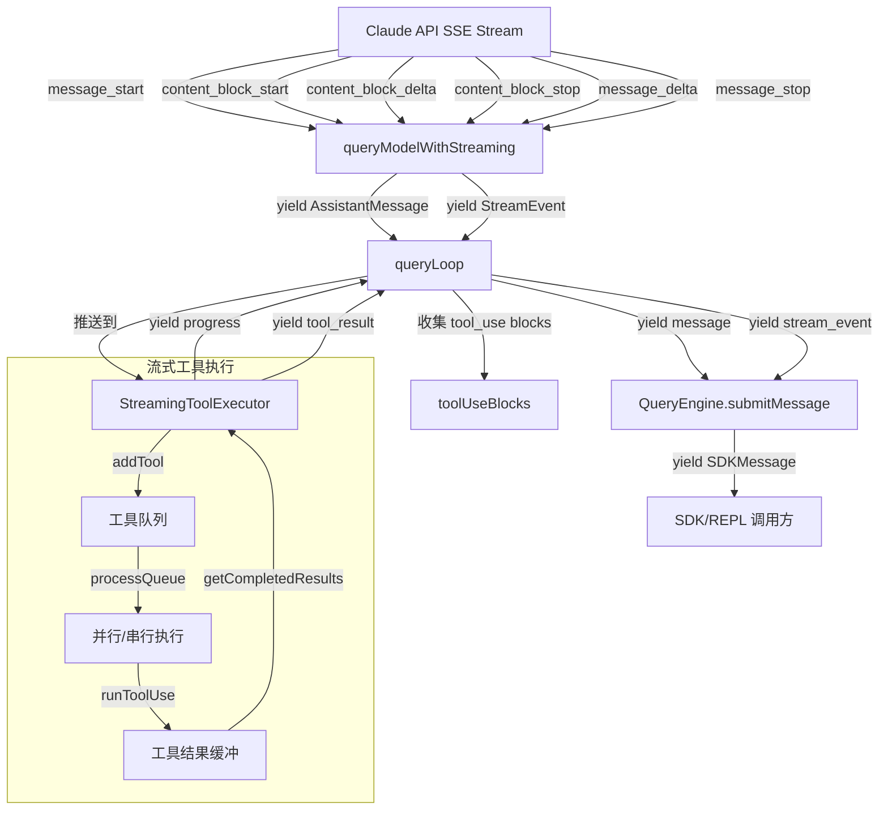
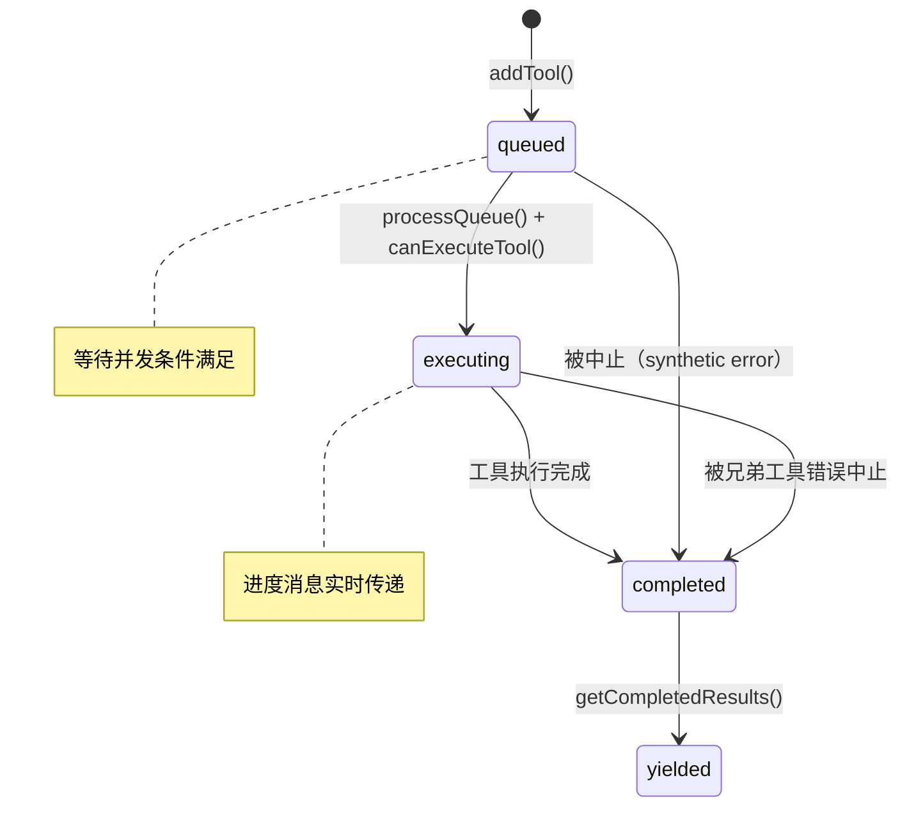

# 第 6 章：流式处理

> "在异步世界中，数据流的控制权比数据本身更重要。"

Claude Code 选择了 AsyncGenerator 作为其核心的流式数据传输范式。这不是一个随意的技术选型——它在背压控制、组合性、取消传播和类型安全四个维度上，都优于传统的 Callback 和 EventEmitter 模式。本章将从设计动机出发，深入分析流式响应的接收、工具执行的进度反馈、Generator 的组合与取消机制。

## 6.1 AsyncGenerator 范式

### 为什么不是 Callback？

Callback 模式是最原始的异步通知机制。如果用 callback 实现查询引擎，接口大致如下：

```typescript
// 假想的 callback 接口
function query(params: QueryParams, callbacks: {
  onAssistantMessage: (msg: AssistantMessage) => void
  onToolResult: (msg: UserMessage) => void
  onProgress: (msg: ProgressMessage) => void
  onError: (err: Error) => void
  onComplete: (terminal: Terminal) => void
}): void
```

这种模式的问题在于：
1. **调用方无法控制速度**：生产者不等消费者处理完就继续推送。
2. **取消困难**：需要额外的机制（如返回一个 cancel 函数）。
3. **组合困难**：嵌套 callback 导致"回调地狱"。
4. **返回值丢失**：`Terminal` 只能通过 callback 传递，不能用 `return`。

### 为什么不是 Promise？

Promise 表示单个异步值。查询引擎需要在一次调用中产生多个中间结果——assistant 消息、进度更新、工具结果——Promise 无法表达这种"多次产出"语义。可以用 `Promise<Message[]>` 返回所有消息的数组，但这要求等待查询完全结束才能开始处理，对于可能持续数十秒的长查询来说，用户体验是不可接受的。

### AsyncGenerator 的优势

Claude Code 的核心查询接口：

```typescript
export async function* query(
  params: QueryParams,
): AsyncGenerator<
  | StreamEvent
  | RequestStartEvent
  | Message
  | TombstoneMessage
  | ToolUseSummaryMessage,
  Terminal
> {
```

AsyncGenerator 提供了四个关键能力：

**拉取式消费（Pull-based）**：消费者通过 `for await...of` 或 `.next()` 主动拉取下一个值。在消费者没有准备好时，生产者自然地暂停在 `yield` 点。这是隐式的背压控制。

**返回值语义**：Generator 函数的 `return` 值（`Terminal`）通过 `IteratorResult.value` 在完成时传递，与中间 yield 的值类型独立。`query()` 的签名中，yield 类型是消息联合，return 类型是 `Terminal`——调用方既能逐步消费中间消息，又能获得最终的终止原因。

**取消传播**：调用方在 `for await...of` 中 break 或抛出异常，Generator 会自动触发 `return()` 方法，执行清理逻辑。这与 `using` 声明和 `AbortController` 配合，构成完整的取消链。

**类型安全的组合**：`yield*` 委托在 TypeScript 中保留类型信息，允许将多个 Generator 串联。

## 6.2 API 流式响应

### 消息流的接收

API 流式响应在 `queryLoop` 的内层 `for await` 循环中处理：

```typescript
for await (const message of deps.callModel({
  messages: prependUserContext(messagesForQuery, userContext),
  systemPrompt: fullSystemPrompt,
  thinkingConfig: toolUseContext.options.thinkingConfig,
  tools: toolUseContext.options.tools,
  signal: toolUseContext.abortController.signal,
  options: {
    model: currentModel,
    fallbackModel,
    onStreamingFallback: () => {
      streamingFallbackOccured = true
    },
    querySource,
    // ...
  },
})) {
  // 处理每个流式事件
}
```

`deps.callModel`（实际上是 `queryModelWithStreaming`）本身也是一个 AsyncGenerator，它将 Claude API 的 SSE（Server-Sent Events）流转换为结构化的消息对象。

### 流式数据流图



### 流中的消息降级处理

当流式接收过程中模型降级（fallback）发生，引擎需要处理已经 yield 出去的"孤儿"消息：

```typescript
if (streamingFallbackOccured) {
  // 发射墓碑以撤回已 yield 的 partial messages
  for (const msg of assistantMessages) {
    yield { type: 'tombstone' as const, message: msg }
  }

  // 清空所有状态
  assistantMessages.length = 0
  toolResults.length = 0
  toolUseBlocks.length = 0
  needsFollowUp = false

  // 废弃流式执行器并创建新的
  if (streamingToolExecutor) {
    streamingToolExecutor.discard()
    streamingToolExecutor = new StreamingToolExecutor(
      toolUseContext.options.tools,
      canUseTool,
      toolUseContext,
    )
  }
}
```

`discard()` 方法设置一个标志，阻止已入队的工具启动执行，已在执行中的工具收到合成错误：

```typescript
discard(): void {
  this.discarded = true
}
```

### 消息的"扣留"与延迟 yield

流式循环中有一个关键的"扣留"逻辑——某些错误消息不会立即 yield 给消费者：

```typescript
let withheld = false
if (reactiveCompact?.isWithheldPromptTooLong(message)) {
  withheld = true
}
if (isWithheldMaxOutputTokens(message)) {
  withheld = true
}
if (!withheld) {
  yield yieldMessage
}
```

被扣留的消息仍然被 push 到 `assistantMessages` 数组中，供流结束后的恢复逻辑检查。这种"先收集后决策"的模式避免了过早地向 SDK 消费者暴露可恢复的错误。

注释中专门解释了为什么 SDK 消费者不能看到这些中间错误：

```
// Yielding early leaks an intermediate error to SDK callers (e.g.
// cowork/desktop) that terminate the session on any `error` field —
// the recovery loop keeps running but nobody is listening.
```

## 6.3 工具执行进度流

### StreamingToolExecutor 架构

`StreamingToolExecutor` 是 Claude Code 中最精巧的并发控制器之一。它管理着工具的入队、并行执行、结果缓冲和进度传递。

```typescript
export class StreamingToolExecutor {
  private tools: TrackedTool[] = []
  private toolUseContext: ToolUseContext
  private hasErrored = false
  private siblingAbortController: AbortController
  private discarded = false
  private progressAvailableResolve?: () => void
```

每个工具被追踪为一个 `TrackedTool` 对象，拥有自己的生命周期状态：

```typescript
type ToolStatus = 'queued' | 'executing' | 'completed' | 'yielded'

type TrackedTool = {
  id: string
  block: ToolUseBlock
  assistantMessage: AssistantMessage
  status: ToolStatus
  isConcurrencySafe: boolean
  promise?: Promise<void>
  results?: Message[]
  pendingProgress: Message[]
  contextModifiers?: Array<(context: ToolUseContext) => ToolUseContext>
}
```



### 并发控制策略

并发安全性由工具自己声明：

```typescript
const parsedInput = toolDefinition.inputSchema.safeParse(block.input)
const isConcurrencySafe = parsedInput?.success
  ? (() => {
      try {
        return Boolean(toolDefinition.isConcurrencySafe(parsedInput.data))
      } catch {
        return false
      }
    })()
  : false
```

执行条件检查：

```typescript
private canExecuteTool(isConcurrencySafe: boolean): boolean {
  const executingTools = this.tools.filter(t => t.status === 'executing')
  return (
    executingTools.length === 0 ||
    (isConcurrencySafe && executingTools.every(t => t.isConcurrencySafe))
  )
}
```

规则很明确：
- 并发安全的工具可以与其他并发安全的工具并行。
- 非并发安全的工具必须独占执行——等待所有正在执行的工具完成后才能开始。

这意味着多个 `Read` 文件操作可以并行，但 `Bash` 命令会串行执行。

### 进度消息的即时传递

进度消息不经过结果缓冲区，而是通过独立的 `pendingProgress` 数组即时传递：

```typescript
for await (const update of generator) {
  if (update.message) {
    if (update.message.type === 'progress') {
      tool.pendingProgress.push(update.message)
      // 唤醒等待进度的消费者
      if (this.progressAvailableResolve) {
        this.progressAvailableResolve()
        this.progressAvailableResolve = undefined
      }
    } else {
      messages.push(update.message)
    }
  }
}
```

`getCompletedResults` 在每次调用时都先清空 pending progress：

```typescript
*getCompletedResults(): Generator<MessageUpdate, void> {
  for (const tool of this.tools) {
    // 先 yield 进度消息
    while (tool.pendingProgress.length > 0) {
      const progressMessage = tool.pendingProgress.shift()!
      yield { message: progressMessage, newContext: this.toolUseContext }
    }
    // 再 yield 完成结果（按序）
    if (tool.status === 'completed' && tool.results) {
      tool.status = 'yielded'
      for (const message of tool.results) {
        yield { message, newContext: this.toolUseContext }
      }
    }
  }
}
```

这确保了用户能实时看到工具的执行进度（如 Bash 命令的输出流），而最终结果仍然保持工具的入队顺序。

### 错误的级联中止

当一个 Bash 工具执行出错，`StreamingToolExecutor` 会级联中止所有兄弟工具：

```typescript
if (isErrorResult) {
  thisToolErrored = true
  if (tool.block.name === BASH_TOOL_NAME) {
    this.hasErrored = true
    this.erroredToolDescription = this.getToolDescription(tool)
    this.siblingAbortController.abort('sibling_error')
  }
}
```

注意只有 **Bash** 错误会触发级联中止。注释解释了原因：

```
// Only Bash errors cancel siblings. Bash commands often have implicit
// dependency chains (e.g. mkdir fails → subsequent commands pointless).
// Read/WebFetch/etc are independent — one failure shouldn't nuke the rest.
```

`siblingAbortController` 是 `toolUseContext.abortController` 的子控制器——中止兄弟工具不会中止整个查询循环。

## 6.4 Generator 组合

### yield* 委托

Claude Code 广泛使用 `yield*` 将 Generator 链式组合。`query()` 函数是第一层包装：

```typescript
export async function* query(
  params: QueryParams,
): AsyncGenerator<..., Terminal> {
  const consumedCommandUuids: string[] = []
  const terminal = yield* queryLoop(params, consumedCommandUuids)
  for (const uuid of consumedCommandUuids) {
    notifyCommandLifecycle(uuid, 'completed')
  }
  return terminal
}
```

`yield*` 的语义：将 `queryLoop` 的所有 yield 值透传给 `query` 的消费者，同时捕获 `queryLoop` 的 return 值（`Terminal`）赋给 `terminal`。

这种组合模式形成了一个三层 Generator 管道：

```
queryLoop (产生消息)
  ↓ yield*
query (后处理: command lifecycle)
  ↓ for await...of
QueryEngine.submitMessage (消息路由: transcript, SDK output)
  ↓ yield
SDK/REPL 调用方 (最终消费)
```

### Stop Hook 中的 Generator 委托

`handleStopHooks` 也是一个 AsyncGenerator，通过 `yield*` 在 queryLoop 中调用：

```typescript
const stopHookResult = yield* handleStopHooks(
  messagesForQuery,
  assistantMessages,
  systemPrompt,
  userContext,
  systemContext,
  toolUseContext,
  querySource,
  stopHookActive,
)
```

`handleStopHooks` 可能 yield 出额外的消息（如 hook 摘要、错误通知），这些消息自动透传给查询循环的消费者。同时，它的 return 值——`StopHookResult`——被解构用于控制流决策。

### 取消传播

Generator 的取消通过三种机制传播：

**1. AbortController 信号**

```typescript
const toolAbortController = createChildAbortController(
  this.siblingAbortController,
)
toolAbortController.signal.addEventListener('abort', () => {
  if (!this.toolUseContext.abortController.signal.aborted && !this.discarded) {
    this.toolUseContext.abortController.abort(toolAbortController.signal.reason)
  }
}, { once: true })
```

形成树状的 abort 传播：
```
toolUseContext.abortController (查询级)
  └─ siblingAbortController (工具批次级)
       └─ toolAbortController (单工具级)
```

**2. Generator.return()**

当 `for await...of` 循环被 `break` 或异常中断，Generator 的 `return()` 被自动调用。`using` 声明（如 `using pendingMemoryPrefetch = ...`）确保即使在异常退出路径上，资源清理也能执行。

**3. discarded 标志**

`StreamingToolExecutor.discard()` 不使用 abort 信号，而是设置一个简单的布尔标志：

```typescript
discard(): void {
  this.discarded = true
}
```

这比 abort 更轻量——被废弃的执行器只需要阻止新工具启动和停止结果产出，不需要中断正在运行的工具（那些工具的结果会被自然丢弃）。

## 6.5 背压控制

### 隐式背压

AsyncGenerator 的 pull-based 语义提供了天然的背压。考虑以下消费链：

```typescript
// QueryEngine.submitMessage
for await (const message of query({...})) {
  // 处理 message（可能涉及磁盘 I/O）
  if (persistSession) {
    await recordTranscript(messages)  // 阻塞
  }
  yield* normalizeMessage(message)    // 向上 yield
}
```

当 `recordTranscript` 执行磁盘写入时，`for await` 循环暂停，`query()` 的 Generator 在上一个 `yield` 点挂起，`queryModelWithStreaming` 的 Generator 也随之挂起。底层的 HTTP 流读取暂停，TCP 接收窗口填满，最终 API 服务端会降低发送速率。

这种从消费者到生产者的速率信号传播完全是隐式的——不需要任何显式的流量控制代码。

### 进度消息的无阻塞传递

然而，完全的背压并不总是理想的。进度消息不应阻塞工具执行——用户希望实时看到 Bash 命令的输出，即使 UI 层的渲染略有滞后。

`StreamingToolExecutor` 通过将进度消息存入独立的缓冲区来解决这个问题：

```typescript
// 工具执行中：进度不阻塞
if (update.message.type === 'progress') {
  tool.pendingProgress.push(update.message)
  if (this.progressAvailableResolve) {
    this.progressAvailableResolve()
  }
}
```

消费侧使用 `Promise.race` 实现非阻塞等待：

```typescript
async *getRemainingResults(): AsyncGenerator<MessageUpdate, void> {
  while (this.hasUnfinishedTools()) {
    await this.processQueue()

    for (const result of this.getCompletedResults()) {
      yield result
    }

    if (this.hasExecutingTools() && !this.hasCompletedResults()
        && !this.hasPendingProgress()) {
      const executingPromises = this.tools
        .filter(t => t.status === 'executing' && t.promise)
        .map(t => t.promise!)

      const progressPromise = new Promise<void>(resolve => {
        this.progressAvailableResolve = resolve
      })

      await Promise.race([...executingPromises, progressPromise])
    }
  }
}
```

`Promise.race` 确保只要有工具完成或有进度可用，循环就会唤醒——不会因为某个长时间运行的工具而阻塞其他工具的进度报告。

### 内存管理

长时间运行的查询会在 `mutableMessages` 中累积大量消息。Claude Code 使用多种策略控制内存增长：

**Snip Compact**：在 `HISTORY_SNIP` 功能开启时，旧消息被裁剪：

```typescript
if (feature('HISTORY_SNIP')) {
  const snipResult = snipModule!.snipCompactIfNeeded(messagesForQuery)
  messagesForQuery = snipResult.messages
  snipTokensFreed = snipResult.tokensFreed
}
```

**Tool Result Budget**：工具结果的大小受限：

```typescript
messagesForQuery = await applyToolResultBudget(
  messagesForQuery,
  toolUseContext.contentReplacementState,
  // ...
)
```

**Auto Compact**：当 token 数超过阈值时自动压缩：

```typescript
const { compactionResult } = await deps.autocompact(
  messagesForQuery,
  toolUseContext,
  { systemPrompt, userContext, systemContext, toolUseContext, forkContextMessages },
  querySource,
  tracking,
  snipTokensFreed,
)
```

**Fetch 闭包复用**：

```typescript
// Creating it once means only the latest request body is retained (~700KB),
// instead of all request bodies from the session (~500MB for long sessions).
const dumpPromptsFetch = config.gates.isAnt
  ? createDumpPromptsFetch(toolUseContext.agentId ?? config.sessionId)
  : undefined
```

注释中量化了这个优化的影响：从保留所有请求体（~500MB）到只保留最新的（~700KB）。

### Fire-and-forget 与 await 的选择

消息写入遵循一个明确的策略：

```typescript
// Assistant 消息：fire-and-forget
if (message.type === 'assistant') {
  void recordTranscript(messages)
}
// User 消息和 compact boundary：await
else {
  await recordTranscript(messages)
}
```

这是背压控制的一个精细调节：assistant 消息的 fire-and-forget 允许 API 流继续推进（避免流式更新被磁盘 I/O 阻塞），而 user 消息的 await 确保崩溃恢复的可靠性。写入队列的内部实现保证了顺序性——fire-and-forget 不会导致消息乱序。

### 流式工具执行与传统模式的抉择

查询循环中有一个运行时开关决定使用哪种工具执行模式：

```typescript
const useStreamingToolExecution = config.gates.streamingToolExecution
let streamingToolExecutor = useStreamingToolExecution
  ? new StreamingToolExecutor(
      toolUseContext.options.tools,
      canUseTool,
      toolUseContext,
    )
  : null
```

在流结束后，工具结果的收集也依据这个开关分叉：

```typescript
const toolUpdates = streamingToolExecutor
  ? streamingToolExecutor.getRemainingResults()
  : runTools(toolUseBlocks, assistantMessages, canUseTool, toolUseContext)
```

`runTools` 是传统的顺序执行路径——它本身也是一个 AsyncGenerator，但工具按顺序执行，不利用流式重叠。`StreamingToolExecutor` 则允许工具在 API 流仍在推送时就开始执行，显著减少了端到端延迟。

这种双轨设计体现了 Claude Code 的工程哲学——新特性通过功能开关渐进式发布，旧路径作为 fallback 保留，直到新路径经过充分验证。AsyncGenerator 的统一接口（`for await...of`）使得两种路径对消费者完全透明。
