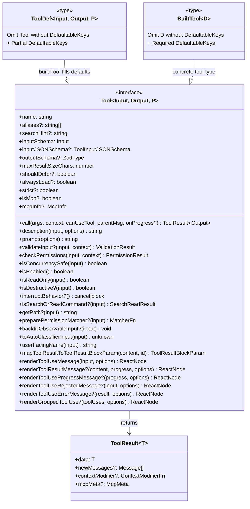
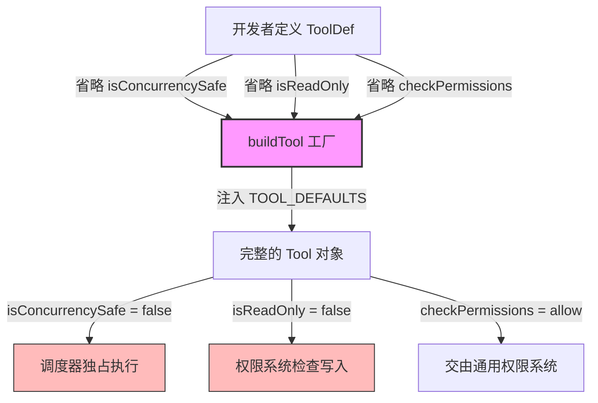
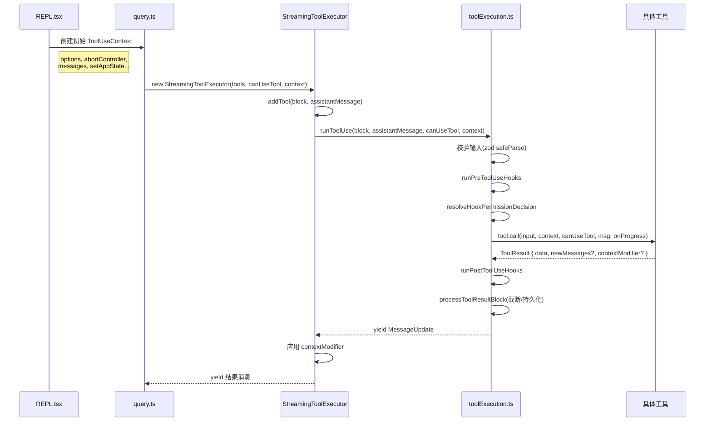
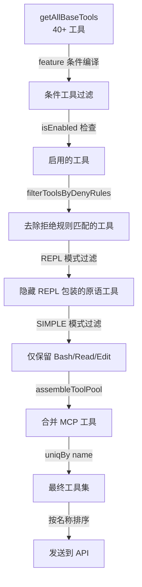
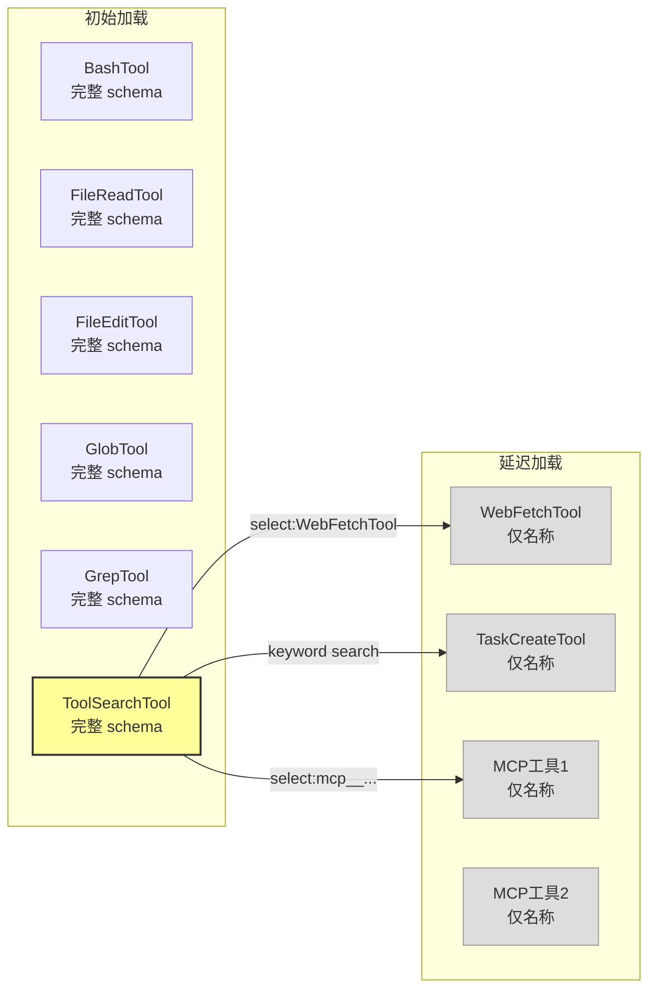

# 第 7 章：工具架构

> "好的架构允许重大决策推迟到最后一刻。" —— Robert C. Martin

Claude Code 的工具系统是整个交互循环中最关键的子系统。当模型决定调用一个工具时，控制权从 LLM 推理侧转移到宿主程序侧——文件被读写、命令被执行、网页被抓取。工具系统的设计直接决定了 Claude Code 的能力边界与安全底线。

本章将深入剖析工具系统的类型契约、工厂模式、依赖注入、注册发现和延迟加载五个层面，展示这套架构如何在保持极高可扩展性的同时实现"失败关闭"（fail-closed）的安全默认。

## 7.1 Tool 接口契约

### 7.1.1 接口全貌

Claude Code 的工具接口定义在 `src/Tool.ts` 中，是一个参数化的 TypeScript 泛型类型。该接口包含超过 30 个方法和属性，覆盖了工具生命周期的每一个阶段：输入验证、权限检查、执行、结果序列化和 UI 渲染。

```typescript
// src/Tool.ts（简化展示核心签名）
export type Tool<
  Input extends AnyObject = AnyObject,
  Output = unknown,
  P extends ToolProgressData = ToolProgressData,
> = {
  readonly name: string
  aliases?: string[]
  searchHint?: string
  readonly inputSchema: Input
  readonly inputJSONSchema?: ToolInputJSONSchema
  outputSchema?: z.ZodType<unknown>
  maxResultSizeChars: number
  readonly shouldDefer?: boolean
  readonly alwaysLoad?: boolean
  readonly strict?: boolean
  isMcp?: boolean
  isLsp?: boolean
  mcpInfo?: { serverName: string; toolName: string }

  // 生命周期方法
  call(args, context, canUseTool, parentMessage, onProgress?): Promise<ToolResult<Output>>
  description(input, options): Promise<string>
  prompt(options): Promise<string>
  validateInput?(input, context): Promise<ValidationResult>
  checkPermissions(input, context): Promise<PermissionResult>

  // 分类属性
  isConcurrencySafe(input): boolean
  isEnabled(): boolean
  isReadOnly(input): boolean
  isDestructive?(input): boolean
  interruptBehavior?(): 'cancel' | 'block'
  isSearchOrReadCommand?(input): { isSearch: boolean; isRead: boolean; isList?: boolean }
  isOpenWorld?(input): boolean
  requiresUserInteraction?(): boolean

  // 路径与权限
  getPath?(input): string
  preparePermissionMatcher?(input): Promise<(pattern: string) => boolean>
  backfillObservableInput?(input: Record<string, unknown>): void

  // UI 渲染（10+ 方法）
  userFacingName(input): string
  renderToolUseMessage(input, options): React.ReactNode
  renderToolResultMessage?(content, progressMessages, options): React.ReactNode
  renderToolUseProgressMessage?(progressMessages, options): React.ReactNode
  // ... 更多渲染方法

  // 序列化与分类器
  toAutoClassifierInput(input): unknown
  mapToolResultToToolResultBlockParam(content, toolUseID): ToolResultBlockParam
  inputsEquivalent?(a, b): boolean
}
```

这个接口的设计哲学体现了几个核心原则：

**原则一：输入驱动的属性推断。** 注意 `isConcurrencySafe`、`isReadOnly`、`isDestructive` 等方法都接收 `input` 参数。这意味着同一个工具可以根据不同输入表现出不同的安全特征。例如，`BashTool` 执行 `ls` 时是只读且并发安全的，但执行 `rm -rf /` 时是破坏性的。

**原则二：渲染与逻辑分离。** 接口中 UI 渲染方法占了近半数，包括 `renderToolUseMessage`、`renderToolResultMessage`、`renderToolUseProgressMessage`、`renderToolUseRejectedMessage`、`renderToolUseErrorMessage` 和 `renderGroupedToolUse` 等。每个工具完全掌控自己在终端中的呈现方式，这与 React 的组件化思想一脉相承。

**原则三：渐进式增强。** 大量方法标记为可选（`?`），工具可以只实现核心方法，让框架提供合理默认值。

### 7.1.2 核心方法详解

#### call —— 工具执行入口

```typescript
call(
  args: z.infer<Input>,
  context: ToolUseContext,
  canUseTool: CanUseToolFn,
  parentMessage: AssistantMessage,
  onProgress?: ToolCallProgress<P>,
): Promise<ToolResult<Output>>
```

`call` 是工具的核心执行方法。注意其返回类型 `ToolResult<Output>`：

```typescript
export type ToolResult<T> = {
  data: T
  newMessages?: (UserMessage | AssistantMessage | AttachmentMessage | SystemMessage)[]
  contextModifier?: (context: ToolUseContext) => ToolUseContext
  mcpMeta?: { _meta?: Record<string, unknown>; structuredContent?: Record<string, unknown> }
}
```

`ToolResult` 不仅包含工具输出数据，还可以携带新的消息（注入到对话历史中）和上下文修改器。这个 `contextModifier` 是一个精妙的设计——它允许非并发工具在执行后修改后续工具的执行环境。例如，一个切换目录的命令可以通过 `contextModifier` 更新后续工具看到的工作目录。

#### checkPermissions —— 权限闸门

```typescript
checkPermissions(
  input: z.infer<Input>,
  context: ToolUseContext,
): Promise<PermissionResult>
```

每个工具可以定义自己的权限检查逻辑。`PermissionResult` 的行为有三种：`allow`（允许执行）、`deny`（拒绝并告知原因）、`ask`（弹出交互式权限确认对话框）。这个方法只包含工具特有的逻辑，通用权限检查（如基于规则的匹配）在 `permissions.ts` 中处理。

#### isConcurrencySafe —— 并发安全标记

```typescript
isConcurrencySafe(input: z.infer<Input>): boolean
```

这个方法的返回值直接控制 `StreamingToolExecutor` 的调度策略。返回 `true` 的工具可以与其他并发安全工具并行执行；返回 `false` 的工具会独占执行槽位。稍后在第 9 章将详细分析调度器的工作原理。

#### isDestructive —— 破坏性标记

```typescript
isDestructive?(input: z.infer<Input>): boolean
```

注释说得很明确：*"Only set when the tool performs irreversible operations (delete, overwrite, send)."* 这个标记影响安全分类器的判断和 UI 的警告提示。

### 7.1.3 接口 UML 类图



## 7.2 buildTool 工厂 —— 失败关闭的默认值设计

### 7.2.1 设计动机

Claude Code 拥有 40+ 个内置工具，如果每个工具都必须实现 Tool 接口的全部 30+ 方法，代码将充斥着重复的样板。更危险的是，如果开发者忘记实现某个安全相关的方法，可能会留下安全漏洞。

`buildTool` 工厂函数的设计目标是：**让安全默认值自动生效，让开发者显式选择放宽。**

### 7.2.2 TOOL_DEFAULTS —— 失败关闭的守卫

```typescript
// src/Tool.ts
const TOOL_DEFAULTS = {
  isEnabled: () => true,
  isConcurrencySafe: (_input?: unknown) => false,    // 假定不安全
  isReadOnly: (_input?: unknown) => false,            // 假定会写入
  isDestructive: (_input?: unknown) => false,
  checkPermissions: (input, _ctx?) =>
    Promise.resolve({ behavior: 'allow', updatedInput: input }),
  toAutoClassifierInput: (_input?: unknown) => '',
  userFacingName: (_input?: unknown) => '',
}
```

这段代码的关键设计决策值得逐一分析：

| 默认值 | 值 | 安全含义 |
|--------|-----|---------|
| `isConcurrencySafe` | `false` | 新工具默认独占执行，不会与其他工具并发运行。这避免了潜在的竞态条件。 |
| `isReadOnly` | `false` | 新工具默认被视为有写操作。这确保权限系统不会错误地跳过写入检查。 |
| `isDestructive` | `false` | 这个看似违反"失败关闭"原则——新工具不会被标记为破坏性的。但这里的权衡是：将所有工具默认标记为破坏性会导致过多的用户确认弹窗，反而降低用户体验且造成"告警疲劳"。|
| `checkPermissions` | `allow` | 默认允许——工具级权限检查延迟到通用权限系统（`permissions.ts`）。这避免了工具漏实现 `checkPermissions` 就完全无法使用的问题。 |
| `toAutoClassifierInput` | `''`（空字符串） | 空字符串意味着该工具从安全分类器的视角被跳过。源码注释明确指出：*"skip classifier —— security-relevant tools must override"*。 |

### 7.2.3 buildTool 实现

```typescript
// src/Tool.ts
export function buildTool<D extends AnyToolDef>(def: D): BuiltTool<D> {
  return {
    ...TOOL_DEFAULTS,
    userFacingName: () => def.name,
    ...def,
  } as BuiltTool<D>
}
```

实现极为简洁——利用 JavaScript 对象展开的后值覆盖特性，工具定义中显式提供的方法会覆盖默认值。类型系统通过 `BuiltTool<D>` 保证结果始终是一个完整的 `Tool`。

### 7.2.4 DefaultableToolKeys —— 可省略的方法集

```typescript
type DefaultableToolKeys =
  | 'isEnabled'
  | 'isConcurrencySafe'
  | 'isReadOnly'
  | 'isDestructive'
  | 'checkPermissions'
  | 'toAutoClassifierInput'
  | 'userFacingName'
```

只有这 7 个方法被列为可省略。其他方法（如 `call`、`inputSchema`、`prompt`）是每个工具必须实现的——编译器会强制要求。



## 7.3 ToolUseContext —— 依赖注入的核心载体

### 7.3.1 Context 的角色

在传统的面向对象设计中，工具可能是一个类实例，通过构造器注入依赖。Claude Code 选择了函数式的方式——每个工具的 `call` 方法接收一个 `ToolUseContext` 对象，其中包含了工具执行所需的全部上下文。

`ToolUseContext` 定义在 `src/Tool.ts` 中，是一个拥有 40+ 字段的大型结构体。这看似违反了"接口隔离原则"，但在 AI 编码工具的特殊场景下，这种设计有其合理性：工具需要的上下文是动态变化的（每次 API 调用可能有不同的配置），且工具之间共享大量上下文（如 MCP 客户端、权限配置、消息历史）。

### 7.3.2 Context 的核心字段分组

将 40+ 个字段按功能分组，可以看到清晰的层次结构：

**配置层（options）：**

```typescript
options: {
  commands: Command[]           // 可用斜杠命令
  debug: boolean                // 调试模式
  mainLoopModel: string         // 当前模型名称
  tools: Tools                  // 可用工具列表
  verbose: boolean              // 详细输出
  thinkingConfig: ThinkingConfig // 思考配置
  mcpClients: MCPServerConnection[] // MCP 服务器连接
  mcpResources: Record<string, ServerResource[]>
  isNonInteractiveSession: boolean  // 非交互模式（SDK/CI）
  agentDefinitions: AgentDefinitionsResult
  maxBudgetUsd?: number         // 成本预算上限
  customSystemPrompt?: string   // 自定义系统提示
  appendSystemPrompt?: string   // 追加系统提示
  refreshTools?: () => Tools    // 动态刷新工具列表
}
```

**状态管理层：**

```typescript
abortController: AbortController           // 取消信号
readFileState: FileStateCache              // 文件读取缓存
getAppState(): AppState                     // 获取全局状态
setAppState(f: (prev) => AppState): void   // 更新全局状态
setAppStateForTasks?: (f) => void          // 任务级状态更新（穿透子代理）
messages: Message[]                         // 对话消息历史
```

**UI 交互层：**

```typescript
setToolJSX?: SetToolJSXFn           // 自定义 JSX 渲染
addNotification?: (notif) => void    // 推送通知
appendSystemMessage?: (msg) => void  // 追加系统消息
sendOSNotification?: (opts) => void  // 系统级通知
setInProgressToolUseIDs: (f) => void // 标记进行中的工具
setHasInterruptibleToolInProgress?: (v) => void
setStreamMode?: (mode) => void       // 设置 spinner 模式
openMessageSelector?: () => void     // 打开消息选择器
```

**跟踪与遥测层：**

```typescript
setResponseLength: (f) => void      // 响应长度统计
pushApiMetricsEntry?: (ttftMs) => void // API 指标
updateFileHistoryState: (updater) => void
updateAttributionState: (updater) => void
queryTracking?: QueryChainTracking   // 查询链跟踪
toolDecisions?: Map<string, {...}>   // 工具决策记录
```

**子代理相关：**

```typescript
agentId?: AgentId            // 子代理 ID
agentType?: string           // 子代理类型
requireCanUseTool?: boolean  // 强制权限检查（推测执行用）
renderedSystemPrompt?: SystemPrompt // 父代理冻结的系统提示
localDenialTracking?: DenialTrackingState // 本地拒绝追踪
```

**内容管理层：**

```typescript
contentReplacementState?: ContentReplacementState  // 工具结果替换预算
fileReadingLimits?: { maxTokens?; maxSizeBytes? }  // 文件读取限制
globLimits?: { maxResults? }                        // Glob 结果限制
```

### 7.3.3 setAppState 与 setAppStateForTasks 的分裂

`ToolUseContext` 中有一个耐人寻味的设计——两个状态更新函数：

```typescript
setAppState(f: (prev: AppState) => AppState): void
setAppStateForTasks?: (f: (prev: AppState) => AppState) => void
```

注释解释了原因：

> *"Always-shared setAppState for session-scoped infrastructure (background tasks, session hooks). Unlike setAppState, which is no-op for async agents (see createSubagentContext), this always reaches the root store so agents at any nesting depth can register/clean up infrastructure that outlives a single turn."*

这是因为 Claude Code 支持多层嵌套的子代理（Agent 调用 Agent），每一层子代理有自己的 `ToolUseContext`。对于普通的状态更新，子代理的修改不应该泄漏到父代理；但对于全局基础设施（如后台任务注册），子代理必须能够穿透到根存储。这种双通道设计精确地解决了这个矛盾。

### 7.3.4 Context 传递的数据流



## 7.4 工具注册与发现 —— getAllBaseTools 函数的工具组装

### 7.4.1 工具注册表

Claude Code 没有使用装饰器模式或服务定位器模式来注册工具，而是采用了最直接的方式——在 `src/tools.ts` 中用一个函数显式列出所有工具：

```typescript
// src/tools.ts
export function getAllBaseTools(): Tools {
  return [
    AgentTool,
    TaskOutputTool,
    BashTool,
    ...(hasEmbeddedSearchTools() ? [] : [GlobTool, GrepTool]),
    ExitPlanModeV2Tool,
    FileReadTool,
    FileEditTool,
    FileWriteTool,
    NotebookEditTool,
    WebFetchTool,
    TodoWriteTool,
    WebSearchTool,
    TaskStopTool,
    AskUserQuestionTool,
    SkillTool,
    EnterPlanModeTool,
    ...(isTodoV2Enabled() ? [TaskCreateTool, TaskGetTool, TaskUpdateTool, TaskListTool] : []),
    ...(isWorktreeModeEnabled() ? [EnterWorktreeTool, ExitWorktreeTool] : []),
    ...(isToolSearchEnabledOptimistic() ? [ToolSearchTool] : []),
    // ... 更多条件工具
  ]
}
```

这种设计有几个重要特点：

**条件编译（Dead Code Elimination）。** 许多工具使用 `feature()` 标记进行条件加载：

```typescript
const REPLTool = process.env.USER_TYPE === 'ant'
  ? require('./tools/REPLTool/REPLTool.js').REPLTool
  : null

const SleepTool = feature('PROACTIVE') || feature('KAIROS')
  ? require('./tools/SleepTool/SleepTool.js').SleepTool
  : null
```

Bun 的打包器会在编译时对 `feature()` 调用求值，从而将未启用的工具完全从产物中删除。这不仅减少了包大小，还保证了未启用的功能不会泄漏任何代码路径。

**嵌入式搜索工具的去重。** 当内部构建（ant-native）内嵌了 bfs/ugrep 时，GlobTool 和 GrepTool 会被跳过：

```typescript
...(hasEmbeddedSearchTools() ? [] : [GlobTool, GrepTool]),
```

这是因为内嵌的搜索工具已经被别名到 shell 中的 `find` 和 `grep` 命令，GlobTool/GrepTool 就变得多余了。

### 7.4.2 工具池组装

`getAllBaseTools` 只是原始工具列表。实际交给模型使用的工具列表还要经过多层过滤：

```typescript
export function assembleToolPool(
  permissionContext: ToolPermissionContext,
  mcpTools: Tools,
): Tools {
  const builtInTools = getTools(permissionContext)         // 过滤后的内置工具
  const allowedMcpTools = filterToolsByDenyRules(mcpTools, permissionContext)  // 过滤后的 MCP 工具

  // 按名称排序以保证 prompt-cache 稳定性
  const byName = (a: Tool, b: Tool) => a.name.localeCompare(b.name)
  return uniqBy(
    [...builtInTools].sort(byName).concat(allowedMcpTools.sort(byName)),
    'name',
  )
}
```

注意这里的缓存稳定性设计：内置工具和 MCP 工具分别排序后拼接，内置工具作为前缀。源码注释解释了原因：

> *"The server's claude_code_system_cache_policy places a global cache breakpoint after the last prefix-matched built-in tool; a flat sort would interleave MCP tools into built-ins and invalidate all downstream cache keys whenever an MCP tool sorts between existing built-ins."*

这意味着 Anthropic 的 API 服务器会在系统提示中内置工具列表之后设置缓存断点。如果 MCP 工具穿插到内置工具之间，就会破坏这个缓存，导致每次 API 调用都需要重新处理整个工具列表。

### 7.4.3 过滤层次



## 7.5 延迟工具加载 —— ToolSearchTool 如何减少初始 prompt 大小

### 7.5.1 问题背景

Claude Code 支持大量工具——内置工具加上用户配置的 MCP 工具，总数很容易超过 50 个。每个工具的完整 JSON Schema 定义都要包含在系统提示中，这会消耗大量的上下文窗口空间。更关键的是，这些 token 会计入每次 API 调用的成本。

### 7.5.2 延迟加载机制

ToolSearchTool 实现了一个"按需加载"机制：

1. **初始加载时**，被标记为 `shouldDefer: true` 的工具只发送名称，不发送完整 schema
2. **模型需要时**，调用 `ToolSearch` 工具搜索并获取完整 schema
3. **后续调用**，已加载的工具 schema 对模型可见，可直接调用

```typescript
// src/tools/ToolSearchTool/prompt.ts
export function isDeferredTool(tool: Tool): boolean {
  // alwaysLoad 优先级最高——永不延迟
  if (tool.alwaysLoad) return false
  // MCP 工具始终延迟（工作流特定）
  if (tool.isMcp) return true
  // 工具自声明延迟
  return tool.shouldDefer === true
}
```

`ToolSearchTool` 支持三种查询模式：

```typescript
const inputSchema = z.object({
  query: z.string().describe(
    'Query to find deferred tools. Use "select:<tool_name>" for direct selection, ' +
    'or keywords to search.'
  ),
  max_results: z.number().optional().default(5),
})
```

- **精确选择**：`"select:Read,Edit,Grep"` —— 直接按名称获取
- **关键词搜索**：`"notebook jupyter"` —— 模糊匹配
- **名称约束搜索**：`"+slack send"` —— 要求名称包含 "slack"，按其余词排名

### 7.5.3 Schema 缺失检测

当模型尝试调用一个未加载 schema 的延迟工具时，输入参数往往会格式错误（因为模型没有看到参数定义）。`toolExecution.ts` 中有专门的检测逻辑：

```typescript
// src/services/tools/toolExecution.ts
export function buildSchemaNotSentHint(
  tool: Tool,
  messages: Message[],
  tools: readonly { name: string }[],
): string | null {
  if (!isToolSearchEnabledOptimistic()) return null
  if (!isToolSearchToolAvailable(tools)) return null
  if (!isDeferredTool(tool)) return null
  const discovered = extractDiscoveredToolNames(messages)
  if (discovered.has(tool.name)) return null
  return (
    `This tool's schema was not sent to the API... ` +
    `Load the tool first: call ${TOOL_SEARCH_TOOL_NAME} with query "select:${tool.name}"`
  )
}
```

这段代码会追加到 Zod 验证错误信息之后，引导模型先调用 ToolSearch 加载 schema 再重试。

### 7.5.4 缓存与性能

ToolSearchTool 使用 memoized 的工具描述缓存，并在延迟工具集变化时失效：

```typescript
const getToolDescriptionMemoized = memoize(
  async (toolName: string, tools: Tools): Promise<string> => {
    const tool = findToolByName(tools, toolName)
    if (!tool) return ''
    return tool.prompt({ /* 最小化参数 */ })
  },
  (toolName: string) => toolName,
)

function maybeInvalidateCache(deferredTools: Tools): void {
  const currentKey = getDeferredToolsCacheKey(deferredTools)
  if (cachedDeferredToolNames !== currentKey) {
    getToolDescriptionMemoized.cache.clear?.()
    cachedDeferredToolNames = currentKey
  }
}
```

### 7.5.5 延迟加载的工具分布

在当前代码库中，以下工具被标记为 `shouldDefer: true`：

| 工具 | 延迟原因 |
|------|---------|
| WebFetchTool | 非核心操作，使用频率低 |
| TaskCreateTool | 仅在 TodoV2 启用时有效 |
| TaskGetTool | 同上 |
| TaskUpdateTool | 同上 |
| TaskListTool | 同上 |
| 所有 MCP 工具 | 工作流特定，数量不可控 |

而以下工具通过 `alwaysLoad: true` 确保从不延迟（即使启用了 ToolSearch）：

- MCP 工具可通过 `_meta['anthropic/alwaysLoad']` 声明自己不应被延迟



## 本章小结

Claude Code 的工具架构通过以下设计决策构建了一个安全、可扩展、高性能的工具系统：

1. **泛型接口 + 输入驱动属性** —— 同一工具根据不同输入表现不同的安全特征
2. **buildTool 工厂 + 失败关闭默认值** —— 新工具自动获得保守的安全配置
3. **ToolUseContext 依赖注入** —— 40+ 字段的上下文对象承载了工具执行的全部环境
4. **显式注册 + 条件编译** —— 工具列表在编译时确定，死代码被完全消除
5. **ToolSearch 延迟加载** —— 按需加载 schema，在工具数量与 prompt 大小之间取得平衡

下一章将深入到具体工具的实现中，分析 BashTool 如何安全地执行 shell 命令、FileEditTool 如何保证编辑的原子性、以及 GrepTool 如何集成 Ripgrep 提供高速搜索。
