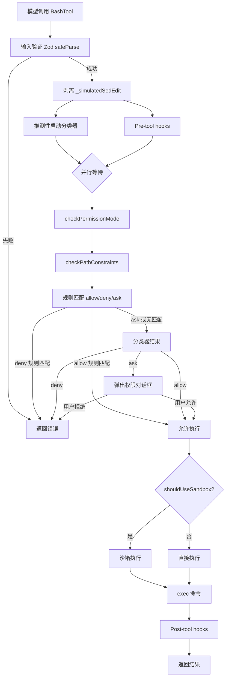
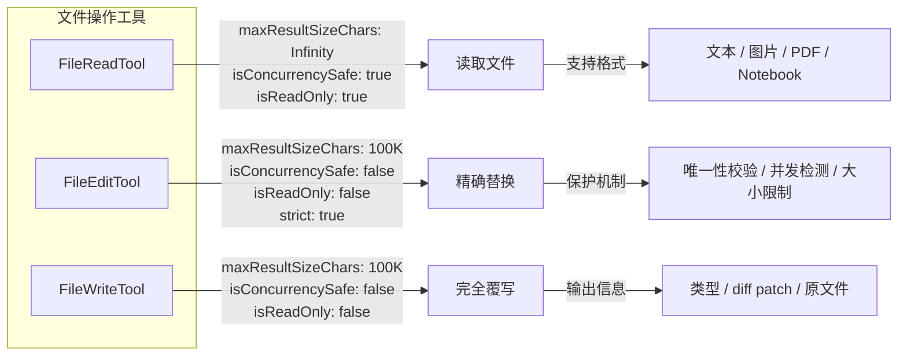
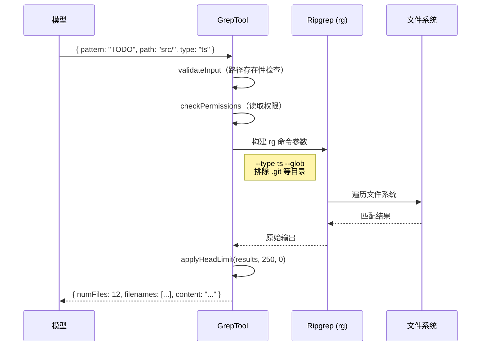
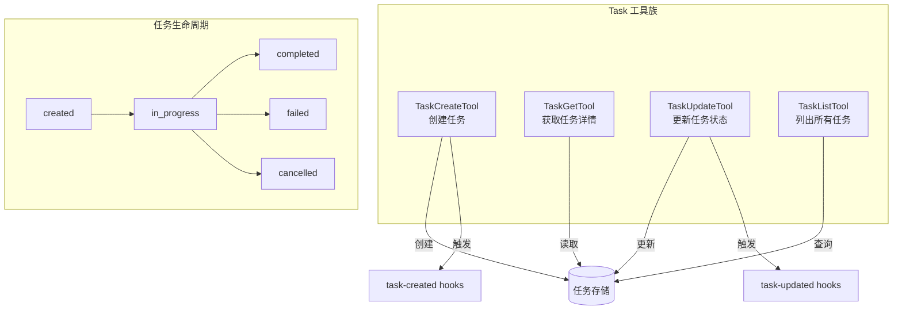

# 第 8 章：内置工具深度解析

> "工具既是手的延伸，也是心智的延伸。" —— Marshall McLuhan

如果说 Tool 接口定义了工具的骨骼，那么具体的工具实现就是肌肉与血液。Claude Code 内置了超过 40 个工具，涵盖了 shell 执行、文件操作、代码搜索、网络访问和任务管理等核心能力。本章将选取最具代表性的工具进行深度剖析，揭示它们在安全性、性能和用户体验方面的精巧设计。

## 8.1 BashTool —— 最复杂的单一工具

### 8.1.1 复杂度概览

BashTool 是 Claude Code 中最复杂的单一工具。其实现涉及 18 个文件，从 `BashTool.tsx` 主文件到 `bashPermissions.ts`、`bashSecurity.ts`、`commandSemantics.ts`、`sedEditParser.ts`、`shouldUseSandbox.ts` 等辅助模块。这种复杂度源于 shell 命令执行在安全领域的特殊地位——它是所有工具中攻击面最大的。

```
src/tools/BashTool/
├── BashTool.tsx              # 主实现（schema 定义、call 方法、UI 渲染）
├── bashPermissions.ts        # 权限检查：命令解析、规则匹配、分类器
├── bashSecurity.ts           # 安全检查：命令安全性评估
├── commandSemantics.ts       # 命令语义解释（退出码含义）
├── sedEditParser.ts          # sed 命令特殊处理（作为文件编辑）
├── readOnlyValidation.ts     # 只读约束检查
├── modeValidation.ts         # 模式验证
├── pathValidation.ts         # 路径安全检查
├── sedValidation.ts          # sed 命令验证
├── shouldUseSandbox.ts       # 沙箱判断逻辑
├── bashCommandHelpers.ts     # 复合命令辅助函数
├── destructiveCommandWarning.ts # 破坏性命令警告
├── prompt.ts                 # 系统提示生成
├── toolName.ts               # 工具名称常量
├── commentLabel.ts           # 注释标签
├── utils.ts                  # 通用工具函数
├── UI.tsx                    # React UI 组件
└── BashToolResultMessage.tsx # 结果展示组件
```

### 8.1.2 输入 Schema

BashTool 的输入 schema 经过精心设计，包含多个字段：

```typescript
// src/tools/BashTool/BashTool.tsx
const fullInputSchema = lazySchema(() => z.strictObject({
  command: z.string().describe('The command to execute'),
  timeout: semanticNumber(z.number().optional()).describe(
    `Optional timeout in milliseconds (max ${getMaxTimeoutMs()})`
  ),
  description: z.string().optional().describe(
    'Clear, concise description of what this command does in active voice...'
  ),
  run_in_background: semanticBoolean(z.boolean().optional()).describe(
    'Set to true to run this command in the background.'
  ),
  dangerouslyDisableSandbox: semanticBoolean(z.boolean().optional()).describe(
    'Set this to true to dangerously override sandbox mode...'
  ),
  _simulatedSedEdit: z.object({
    filePath: z.string(),
    newContent: z.string()
  }).optional().describe('Internal: pre-computed sed edit result from preview')
}))
```

几个值得关注的设计点：

**`semanticNumber` / `semanticBoolean` 包装器。** 这些函数处理模型生成的"语义化"值——模型有时会把布尔值作为字符串 `"true"` 发送，或者把数字作为字符串 `"42"` 发送。这些包装器能容错地解析这些情况。

**`_simulatedSedEdit` 的隐藏与防注入。** 该字段是内部使用的，在发送给模型的 schema 中被显式移除：

```typescript
const inputSchema = lazySchema(() =>
  fullInputSchema().omit({ _simulatedSedEdit: true, /* ... */ })
)
```

同时，`toolExecution.ts` 中还有一道防线，如果模型试图在输入中注入这个字段，会被强制剥离：

```typescript
// src/services/tools/toolExecution.ts
if (tool.name === BASH_TOOL_NAME && processedInput &&
    typeof processedInput === 'object' && '_simulatedSedEdit' in processedInput) {
  const { _simulatedSedEdit: _, ...rest } = processedInput
  processedInput = rest
}
```

这是一个经典的纵深防御——即使 schema 验证被绕过，运行时也会拦截。

### 8.1.3 并发安全性与只读判断

BashTool 的 `isConcurrencySafe` 直接委托给 `isReadOnly`：

```typescript
isConcurrencySafe(input) {
  return this.isReadOnly?.(input) ?? false
},
isReadOnly(input) {
  const compoundCommandHasCd = commandHasAnyCd(input.command)
  const result = checkReadOnlyConstraints(input, compoundCommandHasCd)
  return result.behavior === 'allow'
},
```

这意味着只有确认为只读的命令才会被标记为并发安全。`checkReadOnlyConstraints` 会解析命令的 AST，检查是否包含任何写操作。

### 8.1.4 命令语义分类

BashTool 能够识别命令类型来优化 UI 呈现：

```typescript
// 搜索命令 -- 在 UI 中折叠显示
const BASH_SEARCH_COMMANDS = new Set([
  'find', 'grep', 'rg', 'ag', 'ack', 'locate', 'which', 'whereis'
])

// 读取命令 -- 在 UI 中折叠显示
const BASH_READ_COMMANDS = new Set([
  'cat', 'head', 'tail', 'less', 'more',
  'wc', 'stat', 'file', 'strings',
  'jq', 'awk', 'cut', 'sort', 'uniq', 'tr'
])

// 目录列表命令
const BASH_LIST_COMMANDS = new Set(['ls', 'tree', 'du'])

// 语义中立命令 -- 不改变管道的读/搜索性质
const BASH_SEMANTIC_NEUTRAL_COMMANDS = new Set([
  'echo', 'printf', 'true', 'false', ':'
])

// 静默命令 -- 成功时无输出，显示 "Done" 而非 "(No output)"
const BASH_SILENT_COMMANDS = new Set([
  'mv', 'cp', 'rm', 'mkdir', 'rmdir', 'chmod', 'chown',
  'chgrp', 'touch', 'ln', 'cd', 'export', 'unset', 'wait'
])
```

`isSearchOrReadBashCommand` 的分析逻辑对复合命令有特殊处理——对于管道（`|`）和链式命令（`&&`、`;`），所有部分都必须是搜索/读取命令，整个命令才被视为搜索/读取操作。语义中立命令被跳过，不影响判定：

```typescript
export function isSearchOrReadBashCommand(command: string) {
  const partsWithOperators = splitCommandWithOperators(command)
  let hasSearch = false, hasRead = false, hasList = false
  for (const part of partsWithOperators) {
    // 跳过操作符和重定向目标
    if (['||', '&&', '|', ';'].includes(part)) continue
    const baseCommand = part.trim().split(/\s+/)[0]
    // 语义中立命令不影响判断
    if (BASH_SEMANTIC_NEUTRAL_COMMANDS.has(baseCommand)) continue
    // 任何非搜索/读取命令都会使整个命令不可折叠
    if (!BASH_SEARCH_COMMANDS.has(baseCommand) &&
        !BASH_READ_COMMANDS.has(baseCommand) &&
        !BASH_LIST_COMMANDS.has(baseCommand)) {
      return { isSearch: false, isRead: false, isList: false }
    }
    // ... 累积标记
  }
}
```

### 8.1.5 权限检查的多层防线

BashTool 的权限检查通过 `bashToolHasPermission` 函数实现，是整个系统中最复杂的权限检查流程。它包括：

1. **模式检查**（`checkPermissionMode`）-- 检查当前是否在 plan 模式等特殊模式下
2. **路径约束检查**（`checkPathConstraints`）-- 确保命令不会操作受限路径
3. **沙箱判断**（`shouldUseSandbox`）-- 决定是否在沙箱中执行
4. **规则匹配** —— 与 `allow`/`deny`/`ask` 规则列表匹配
5. **安全分类器**（`classifyBashCommand`）-- 异步 ML 分类器判断命令安全性
6. **sed 特殊处理**（`checkSedConstraints`）-- sed in-place 编辑的特殊权限路径

权限检查还有一个性能优化——推测性分类器预启动：

```typescript
// src/services/tools/toolExecution.ts
if (tool.name === BASH_TOOL_NAME && parsedInput.data && 'command' in parsedInput.data) {
  startSpeculativeClassifierCheck(
    parsedInput.data.command,
    appState.toolPermissionContext,
    toolUseContext.abortController.signal,
    toolUseContext.options.isNonInteractiveSession,
  )
}
```

这段代码在输入验证通过后立即启动分类器检查，而不等到权限检查阶段。这样分类器可以与 pre-tool hooks 并行运行，减少用户等待时间。

### 8.1.6 安全校验流程



## 8.2 文件操作三剑客 —— FileReadTool / FileEditTool / FileWriteTool

### 8.2.1 FileReadTool —— 智能文件读取

FileReadTool 不是一个简单的 `cat` 包装。它支持读取普通文本文件、图片（作为视觉内容返回）、PDF（按页提取）、Jupyter Notebook（解析所有 cell）等多种格式。

```typescript
// src/tools/FileReadTool/FileReadTool.ts（关键属性）
export const FileReadTool = buildTool({
  name: FILE_READ_TOOL_NAME,
  maxResultSizeChars: Infinity,  // 注意：Infinity！
  isConcurrencySafe() { return true },
  isReadOnly() { return true },
  // ...
})
```

`maxResultSizeChars: Infinity` 是一个关键设计——FileReadTool 的输出永远不会被持久化到磁盘。源码注释解释道：

> *"Set to Infinity for tools whose output must never be persisted (e.g. Read, where persisting creates a circular Read -> file -> Read loop and the tool already self-bounds via its own limits)."*

如果将读取结果保存到临时文件，模型可能会再次用 Read 读取那个临时文件，形成无限循环。

FileReadTool 还有一个安全特性——阻止读取危险的设备文件：

```typescript
const BLOCKED_DEVICE_PATHS = new Set([
  '/dev/zero',    // 无限输出，永远不会 EOF
  '/dev/random', '/dev/urandom',  // 同上
  '/dev/stdin', '/dev/fd/0',      // 阻塞等待输入
  // ...
])
```

### 8.2.2 FileEditTool —— 精确字符串替换

FileEditTool 的核心理念是"精确替换"而非"全文重写"——通过 `old_string` 和 `new_string` 实现对文件的最小化修改：

```typescript
// src/tools/FileEditTool/types.ts
const inputSchema = lazySchema(() => z.strictObject({
  file_path: z.string().describe('The absolute path to the file to modify'),
  old_string: z.string().describe('The text to replace'),
  new_string: z.string().describe('The text to replace it with'),
  replace_all: z.boolean().default(false).describe(
    'Replace all occurrences of old_string'
  ),
}))
```

FileEditTool 的几个关键设计：

**唯一性校验。** 当 `replace_all` 为 `false` 时，`old_string` 必须在文件中唯一出现。如果有多个匹配，工具会报错要求提供更多上下文来消除歧义。

**并发修改检测。** 利用 `readFileState`（FileStateCache）跟踪文件的最后读取时间戳。如果文件在上次读取后被外部修改，编辑会被拒绝：

```typescript
// 常量定义
export const FILE_UNEXPECTEDLY_MODIFIED_ERROR =
  'File was unexpectedly modified since last read'
```

**文件大小上限。** 设置了 1 GiB 的硬限制，防止处理超大文件导致 OOM：

```typescript
const MAX_EDIT_FILE_SIZE = 1024 * 1024 * 1024 // 1 GiB (stat bytes)
```

**权限检查。** 通过 `checkWritePermissionForTool` 验证文件路径是否在允许写入的范围内：

```typescript
async checkPermissions(input, context) {
  const appState = context.getAppState()
  return checkWritePermissionForTool(
    FileEditTool, input, appState.toolPermissionContext,
  )
},
```

**路径回填。** `backfillObservableInput` 方法将相对路径或 `~` 开头的路径展开为绝对路径，确保 hook 的 allowlist 不会被绕过：

```typescript
backfillObservableInput(input) {
  if (typeof input.file_path === 'string') {
    input.file_path = expandPath(input.file_path)
  }
},
```

### 8.2.3 FileWriteTool —— 全文件创建/覆写

FileWriteTool 用于创建新文件或完全覆写已有文件，其 schema 更为简洁：

```typescript
const inputSchema = lazySchema(() => z.strictObject({
  file_path: z.string().describe(
    'The absolute path to the file to write (must be absolute, not relative)'
  ),
  content: z.string().describe('The content to write to the file'),
}))
```

FileWriteTool 的输出 schema 包含丰富的变更信息，方便 UI 展示差异：

```typescript
const outputSchema = lazySchema(() => z.object({
  type: z.enum(['create', 'update']),  // 创建还是更新
  filePath: z.string(),
  content: z.string(),
  structuredPatch: z.array(hunkSchema()),  // diff patch
  originalFile: z.string().optional(),      // 原文件内容（如有）
}))
```

### 8.2.4 三剑客的设计对比



| 特性 | FileReadTool | FileEditTool | FileWriteTool |
|------|-------------|--------------|---------------|
| 并发安全 | 是 | 否 | 否 |
| 只读 | 是 | 否 | 否 |
| maxResultSizeChars | Infinity | 100,000 | 100,000 |
| strict 模式 | 否 | 是 | 否 |
| 格式支持 | 文本/图片/PDF/Notebook | 纯文本 | 纯文本 |
| 权限检查 | 读取权限 | 写入权限 | 写入权限 |
| shouldDefer | 否 | 否 | 否 |

## 8.3 GlobTool/GrepTool —— Ripgrep 集成

### 8.3.1 GlobTool —— 快速文件名搜索

GlobTool 通过内部的 `glob` 工具函数执行文件名模式匹配。它的设计注重简洁：

```typescript
// src/tools/GlobTool/GlobTool.ts
export const GlobTool = buildTool({
  name: GLOB_TOOL_NAME,
  searchHint: 'find files by name pattern or wildcard',
  maxResultSizeChars: 100_000,
  isConcurrencySafe() { return true },
  isReadOnly() { return true },
  isSearchOrReadCommand() { return { isSearch: true, isRead: false } },
  // ...
})
```

GlobTool 和 GrepTool 都是并发安全且只读的——它们可以与其他搜索工具并行执行。

输入 schema 只有两个字段：

```typescript
const inputSchema = lazySchema(() => z.strictObject({
  pattern: z.string().describe('The glob pattern to match files against'),
  path: z.string().optional().describe('The directory to search in.'),
}))
```

值得注意的是，当内部构建嵌入了搜索工具时，GlobTool 会被完全移除：

```typescript
// src/tools.ts
...(hasEmbeddedSearchTools() ? [] : [GlobTool, GrepTool]),
```

### 8.3.2 GrepTool —— Ripgrep 的深度集成

GrepTool 是 Claude Code 搜索能力的核心。它基于 Ripgrep（rg）实现，提供了远超 grep 的搜索体验。

**丰富的输入参数。** GrepTool 的 schema 几乎是 ripgrep 常用参数的一对一映射：

```typescript
const inputSchema = lazySchema(() => z.strictObject({
  pattern: z.string(),      // 正则表达式模式
  path: z.string().optional(),
  glob: z.string().optional(),  // 文件过滤 glob
  output_mode: z.enum(['content', 'files_with_matches', 'count']).optional(),
  '-B': semanticNumber(z.number().optional()),  // 前文行数
  '-A': semanticNumber(z.number().optional()),  // 后文行数
  '-C': semanticNumber(z.number().optional()),  // 上下文行数
  context: semanticNumber(z.number().optional()),
  '-n': semanticBoolean(z.boolean().optional()),  // 行号
  '-i': semanticBoolean(z.boolean().optional()),  // 忽略大小写
  type: z.string().optional(),     // 文件类型过滤
  head_limit: semanticNumber(z.number().optional()),  // 结果行数限制
  offset: semanticNumber(z.number().optional()),       // 偏移量
  multiline: semanticBoolean(z.boolean().optional()),  // 多行模式
}))
```

**默认结果限制。** 为防止上下文膨胀，GrepTool 默认只返回前 250 条结果：

```typescript
const DEFAULT_HEAD_LIMIT = 250
```

模型可以通过传 `head_limit: 0` 来获取无限结果，但这在源码注释中被标记为"谨慎使用"。

**VCS 目录自动排除。** 搜索时自动排除版本控制目录：

```typescript
const VCS_DIRECTORIES_TO_EXCLUDE = ['.git', '.svn', '.hg', '.bzr', '.jj', '.sl']
```

**分页支持。** 通过 `offset` 和 `head_limit` 的组合，GrepTool 支持结果分页：

```typescript
function applyHeadLimit<T>(items: T[], limit: number | undefined, offset: number = 0) {
  if (limit === 0) return { items: items.slice(offset), appliedLimit: undefined }
  const effectiveLimit = limit ?? DEFAULT_HEAD_LIMIT
  const sliced = items.slice(offset, offset + effectiveLimit)
  const wasTruncated = items.length - offset > effectiveLimit
  return { items: sliced, appliedLimit: wasTruncated ? effectiveLimit : undefined }
}
```

**GrepTool 与 BashTool grep 的关系。** 有趣的是，模型可以通过 BashTool 执行 `grep` 或 `rg` 命令，也可以使用 GrepTool。系统提示中明确引导模型使用 GrepTool 而非 BashTool 中的 grep。GrepTool 的优势在于：结构化的输出（文件名列表、匹配计数等）、内置的结果限制和分页、以及正确的权限检查。

### 8.3.3 搜索工具的设计模式



## 8.4 WebFetchTool / WebSearchTool —— 网络工具

### 8.4.1 WebFetchTool —— URL 内容抓取

WebFetchTool 从指定 URL 抓取内容，将 HTML 转为 Markdown，然后用一个小模型对内容进行总结：

```typescript
export const WebFetchTool = buildTool({
  name: WEB_FETCH_TOOL_NAME,
  searchHint: 'fetch and extract content from a URL',
  maxResultSizeChars: 100_000,
  shouldDefer: true,           // 延迟加载
  isConcurrencySafe() { return true },
  isReadOnly() { return true },
  // ...
})
```

WebFetchTool 被标记为 `shouldDefer: true`——它不是核心的编码工具，大多数对话不需要它，所以延迟加载以节省 prompt 空间。

**输入 schema。** 只有两个必填字段：

```typescript
const inputSchema = lazySchema(() => z.strictObject({
  url: z.string().url().describe('The URL to fetch content from'),
  prompt: z.string().describe('The prompt to run on the fetched content'),
}))
```

`prompt` 字段是一个巧妙设计——模型不是简单地抓取网页然后塞入上下文，而是告诉 WebFetchTool "要从页面提取什么信息"。内部使用一个较小的模型处理大量网页内容并提取相关部分，避免了将整个页面内容放入主对话的上下文窗口。

**权限模型。** WebFetchTool 的权限基于域名而非完整 URL：

```typescript
function webFetchToolInputToPermissionRuleContent(input: { [k: string]: unknown }): string {
  try {
    const { url } = parsedInput.data
    const hostname = new URL(url).hostname
    return `domain:${hostname}`
  } catch {
    return `input:${input.toString()}`
  }
}
```

这意味着用户可以授权 "允许访问 github.com" 而不需要逐一授权每个 URL。

**预批准主机。** 某些安全的主机（如文档网站）被预先批准，无需用户确认：

```typescript
// 通过 isPreapprovedHost 和 isPreapprovedUrl 函数检查
```

### 8.4.2 WebSearchTool —— 基于 API 的网络搜索

WebSearchTool 的实现方式与其他工具截然不同——它不是在本地执行搜索，而是利用 Anthropic API 的内置 web_search 工具：

```typescript
function makeToolSchema(input: Input): BetaWebSearchTool20250305 {
  return {
    type: 'web_search_20250305',
    name: 'web_search',
    allowed_domains: input.allowed_domains,
    blocked_domains: input.blocked_domains,
    max_uses: 8,  // 硬编码最多 8 次搜索
  }
}
```

WebSearchTool 实际上是一个 "工具中的工具"——它通过 `queryModelWithStreaming` 发起一次新的 API 调用，在该调用中配置了 `web_search` 工具。API 侧的模型执行搜索，然后 Claude Code 将搜索结果格式化返回给主对话。

```typescript
const outputSchema = lazySchema(() => z.object({
  query: z.string(),
  results: z.array(z.union([searchResultSchema(), z.string()])),
  durationSeconds: z.number(),
}))
```

结果是 `SearchResult | string` 的混合数组——搜索结果和模型生成的文本评论交替出现。

### 8.4.3 网络工具对比

| 特性 | WebFetchTool | WebSearchTool |
|------|-------------|---------------|
| 功能 | 抓取单个 URL 内容 | 网络搜索 |
| 实现方式 | 直接 HTTP 请求 | 嵌套 API 调用 |
| 内容处理 | HTML -> Markdown -> 小模型总结 | API 侧 web_search 工具 |
| 权限粒度 | 域名级别 | 通用（域名过滤在参数中） |
| shouldDefer | 是 | 否 |
| max_uses | N/A | 8 次搜索/调用 |

## 8.5 TaskTools —— 任务管理系统

### 8.5.1 设计背景

Task 工具族（TaskCreate、TaskGet、TaskUpdate、TaskList）是 Claude Code 的任务管理系统 v2（TodoV2），用于替代旧的 TodoWriteTool。它们在 `isTodoV2Enabled()` 为 true 时才可用。

### 8.5.2 TaskCreateTool

```typescript
// src/tools/TaskCreateTool/TaskCreateTool.ts
export const TaskCreateTool = buildTool({
  name: TASK_CREATE_TOOL_NAME,
  searchHint: 'create a task in the task list',
  maxResultSizeChars: 100_000,
  shouldDefer: true,
  isEnabled() { return isTodoV2Enabled() },
  isConcurrencySafe() { return true },
  // ...
  async call({ subject, description, activeForm, metadata }, context) {
    const taskListId = await getTaskListId(context)
    const task = await createTask(taskListId, {
      subject,
      description,
      activeForm,
      metadata,
      agentName: getAgentName(context),
      teamName: getTeamName(context),
    })
    // 执行 task-created hooks
    await executeTaskCreatedHooks(/* ... */)
    return { data: { task: { id: task.id, subject: task.subject } } }
  }
})
```

TaskCreateTool 的输入 schema：

```typescript
const inputSchema = lazySchema(() => z.strictObject({
  subject: z.string().describe('A brief title for the task'),
  description: z.string().describe('What needs to be done'),
  activeForm: z.string().optional().describe(
    'Present continuous form shown in spinner when in_progress (e.g., "Running tests")'
  ),
  metadata: z.record(z.string(), z.unknown()).optional().describe(
    'Arbitrary metadata to attach to the task'
  ),
}))
```

**`activeForm` 字段** 是一个 UX 优化——当任务处于进行中状态时，spinner 会显示这个描述（如 "Running tests"），而非通用的 "Working..."。

### 8.5.3 Task 工具族的设计模式

Task 工具族共享几个设计特征：

1. **全部 `shouldDefer: true`** —— 任务管理不是每次对话都需要的
2. **全部 `isConcurrencySafe: true`** —— 任务操作是独立的，可以并行
3. **条件启用** —— 通过 `isEnabled()` 检查功能标记
4. **与 hooks 集成** —— TaskCreate 执行后触发 task-created hooks



### 8.5.4 共同的工具模式

回顾本章分析的所有工具，可以提炼出几个共同的设计模式：

**模式一：lazySchema。** 所有工具都使用 `lazySchema` 延迟构建 Zod schema，避免模块加载时的开销：

```typescript
const inputSchema = lazySchema(() => z.strictObject({ /* ... */ }))
```

**模式二：buildTool 工厂。** 每个工具都通过 `buildTool` 构建，享受失败关闭的默认值。

**模式三：分离的 UI。** 工具的业务逻辑和 UI 渲染分布在不同文件中（如 `GrepTool.ts` 和 `UI.tsx`），但通过 Tool 接口统一暴露。

**模式四：权限委托。** 文件工具委托给 `checkReadPermissionForTool` / `checkWritePermissionForTool`，BashTool 有独立的权限链，网络工具基于域名。

## 本章小结

本章深入分析了 Claude Code 最核心的内置工具：

1. **BashTool** 是最复杂的工具，18 个文件、多层安全防线、命令语义分类、推测性分类器等设计使其在提供强大 shell 能力的同时保持安全
2. **FileRead/Edit/Write** 三剑客各司其职，Read 以 Infinity 的 maxResultSizeChars 避免循环读取，Edit 通过精确替换最小化修改，Write 提供完整的 diff 信息
3. **Glob/Grep** 工具与 Ripgrep 深度集成，提供结构化输出、分页、结果限制等高级功能
4. **WebFetch/WebSearch** 分别通过 HTTP 抓取和嵌套 API 调用提供网络能力
5. **Task 工具族** 展示了条件启用、延迟加载、hooks 集成等模式

下一章将分析这些工具如何在 StreamingToolExecutor 中被调度执行，以及工具结果如何被截断和持久化。
