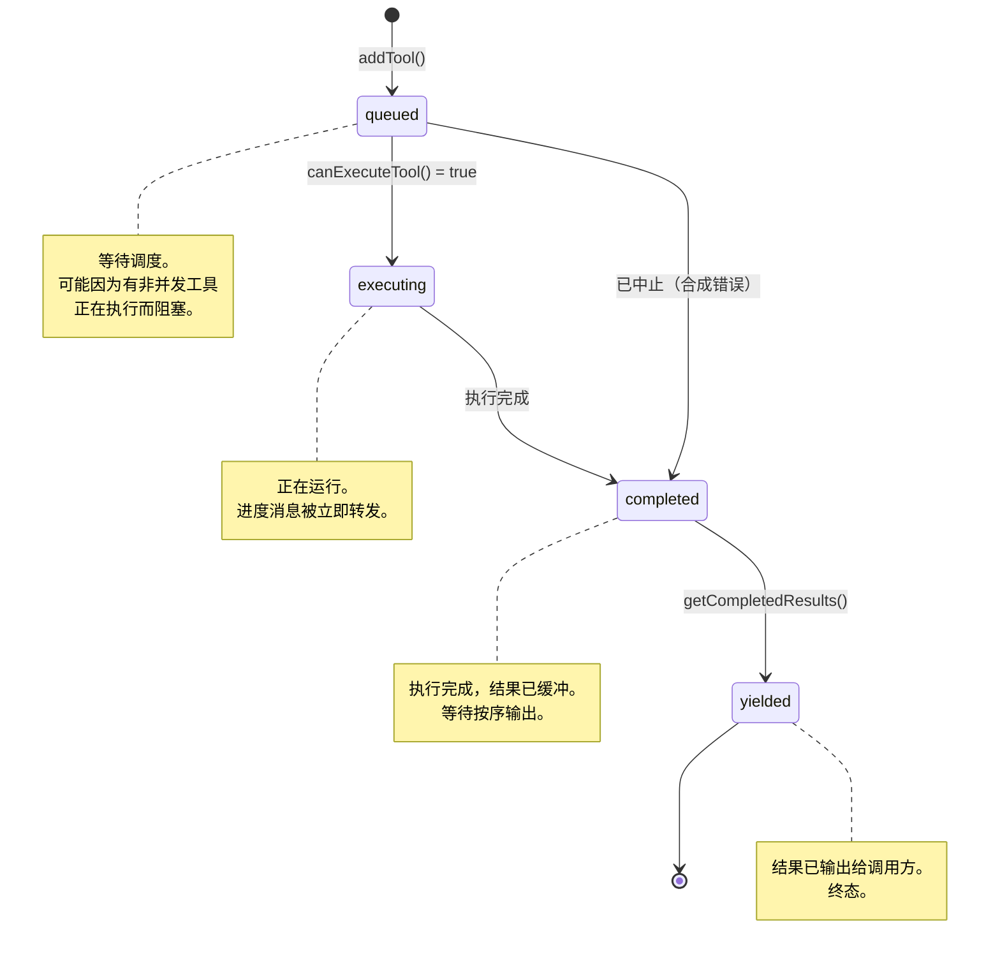
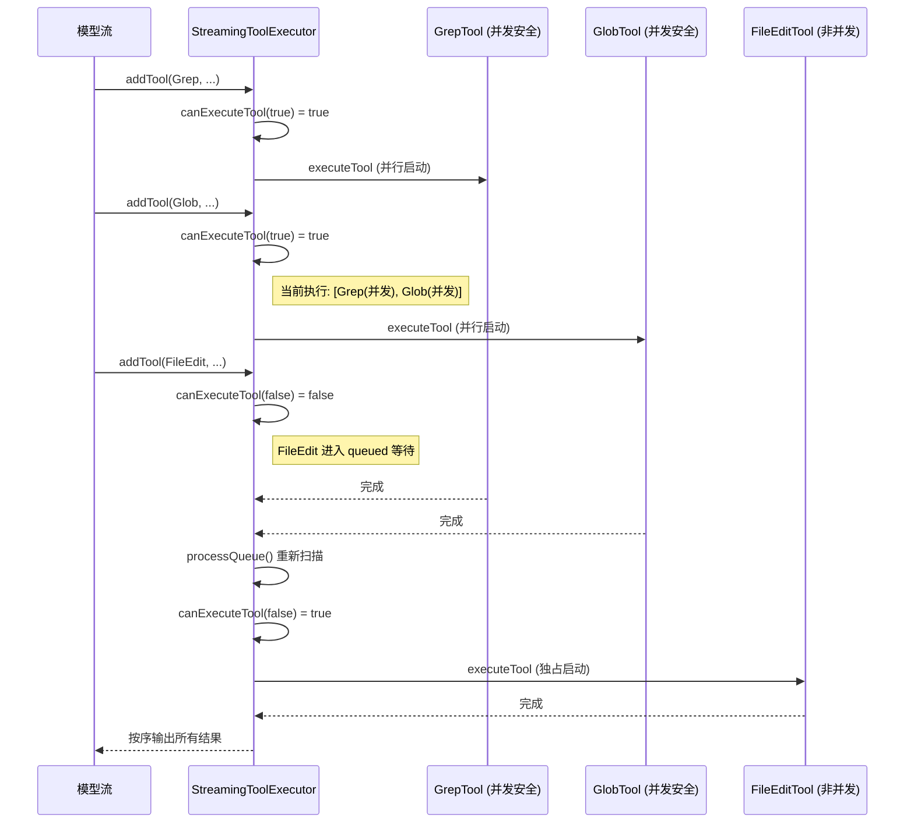
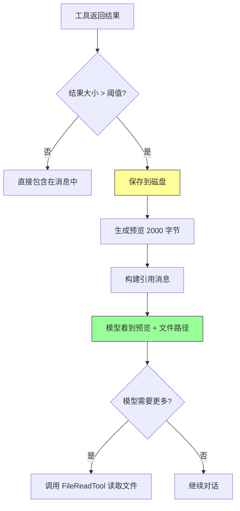
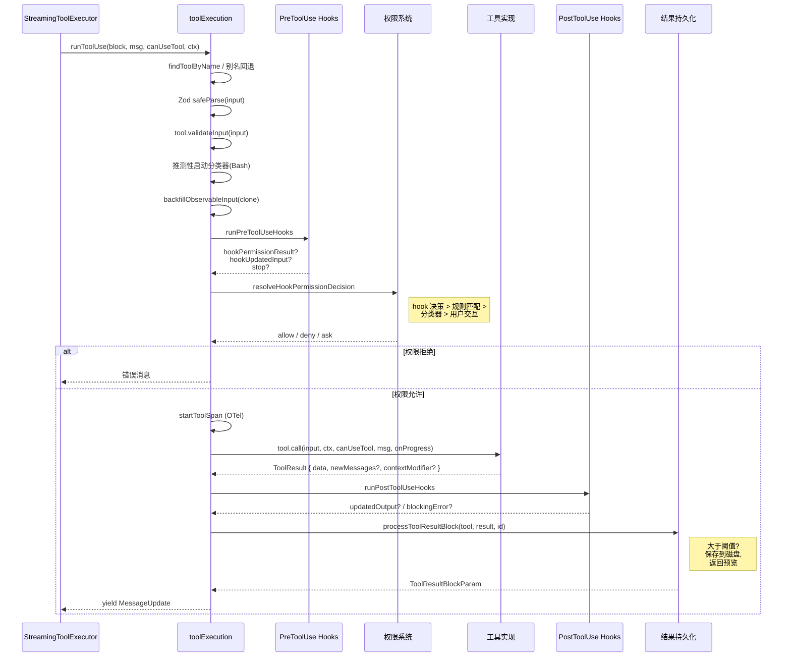
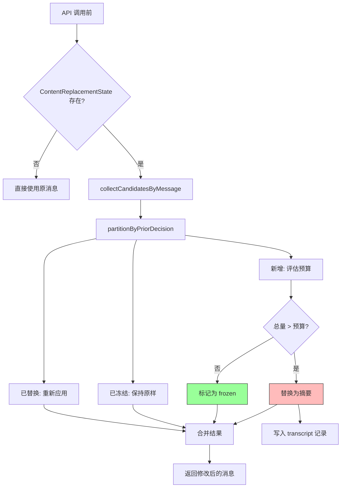
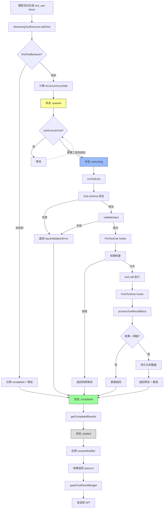

# 第 9 章：工具执行管线

> "并发不是并行，但并发能让并行成为可能。" —— Rob Pike

当模型在一次响应中调用多个工具时，Claude Code 面临一个核心调度问题：哪些工具可以并行？哪些必须串行？如果一个工具失败了，正在运行的兄弟工具怎么办？工具输出太大怎么处理？

本章深入分析 `StreamingToolExecutor` 并发调度器和 `toolExecution.ts` 执行管线的实现，揭示工具执行从队列入队到结果产出的完整数据通路。

## 9.1 StreamingToolExecutor —— 并发调度器的状态机

### 9.1.1 设计挑战

Claude 模型以流式方式生成响应，工具调用也是逐步"流入"的——模型可能先生成第一个工具调用的参数，接着是第二个，然后是第三个。`StreamingToolExecutor` 需要在工具调用流入的同时就开始执行，而不是等到所有工具调用都生成完毕才开始。

这带来了几个核心挑战：
1. 工具调用的到达是渐进的，需要即时调度
2. 并发安全的工具应该并行执行以提高效率
3. 非并发安全的工具必须独占执行
4. 结果必须按到达顺序输出（保持确定性）
5. 一个工具的失败（特别是 Bash）应该取消正在运行的兄弟工具

### 9.1.2 TrackedTool 与状态机

每个进入调度器的工具被封装为 `TrackedTool`：

```typescript
// src/services/tools/StreamingToolExecutor.ts
type ToolStatus = 'queued' | 'executing' | 'completed' | 'yielded'

type TrackedTool = {
  id: string
  block: ToolUseBlock
  assistantMessage: AssistantMessage
  status: ToolStatus
  isConcurrencySafe: boolean
  promise?: Promise<void>
  results?: Message[]
  pendingProgress: Message[]
  contextModifiers?: Array<(context: ToolUseContext) => ToolUseContext>
}
```

工具在其生命周期内经历四个状态：



### 9.1.3 调度器初始化

```typescript
export class StreamingToolExecutor {
  private tools: TrackedTool[] = []
  private toolUseContext: ToolUseContext
  private hasErrored = false
  private erroredToolDescription = ''
  private siblingAbortController: AbortController
  private discarded = false
  private progressAvailableResolve?: () => void

  constructor(
    private readonly toolDefinitions: Tools,
    private readonly canUseTool: CanUseToolFn,
    toolUseContext: ToolUseContext,
  ) {
    this.toolUseContext = toolUseContext
    this.siblingAbortController = createChildAbortController(
      toolUseContext.abortController,
    )
  }
}
```

注意 `siblingAbortController` 的设计：它是 `toolUseContext.abortController` 的子控制器。当一个 Bash 工具出错时，`siblingAbortController` 被中止，这会终止所有正在执行的兄弟工具的子进程，但**不会**中止父控制器——查询循环不会因此结束。

### 9.1.4 工具入队 —— addTool

```typescript
addTool(block: ToolUseBlock, assistantMessage: AssistantMessage): void {
  const toolDefinition = findToolByName(this.toolDefinitions, block.name)
  if (!toolDefinition) {
    // 未知工具：立即标记为 completed，返回错误
    this.tools.push({
      id: block.id, block, assistantMessage,
      status: 'completed',
      isConcurrencySafe: true,
      pendingProgress: [],
      results: [createUserMessage({
        content: [{
          type: 'tool_result',
          content: `Error: No such tool available: ${block.name}`,
          is_error: true, tool_use_id: block.id,
        }],
      })],
    })
    return
  }

  // 解析输入以确定并发安全性
  const parsedInput = toolDefinition.inputSchema.safeParse(block.input)
  const isConcurrencySafe = parsedInput?.success
    ? (() => {
        try {
          return Boolean(toolDefinition.isConcurrencySafe(parsedInput.data))
        } catch {
          return false  // 解析失败 -> 假定不安全
        }
      })()
    : false  // schema 验证失败 -> 假定不安全

  this.tools.push({
    id: block.id, block, assistantMessage,
    status: 'queued', isConcurrencySafe,
    pendingProgress: [],
  })

  void this.processQueue()
}
```

几个关键设计点：

1. **未知工具快速失败。** 找不到的工具立即被标记为 `completed` 并赋予错误结果，不进入队列。
2. **并发安全性是输入相关的。** `isConcurrencySafe` 在此时就被计算并固定，因为它取决于具体的输入参数。
3. **失败关闭。** schema 解析失败或 `isConcurrencySafe` 抛异常时，默认为 `false`。

### 9.1.5 调度决策 —— canExecuteTool

```typescript
private canExecuteTool(isConcurrencySafe: boolean): boolean {
  const executingTools = this.tools.filter(t => t.status === 'executing')
  return (
    executingTools.length === 0 ||
    (isConcurrencySafe && executingTools.every(t => t.isConcurrencySafe))
  )
}
```

这个函数定义了核心调度规则，可以用一个简洁的真值表表达：

| 正在执行的工具 | 新工具类型 | 能否执行 |
|--------------|-----------|---------|
| 无 | 任何 | 是 |
| 全部并发安全 | 并发安全 | 是 |
| 全部并发安全 | 非并发安全 | 否 |
| 任何非并发安全 | 任何 | 否 |

简言之：**并发安全的工具可以彼此并行，但非并发安全的工具必须独占执行。**

### 9.1.6 队列处理 —— processQueue

```typescript
private async processQueue(): Promise<void> {
  for (const tool of this.tools) {
    if (tool.status !== 'queued') continue

    if (this.canExecuteTool(tool.isConcurrencySafe)) {
      await this.executeTool(tool)
    } else {
      // 非并发工具无法执行时，停止扫描后续工具
      if (!tool.isConcurrencySafe) break
    }
  }
}
```

注意 `break` 的条件：当遇到一个无法执行的**非并发安全**工具时，停止扫描。这是因为非并发工具必须按顺序执行——后续的工具（无论是否并发安全）都不能跳过它先执行。

但如果无法执行的是并发安全工具（因为当前有非并发工具在执行），循环会继续扫描——可能后面还有其他需要处理的工具。

### 9.1.7 并发执行时序图



## 9.2 并发安全性 —— isConcurrencySafe 的语义和调度规则

### 9.2.1 工具的并发安全分类

在 Claude Code 的工具集中，并发安全属性的分布如下：

**始终并发安全：**
- `GlobTool` —— 纯文件名搜索，不修改任何状态
- `GrepTool` —— 纯内容搜索
- `FileReadTool` —— 纯读取
- `WebFetchTool` —— HTTP GET，无副作用
- `TaskCreateTool`/`TaskGetTool`/`TaskUpdateTool`/`TaskListTool` —— 任务操作互相独立

**始终非并发安全：**
- `FileEditTool` —— 修改文件内容
- `FileWriteTool` —— 创建/覆写文件

**输入相关的并发安全性：**
- `BashTool` —— 只有确认为只读的命令才并发安全

BashTool 的实现值得细看：

```typescript
// BashTool
isConcurrencySafe(input) {
  return this.isReadOnly?.(input) ?? false
},
isReadOnly(input) {
  const compoundCommandHasCd = commandHasAnyCd(input.command)
  const result = checkReadOnlyConstraints(input, compoundCommandHasCd)
  return result.behavior === 'allow'
},
```

这意味着 `ls -la` 会被并发执行（只读），但 `git push` 会独占执行（写操作）。

### 9.2.2 错误级联 —— Bash 特殊待遇

当工具执行失败时，`StreamingToolExecutor` 对 Bash 工具有特殊处理：

```typescript
// 在 executeTool 中
if (isErrorResult) {
  thisToolErrored = true
  // 只有 Bash 错误会取消兄弟工具
  if (tool.block.name === BASH_TOOL_NAME) {
    this.hasErrored = true
    this.erroredToolDescription = this.getToolDescription(tool)
    this.siblingAbortController.abort('sibling_error')
  }
}
```

源码注释解释了原因：

> *"Only Bash errors cancel siblings. Bash commands often have implicit dependency chains (e.g. mkdir fails -> subsequent commands pointless). Read/WebFetch/etc are independent —— one failure shouldn't nuke the rest."*

这是一个务实的设计决策：Bash 命令之间经常有隐式依赖（前一个创建目录，后一个在该目录中操作），所以一个 Bash 命令失败通常意味着后续 Bash 命令也会失败。但 Read、Grep 等独立工具彼此无关，一个失败不应影响其他。

### 9.2.3 中断行为 —— interruptBehavior

当用户在工具执行过程中提交新消息时，`StreamingToolExecutor` 需要决定每个工具的命运：

```typescript
private getToolInterruptBehavior(tool: TrackedTool): 'cancel' | 'block' {
  const definition = findToolByName(this.toolDefinitions, tool.block.name)
  if (!definition?.interruptBehavior) return 'block'  // 默认：阻塞
  try {
    return definition.interruptBehavior()
  } catch {
    return 'block'
  }
}
```

- `'cancel'` —— 停止工具，丢弃结果（用于可以安全中断的工具）
- `'block'` —— 继续运行，新消息等待（默认行为）

`updateInterruptibleState` 方法维护一个全局标志，告诉 UI 是否当前有可中断的工具在运行：

```typescript
private updateInterruptibleState(): void {
  const executing = this.tools.filter(t => t.status === 'executing')
  this.toolUseContext.setHasInterruptibleToolInProgress?.(
    executing.length > 0 &&
    executing.every(t => this.getToolInterruptBehavior(t) === 'cancel'),
  )
}
```

只有当所有正在执行的工具都是 `'cancel'` 类型时，UI 才会显示"可中断"状态。

## 9.3 工具结果截断 —— maxResultSizeChars 与磁盘持久化

### 9.3.1 问题背景

工具输出可能非常大——一次 `grep` 可能返回数千行匹配，一个 `bash` 命令可能产生 MB 级的日志。将所有这些塞入对话消息会迅速耗尽上下文窗口。

Claude Code 的解决方案是**磁盘持久化**：当工具输出超过阈值时，完整结果保存到磁盘文件，模型只看到一个预览和文件路径。

### 9.3.2 持久化阈值

每个工具通过 `maxResultSizeChars` 声明自己的阈值：

| 工具 | maxResultSizeChars | 说明 |
|------|-------------------|------|
| FileReadTool | Infinity | 永不持久化（避免循环读取） |
| BashTool | 30,000 | 30K 字符 |
| GrepTool | 20,000 | 20K 字符 |
| FileEditTool | 100,000 | 100K 字符 |
| GlobTool | 100,000 | 100K 字符 |
| WebFetchTool | 100,000 | 100K 字符 |

实际生效的阈值由 `getPersistenceThreshold` 函数决定：

```typescript
// src/utils/toolResultStorage.ts
export function getPersistenceThreshold(
  toolName: string,
  declaredMaxResultSizeChars: number,
): number {
  // Infinity = 硬性豁免（Read 工具）
  if (!Number.isFinite(declaredMaxResultSizeChars)) {
    return declaredMaxResultSizeChars
  }
  // GrowthBook 覆盖（A/B 测试用）
  const overrides = getFeatureValue_CACHED_MAY_BE_STALE(
    'tengu_satin_quoll', {}
  )
  const override = overrides?.[toolName]
  if (typeof override === 'number' && Number.isFinite(override) && override > 0) {
    return override
  }
  // 取 min(工具声明值, 全局默认值)
  return Math.min(declaredMaxResultSizeChars, DEFAULT_MAX_RESULT_SIZE_CHARS)
}
```

这里有三层：
1. `Infinity` 豁免——Read 工具永远不会被持久化
2. GrowthBook 远程配置覆盖——可以动态调整某个工具的阈值
3. 取 min(工具声明, 全局默认) —— 确保不超过全局上限

### 9.3.3 持久化流程

```typescript
// src/utils/toolResultStorage.ts
export async function persistToolResult(
  content: NonNullable<ToolResultBlockParam['content']>,
  toolUseId: string,
): Promise<PersistedToolResult | PersistToolResultError> {
  await ensureToolResultsDir()
  const filepath = getToolResultPath(toolUseId, isJson)
  const contentStr = isJson ? jsonStringify(content) : content

  // 使用 'wx' 标志 -- 如果文件已存在则跳过
  try {
    await writeFile(filepath, contentStr, { encoding: 'utf-8', flag: 'wx' })
  } catch (error) {
    if (getErrnoCode(error) !== 'EEXIST') {
      return { error: getFileSystemErrorMessage(toError(error)) }
    }
    // EEXIST: 之前的 turn 已经持久化过
  }

  const { preview, hasMore } = generatePreview(contentStr, PREVIEW_SIZE_BYTES)
  return { filepath, originalSize: contentStr.length, isJson, preview, hasMore }
}
```

`'wx'` 标志是一个性能优化——`tool_use_id` 是唯一的，同一个 ID 的内容是确定性的。使用 `wx`（独占创建）避免了重复写入，特别是在 microcompact（上下文压缩）重放原始消息时。

持久化后的结果消息格式：

```typescript
export function buildLargeToolResultMessage(result: PersistedToolResult): string {
  let message = `${PERSISTED_OUTPUT_TAG}\n`
  message += `Output too large (${formatFileSize(result.originalSize)}). `
  message += `Full output saved to: ${result.filepath}\n\n`
  message += `Preview (first ${formatFileSize(PREVIEW_SIZE_BYTES)}):\n`
  message += result.preview
  message += result.hasMore ? '\n...\n' : '\n'
  message += PERSISTED_OUTPUT_CLOSING_TAG
  return message
}
```

模型看到的是预览（前 2000 字节）和完整输出的文件路径。如果需要查看更多内容，模型可以使用 FileReadTool 读取持久化文件。



## 9.4 工具钩子 —— Pre/Post 拦截器

### 9.4.1 钩子系统概览

Claude Code 的工具执行管线在工具调用前后插入了两类钩子：
- **PreToolUse** —— 工具执行前触发，可以修改输入、阻止执行、附加上下文
- **PostToolUse** —— 工具执行后触发，可以修改输出、阻止继续

这些钩子通过 `toolHooks.ts` 中的函数调度：

```typescript
// src/services/tools/toolHooks.ts
export async function* runPreToolUseHooks(
  toolUseContext: ToolUseContext,
  tool: Tool,
  processedInput: Record<string, unknown>,
  toolUseID: string,
  messageId: string,
  // ...
): AsyncGenerator<PreToolHookResult> {
  for await (const result of executePreToolHooks(
    tool.name, toolUseID, processedInput,
    toolUseContext, permissionMode,
    toolUseContext.abortController.signal,
  )) {
    // 处理各种钩子结果...
  }
}
```

### 9.4.2 PreToolUse 钩子的结果类型

PreToolUse 钩子可以产生多种类型的结果：

```typescript
// toolExecution.ts 中处理的结果类型
switch (result.type) {
  case 'message':         // 钩子产生的消息（进度或附件）
  case 'hookPermissionResult':  // 钩子做出的权限决策
  case 'hookUpdatedInput':      // 钩子修改了输入
  case 'preventContinuation':   // 钩子要求停止
  case 'stopReason':            // 停止原因
  case 'additionalContext':     // 额外上下文
  case 'stop':                  // 立即停止
}
```

**hookPermissionResult** 是最有趣的——钩子可以替代标准权限系统做出决策。这在 CI/CD 环境中特别有用，自定义钩子可以根据项目规则自动批准或拒绝工具调用。

**hookUpdatedInput** 允许钩子在不做权限决策的情况下修改输入。例如，一个钩子可以将相对路径转为绝对路径，或者添加安全标志。

### 9.4.3 PostToolUse 钩子

```typescript
export async function* runPostToolUseHooks<Input extends AnyObject, Output>(
  toolUseContext: ToolUseContext,
  tool: Tool<Input, Output>,
  toolUseID: string,
  messageId: string,
  toolInput: Record<string, unknown>,
  toolResponse: Output,
  // ...
): AsyncGenerator<PostToolUseHooksResult<Output>> {
  for await (const result of executePostToolHooks(
    tool.name, toolUseID, toolInput, toolOutput,
    toolUseContext, permissionMode,
    toolUseContext.abortController.signal,
  )) {
    // 处理各种钩子结果...
    // PostToolUse 钩子可以修改 MCP 工具的输出
    if (result.updatedOutput) {
      toolOutput = result.updatedOutput
      yield { updatedMCPToolOutput: toolOutput }
    }
  }
}
```

PostToolUse 钩子的一个特殊能力是修改 MCP 工具的输出——这对于过滤敏感信息或规范化输出格式非常有用。

### 9.4.4 钩子执行的性能监控

```typescript
// src/services/tools/toolExecution.ts
export const HOOK_TIMING_DISPLAY_THRESHOLD_MS = 500
const SLOW_PHASE_LOG_THRESHOLD_MS = 2000

// 钩子执行后
const preToolHookDurationMs = Date.now() - preToolHookStart
if (preToolHookDurationMs >= SLOW_PHASE_LOG_THRESHOLD_MS) {
  logForDebugging(
    `Slow PreToolUse hooks: ${preToolHookDurationMs}ms for ${tool.name}`,
    { level: 'info' },
  )
}

// 显示钩子执行摘要
if (preToolHookDurationMs > HOOK_TIMING_DISPLAY_THRESHOLD_MS) {
  resultingMessages.push({
    message: createStopHookSummaryMessage(
      preToolHookInfos.length, preToolHookInfos,
      /* ... timing info ... */
    ),
  })
}
```

当钩子执行时间超过 500ms 时，UI 会显示一个摘要；超过 2000ms 时，会记录调试日志。这帮助用户识别性能瓶颈。

### 9.4.5 完整的工具执行管线



## 9.5 内容替换预算 —— ContentReplacementState 的设计

### 9.5.1 问题：上下文窗口膨胀

即使有了 `maxResultSizeChars` 的单次截断，长对话中累积的工具结果仍然会逐渐填满上下文窗口。每次 API 调用都需要发送完整的消息历史，其中大量旧的工具输出可能已经不再相关。

`ContentReplacementState` 实现了一个**全局工具结果预算**——在总量超标时，自动将旧的工具结果替换为简短摘要。

### 9.5.2 核心数据结构

```typescript
// src/utils/toolResultStorage.ts
export type ContentReplacementState = {
  seenIds: Set<string>           // 已经处理过的 tool_use_id
  replacements: Map<string, string>  // id -> 替换后的内容
}

export function createContentReplacementState(): ContentReplacementState {
  return { seenIds: new Set(), replacements: new Map() }
}
```

结构非常简洁：
- `seenIds` 跟踪所有已评估过的工具结果 ID
- `replacements` 存储决定替换的结果及其替换内容

### 9.5.3 替换决策算法

```typescript
export async function enforceToolResultBudget(
  messages: Message[],
  state: ContentReplacementState,
  skipToolNames: ReadonlySet<string> = new Set(),
): Promise<{
  messages: Message[]
  newlyReplaced: ToolResultReplacementRecord[]
}> {
  // 1. 收集所有候选工具结果
  // 2. 按先前决策分区：已替换 / 已冻结 / 新增
  // 3. 对新增候选者，根据预算决定是否替换
  // 4. 应用替换到消息中
}
```

`enforceToolResultBudget` 的核心逻辑将候选工具结果分为三类：

1. **已替换（replaced）** —— 之前的调用已经决定替换，重新应用相同替换
2. **已冻结（frozen）** —— 已经在 seenIds 中但没有被替换，保持原样
3. **新增（fresh）** —— 从未见过，需要做替换决策

对于新增候选者，算法根据剩余预算和结果大小决定是否替换。较旧的、较大的结果优先被替换。

### 9.5.4 与子代理的交互

`ContentReplacementState` 在子代理场景下有特殊的行为：

```typescript
// 克隆状态用于缓存共享的 fork
export function cloneContentReplacementState(
  source: ContentReplacementState,
): ContentReplacementState {
  return {
    seenIds: new Set(source.seenIds),
    replacements: new Map(source.replacements),
  }
}

// 从消息历史重建状态（用于子代理恢复）
export function reconstructContentReplacementState(
  messages: Message[],
  records: ContentReplacementRecord[],
  inheritedReplacements?: ReadonlyMap<string, string>,
): ContentReplacementState {
  const state = createContentReplacementState()
  // 收集所有候选 ID
  // 从 records 重建替换映射
  // 合并父代理的替换
  return state
}
```

**fork 子代理**（如 agentSummary）需要与父代理做出相同的替换决策，以保证 prompt cache 命中。所以它们克隆父代理的状态。

**恢复的子代理**（如后台任务恢复）需要从 transcript 中记录的 `ContentReplacementRecord` 重建状态，因为它们没有父代理的活跃内存。

### 9.5.5 预算在 API 调用中的应用

```typescript
// 在 query.ts 的 API 调用前应用
export async function applyToolResultBudget(
  messages: Message[],
  state: ContentReplacementState | undefined,
  writeToTranscript?: (records) => void,
  skipToolNames?: ReadonlySet<string>,
): Promise<Message[]> {
  if (!state) return messages
  const result = await enforceToolResultBudget(messages, state, skipToolNames)
  if (result.newlyReplaced.length > 0 && writeToTranscript) {
    writeToTranscript(result.newlyReplaced)
  }
  return result.messages
}
```

这个函数在每次 API 调用前被调用：
1. 如果功能未启用（`state` 为 `undefined`），直接返回原消息
2. 否则，执行预算强制，可能替换某些工具结果
3. 新的替换决策被写入 transcript，以便后续恢复

### 9.5.6 替换预算的工作流



## 9.6 完整的工具执行生命周期

将前面各节的内容综合起来，一个工具从模型生成到结果返回的完整生命周期如下：



## 本章小结

工具执行管线是 Claude Code 中工程复杂度最高的子系统之一。其核心设计决策包括：

1. **StreamingToolExecutor 的四态状态机**（queued -> executing -> completed -> yielded）实现了渐进式调度，工具在流入的同时就开始执行
2. **并发安全性基于输入**而非工具类型，允许同一工具（如 BashTool）在不同输入下表现不同的并发行为
3. **Bash 错误级联**是唯一会取消兄弟工具的错误类型，其他工具的失败是独立的
4. **磁盘持久化**在单次调用层面控制工具输出大小，`maxResultSizeChars: Infinity` 豁免机制防止循环读取
5. **Pre/Post 钩子**提供了完整的拦截能力，支持权限覆盖、输入修改、输出过滤
6. **ContentReplacementState** 在全局层面管理工具结果的累积预算，通过替换旧结果保持上下文窗口在可控范围内

这三层防线——单次截断（maxResultSizeChars）、磁盘持久化（persistToolResult）和全局预算（enforceToolResultBudget）——共同确保了即使在长对话中，工具输出也不会压垮上下文窗口。
