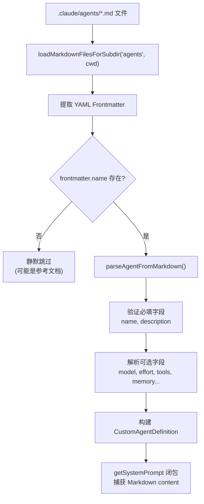
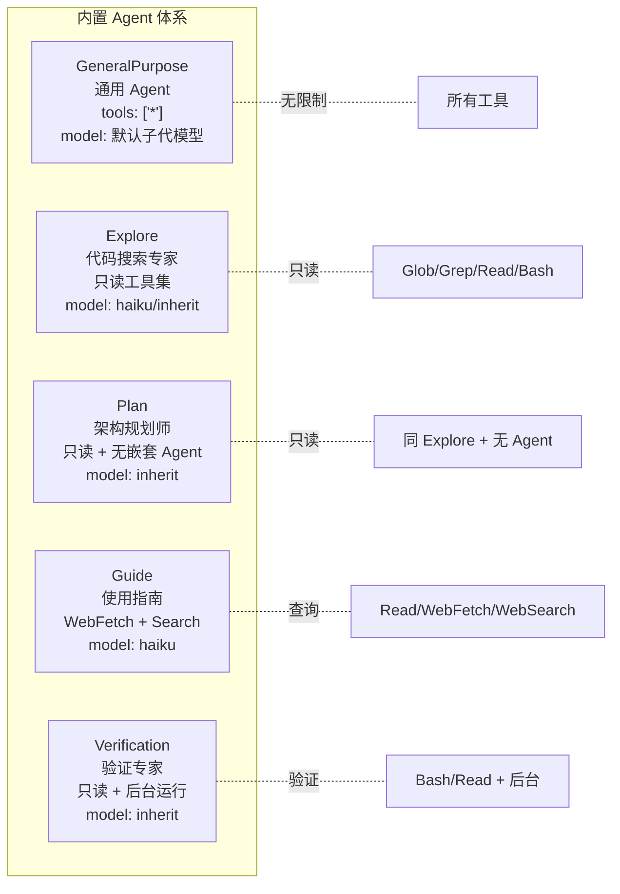
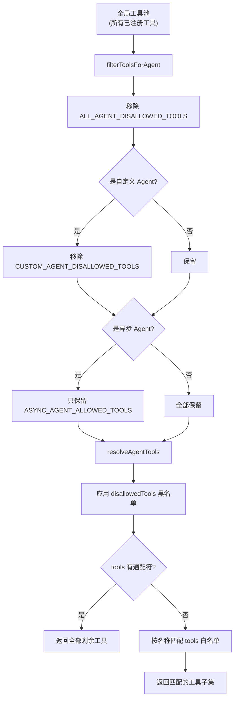
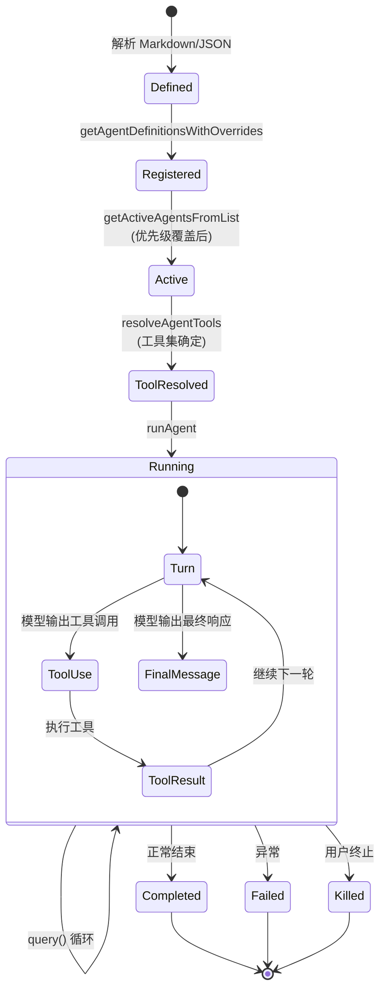

# 第 10 章：Agent 模型

> "任何足够复杂的 AI 系统都包含一个临时的、非正式指定的、充满 Bug 的、只实现了一半的 Agent 框架。"
> —— 改编自 Greenspun 第十定律

Claude Code 的 Agent 系统是整个架构中最具创新性的部分之一。它将"如何定义一个自治代理"这一抽象问题，转化为一个具体的工程实现：通过 Markdown frontmatter 声明式地定义 Agent 的元数据，通过 TypeScript 运行时对象驱动其执行。本章将深入分析这一模型的设计与实现。

## 10.1 Agent 的定义 —— 从 Markdown Frontmatter 到运行时对象

### 10.1.1 三源合一的类型体系

Claude Code 的 Agent 系统采用了一种优雅的类型层次结构。所有 Agent 共享一个基础类型 `BaseAgentDefinition`，然后通过联合类型（Union Type）分化为三种具体形态：

```typescript
// src/tools/AgentTool/loadAgentsDir.ts

export type BaseAgentDefinition = {
  agentType: string              // Agent 的唯一标识
  whenToUse: string              // 何时使用此 Agent 的描述
  tools?: string[]               // 允许使用的工具列表
  disallowedTools?: string[]     // 禁止使用的工具列表
  skills?: string[]              // 需预加载的 Skill 名称
  mcpServers?: AgentMcpServerSpec[]  // Agent 专属 MCP 服务器
  hooks?: HooksSettings          // 会话级钩子
  color?: AgentColorName         // UI 显示颜色
  model?: string                 // 模型选择
  effort?: EffortValue           // 推理努力级别
  permissionMode?: PermissionMode // 权限模式
  maxTurns?: number              // 最大交互轮次
  background?: boolean           // 是否作为后台任务运行
  memory?: AgentMemoryScope      // 持久化记忆范围
  isolation?: 'worktree' | 'remote' // 隔离模式
  omitClaudeMd?: boolean         // 是否省略 CLAUDE.md
  // ...更多字段
}

// 内置 Agent：动态系统提示词
export type BuiltInAgentDefinition = BaseAgentDefinition & {
  source: 'built-in'
  getSystemPrompt: (params: {
    toolUseContext: Pick<ToolUseContext, 'options'>
  }) => string
}

// 自定义 Agent：Markdown 文件定义
export type CustomAgentDefinition = BaseAgentDefinition & {
  getSystemPrompt: () => string
  source: SettingSource   // 'userSettings' | 'projectSettings' | 'policySettings'
}

// 插件 Agent：插件提供
export type PluginAgentDefinition = BaseAgentDefinition & {
  getSystemPrompt: () => string
  source: 'plugin'
  plugin: string
}

// 最终的联合类型
export type AgentDefinition =
  | BuiltInAgentDefinition
  | CustomAgentDefinition
  | PluginAgentDefinition
```

这个设计有几个值得注意的要点：

**第一，getSystemPrompt 是方法而非属性。** 内置 Agent 的 `getSystemPrompt` 接收 `toolUseContext` 参数，可以根据运行时环境动态生成系统提示词——例如 Claude Code Guide Agent 会根据当前配置的 MCP 服务器和自定义 Skill 来生成不同的提示词。自定义 Agent 的 `getSystemPrompt` 则是一个闭包，在加载时捕获 Markdown 内容和记忆配置。

**第二，source 字段实现了优先级覆盖。** `getActiveAgentsFromList` 函数按照 built-in → plugin → user → project → flag → managed 的顺序遍历所有 Agent，后加载的同名 Agent 会覆盖先加载的。这意味着项目级配置可以覆盖用户级配置，而组织策略可以覆盖一切：

```typescript
export function getActiveAgentsFromList(
  allAgents: AgentDefinition[],
): AgentDefinition[] {
  const agentGroups = [
    builtInAgents, pluginAgents, userAgents,
    projectAgents, flagAgents, managedAgents,
  ]
  const agentMap = new Map<string, AgentDefinition>()
  for (const agents of agentGroups) {
    for (const agent of agents) {
      agentMap.set(agent.agentType, agent) // 后者覆盖前者
    }
  }
  return Array.from(agentMap.values())
}
```

### 10.1.2 Markdown 解析流水线

自定义 Agent 的定义存储在 Markdown 文件中，使用 YAML frontmatter 声明元数据。解析流程如下：



`parseAgentFromMarkdown` 函数的核心逻辑展现了一种"宽进严出"的解析哲学——遇到无效值时记录日志但不中断，缺失可选字段时使用默认值：

```typescript
export function parseAgentFromMarkdown(
  filePath: string,
  baseDir: string,
  frontmatter: Record<string, unknown>,
  content: string,
  source: SettingSource,
): CustomAgentDefinition | null {
  const agentType = frontmatter['name']
  let whenToUse = frontmatter['description'] as string

  // 必填字段验证
  if (!agentType || typeof agentType !== 'string') return null
  if (!whenToUse || typeof whenToUse !== 'string') return null

  // 解析模型配置——支持 'inherit' 特殊值
  const modelRaw = frontmatter['model']
  let model: string | undefined
  if (typeof modelRaw === 'string' && modelRaw.trim().length > 0) {
    const trimmed = modelRaw.trim()
    model = trimmed.toLowerCase() === 'inherit' ? 'inherit' : trimmed
  }

  // 内存启用时自动注入文件读写工具
  let tools = parseAgentToolsFromFrontmatter(frontmatter['tools'])
  if (isAutoMemoryEnabled() && memory && tools !== undefined) {
    const toolSet = new Set(tools)
    for (const tool of [FILE_WRITE_TOOL_NAME, FILE_EDIT_TOOL_NAME, FILE_READ_TOOL_NAME]) {
      if (!toolSet.has(tool)) tools = [...tools, tool]
    }
  }

  // 系统提示词作为闭包：捕获 content 和 memory 配置
  const systemPrompt = content.trim()
  const agentDef: CustomAgentDefinition = {
    // ...
    getSystemPrompt: () => {
      if (isAutoMemoryEnabled() && memory) {
        return systemPrompt + '\n\n' + loadAgentMemoryPrompt(agentType, memory)
      }
      return systemPrompt
    },
    source,
    // ...所有解析出的可选字段
  }
  return agentDef
}
```

注意此处一个精巧的设计：当 Agent 启用了记忆功能时，系统提示词不是在解析阶段静态拼接的，而是通过闭包在每次调用 `getSystemPrompt()` 时动态加载最新的记忆内容。这确保了 Agent 每次运行时都能看到最新的持久化记忆。

### 10.1.3 JSON 格式解析

除了 Markdown 格式，系统还支持 JSON 格式的 Agent 定义，主要用于 Feature Flag 远程下发。JSON 解析通过 Zod schema 进行严格验证：

```typescript
const AgentJsonSchema = lazySchema(() =>
  z.object({
    description: z.string().min(1, 'Description cannot be empty'),
    tools: z.array(z.string()).optional(),
    disallowedTools: z.array(z.string()).optional(),
    prompt: z.string().min(1, 'Prompt cannot be empty'),
    model: z.string().trim().min(1).transform(
      m => (m.toLowerCase() === 'inherit' ? 'inherit' : m)
    ).optional(),
    effort: z.union([z.enum(EFFORT_LEVELS), z.number().int()]).optional(),
    permissionMode: z.enum(PERMISSION_MODES).optional(),
    mcpServers: z.array(AgentMcpServerSpecSchema()).optional(),
    hooks: HooksSchema().optional(),
    maxTurns: z.number().int().positive().optional(),
    // ...
  }),
)
```

`lazySchema` 包装器是一个值得注意的优化——它延迟 Zod schema 的构造，避免模块加载时的循环依赖问题（HooksSchema 依赖的类型链路会形成环）。

## 10.2 内置 Agent —— 五个专业化子系统

Claude Code 内置了若干 Agent，每个都针对特定场景进行了精心设计。通过 `getBuiltInAgents()` 函数可以看到它们的注册逻辑：

```typescript
// src/tools/AgentTool/builtInAgents.ts

export function getBuiltInAgents(): AgentDefinition[] {
  if (isEnvTruthy(process.env.CLAUDE_AGENT_SDK_DISABLE_BUILTIN_AGENTS)
      && getIsNonInteractiveSession()) {
    return []  // SDK 用户可以禁用所有内置 Agent
  }

  const agents: AgentDefinition[] = [
    GENERAL_PURPOSE_AGENT,   // 始终可用
    STATUSLINE_SETUP_AGENT,  // 始终可用
  ]

  if (areExplorePlanAgentsEnabled()) {
    agents.push(EXPLORE_AGENT, PLAN_AGENT)  // A/B 测试控制
  }

  if (isNonSdkEntrypoint) {
    agents.push(CLAUDE_CODE_GUIDE_AGENT)    // 非 SDK 入口才有
  }

  if (feature('VERIFICATION_AGENT') && growthbook flag) {
    agents.push(VERIFICATION_AGENT)          // Feature flag 控制
  }

  return agents
}
```



### 10.2.1 GeneralPurpose Agent —— 万能工兵

GeneralPurpose Agent 是最基础的 Agent 类型，也是默认选择。它的定义极为简洁：

```typescript
// src/tools/AgentTool/built-in/generalPurposeAgent.ts

export const GENERAL_PURPOSE_AGENT: BuiltInAgentDefinition = {
  agentType: 'general-purpose',
  whenToUse: 'General-purpose agent for researching complex questions, '
    + 'searching for code, and executing multi-step tasks...',
  tools: ['*'],           // 可使用所有工具
  source: 'built-in',
  baseDir: 'built-in',
  // model 故意省略——使用 getDefaultSubagentModel()
  getSystemPrompt: getGeneralPurposeSystemPrompt,
}
```

`tools: ['*']` 的通配符意味着该 Agent 继承父级所有可用工具（经过安全过滤后）。model 字段的刻意省略使其使用系统默认的子代模型，而非继承父级的模型——这是一个关键的成本优化决策。

### 10.2.2 Explore Agent —— 快速代码探索

Explore Agent 是一个专门优化过的只读搜索代理。其系统提示词中有一段关键指令：

```
NOTE: You are meant to be a fast agent that returns output as quickly as possible.
In order to achieve this you must:
- Make efficient use of the tools that you have at your disposal
- Wherever possible you should try to spawn multiple parallel tool calls
```

它通过 `disallowedTools` 显式禁止了写入类操作和递归 Agent 调用：

```typescript
export const EXPLORE_AGENT: BuiltInAgentDefinition = {
  agentType: 'Explore',
  disallowedTools: [
    AGENT_TOOL_NAME,           // 禁止嵌套 Agent
    EXIT_PLAN_MODE_TOOL_NAME,
    FILE_EDIT_TOOL_NAME,       // 禁止编辑
    FILE_WRITE_TOOL_NAME,      // 禁止写入
    NOTEBOOK_EDIT_TOOL_NAME,
  ],
  model: process.env.USER_TYPE === 'ant' ? 'inherit' : 'haiku',
  omitClaudeMd: true,  // 关键优化：不注入 CLAUDE.md
  // ...
}
```

`omitClaudeMd: true` 是一个重要的 token 节省优化。源码注释中记录了其原因：

> Dropping claudeMd here saves ~5-15 Gtok/week across 34M+ Explore spawns.

也就是说，Explore Agent 每周被调用超过 3400 万次。每次省略 CLAUDE.md 可以节省数十亿 token，这是一个通过数据驱动做出的工程决策。

### 10.2.3 Plan Agent —— 软件架构师

Plan Agent 继承了 Explore Agent 的工具集，同时添加了规划专用的系统提示词：

```typescript
export const PLAN_AGENT: BuiltInAgentDefinition = {
  agentType: 'Plan',
  disallowedTools: [
    AGENT_TOOL_NAME, EXIT_PLAN_MODE_TOOL_NAME,
    FILE_EDIT_TOOL_NAME, FILE_WRITE_TOOL_NAME, NOTEBOOK_EDIT_TOOL_NAME,
  ],
  tools: EXPLORE_AGENT.tools,   // 复用 Explore 的工具集
  model: 'inherit',              // 继承父级模型（需要强推理能力）
  omitClaudeMd: true,
  getSystemPrompt: () => getPlanV2SystemPrompt(),
}
```

Plan Agent 使用 `model: 'inherit'` 而非 Explore 的 haiku，因为规划任务需要更强的推理能力。其系统提示词要求输出结构化的实施方案，包含"Critical Files for Implementation"这样的固定格式。

### 10.2.4 Claude Code Guide Agent —— 动态知识助手

Guide Agent 是内置 Agent 中最特殊的一个——它的 `getSystemPrompt` 方法接收 `toolUseContext` 参数，在运行时动态构建提示词：

```typescript
export const CLAUDE_CODE_GUIDE_AGENT: BuiltInAgentDefinition = {
  agentType: 'claude-code-guide',
  tools: [GLOB_TOOL_NAME, GREP_TOOL_NAME, FILE_READ_TOOL_NAME,
          WEB_FETCH_TOOL_NAME, WEB_SEARCH_TOOL_NAME],
  model: 'haiku',
  permissionMode: 'dontAsk',  // 不需要用户确认权限
  getSystemPrompt({ toolUseContext }) {
    // 动态注入当前配置的 Skill、Agent、MCP 服务器信息
    const customCommands = commands.filter(cmd => cmd.type === 'prompt')
    const customAgents = toolUseContext.options.agentDefinitions
      .activeAgents.filter(a => a.source !== 'built-in')
    const mcpClients = toolUseContext.options.mcpClients
    // ...拼接为上下文信息
  },
}
```

这种动态提示词生成使得 Guide Agent 能够感知用户的个性化配置，提供真正针对性的帮助。

### 10.2.5 Verification Agent —— 对抗性验证者

Verification Agent 的设计哲学与其他 Agent 截然不同——它的核心使命是**试图打破**实现，而非确认其正确性。其系统提示词长达数百行，包含详细的验证策略矩阵：

```typescript
export const VERIFICATION_AGENT: BuiltInAgentDefinition = {
  agentType: 'verification',
  color: 'red',          // 红色标识——强调其对抗性质
  background: true,       // 始终在后台运行
  model: 'inherit',       // 需要强推理能力
  getSystemPrompt: () => VERIFICATION_SYSTEM_PROMPT,
  criticalSystemReminder_EXPERIMENTAL:
    'CRITICAL: This is a VERIFICATION-ONLY task. You CANNOT edit files...',
}
```

`criticalSystemReminder_EXPERIMENTAL` 是一个实验性字段，会在每个用户轮次重新注入，防止模型在长对话中"遗忘"其只读约束。`background: true` 确保验证不会阻塞主线程的交互。

Verification Agent 的系统提示词包含了自我反省机制，这在 AI Agent 设计中是罕见的：

```
=== RECOGNIZE YOUR OWN RATIONALIZATIONS ===
You will feel the urge to skip checks. These are the exact excuses you reach for:
- "The code looks correct based on my reading" — reading is not verification. Run it.
- "The implementer's tests already pass" — the implementer is an LLM. Verify independently.
- "This is probably fine" — probably is not verified. Run it.
```

## 10.3 自定义 Agent —— .claude/agents/ 目录结构

### 10.3.1 文件组织

自定义 Agent 存储在多层配置目录中，通过 `loadMarkdownFilesForSubdir('agents', cwd)` 统一加载：

```
~/.claude/agents/            # 用户级 Agent（所有项目可用）
  my-reviewer.md
  code-helper.md

<project>/.claude/agents/    # 项目级 Agent（仅当前项目可用）
  deploy-checker.md
  test-runner.md

<managed>/.claude/agents/    # 组织策略 Agent（管理员配置）
  security-auditor.md
```

### 10.3.2 Markdown 格式规范

一个完整的自定义 Agent 定义文件如下：

```markdown
---
name: code-reviewer
description: "审查代码变更并提供改进建议。当用户要求 review 代码或检查 PR 时使用。"
model: inherit
tools:
  - Glob
  - Grep
  - Read
  - Bash
disallowedTools:
  - Write
  - Edit
color: blue
effort: high
permissionMode: dontAsk
maxTurns: 50
memory: project
background: false
isolation: worktree
skills:
  - simplify
mcpServers:
  - github
  - name: custom-lint-server
    command: node
    args: ["/path/to/lint-server.js"]
hooks:
  PreToolUse:
    - matcher: Bash
      hooks:
        - type: command
          command: "echo 'Agent running Bash command'"
---

你是一个代码审查专家。你的职责是：

1. 仔细阅读提交的代码变更
2. 检查潜在的 Bug、安全隐患和性能问题
3. 评估代码风格与项目约定的一致性
4. 提出具体、可操作的改进建议

审查时遵循以下原则：
- 不要纠结于格式问题，关注逻辑正确性
- 提供修复建议时要包含代码示例
- 如果某个问题不确定，明确标注为"建议"而非"必须修复"
```

### 10.3.3 MCP 服务器规格

Agent 可以声明自己的 MCP 服务器依赖，支持两种形式：

```typescript
export type AgentMcpServerSpec =
  | string                              // 引用已有服务器名称
  | { [name: string]: McpServerConfig } // 内联定义新服务器

const AgentMcpServerSpecSchema = lazySchema(() =>
  z.union([
    z.string(),
    z.record(z.string(), McpServerConfigSchema()),
  ]),
)
```

在 `runAgent` 的 `initializeAgentMcpServers` 函数中，引用型和内联型有不同的生命周期管理：引用型使用 memoized 的共享连接，内联型创建独立连接并在 Agent 结束时清理。

## 10.4 Agent 的工具集 —— resolveAgentTools 的筛选逻辑

Agent 的工具集经过多层过滤，从全局工具池逐步收窄到 Agent 实际可用的工具子集。

### 10.4.1 基础过滤层

`filterToolsForAgent` 实现了第一层过滤，根据 Agent 的类型和运行模式裁剪工具：

```typescript
// src/tools/AgentTool/agentToolUtils.ts

export function filterToolsForAgent({
  tools, isBuiltIn, isAsync = false, permissionMode,
}: { tools: Tools; isBuiltIn: boolean; isAsync?: boolean;
     permissionMode?: PermissionMode }): Tools {
  return tools.filter(tool => {
    // MCP 工具始终放行
    if (tool.name.startsWith('mcp__')) return true

    // Plan 模式特殊放行 ExitPlanMode
    if (toolMatchesName(tool, EXIT_PLAN_MODE_V2_TOOL_NAME)
        && permissionMode === 'plan') return true

    // 全局禁止列表（如 TodoWrite、某些内部工具）
    if (ALL_AGENT_DISALLOWED_TOOLS.has(tool.name)) return false

    // 自定义 Agent 额外禁止列表
    if (!isBuiltIn && CUSTOM_AGENT_DISALLOWED_TOOLS.has(tool.name)) return false

    // 异步 Agent 只能使用白名单工具
    if (isAsync && !ASYNC_AGENT_ALLOWED_TOOLS.has(tool.name)) {
      // 特例：进程内队友可以使用 Agent 工具（spawn 同步子代）
      if (isAgentSwarmsEnabled() && isInProcessTeammate()) {
        if (toolMatchesName(tool, AGENT_TOOL_NAME)) return true
        if (IN_PROCESS_TEAMMATE_ALLOWED_TOOLS.has(tool.name)) return true
      }
      return false
    }
    return true
  })
}
```

这段代码揭示了几个安全设计原则：

1. **MCP 工具总是可用**——因为 MCP 工具已经通过独立的信任链验证
2. **自定义 Agent 比内置 Agent 受到更严格限制**——防止用户定义的 Agent 访问敏感内部工具
3. **异步 Agent 使用白名单模式**——默认拒绝，只允许经过审查的工具

### 10.4.2 精细化解析层

`resolveAgentTools` 在基础过滤之上，处理 Agent 定义中的 `tools` 和 `disallowedTools` 声明：

```typescript
export function resolveAgentTools(
  agentDefinition: Pick<AgentDefinition, 'tools' | 'disallowedTools' | ...>,
  availableTools: Tools,
  isAsync = false,
  isMainThread = false,
): ResolvedAgentTools {
  // 主线程跳过 filterToolsForAgent——工具池已由 useMergedTools() 正确组装
  const filteredAvailableTools = isMainThread
    ? availableTools
    : filterToolsForAgent({ tools: availableTools, isBuiltIn, isAsync, permissionMode })

  // 应用 disallowedTools 黑名单
  const disallowedToolSet = new Set(disallowedTools?.map(/* ... */))
  const allowedAvailableTools = filteredAvailableTools.filter(
    tool => !disallowedToolSet.has(tool.name)
  )

  // 通配符展开：tools 为 undefined 或 ['*'] 时返回全部工具
  const hasWildcard = agentTools === undefined
    || (agentTools.length === 1 && agentTools[0] === '*')
  if (hasWildcard) {
    return { hasWildcard: true, resolvedTools: allowedAvailableTools, ... }
  }

  // 逐个解析工具名称，收集有效/无效列表
  for (const toolSpec of agentTools) {
    const { toolName, ruleContent } = permissionRuleValueFromString(toolSpec)
    // Agent 工具的特殊处理：提取 allowedAgentTypes
    if (toolName === AGENT_TOOL_NAME && ruleContent) {
      allowedAgentTypes = ruleContent.split(',').map(s => s.trim())
    }
    const tool = availableToolMap.get(toolName)
    if (tool) { validTools.push(toolSpec); resolved.push(tool) }
    else { invalidTools.push(toolSpec) }
  }

  return { hasWildcard: false, validTools, invalidTools, resolvedTools: resolved,
           allowedAgentTypes }
}
```



注意 `Agent(worker, researcher)` 这种语法——它允许通过工具规格字符串限制 Agent 可以调用的子代类型，实现了一种细粒度的递归控制。

## 10.5 Agent 的 Token 预算与模型选择

### 10.5.1 模型解析策略

Agent 的模型选择是一个多层回退的过程，由 `getAgentModel` 函数实现：

```typescript
// src/utils/model/agent.ts (概念简化)

export function getAgentModel(
  agentModel: string | undefined,      // Agent 定义的 model 字段
  mainLoopModel: string,               // 父级主循环模型
  overrideModel: ModelAlias | undefined, // 调用时的覆盖
  permissionMode: PermissionMode,
): string {
  // 1. 调用时覆盖 > Agent 定义 > 默认子代模型
  // 2. 'inherit' 特殊值：使用父级模型
  // 3. GrowthBook feature flag 可以覆盖特定 Agent 类型的模型
}
```

不同 Agent 的模型策略体现了明确的成本-质量权衡：

| Agent | model 配置 | 实际效果 | 设计考量 |
|-------|-----------|---------|---------|
| GeneralPurpose | 省略 | 默认子代模型（较便宜） | 通用任务不需要最强模型 |
| Explore | `'haiku'` (外部) / `'inherit'` (内部) | 最快最便宜 / A/B 测试 | 搜索场景追求速度 |
| Plan | `'inherit'` | 与父级相同 | 规划需要强推理能力 |
| Guide | `'haiku'` | 最便宜 | 文档查询不需要强模型 |
| Verification | `'inherit'` | 与父级相同 | 验证需要理解复杂代码 |
| Fork | `'inherit'` | 与父级相同 | 缓存共享要求模型一致 |

### 10.5.2 Token 预算控制

Agent 的 token 使用受多个维度约束：

1. **maxTurns**：限制 Agent 的最大交互轮次，防止无限循环。`FORK_AGENT` 的默认值是 200 轮，而自定义 Agent 可以通过 frontmatter 设置。

2. **effort**：影响模型的推理深度，支持字符串级别（`'low'`, `'medium'`, `'high'`）和整数值，通过 `parseEffortValue` 统一解析。

3. **omitClaudeMd**：对于只读 Agent（Explore、Plan），省略 CLAUDE.md 可以显著降低 token 消耗。源码注释量化了这一优化的效果——每周节省数十亿 token。

4. **prompt cache sharing**：Fork Agent 特别设计了 `useExactTools: true` 和 `model: 'inherit'`，确保子代的 API 请求前缀与父代字节完全一致，从而最大化 prompt cache 命中率。这是一个高度工程化的优化——FORK_AGENT 的注释中写道：

> Reconstructing by re-calling getSystemPrompt() can diverge (GrowthBook cold->warm) and bust the prompt cache; threading the rendered bytes is byte-exact.

### 10.5.3 Agent 生命周期状态图



## 10.6 本章小结

Claude Code 的 Agent 模型展现了一种"配置即代码"的设计哲学。通过 Markdown frontmatter 声明式定义和 TypeScript 类型系统的严格约束，它在灵活性和安全性之间找到了精妙的平衡：

1. **声明式定义**：用户通过简单的 Markdown 文件即可创建功能完备的 Agent，降低了定制门槛。
2. **类型安全**：`AgentDefinition` 联合类型和 Zod schema 验证确保运行时不会出现非法配置。
3. **多层工具过滤**：从全局禁止列表到 Agent 级白名单/黑名单，形成了纵深防御。
4. **数据驱动优化**：`omitClaudeMd`、prompt cache sharing 等优化都基于真实的 fleet 数据——每周 3400 万次 Explore 调用。
5. **可覆盖的优先级链**：built-in → plugin → user → project → flag → managed 的覆盖链，使得组织策略能够安全地控制 Agent 行为。

下一章我们将深入 Agent 的运行时——如何 fork 子代、如何恢复中断的会话、如何在多个 Agent 之间协调。
