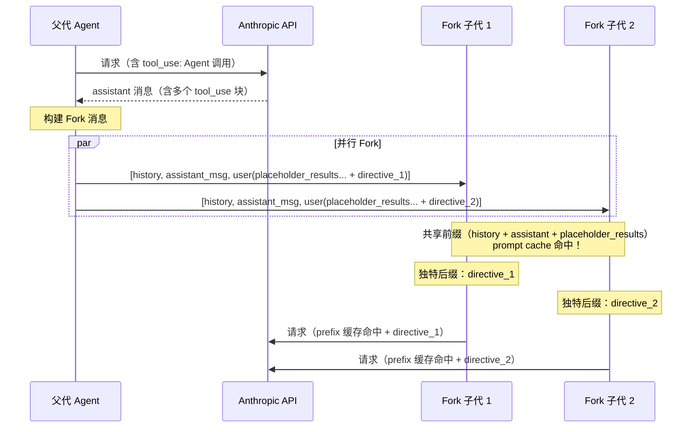
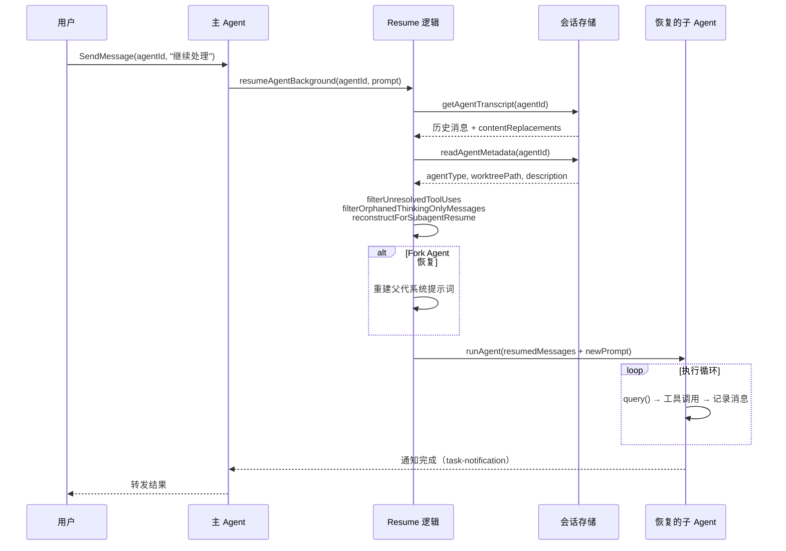
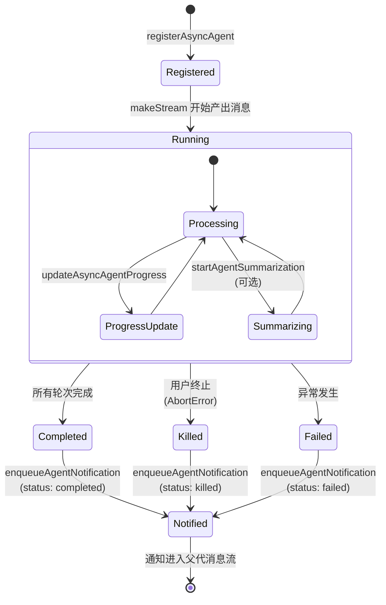
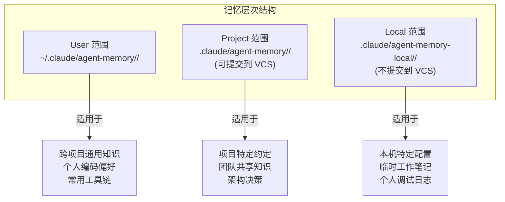
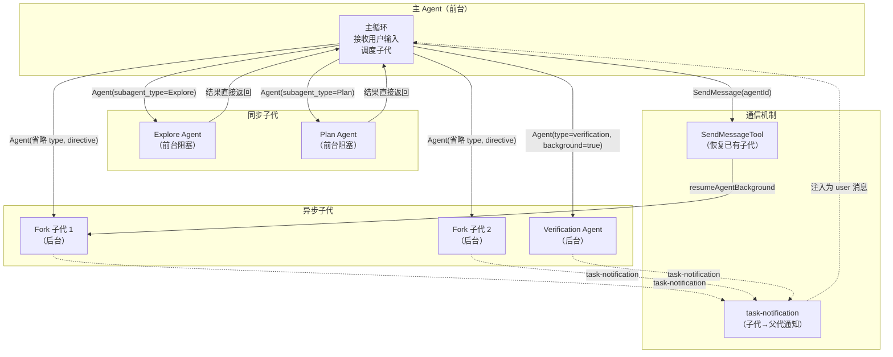

# 第 11 章：子 Agent 编排

> "并发不是并行。并发是关于如何组织你的代码；并行是关于如何执行它。"
> —— Rob Pike

如果说上一章描述了 Agent 的"静态定义"，那么本章将进入 Agent 的"动态世界"——当一个 Agent 被实际启动时，系统如何克隆上下文、如何隔离状态、如何在后台运行、如何从中断处恢复、如何在多个 Agent 之间传递信息。这些机制共同构成了 Claude Code 的子 Agent 编排层（Sub-Agent Orchestration Layer）。

## 11.1 Fork 机制 —— 上下文克隆与隔离

### 11.1.1 Fork 的哲学

Fork 是 Claude Code 中最优雅的子代生成机制。受 Unix `fork()` 系统调用的启发，它创建一个继承父代完整对话上下文的子 Agent，但运行在独立的执行空间中。与传统的子代 Agent（通过 `subagent_type` 指定类型、从空白上下文开始）不同，Fork 子代从诞生那一刻起就"知道"父代所有的对话历史。

`forkSubagent.ts` 中的 Feature Gate 函数定义了 Fork 机制的启用条件：

```typescript
// src/tools/AgentTool/forkSubagent.ts

export function isForkSubagentEnabled(): boolean {
  if (feature('FORK_SUBAGENT')) {
    if (isCoordinatorMode()) return false   // 与 Coordinator 模式互斥
    if (getIsNonInteractiveSession()) return false  // SDK 模式不支持
    return true
  }
  return false
}
```

Fork 与 Coordinator 模式互斥——这是一个架构约束而非实现限制。Coordinator 已经拥有自己的委派模型（Worker Agent），让 Fork 同时存在会导致编排语义冲突。

### 11.1.2 Fork Agent 的定义

Fork Agent 不通过 `builtInAgents.ts` 注册（它不在 `getBuiltInAgents()` 的返回列表中），只在用户省略 `subagent_type` 参数时隐式触发：

```typescript
export const FORK_AGENT = {
  agentType: FORK_SUBAGENT_TYPE,  // 'fork'
  whenToUse: 'Implicit fork — inherits full conversation context...',
  tools: ['*'],
  maxTurns: 200,
  model: 'inherit',           // 必须与父代一致以共享 prompt cache
  permissionMode: 'bubble',    // 权限提示冒泡到父代终端
  source: 'built-in',
  baseDir: 'built-in',
  getSystemPrompt: () => '',   // 不使用——Fork 直接传递父代的已渲染系统提示词
} satisfies BuiltInAgentDefinition
```

三个关键设计选择值得深入分析：

1. **`model: 'inherit'`**：Fork 必须使用与父代相同的模型。原因是 Anthropic API 的 prompt cache key 包含模型标识——不同模型无法共享缓存，Fork 的核心优势就会丧失。

2. **`getSystemPrompt: () => ''`**：这个空函数看似是 Bug，实际是刻意为之。Fork 的系统提示词通过 `override.systemPrompt` 传递父代已渲染的系统提示词字节流，而非重新调用 `getSystemPrompt()` 重建。源码注释中解释：GrowthBook feature flag 的冷启动/热启动状态可能导致 `getSystemPrompt()` 产生不同输出，破坏 prompt cache。

3. **`permissionMode: 'bubble'`**：Fork 子代的权限请求会"冒泡"到父代的终端界面，而非在后台默默失败。

### 11.1.3 构建 Fork 消息

`buildForkedMessages` 是 Fork 机制中最精妙的函数。它构建子代的初始对话消息，同时确保所有 Fork 子代共享字节完全一致的 API 请求前缀：

```typescript
export function buildForkedMessages(
  directive: string,
  assistantMessage: AssistantMessage,
): MessageType[] {
  // 1. 克隆父代的 assistant 消息（保留所有 thinking/text/tool_use 块）
  const fullAssistantMessage: AssistantMessage = {
    ...assistantMessage,
    uuid: randomUUID(),
    message: { ...assistantMessage.message,
               content: [...assistantMessage.message.content] },
  }

  // 2. 收集所有 tool_use 块
  const toolUseBlocks = assistantMessage.message.content.filter(
    (block): block is BetaToolUseBlock => block.type === 'tool_use',
  )

  // 3. 为每个 tool_use 构建占位 tool_result——所有子代使用完全相同的文本
  const toolResultBlocks = toolUseBlocks.map(block => ({
    type: 'tool_result' as const,
    tool_use_id: block.id,
    content: [{
      type: 'text' as const,
      text: 'Fork started — processing in background',  // 固定文本！
    }],
  }))

  // 4. 构建用户消息：占位 tool_results + 独特的 directive
  const toolResultMessage = createUserMessage({
    content: [
      ...toolResultBlocks,          // 所有子代共享
      { type: 'text' as const,
        text: buildChildMessage(directive) }, // 每个子代独特
    ],
  })

  return [fullAssistantMessage, toolResultMessage]
}
```



这个设计的精妙之处在于：`FORK_PLACEHOLDER_RESULT`（`'Fork started — processing in background'`）是一个常量，所有 Fork 子代的 tool_result 部分都完全一致。唯一不同的是最后追加的 directive 文本块。这使得：

- 第一个 Fork 子代的请求创建 prompt cache
- 后续 Fork 子代的请求命中缓存（差异只在最后几十个 token）
- 极大降低了并行 Fork 的 API 成本

### 11.1.4 Fork 子代的指令模板

`buildChildMessage` 构建了一个严格的指令框架，防止 Fork 子代偏离预期行为：

```typescript
export function buildChildMessage(directive: string): string {
  return `<fork-boilerplate>
STOP. READ THIS FIRST.

You are a forked worker process. You are NOT the main agent.

RULES (non-negotiable):
1. Your system prompt says "default to forking." IGNORE IT — that's for the parent.
   You ARE the fork. Do NOT spawn sub-agents; execute directly.
2. Do NOT converse, ask questions, or suggest next steps
3. Do NOT editorialize or add meta-commentary
4. USE your tools directly: Bash, Read, Write, etc.
5. If you modify files, commit your changes before reporting.
6. Do NOT emit text between tool calls. Use tools silently, then report once at the end.
7. Stay strictly within your directive's scope.
8. Keep your report under 500 words.
9. Your response MUST begin with "Scope:".
10. REPORT structured facts, then stop

Output format:
  Scope: <echo back your assigned scope>
  Result: <key findings>
  Key files: <relevant file paths>
  Files changed: <list with commit hash>
  Issues: <list if any>
</fork-boilerplate>

<fork-directive>${directive}`
}
```

规则 1 特别值得注意——它解决了递归 Fork 问题。由于 Fork 子代继承了父代的完整系统提示词（其中可能包含"遇到复杂任务时 Fork 子代"的指令），如果不显式禁止，子代可能会无限递归 Fork。`isInForkChild` 函数通过检查对话历史中是否存在 `<fork-boilerplate>` 标签来防御这一情况：

```typescript
export function isInForkChild(messages: MessageType[]): boolean {
  return messages.some(m => {
    if (m.type !== 'user') return false
    return m.message.content.some(
      block => block.type === 'text'
        && block.text.includes(`<${FORK_BOILERPLATE_TAG}>`)
    )
  })
}
```

### 11.1.5 工作树隔离

当 Fork 子代需要修改文件时，可以在隔离的 Git worktree 中运行。`buildWorktreeNotice` 函数生成上下文切换说明：

```typescript
export function buildWorktreeNotice(
  parentCwd: string, worktreeCwd: string,
): string {
  return `You've inherited the conversation context above from a parent agent
working in ${parentCwd}. You are operating in an isolated git worktree at
${worktreeCwd} — same repository, same relative file structure, separate
working copy. Paths in the inherited context refer to the parent's working
directory; translate them to your worktree root. Re-read files before editing
if the parent may have modified them since they appear in the context.
Your changes stay in this worktree and will not affect the parent's files.`
}
```

## 11.2 Resume 机制 —— 状态恢复与续航

### 11.2.1 为什么需要 Resume

Agent 可能因多种原因需要恢复执行：用户主动发送后续消息（通过 `SendMessageTool`）、Agent 被暂时挂起后重新激活、或系统重启后恢复之前的任务。`resumeAgent.ts` 实现了这一机制。

### 11.2.2 恢复流程详解

```typescript
// src/tools/AgentTool/resumeAgent.ts

export async function resumeAgentBackground({
  agentId, prompt, toolUseContext, canUseTool, invokingRequestId,
}: { ... }): Promise<ResumeAgentResult> {
  // 1. 加载持久化的对话转录和元数据
  const [transcript, meta] = await Promise.all([
    getAgentTranscript(asAgentId(agentId)),
    readAgentMetadata(asAgentId(agentId)),
  ])
  if (!transcript) throw new Error(`No transcript found for agent ID: ${agentId}`)

  // 2. 清洗恢复的消息——去除不完整的工具调用
  const resumedMessages = filterWhitespaceOnlyAssistantMessages(
    filterOrphanedThinkingOnlyMessages(
      filterUnresolvedToolUses(transcript.messages),
    ),
  )

  // 3. 重建 content replacement state（prompt cache 稳定性）
  const resumedReplacementState = reconstructForSubagentResume(
    toolUseContext.contentReplacementState,
    resumedMessages,
    transcript.contentReplacements,
  )

  // 4. 检查 worktree 是否仍然存在
  const resumedWorktreePath = meta?.worktreePath
    ? await fsp.stat(meta.worktreePath).then(
        s => s.isDirectory() ? meta.worktreePath : undefined,
        () => undefined,  // worktree 已被删除，回退到父级 cwd
      )
    : undefined

  // 5. 识别 Agent 类型——Fork 需要特殊处理
  let selectedAgent: AgentDefinition
  if (meta?.agentType === FORK_AGENT.agentType) {
    selectedAgent = FORK_AGENT
    isResumedFork = true
  } else if (meta?.agentType) {
    const found = toolUseContext.options.agentDefinitions
      .activeAgents.find(a => a.agentType === meta.agentType)
    selectedAgent = found ?? GENERAL_PURPOSE_AGENT  // 类型找不到时回退
  } else {
    selectedAgent = GENERAL_PURPOSE_AGENT
  }

  // 6. 对于 Fork 恢复，必须重建父代的系统提示词
  if (isResumedFork) {
    if (toolUseContext.renderedSystemPrompt) {
      forkParentSystemPrompt = toolUseContext.renderedSystemPrompt
    } else {
      // 重新构建系统提示词（最后手段）
      const defaultSystemPrompt = await getSystemPrompt(...)
      forkParentSystemPrompt = buildEffectiveSystemPrompt({...})
    }
  }

  // 7. 注册后台任务并启动
  const agentBackgroundTask = registerAsyncAgent({
    agentId, description: uiDescription, prompt,
    selectedAgent, setAppState: rootSetAppState, toolUseId,
  })

  // 8. 在恢复的 worktree 上下文中运行
  void runWithAgentContext(asyncAgentContext, () =>
    wrapWithCwd(() =>
      runAsyncAgentLifecycle({ /* ... */ })
    ),
  )

  return { agentId, description: uiDescription, outputFile }
}
```



### 11.2.3 Sidechain 记录

每个子 Agent 的对话转录都作为"侧链"（sidechain）独立于主对话记录。这是通过 `recordSidechainTranscript` 函数实现的：

```typescript
// runAgent.ts 中的消息记录逻辑
for await (const msg of query({ ... })) {
  if (isRecordableMessage(msg)) {
    agentMessages.push(msg)
    // 异步写入侧链转录——不阻塞主循环
    void recordSidechainTranscript([msg], agentId, lastRecordedUuid)
    lastRecordedUuid = msg.uuid
  }
  yield msg
}
```

Sidechain 设计允许 Resume 操作精确恢复子代的完整对话状态，而不会污染主对话流。

### 11.2.4 消息清洗的三道过滤

恢复时的消息清洗（message hygiene）是一个细致的工程问题。三个过滤器按顺序应用：

1. **`filterUnresolvedToolUses`**：移除没有对应 `tool_result` 的 `tool_use` 块。如果 Agent 在工具执行中间被中断，这些"悬空"的工具调用必须被清理，否则 API 会返回 400 错误。

2. **`filterOrphanedThinkingOnlyMessages`**：移除只包含 thinking 内容块的 assistant 消息。这些消息可能在模型被中断时产生——模型开始"思考"但尚未输出任何实际内容。

3. **`filterWhitespaceOnlyAssistantMessages`**：移除只包含空白文本的 assistant 消息。

这三道过滤确保恢复的对话是 API 可接受的合法序列。

## 11.3 后台任务 —— LocalAgentTask 与 RemoteAgentTask

### 11.3.1 任务注册与生命周期

当 Agent 以异步模式运行时，它被注册为一个后台任务：

```typescript
// agentToolUtils.ts 中的生命周期管理

export async function runAsyncAgentLifecycle({
  taskId, abortController, makeStream, metadata,
  description, toolUseContext, rootSetAppState, ...
}: { ... }): Promise<void> {
  const tracker = createProgressTracker()
  const resolveActivity = createActivityDescriptionResolver(
    toolUseContext.options.tools)

  try {
    // 可选：启动定期摘要生成
    const onCacheSafeParams = enableSummarization
      ? (params: CacheSafeParams) => {
          const { stop } = startAgentSummarization(
            taskId, asAgentId(taskId), params, rootSetAppState)
          stopSummarization = stop
        }
      : undefined

    // 消费 Agent 的消息流
    for await (const message of makeStream(onCacheSafeParams)) {
      agentMessages.push(message)

      // 实时更新 AppState 中的任务进度
      rootSetAppState(prev => {
        const t = prev.tasks[taskId]
        if (!isLocalAgentTask(t) || !t.retain) return prev
        return { ...prev, tasks: { ...prev.tasks,
          [taskId]: { ...t, messages: [...(t.messages ?? []), message] } } }
      })

      // 更新进度追踪器
      updateProgressFromMessage(tracker, message, resolveActivity, tools)
      updateAsyncAgentProgress(taskId, getProgressUpdate(tracker), rootSetAppState)
    }

    // 正常完成
    const agentResult = finalizeAgentTool(agentMessages, taskId, metadata)
    completeAsyncAgent(agentResult, rootSetAppState)

    // 可选：安全分类器审查子代输出
    const handoffWarning = await classifyHandoffIfNeeded({ agentMessages, ... })

    // 发送完成通知
    enqueueAgentNotification({
      taskId, description, status: 'completed',
      finalMessage, usage: { totalTokens, toolUses, durationMs },
    })
  } catch (error) {
    if (error instanceof AbortError) {
      // 用户主动终止
      killAsyncAgent(taskId, rootSetAppState)
      enqueueAgentNotification({ status: 'killed', ... })
    } else {
      // 异常失败
      failAsyncAgent(taskId, msg, rootSetAppState)
      enqueueAgentNotification({ status: 'failed', error: msg, ... })
    }
  } finally {
    clearInvokedSkillsForAgent(agentIdForCleanup)
    clearDumpState(agentIdForCleanup)
  }
}
```

### 11.3.2 任务状态模型



### 11.3.3 Handoff 分类器

当子 Agent 完成并将控制权交还父代时，一个可选的"Handoff 分类器"会审查子代的所有动作：

```typescript
export async function classifyHandoffIfNeeded({
  agentMessages, tools, toolPermissionContext,
  abortSignal, subagentType, totalToolUseCount,
}: { ... }): Promise<string | null> {
  if (feature('TRANSCRIPT_CLASSIFIER')) {
    if (toolPermissionContext.mode !== 'auto') return null

    const agentTranscript = buildTranscriptForClassifier(agentMessages, tools)
    const classifierResult = await classifyYoloAction(
      agentMessages,
      { role: 'user', content: [{
        type: 'text',
        text: "Sub-agent has finished and is handing back control. Review..."
      }] },
      tools, toolPermissionContext, abortSignal,
    )

    if (classifierResult.shouldBlock) {
      return `SECURITY WARNING: This sub-agent performed actions that may
violate security policy. Reason: ${classifierResult.reason}.`
    }
  }
  return null
}
```

这是一种"信任但验证"的安全模型——子 Agent 在执行时不受阻碍（避免交互延迟），但其输出在交回前经过独立审查。

## 11.4 Agent 记忆 —— agentMemory.ts 快照与持久化

### 11.4.1 三级记忆范围

Agent 的持久化记忆（Persistent Memory）是 Agent 系统中最具前瞻性的设计之一。它允许 Agent 跨会话保留学到的知识，分为三个范围：

```typescript
// src/tools/AgentTool/agentMemory.ts

export type AgentMemoryScope = 'user' | 'project' | 'local'

export function getAgentMemoryDir(
  agentType: string, scope: AgentMemoryScope,
): string {
  const dirName = sanitizeAgentTypeForPath(agentType)
  switch (scope) {
    case 'project':
      return join(getCwd(), '.claude', 'agent-memory', dirName) + sep
    case 'local':
      return getLocalAgentMemoryDir(dirName)  // 支持远程目录
    case 'user':
      return join(getMemoryBaseDir(), 'agent-memory', dirName) + sep
  }
}
```



每种范围的适用场景不同，Agent 定义通过 `memory` 字段声明其记忆类型。当记忆被启用时，两件事会自动发生：

1. **工具注入**：如果 Agent 定义了 `tools` 白名单，系统会自动注入 `Write`、`Edit`、`Read` 工具，确保 Agent 有能力读写记忆文件。

2. **提示词增强**：`getSystemPrompt` 闭包会在运行时拼接记忆提示词。

### 11.4.2 记忆提示词构建

```typescript
export function loadAgentMemoryPrompt(
  agentType: string, scope: AgentMemoryScope,
): string {
  let scopeNote: string
  switch (scope) {
    case 'user':
      scopeNote = '- Since this memory is user-scope, keep learnings general'
      break
    case 'project':
      scopeNote = '- Since this memory is project-scope and shared with your team'
      break
    case 'local':
      scopeNote = '- Since this memory is local-scope (not checked into VCS)'
      break
  }

  const memoryDir = getAgentMemoryDir(agentType, scope)
  void ensureMemoryDirExists(memoryDir)  // Fire-and-forget

  return buildMemoryPrompt({
    displayName: 'Persistent Agent Memory',
    memoryDir,
    extraGuidelines: [scopeNote],
  })
}
```

注意 `ensureMemoryDirExists` 的 fire-and-forget 模式：它在同步的 `getSystemPrompt` 回调中被调用（React 渲染期间），因此不能 await。但这是安全的——Agent 在第一次 API 往返后才会尝试写入，此时目录早已创建完毕。即使竞态发生，`FileWriteTool` 也会自行创建父目录。

### 11.4.3 快照机制

Agent 记忆支持项目级快照（snapshot），允许团队共享记忆的初始状态：

```typescript
// src/tools/AgentTool/agentMemorySnapshot.ts

export async function checkAgentMemorySnapshot(
  agentType: string, scope: AgentMemoryScope,
): Promise<{ action: 'none' | 'initialize' | 'prompt-update';
             snapshotTimestamp?: string }> {
  // 读取项目级快照元数据
  const snapshotMeta = await readJsonFile(
    getSnapshotJsonPath(agentType), snapshotMetaSchema())
  if (!snapshotMeta) return { action: 'none' }

  // 检查本地是否已有记忆
  let hasLocalMemory = false
  try {
    const dirents = await readdir(localMemDir, { withFileTypes: true })
    hasLocalMemory = dirents.some(d => d.isFile() && d.name.endsWith('.md'))
  } catch { /* 目录不存在 */ }

  // 首次初始化：从快照复制
  if (!hasLocalMemory) {
    return { action: 'initialize', snapshotTimestamp: snapshotMeta.updatedAt }
  }

  // 检查是否有更新的快照
  const syncedMeta = await readJsonFile(getSyncedJsonPath(...), syncedMetaSchema())
  if (!syncedMeta || new Date(snapshotMeta.updatedAt) > new Date(syncedMeta.syncedFrom)) {
    return { action: 'prompt-update', snapshotTimestamp: snapshotMeta.updatedAt }
  }

  return { action: 'none' }
}
```

快照流程的三种结果：

| 结果 | 条件 | 动作 |
|------|------|------|
| `none` | 没有快照或已同步 | 无需操作 |
| `initialize` | 有快照但本地无记忆 | 复制快照文件到本地 |
| `prompt-update` | 快照比本地同步版本新 | 在 Agent 定义上标记待更新 |

`initializeFromSnapshot` 执行实际的文件复制：

```typescript
export async function initializeFromSnapshot(
  agentType: string, scope: AgentMemoryScope, snapshotTimestamp: string,
): Promise<void> {
  await copySnapshotToLocal(agentType, scope)
  await saveSyncedMeta(agentType, scope, snapshotTimestamp)
}
```

## 11.5 Agent 间通信 —— SendMessageTool 的设计

### 11.5.1 通信模型

Claude Code 的 Agent 间通信采用异步消息传递模型。父代通过 `SendMessageTool` 向已有的子代发送后续指令，子代通过 `task-notification` 机制向父代报告结果。

`SendMessageTool` 的典型使用场景：

1. 用户想要继续一个之前的研究子代的工作
2. 父代需要向运行中的后台 Agent 发送额外上下文
3. Claude Code Guide Agent 被反复查询不同问题（避免每次重新启动）

从 `prompt.ts` 中可以看到 Agent 工具的提示词对此有明确指导：

```
- To continue a previously spawned agent, use SendMessage with the agent's
  ID or name as the `to` field. The agent resumes with its full context
  preserved. Each fresh Agent invocation with a subagent_type starts
  without context — provide a complete task description.
```

### 11.5.2 多 Agent 编排架构



### 11.5.3 createSubagentContext —— 上下文隔离的核心

无论是 Fork、Resume 还是 Skill 执行，所有子代 Agent 都通过 `createSubagentContext` 获得隔离的执行上下文：

```typescript
// src/utils/forkedAgent.ts

export function createSubagentContext(
  parentContext: ToolUseContext,
  overrides?: SubagentContextOverrides,
): ToolUseContext {
  // 1. AbortController：显式覆盖 > 共享父代的 > 创建子级的
  const abortController = overrides?.abortController
    ?? (overrides?.shareAbortController
      ? parentContext.abortController
      : createChildAbortController(parentContext.abortController))

  // 2. getAppState：非共享模式下自动设置 shouldAvoidPermissionPrompts
  const getAppState = overrides?.getAppState
    ? overrides.getAppState
    : overrides?.shareAbortController
      ? parentContext.getAppState  // 交互式子代共享 UI
      : () => ({
          ...parentContext.getAppState(),
          toolPermissionContext: {
            ...parentContext.getAppState().toolPermissionContext,
            shouldAvoidPermissionPrompts: true,  // 后台子代不弹权限确认
          },
        })

  // 3. 独立的文件状态缓存（Fork 复制，新建清空）
  // 4. 独立的内容替换状态
  // 5. 独立的拒绝追踪状态
  // ...
}
```

`createSubagentContext` 的设计遵循"默认隔离、显式共享"原则：

- **默认隔离**：AbortController、文件状态缓存、内容替换状态都是独立副本
- **显式共享**：通过 `shareAbortController`、`shareSetAppState` 等选项明确声明共享需求
- **安全降级**：非交互式子代自动禁用权限提示，避免后台 Agent 阻塞等待用户输入

## 11.6 本章小结

Claude Code 的子 Agent 编排层展现了一个经过深思熟虑的并发执行框架：

1. **Fork 机制**通过字节精确的消息构建实现了极高的 prompt cache 命中率，使并行 Fork 的成本仅为单次调用的边际增量。

2. **Resume 机制**通过三道消息清洗过滤器和 sidechain 转录存储，实现了可靠的状态恢复——即使 Agent 在工具执行中途被中断。

3. **后台任务管理**通过 `runAsyncAgentLifecycle` 统一了任务注册、进度追踪、摘要生成、异常处理和通知发送的完整生命周期。

4. **Agent 记忆**通过三级范围（user/project/local）和快照同步机制，使 Agent 能够跨会话积累知识。

5. **上下文隔离**通过 `createSubagentContext` 的"默认隔离、显式共享"原则，在安全性和灵活性之间取得平衡。

这些机制共同构成了一个可扩展的多 Agent 运行时——从简单的单次搜索到数十个并行 Fork 的大规模批处理，系统都能可靠地编排执行。下一章我们将转向 Skill 系统——一种更高层次的抽象，它将 Agent 和 Prompt 模板封装为可复用的能力单元。
