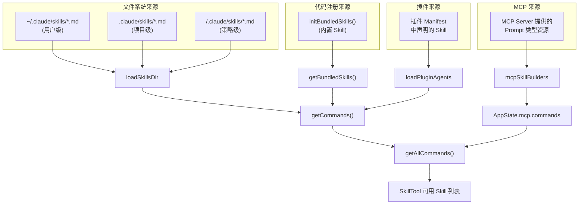
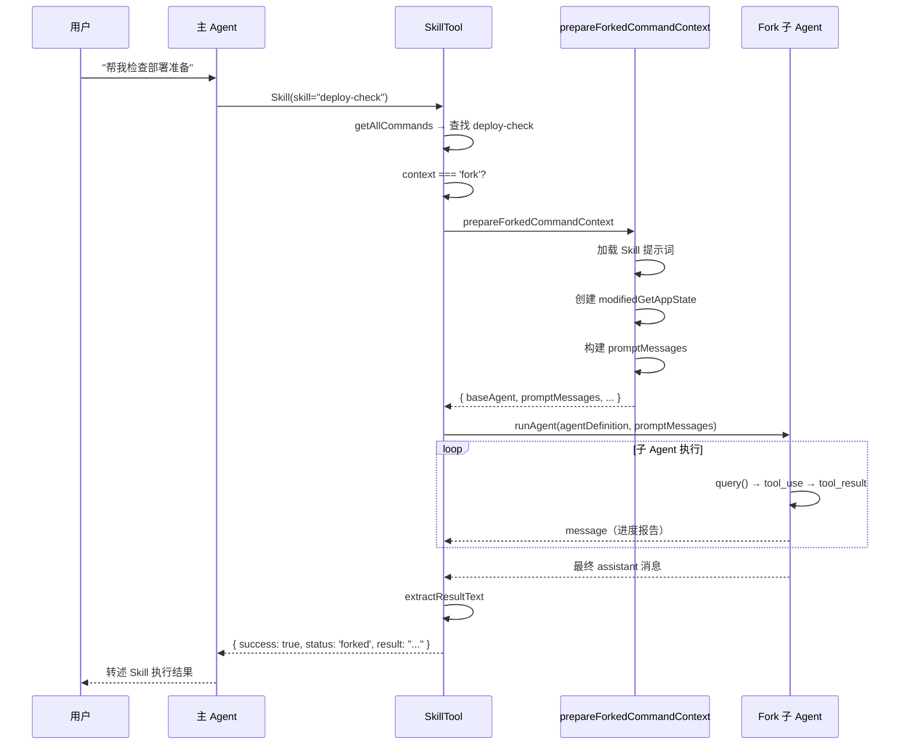
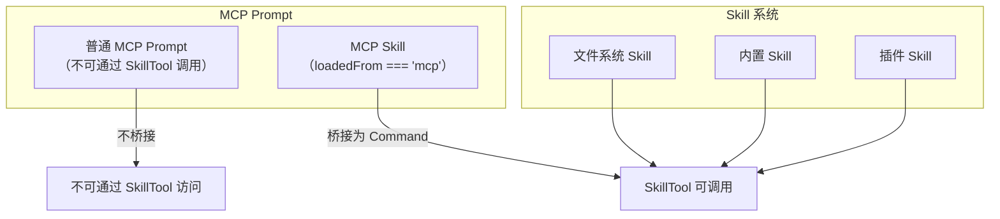

# 第 12 章：Skill 系统

> "好的抽象不是隐藏复杂性，而是将复杂性放在正确的位置。"
> —— Kevlin Henney

如果说 Agent 是 Claude Code 的"执行单元"，那么 Skill 就是它的"能力包"。Skill 系统将特定领域的专业知识（以 Markdown 编写的 Prompt 模板）、工具约束和执行策略封装为一个可发现、可调用、可复用的单元。用户看到的是 `/commit`、`/review-pr` 这样的斜杠命令，背后则是一套精密的发现、解析和执行机制。

## 12.1 Skill 的本质 —— Prompt 模板 + Agent 封装

### 12.1.1 Command 类型作为统一抽象

在 Claude Code 的类型体系中，Skill 并没有独立的类型——它是 `Command` 类型中 `type: 'prompt'` 的子集。这种"Skill 即 Command"的设计使得 Skill 可以无缝集成到已有的命令系统中：

```typescript
// src/types/command.ts (概念简化)

export type Command = {
  type: 'prompt'              // 区分于 'action' 等其他命令类型
  name: string                 // 唯一名称，如 'commit', 'review-pr'
  description: string          // 人可读描述
  hasUserSpecifiedDescription: boolean
  allowedTools: string[]       // 此 Skill 允许使用的工具
  argumentHint?: string        // 参数提示
  whenToUse?: string           // 何时自动调用的描述
  model?: string               // 模型覆盖
  disableModelInvocation: boolean  // 是否禁止模型自动调用
  userInvocable: boolean       // 用户是否可手动调用
  context?: 'inline' | 'fork'  // 执行上下文
  agent?: string               // 绑定的 Agent 类型
  effort?: EffortValue         // 推理努力级别
  paths?: string[]             // 路径匹配模式
  hooks?: HooksSettings        // Skill 级钩子
  skillRoot?: string           // Skill 的根目录
  source: 'bundled' | 'user' | 'project' | 'managed' | 'plugin'
  loadedFrom: 'skills' | 'plugin' | 'managed' | 'bundled' | 'mcp'
  getPromptForCommand: (args: string, context: ToolUseContext)
    => Promise<ContentBlockParam[]>
}
```

`getPromptForCommand` 是每个 Skill 的核心——它接收用户参数和工具使用上下文，返回一组内容块（ContentBlockParam），这些内容块将被注入到对话中。

### 12.1.2 两种执行模式

Skill 有两种执行模式，由 `context` 字段控制：

```mermaid
graph TD
    subgraph "Inline 模式（默认）"
        I1["SkillTool 调用"] --> I2["加载 Skill 提示词"]
        I2 --> I3["注入到主对话上下文"]
        I3 --> I4["主 Agent 在当前轮次执行"]
        I4 --> I5["返回成功标志"]
    end

    subgraph "Fork 模式"
        F1["SkillTool 调用"] --> F2["加载 Skill 提示词"]
        F2 --> F3["创建子 Agent 上下文"]
        F3 --> F4["prepareForkedCommandContext"]
        F4 --> F5["runAgent 执行子 Agent"]
        F5 --> F6["提取结果文本"]
        F6 --> F7["返回结果到主 Agent"]
    end
```



**Inline 模式**是轻量级的——Skill 提示词被注入到当前对话中，主 Agent 在同一轮次内执行。适用于简单的配置变更或信息查询。

**Fork 模式**会启动一个独立的子 Agent 来执行 Skill，拥有独立的 token 预算和执行空间。适用于复杂的多步骤任务，如代码审查或部署验证。

### 12.1.3 BundledSkillDefinition

内置 Skill（bundled skills）通过代码注册，而非文件系统加载：

```typescript
// src/skills/bundledSkills.ts

export type BundledSkillDefinition = {
  name: string
  description: string
  aliases?: string[]
  whenToUse?: string
  argumentHint?: string
  allowedTools?: string[]
  model?: string
  disableModelInvocation?: boolean
  userInvocable?: boolean
  isEnabled?: () => boolean         // 动态启用/禁用
  hooks?: HooksSettings
  context?: 'inline' | 'fork'
  agent?: string                     // 绑定到特定 Agent
  files?: Record<string, string>    // 附带的参考文件
  getPromptForCommand: (args: string, context: ToolUseContext)
    => Promise<ContentBlockParam[]>
}
```

`files` 字段是一个值得注意的设计——它允许 Skill 携带参考文件（如 API 文档、代码模板），这些文件在首次调用时被提取到磁盘：

```typescript
export function registerBundledSkill(definition: BundledSkillDefinition): void {
  const { files } = definition

  if (files && Object.keys(files).length > 0) {
    skillRoot = getBundledSkillExtractDir(definition.name)
    let extractionPromise: Promise<string | null> | undefined
    const inner = definition.getPromptForCommand

    getPromptForCommand = async (args, ctx) => {
      // 惰性提取：首次调用时写入磁盘，后续复用
      extractionPromise ??= extractBundledSkillFiles(definition.name, files)
      const extractedDir = await extractionPromise
      const blocks = await inner(args, ctx)
      if (extractedDir === null) return blocks
      return prependBaseDir(blocks, extractedDir)  // 前缀 "Base directory: ..."
    }
  }

  // 注册为 Command 对象
  bundledSkills.push({
    type: 'prompt',
    name: definition.name,
    // ...
    getPromptForCommand,
  })
}
```

`extractionPromise` 的 memoization 确保了并发调用不会产生竞态条件——多个调用者 await 同一个 Promise。

文件提取过程经过安全加固——使用 `O_NOFOLLOW | O_EXCL` 标志防止符号链接攻击，配合 `0o600`/`0o700` 权限确保仅文件所有者可访问：

```typescript
const SAFE_WRITE_FLAGS = process.platform === 'win32'
  ? 'wx'
  : fsConstants.O_WRONLY | fsConstants.O_CREAT | fsConstants.O_EXCL | O_NOFOLLOW

async function safeWriteFile(p: string, content: string): Promise<void> {
  const fh = await open(p, SAFE_WRITE_FLAGS, 0o600)
  try { await fh.writeFile(content, 'utf8') }
  finally { await fh.close() }
}
```

## 12.2 Skill 发现 —— 文件系统、插件、MCP 三种来源

### 12.2.1 发现架构总览

Skill 的发现是一个多源聚合过程：



### 12.2.2 文件系统 Skill 加载

`loadSkillsDir.ts` 是文件系统 Skill 加载的核心模块。它从多个配置目录加载 Markdown 文件，每个文件的 frontmatter 定义了 Skill 的元数据：

```yaml
---
name: deploy-check
description: "检查部署前的准备工作"
allowed-tools:
  - Bash
  - Read
  - Glob
when_to_use: "当用户说 'deploy'、'部署' 或 '上线' 时自动调用"
context: fork
model: inherit
effort: high
---

你是一个部署检查专家。在部署之前...
```

`parseSkillFrontmatterFields` 函数解析所有 frontmatter 字段：

```typescript
// src/skills/loadSkillsDir.ts

export function parseSkillFrontmatterFields(
  frontmatter: FrontmatterData,
  markdownContent: string,
  resolvedName: string,
): {
  displayName: string | undefined
  description: string
  allowedTools: string[]
  whenToUse: string | undefined
  model: string | undefined
  executionContext: 'fork' | undefined
  agent: string | undefined
  effort: EffortValue | undefined
  hooks: HooksSettings | undefined
  // ... 更多字段
} {
  const description = coerceDescriptionToString(frontmatter.description, resolvedName)
    ?? extractDescriptionFromMarkdown(markdownContent, 'Skill')

  const model = frontmatter.model === 'inherit'
    ? undefined
    : frontmatter.model ? parseUserSpecifiedModel(frontmatter.model) : undefined

  return {
    displayName: frontmatter.name != null ? String(frontmatter.name) : undefined,
    description,
    allowedTools: parseSlashCommandToolsFromFrontmatter(frontmatter['allowed-tools']),
    executionContext: frontmatter.context === 'fork' ? 'fork' : undefined,
    agent: frontmatter.agent as string | undefined,
    // ...
  }
}
```

然后 `createSkillCommand` 将解析结果包装为完整的 `Command` 对象：

```typescript
export function createSkillCommand({
  skillName, description, markdownContent,
  allowedTools, executionContext, agent, source, loadedFrom,
  // ...
}: { ... }): Command {
  return {
    type: 'prompt',
    name: skillName,
    description,
    allowedTools,
    context: executionContext,
    agent,
    source,
    loadedFrom,
    async getPromptForCommand(args, toolUseContext) {
      let finalContent = baseDir
        ? `Base directory for this skill: ${baseDir}\n\n${markdownContent}`
        : markdownContent

      // 参数替换：$ARGUMENTS, $ARG1, $ARG2 等
      finalContent = substituteArguments(finalContent, args, argumentNames)

      // Shell 命令执行：{{ shell_command }} 模板
      if (shell) {
        finalContent = await executeShellCommandsInPrompt(finalContent, shell)
      }

      return [{ type: 'text', text: finalContent }]
    },
  }
}
```

注意两个重要的运行时特性：

1. **参数替换**：Skill 提示词中的 `$ARGUMENTS`、`$ARG1` 等占位符会在调用时被替换为实际参数。
2. **Shell 模板执行**：`{{ ls -la }}` 这样的模板会在 Skill 加载时执行对应的 Shell 命令并将输出嵌入提示词。

### 12.2.3 MCP Skill 发现

MCP 服务器可以暴露 Prompt 类型的资源，这些资源被 Claude Code 桥接为 Skill。`mcpSkillBuilders.ts` 通过写一次注册（Write-Once Registration）模式解决了循环依赖问题：

```typescript
// src/skills/mcpSkillBuilders.ts

export type MCPSkillBuilders = {
  createSkillCommand: typeof createSkillCommand
  parseSkillFrontmatterFields: typeof parseSkillFrontmatterFields
}

let builders: MCPSkillBuilders | null = null

export function registerMCPSkillBuilders(b: MCPSkillBuilders): void {
  builders = b  // loadSkillsDir.ts 模块初始化时注册
}

export function getMCPSkillBuilders(): MCPSkillBuilders {
  if (!builders) {
    throw new Error('MCP skill builders not registered — '
      + 'loadSkillsDir.ts has not been evaluated yet')
  }
  return builders
}
```

为什么需要这个间接层？源码注释中有详细解释：

> The non-literal dynamic-import approach ("await import(variable)") fails at runtime in Bun-bundled binaries — the specifier is resolved against the chunk's /$bunfs/root/... path, not the original source tree. A literal dynamic import works in bunfs but dependency-cruiser tracks it, and because loadSkillsDir transitively reaches almost everything, the single new edge fans out into many new cycle violations.

简单说：MCP 客户端模块需要调用 `createSkillCommand`，但 `loadSkillsDir` 又间接依赖 MCP 客户端，形成循环。`mcpSkillBuilders` 作为一个"依赖图叶子"打破了这个环。

### 12.2.4 Skill 发现的预算管理

Skill 列表被注入到系统提示词中供模型发现，但过多的 Skill 描述会消耗宝贵的上下文窗口。`prompt.ts` 实现了精细的预算管理：

```typescript
// src/tools/SkillTool/prompt.ts

export const SKILL_BUDGET_CONTEXT_PERCENT = 0.01  // 上下文窗口的 1%
export const CHARS_PER_TOKEN = 4
export const DEFAULT_CHAR_BUDGET = 8_000  // 默认 200k × 4 × 1%
export const MAX_LISTING_DESC_CHARS = 250  // 单条描述硬上限

export function formatCommandsWithinBudget(
  commands: Command[], contextWindowTokens?: number,
): string {
  const budget = getCharBudget(contextWindowTokens)

  // 1. 尝试完整描述
  const fullEntries = commands.map(cmd => ({
    cmd, full: formatCommandDescription(cmd),
  }))
  const fullTotal = fullEntries.reduce((sum, e) => sum + stringWidth(e.full), 0)
  if (fullTotal <= budget) return fullEntries.map(e => e.full).join('\n')

  // 2. 分区：内置 Skill 永远完整，其他 Skill 可截断
  const bundledIndices = new Set<number>()
  // ...

  // 3. 计算非内置 Skill 的最大描述长度
  const availableForDescs = remainingBudget - restNameOverhead
  const maxDescLen = Math.floor(availableForDescs / restCommands.length)

  // 4. 极端情况：非内置 Skill 只显示名称
  if (maxDescLen < MIN_DESC_LENGTH) {
    return commands.map((cmd, i) =>
      bundledIndices.has(i) ? fullEntries[i]!.full : `- ${cmd.name}`
    ).join('\n')
  }

  // 5. 正常截断非内置 Skill 的描述
  return commands.map((cmd, i) => {
    if (bundledIndices.has(i)) return fullEntries[i]!.full
    return `- ${cmd.name}: ${truncate(description, maxDescLen)}`
  }).join('\n')
}
```

这个预算分配算法的优先级是：
1. 内置 Skill 的描述永远完整保留
2. 其他 Skill 先尝试完整描述
3. 超预算时等比例截断非内置 Skill 的描述
4. 极端情况下非内置 Skill 只保留名称

## 12.3 Skill 执行 —— executeForkedSkill 的 Fork 子 Agent 模式

### 12.3.1 SkillTool 的整体结构

`SkillTool.ts` 是 Skill 系统的执行入口，它实现了完整的 Tool 接口：

```typescript
// src/tools/SkillTool/SkillTool.ts

export const SkillTool: Tool<InputSchema, Output, Progress> = buildTool({
  name: SKILL_TOOL_NAME,
  searchHint: 'invoke a slash-command skill',
  maxResultSizeChars: 100_000,

  inputSchema: z.object({
    skill: z.string().describe('The skill name'),
    args: z.string().optional().describe('Optional arguments'),
  }),

  outputSchema: z.union([
    // Inline 模式输出
    z.object({ success: z.boolean(), commandName: z.string(),
               status: z.literal('inline') }),
    // Fork 模式输出
    z.object({ success: z.boolean(), commandName: z.string(),
               status: z.literal('forked'), agentId: z.string(),
               result: z.string() }),
  ]),

  // ... call, validate 等方法
})
```

### 12.3.2 命令解析与查找

SkillTool 的第一步是将用户指定的 skill 名称解析为 Command 对象。它通过 `getAllCommands` 整合本地和 MCP 来源：

```typescript
async function getAllCommands(context: ToolUseContext): Promise<Command[]> {
  // MCP Skill（不是普通 MCP Prompt）
  const mcpSkills = context.getAppState().mcp.commands.filter(
    cmd => cmd.type === 'prompt' && cmd.loadedFrom === 'mcp',
  )
  if (mcpSkills.length === 0) return getCommands(getProjectRoot())
  const localCommands = await getCommands(getProjectRoot())
  return uniqBy([...localCommands, ...mcpSkills], 'name')
}
```

### 12.3.3 Fork 执行详解

当 Skill 的 `context` 为 `'fork'` 时，`executeForkedSkill` 被调用。这个函数是 Skill 系统与 Agent 系统的交汇点：

```typescript
async function executeForkedSkill(
  command: Command & { type: 'prompt' },
  commandName: string,
  args: string | undefined,
  context: ToolUseContext,
  canUseTool: CanUseToolFn,
  parentMessage: AssistantMessage,
  onProgress?: ToolCallProgress<Progress>,
): Promise<ToolResult<Output>> {
  const startTime = Date.now()
  const agentId = createAgentId()

  // 1. 准备 Fork 上下文——创建隔离的 AppState 和提示词消息
  const { modifiedGetAppState, baseAgent, promptMessages, skillContent } =
    await prepareForkedCommandContext(command, args || '', context)

  // 2. 合并 Skill 的 effort 到 Agent 定义
  const agentDefinition = command.effort !== undefined
    ? { ...baseAgent, effort: command.effort }
    : baseAgent

  const agentMessages: Message[] = []

  // 3. 运行子 Agent
  for await (const message of runAgent({
    agentDefinition,
    promptMessages,
    toolUseContext: { ...context, getAppState: modifiedGetAppState },
    canUseTool,
    isAsync: false,            // Skill 的 Fork 默认同步
    querySource: 'agent:custom',
    model: command.model as ModelAlias | undefined,
    availableTools: context.options.tools,
    override: { agentId },
  })) {
    agentMessages.push(message)

    // 4. 报告进度（工具调用）
    if ((message.type === 'assistant' || message.type === 'user') && onProgress) {
      const normalizedNew = normalizeMessages([message])
      for (const m of normalizedNew) {
        if (m.message.content.some(c =>
          c.type === 'tool_use' || c.type === 'tool_result')) {
          onProgress({
            toolUseID: `skill_${parentMessage.message.id}`,
            data: { message: m, type: 'skill_progress', prompt: skillContent, agentId },
          })
        }
      }
    }
  }

  // 5. 提取最终结果
  const resultText = extractResultText(agentMessages, 'Skill execution completed')
  agentMessages.length = 0  // 释放消息内存

  return {
    data: { success: true, commandName, status: 'forked', agentId, result: resultText },
  }
}
```



`prepareForkedCommandContext` 是连接 Skill 系统和 Agent 系统的桥梁函数，定义在 `forkedAgent.ts` 中。它做三件核心工作：

1. **构建 Agent 定义**：基于 Skill 的 `agent` 字段选择 Agent 类型（默认 general-purpose），并合并 Skill 的 `allowedTools`。
2. **创建隔离的 AppState**：修改 `getAppState` 以注入 Skill 特定的权限规则。
3. **构建提示词消息**：将 Skill 的 `getPromptForCommand` 输出包装为用户消息。

## 12.4 内置 Skill —— 核心能力分析

### 12.4.1 注册入口

所有内置 Skill 在 `initBundledSkills()` 中注册：

```typescript
// src/skills/bundled/index.ts

export function initBundledSkills(): void {
  registerUpdateConfigSkill()    // /update-config
  registerKeybindingsSkill()     // /keybindings
  registerVerifySkill()          // /verify（仅内部用户）
  registerDebugSkill()           // /debug
  registerLoremIpsumSkill()      // /lorem（测试用）
  registerSkillifySkill()        // /skillify
  registerRememberSkill()        // /remember（仅内部用户）
  registerSimplifySkill()        // /simplify
  registerBatchSkill()           // /batch
  registerStuckSkill()           // /stuck

  // Feature flag 控制的 Skill
  if (feature('AGENT_TRIGGERS')) {
    const { registerLoopSkill } = require('./loop.js')
    registerLoopSkill()           // /loop
  }
  if (feature('AGENT_TRIGGERS_REMOTE')) {
    const { registerScheduleRemoteAgentsSkill } = require('./scheduleRemoteAgents.js')
    registerScheduleRemoteAgentsSkill()  // /schedule
  }
  if (feature('BUILDING_CLAUDE_APPS')) {
    const { registerClaudeApiSkill } = require('./claudeApi.js')
    registerClaudeApiSkill()      // /claude-api
  }
  // ...
}
```

这里大量使用了 `require()` 而非 `import`，原因是这些模块可能很大（如 `claudeApi.js` 包含 247KB 的文档字符串），惰性加载避免了不必要的启动成本。

### 12.4.2 /batch —— 并行工作编排

`/batch` 是 Skill 系统中最复杂的内置 Skill。它实现了一个完整的三阶段工作流：

```
Phase 1: Research and Plan（Plan 模式）
  ├── 深度研究代码库
  ├── 分解为 5-30 个独立工作单元
  ├── 确定端到端测试方案
  └── 提交计划供用户审批

Phase 2: Spawn Workers（计划批准后）
  ├── 每个工作单元一个后台 Agent
  ├── 所有 Agent 使用 isolation: "worktree"
  └── 在单条消息中并发启动

Phase 3: Track Progress
  └── 维护状态表直到所有 Worker 完成
```

其提示词中明确指定了 Worker 的行为约束：

```typescript
const WORKER_INSTRUCTIONS = `After you finish implementing the change:
1. **Simplify** — Invoke the Skill tool with skill: "simplify"
2. **Run unit tests** — Run the project's test suite
3. **Test end-to-end** — Follow the e2e test recipe
4. **Commit and push** — Commit, push, create PR with gh pr create
5. **Report** — End with: PR: <url>`
```

这展示了 Skill 和 Agent 的嵌套组合能力——`/batch` Skill 编排了 Plan 模式、多个并行 Agent（每个在独立 worktree 中）以及对 `/simplify` Skill 的递归调用。

### 12.4.3 /remember —— 记忆管理

`/remember` Skill 是 Agent 记忆系统的用户界面。它审查所有记忆层（auto-memory、CLAUDE.md、CLAUDE.local.md），并提出整理建议：

```typescript
registerBundledSkill({
  name: 'remember',
  description: 'Review auto-memory entries and propose promotions...',
  whenToUse: 'Use when the user wants to review, organize, '
    + 'or promote their auto-memory entries...',
  isEnabled: () => isAutoMemoryEnabled(),  // 仅在自动记忆启用时可用
  async getPromptForCommand(args) {
    let prompt = SKILL_PROMPT  // 详细的审查流程指令
    if (args) prompt += `\n## Additional context from user\n\n${args}`
    return [{ type: 'text', text: prompt }]
  },
})
```

`isEnabled` 回调使得 Skill 的可见性与系统配置动态关联——当自动记忆未启用时，`/remember` 不会出现在 Skill 列表中。

### 12.4.4 /loop —— 循环执行调度

`/loop` 展示了 Skill 如何与底层的 Cron 系统集成：

```typescript
function buildPrompt(args: string): string {
  return `# /loop — schedule a recurring prompt

Parse the input below into [interval] <prompt...> and schedule it
with ${CRON_CREATE_TOOL_NAME}.

## Parsing (in priority order)
1. **Leading token**: if first token matches ^\\d+[smhd]$ → interval
2. **Trailing "every" clause**: if ends with "every <N><unit>" → extract interval
3. **Default**: interval is 10m, entire input is prompt

## Interval → cron
| Pattern | Cron | Notes |
|---------|------|-------|
| Nm (N≤59) | */N * * * * | every N minutes |
| Nm (N≥60) | 0 */H * * * | round to hours |
| Nh | 0 */N * * * | every N hours |
| Nd | 0 0 */N * * | every N days |

## Action
1. Call ${CRON_CREATE_TOOL_NAME}
2. Confirm schedule details
3. Execute the prompt immediately

## Input
${args}`
}
```

这个 Skill 不直接操作 Cron 系统——它生成一个结构化的指令提示词，让模型自行调用 `ScheduleCronTool`。这种"Prompt as Controller"的模式是 Skill 系统的核心设计理念。

### 12.4.5 /claude-api —— 智能文档注入

`/claude-api` 是一个资源密集型 Skill，它根据项目语言环境动态加载相关的 API 文档：

```typescript
async function detectLanguage(): Promise<DetectedLanguage | null> {
  const cwd = getCwd()
  const entries = await readdir(cwd)
  for (const [lang, indicators] of Object.entries(LANGUAGE_INDICATORS)) {
    for (const indicator of indicators) {
      if (indicator.startsWith('.')) {
        if (entries.some(e => e.endsWith(indicator))) return lang
      } else {
        if (entries.includes(indicator)) return lang
      }
    }
  }
  return null
}
```

检测到 Python 项目时加载 Python SDK 文档，检测到 TypeScript 时加载 TS SDK 文档。由于文档总计 247KB，使用惰性加载避免启动时的内存开销：

```typescript
type SkillContent = typeof import('./claudeApiContent.js')
// 只在 /claude-api 被调用时才 require
```

### 12.4.6 /verify —— 结构化验证

`/verify` Skill 通过 `files` 字段携带参考文件，让模型在运行时按需读取验证策略文档：

```typescript
registerBundledSkill({
  name: 'verify',
  description: DESCRIPTION,
  files: SKILL_FILES,  // 验证策略、检查清单等参考文件
  async getPromptForCommand(args) {
    const parts: string[] = [SKILL_BODY.trimStart()]
    if (args) parts.push(`## User Request\n\n${args}`)
    return [{ type: 'text', text: parts.join('\n\n') }]
  },
})
```

## 12.5 Skill 与插件的关系

### 12.5.1 插件 Skill 的集成路径

插件（Plugin）可以通过其 Manifest 声明 Skill。这些 Skill 经过 `loadPluginAgents` 加载后，以 `source: 'plugin'` 的身份加入 Skill 列表。插件 Skill 与文件系统 Skill 有相同的功能（frontmatter 配置、Fork 执行等），但多了安全约束：

1. **`CUSTOM_AGENT_DISALLOWED_TOOLS`**：非内置 Agent（包括插件 Agent）被禁止使用某些敏感工具
2. **pluginOnlyPolicy**：组织管理员可以要求所有 Skill 必须来自已批准的插件

### 12.5.2 MCP 与 Skill 的交叉

MCP 服务器可以暴露 Prompt 资源，Claude Code 将其桥接为 Skill。但不是所有 MCP Prompt 都是 Skill——只有带有 Skill frontmatter 的 Prompt 才会被识别为 Skill：

```typescript
// SkillTool.ts 中的过滤逻辑
const mcpSkills = context.getAppState().mcp.commands.filter(
  cmd => cmd.type === 'prompt' && cmd.loadedFrom === 'mcp',
)
```



### 12.5.3 Skill 的安全模型

Skill 的安全性通过多层机制保障：

1. **权限模式继承**：Fork 模式的 Skill 运行在子 Agent 中，受父代权限模式约束
2. **工具白名单**：`allowedTools` 限制 Skill 可以使用的工具
3. **路径限制**：`paths` 字段限制 Skill 仅在特定目录下生效
4. **钩子审计**：Skill 级 `hooks` 可以在工具调用前后执行审计逻辑
5. **分类器审查**：异步执行的 Skill 结果经过 Handoff 分类器审查

## 12.6 本章小结

Skill 系统是 Claude Code 架构中"最高层次的抽象"——它站在 Agent、工具、MCP 之上，将复杂的多步骤工作流封装为用户可以一键触发的能力单元。

1. **统一的 Command 抽象**：Skill 不是独立类型，而是 `Command` 类型的一个变体。这使得 Skill 可以无缝集成到命令系统中，复用已有的发现和路由机制。

2. **三源聚合的发现机制**：文件系统、代码注册（bundled）和 MCP 三种来源通过统一的 `Command` 接口聚合，为用户提供一致的体验。

3. **Inline/Fork 双模执行**：简单 Skill 以 Inline 模式直接注入上下文，复杂 Skill 以 Fork 模式启动独立子 Agent——两种模式通过 `context` 字段声明式选择。

4. **预算感知的发现列表**：Skill 列表的展示严格控制在上下文窗口的 1% 以内，内置 Skill 优先保留完整描述。

5. **"Prompt as Controller"模式**：Skill 不直接操作系统——它生成结构化的提示词，引导模型使用已有工具完成工作。这种间接层使得 Skill 具有极高的灵活性和可组合性。

6. **安全纵深**：从 `allowedTools` 白名单到路径限制，从权限模式继承到 Handoff 分类器审查，Skill 的安全性建立在多重防线之上。

至此，本书的第四部分——Agent 系统——全部完成。我们从 Agent 的静态定义出发，经过子代编排的动态运行时，最终到达 Skill 这个最高层次的抽象。这三层共同构成了 Claude Code 的"智能执行层"——它不仅仅是一个工具调用框架，更是一个能够自主规划、并发执行、持久记忆的 Agent 操作系统。
