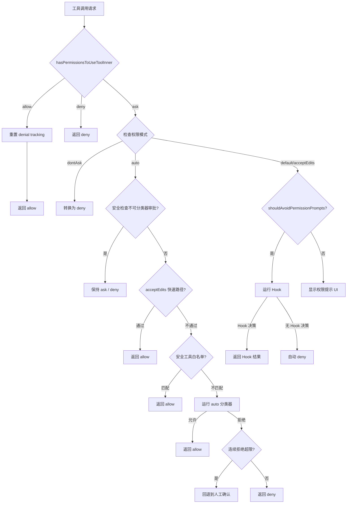

# 第 13 章：权限模型

Claude Code 的权限系统是整个产品安全架构的核心支柱。它在"让 AI 自由完成任务"和"保护用户系统安全"之间构建了一条精密的平衡线。本章将深入源码，逐层剖析这一权限模型的设计与实现。

## 13.1 六层权限模式

权限模式（Permission Mode）定义了 Claude Code 在与工具交互时的基本安全姿态。源码中在 `src/types/permissions.ts` 明确定义了所有模式：

```typescript
// src/types/permissions.ts
export const EXTERNAL_PERMISSION_MODES = [
  'acceptEdits',
  'bypassPermissions',
  'default',
  'dontAsk',
  'plan',
] as const

export type InternalPermissionMode = ExternalPermissionMode | 'auto' | 'bubble'
export type PermissionMode = InternalPermissionMode
```

这段定义揭示了一个重要的架构决策：权限模式分为**外部模式**（面向用户的公开 API）和**内部模式**（包含 `auto` 和 `bubble` 等内部专用模式）。让我们逐一分析每种模式的语义。

### 13.1.1 default 模式

这是系统的默认安全姿态。在此模式下，每个可能产生副作用的工具调用都需要用户明确授权。文件读取等只读操作可以自动通过，但写入、删除、执行命令等操作必须获得人类确认。

### 13.1.2 plan 模式

Plan 模式是一种受限的"只规划不执行"模式，Claude 只能提出行动计划，不能实际执行修改操作。在 `PermissionMode.ts` 中的配置如下：

```typescript
// src/utils/permissions/PermissionMode.ts
plan: {
  title: 'Plan Mode',
  shortTitle: 'Plan',
  symbol: PAUSE_ICON,
  color: 'planMode',
  external: 'plan',
},
```

使用暂停图标（`PAUSE_ICON`）作为视觉标识，直观表达其"停下来思考"的语义。

### 13.1.3 acceptEdits 模式

这是一种中间信任级别。在工作目录内的文件编辑操作可以自动通过，但执行 shell 命令等高风险操作仍需用户确认。这是大多数开发者日常使用时的推荐模式——编辑代码无需反复确认，但执行命令仍然受控。

### 13.1.4 bypassPermissions 模式

这是最宽松的模式，几乎所有操作都会自动批准。源码用红色（`error`）标注这一模式，暗示其危险性：

```typescript
bypassPermissions: {
  title: 'Bypass Permissions',
  shortTitle: 'Bypass',
  symbol: '⏵⏵',
  color: 'error',
  external: 'bypassPermissions',
},
```

此模式还受到一个 killswitch 机制的约束（`bypassPermissionsKillswitch.ts`），可以在发现安全问题时远程禁用。

### 13.1.5 dontAsk 模式

与 `bypassPermissions` 类似，但策略不同：当遇到需要确认的操作时，不是自动批准，而是**自动拒绝**。这在无人值守的自动化场景中很有用——宁可操作失败也不要执行未授权的操作。

### 13.1.6 auto 模式（内部）

这是最精密的模式，仅在内部构建中可用（通过 `feature('TRANSCRIPT_CLASSIFIER')` 门控）。它使用 AI 分类器来自动判断操作是否安全，无需人工干预。

```typescript
...(feature('TRANSCRIPT_CLASSIFIER')
  ? {
      auto: {
        title: 'Auto mode',
        shortTitle: 'Auto',
        symbol: '⏵⏵',
        color: 'warning' as ModeColorKey,
        external: 'default' as ExternalPermissionMode,
      },
    }
  : {}),
```

注意 `external: 'default'`——auto 模式在对外 API 中被映射为 `default`，外部用户无法直接感知到它的存在。

### 权限模式状态转换

```mermaid
stateDiagram-v2
    [*] --> default: 启动默认
    default --> plan: 用户切换 / Shift+Tab
    default --> acceptEdits: 用户切换
    default --> auto: 内部启用分类器
    plan --> default: 退出计划模式
    acceptEdits --> default: 用户切换
    acceptEdits --> bypassPermissions: 用户提权
    bypassPermissions --> default: 用户降级
    auto --> default: 分类器不可用时回退
    default --> dontAsk: CI/CD 环境设定
    dontAsk --> default: 用户切换
```

## 13.2 规则系统

权限模式定义了全局策略，而规则系统提供了细粒度的工具级控制。规则系统的核心是一个 **Allow / Deny / Ask 三元决策模型**。

### 13.2.1 规则结构

```typescript
// src/types/permissions.ts
export type PermissionBehavior = 'allow' | 'deny' | 'ask'

export type PermissionRule = {
  source: PermissionRuleSource
  ruleBehavior: PermissionBehavior
  ruleValue: PermissionRuleValue
}

export type PermissionRuleValue = {
  toolName: string
  ruleContent?: string
}
```

一条规则由三部分组成：**来源**（source）——规定了规则从哪里加载；**行为**（ruleBehavior）——Allow、Deny 或 Ask；**值**（ruleValue）——指定哪个工具、什么条件下触发。

`ruleContent` 是可选的，它允许对工具进行更精细的控制。例如 `Bash(npm test:*)` 表示仅对以 `npm test` 为前缀的 Bash 命令生效。

### 13.2.2 多源规则合并

规则可以来自多个来源，按优先级从高到低排列：

```typescript
// src/utils/permissions/permissions.ts
const PERMISSION_RULE_SOURCES = [
  ...SETTING_SOURCES,    // userSettings, projectSettings, localSettings, flagSettings, policySettings
  'cliArg',              // 命令行参数
  'command',             // 运行时命令
  'session',             // 会话级临时规则
] as const satisfies readonly PermissionRuleSource[]
```

每种来源的规则独立维护。获取 Allow 规则的实现如下：

```typescript
export function getAllowRules(context: ToolPermissionContext): PermissionRule[] {
  return PERMISSION_RULE_SOURCES.flatMap(source =>
    (context.alwaysAllowRules[source] || []).map(ruleString => ({
      source,
      ruleBehavior: 'allow',
      ruleValue: permissionRuleValueFromString(ruleString),
    })),
  )
}
```

所有来源的规则被 `flatMap` 扁平化为一个统一的列表。获取 Deny 和 Ask 规则的方式完全对称。

### 13.2.3 工具匹配逻辑

规则匹配分为两个层次——整体工具匹配和内容级匹配：

```typescript
function toolMatchesRule(
  tool: Pick<Tool, 'name' | 'mcpInfo'>,
  rule: PermissionRule,
): boolean {
  // 规则不含 ruleContent 时，匹配整个工具
  if (rule.ruleValue.ruleContent !== undefined) {
    return false
  }
  const nameForRuleMatch = getToolNameForPermissionCheck(tool)
  if (rule.ruleValue.toolName === nameForRuleMatch) {
    return true
  }
  // MCP 服务级权限：规则 "mcp__server1" 匹配 "mcp__server1__tool1"
  const ruleInfo = mcpInfoFromString(rule.ruleValue.toolName)
  const toolInfo = mcpInfoFromString(nameForRuleMatch)
  return (
    ruleInfo !== null && toolInfo !== null &&
    (ruleInfo.toolName === undefined || ruleInfo.toolName === '*') &&
    ruleInfo.serverName === toolInfo.serverName
  )
}
```

MCP 工具支持服务级别的权限控制——一条 `mcp__server1` 的规则可以匹配该服务器下的所有工具，实现批量授权。

## 13.3 权限检查流水线

权限检查的核心入口是 `hasPermissionsToUseTool` 函数，它是整个权限系统的调度中心。

```typescript
// src/utils/permissions/permissions.ts
export const hasPermissionsToUseTool: CanUseToolFn = async (
  tool, input, context, assistantMessage, toolUseID,
): Promise<PermissionDecision> => {
  const result = await hasPermissionsToUseToolInner(tool, input, context)

  // 成功的工具调用重置连续拒绝计数
  if (result.behavior === 'allow') {
    // ...重置 denial tracking
    return result
  }

  // dontAsk 模式：将 ask 转换为 deny
  if (result.behavior === 'ask') {
    const appState = context.getAppState()
    if (appState.toolPermissionContext.mode === 'dontAsk') {
      return {
        behavior: 'deny',
        message: DONT_ASK_REJECT_MESSAGE(tool.name),
      }
    }
    // auto 模式：使用分类器代替人工确认
    // ...（详见 13.4 节）
  }
  return result
}
```

完整的权限检查流水线如下图所示：



`hasPermissionsToUseToolInner` 的内部流程更加复杂，它按以下优先级依次检查：

1. **Plan 模式检查**：plan 模式下拒绝非只读工具
2. **Deny 规则匹配**：优先级最高，命中即拒绝
3. **Allow 规则匹配**：匹配到的 allow 规则可以直接放行
4. **工具自身的 checkPermissions**：每个工具实现自己的权限逻辑
5. **bypassPermissions 模式**：在安全检查通过后放行
6. **默认 ask**：以上都不命中，返回 ask 交给用户决定

## 13.4 分类器辅助

当权限检查返回 `ask` 且系统处于 `auto` 模式时，不是直接弹出对话框，而是启用 AI 分类器来自动决策。

### 13.4.1 BASH_CLASSIFIER 特性

Bash 命令分类器（`BASH_CLASSIFIER`）是一个专门针对 shell 命令的安全分析模块。其接口在 `bashClassifier.ts` 中定义（外部构建是 stub）：

```typescript
// src/utils/permissions/bashClassifier.ts (外部构建的 stub)
export async function classifyBashCommand(
  _command: string,
  _cwd: string,
  _descriptions: string[],
  _behavior: ClassifierBehavior,
  _signal: AbortSignal,
  _isNonInteractiveSession: boolean,
): Promise<ClassifierResult> {
  return {
    matches: false,
    confidence: 'high',
    reason: 'This feature is disabled',
  }
}
```

分类器返回三个关键字段：`matches`（是否匹配规则描述）、`confidence`（置信度：high/medium/low）和 `reason`（人类可读的解释）。

### 13.4.2 speculativeClassifierCheck 竞赛设计

在 `useCanUseTool.tsx` 中，当权限检查返回 `ask` 时，系统并行发起了分类器检查和用户确认对话：

```typescript
// src/hooks/useCanUseTool.tsx
case "ask": {
  if (appState.toolPermissionContext.awaitAutomatedChecksBeforeDialog) {
    const coordinatorDecision = await handleCoordinatorPermission({
      ctx,
      ...(feature("BASH_CLASSIFIER") ? {
        pendingClassifierCheck: result.pendingClassifierCheck
      } : {}),
      // ...
    });
    if (coordinatorDecision) {
      resolve(coordinatorDecision);
      return;
    }
  }
  // 显示交互式权限对话框...
  const swarmDecision = await handleSwarmWorkerPermission({
    ctx, description,
    ...(feature("BASH_CLASSIFIER") ? {
      pendingClassifierCheck: result.pendingClassifierCheck
    } : {}),
    // ...
  });
```

`pendingClassifierCheck` 是一个在 `bashPermissions.ts` 中预先启动的 Promise。它实现了一种"投机性检查"（speculative check）——在用户看到确认对话框之前，分类器可能已经完成了判断。如果分类器判定安全，用户甚至不会看到对话框；如果分类器判定不安全或超时，系统才回退到人工确认。

这种竞赛设计（race）在 `consumeSpeculativeClassifierCheck` 和 `peekSpeculativeClassifierCheck` 中实现，确保分类器结果只被消费一次。

### 13.4.3 YOLO 分类器（auto 模式）

auto 模式的核心是 `yoloClassifier.ts` 中的全局分类器。它不仅分析单条命令，还分析**完整的对话上下文**（transcript）来判断操作是否安全：

```typescript
// src/utils/permissions/yoloClassifier.ts
classifierResult = await classifyYoloAction(
  context.messages,     // 完整对话历史
  action,               // 当前操作描述
  context.options.tools, // 可用工具列表
  appState.toolPermissionContext,
  context.abortController.signal,
)
```

在调用分类器之前，系统会尝试多个快速路径来避免昂贵的 API 调用：

```typescript
// 快速路径 1：acceptEdits 检查
if (result.behavior === 'ask' && tool.name !== AGENT_TOOL_NAME) {
  const acceptEditsResult = await tool.checkPermissions(parsedInput, {
    ...context,
    getAppState: () => ({
      ...state,
      toolPermissionContext: {
        ...state.toolPermissionContext,
        mode: 'acceptEdits' as const,
      },
    }),
  })
  if (acceptEditsResult.behavior === 'allow') {
    // 跳过分类器，直接允许
    return { behavior: 'allow', ... }
  }
}

// 快速路径 2：安全工具白名单
if (classifierDecisionModule!.isAutoModeAllowlistedTool(tool.name)) {
  return { behavior: 'allow', ... }
}
```

安全工具白名单（`SAFE_YOLO_ALLOWLISTED_TOOLS`）在 `classifierDecision.ts` 中定义，包含了所有确认安全的只读工具：

```typescript
const SAFE_YOLO_ALLOWLISTED_TOOLS = new Set([
  FILE_READ_TOOL_NAME,
  GREP_TOOL_NAME, GLOB_TOOL_NAME, LSP_TOOL_NAME,
  TODO_WRITE_TOOL_NAME,
  ASK_USER_QUESTION_TOOL_NAME,
  SLEEP_TOOL_NAME,
  // ...
])
```

## 13.5 拒绝追踪

当 auto 模式分类器连续拒绝操作时，可能意味着分类器的判断与用户意图不一致。`denialTracking.ts` 实现了一个升级机制来处理这种情况：

```typescript
// src/utils/permissions/denialTracking.ts
export type DenialTrackingState = {
  consecutiveDenials: number
  totalDenials: number
}

export const DENIAL_LIMITS = {
  maxConsecutive: 3,
  maxTotal: 20,
} as const

export function shouldFallbackToPrompting(state: DenialTrackingState): boolean {
  return (
    state.consecutiveDenials >= DENIAL_LIMITS.maxConsecutive ||
    state.totalDenials >= DENIAL_LIMITS.maxTotal
  )
}
```

设计精要在于两个独立的阈值：

- **连续拒绝阈值**（3 次）：检测短期的分类器-用户不一致。连续 3 次拒绝后回退到人工确认，让用户有机会纠正。
- **总拒绝阈值**（20 次）：检测长期的系统性问题。即使每次连续拒绝都被成功操作打断，积累到 20 次也会触发回退。

状态管理函数是纯函数，返回新状态而非修改原状态：

```typescript
export function recordDenial(state: DenialTrackingState): DenialTrackingState {
  return {
    ...state,
    consecutiveDenials: state.consecutiveDenials + 1,
    totalDenials: state.totalDenials + 1,
  }
}

export function recordSuccess(state: DenialTrackingState): DenialTrackingState {
  if (state.consecutiveDenials === 0) return state // 无需变化
  return { ...state, consecutiveDenials: 0 }
}
```

`recordSuccess` 中的短路优化很精巧——如果连续拒绝计数已经是 0，直接返回原对象，避免无意义的对象创建。

在 `permissions.ts` 中的使用方式：

```typescript
if (result.behavior === 'allow') {
  const currentDenialState =
    context.localDenialTracking ?? appState.denialTracking
  if (appState.toolPermissionContext.mode === 'auto' &&
      currentDenialState && currentDenialState.consecutiveDenials > 0) {
    const newDenialState = recordSuccess(currentDenialState)
    persistDenialState(context, newDenialState)
  }
  return result
}
```

注意 `context.localDenialTracking` 的优先级高于 `appState.denialTracking`——这是为异步子代理设计的。子代理的 `setAppState` 是 no-op，不能通过全局状态传递拒绝追踪信息，因此需要本地独立跟踪。

## 13.6 权限持久化

权限规则的持久化分为两个级别：会话级和全局级。

### 13.6.1 会话级权限

会话级权限存储在 `ToolPermissionContext` 的 `session` 来源中，随会话结束而消失。当用户在权限对话框中选择"允许一次"或"拒绝一次"时，产生的就是会话级规则。

### 13.6.2 全局级权限

全局级权限持久化到设置文件中，有多个目标位置：

```typescript
// src/types/permissions.ts
export type PermissionUpdateDestination =
  | 'userSettings'       // ~/.claude/settings.json
  | 'projectSettings'    // .claude/settings.json
  | 'localSettings'      // .claude/settings.local.json
  | 'session'            // 内存中
  | 'cliArg'             // CLI 参数
```

持久化操作由 `PermissionUpdate.ts` 中的 `persistPermissionUpdates` 处理。一个典型的权限更新操作：

```typescript
// 用户点击"Always allow for this project"
const update: PermissionUpdate = {
  type: 'addRules',
  rules: [{ toolName: 'Bash', ruleContent: 'npm test:*' }],
  behavior: 'allow',
  destination: 'localSettings',
}
```

这条规则会被写入项目本地的 `.claude/settings.local.json` 文件（不入 Git），允许在该项目中自动执行以 `npm test` 开头的命令。

权限的加载在 `permissionsLoader.ts` 中实现，它从所有配置来源收集规则，合并到 `ToolPermissionContext` 对象中。加载顺序保证了优先级——策略设置（policySettings）优先于用户设置（userSettings），用户设置优先于项目设置（projectSettings）。

这种分层持久化设计允许企业通过策略（policy）强制某些安全约束，同时让开发者在项目级别自定义便捷规则，实现了安全性与可用性的平衡。
