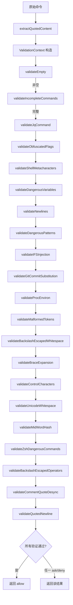
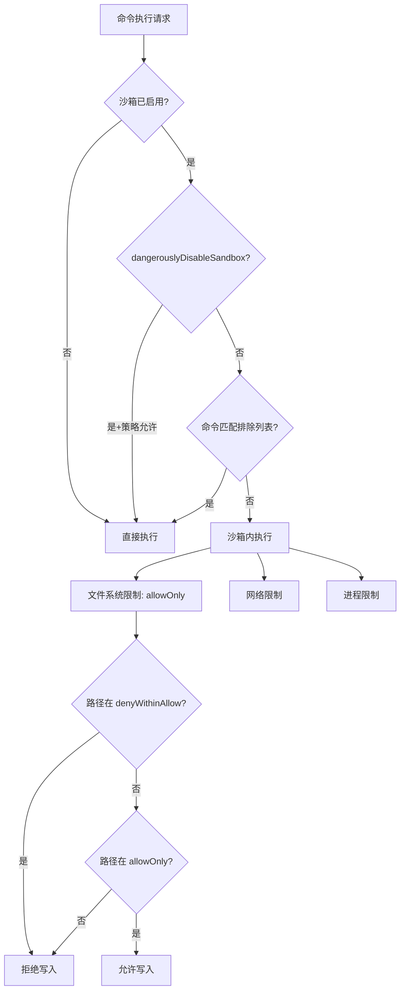

# 第 14 章：Bash 安全分析

Bash 工具是 Claude Code 中最强大也最危险的能力——它赋予 AI 直接在用户系统上执行任意 shell 命令的权力。这种能力的安全边界完全依赖于本章所述的多层安全分析机制。我们将从底层的命令解析开始，逐层上升到沙箱隔离，完整剖析这一安全体系。

## 14.1 命令解析

在进行任何安全判断之前，系统必须首先理解命令的语义结构。这一过程涉及 shell 引号处理、命令分割、环境变量剥离等多个步骤。

### 14.1.1 引号内容提取

`bashSecurity.ts` 中的 `extractQuotedContent` 函数实现了一个精确的 shell 引号状态机：

```typescript
// src/tools/BashTool/bashSecurity.ts
function extractQuotedContent(command: string, isJq = false): QuoteExtraction {
  let withDoubleQuotes = ''
  let fullyUnquoted = ''
  let unquotedKeepQuoteChars = ''
  let inSingleQuote = false
  let inDoubleQuote = false
  let escaped = false

  for (let i = 0; i < command.length; i++) {
    const char = command[i]

    if (escaped) {
      escaped = false
      if (!inSingleQuote) withDoubleQuotes += char
      if (!inSingleQuote && !inDoubleQuote) fullyUnquoted += char
      if (!inSingleQuote && !inDoubleQuote) unquotedKeepQuoteChars += char
      continue
    }

    if (char === '\\' && !inSingleQuote) {
      escaped = true
      // ...
      continue
    }
    // ...
  }
  return { withDoubleQuotes, fullyUnquoted, unquotedKeepQuoteChars }
}
```

这个函数产生三种不同的"去引号"视图：

- `withDoubleQuotes`：仅剥离单引号内容，保留双引号内容（因为双引号内仍可能有变量展开）
- `fullyUnquoted`：剥离所有引号内容，仅保留裸露的 shell 语法
- `unquotedKeepQuoteChars`：剥离引号内容但保留引号字符本身，用于检测引号相邻的特殊模式（如 `'x'#`）

这三个视图服务于不同的安全验证器。例如，命令替换检测（`$(...)`）需要在 `fullyUnquoted` 上进行，因为单引号内的 `$(` 不会被 shell 展开；而 mid-word hash 检测需要 `unquotedKeepQuoteChars`，因为 `echo 'x'#comment` 中引号的位置关系对 shell 解析有影响。

### 14.1.2 命令替换模式检测

系统维护了一个完整的命令替换模式列表：

```typescript
const COMMAND_SUBSTITUTION_PATTERNS = [
  { pattern: /<\(/, message: 'process substitution <()' },
  { pattern: />\(/, message: 'process substitution >()' },
  { pattern: /=\(/, message: 'Zsh process substitution =()' },
  { pattern: /(?:^|[\s;&|])=[a-zA-Z_]/, message: 'Zsh equals expansion (=cmd)' },
  { pattern: /\$\(/, message: '$() command substitution' },
  { pattern: /\$\{/, message: '${} parameter substitution' },
  { pattern: /\$\[/, message: '$[] legacy arithmetic expansion' },
  { pattern: /~\[/, message: 'Zsh-style parameter expansion' },
  { pattern: /\(e:/, message: 'Zsh-style glob qualifiers' },
  { pattern: /\(\+/, message: 'Zsh glob qualifier with command execution' },
  { pattern: /\}\s*always\s*\{/, message: 'Zsh always block' },
  { pattern: /<#/, message: 'PowerShell comment syntax' },
]
```

这份列表涵盖了 Bash 和 Zsh 两种 shell 的命令替换语法。特别值得注意的是 Zsh 的等号展开（`=cmd`）——`=curl evil.com` 在 Zsh 中等价于 `/usr/bin/curl evil.com`，可以绕过 `Bash(curl:*)` 的 deny 规则。

### 14.1.3 Zsh 危险命令集

系统额外维护了一个 Zsh 特有的危险命令列表：

```typescript
const ZSH_DANGEROUS_COMMANDS = new Set([
  'zmodload',    // 模块加载 - 可以启用文件 I/O、网络、伪终端等
  'emulate',     // 带 -c 标志时是 eval 等价物
  'sysopen', 'sysread', 'syswrite', 'sysseek',  // zsh/system 模块
  'zpty',        // 伪终端命令执行
  'ztcp', 'zsocket',  // 网络连接
  'zf_rm', 'zf_mv', 'zf_ln', 'zf_chmod',  // zsh/files 内建命令
  // ...
])
```

`zmodload` 是 Zsh 安全的关键威胁——它可以加载 `zsh/mapfile`（通过数组赋值实现隐形文件 I/O）、`zsh/net/tcp`（通过 `ztcp` 进行网络外泄）等模块，使得许多"安全"的命令变成攻击向量。

### 14.1.4 安全检查编号系统

为了日志和分析，每个安全检查都有一个数值 ID：

```typescript
const BASH_SECURITY_CHECK_IDS = {
  INCOMPLETE_COMMANDS: 1,
  JQ_SYSTEM_FUNCTION: 2,
  JQ_FILE_ARGUMENTS: 3,
  OBFUSCATED_FLAGS: 4,
  SHELL_METACHARACTERS: 5,
  DANGEROUS_VARIABLES: 6,
  NEWLINES: 7,
  DANGEROUS_PATTERNS_COMMAND_SUBSTITUTION: 8,
  // ...
  COMMENT_QUOTE_DESYNC: 22,
  QUOTED_NEWLINE: 23,
} as const
```

使用数值而非字符串避免了在遥测数据中泄露安全检查的具体逻辑。

## 14.2 危险命令检测

### 14.2.1 危险模式列表

`dangerousPatterns.ts` 维护了一组跨平台的代码执行入口点：

```typescript
// src/utils/permissions/dangerousPatterns.ts
export const CROSS_PLATFORM_CODE_EXEC = [
  'python', 'python3', 'python2',
  'node', 'deno', 'tsx',
  'ruby', 'perl', 'php', 'lua',
  'npx', 'bunx',
  'npm run', 'yarn run', 'pnpm run', 'bun run',
  'bash', 'sh',
  'ssh',
] as const

export const DANGEROUS_BASH_PATTERNS: readonly string[] = [
  ...CROSS_PLATFORM_CODE_EXEC,
  'zsh', 'fish', 'eval', 'exec', 'env', 'xargs', 'sudo',
  ...(process.env.USER_TYPE === 'ant' ? [
    'fa run', 'coo',
    'gh', 'gh api', 'curl', 'wget',
    'git', 'kubectl', 'aws', 'gcloud', 'gsutil',
  ] : []),
]
```

这些模式被用于 `permissionSetup.ts` 中的 `isDangerousBashPermission`——当用户进入 auto 模式时，类似 `Bash(python:*)` 这种过于宽泛的 allow 规则会被自动剥离，因为它们本质上等于允许执行任意代码。

注意 Anthropic 内部用户（`USER_TYPE === 'ant'`）有更严格的限制，额外禁止了 `gh`（GitHub CLI）、`curl`/`wget`（网络请求）、`git`（可通过 hooks 执行代码）等工具的宽泛授权。

### 14.2.2 验证器流水线

`bashSecurity.ts` 实现了一系列验证函数，构成了安全验证流水线：



每个验证器返回 `PermissionResult`，其 `behavior` 可以是 `allow`（确认安全）、`ask`（需要人工确认）或 `passthrough`（此验证器无法判断，交给下一个）。流水线在遇到第一个非 `passthrough` 结果时停止。

### 14.2.3 反转义后门检测

`hasUnescapedChar` 是一个关键的底层函数，用于在引号剥离后的内容中检测未转义的危险字符：

```typescript
function hasUnescapedChar(content: string, char: string): boolean {
  if (char.length !== 1) {
    throw new Error('hasUnescapedChar only works with single characters')
  }
  let i = 0
  while (i < content.length) {
    if (content[i] === '\\' && i + 1 < content.length) {
      i += 2  // 跳过转义序列
      continue
    }
    if (content[i] === char) {
      return true
    }
    i++
  }
  return false
}
```

函数注释中的安全警告值得深思：它故意限制只接受单字符，因为多字符字符串匹配需要处理 ANSI-C 引号（如 `$'\n'`、`$'\x41'`）的编码问题，错误处理可能引入绕过漏洞。

## 14.3 路径边界校验

`pathValidation.ts` 实现了文件系统路径的安全校验，确保工具操作不会超出授权范围。

### 14.3.1 路径分层检查

`isPathAllowed` 函数按优先级执行五层检查：

```typescript
// src/utils/permissions/pathValidation.ts
export function isPathAllowed(
  resolvedPath: string,
  context: ToolPermissionContext,
  operationType: FileOperationType,
): PathCheckResult {
  // 1. Deny 规则优先
  const denyRule = matchingRuleForInput(resolvedPath, context, permissionType, 'deny')
  if (denyRule !== null) {
    return { allowed: false, decisionReason: { type: 'rule', rule: denyRule } }
  }

  // 2. 内部可编辑路径（计划文件、暂存区、代理内存）
  if (operationType !== 'read') {
    const internalEditResult = checkEditableInternalPath(resolvedPath, {})
    if (internalEditResult.behavior === 'allow') {
      return { allowed: true }
    }
  }

  // 2.5. 安全性检查（Windows 模式、Claude 配置文件、危险文件）
  if (operationType !== 'read') {
    const safetyCheck = checkPathSafetyForAutoEdit(resolvedPath)
    if (!safetyCheck.safe) {
      return { allowed: false, decisionReason: { type: 'safetyCheck', ... } }
    }
  }

  // 3. 工作目录检查
  const isInWorkingDir = pathInAllowedWorkingPath(resolvedPath, context)
  if (isInWorkingDir) {
    if (operationType === 'read' || context.mode === 'acceptEdits') {
      return { allowed: true }
    }
  }

  // 3.7. 沙箱写入白名单
  if (operationType !== 'read' && !isInWorkingDir &&
      isPathInSandboxWriteAllowlist(resolvedPath)) {
    return { allowed: true }
  }

  // 4. Allow 规则
  const allowRule = matchingRuleForInput(resolvedPath, context, permissionType, 'allow')
  if (allowRule !== null) {
    return { allowed: true, decisionReason: { type: 'rule', rule: allowRule } }
  }

  // 5. 默认不允许
  return { allowed: false }
}
```

步骤 2 必须在步骤 2.5 之前——因为内部可编辑路径位于 `~/.claude/` 目录下，而该目录在安全性检查中被标记为危险目录。如果顺序颠倒，计划文件等内部功能将无法写入。

### 14.3.2 TOCTOU 防护

`validatePath` 函数包含了多层 TOCTOU（Time-of-Check-Time-of-Use）防护：

```typescript
export function validatePath(path: string, cwd: string, ...): ResolvedPathCheckResult {
  const cleanPath = expandTilde(path.replace(/^['"]|['"]$/g, ''))

  // 安全：阻止可泄露凭据的 UNC 路径
  if (containsVulnerableUncPath(cleanPath)) {
    return { allowed: false, resolvedPath: cleanPath,
      decisionReason: { type: 'other', reason: 'UNC network paths require manual approval' } }
  }

  // 安全：拒绝 expandTilde 未处理的波浪号变体
  // ~root, ~+, ~- 会被保留为字面文本并解析为相对路径
  // 但 shell 会不同地展开它们，造成 TOCTOU 漏洞
  if (cleanPath.startsWith('~')) {
    return { allowed: false, ... }
  }

  // 安全：拒绝包含 Shell 展开语法的路径
  // $VAR, ${VAR}, $(cmd), %VAR%, =cmd
  if (cleanPath.includes('$') || cleanPath.includes('%') || cleanPath.startsWith('=')) {
    return { allowed: false, ... }
  }

  // 安全：写操作中禁止 glob 模式
  if (GLOB_PATTERN_REGEX.test(cleanPath)) {
    if (operationType === 'write' || operationType === 'create') {
      return { allowed: false, ... }
    }
    return validateGlobPattern(cleanPath, cwd, ...)
  }
  // ...
}
```

TOCTOU 漏洞的典型场景：检查时 `$HOME` 等于 `/home/user`，验证通过；但执行时环境变量已被修改，实际路径变为其他位置。通过拒绝所有包含 shell 展开语法的路径，系统从根本上消除了这类攻击。

### 14.3.3 危险删除路径检测

```typescript
export function isDangerousRemovalPath(resolvedPath: string): boolean {
  const forwardSlashed = resolvedPath.replace(/[\\/]+/g, '/')

  if (forwardSlashed === '*' || forwardSlashed.endsWith('/*')) return true
  if (normalizedPath === '/') return true
  if (WINDOWS_DRIVE_ROOT_REGEX.test(normalizedPath)) return true

  const normalizedHome = homedir().replace(/[\\/]+/g, '/')
  if (normalizedPath === normalizedHome) return true

  // 根目录的直接子目录：/usr, /tmp, /etc
  const parentDir = dirname(normalizedPath)
  if (parentDir === '/') return true
  if (WINDOWS_DRIVE_CHILD_REGEX.test(normalizedPath)) return true

  return false
}
```

路径标准化（`replace(/[\\/]+/g, '/')`）确保 `C:\\Windows` 和 `C:/Windows` 被同等对待，防止通过混合斜杠格式绕过检测。

## 14.4 sed 命令验证

`sed` 是一个特殊的工具——它既能安全地搜索文本（`sed -n 's/old/new/p'`），也能危险地就地修改文件（`sed -i 's/old/new/' file`）。`sedValidation.ts` 实现了专门的逻辑来区分这两种情况。

在 `readOnlyValidation.ts` 的只读命令配置中，`sed` 有特殊的回调验证：

```typescript
// src/tools/BashTool/readOnlyValidation.ts (概念表示)
additionalCommandIsDangerousCallback: (rawCommand, args) => {
  // 检查 -i 标志（就地编辑）
  // 检查 w 命令（写入文件）
  // 检查 r/R 命令（读取文件并插入）
  // ...
}
```

sed 的 `-i` 标志尤其需要小心处理，因为它在 GNU sed 和 BSD sed 中的行为不同——GNU sed 的 `-i` 后可以跟可选的备份后缀（`-i.bak`），而 BSD sed 的 `-i` 需要一个强制参数。验证器必须理解两种变体才能正确判断命令是否安全。

## 14.5 只读模式

`readOnlyValidation.ts` 实现了一个强大的命令只读验证系统，它能识别哪些命令调用本质上是安全的只读操作。

### 14.5.1 统一命令配置系统

```typescript
// src/tools/BashTool/readOnlyValidation.ts
type CommandConfig = {
  safeFlags: Record<string, FlagArgType>
  regex?: RegExp
  additionalCommandIsDangerousCallback?: (rawCommand: string, args: string[]) => boolean
  respectsDoubleDash?: boolean
}
```

每个命令的安全配置包含四个维度：

1. **安全标志列表**（`safeFlags`）：枚举该命令的所有安全标志及其参数类型
2. **正则验证**（`regex`）：额外的正则表达式验证
3. **自定义回调**（`additionalCommandIsDangerousCallback`）：复杂逻辑的自定义验证
4. **双横线尊重**（`respectsDoubleDash`）：该命令是否遵守 POSIX `--` 标志终止约定

以 `fd`（文件查找工具）为例，其安全标志配置极为详尽：

```typescript
const FD_SAFE_FLAGS: Record<string, FlagArgType> = {
  '-h': 'none', '--help': 'none',
  '-H': 'none', '--hidden': 'none',
  '-s': 'none', '--case-sensitive': 'none',
  '-d': 'number', '--max-depth': 'number',
  '-t': 'string', '--type': 'string',
  '-e': 'string', '--extension': 'string',
  // ...
  // 安全：-x/--exec 和 -X/--exec-batch 被故意排除
  // 因为它们为每个搜索结果执行任意命令
  // 安全：-l/--list-details 被排除
  // 因为它内部执行 ls 子进程，存在 PATH 劫持风险
}
```

注释中的安全推理令人印象深刻：即使是看似无害的 `--list-details` 标志也被排除，因为它内部启动 `ls` 子进程，如果 PATH 被劫持就可能执行恶意代码。

### 14.5.2 内置只读命令集

系统维护了多组只读命令列表：

```typescript
// src/utils/shell/readOnlyCommandValidation.ts
export const GIT_READ_ONLY_COMMANDS = [/* git 只读子命令 */]
export const GH_READ_ONLY_COMMANDS = [/* GitHub CLI 只读子命令 */]
export const DOCKER_READ_ONLY_COMMANDS = [/* Docker 只读子命令 */]
export const RIPGREP_READ_ONLY_COMMANDS = [/* ripgrep 安全标志 */]
export const PYRIGHT_READ_ONLY_COMMANDS = [/* pyright 安全标志 */]
```

### 14.5.3 子命令数量限制

复合命令（使用 `&&`、`||`、`;` 连接的命令）的子命令数量被限制：

```typescript
// src/tools/BashTool/bashPermissions.ts
export const MAX_SUBCOMMANDS_FOR_SECURITY_CHECK = 50
```

超过 50 个子命令时直接回退到 `ask`。注释解释了原因：`splitCommand_DEPRECATED` 在复杂复合命令上可能产生指数级增长的子命令数组，每个子命令都需要运行 tree-sitter 解析和 20 多个验证器，会导致事件循环饥饿和 UI 冻结。

## 14.6 沙箱模式

沙箱是最后一道防线——即使所有上层安全检查都被绕过，沙箱也能限制命令的实际系统影响。

### 14.6.1 沙箱启用逻辑

```typescript
// src/tools/BashTool/shouldUseSandbox.ts
export function shouldUseSandbox(input: Partial<SandboxInput>): boolean {
  if (!SandboxManager.isSandboxingEnabled()) {
    return false
  }

  // 用户显式禁用且策略允许
  if (input.dangerouslyDisableSandbox &&
      SandboxManager.areUnsandboxedCommandsAllowed()) {
    return false
  }

  if (!input.command) return false

  // 用户配置的排除命令
  if (containsExcludedCommand(input.command)) {
    return false
  }

  return true
}
```

三个退出条件：
1. 全局未启用沙箱
2. 工具参数 `dangerouslyDisableSandbox` 被设置，且策略允许（注意命名中的 `dangerously` 前缀，是 API 设计中的"摩擦力"模式）
3. 命令匹配用户配置的排除列表

### 14.6.2 排除命令匹配

排除命令的匹配逻辑处理了环境变量前缀和包装命令的情况：

```typescript
function containsExcludedCommand(command: string): boolean {
  // ...
  for (const subcommand of subcommands) {
    const trimmed = subcommand.trim()
    // 迭代地剥离环境变量和包装命令
    const candidates = [trimmed]
    const seen = new Set(candidates)
    let startIdx = 0
    while (startIdx < candidates.length) {
      const endIdx = candidates.length
      for (let i = startIdx; i < endIdx; i++) {
        const cmd = candidates[i]!
        const envStripped = stripAllLeadingEnvVars(cmd, BINARY_HIJACK_VARS)
        if (!seen.has(envStripped)) {
          candidates.push(envStripped)
          seen.add(envStripped)
        }
        const wrapperStripped = stripSafeWrappers(cmd)
        if (!seen.has(wrapperStripped)) {
          candidates.push(wrapperStripped)
          seen.add(wrapperStripped)
        }
      }
      startIdx = endIdx
    }
    // 对每个候选进行模式匹配
    // ...
  }
}
```

这个固定点迭代算法处理了交错的环境变量和包装命令模式：`timeout 300 FOO=bar bazel run` 经过多轮剥离后能正确提取到 `bazel run` 并匹配 `bazel:*` 排除规则。

注释中特别强调：排除命令**不是安全边界**——它是用户便利性功能。真正的安全控制是沙箱权限系统本身。即使能绕过排除命令检测，命令仍然在沙箱内执行。

### 14.6.3 沙箱写入白名单与路径验证的交互

沙箱的写入白名单会影响路径验证的行为：

```typescript
// src/utils/permissions/pathValidation.ts
export function isPathInSandboxWriteAllowlist(resolvedPath: string): boolean {
  if (!SandboxManager.isSandboxingEnabled()) return false

  const { allowOnly, denyWithinAllow } = SandboxManager.getFsWriteConfig()
  const pathsToCheck = getPathsForPermissionCheck(resolvedPath)
  const resolvedAllow = allowOnly.flatMap(getResolvedSandboxConfigPath)
  const resolvedDeny = denyWithinAllow.flatMap(getResolvedSandboxConfigPath)

  return pathsToCheck.every(p => {
    for (const denyPath of resolvedDeny) {
      if (pathInWorkingPath(p, denyPath)) return false
    }
    return resolvedAllow.some(allowPath => pathInWorkingPath(p, allowPath))
  })
}
```

沙箱配置路径使用 memoize 缓存了符号链接解析结果，避免每次路径检查都进行昂贵的 `lstat`/`realpath` 系统调用。`denyWithinAllow` 列表确保即使父目录在白名单中，某些敏感文件（如 `.claude/settings.json`）仍然被保护。



整个 Bash 安全体系的设计哲学是**纵深防御**（defense in depth）：从命令解析、模式检测、路径校验到沙箱隔离，每一层都假设前面的层可能被绕过，独立提供保护。即使攻击者找到了某一层的绕过方法，其他层仍然能够限制损害范围。
