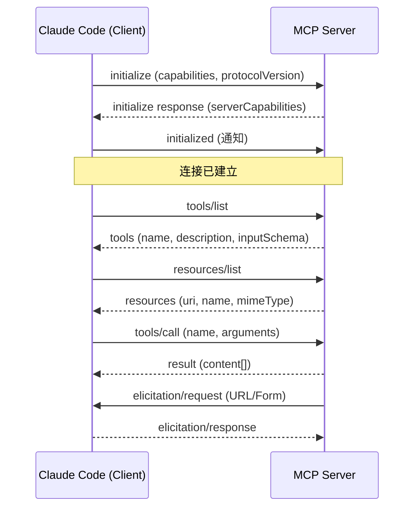
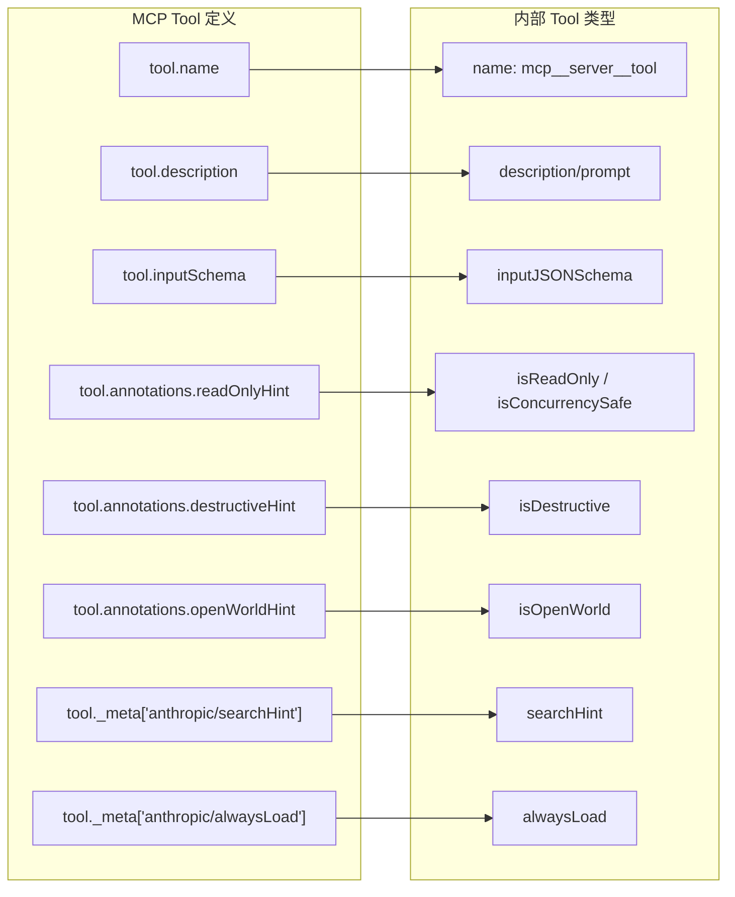
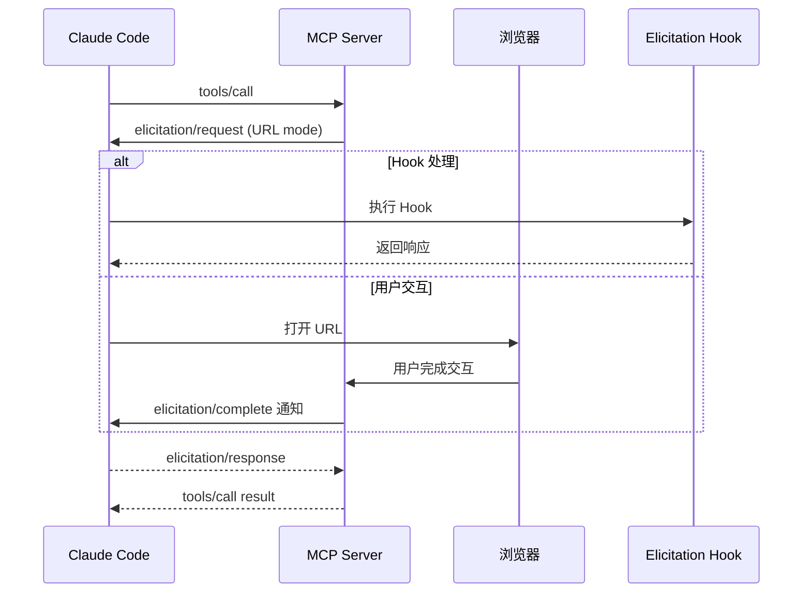

# 第 15 章：MCP 协议实现

Model Context Protocol（MCP）是 Claude Code 可扩展性的核心基础设施。通过 MCP，外部服务可以将自己的工具、资源和提示注入到 Claude 的能力空间中，使其能够操作数据库、调用 API、访问设计工具等几乎任何外部系统。本章将深入 `src/services/mcp/client.ts` 这个超过 3300 行的协议引擎，解析其连接管理、工具转换和资源系统的完整实现。

## 15.1 MCP 协议概述

MCP 建立在 JSON-RPC 2.0 之上，通过多种传输层（Transport）承载消息。其核心思想是将 AI 工具调用抽象为标准化的请求-响应协议，使得工具提供者和 AI 客户端可以独立演进。

协议的基本交互模式：



Claude Code 作为 MCP 客户端，使用 `@modelcontextprotocol/sdk` 官方 SDK 实现协议层。但在 SDK 之上，Claude Code 构建了大量的工程逻辑：连接池管理、认证处理、工具类型转换、输出截断、错误恢复等。

## 15.2 七种传输层

Claude Code 支持多种 MCP 传输层，覆盖了从本地进程到远程服务的完整场景。

### 15.2.1 stdio 传输

最基础的传输方式——启动一个子进程，通过标准输入/输出传递 JSON-RPC 消息：

```typescript
// src/services/mcp/client.ts (connectToServer 函数内)
if (!serverRef.type || serverRef.type === 'stdio') {
  transport = new StdioClientTransport({
    command: serverRef.command,
    args: serverRef.args,
    env: { ...subprocessEnv(), ...expandedEnv },
    cwd: getOriginalCwd(),
  })
}
```

stdio 是本地 MCP 服务器的首选传输。它的优势是简单、安全（进程隔离）、不需要网络端口。

### 15.2.2 SSE 传输（Server-Sent Events）

用于远程 HTTP MCP 服务器的旧式传输：

```typescript
if (serverRef.type === 'sse') {
  const authProvider = new ClaudeAuthProvider(name, serverRef)
  const combinedHeaders = await getMcpServerHeaders(name, serverRef)

  const transportOptions: SSEClientTransportOptions = {
    authProvider,
    fetch: wrapFetchWithTimeout(
      wrapFetchWithStepUpDetection(createFetchWithInit(), authProvider),
    ),
    requestInit: {
      headers: {
        'User-Agent': getMCPUserAgent(),
        ...combinedHeaders,
      },
    },
  }

  // EventSource 连接不能使用超时包装——它是长连接
  transportOptions.eventSourceInit = {
    fetch: async (url, init) => {
      const authHeaders: Record<string, string> = {}
      const tokens = await authProvider.tokens()
      if (tokens) {
        authHeaders.Authorization = `Bearer ${tokens.access_token}`
      }
      return fetch(url, { ...init, ...proxyOptions, headers: {
        'User-Agent': getMCPUserAgent(),
        ...authHeaders, ...init?.headers, ...combinedHeaders,
        Accept: 'text/event-stream',
      }})
    },
  }

  transport = new SSEClientTransport(new URL(serverRef.url), transportOptions)
}
```

SSE 传输的关键设计：POST 请求使用超时包装（60 秒），但 EventSource 连接（GET）不使用——因为 SSE 流是持久连接，加超时会错误地断开它。

### 15.2.3 HTTP Streamable 传输

这是 MCP 2025-03-26 规范定义的新一代传输：

```typescript
// MCP Streamable HTTP 规范要求客户端声明接受 JSON 和 SSE
const MCP_STREAMABLE_HTTP_ACCEPT = 'application/json, text/event-stream'
```

HTTP Streamable 传输统一了请求-响应和流式通知，是 SSE 传输的演进版本。

### 15.2.4 WebSocket 传输

用于需要全双工通信的场景，特别是 IDE 集成：

```typescript
if (serverRef.type === 'ws-ide') {
  const tlsOptions = getWebSocketTLSOptions()
  const wsHeaders = {
    'User-Agent': getMCPUserAgent(),
    ...(serverRef.authToken && {
      'X-Claude-Code-Ide-Authorization': serverRef.authToken,
    }),
  }
  // Bun 和 Node.js ws 模块的差异处理
  let wsClient: WsClientLike
  if (typeof Bun !== 'undefined') {
    // Bun WebSocket
  } else {
    wsClient = await createNodeWsClient(url, { headers: wsHeaders, ...tlsOptions })
  }
  transport = new WebSocketTransport(wsClient)
}
```

### 15.2.5 SDK 传输

用于同进程的 MCP 服务器（如 Agent SDK 嵌入场景）：

```typescript
if (serverRef.type === 'sdk') {
  transport = new SdkControlClientTransport(serverRef)
}
```

### 15.2.6 IDE 变体（sse-ide, ws-ide）

IDE 传输是 SSE 和 WebSocket 的简化版本，去掉了 OAuth 认证层，因为 IDE 服务器运行在本地，通过锁文件或 token 进行身份验证。

### 15.2.7 claudeai-proxy 传输

这是 claude.ai 网页版的代理传输，通过 Anthropic 的基础设施中转 MCP 请求：

```typescript
export function createClaudeAiProxyFetch(innerFetch: FetchLike): FetchLike {
  return async (url, init) => {
    const doRequest = async () => {
      await checkAndRefreshOAuthTokenIfNeeded()
      const currentTokens = getClaudeAIOAuthTokens()
      if (!currentTokens) throw new Error('No claude.ai OAuth token available')
      const headers = new Headers(init?.headers)
      headers.set('Authorization', `Bearer ${currentTokens.accessToken}`)
      const response = await innerFetch(url, { ...init, headers })
      return { response, sentToken: currentTokens.accessToken }
    }

    const { response, sentToken } = await doRequest()
    if (response.status !== 401) return response

    // 401 重试逻辑
    const tokenChanged = await handleOAuth401Error(sentToken).catch(() => false)
    if (!tokenChanged) {
      const now = getClaudeAIOAuthTokens()?.accessToken
      if (!now || now === sentToken) return response
    }
    try {
      return (await doRequest()).response
    } catch {
      return response // 重试失败，返回原始 401
    }
  }
}
```

401 重试逻辑的设计值得研究：它精确地捕获了发送时使用的 token，避免在并发 401 场景下出现 ABA 问题——另一个连接器可能已经在你检查之前刷新了 token。

## 15.3 客户端实现

### 15.3.1 连接管理

连接建立使用了 memoize 模式，确保每个服务器只维护一个连接：

```typescript
export const connectToServer = memoize(
  async (name: string, serverRef: ScopedMcpServerConfig, serverStats?):
    Promise<MCPServerConnection> => {
    const connectStartTime = Date.now()
    try {
      let transport
      // ... 根据 serverRef.type 创建传输层

      // 创建 MCP SDK Client
      const client = new Client(
        { name: 'claude-code', version: '...' },
        { capabilities: { ... } },
      )

      await client.connect(transport)

      return {
        name, type: 'connected', client,
        capabilities: client.getServerCapabilities(),
        config: serverRef,
      }
    } catch (error) {
      // 认证失败 -> needs-auth
      // 其他失败 -> error
    }
  },
  (name, serverRef) => getServerCacheKey(name, serverRef),
)
```

memoize 的 key 是服务器名称和完整配置的 JSON 序列化——这确保了同名但不同配置的服务器不会共用连接。

### 15.3.2 连接批次控制

```typescript
export function getMcpServerConnectionBatchSize(): number {
  return parseInt(process.env.MCP_SERVER_CONNECTION_BATCH_SIZE || '', 10) || 3
}

function getRemoteMcpServerConnectionBatchSize(): number {
  return parseInt(process.env.MCP_REMOTE_SERVER_CONNECTION_BATCH_SIZE || '', 10) || 20
}
```

本地服务器（stdio）的并发连接限制为 3——因为每个连接都会启动子进程，过多的并发进程会拖慢系统。远程服务器的限制为 20——网络请求的开销更小。

### 15.3.3 会话过期与重连

```typescript
export function isMcpSessionExpiredError(error: Error): boolean {
  const httpStatus =
    'code' in error ? (error as Error & { code?: number }).code : undefined
  if (httpStatus !== 404) return false
  return (
    error.message.includes('"code":-32001') ||
    error.message.includes('"code": -32001')
  )
}
```

MCP 规范要求服务器在会话过期时返回 HTTP 404 + JSON-RPC 错误码 -32001。客户端同时检查两个信号来避免误判——普通的 404（错误 URL、服务器宕机）不会触发重连逻辑。

## 15.4 工具转换

MCP 服务器返回的工具定义需要转换为 Claude Code 内部的 `Tool` 类型。这个转换过程发生在 `fetchToolsForClient` 中。

### 15.4.1 工具名称构建

```typescript
// src/services/mcp/mcpStringUtils.ts
export function buildMcpToolName(serverName: string, toolName: string): string {
  return `${getMcpPrefix(serverName)}${normalizeNameForMCP(toolName)}`
}

export function getMcpPrefix(serverName: string): string {
  return `mcp__${normalizeNameForMCP(serverName)}__`
}
```

MCP 工具名称遵循 `mcp__<server>__<tool>` 的三段式格式。这个设计确保了：
1. 不同服务器的同名工具不会冲突
2. 权限规则可以在服务器级别批量控制
3. 用户可以通过命名约定理解工具来源

### 15.4.2 工具属性映射

```typescript
export const fetchToolsForClient = memoizeWithLRU(
  async (client: MCPServerConnection): Promise<Tool[]> => {
    // ...
    return toolsToProcess.map((tool): Tool => {
      const fullyQualifiedName = buildMcpToolName(client.name, tool.name)
      return {
        ...MCPTool,
        name: skipPrefix ? tool.name : fullyQualifiedName,
        mcpInfo: { serverName: client.name, toolName: tool.name },
        isMcp: true,

        // MCP annotations → 内部属性
        searchHint: typeof tool._meta?.['anthropic/searchHint'] === 'string'
          ? tool._meta['anthropic/searchHint'].replace(/\s+/g, ' ').trim() || undefined
          : undefined,
        alwaysLoad: tool._meta?.['anthropic/alwaysLoad'] === true,

        isConcurrencySafe() { return tool.annotations?.readOnlyHint ?? false },
        isReadOnly() { return tool.annotations?.readOnlyHint ?? false },
        isDestructive() { return tool.annotations?.destructiveHint ?? false },
        isOpenWorld() { return tool.annotations?.openWorldHint ?? false },

        inputJSONSchema: tool.inputSchema as Tool['inputJSONSchema'],

        async checkPermissions() {
          return {
            behavior: 'passthrough' as const,
            message: 'MCPTool requires permission.',
            suggestions: [{
              type: 'addRules' as const,
              rules: [{ toolName: fullyQualifiedName, ruleContent: undefined }],
              behavior: 'allow' as const,
              destination: 'localSettings' as const,
            }],
          }
        },
        // ...
      }
    })
  },
  (client) => client.name,
  MCP_FETCH_CACHE_SIZE,
)
```

转换的关键映射关系：



MCP 工具的 `checkPermissions` 默认返回 `passthrough`——意味着 MCP 工具没有自定义的权限逻辑，完全依赖全局的规则系统。同时它提供了一个 `suggestion`，建议用户将该工具添加到本地设置的 allow 列表中。

### 15.4.3 工具描述截断

```typescript
const MAX_MCP_DESCRIPTION_LENGTH = 2048

async prompt() {
  const desc = tool.description ?? ''
  return desc.length > MAX_MCP_DESCRIPTION_LENGTH
    ? desc.slice(0, MAX_MCP_DESCRIPTION_LENGTH) + '... [truncated]'
    : desc
}
```

OpenAPI 生成的 MCP 服务器经常把完整的端点文档（15-60KB）塞进工具描述。2048 字符的截断限制在保留核心意图的同时，防止上下文窗口被淹没。

### 15.4.4 工具调用与会话恢复

```typescript
async call(args, context, _canUseTool, parentMessage, onProgress?) {
  const MAX_SESSION_RETRIES = 1
  for (let attempt = 0; ; attempt++) {
    try {
      const connectedClient = await ensureConnectedClient(client)
      const mcpResult = await callMCPToolWithUrlElicitationRetry({
        client: connectedClient, clientConnection: client,
        tool: tool.name, args, meta,
        signal: context.abortController.signal,
        setAppState: context.setAppState,
        onProgress: ...,
        handleElicitation: context.handleElicitation,
      })
      // 处理结果...
    } catch (error) {
      if (attempt < MAX_SESSION_RETRIES && isMcpSessionExpiredError(error)) {
        // 清除缓存，重新连接
        connectToServer.cache.delete(key)
        fetchToolsForClient.cache.delete(name)
        continue
      }
      throw error
    }
  }
}
```

会话过期时自动重连一次。重连前清除所有相关缓存（连接、工具列表、资源列表），确保下次使用全新的连接状态。

## 15.5 资源系统

MCP 资源让服务器向 Claude 暴露结构化数据（文件、数据库记录、API 响应等）。

```typescript
export const fetchResourcesForClient = memoizeWithLRU(
  async (client: MCPServerConnection): Promise<ServerResource[]> => {
    if (client.type !== 'connected') return []

    try {
      if (!client.capabilities?.resources) return []

      const result = await client.client.request(
        { method: 'resources/list' },
        ListResourcesResultSchema,
      )

      if (!result.resources) return []
      return result.resources.map(resource => ({
        ...resource,
        server: client.name,  // 附加服务器名称
      }))
    } catch (error) {
      logMCPError(client.name, `Failed to fetch resources: ${errorMessage(error)}`)
      return []
    }
  },
  (client) => client.name,
  MCP_FETCH_CACHE_SIZE,
)
```

资源获取使用 LRU 缓存来避免重复请求。每个资源被标注了来源服务器名称，方便后续的权限检查和 UI 展示。

MCP Prompt 同样被转换为 Claude Code 的 Command 系统：

```typescript
export const fetchCommandsForClient = memoizeWithLRU(
  async (client: MCPServerConnection): Promise<Command[]> => {
    // ...
    return promptsToProcess.map(prompt => ({
      type: 'prompt' as const,
      name: 'mcp__' + normalizeNameForMCP(client.name) + '__' + prompt.name,
      description: prompt.description ?? '',
      isMcp: true,
      source: 'mcp',
      async getPromptForCommand(args) {
        const connectedClient = await ensureConnectedClient(client)
        const result = await connectedClient.client.getPrompt({
          name: prompt.name,
          arguments: zipObject(argNames, argsArray),
        })
        return result.messages.map(message =>
          transformResultContent(message.content, connectedClient.name),
        ).flat()
      },
    }))
  },
)
```

## 15.6 进度流与 Elicitation

### 15.6.1 进度报告

MCP 工具在执行过程中可以报告进度：

```typescript
if (onProgress && toolUseId) {
  onProgress({
    toolUseID: toolUseId,
    data: {
      type: 'mcp_progress',
      status: 'started',
      serverName: client.name,
      toolName: tool.name,
    },
  })
}

// ... 执行完成后
onProgress({
  toolUseID: toolUseId,
  data: {
    type: 'mcp_progress',
    status: 'completed',
    serverName: client.name,
    toolName: tool.name,
    elapsedTimeMs: Date.now() - startTime,
  },
})
```

### 15.6.2 Elicitation 机制

Elicitation 是 MCP 的一种交互模式，允许服务器在工具执行过程中请求用户输入。有两种模式：

```typescript
// src/services/mcp/elicitationHandler.ts
function getElicitationMode(params: ElicitRequestParams): 'form' | 'url' {
  return params.mode === 'url' ? 'url' : 'form'
}
```

**URL 模式**：服务器提供一个 URL（通常是 OAuth 回调页面），Claude Code 打开浏览器让用户完成交互，然后等待完成通知：

```typescript
export type ElicitationRequestEvent = {
  serverName: string
  requestId: string | number
  params: ElicitRequestParams
  signal: AbortSignal
  respond: (response: ElicitResult) => void
  waitingState?: ElicitationWaitingState
  onWaitingDismiss?: (action: 'dismiss' | 'retry' | 'cancel') => void
  completed?: boolean
}
```

**Form 模式**：服务器定义一个表单 Schema，Claude Code 在终端中渲染交互式表单，收集用户输入后返回。

Elicitation 还支持 Hook 拦截，允许自动化环境在不需要人工交互的情况下处理 elicitation 请求：

```typescript
export function registerElicitationHandler(
  client: Client,
  serverName: string,
  setAppState: (f: (prevState: AppState) => AppState) => void,
): void {
  try {
    client.setRequestHandler(ElicitRequestSchema, async (request, extra) => {
      // 首先运行 Hook
      // 如果 Hook 提供了响应，直接返回
      // 否则显示 UI 让用户交互
    })
  } catch { /* 服务器未声明 elicitation 能力 */ }
}
```

完成通知使用专门的 `ElicitationCompleteNotificationSchema` 处理，通过 `elicitationId` 将完成事件关联到等待中的 elicitation 请求。



这种设计实现了 MCP 协议的完整交互能力——工具不仅可以被动地接收输入、返回结果，还可以在执行过程中主动请求额外信息，打开浏览器进行身份验证，或展示表单收集配置参数。
