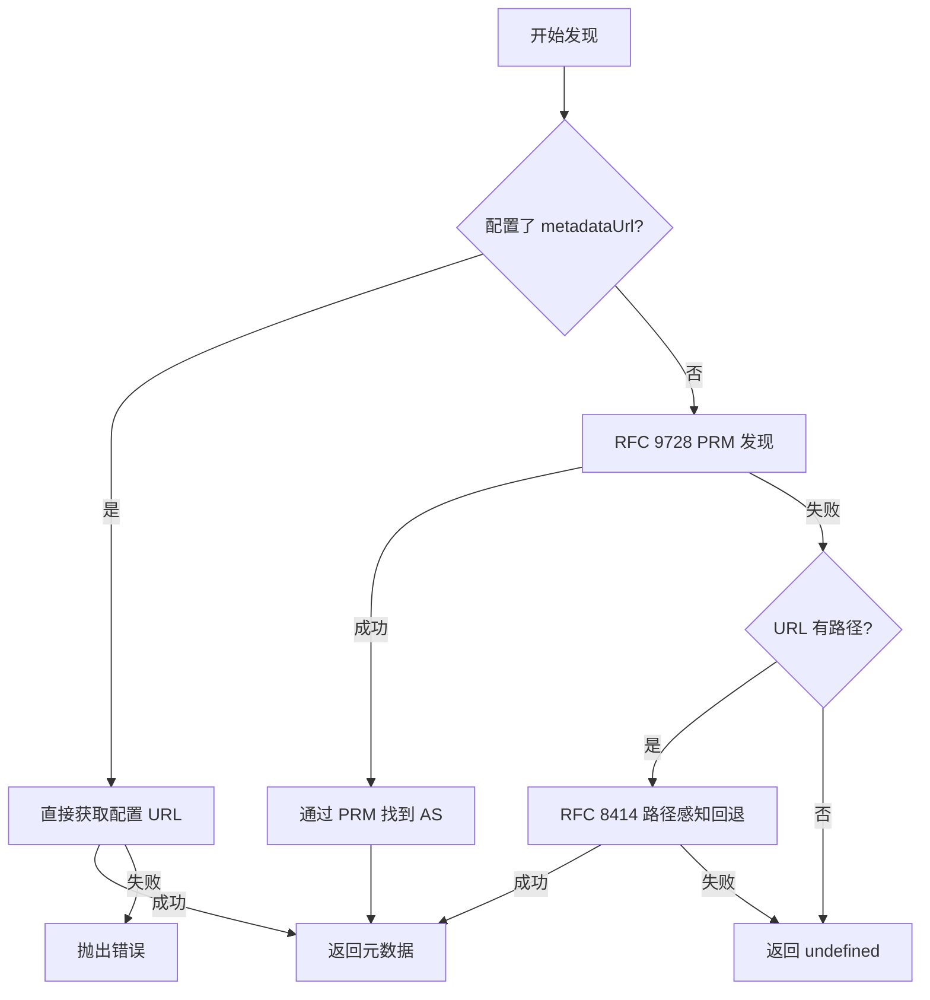
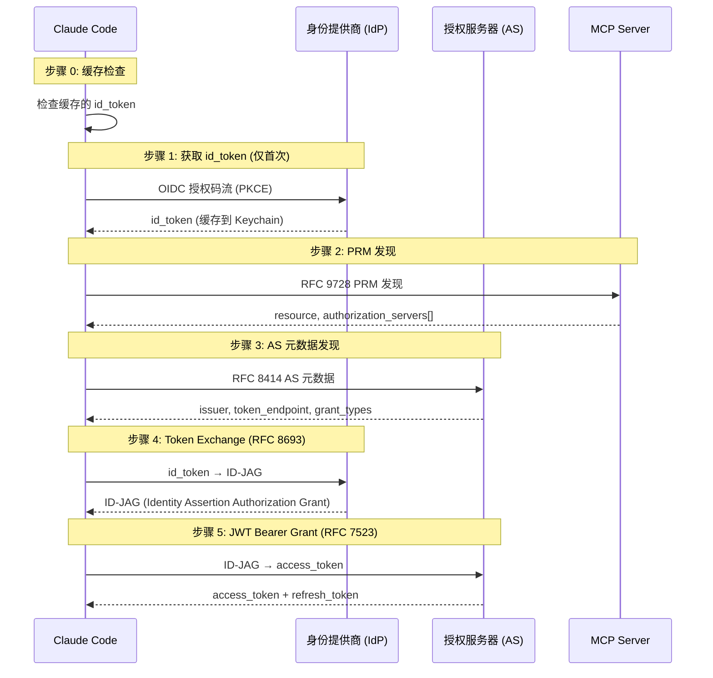
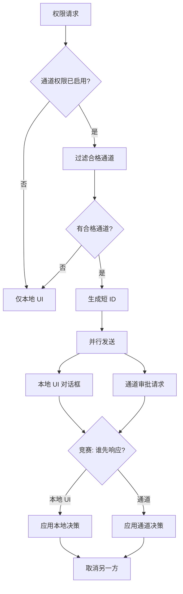

# 第 16 章：MCP 认证体系

远程 MCP 服务器需要认证机制来保护其暴露的工具和资源。Claude Code 实现了一个完整的 OAuth 2.0 认证体系，支持从基本的授权码流到企业级的跨账户访问（XAA）。本章将深入 `src/services/mcp/auth.ts` 和 `xaa.ts`，剖析这一认证体系的每个层面。

## 16.1 OAuth 授权流

### 16.1.1 ClaudeAuthProvider 架构

`ClaudeAuthProvider` 是 MCP SDK 的 `OAuthClientProvider` 接口的完整实现，它管理了一个 MCP 服务器连接的完整 OAuth 生命周期：

```typescript
// src/services/mcp/auth.ts
export class ClaudeAuthProvider implements OAuthClientProvider {
  private serverName: string
  private serverConfig: McpSSEServerConfig | McpHTTPServerConfig
  private redirectUri: string
  private _codeVerifier?: string
  private _authorizationUrl?: string
  private _state?: string
  private _scopes?: string
  private _metadata?: Awaited<ReturnType<typeof discoverAuthorizationServerMetadata>>
  private _refreshInProgress?: Promise<OAuthTokens | undefined>
  private _pendingStepUpScope?: string

  constructor(
    serverName: string,
    serverConfig: McpSSEServerConfig | McpHTTPServerConfig,
    redirectUri: string = buildRedirectUri(),
    handleRedirection = false,
    onAuthorizationUrl?: (url: string) => void,
    skipBrowserOpen?: boolean,
  ) {
    this.serverName = serverName
    this.serverConfig = serverConfig
    this.redirectUri = redirectUri
    this.handleRedirection = handleRedirection
    this.onAuthorizationUrlCallback = onAuthorizationUrl
    this.skipBrowserOpen = skipBrowserOpen ?? false
  }
```

设计要点：
1. `_refreshInProgress` 使用 Promise 作为锁——当一个 token 刷新正在进行时，并发请求等待同一个 Promise 而不是各自发起刷新
2. `_pendingStepUpScope` 支持 OAuth Step-Up 认证——当服务器要求更高权限（scope elevation）时，标记待提升的 scope

### 16.1.2 客户端元数据与 CIMD

```typescript
get clientMetadata(): OAuthClientMetadata {
  const metadata: OAuthClientMetadata = {
    client_name: `Claude Code (${this.serverName})`,
    redirect_uris: [this.redirectUri],
    grant_types: ['authorization_code', 'refresh_token'],
    response_types: ['code'],
    token_endpoint_auth_method: 'none', // 公共客户端
  }
  const metadataScope = getScopeFromMetadata(this._metadata)
  if (metadataScope) {
    metadata.scope = metadataScope
  }
  return metadata
}

// CIMD (SEP-991): URL 形式的 client_id
get clientMetadataUrl(): string | undefined {
  const override = process.env.MCP_OAUTH_CLIENT_METADATA_URL
  if (override) return override
  return MCP_CLIENT_METADATA_URL
}
```

Claude Code 使用 `token_endpoint_auth_method: 'none'` 声明自己为公共客户端（Public Client）——因为 CLI 工具无法安全地存储 client_secret。CIMD（Client ID Metadata Document，SEP-991）允许使用 URL 作为 client_id，这是 MCP 生态的一个重要创新。

### 16.1.3 授权服务器发现

```typescript
async function fetchAuthServerMetadata(
  serverName: string,
  serverUrl: string,
  configuredMetadataUrl: string | undefined,
  fetchFn?: FetchLike,
  resourceMetadataUrl?: URL,
): Promise<...> {
  if (configuredMetadataUrl) {
    // 用户配置的元数据 URL
    if (!configuredMetadataUrl.startsWith('https://')) {
      throw new Error(`authServerMetadataUrl must use https://`)
    }
    const authFetch = fetchFn ?? createAuthFetch()
    const response = await authFetch(configuredMetadataUrl, { ... })
    return OAuthMetadataSchema.parse(await response.json())
  }

  try {
    // RFC 9728: Protected Resource Metadata → 发现授权服务器
    const { authorizationServerMetadata } = await discoverOAuthServerInfo(serverUrl, {
      ...(fetchFn && { fetchFn }),
      ...(resourceMetadataUrl && { resourceMetadataUrl }),
    })
    if (authorizationServerMetadata) return authorizationServerMetadata
  } catch (err) {
    logMCPDebug(serverName, `RFC 9728 discovery failed, falling back: ${errorMessage(err)}`)
  }

  // 回退: RFC 8414 路径感知发现
  const url = new URL(serverUrl)
  if (url.pathname === '/') return undefined
  return discoverAuthorizationServerMetadata(url, { ...(fetchFn && { fetchFn }) })
}
```

发现流程遵循三步回退策略：



### 16.1.4 本地回调服务器

OAuth 授权码流需要一个本地 HTTP 服务器来接收回调：

```typescript
// src/services/mcp/oauthPort.ts
export function buildRedirectUri(port?: number): string {
  return `http://127.0.0.1:${port || findAvailablePort()}/callback`
}
```

回调服务器在 `127.0.0.1` 上监听，接收授权码并用它交换 access token。端口号动态分配以避免冲突。

### 16.1.5 OAuth 错误规范化

某些 OAuth 服务器（特别是 Slack）不遵守标准的错误响应格式：

```typescript
// src/services/mcp/auth.ts
const NONSTANDARD_INVALID_GRANT_ALIASES = new Set([
  'invalid_refresh_token',
  'expired_refresh_token',
  'token_expired',
])

export async function normalizeOAuthErrorBody(response: Response): Promise<Response> {
  if (!response.ok) return response
  const text = await response.text()
  let parsed: unknown
  try { parsed = jsonParse(text) } catch { return new Response(text, response) }

  // 如果是有效的 token 响应，直接返回
  if (OAuthTokensSchema.safeParse(parsed).success) {
    return new Response(text, response)
  }

  // 检查是否是错误响应包装在 200 中
  const result = OAuthErrorResponseSchema.safeParse(parsed)
  if (!result.success) return new Response(text, response)

  // 规范化非标准错误码
  const normalized = NONSTANDARD_INVALID_GRANT_ALIASES.has(result.data.error)
    ? { error: 'invalid_grant', error_description: `...` }
    : result.data

  return new Response(jsonStringify(normalized), {
    status: 400, statusText: 'Bad Request',
    headers: response.headers,
  })
}
```

Slack 等服务器返回 HTTP 200 + `{"error":"invalid_refresh_token"}`，而 RFC 6749 规定应该返回 HTTP 400 + `{"error":"invalid_grant"}`。这个规范化层将非标准响应转换为标准格式，确保 SDK 的错误处理逻辑正确工作。

## 16.2 Token 管理

### 16.2.1 安全存储

Token 通过 `SecureStorage` 接口存储，在 macOS 上使用系统 Keychain：

```typescript
async tokens(): Promise<OAuthTokens | undefined> {
  const storage = getSecureStorage()
  const data = await storage.readAsync()
  const serverKey = getServerKey(this.serverName, this.serverConfig)
  const tokenData = data?.mcpOAuth?.[serverKey]
  // ...
}
```

存储 key 是服务器名称和配置哈希的组合，防止同名不同配置的服务器共享凭据：

```typescript
export function getServerKey(
  serverName: string,
  serverConfig: McpSSEServerConfig | McpHTTPServerConfig,
): string {
  const configJson = jsonStringify({
    type: serverConfig.type,
    url: serverConfig.url,
    headers: serverConfig.headers || {},
  })
  const hash = createHash('sha256').update(configJson).digest('hex').substring(0, 16)
  return `${serverName}|${hash}`
}
```

### 16.2.2 Token 刷新

Token 刷新有多层保护机制：

1. **锁文件**：使用文件锁防止多个 Claude Code 实例同时刷新
2. **重试策略**：区分瞬时错误（重试）和永久错误（失效）
3. **跨进程感知**：Keychain 缓存的 TTL 允许一个实例看到另一个实例的刷新结果

```typescript
// tokens() 方法中的性能注释
// 我们不在这里 clearKeychainCache()——tokens() 被 MCP SDK 的
// _commonHeaders 在每次请求中调用，强制 cache miss 会触发
// 30-40 次/秒的阻塞 spawnSync(`security find-generic-password`)
```

这条注释揭示了一个重要的性能考量：`tokens()` 在每次 MCP 请求中都被调用，如果每次都读取 Keychain 会导致严重的 CPU 消耗（在 CPU profile 中占到 7.2%）。

### 16.2.3 Token 撤销

```typescript
export async function revokeServerTokens(
  serverName: string,
  serverConfig: McpSSEServerConfig | McpHTTPServerConfig,
  { preserveStepUpState = false } = {},
): Promise<void> {
  // 1. 发现撤销端点
  const metadata = await fetchAuthServerMetadata(serverName, asUrl, ...)

  // 2. 先撤销 refresh_token（更重要——防止生成新的 access_token）
  if (tokenData.refreshToken) {
    await revokeToken({ ..., tokenTypeHint: 'refresh_token' })
  }

  // 3. 再撤销 access_token
  if (tokenData.accessToken) {
    await revokeToken({ ..., tokenTypeHint: 'access_token' })
  }

  // 4. 清除本地存储
  clearServerTokensFromLocalStorage(serverName, serverConfig)

  // 5. 可选保留 Step-Up 状态
  if (preserveStepUpState && tokenData.stepUpScope) {
    // 保留 scope 和 discovery 状态，方便下次认证
  }
}
```

撤销顺序很重要：先撤销 refresh_token，因为它是长期凭证。即使 access_token 撤销失败，只要 refresh_token 被撤销就无法生成新的 access_token。

RFC 7009 的两种认证方式都被支持：

```typescript
async function revokeToken({ endpoint, token, tokenTypeHint, clientId, clientSecret, ... }) {
  // 优先使用 client_secret_basic（RFC 7009 标准）
  if (clientId && clientSecret) {
    if (authMethod === 'client_secret_post') {
      params.set('client_id', clientId)
      params.set('client_secret', clientSecret)
    } else {
      const basic = Buffer.from(`${encodeURIComponent(clientId)}:${encodeURIComponent(clientSecret)}`).toString('base64')
      headers.Authorization = `Basic ${basic}`
    }
  }

  try {
    await axios.post(endpoint, params, { headers })
  } catch (error) {
    // 回退：某些非 RFC 7009 兼容的服务器需要 Bearer auth
    if (error.response?.status === 401 && accessToken) {
      params.delete('client_id')
      params.delete('client_secret')
      await axios.post(endpoint, params, {
        headers: { ...headers, Authorization: `Bearer ${accessToken}` },
      })
    }
  }
}
```

## 16.3 XAA 跨账户访问

Cross-App Access（XAA）是 MCP 认证体系中最精密的部分，它允许在不弹出浏览器的情况下获取 MCP 访问令牌。

### 16.3.1 XAA 协议链

XAA 基于三个 RFC 标准构建了一条 token 交换链：



### 16.3.2 XAA 核心实现

```typescript
// src/services/mcp/xaa.ts
export async function performCrossAppAccess(
  serverUrl: string,
  config: XaaConfig,
  serverName = 'xaa',
  abortSignal?: AbortSignal,
): Promise<XaaResult> {
  const fetchFn = makeXaaFetch(abortSignal)

  // Layer 2: PRM 发现
  const prm = await discoverProtectedResource(serverUrl, { fetchFn })

  // Layer 2: AS 发现（遍历所有广告的 AS，找到支持 jwt-bearer 的）
  let asMeta: AuthorizationServerMetadata | undefined
  for (const asUrl of prm.authorization_servers) {
    let candidate = await discoverAuthorizationServer(asUrl, { fetchFn })
    if (candidate.grant_types_supported &&
        !candidate.grant_types_supported.includes(JWT_BEARER_GRANT)) {
      continue
    }
    asMeta = candidate
    break
  }
  if (!asMeta) throw new Error('XAA: no authorization server supports jwt-bearer')

  // 选择认证方法
  const authMethods = asMeta.token_endpoint_auth_methods_supported
  const authMethod = authMethods &&
    !authMethods.includes('client_secret_basic') &&
    authMethods.includes('client_secret_post')
      ? 'client_secret_post' : 'client_secret_basic'

  // Layer 2: Token Exchange (id_token → ID-JAG)
  const jag = await requestJwtAuthorizationGrant({
    tokenEndpoint: config.idpTokenEndpoint,
    audience: asMeta.issuer,
    resource: prm.resource,
    idToken: config.idpIdToken,
    clientId: config.idpClientId,
    clientSecret: config.idpClientSecret,
    fetchFn,
  })

  // Layer 2: JWT Bearer Grant (ID-JAG → access_token)
  const tokens = await exchangeJwtAuthGrant({
    tokenEndpoint: asMeta.token_endpoint,
    assertion: jag.jwtAuthGrant,
    clientId: config.clientId,
    clientSecret: config.clientSecret,
    authMethod,
    fetchFn,
  })

  return { ...tokens, authorizationServerUrl: asMeta.issuer }
}
```

### 16.3.3 安全验证

XAA 实现了多层安全验证：

**RFC 9728 资源不匹配保护**：
```typescript
export async function discoverProtectedResource(serverUrl: string, opts?): Promise<...> {
  const prm = await discoverOAuthProtectedResourceMetadata(serverUrl, ...)
  if (normalizeUrl(prm.resource) !== normalizeUrl(serverUrl)) {
    throw new Error(`XAA: PRM resource mismatch: expected ${serverUrl}, got ${prm.resource}`)
  }
  return { resource: prm.resource, authorization_servers: prm.authorization_servers }
}
```

**RFC 8414 发行者不匹配保护**：
```typescript
export async function discoverAuthorizationServer(asUrl: string, opts?): Promise<...> {
  if (normalizeUrl(meta.issuer) !== normalizeUrl(asUrl)) {
    throw new Error(`XAA: issuer mismatch: expected ${asUrl}, got ${meta.issuer}`)
  }
  // HTTPS 强制
  if (new URL(meta.token_endpoint).protocol !== 'https:') {
    throw new Error(`XAA: refusing non-HTTPS token endpoint: ${meta.token_endpoint}`)
  }
}
```

**Token 泄露防护**：
```typescript
const SENSITIVE_TOKEN_RE =
  /"(access_token|refresh_token|id_token|assertion|subject_token|client_secret)"\s*:\s*"[^"]*"/g

function redactTokens(raw: unknown): string {
  const s = typeof raw === 'string' ? raw : jsonStringify(raw)
  return s.replace(SENSITIVE_TOKEN_RE, (_, k) => `"${k}":"[REDACTED]"`)
}
```

所有包含 token 的日志输出都经过 `redactTokens` 处理，确保调试日志不会泄露敏感凭据。正则表达式匹配六种 token 相关字段，无论 JSON 嵌套深度如何。

### 16.3.4 错误分类与 id_token 缓存策略

`XaaTokenExchangeError` 携带了是否应该清除缓存 id_token 的信息：

```typescript
export class XaaTokenExchangeError extends Error {
  readonly shouldClearIdToken: boolean
  constructor(message: string, shouldClearIdToken: boolean) {
    super(message)
    this.name = 'XaaTokenExchangeError'
    this.shouldClearIdToken = shouldClearIdToken
  }
}
```

- **4xx 错误**（invalid_grant 等）：id_token 被拒绝，清除缓存
- **5xx 错误**：IdP 暂时不可用，id_token 可能仍有效，保留缓存
- **200 但格式错误**：协议违规，清除缓存

## 16.4 IdP 集成

`xaaIdpLogin.ts` 管理与身份提供商（Identity Provider）的集成。

### 16.4.1 OIDC 发现

```typescript
// src/services/mcp/xaaIdpLogin.ts
export async function discoverOidc(issuer: string): Promise<OidcDiscovery> {
  // 标准 OIDC 发现：/.well-known/openid-configuration
  // 返回 authorization_endpoint, token_endpoint 等
}
```

### 16.4.2 id_token 生命周期

id_token 的获取和缓存遵循以下流程：

1. 首次使用时通过 OIDC 授权码流（带 PKCE）获取 id_token
2. id_token 缓存到系统 Keychain，按 IdP issuer 键控
3. 后续的 XAA 请求直接使用缓存的 id_token
4. 如果 id_token 过期或被拒绝，重新发起 OIDC 流程

这个设计的关键优势是**一次浏览器登录即可访问所有 XAA 配置的 MCP 服务器**——id_token 是按 IdP 缓存的，而非按 MCP 服务器。

### 16.4.3 XAA 配置

```typescript
export type XaaConfig = {
  clientId: string       // MCP 服务器 AS 的 client_id
  clientSecret: string   // MCP 服务器 AS 的 client_secret
  idpClientId: string    // IdP 的 client_id
  idpClientSecret?: string // IdP 的 client_secret（可选）
  idpIdToken: string     // 用户的 id_token
  idpTokenEndpoint: string // IdP 的 token endpoint
}
```

注意 IdP client_secret 是可选的——某些 IdP 将 Claude Code 注册为 Public Client，只需要 PKCE 而不需要 secret。

## 16.5 通道权限

`channelPermissions.ts` 实现了通过外部通道（如 Telegram）进行权限审批的机制。

### 16.5.1 通道权限架构

```typescript
// src/services/mcp/channelPermissions.ts
export type ChannelPermissionCallbacks = {
  onResponse(requestId: string, handler: (response: ChannelPermissionResponse) => void): () => void
  resolve(requestId: string, behavior: 'allow' | 'deny', fromServer: string): boolean
}
```

当 Claude Code 遇到权限请求时，它不仅显示本地 UI 对话框，还同时通过活跃的通道 MCP 服务器发送审批请求。第一个响应者（本地 UI 或远程通道）获胜。

### 16.5.2 短 ID 生成

```typescript
const ID_ALPHABET = 'abcdefghijkmnopqrstuvwxyz'  // 25 字母，无 'l'

export function shortRequestId(toolUseID: string): string {
  let candidate = hashToId(toolUseID)
  for (let salt = 0; salt < 10; salt++) {
    if (!ID_AVOID_SUBSTRINGS.some(bad => candidate.includes(bad))) {
      return candidate
    }
    candidate = hashToId(`${toolUseID}:${salt}`)
  }
  return candidate
}
```

短 ID 的设计考虑周到：
- 使用 25 个字母（排除了 `l`，因为它在很多字体中与 `1`/`I` 混淆）
- 5 字母给出 25^5 = 9.8M 的空间，对单会话内的并发请求绰绰有余
- 纯字母避免手机用户切换键盘模式
- 脏词过滤确保 ID 可以安全地出现在手机短信中

### 16.5.3 通道能力检查

```typescript
export function filterPermissionRelayClients<T extends {
  type: string; name: string;
  capabilities?: { experimental?: Record<string, unknown> }
}>(
  clients: readonly T[],
  isInAllowlist: (name: string) => boolean,
): (T & { type: 'connected' })[] {
  return clients.filter(
    (c): c is T & { type: 'connected' } =>
      c.type === 'connected' &&
      isInAllowlist(c.name) &&
      c.capabilities?.experimental?.['claude/channel'] !== undefined &&
      c.capabilities?.experimental?.['claude/channel/permission'] !== undefined,
  )
}
```

一个 MCP 服务器必须同时满足四个条件才能成为权限审批通道：
1. 已连接状态
2. 在会话的 `--channels` 允许列表中
3. 声明了 `claude/channel` 能力
4. 声明了 `claude/channel/permission` 能力

第四个条件是服务器的**显式 opt-in**——一个聊天中继通道不会因为它能转发消息就自动成为权限审批表面。源码注释中引用了一位安全审查者的顾虑："users may be unpleasantly surprised"，这个四重检查就是对此的回应。

### 16.5.4 安全边界分析

源码注释中的安全分析值得完整引用：

```typescript
/**
 * Kenneth's "would this let Claude self-approve?": the approving party is
 * the human via the channel, not Claude. But the trust boundary isn't the
 * terminal — it's the allowlist (tengu_harbor_ledger). A compromised
 * channel server CAN fabricate "yes <id>" without the human seeing the
 * prompt. Accepted risk: a compromised channel already has unlimited
 * conversation-injection turns (social-engineer over time, wait for
 * acceptEdits, etc.); inject-then-self-approve is faster, not more
 * capable. The dialog slows a compromised channel; it doesn't stop one.
 */
```

这段分析承认了一个已接受的风险：被入侵的通道服务器可以伪造审批。但它论证了这不会**增加**攻击者的能力——一个已入侵的通道已经可以注入任意对话内容，等待 acceptEdits 模式后执行任意操作。权限对话框增加了攻击的延迟，但不能阻止已经控制了通道的攻击者。

通道权限的回复格式使用结构化事件而非文本匹配：

```typescript
// CC 生成 ID 并发送提示
// 服务器解析用户回复 "yes tbxkq"
// 服务器发送结构化事件：notifications/claude/channel/permission
//   { request_id: "tbxkq", behavior: "allow" }
// CC 匹配 pending map，不做文本正则匹配
```

CC 永远不对通道中的文本做正则匹配——只接受服务器发送的结构化事件。这确保了通道中的普通对话文本不会意外触发权限审批。



整个 MCP 认证体系展现了对真实世界复杂性的深刻理解：OAuth 服务器的非标准行为、跨进程的 token 管理、企业级的 IdP 集成、移动通道的安全模型。每一层都在标准协议的基础上增加了防御性工程，确保在各种边界条件下仍能正确运作。
