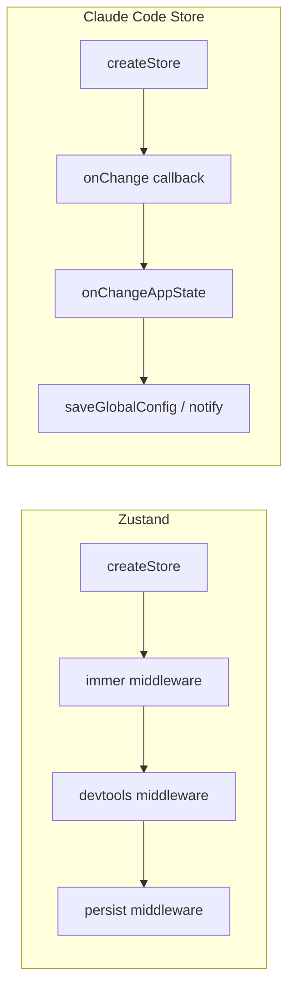
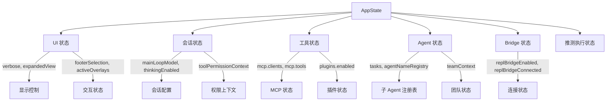
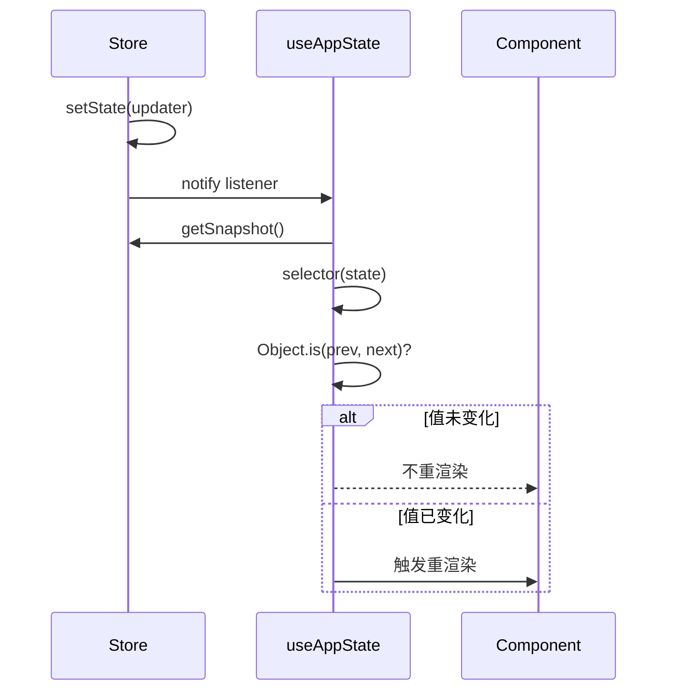
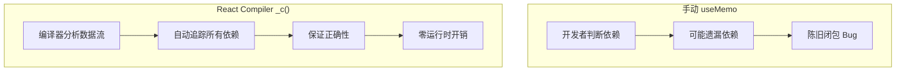
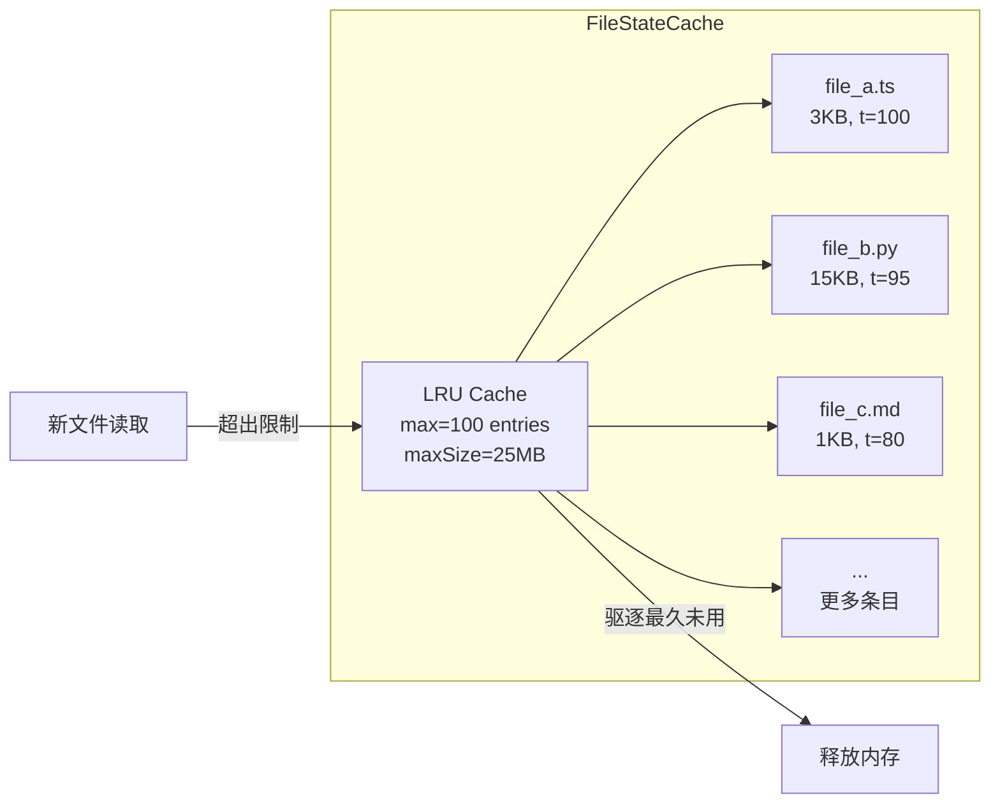

# 第 17 章：状态管理

> "状态是程序的记忆，而如何组织这份记忆，决定了整个系统的可维护性。"

Claude Code 的状态管理体系是一套精心设计的响应式架构。它没有依赖 Redux 等重量级框架，而是从零构建了一个轻量级的 Zustand 风格 Store，配合 React 18 的 `useSyncExternalStore` 实现精准的响应式订阅。本章将深入剖析这一架构的每个层面。

## 17.1 React Store 模式 —— createStore 工厂

### 17.1.1 核心实现

Claude Code 的状态管理基石位于 `src/state/store.ts`，这是一个仅 34 行的微型 Store 实现。其简洁程度令人惊叹，却蕴含了响应式系统的全部本质：

```typescript
// src/state/store.ts
type Listener = () => void
type OnChange<T> = (args: { newState: T; oldState: T }) => void

export type Store<T> = {
  getState: () => T
  setState: (updater: (prev: T) => T) => void
  subscribe: (listener: Listener) => () => void
}

export function createStore<T>(
  initialState: T,
  onChange?: OnChange<T>,
): Store<T> {
  let state = initialState
  const listeners = new Set<Listener>()

  return {
    getState: () => state,

    setState: (updater: (prev: T) => T) => {
      const prev = state
      const next = updater(prev)
      if (Object.is(next, prev)) return
      state = next
      onChange?.({ newState: next, oldState: prev })
      for (const listener of listeners) listener()
    },

    subscribe: (listener: Listener) => {
      listeners.add(listener)
      return () => listeners.delete(listener)
    },
  }
}
```

这段代码看似简单，但每一行都经过深思熟虑。让我们逐一分析其设计决策。

### 17.1.2 设计决策解析

**函数式更新器模式**。`setState` 接受一个 `(prev: T) => T` 函数而非直接的新状态值。这是一个关键的设计选择 —— 它保证了并发更新的正确性。当多个组件同时修改状态时，每个更新器都基于最新的 `prev` 进行计算，避免了"丢失更新"问题。这与 React 自身的 `useState(prev => ...)` 模式完全一致。

**Object.is 相等性检查**。在更新状态前，Store 使用 `Object.is(next, prev)` 进行严格相等性检查。如果更新器返回了完全相同的引用，则跳过通知。这是一个重要的性能优化 —— 避免不必要的重渲染。`Object.is` 而非 `===` 是因为前者能正确处理 `NaN` 和 `+0/-0` 的边界情况。

**Set 作为监听器容器**。使用 `Set<Listener>` 而非数组，保证了同一个监听器不会被注册两次，且删除操作是 O(1) 的。返回取消订阅函数是标准的 teardown 模式，与 React 的 `useEffect` 清理函数无缝配合。

**onChange 回调**。除了通知 React 组件的 listener 之外，Store 还支持一个全局的 `onChange` 回调。这是一个关键的扩展点 —— Claude Code 利用它实现了副作用系统，当状态变化时自动同步到磁盘、通知远程会话等。

### 17.1.3 与 Zustand 的对比



Claude Code 的 Store 可以被看作 Zustand 的极简子集。Zustand 提供了中间件系统（immer、devtools、persist），而 Claude Code 通过 `onChange` 回调和外部函数实现了等效功能，但没有引入任何额外的抽象层。这种"恰到好处"的设计哲学贯穿整个项目。

## 17.2 AppState —— 全局状态字段分析

### 17.2.1 状态结构概览

`AppState` 是 Claude Code 的全局状态类型，定义在 `src/state/AppStateStore.ts` 中。它是一个庞大而有组织的类型，包含了应用运行所需的全部状态：

```typescript
// src/state/AppStateStore.ts
export type AppState = DeepImmutable<{
  settings: SettingsJson
  verbose: boolean
  mainLoopModel: ModelSetting
  mainLoopModelForSession: ModelSetting
  statusLineText: string | undefined
  expandedView: 'none' | 'tasks' | 'teammates'
  isBriefOnly: boolean
  toolPermissionContext: ToolPermissionContext
  kairosEnabled: boolean
  remoteSessionUrl: string | undefined
  remoteConnectionStatus: 'connecting' | 'connected' | 'reconnecting' | 'disconnected'
  // ... 40+ 更多字段
}> & {
  tasks: { [taskId: string]: TaskState }
  agentNameRegistry: Map<string, AgentId>
  mcp: { clients: MCPServerConnection[]; tools: Tool[]; commands: Command[]; ... }
  plugins: { enabled: LoadedPlugin[]; disabled: LoadedPlugin[]; ... }
  // ... 更多可变字段
}
```

### 17.2.2 状态分域

AppState 的字段可以按职责划分为以下几个域：



**UI 状态域**。控制终端界面的显示。`expandedView` 决定任务面板是否展开，`footerSelection` 追踪底部栏的焦点位置，`activeOverlays` 记录当前打开的对话框（用于 Escape 键协调）。

**会话配置域**。`mainLoopModel` 存储当前使用的模型，支持会话级别和全局级别两个层次的设置。`toolPermissionContext` 是权限系统的核心，包含当前权限模式（default/plan/auto 等）和所有已授权的工具规则。

**Agent 状态域**。`tasks` 是一个以 taskId 为键的字典，存储所有后台任务（子 Agent、远程 Agent 等）的状态。`agentNameRegistry` 将人类可读的名称映射到 AgentId，用于 `SendMessage` 工具的名称路由。

**推测执行状态域**。这是 Claude Code 最前沿的特性之一 —— 在用户输入时预测可能的操作并提前执行。`speculation` 字段追踪推测执行的完整生命周期。

### 17.2.3 DeepImmutable 与可变区域

注意 AppState 类型的特殊结构：主体被 `DeepImmutable<...>` 包裹，但通过交叉类型 `& { ... }` 排除了部分字段。这是因为某些字段（如 `tasks`、`agentNameRegistry`）包含函数类型或 `Map`/`Set`，无法被 TypeScript 的 `Readonly` 完全冻结。

```typescript
// DeepImmutable 将所有属性递归设为 readonly
// 但 TaskState 包含函数类型，必须排除
export type AppState = DeepImmutable<{
  // 这些字段是深度不可变的
  settings: SettingsJson
  verbose: boolean
  // ...
}> & {
  // 这些字段因包含函数/Map/Set 而排除
  tasks: { [taskId: string]: TaskState }
  agentNameRegistry: Map<string, AgentId>
  // ...
}
```

### 17.2.4 默认状态工厂

`getDefaultAppState()` 函数构建完整的默认状态。值得注意的是它的懒加载策略 —— 使用 `require()` 而非顶层 `import` 来避免循环依赖：

```typescript
export function getDefaultAppState(): AppState {
  const teammateUtils =
    require('../utils/teammate.js') as typeof import('../utils/teammate.js')
  const initialMode: PermissionMode =
    teammateUtils.isTeammate() && teammateUtils.isPlanModeRequired()
      ? 'plan'
      : 'default'

  return {
    settings: getInitialSettings(),
    tasks: {},
    agentNameRegistry: new Map(),
    verbose: false,
    mainLoopModel: null,
    toolPermissionContext: {
      ...getEmptyToolPermissionContext(),
      mode: initialMode,
    },
    // ... 60+ 字段的默认值
    speculation: IDLE_SPECULATION_STATE,
    activeOverlays: new Set<string>(),
  }
}
```

## 17.3 useSyncExternalStore —— 响应式订阅机制

### 17.3.1 Hook 实现

`useAppState` 是连接 Store 与 React 组件的桥梁，基于 React 18 的 `useSyncExternalStore`：

```typescript
// src/state/AppState.tsx
export function useAppState(selector) {
  const $ = _c(3);  // React Compiler 缓存槽
  const store = useAppStore();
  let t0;
  if ($[0] !== selector || $[1] !== store) {
    t0 = () => {
      const state = store.getState();
      const selected = selector(state);
      return selected;
    };
    $[0] = selector;
    $[1] = store;
    $[2] = t0;
  } else {
    t0 = $[2];
  }
  // ...
  return useSyncExternalStore(store.subscribe, getSnapshot);
}
```

### 17.3.2 选择器优化模式

文档注释中明确了使用规范：

```typescript
/**
 * 对于多个独立字段，多次调用 hook：
 * const verbose = useAppState(s => s.verbose)
 * const model = useAppState(s => s.mainLoopModel)
 *
 * 不要从选择器返回新对象 -- Object.is 会始终认为它们已改变：
 * const { text, promptId } = useAppState(s => s.promptSuggestion) // 正确
 */
```

这里的关键洞察是：每次调用 `useAppState` 都独立订阅 Store。当 Store 更新时，每个订阅会独立运行选择器并比较结果。如果选择器每次返回新对象（如 `s => ({ a: s.a, b: s.b })`），则 `Object.is` 永远返回 `false`，导致无限重渲染。



### 17.3.3 Context 注入

Store 通过 React Context 注入组件树：

```typescript
export const AppStoreContext = React.createContext<AppStateStore | null>(null);

export function AppStateProvider({ children, initialState, onChangeAppState }) {
  const [store] = useState(
    () => createStore(initialState ?? getDefaultAppState(), onChangeAppState)
  );

  return (
    <HasAppStateContext.Provider value={true}>
      <AppStoreContext.Provider value={store}>
        <MailboxProvider>
          <VoiceProvider>{children}</VoiceProvider>
        </MailboxProvider>
      </AppStoreContext.Provider>
    </HasAppStateContext.Provider>
  );
}
```

注意 `HasAppStateContext` 的嵌套保护 —— 如果检测到已有 Provider，则抛出错误，防止状态树分裂。

## 17.4 React Compiler —— _c() 自动 Memoization

### 17.4.1 编译器输出分析

Claude Code 使用了 React Compiler（前身 React Forget），从编译后的 `AppState.tsx` 可以清楚地看到其输出特征：

```typescript
import { c as _c } from "react/compiler-runtime";

export function AppStateProvider(t0) {
  const $ = _c(13);  // 分配 13 个缓存槽位
  const { children, initialState, onChangeAppState } = t0;

  // 槽位 0-2: createStore 工厂的 memoization
  let t1;
  if ($[0] !== initialState || $[1] !== onChangeAppState) {
    t1 = () => createStore(initialState ?? getDefaultAppState(), onChangeAppState);
    $[0] = initialState;
    $[1] = onChangeAppState;
    $[2] = t1;
  } else {
    t1 = $[2];
  }

  // 槽位 8-9: JSX children 的 memoization
  let t5;
  if ($[8] !== children) {
    t5 = <MailboxProvider><VoiceProvider>{children}</VoiceProvider></MailboxProvider>;
    $[8] = children;
    $[9] = t5;
  } else {
    t5 = $[9];
  }

  // 槽位 10-12: 最终 Provider 树的 memoization
  let t6;
  if ($[10] !== store || $[11] !== t5) {
    t6 = <HasAppStateContext.Provider value={true}>
           <AppStoreContext.Provider value={store}>{t5}</AppStoreContext.Provider>
         </HasAppStateContext.Provider>;
    $[10] = store;
    $[11] = t5;
    $[12] = t6;
  } else {
    t6 = $[12];
  }
  return t6;
}
```

### 17.4.2 _c() 的工作机制

`_c(n)` 函数来自 `react/compiler-runtime`，它在组件 Fiber 上分配一个固定大小的缓存数组。每次渲染时，编译器生成的代码会逐个检查依赖项是否变化，只在变化时重新计算。这等效于手动编写的 `useMemo`，但有以下优势：



在整个 Claude Code 代码库中，几乎所有 `.tsx` 组件都经过 React Compiler 处理，包括 5000 行的 REPL 主组件。这意味着开发者无需手动优化 `useMemo`/`useCallback`，编译器自动完成。

## 17.5 文件状态缓存 —— FileStateCache LRU 策略

### 17.5.1 缓存实现

`FileStateCache` 是 Claude Code 用于追踪已读取文件内容的缓存系统，定义在 `src/utils/fileStateCache.ts`：

```typescript
export type FileState = {
  content: string
  timestamp: number
  offset: number | undefined
  limit: number | undefined
  isPartialView?: boolean  // 部分视图标记
}

export const READ_FILE_STATE_CACHE_SIZE = 100
const DEFAULT_MAX_CACHE_SIZE_BYTES = 25 * 1024 * 1024  // 25MB

export class FileStateCache {
  private cache: LRUCache<string, FileState>

  constructor(maxEntries: number, maxSizeBytes: number) {
    this.cache = new LRUCache<string, FileState>({
      max: maxEntries,
      maxSize: maxSizeBytes,
      sizeCalculation: value => Math.max(1, Buffer.byteLength(value.content)),
    })
  }

  get(key: string): FileState | undefined {
    return this.cache.get(normalize(key))
  }

  set(key: string, value: FileState): this {
    this.cache.set(normalize(key), value)
    return this
  }
  // ...
}
```

### 17.5.2 双维度驱逐策略

FileStateCache 采用了双维度的 LRU 驱逐策略：

1. **条目数上限** (`max: 100`)：最多缓存 100 个文件的状态
2. **总大小上限** (`maxSize: 25MB`)：缓存内容的总字节数不超过 25MB

`sizeCalculation` 回调使用 `Buffer.byteLength(value.content)` 计算每个条目的实际内存占用。`Math.max(1, ...)` 确保空文件也占据至少 1 字节的配额，避免除零错误。



### 17.5.3 路径归一化

所有缓存操作都通过 `normalize(key)` 对路径进行归一化。这解决了一个微妙但重要的问题 —— 相同文件可能通过不同路径被引用：

```typescript
// 以下路径指向同一个文件，但字符串不同
cache.get('/home/user/project/./src/../src/main.ts')
cache.get('/home/user/project/src/main.ts')
// normalize() 确保它们命中同一个缓存条目
```

### 17.5.4 isPartialView 标记

`isPartialView` 字段标记了"部分视图"条目 —— 当文件通过自动注入（如 CLAUDE.md）进入缓存，且注入内容经过处理（去除 HTML 注释、截断等）时设置为 `true`。此时 Edit/Write 工具必须要求先执行显式的 Read 操作，确保模型看到完整内容后再进行修改。

### 17.5.5 缓存合并

`mergeFileStateCaches` 实现了基于时间戳的缓存合并，用于会话恢复场景：

```typescript
export function mergeFileStateCaches(
  first: FileStateCache,
  second: FileStateCache,
): FileStateCache {
  const merged = cloneFileStateCache(first)
  for (const [filePath, fileState] of second.entries()) {
    const existing = merged.get(filePath)
    if (!existing || fileState.timestamp > existing.timestamp) {
      merged.set(filePath, fileState)
    }
  }
  return merged
}
```

当用户通过 `--resume` 恢复会话时，需要合并恢复的缓存与当前的缓存。时间戳比较确保了"新的数据胜出"，这在文件可能在会话之间被外部修改时至关重要。

## 17.6 状态变更副作用 —— onChangeAppState

### 17.6.1 集中式副作用处理

`src/state/onChangeAppState.ts` 实现了状态变更的副作用系统。它作为 `createStore` 的 `onChange` 回调注入，在每次状态变化时被调用：

```typescript
export function onChangeAppState({
  newState,
  oldState,
}: {
  newState: AppState
  oldState: AppState
}) {
  // 权限模式变更 → 通知 CCR 和 SDK
  const prevMode = oldState.toolPermissionContext.mode
  const newMode = newState.toolPermissionContext.mode
  if (prevMode !== newMode) {
    const prevExternal = toExternalPermissionMode(prevMode)
    const newExternal = toExternalPermissionMode(newMode)
    if (prevExternal !== newExternal) {
      notifySessionMetadataChanged({
        permission_mode: newExternal,
      })
    }
    notifyPermissionModeChanged(newMode)
  }

  // 模型变更 → 持久化到 settings
  if (newState.mainLoopModel !== oldState.mainLoopModel) {
    if (newState.mainLoopModel === null) {
      updateSettingsForSource('userSettings', { model: undefined })
    } else {
      updateSettingsForSource('userSettings', { model: newState.mainLoopModel })
    }
  }

  // verbose → 持久化到 globalConfig
  if (newState.verbose !== oldState.verbose) {
    saveGlobalConfig(current => ({ ...current, verbose: newState.verbose }))
  }

  // settings 变更 → 清除认证缓存
  if (newState.settings !== oldState.settings) {
    clearApiKeyHelperCache()
    clearAwsCredentialsCache()
    clearGcpCredentialsCache()
    if (newState.settings.env !== oldState.settings.env) {
      applyConfigEnvironmentVariables()
    }
  }
}
```

### 17.6.2 "单一咽喉点"模式

代码注释中对权限模式同步的说明尤为精彩。之前，权限模式变更通过 8 个以上的分散路径发生（Shift+Tab 循环、ExitPlanMode 对话框、`/plan` 命令、rewind 等），但只有 2 个路径正确通知了 CCR（Claude Code Remote）。将同步逻辑移到 `onChangeAppState` 后，任何修改权限模式的 `setState` 调用都会自动触发通知，零代码改动：

```mermaid
graph TB
    subgraph "旧架构（分散通知）"
        P1[Shift+Tab] --> |手动通知| CCR1[CCR]
        P2[ExitPlanMode] --> |忘记通知| CCR1
        P3[/plan 命令] --> |手动通知| CCR1
        P4[rewind] --> |忘记通知| CCR1
        P5[Bridge] --> |忘记通知| CCR1
    end

    subgraph "新架构（集中通知）"
        Q1[Shift+Tab] --> Store
        Q2[ExitPlanMode] --> Store
        Q3[/plan 命令] --> Store
        Q4[rewind] --> Store
        Q5[Bridge] --> Store
        Store --> |onChangeAppState| CCR2[CCR / SDK]
    end
```

## 17.7 Selectors —— 派生状态

### 17.7.1 纯函数选择器

`src/state/selectors.ts` 定义了从 AppState 派生计算状态的纯函数：

```typescript
export function getViewedTeammateTask(
  appState: Pick<AppState, 'viewingAgentTaskId' | 'tasks'>,
): InProcessTeammateTaskState | undefined {
  const { viewingAgentTaskId, tasks } = appState
  if (!viewingAgentTaskId) return undefined
  const task = tasks[viewingAgentTaskId]
  if (!task || !isInProcessTeammateTask(task)) return undefined
  return task
}

export type ActiveAgentForInput =
  | { type: 'leader' }
  | { type: 'viewed'; task: InProcessTeammateTaskState }
  | { type: 'named_agent'; task: LocalAgentTaskState }

export function getActiveAgentForInput(appState: AppState): ActiveAgentForInput {
  const viewedTask = getViewedTeammateTask(appState)
  if (viewedTask) return { type: 'viewed', task: viewedTask }

  const { viewingAgentTaskId, tasks } = appState
  if (viewingAgentTaskId) {
    const task = tasks[viewingAgentTaskId]
    if (task?.type === 'local_agent') return { type: 'named_agent', task }
  }

  return { type: 'leader' }
}
```

选择器使用 `Pick<AppState, ...>` 精确声明所需字段，这既是文档也是接口契约 —— 调用者只需提供必要的状态切片，测试时无需构造完整的 AppState。

## 本章小结

Claude Code 的状态管理体系展示了一种"极简主义工程"的典范。34 行的 `createStore` 替代了 Redux 的数千行代码，`onChangeAppState` 用简单的 diff 比较实现了分散在多处的副作用统一管理，`FileStateCache` 的双维度 LRU 策略在内存效率和功能正确性之间取得了精妙的平衡。

React Compiler 的引入更是将"手动优化"这一开发者心智负担完全自动化。当一个 5000 行的 REPL 组件都无需手写 `useMemo` 时，我们看到了编译器辅助开发的未来。

下一章我们将探讨会话管理与压缩 —— 当对话历史超出上下文窗口时，Claude Code 如何优雅地处理这一根本性挑战。
