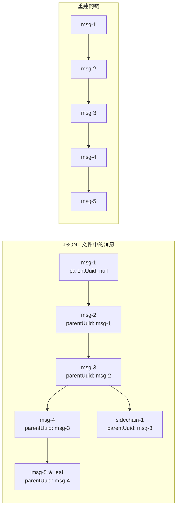
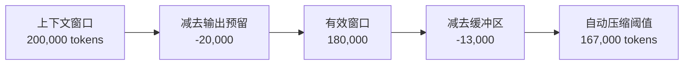
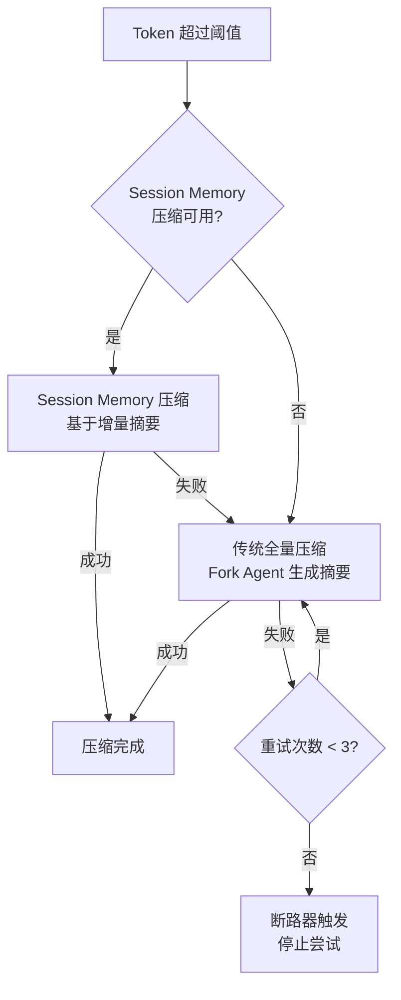

# 第 18 章：会话管理与压缩

> "大型语言模型的上下文窗口是有限的，但用户的工作流是无限的。如何在有限中容纳无限，是 Agent 工程的核心挑战。"

当一个开发者与 Claude Code 持续工作数小时，对话历史可能积累到数十万 Token。一旦超出模型的上下文窗口限制，对话将无法继续。Claude Code 通过一套精密的会话压缩体系解决这一问题 —— 自动检测阈值、智能裁剪历史、保留关键上下文，并在需要时恢复先前的会话。本章将深入这一机制的每个层面。

## 18.1 会话持久化 —— Transcript 机制

### 18.1.1 JSONL 日志格式

Claude Code 将每条消息以 JSON Lines 格式追加写入磁盘文件，即所谓的 Transcript 文件。这是一种只追加的日志结构：

```
~/.claude/projects/<project-hash>/sessions/<session-id>.jsonl
```

每条消息是一行 JSON，包含消息内容、UUID、时间戳和父消息引用。这种格式有几个重要的工程优势：

1. **崩溃安全**：只追加写入，即使进程崩溃也不会损坏已有数据
2. **链式结构**：`parentUuid` 字段形成消息链，支持分支会话
3. **增量写入**：无需重写整个文件

### 18.1.2 会话链重建

从 JSONL 文件恢复消息时，系统需要重建消息链。`loadMessagesFromJsonlPath` 实现了这一逻辑：

```typescript
// src/utils/conversationRecovery.ts
export async function loadMessagesFromJsonlPath(path: string): Promise<{
  messages: SerializedMessage[]
  sessionId: UUID | undefined
}> {
  const { messages: byUuid, leafUuids } = await loadTranscriptFile(path)

  // 找到最新的非侧链叶节点
  let tip: ... | null = null
  let tipTs = 0
  for (const m of byUuid.values()) {
    if (m.isSidechain || !leafUuids.has(m.uuid)) continue
    const ts = new Date(m.timestamp).getTime()
    if (ts > tipTs) { tipTs = ts; tip = m }
  }
  if (!tip) return { messages: [], sessionId: undefined }

  // 从叶节点回溯构建完整链
  const chain = buildConversationChain(byUuid, tip)
  return {
    messages: removeExtraFields(chain),
    sessionId: tip.sessionId as UUID | undefined,
  }
}
```



`leafUuids` 是所有没有被其他消息引用为 parent 的 UUID 集合 —— 即链的末端。系统选择最新的非侧链叶节点作为起点，向上回溯重建主会话链。

## 18.2 自动压缩 —— Token 触发的历史裁剪

### 18.2.1 阈值计算

自动压缩的核心是阈值检测。当对话的 Token 数量逼近上下文窗口限制时，系统自动触发压缩：

```typescript
// src/services/compact/autoCompact.ts
export const AUTOCOMPACT_BUFFER_TOKENS = 13_000
export const WARNING_THRESHOLD_BUFFER_TOKENS = 20_000
const MAX_OUTPUT_TOKENS_FOR_SUMMARY = 20_000

export function getEffectiveContextWindowSize(model: string): number {
  const reservedTokensForSummary = Math.min(
    getMaxOutputTokensForModel(model),
    MAX_OUTPUT_TOKENS_FOR_SUMMARY,
  )
  let contextWindow = getContextWindowForModel(model, getSdkBetas())
  return contextWindow - reservedTokensForSummary
}

export function getAutoCompactThreshold(model: string): number {
  const effectiveContextWindow = getEffectiveContextWindowSize(model)
  return effectiveContextWindow - AUTOCOMPACT_BUFFER_TOKENS
}
```

对于一个 200K 上下文窗口的模型，计算过程如下：



### 18.2.2 压缩决策流程

`shouldAutoCompact` 函数实现了复杂的决策逻辑，包含多个递归守卫和实验性特性开关：

```typescript
export async function shouldAutoCompact(
  messages: Message[],
  model: string,
  querySource?: QuerySource,
  snipTokensFreed = 0,
): Promise<boolean> {
  // 递归守卫：compact 和 session_memory 查询源不应触发自身
  if (querySource === 'session_memory' || querySource === 'compact') {
    return false
  }

  if (!isAutoCompactEnabled()) return false

  const tokenCount = tokenCountWithEstimation(messages) - snipTokensFreed
  const threshold = getAutoCompactThreshold(model)

  const { isAboveAutoCompactThreshold } = calculateTokenWarningState(
    tokenCount, model,
  )

  return isAboveAutoCompactThreshold
}
```

### 18.2.3 断路器模式

一个精巧的工程细节是连续失败的断路器：

```typescript
const MAX_CONSECUTIVE_AUTOCOMPACT_FAILURES = 3

export async function autoCompactIfNeeded(
  messages: Message[],
  toolUseContext: ToolUseContext,
  cacheSafeParams: CacheSafeParams,
  querySource?: QuerySource,
  tracking?: AutoCompactTrackingState,
): Promise<{ wasCompacted: boolean; consecutiveFailures?: number }> {
  // 断路器：连续失败 3 次后停止尝试
  if (
    tracking?.consecutiveFailures !== undefined &&
    tracking.consecutiveFailures >= MAX_CONSECUTIVE_AUTOCOMPACT_FAILURES
  ) {
    return { wasCompacted: false }
  }
  // ...
}
```

注释中引用了真实的数据 —— "BQ 2026-03-10: 1,279 sessions had 50+ consecutive failures (up to 3,272)"，说明在没有断路器之前，某些会话在上下文不可恢复时会无限重试压缩，浪费约 250K API 调用/天。断路器限制为 3 次后，这些浪费被消除。

### 18.2.4 压缩执行

实际的压缩过程分为两个策略，按优先级尝试：



## 18.3 Snip 压缩 —— HISTORY_SNIP 特性

### 18.3.1 MicroCompact 机制

在触发全量压缩之前，Claude Code 先尝试一种更轻量的压缩方式 —— MicroCompact（微压缩），又称 Snip：

```typescript
// src/services/compact/microCompact.ts
const COMPACTABLE_TOOLS = new Set<string>([
  FILE_READ_TOOL_NAME,
  ...SHELL_TOOL_NAMES,
  GREP_TOOL_NAME,
  GLOB_TOOL_NAME,
  WEB_SEARCH_TOOL_NAME,
  WEB_FETCH_TOOL_NAME,
  FILE_EDIT_TOOL_NAME,
  FILE_WRITE_TOOL_NAME,
])
```

MicroCompact 的核心思想是：许多工具调用的原始输出（文件内容、命令输出、搜索结果）占据大量 Token，但在后续对话中已不再需要。系统可以将这些输出替换为简短的摘要标记，释放 Token 空间而不丢失关键语义。

### 18.3.2 时间维度的压缩策略

MicroCompact 采用基于时间的配置：

```typescript
export type TimeBasedMCConfig = {
  minTokens: number          // 最小压缩 Token 阈值
  minTextBlockMessages: number  // 保留的最小文本消息数
  maxTokens: number          // 最大保留 Token 数
}
```

越老的工具输出越可能被压缩。`TIME_BASED_MC_CLEARED_MESSAGE` 标记（`'[Old tool result content cleared]'`）替换被清除的内容，让模型知道该位置曾有内容但已被清理。

### 18.3.3 缓存微压缩

对于内部使用的 `CACHED_MICROCOMPACT` 特性，系统维护了一个更精细的状态：

```typescript
let cachedMCModule: typeof import('./cachedMicrocompact.js') | null = null
let cachedMCState: import('./cachedMicrocompact.js').CachedMCState | null = null
let pendingCacheEdits: import('./cachedMicrocompact.js').CacheEditsBlock | null = null
```

这些模块通过 `feature()` 宏进行条件加载 —— 在外部构建中，整个模块会被死代码消除，避免未使用的代码进入产品包。

## 18.4 压缩边界 —— compact_boundary 标记

### 18.4.1 CompactBoundary 消息

压缩的结果需要在消息流中标记一个清晰的边界。`SystemCompactBoundaryMessage` 类型承担了这一职责：

```typescript
// 来自 types/message.ts
export type SystemCompactBoundaryMessage = {
  type: 'system'
  isCompactBoundary: true
  // 可选的重链接元数据
  preservedSegment?: {
    anchorUuid: UUID
    headUuid: UUID
    tailUuid: UUID
  }
}
```

### 18.4.2 消息分组 —— API 轮次边界

压缩前需要将消息按 API 轮次分组，确保在安全的边界处切割：

```typescript
// src/services/compact/grouping.ts
export function groupMessagesByApiRound(messages: Message[]): Message[][] {
  const groups: Message[][] = []
  let current: Message[] = []
  let lastAssistantId: string | undefined

  for (const msg of messages) {
    if (
      msg.type === 'assistant' &&
      msg.message.id !== lastAssistantId &&
      current.length > 0
    ) {
      groups.push(current)
      current = [msg]
    } else {
      current.push(msg)
    }
    if (msg.type === 'assistant') {
      lastAssistantId = msg.message.id
    }
  }

  if (current.length > 0) groups.push(current)
  return groups
}
```

分组以"新的 assistant 响应开始"为边界。同一个 API 响应中的多个消息（如流式传输的多个内容块）通过 `message.id` 识别 —— 它们共享同一个 ID，因此会被归入同一组。

```mermaid
graph TD
    subgraph "Group 1 (API Round 1)"
        U1[User: "读取 main.ts"]
        A1[Assistant id=abc: tool_use Read]
        R1[User: tool_result]
        A2[Assistant id=abc: "文件内容是..."]
    end

    subgraph "Group 2 (API Round 2)"
        U2[User: "修改第 10 行"]
        A3[Assistant id=def: tool_use Edit]
        R2[User: tool_result]
        A4[Assistant id=def: "已修改"]
    end
```

### 18.4.3 压缩摘要生成

压缩的核心是通过一个分叉的 Agent 生成对话摘要。摘要 Prompt 要求模型产出结构化的九段式总结：

```typescript
// src/services/compact/prompt.ts
const BASE_COMPACT_PROMPT = `Your task is to create a detailed summary...

Your summary should include the following sections:

1. Primary Request and Intent
2. Key Technical Concepts
3. Files and Code Sections
4. Errors and fixes
5. Problem Solving
6. All user messages
7. Pending Tasks
8. Current Work
9. Optional Next Step
`
```

摘要使用 `<analysis>` 和 `<summary>` XML 标签包裹。`<analysis>` 是模型的"草稿本"，最终会被 `formatCompactSummary()` 剥离 —— 它的存在是为了提升摘要质量（让模型先思考再总结），但不占用后续对话的 Token。

### 18.4.4 PTL 重试机制

当压缩请求本身超出上下文窗口时（压缩需要发送全部消息给模型），系统有一个降级策略：

```typescript
export function truncateHeadForPTLRetry(
  messages: Message[],
  ptlResponse: AssistantMessage,
): Message[] | null {
  const groups = groupMessagesByApiRound(input)
  if (groups.length < 2) return null

  const tokenGap = getPromptTooLongTokenGap(ptlResponse)
  let dropCount: number
  if (tokenGap !== undefined) {
    // 精确丢弃足够的轮次
    let acc = 0
    dropCount = 0
    for (const g of groups) {
      acc += roughTokenCountEstimationForMessages(g)
      dropCount++
      if (acc >= tokenGap) break
    }
  } else {
    // 降级：丢弃 20% 的最老轮次
    dropCount = Math.max(1, Math.floor(groups.length * 0.2))
  }

  dropCount = Math.min(dropCount, groups.length - 1)  // 至少保留一组
  return groups.slice(dropCount).flat()
}
```

这是一个"有损但解除阻塞"的逃生通道 —— 当用户在极端情况下被卡住时，丢弃最老的上下文比完全无法继续要好。

## 18.5 会话恢复 —— --resume 实现

### 18.5.1 恢复入口

`loadConversationForResume` 是会话恢复的统一入口，支持多种来源：

```typescript
// src/utils/conversationRecovery.ts
export async function loadConversationForResume(
  source: string | LogOption | undefined,
  sourceJsonlFile: string | undefined,
): Promise<{
  messages: Message[]
  turnInterruptionState: TurnInterruptionState
  fileHistorySnapshots?: FileHistorySnapshot[]
  sessionId: UUID | undefined
  agentName?: string
  agentColor?: string
  // ... 更多会话元数据
} | null> {
  // source === undefined: --continue，加载最近的会话
  // source === string: --resume <session-id>
  // source === LogOption: 已加载的会话数据
  // sourceJsonlFile: --resume <path.jsonl>
}
```

### 18.5.2 反序列化与中断检测

恢复过程中最复杂的部分是检测会话是否在中途被中断：

```typescript
export function deserializeMessagesWithInterruptDetection(
  serializedMessages: Message[],
): DeserializeResult {
  // 1. 迁移旧版附件类型
  const migratedMessages = serializedMessages.map(migrateLegacyAttachmentTypes)

  // 2. 过滤未解决的 tool_use（崩溃时可能遗留）
  const filteredToolUses = filterUnresolvedToolUses(migratedMessages)

  // 3. 过滤孤立的 thinking-only 消息
  const filteredThinking = filterOrphanedThinkingOnlyMessages(filteredToolUses)

  // 4. 过滤只有空白的 assistant 消息
  const filteredMessages = filterWhitespaceOnlyAssistantMessages(filteredThinking)

  // 5. 检测中断状态
  const internalState = detectTurnInterruption(filteredMessages)

  // 6. 将"中途中断"转化为"中断的 prompt"
  if (internalState.kind === 'interrupted_turn') {
    filteredMessages.push(/* synthetic "Continue from where you left off." */)
  }

  return { messages: filteredMessages, turnInterruptionState }
}
```

```mermaid
flowchart TD
    Raw[原始 JSONL 消息] --> Migrate[迁移旧版附件]
    Migrate --> FilterTU[过滤未解决 tool_use]
    FilterTU --> FilterThink[过滤孤立 thinking]
    FilterThink --> FilterWS[过滤空白 assistant]
    FilterWS --> Detect{检测中断类型}

    Detect -->|最后是 user 消息| IP[interrupted_prompt<br/>用户输入未被响应]
    Detect -->|最后是 tool_result| IT[interrupted_turn<br/>工具执行后中断]
    Detect -->|最后是 assistant| None[无中断<br/>正常结束]

    IT --> Synthetic[注入 "Continue from where you left off."]
    IP --> Ready[准备恢复]
    None --> Ready
    Synthetic --> Ready
```

### 18.5.3 终端工具结果检测

一个微妙的边界情况处理 —— 当最后一条消息是 `tool_result` 时，需要判断这是否是正常的轮次结束（如 Brief 模式下 SendUserMessage 是最后一步），还是真正的中断：

```typescript
function isTerminalToolResult(
  result: NormalizedUserMessage,
  messages: NormalizedMessage[],
  resultIdx: number,
): boolean {
  // 从 tool_result 中提取 tool_use_id
  const block = content[0]
  if (block?.type !== 'tool_result') return false
  const toolUseId = block.tool_use_id

  // 回溯查找对应的 tool_use
  for (let i = resultIdx - 1; i >= 0; i--) {
    const msg = messages[i]!
    if (msg.type !== 'assistant') continue
    for (const b of msg.message.content) {
      if (b.type === 'tool_use' && b.id === toolUseId) {
        // Brief 模式的终端工具
        return (
          b.name === BRIEF_TOOL_NAME ||
          b.name === LEGACY_BRIEF_TOOL_NAME ||
          b.name === SEND_USER_FILE_TOOL_NAME
        )
      }
    }
  }
  return false
}
```

### 18.5.4 技能状态恢复

压缩后，之前通过 `/skill` 加载的技能内容会丢失。恢复时需要从消息中重建技能状态：

```typescript
export function restoreSkillStateFromMessages(messages: Message[]): void {
  for (const message of messages) {
    if (message.type !== 'attachment') continue
    if (message.attachment.type === 'invoked_skills') {
      for (const skill of message.attachment.skills) {
        if (skill.name && skill.path && skill.content) {
          addInvokedSkill(skill.name, skill.path, skill.content, null)
        }
      }
    }
    if (message.attachment.type === 'skill_listing') {
      suppressNextSkillListing()  // 避免重复注入技能列表
    }
  }
}
```

### 18.5.5 Session Memory 压缩

Session Memory 是一种实验性的增量压缩策略。与传统的全量压缩不同，它在会话进行过程中持续维护一个"会话记忆"摘要：

```typescript
// src/services/compact/sessionMemoryCompact.ts
export const DEFAULT_SM_COMPACT_CONFIG: SessionMemoryCompactConfig = {
  minTokens: 10_000,        // 压缩后至少保留 10K tokens
  minTextBlockMessages: 5,  // 至少保留 5 条带文本的消息
  maxTokens: 40_000,        // 压缩后最多保留 40K tokens
}
```

当 Session Memory 压缩可用时，它优先于传统压缩执行。优势在于摘要是增量维护的，无需每次重新总结整个对话。

## 18.6 压缩后的上下文重建

### 18.6.1 Post-Compact 消息构建

压缩完成后，需要构建新的消息列表：

```typescript
export function buildPostCompactMessages(result: CompactionResult): Message[] {
  return [
    result.boundaryMarker,      // compact_boundary 标记
    ...result.summaryMessages,  // 摘要消息
    ...(result.messagesToKeep ?? []),  // 保留的近期消息
    ...result.attachments,      // 重新注入的附件
    ...result.hookResults,      // 会话钩子结果
  ]
}
```

顺序至关重要：boundary 标记在最前（标明这是一个压缩恢复点），摘要紧随其后（提供上下文），保留的消息原样保持，最后是重新注入的附件（MCP 指令、技能列表等）。

### 18.6.2 摘要格式化

原始摘要包含 `<analysis>` 和 `<summary>` 标签。在发送给用户之前，`formatCompactSummary` 会清理格式：

```typescript
export function formatCompactSummary(summary: string): string {
  let formattedSummary = summary
  // 剥离分析部分（仅用于提升摘要质量的草稿）
  formattedSummary = formattedSummary.replace(
    /<analysis>[\s\S]*?<\/analysis>/, ''
  )
  // 将 <summary> 标签替换为可读的标题
  const summaryMatch = formattedSummary.match(/<summary>([\s\S]*?)<\/summary>/)
  if (summaryMatch) {
    formattedSummary = formattedSummary.replace(
      /<summary>[\s\S]*?<\/summary>/,
      `Summary:\n${summaryMatch[1].trim()}`
    )
  }
  return formattedSummary.trim()
}
```

## 本章小结

会话管理与压缩是 Claude Code 最体现"工程深度"的模块之一。从 JSONL 链式日志结构保证崩溃安全，到基于 Token 阈值的自动压缩触发，从按 API 轮次的安全分组到 PTL 降级重试，从中断检测的五层过滤管道到技能状态的跨压缩恢复 —— 每一个细节都在解决真实的用户痛点。

断路器模式的引入尤其值得品味。一行 `if (consecutiveFailures >= 3)` 的简单检查，基于 BQ 数据中 1,279 个异常会话的观察，消除了每天 250K 次浪费的 API 调用。这就是数据驱动工程的典范。

下一章我们将进入 Claude Code 的界面层 —— 看它如何在终端中运行一个完整的 React 应用。
