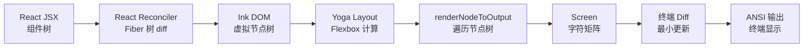
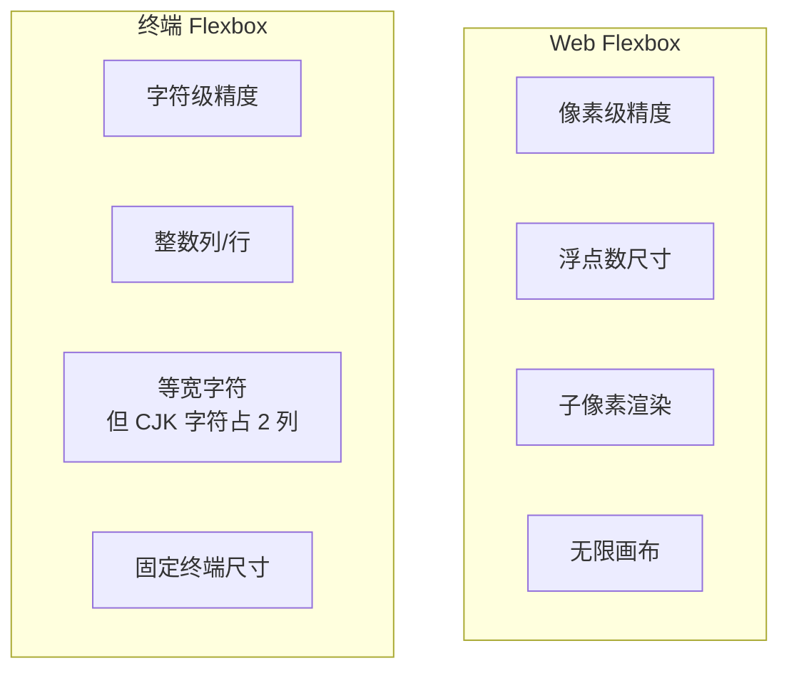
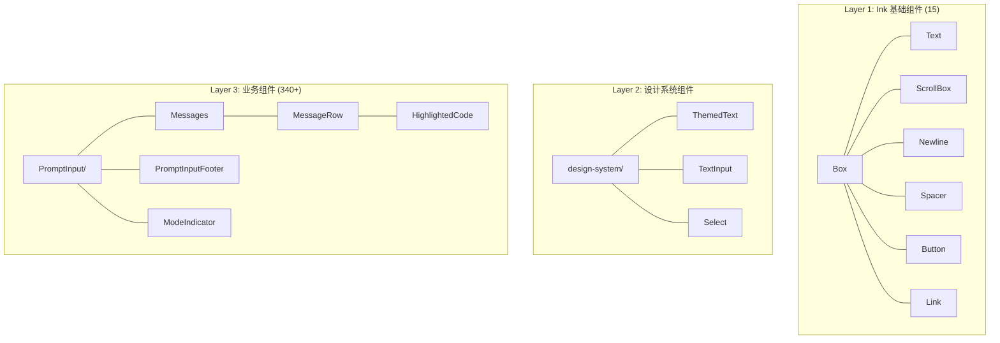
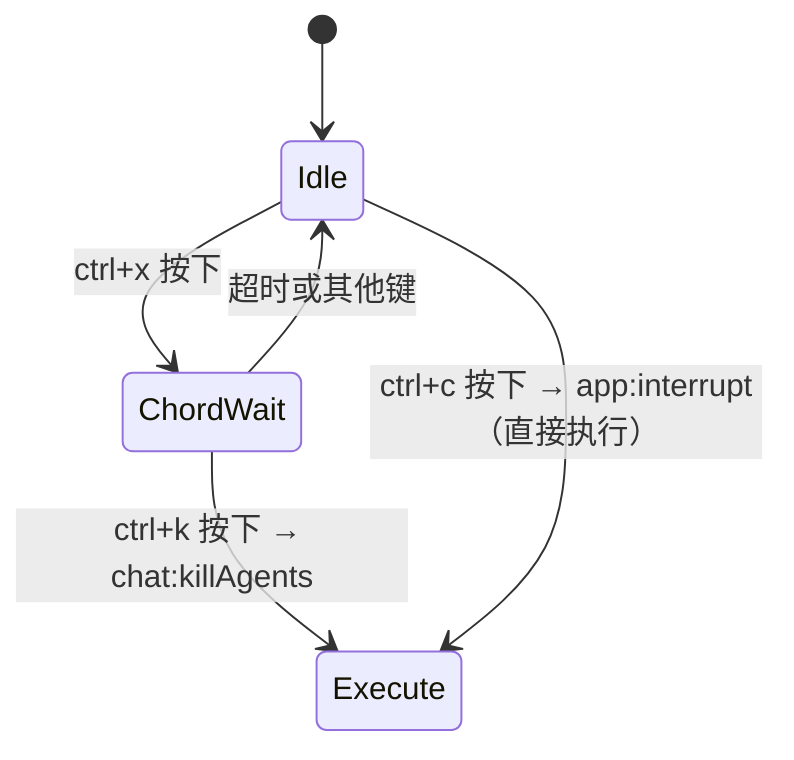

# 第 19 章：React + Ink 终端 UI

> "当我们说 Claude Code 是一个 React 应用时，这不是比喻 —— 它真的是一个 React 应用，只不过渲染目标不是浏览器 DOM，而是终端字符矩阵。"

Claude Code 做出了一个大胆的架构决策：使用 React 和 Ink 框架在终端中构建完整的用户界面。这意味着组件化、响应式更新、Hooks、Context、虚拟 DOM diff —— 所有 React 生态的能力都被带入了终端世界。本章将深入剖析这一架构的工作原理。

## 19.1 Ink 框架 —— 在终端中运行 React 的原理

### 19.1.1 架构概览

Ink 是一个将 React 渲染到终端的框架。Claude Code 不仅使用了 Ink，还对其进行了深度定制 —— `src/ink/` 目录包含了完整的 Ink 实现，而非作为外部依赖引入：

```
src/ink/
├── ink.tsx           # Ink 主类 - 渲染循环核心
├── reconciler.ts     # React Reconciler 自定义实现
├── dom.ts            # 终端 DOM 节点定义
├── renderer.ts       # 帧渲染器
├── output.ts         # 输出缓冲区
├── screen.ts         # 屏幕字符矩阵
├── optimizer.ts      # 输出优化
├── selection.ts      # 文本选择系统
├── focus.ts          # 焦点管理
├── components/       # 基础组件 (Box, Text, ScrollBox...)
├── hooks/            # 自定义 Hooks
├── events/           # 事件系统
├── layout/           # Yoga 布局引擎接口
├── termio/           # ANSI 终端 I/O
└── termio.ts         # ANSI 解析器入口
```

### 19.1.2 渲染管线



整个渲染管线可以类比浏览器的渲染流程：

| 浏览器 | Ink 终端 |
|--------|---------|
| HTML DOM | Ink DOM (`DOMElement`, `TextNode`) |
| CSS Layout | Yoga Flexbox |
| Paint | `renderNodeToOutput` |
| Compositing | `Screen` 字符矩阵 |
| Display | ANSI escape sequences |

### 19.1.3 Ink 主类

`src/ink/ink.tsx` 中的 `Ink` 类是渲染循环的核心。它使用 `react-reconciler` 创建 Fiber 树，并通过节流的帧循环将变更刷新到终端：

```typescript
// src/ink/ink.tsx
import createReconciler from 'react-reconciler'
import { ConcurrentRoot } from 'react-reconciler/constants.js'

// 使用 Concurrent Mode 创建 Reconciler
const reconciler = createReconciler({
  // React Reconciler 宿主配置
  createInstance,
  createTextInstance,
  appendChildToContainer,
  appendChild,
  removeChild,
  commitUpdate,
  // ... 30+ 方法实现
})

// 帧间隔：默认约 16ms (60fps)
import { FRAME_INTERVAL_MS } from './constants.js'
```

关键设计：使用 `ConcurrentRoot` 而非 `LegacyRoot`，这意味着 React 的并发特性（Suspense、startTransition、useDeferredValue）在终端中同样可用。REPL 组件大量使用了 `useDeferredValue` 来延迟非关键更新。

### 19.1.4 Alt-Screen 模式

Claude Code 运行在终端的备用屏幕（Alt-Screen）中。这是一种终端特性，允许程序拥有独立的屏幕缓冲区，退出时自动恢复原始内容：

```typescript
// Alt-screen 下，光标始终不可见（使用固定对象避免每帧分配）
const ALT_SCREEN_ANCHOR_CURSOR = Object.freeze({
  x: 0,
  y: 0,
  visible: false
});
```

进入/退出 Alt-Screen 通过 DEC 私有模式序列控制：

```typescript
// src/ink/termio/dec.ts
export const ENTER_ALT_SCREEN = '\x1b[?1049h'
export const EXIT_ALT_SCREEN = '\x1b[?1049l'
```

## 19.2 Yoga 布局 —— Flexbox 在终端的适配

### 19.2.1 Yoga 布局引擎

Yoga 是 Facebook 开发的跨平台 Flexbox 布局引擎，最初用于 React Native。Claude Code 将其编译为 WASM 并集成到终端渲染中。每个 `Box` 组件对应一个 Yoga 节点：

```typescript
// src/ink/reconciler.ts
function applyProp(node: DOMElement, key: string, value: unknown): void {
  if (key === 'style') {
    setStyle(node, value as Styles)
    if (node.yogaNode) {
      applyStyles(node.yogaNode, value as Styles)
    }
    return
  }
  // ...
}
```

### 19.2.2 终端 Flexbox 约束

终端 Flexbox 与 Web Flexbox 有关键差异：



终端中一个"字符"是最小的布局单元。CJK 字符（中日韩）占据 2 列宽度，这在宽度计算中必须特殊处理。`src/ink/stringWidth.ts` 和 `src/ink/line-width-cache.ts` 专门处理这一问题。

### 19.2.3 Yoga 节点生命周期

```typescript
// 创建节点时分配 Yoga 节点
const createNode = (tagName: ElementNames): DOMElement => {
  const node = { /* ... */ }
  node.yogaNode = Yoga.Node.create()
  return node
}

// 清理节点时释放 WASM 内存
const cleanupYogaNode = (node: DOMElement | TextNode): void => {
  const yogaNode = node.yogaNode
  if (yogaNode) {
    yogaNode.unsetMeasureFunc()
    clearYogaNodeReferences(node)
    yogaNode.freeRecursive()  // 释放 WASM 内存
  }
}
```

注意 `freeRecursive()` 调用 —— Yoga 节点存在于 WASM 内存中，不受 JavaScript GC 管理，必须手动释放。`clearYogaNodeReferences` 在释放前清除所有引用，防止其他代码在并发操作中访问已释放的 WASM 内存。

## 19.3 组件体系 —— 340+ 组件的设计分层

### 19.3.1 组件层次结构

Claude Code 的组件分为三个层次：



### 19.3.2 Ink 基础组件

`src/ink/components/` 中的基础组件是整个 UI 的构建块：

**Box** —— 终端中的 `<div>`，支持 Flexbox 布局：

```typescript
// src/ink/components/Box.tsx
// 支持的样式属性包括：
// flexDirection, alignItems, justifyContent,
// width, height, minWidth, minHeight, maxWidth,
// padding, margin, borderStyle, overflow
```

**ScrollBox** —— 可滚动容器，这是终端 UI 中最复杂的组件之一。它需要处理虚拟化（不渲染屏幕外的内容）、滚动条、鼠标滚轮事件：

```typescript
// src/ink/components/ScrollBox.tsx
export type ScrollBoxHandle = {
  scrollTo: (offset: number) => void
  scrollToBottom: () => void
  getScrollTop: () => number
  getContentHeight: () => number
}
```

**Text** —— 终端中的文本节点，支持颜色、加粗、斜体、下划线、链接等样式。

### 19.3.3 业务组件矩阵

`src/components/` 目录包含 340+ 个业务组件，覆盖了应用的每个功能面：

| 类别 | 代表组件 | 数量 |
|------|---------|------|
| 输入 | PromptInput, TextInput, VimTextInput | ~20 |
| 消息 | Messages, MessageRow, VirtualMessageList | ~30 |
| 权限 | PermissionRequest, TrustDialog | ~15 |
| Diff | StructuredDiff, FileEditToolDiff | ~10 |
| MCP | MCPServerApprovalDialog | ~10 |
| Agent | CoordinatorAgentStatus, TeammateViewHeader | ~15 |
| 设置 | Settings, ModelPicker, ThemePicker | ~15 |
| 代码 | HighlightedCode, Markdown | ~10 |

### 19.3.4 VirtualMessageList —— 虚拟列表

对话界面使用虚拟列表优化性能，只渲染可见区域的消息：

```typescript
// src/components/VirtualMessageList.tsx
export type JumpHandle = {
  jumpToIndex: (i: number) => void
  setSearchQuery: (q: string) => void
  nextMatch: () => void
  prevMatch: () => void
  setAnchor: () => void
}
```

虚拟列表维护搜索高亮状态，支持 `/` 搜索和 `n`/`N` 跳转 —— 这是仿 Vim 的交互模式。`WeakMap` 用于缓存每条消息的搜索文本（小写化后），避免重复计算。

## 19.4 键盘事件 —— 全局快捷键系统

### 19.4.1 键绑定架构

Claude Code 实现了一套完整的键绑定系统，支持上下文感知、用户自定义和组合键：

```
src/keybindings/
├── defaultBindings.ts      # 默认键绑定
├── KeybindingContext.tsx    # React Context
├── KeybindingProviderSetup.tsx  # Provider 设置
├── loadUserBindings.ts     # 用户自定义加载
├── match.ts               # 按键匹配算法
├── parser.ts              # 按键序列解析
├── reservedShortcuts.ts   # 不可覆盖的快捷键
├── resolver.ts            # 绑定解析器
├── schema.ts              # 配置 Schema
├── shortcutFormat.ts      # 显示格式化
├── template.ts            # 模板引擎
├── useKeybinding.ts       # Hook API
├── useShortcutDisplay.ts  # 快捷键提示显示
└── validate.ts            # 配置验证
```

### 19.4.2 上下文分层

键绑定按上下文（Context）组织，不同的 UI 状态激活不同的绑定集：

```typescript
// src/keybindings/defaultBindings.ts
export const DEFAULT_BINDINGS: KeybindingBlock[] = [
  {
    context: 'Global',
    bindings: {
      'ctrl+c': 'app:interrupt',
      'ctrl+d': 'app:exit',
      'ctrl+l': 'app:redraw',
      'ctrl+t': 'app:toggleTodos',
      'ctrl+o': 'app:toggleTranscript',
      'ctrl+r': 'history:search',
    },
  },
  {
    context: 'Chat',
    bindings: {
      escape: 'chat:cancel',
      'ctrl+x ctrl+k': 'chat:killAgents',  // 组合键（chord）
      'shift+tab': 'chat:cycleMode',
      'meta+p': 'chat:modelPicker',
      enter: 'chat:submit',
      up: 'history:previous',
      down: 'history:next',
      'ctrl+_': 'chat:undo',
      'ctrl+g': 'chat:externalEditor',
      'ctrl+s': 'chat:stash',
    },
  },
  {
    context: 'Autocomplete',
    bindings: {
      tab: 'autocomplete:accept',
      escape: 'autocomplete:dismiss',
    },
  },
]
```

### 19.4.3 Chord 键（组合键序列）

注意 `'ctrl+x ctrl+k': 'chat:killAgents'` —— 这是 Emacs 风格的 chord 键，需要按顺序按下两个组合键。实现上，系统维护一个 chord 前缀状态：



### 19.4.4 平台适配

键绑定包含平台特定的适配：

```typescript
// Windows 上 ctrl+v 是系统粘贴，用 alt+v 代替
const IMAGE_PASTE_KEY = getPlatform() === 'windows' ? 'alt+v' : 'ctrl+v'

// Windows Terminal 在没有 VT mode 时 shift+tab 不工作
const MODE_CYCLE_KEY = SUPPORTS_TERMINAL_VT_MODE ? 'shift+tab' : 'meta+m'
```

代码中引用了具体的 Node.js/Bun 版本号（`satisfies(process.versions.bun, '>=1.2.23')`），说明团队对终端兼容性问题有深入的追踪。

### 19.4.5 保留快捷键

某些快捷键（`ctrl+c`、`ctrl+d`）使用特殊的双击时间窗口处理，且不允许用户覆盖：

```typescript
// ctrl+c 和 ctrl+d 使用特殊的基于时间的双击处理。
// 它们在这里定义以便 resolver 可以找到它们，
// 但不能被用户重绑定 — reservedShortcuts.ts 中的验证
// 会在用户尝试覆盖这些键时显示错误。
'ctrl+c': 'app:interrupt',
'ctrl+d': 'app:exit',
```

## 19.5 终端 I/O —— 抽象层设计

### 19.5.1 ANSI 解析器

`src/ink/termio.ts` 导出了一个完整的 ANSI 转义序列解析器，灵感来自 ghostty、tmux 和 iTerm2：

```typescript
/**
 * ANSI Parser Module
 *
 * Key features:
 * - Semantic output: produces structured actions, not string tokens
 * - Streaming: can parse input incrementally via Parser class
 * - Style tracking: maintains text style state across parse calls
 * - Comprehensive: supports SGR, CSI, OSC, ESC sequences
 */

// 用法：
const parser = new Parser()
const actions = parser.feed('\x1b[31mred\x1b[0m')
// => [{ type: 'text', graphemes: [...],
//       style: { fg: { type: 'named', name: 'red' } } }]
```

### 19.5.2 CSI/OSC/DEC 序列

终端 I/O 层按序列类型组织：

```
src/ink/termio/
├── parser.ts    # 主解析器状态机
├── tokenize.ts  # 字节流分词
├── sgr.ts       # Select Graphic Rendition (颜色、样式)
├── csi.ts       # Control Sequence Introducer (光标、清屏)
├── osc.ts       # Operating System Command (标题、剪贴板)
├── dec.ts       # DEC Private Mode (鼠标、Alt-Screen)
├── esc.ts       # 基本 Escape 序列
├── ansi.ts      # ANSI 常量
└── types.ts     # 类型定义
```

关键序列示例：

```typescript
// src/ink/termio/csi.ts
export const CURSOR_HOME = '\x1b[H'           // 光标回到原点
export const ERASE_SCREEN = '\x1b[2J'         // 清除屏幕
export function cursorMove(dx: number, dy: number): string {
  // 生成相对光标移动序列
}

// src/ink/termio/dec.ts
export const ENABLE_MOUSE_TRACKING = '\x1b[?1000h\x1b[?1003h\x1b[?1006h'
export const DISABLE_MOUSE_TRACKING = '\x1b[?1000l\x1b[?1003l\x1b[?1006l'

// src/ink/termio/osc.ts
export function setClipboard(data: string): string {
  // OSC 52 序列，将数据写入终端剪贴板
}
```

### 19.5.3 Screen 字符矩阵

`src/ink/screen.ts` 实现了一个高性能的屏幕缓冲区，使用对象池（Pool）优化内存分配：

```typescript
// src/ink/screen.ts
export const CellWidth = { NARROW: 1, WIDE: 2 }

// 对象池避免频繁的 GC
export const CharPool = /* ... */     // 字符对象池
export const StylePool = /* ... */    // 样式对象池
export const HyperlinkPool = /* ... */ // 超链接对象池

export function createScreen(width: number, height: number): Screen {
  // 创建字符矩阵
}

export function cellAt(screen: Screen, x: number, y: number): Cell {
  // 访问指定位置的字符单元
}
```

### 19.5.4 差异化输出

`writeDiffToTerminal` 实现了终端的增量更新 —— 比较前后两帧的 Screen，只输出变化的部分：

```mermaid
graph LR
    subgraph "Frame N"
        F1["H e l l o"]
        F2["W o r l d"]
    end

    subgraph "Frame N+1"
        G1["H e l l o"]
        G2["C l a u d e"]
    end

    subgraph "Diff Output"
        D1[移动光标到 (0,1)]
        D2[输出 "Claude"]
    end

    F1 --> |不变| G1
    F2 --> |变化| D1
    D1 --> D2
```

这种差异化更新是终端应用流畅的关键。不同于 Web 浏览器的增量 DOM 更新，终端中每次"全屏重绘"意味着输出整个屏幕的字符序列，会导致明显的闪烁。差异化只在必要位置发送 ANSI 序列，最小化输出量。

### 19.5.5 Kitty 键盘协议

Claude Code 支持 Kitty 键盘协议，这是一种现代终端扩展，能区分按键修饰符的组合：

```typescript
// src/ink/termio/csi.ts
export const ENABLE_KITTY_KEYBOARD = '\x1b[>1u'
export const DISABLE_KITTY_KEYBOARD = '\x1b[<u'
export const ENABLE_MODIFY_OTHER_KEYS = '\x1b[>4;1m'
export const DISABLE_MODIFY_OTHER_KEYS = '\x1b[>4;0m'
```

Kitty 协议允许区分 `ctrl+shift+f` 和 `ctrl+f` —— 在传统终端中这两者会产生相同的控制字符。Claude Code 利用这一能力实现了更丰富的快捷键（如 `cmd+shift+f` 用于全局搜索）。

## 本章小结

React + Ink 的终端 UI 架构是 Claude Code 最富创新性的技术决策之一。它证明了 React 的组件模型和渲染管线可以适配到任何输出目标 —— 浏览器 DOM、Native View、甚至字符矩阵。

深度定制的 Ink 框架（而非作为外部依赖使用）给予了团队完全的控制权：从 Yoga WASM 内存管理到 Kitty 键盘协议支持，从差异化终端输出到对象池内存优化。340+ 个业务组件的规模也说明，这不是一个"玩具级"的终端 UI，而是一个生产级的富应用。

下一章我们将聚焦 REPL 组件 —— 这个 5000 行的巨型组件如何组织代码、处理输入、渲染消息、管理权限对话。
