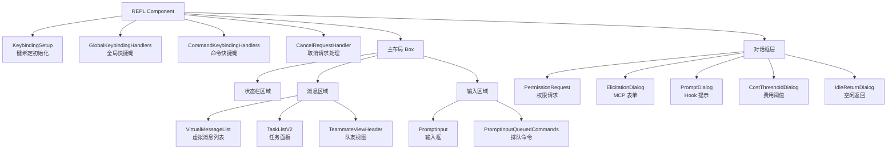
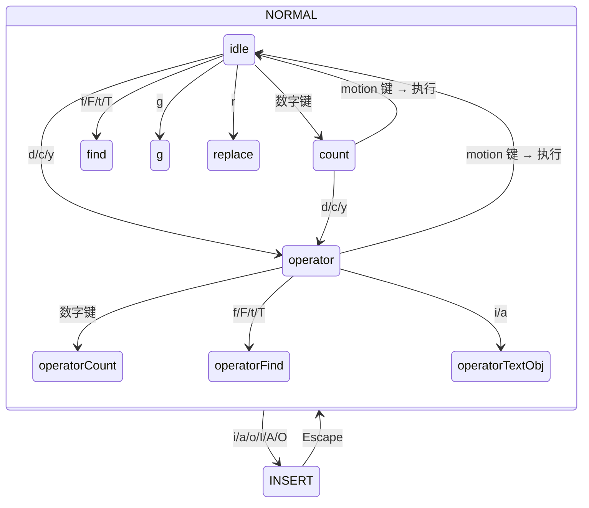
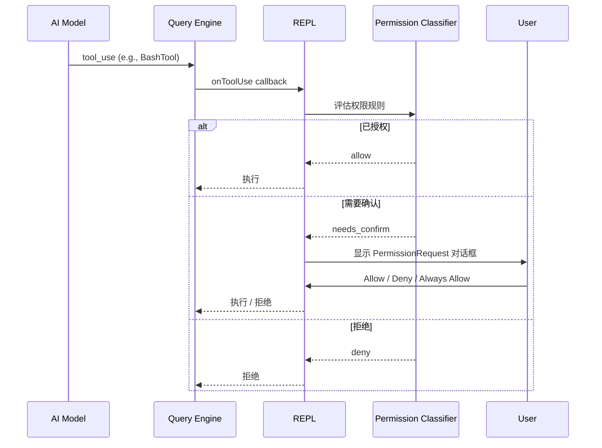

# 第 20 章：REPL 实现

> "REPL —— Read-Eval-Print Loop，一个看似简单的概念，在 Agent 系统中却演化为一个包含查询循环、权限协商、推测执行、多 Agent 路由的复杂有机体。"

`src/screens/REPL.tsx` 是 Claude Code 的主界面组件，5000+ 行代码使其成为整个代码库中最大的单个文件。它不仅仅是一个"输入-输出"界面，而是整个应用的中枢神经系统 —— 管理着消息流、工具调用、权限协商、会话恢复、多 Agent 协调等几乎所有核心功能。本章将解构这一巨型组件的内部结构。

## 20.1 REPL 组件 —— 5000 行主界面的结构

### 20.1.1 导入分析

REPL 组件的导入列表本身就是一份架构文档。仅前 200 行就导入了超过 100 个模块：

```typescript
// src/screens/REPL.tsx
import { c as _c } from "react/compiler-runtime";
import { feature } from 'bun:bundle';

// 状态管理
import { useAppState, useSetAppState, useAppStateStore } from '../state/AppState.js';

// 核心查询引擎
import { query } from '../query.js';

// 消息处理
import { handleMessageFromStream, createUserMessage, createAssistantMessage,
         isCompactBoundaryMessage, getMessagesAfterCompactBoundary } from '../utils/messages.js';

// 工具系统
import { getTools, assembleToolPool } from '../tools.js';
import useCanUseTool from '../hooks/useCanUseTool.js';

// 权限系统
import { applyPermissionUpdate, persistPermissionUpdate } from '../utils/permissions/PermissionUpdate.js';
import { PermissionRequest } from '../components/permissions/PermissionRequest.js';

// 会话管理
import { deserializeMessages } from '../utils/conversationRecovery.js';
import { partialCompactConversation } from '../services/compact/compact.js';

// 多 Agent
import { injectUserMessageToTeammate } from '../tasks/InProcessTeammateTask/InProcessTeammateTask.js';
import { isLocalAgentTask, queuePendingMessage } from '../tasks/LocalAgentTask/LocalAgentTask.js';
```

### 20.1.2 条件导入与死代码消除

REPL 大量使用 `feature()` 宏进行条件导入，确保内部特性不泄露到外部构建：

```typescript
// 语音集成 -- 仅 VOICE_MODE 特性开启时加载
const useVoiceIntegration = feature('VOICE_MODE')
  ? require('../hooks/useVoiceIntegration.js').useVoiceIntegration
  : () => ({ stripTrailing: () => 0, handleKeyEvent: () => {}, resetAnchor: () => {} });

// 挫折检测 -- 仅内部(ant)构建
const useFrustrationDetection = "external" === 'ant'
  ? require('../components/FeedbackSurvey/useFrustrationDetection.js').useFrustrationDetection
  : () => ({ state: 'closed', handleTranscriptSelect: () => {} });

// 协调器模式
const getCoordinatorUserContext = feature('COORDINATOR_MODE')
  ? require('../coordinator/coordinatorMode.js').getCoordinatorUserContext
  : () => ({});
```

这种模式的精妙之处在于：当 `feature('VOICE_MODE')` 在编译时为 `false` 时，整个 `require` 分支被消除，相关模块根本不会进入产品包。替代的空实现保持了类型兼容性，调用方无需任何条件判断。

### 20.1.3 组件结构

REPL 的渲染输出可以分解为以下布局结构：



## 20.2 输入处理 —— PromptInput 组件

### 20.2.1 输入组件体系

`src/components/PromptInput/` 目录包含 21 个文件，构成一个完整的输入子系统：

```
PromptInput/
├── PromptInput.tsx              # 主输入组件
├── PromptInputFooter.tsx        # 底部栏（模式指示器、快捷键提示）
├── PromptInputFooterLeftSide.tsx # 底部左侧（成本、Token 统计）
├── PromptInputFooterSuggestions.tsx # 自动补全建议
├── PromptInputHelpMenu.tsx      # 帮助菜单
├── PromptInputModeIndicator.tsx # 模式指示器（default/plan/auto）
├── PromptInputQueuedCommands.tsx # 排队的命令显示
├── PromptInputStashNotice.tsx   # Stash 提示
├── ShimmeredInput.tsx           # 推测执行的闪烁输入
├── inputModes.ts               # 输入模式逻辑
├── inputPaste.ts               # 粘贴处理
├── useMaybeTruncateInput.ts    # 超长输入截断
├── usePromptInputPlaceholder.ts # 占位符文本
├── useShowFastIconHint.ts      # Fast 模式提示
├── useSwarmBanner.ts           # Swarm 模式横幅
├── VoiceIndicator.tsx          # 语音指示器
└── utils.ts                    # 工具函数
```

### 20.2.2 输入模式

Claude Code 支持多种输入模式，每种模式改变输入的解释方式：

```typescript
// src/components/PromptInput/inputModes.ts
export function prependModeCharacterToInput(
  input: string,
  mode: PromptInputMode,
): string {
  // 不同模式使用不同前缀字符
  // '!' -> bash 模式（直接执行 shell 命令）
  // '#' -> 注释模式
  // 其他特殊前缀
}
```

模式切换通过 `Shift+Tab`（或 Windows 上的 `Meta+M`）循环：

```mermaid
stateDiagram-v2
    [*] --> Default: 启动
    Default --> Plan: Shift+Tab
    Plan --> Auto: Shift+Tab
    Auto --> Default: Shift+Tab

    Default: 默认模式（需确认工具使用）
    Plan: 计划模式（只规划不执行）
    Auto: 自动模式（自动确认所有工具）
```

### 20.2.3 输入历史与搜索

REPL 维护命令历史，支持 `Up`/`Down` 浏览和 `Ctrl+R` 反向搜索：

```typescript
// src/screens/REPL.tsx 导入
import { addToHistory, removeLastFromHistory, expandPastedTextRefs, parseReferences } from '../history.js';
import { useSearchInput } from '../hooks/useSearchInput.js';
```

`HistorySearchInput` 组件实现了类似 Bash 的 `Ctrl+R` 交互 —— 输入搜索词实时过滤历史记录，`Enter` 选择当前匹配项。

### 20.2.4 Vim 模式

Claude Code 内置了完整的 Vim 模式输入编辑器。状态机定义在 `src/vim/types.ts`：

```typescript
export type VimState =
  | { mode: 'INSERT'; insertedText: string }
  | { mode: 'NORMAL'; command: CommandState }

export type CommandState =
  | { type: 'idle' }
  | { type: 'count'; digits: string }
  | { type: 'operator'; op: Operator; count: number }
  | { type: 'operatorCount'; op: Operator; count: number; digits: string }
  | { type: 'operatorFind'; op: Operator; count: number; find: FindType }
  | { type: 'operatorTextObj'; op: Operator; count: number; scope: TextObjScope }
  | { type: 'find'; find: FindType; count: number }
  | { type: 'g'; count: number }
  | { type: 'replace'; count: number }
  | { type: 'indent'; dir: '>' | '<'; count: number }
```



Vim 模式支持完整的 motion（`h/j/k/l/w/b/e/0/$`）、operator（`d/c/y`）、text object（`iw/aw/i"/a(`）和 dot repeat（`.`），堪比一个嵌入式的 mini-vim。

## 20.3 消息渲染 —— 虚拟列表与 Diff 可视化

### 20.3.1 消息类型

REPL 需要渲染多种消息类型：

```typescript
// 来自 types/message.ts
export type RenderableMessage =
  | UserMessage      // 用户输入
  | AssistantMessage // 模型响应
  | ToolUseMessage   // 工具调用
  | ToolResultMessage // 工具结果
  | AttachmentMessage // 附件（CLAUDE.md、技能等）
  | SystemMessage    // 系统消息
  | ProgressMessage  // 进度信息
```

### 20.3.2 Diff 可视化

文件编辑操作使用结构化 Diff 展示变更：

```
src/components/
├── diff/                    # 基础 diff 算法
├── StructuredDiff.tsx       # 主 diff 组件
├── StructuredDiffList.tsx   # diff 列表
├── FileEditToolDiff.tsx     # FileEdit 工具的 diff 展示
└── FileEditToolUpdatedMessage.tsx  # 更新消息
```

Diff 渲染使用 `HighlightedCode` 组件配合语法高亮，在终端中实现了类似 GitHub PR 页面的 diff 视图：

```
  src/utils/auth.ts
  ┌──────────────────────────────
  │ - function getApiKey() {
  │ + function getApiKey(): string {
  │     const key = process.env.ANTHROPIC_API_KEY
  │ -   return key
  │ +   if (!key) throw new Error('Missing API key')
  │ +   return key
  │   }
  └──────────────────────────────
```

### 20.3.3 流式渲染

模型响应是流式到达的。`handleMessageFromStream` 处理每个流式块，增量更新消息列表：

```typescript
// REPL 中的查询调用
const result = await query(
  messages,
  systemPrompt,
  tools,
  // ... 配置
  {
    onMessage: (msg) => {
      // 流式消息到达时增量更新
      setMessages(prev => handleMessageFromStream(prev, msg))
    },
    onToolUse: (toolUse) => {
      // 工具调用触发权限检查
    },
  }
)
```

### 20.3.4 消息选择器

`MessageSelector` 组件允许用户通过 `Shift+Up` 导航历史消息并执行操作（编辑、重试、复制）：

```typescript
// src/components/MessageSelector.tsx
export function selectableUserMessagesFilter(msg: RenderableMessage): boolean {
  // 过滤出可选择的用户消息
  // 排除 meta 消息、compact summary、tool results 等
}

export function messagesAfterAreOnlySynthetic(
  messages: RenderableMessage[],
  index: number,
): boolean {
  // 检查选中消息之后是否只有合成消息
  // 用于判断是否可以"从此处重试"
}
```

## 20.4 权限对话框 —— 交互式权限确认

### 20.4.1 权限请求流程

当模型请求使用工具时，REPL 需要决定是否需要用户确认。整个流程涉及多个异步参与者的竞争：



### 20.4.2 多通道权限竞争

在连接了 Claude.ai Bridge 的场景下，权限确认可以来自多个通道：

```typescript
// 权限确认可以来自：
// 1. 本地终端 UI（PermissionRequest 对话框）
// 2. Bridge（claude.ai 网页端）
// 3. Channel（Telegram 等消息通道）
// 4. Hook（自动化钩子）
// 5. Classifier（权限分类器自动决策）
```

第一个响应的通道"赢得"控制权，其他通道被取消。这通过 `claim()` 机制实现 —— 类似分布式系统中的"领导选举"。

### 20.4.3 权限更新持久化

用户的权限决定可以被持久化，避免反复确认相同的操作：

```typescript
import { applyPermissionUpdate, persistPermissionUpdate }
  from '../utils/permissions/PermissionUpdate.js';

// "Always Allow" 选项
function handleAlwaysAllow(toolName: string, command: string) {
  const update = { type: 'allow', tool: toolName, pattern: command }
  applyPermissionUpdate(update, store.setState)
  persistPermissionUpdate(update)  // 写入 settings.json
}
```

## 20.5 全局快捷键 —— Vim 模式、命令快捷键

### 20.5.1 快捷键处理器层次

REPL 中有三层快捷键处理器：

```typescript
// 1. 全局快捷键（始终活跃）
<GlobalKeybindingHandlers />

// 2. 命令快捷键（Chat 上下文）
<CommandKeybindingHandlers />

// 3. 取消请求处理器（Escape 键）
<CancelRequestHandler />
```

### 20.5.2 Transcript 搜索

在查看转录时，REPL 支持 Vim 风格的搜索：

```typescript
// REPL.tsx 中的注释
// eslint-disable-next-line custom-rules/prefer-use-keybindings --
// / n N Esc [ v 是裸字母键在转录模态上下文中，
// 与 ScrollKeybindingHandler 中的 g/G/j/k 同类
import { useInput } from '../ink.js';
```

- `/` —— 打开搜索框
- `n` —— 下一个匹配
- `N` —— 上一个匹配
- `g`/`G` —— 跳到开头/结尾
- `j`/`k` —— 上下滚动

### 20.5.3 特殊交互模式

**Stash**。`Ctrl+S` 将当前输入"暂存"，允许用户临时输入其他内容后恢复：

```typescript
'ctrl+s': 'chat:stash',
```

**External Editor**。`Ctrl+G` 或 `Ctrl+X Ctrl+E` 打开系统编辑器编辑当前输入，这对于编写长提示尤为有用：

```typescript
import { openFileInExternalEditor } from '../utils/editor.js';
```

**Image Paste**。`Ctrl+V`（或 Windows 上 `Alt+V`）粘贴剪贴板中的图片：

```typescript
[IMAGE_PASTE_KEY]: 'chat:imagePaste',
```

### 20.5.4 Token 预算系统

REPL 集成了 Token 预算追踪：

```typescript
import {
  snapshotOutputTokensForTurn,
  getCurrentTurnTokenBudget,
  getTurnOutputTokens,
  getBudgetContinuationCount,
  getTotalInputTokens,
} from '../bootstrap/state.js';
import { parseTokenBudget } from '../utils/tokenBudget.js';
```

当用户设置了输出 Token 预算时，REPL 在每个轮次结束后检查累计输出是否超出预算。这是控制 Agent 成本的重要机制。

### 20.5.5 推测执行集成

REPL 的底层集成了推测执行（Speculation）系统：

```typescript
import { ShimmeredInput } from '../components/PromptInput/ShimmeredInput.js';
```

当用户输入时，系统可能已经在后台预测用户的意图并预执行。`ShimmeredInput` 以"闪烁"效果显示推测建议，用户按 Tab 接受。这类似于代码编辑器的自动补全，但作用于整个 Agent 操作序列。

## 20.6 查询循环

### 20.6.1 核心循环

REPL 的查询循环是整个应用的"心跳"。用户提交输入后，循环启动：

```mermaid
flowchart TD
    Input[用户输入] --> Preprocess[预处理<br/>解析引用、展开粘贴]
    Preprocess --> BuildContext[构建上下文<br/>系统提示、工具集]
    BuildContext --> Query[调用 query()<br/>流式 API 请求]
    Query --> Stream[处理流式响应]
    Stream --> ToolUse{工具调用?}
    ToolUse -->|是| Permission{需要权限?}
    Permission -->|是| Ask[显示权限对话框]
    Permission -->|否| Execute[执行工具]
    Ask -->|允许| Execute
    Ask -->|拒绝| Reject[返回拒绝结果]
    Execute --> Result[工具结果]
    Result --> Query
    ToolUse -->|否 (end_turn)| Done[轮次结束]
    Done --> AutoCompact{需要压缩?}
    AutoCompact -->|是| Compact[执行压缩]
    AutoCompact -->|否| Idle[等待下一次输入]
    Compact --> Idle
    Reject --> Query
```

### 20.6.2 会话恢复集成

REPL 启动时可能需要恢复之前的会话：

```typescript
import { computeStandaloneAgentContext, restoreAgentFromSession,
         restoreSessionStateFromLog, restoreWorktreeForResume,
         exitRestoredWorktree } from '../utils/sessionRestore.js';
```

恢复过程包括：加载消息历史、重建文件状态缓存、恢复 Agent 上下文（名称、颜色）、恢复 worktree 状态、重播 session hooks。

## 本章小结

5000 行的 REPL 组件是 Claude Code 的"大脑"。它不仅是一个用户界面，更是整个 Agent 系统的编排中心。从输入处理到消息渲染，从权限协商到推测执行，从会话恢复到多 Agent 路由 —— 所有这些功能在一个组件中交织运行。

React Compiler 的自动 memoization 使得这个巨型组件能够高效运行而无需手动优化。`feature()` 宏的条件导入确保了内部特性不泄露到外部构建。Vim 模式的完整状态机实现则体现了对开发者体验的极致追求。

下一章我们将从 UI 层上升到工程层面，探讨 Claude Code 的性能优化策略。
