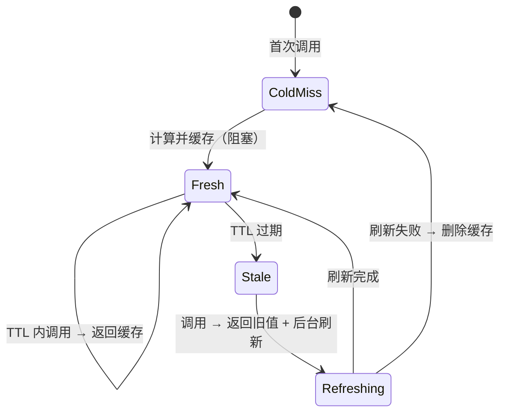
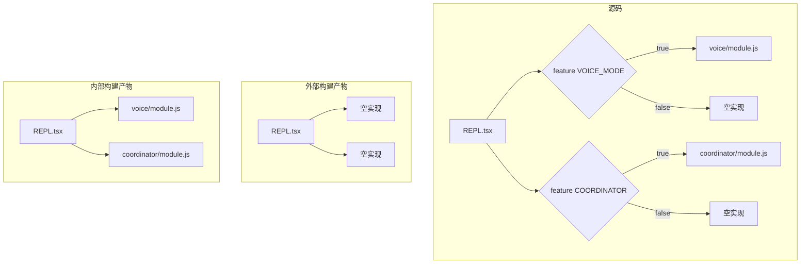
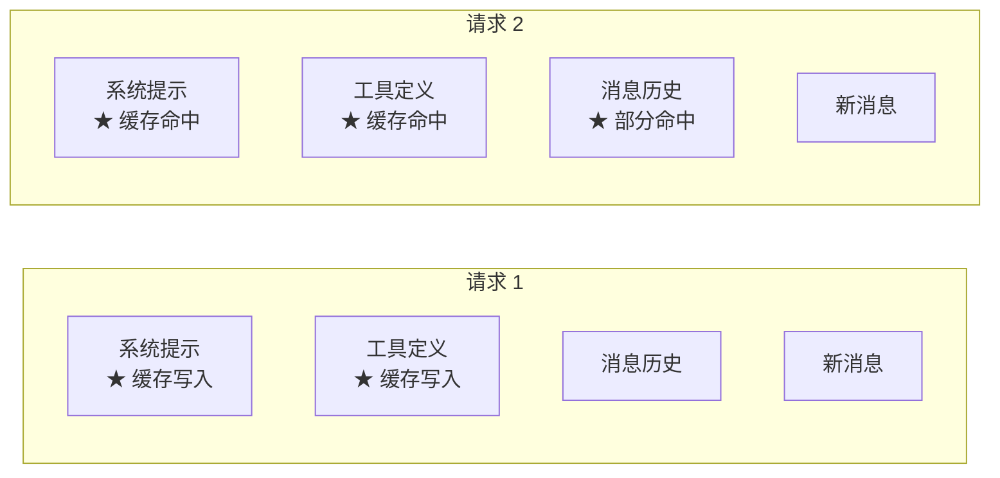
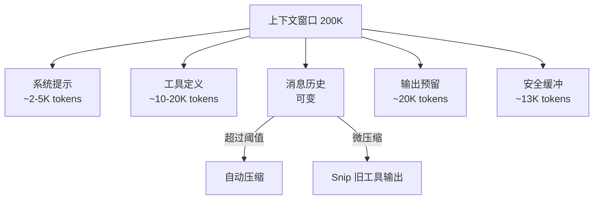

# 第 21 章：性能优化

> "在 Agent 系统中，性能不仅关乎用户体验，更关乎成本 —— 每一个浪费的 Token 都是真实的金钱。"

Claude Code 运行在终端环境中，面对的性能约束与 Web 应用截然不同。它不需要考虑首屏渲染时间，但需要在数十万 Token 的对话中保持流畅的交互。它不需要优化图片加载，但需要控制每次 API 调用的 Token 预算。本章将系统性地分析 Claude Code 的性能优化策略。

## 21.1 启动优化 —— 并行预取 + 懒加载

### 21.1.1 Bootstrap 状态

Claude Code 的启动状态集中管理在 `src/bootstrap/state.ts` 中。这个文件开头有一个醒目的注释：

```typescript
// DO NOT ADD MORE STATE HERE - BE JUDICIOUS WITH GLOBAL STATE
```

这说明团队对全局状态的扩散有明确的警惕。Bootstrap 状态包含：

```typescript
type State = {
  originalCwd: string
  projectRoot: string
  totalCostUSD: number
  totalAPIDuration: number
  totalAPIDurationWithoutRetries: number
  totalToolDuration: number
  turnHookDurationMs: number
  turnToolDurationMs: number
  turnClassifierDurationMs: number
  startTime: number
  lastInteractionTime: number
  totalLinesAdded: number
  totalLinesRemoved: number
  modelUsage: { [modelName: string]: ModelUsage }
  mainLoopModelOverride: ModelSetting | undefined
  // ...
}
```

### 21.1.2 条件导入与懒加载

Claude Code 大量使用条件 `require()` 代替顶层 `import`，实现真正的懒加载：

```typescript
// 不在启动时加载，仅在需要时加载
const teammateUtils =
  require('../utils/teammate.js') as typeof import('../utils/teammate.js')

// feature() 宏控制的条件加载
const proactiveModule = feature('PROACTIVE')
  ? require('../proactive/index.js')
  : null
```

这种模式的关键优势是：

1. **启动时间减少** —— 未使用的模块不会被解析和执行
2. **内存节省** —— 条件分支中的模块只在需要时占用内存
3. **死代码消除** —— `feature()` 在编译时求值，假分支的 `require` 被完全移除

### 21.1.3 并行初始化

启动过程中的独立初始化步骤是并行执行的。例如设置加载、API key 验证、GrowthBook 特性开关拉取可以同时进行：

```mermaid
gantt
    title Claude Code 启动时间线
    dateFormat X
    axisFormat %L ms

    section 串行
    CLI 参数解析      :a1, 0, 10
    配置文件加载       :a2, after a1, 20

    section 并行
    API Key 验证      :b1, after a2, 50
    GrowthBook 拉取   :b2, after a2, 40
    MCP 服务器连接     :b3, after a2, 60
    插件加载          :b4, after a2, 30

    section 渲染
    React 树挂载      :c1, after b3, 30
```



## 21.2 运行时优化 —— Memoization + LRU Cache

### 21.2.1 三层 Memoization 体系

Claude Code 在 `src/utils/memoize.ts` 中实现了三种不同特征的 memoization 函数，每种针对不同的使用场景：

**memoizeWithTTL —— 带 TTL 的写透缓存**

```typescript
export function memoizeWithTTL<Args extends unknown[], Result>(
  f: (...args: Args) => Result,
  cacheLifetimeMs: number = 5 * 60 * 1000,
): MemoizedFunction<Args, Result> {
  const cache = new Map<string, CacheEntry<Result>>()

  const memoized = (...args: Args): Result => {
    const key = jsonStringify(args)
    const cached = cache.get(key)
    const now = Date.now()

    // 无缓存：阻塞计算
    if (!cached) {
      const value = f(...args)
      cache.set(key, { value, timestamp: now, refreshing: false })
      return value
    }

    // 缓存过期：返回旧值，后台刷新
    if (now - cached.timestamp > cacheLifetimeMs && !cached.refreshing) {
      cached.refreshing = true
      Promise.resolve().then(() => {
        const newValue = f(...args)
        if (cache.get(key) === cached) {  // identity guard
          cache.set(key, { value: newValue, timestamp: Date.now(), refreshing: false })
        }
      }).catch(e => {
        logError(e)
        if (cache.get(key) === cached) cache.delete(key)
      })
      return cached.value  // 立即返回旧值
    }

    return cache.get(key)!.value
  }
  return memoized
}
```



这个设计的精妙之处在于 **identity guard**。当后台刷新进行中时，如果有人调用了 `cache.clear()`，新的冷启动会创建一个新条目。后台刷新完成时，`cache.get(key) === cached` 检查确保不会用旧的刷新结果覆盖新的缓存条目。

**memoizeWithTTLAsync —— 异步版本**

异步版本增加了一个关键优化 —— `inFlight` 去重映射：

```typescript
const inFlight = new Map<string, Promise<Result>>()

// 并发冷启动去重
if (!cached) {
  const pending = inFlight.get(key)
  if (pending) return pending  // 复用进行中的请求
  const promise = f(...args)
  inFlight.set(key, promise)
  // ...
}
```

注释中解释了原因：对于 `refreshAndGetAwsCredentials` 这样的函数，并发冷启动会导致 N 个 `aws sso login` 进程同时生成。`inFlight` 去重确保相同参数只有一个计算在进行中。

**memoizeWithLRU —— 带 LRU 驱逐的 Memoization**

```typescript
export function memoizeWithLRU<Args extends unknown[], Result>(
  f: (...args: Args) => Result,
  cacheFn: (...args: Args) => string,
  maxCacheSize: number = 100,
): LRUMemoizedFunction<Args, Result> {
  const cache = new LRUCache<string, Result>({ max: maxCacheSize })

  const memoized = (...args: Args): Result => {
    const key = cacheFn(...args)
    const cached = cache.get(key)
    if (cached !== undefined) return cached
    const result = f(...args)
    cache.set(key, result)
    return result
  }
  // ...
}
```

注释中有一个重要的历史教训：

```typescript
// Cache size for memoized message processing functions
// Chosen to prevent unbounded memory growth (was 300MB+ with lodash memoize)
// while maintaining good cache hit rates for typical conversations.
```

之前使用 lodash 的 `memoize`（无限缓存），消息处理函数的缓存增长到 300MB 以上。替换为 LRU 后，缓存被限制在固定大小。

### 21.2.2 缓存管理接口

每种 memoize 都暴露了 `cache` 管理接口：

```typescript
// memoizeWithLRU 的缓存接口
memoized.cache = {
  clear: () => cache.clear(),
  size: () => cache.size,
  delete: (key: string) => cache.delete(key),
  get: (key: string) => cache.peek(key),  // peek 不更新 recency
  has: (key: string) => cache.has(key),
}
```

注意 `get` 使用的是 `peek()` 而非 `get()` —— 观察缓存不应改变 LRU 顺序。

## 21.3 Feature Flag —— 编译时死代码消除

### 21.3.1 feature() 宏

`feature()` 是 Claude Code 最重要的编译时优化工具：

```typescript
import { feature } from 'bun:bundle'

// 编译时求值 -- 不满足的分支被完全删除
if (feature('VOICE_MODE')) {
  // 仅在 ant 内部构建中保留
  const voiceModule = require('../voice/...')
}

if (feature('COORDINATOR_MODE')) {
  // 仅在启用协调器模式的构建中保留
}
```

### 21.3.2 消除效果

在外部构建中，所有 `feature('ANT_ONLY_FEATURE')` 会被替换为 `false`，触发 JavaScript 打包器的死代码消除（DCE）。这不仅移除了条件分支内的代码，还移除了仅被该分支引用的 `require` 目标模块：



### 21.3.3 字符串保护

敏感字符串（如内部特性名称、UUID）被放入 `excluded-strings.txt`，确保它们不会出现在外部构建中。`feature()` 包裹的代码块内的字符串字面量会被自动排除。

## 21.4 Prompt Cache —— 共享机制

### 21.4.1 API 级缓存

Claude API 支持 Prompt Caching —— 当连续请求的前缀相同时，API 会重用已处理的上下文，大幅减少延迟和成本。Claude Code 的系统提示和工具定义被精心组织以最大化缓存命中：



### 21.4.2 Cache Break 检测

`src/services/api/promptCacheBreakDetection.ts` 追踪缓存命中率。当缓存命中率异常下降时，系统会记录事件并尝试诊断原因：

```typescript
// 压缩后重置缓存基线
export function notifyCompaction(querySource: QuerySource, agentId: AgentId) {
  // 压缩会改变消息前缀，导致缓存失效
  // 在这里重置基线，避免将压缩导致的缓存失效误报为异常
}
```

注释中引用了真实数据 —— "BQ 2026-03-01: missing this made 20% of tengu_prompt_cache_break events false positives"，说明缓存检测的精确度直接影响诊断的可靠性。

### 21.4.3 CacheSafeParams

分叉 Agent（如压缩 Agent）需要使用与父进程相同的缓存参数以命中缓存：

```typescript
// src/utils/forkedAgent.ts
export type CacheSafeParams = {
  // 与父进程相同的系统提示和工具集
  // 确保 API 请求的前缀匹配，命中 prompt cache
}
```

## 21.5 Token 预算 —— 控制策略

### 21.5.1 Token 追踪

Bootstrap 状态中维护了精细的 Token 统计：

```typescript
type State = {
  totalCostUSD: number
  totalAPIDuration: number
  totalAPIDurationWithoutRetries: number
  totalToolDuration: number
  turnHookDurationMs: number
  turnToolDurationMs: number
  turnClassifierDurationMs: number
  turnToolCount: number
  turnHookCount: number
  turnClassifierCount: number
  modelUsage: { [modelName: string]: ModelUsage }
  // ...
}
```

REPL 在每个轮次中追踪输出 Token：

```typescript
import {
  snapshotOutputTokensForTurn,
  getCurrentTurnTokenBudget,
  getTurnOutputTokens,
  getBudgetContinuationCount,
  getTotalInputTokens,
} from '../bootstrap/state.js';
import { parseTokenBudget } from '../utils/tokenBudget.js';
```

### 21.5.2 上下文窗口管理

上下文窗口是最关键的 Token 预算。其管理涉及多个层次：



### 21.5.3 成本控制

REPL 集成了成本阈值对话框：

```typescript
import { CostThresholdDialog } from '../components/CostThresholdDialog.js';
import { getTotalCost, saveCurrentSessionCosts, resetCostState } from '../cost-tracker.js';
```

当会话成本达到预设阈值时，系统暂停并要求用户确认是否继续。这是防止意外高额成本的安全网。

### 21.5.4 Token 估算

精确的 Token 计数需要调用 tokenizer，代价较高。Claude Code 使用估算函数加速常见操作：

```typescript
import { roughTokenCountEstimation, roughTokenCountEstimationForMessages }
  from '../services/tokenEstimation.js';
import { tokenCountWithEstimation } from '../../utils/tokens.js';
```

估算函数使用字符数/4 的经验公式（英文平均每个 Token 约 4 个字符），在需要精确计数时才调用完整的 tokenizer。

## 21.6 渲染性能

### 21.6.1 FPS 追踪

```typescript
import { useFpsMetrics } from '../context/fpsMetrics.js';
```

Claude Code 追踪终端渲染的帧率指标。当帧率下降时，可以通过 DevBar 查看诊断信息。

### 21.6.2 对象池

`src/ink/screen.ts` 中的 `CharPool`、`StylePool`、`HyperlinkPool` 使用对象池模式，避免每帧创建大量临时对象导致 GC 压力。

### 21.6.3 useDeferredValue

REPL 使用 React 18 的 `useDeferredValue` 延迟非关键更新：

```typescript
import { useDeferredValue } from 'react';
// 消息列表的搜索高亮是延迟更新的，不阻塞输入响应
```

## 本章小结

Claude Code 的性能优化体系展现了一种务实的工程哲学。`memoizeWithTTL` 的写透缓存策略、`feature()` 的编译时死代码消除、三层 memoization 的差异化设计 —— 每一种优化都针对具体的性能瓶颈。

最深刻的教训来自真实数据：lodash memoize 的 300MB 内存泄漏引出了 LRU 限制，1,279 个异常会话引出了断路器，20% 的缓存误报引出了压缩后的基线重置。性能优化不是猜测游戏，而是数据驱动的工程实践。
