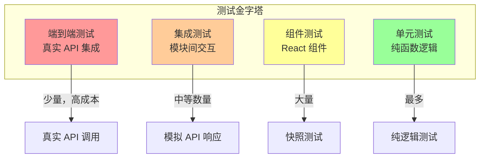
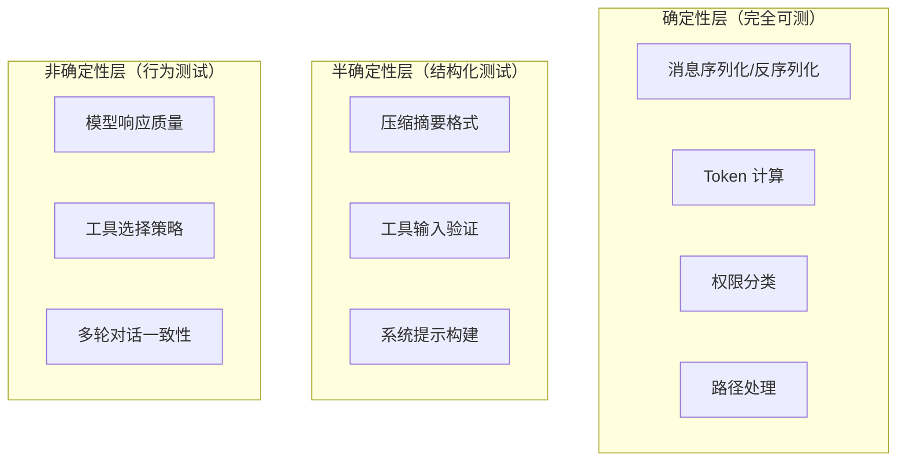
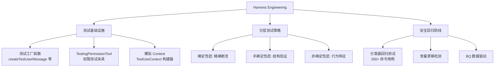

# 第 22 章：测试策略

> "测试 AI Agent 系统是软件工程中最具挑战性的任务之一 —— 当被测对象本身是非确定性的，传统的断言模型几乎全部失效。"

Claude Code 面临一个独特的测试难题：它的核心行为依赖于大型语言模型的输出，而这个输出是非确定性的。如何在这种条件下构建可靠的测试体系？本章将揭示 Claude Code 的测试策略。

## 22.1 测试分层

### 22.1.1 测试金字塔

Claude Code 的测试分为四个层次：



### 22.1.2 单元测试策略

纯函数是最容易测试的部分。消息处理、Token 估算、路径归一化等函数有确定性的输入输出映射：

```typescript
// 示例：compact grouping 的测试
describe('groupMessagesByApiRound', () => {
  it('should group messages by assistant message id boundaries', () => {
    const messages = [
      createUserMessage({ content: 'hello' }),
      createAssistantMessage({ id: 'a1', content: 'response 1' }),
      createUserMessage({ content: 'follow up' }),
      createAssistantMessage({ id: 'a2', content: 'response 2' }),
    ]
    const groups = groupMessagesByApiRound(messages)
    expect(groups).toHaveLength(2)
    expect(groups[0]).toHaveLength(2)  // user + assistant a1
    expect(groups[1]).toHaveLength(2)  // user + assistant a2
  })
})
```

### 22.1.3 权限系统测试

权限分类器是 Claude Code 的安全关键路径，需要特别详尽的测试：

```typescript
// 测试 Bash 命令的安全分类
describe('bashPermissions', () => {
  it('should block rm -rf /', () => {
    const result = classifyCommand('rm -rf /')
    expect(result).toBe('deny')
  })

  it('should allow ls -la', () => {
    const result = classifyCommand('ls -la')
    expect(result).toBe('allow')
  })

  it('should require confirmation for pip install', () => {
    const result = classifyCommand('pip install requests')
    expect(result).toBe('needs_confirm')
  })
})
```

## 22.2 Harness Engineering —— 测试基础设施

### 22.2.1 测试工具库

Claude Code 的测试中有一个重要的概念 —— Harness（测试夹具）。这些是可复用的测试基础设施，处理常见的测试场景：

```typescript
// 消息工厂函数
function createTestUserMessage(content: string): UserMessage {
  return {
    type: 'user',
    message: { role: 'user', content },
    uuid: randomUUID(),
    timestamp: new Date().toISOString(),
  }
}

function createTestAssistantMessage(content: string): AssistantMessage {
  return {
    type: 'assistant',
    message: {
      id: `msg_${randomUUID()}`,
      type: 'message',
      role: 'assistant',
      content: [{ type: 'text', text: content }],
    },
    uuid: randomUUID(),
    timestamp: new Date().toISOString(),
  }
}
```

### 22.2.2 Store 测试

Store 的测试验证状态管理的核心契约：

```typescript
describe('createStore', () => {
  it('should not notify when state is identical (Object.is)', () => {
    const listener = jest.fn()
    const store = createStore({ count: 0 })
    store.subscribe(listener)

    // 返回相同引用 → 不通知
    store.setState(prev => prev)
    expect(listener).not.toHaveBeenCalled()

    // 返回不同引用 → 通知
    store.setState(prev => ({ ...prev, count: 1 }))
    expect(listener).toHaveBeenCalledTimes(1)
  })

  it('should call onChange with old and new state', () => {
    const onChange = jest.fn()
    const store = createStore({ count: 0 }, onChange)

    store.setState(prev => ({ ...prev, count: 1 }))

    expect(onChange).toHaveBeenCalledWith({
      newState: { count: 1 },
      oldState: { count: 0 },
    })
  })
})
```

### 22.2.3 会话恢复测试

会话恢复涉及复杂的边界情况，需要系统性测试：

```typescript
describe('deserializeMessages', () => {
  it('should filter unresolved tool uses', () => {
    const messages = [
      createTestUserMessage('hello'),
      createTestAssistantMessage('I will read a file'),
      // tool_use 没有对应的 tool_result（崩溃场景）
      createToolUseMessage('Read', { file_path: '/tmp/test' }),
    ]
    const result = deserializeMessages(messages)
    // tool_use 没有匹配的 result → 被过滤
    expect(result).toHaveLength(2)
  })

  it('should detect interrupted prompt', () => {
    const messages = [
      createTestUserMessage('hello'),
      createTestAssistantMessage('response'),
      createTestUserMessage('do something'),
      // 没有后续 assistant 响应 → 中断
    ]
    const result = deserializeMessagesWithInterruptDetection(messages)
    expect(result.turnInterruptionState.kind).toBe('interrupted_prompt')
  })
})
```

## 22.3 AI 系统测试

### 22.3.1 非确定性系统的测试策略

测试 AI Agent 的关键挑战在于非确定性。Claude Code 采用以下策略：



**确定性层** —— 使用传统的断言测试。消息处理、Token 计算等函数有确定性的输入输出映射。

**半确定性层** —— 使用结构验证。例如压缩摘要必须包含 `<summary>` 标签，但标签内的内容是非确定性的。

**非确定性层** —— 使用行为特征测试。不断言精确输出，而是断言输出的结构特征（如"应该包含文件名"、"不应该包含被删除的上下文"）。

### 22.3.2 Compact 摘要测试

```typescript
describe('formatCompactSummary', () => {
  it('should strip analysis section', () => {
    const summary = `<analysis>
thinking process here...
</analysis>

<summary>
1. Primary Request: Fix the bug
2. Key Technical Concepts: React, TypeScript
</summary>`

    const result = formatCompactSummary(summary)
    expect(result).not.toContain('<analysis>')
    expect(result).toContain('Summary:')
    expect(result).toContain('Fix the bug')
  })
})
```

### 22.3.3 Feature Flag 测试

`feature()` 宏在不同构建配置下会产生不同的代码路径。测试需要覆盖两种构建：

```typescript
// 外部构建：feature('VOICE_MODE') === false
describe('external build', () => {
  it('should use noop voice integration', () => {
    const integration = useVoiceIntegration()
    expect(integration.handleKeyEvent).toBeDefined()
    // 空实现不应抛出
    integration.handleKeyEvent()
  })
})
```

### 22.3.4 FileStateCache 测试

```typescript
describe('FileStateCache', () => {
  it('should normalize paths for consistent access', () => {
    const cache = createFileStateCacheWithSizeLimit(10)
    cache.set('/a/b/../c/file.ts', { content: 'test', timestamp: 1, offset: undefined, limit: undefined })

    // 归一化路径应命中同一条目
    expect(cache.get('/a/c/file.ts')).toBeDefined()
    expect(cache.get('/a/c/file.ts')!.content).toBe('test')
  })

  it('should evict by size before reaching max entries', () => {
    // 1MB 大小限制，100 条目限制
    const cache = createFileStateCacheWithSizeLimit(100, 1024 * 1024)

    // 写入超过大小限制的内容
    for (let i = 0; i < 50; i++) {
      cache.set(`/file${i}.ts`, {
        content: 'x'.repeat(100 * 1024), // 100KB each
        timestamp: i,
        offset: undefined,
        limit: undefined,
      })
    }

    // 由于大小限制，不会保留全部 50 个
    expect(cache.size).toBeLessThan(50)
  })
})
```

## 22.4 测试文化与实践

### 22.4.1 测试命名规范

从代码注释中可以看到测试的命名传统：

```typescript
// @internal Exported for testing - use loadConversationForResume instead
export function deserializeMessages(serializedMessages: Message[]): Message[] { ... }
```

内部函数如果需要测试，会标记为 `@internal Exported for testing`，并注明正常调用方应使用的公共接口。

### 22.4.2 数据驱动的测试决策

代码中频繁出现的 BQ（BigQuery）数据引用说明团队使用生产数据指导测试优先级：

```typescript
// BQ 2026-03-10: 1,279 sessions had 50+ consecutive failures
// → 引出了断路器测试

// BQ 2026-03-01: missing this made 20% of tengu_prompt_cache_break events false positives
// → 引出了压缩后缓存基线重置的测试
```

### 22.4.3 防回归测试

一些测试直接针对历史 Bug：

```typescript
// 测试 drift assertion: microCompact 中内联的常量字符串
// 必须与源文件保持一致
it('TIME_BASED_MC_CLEARED_MESSAGE must match toolResultStorage.ts', () => {
  // Drift is caught by a test asserting equality with the source-of-truth.
})
```

这种"常量一致性"测试防止了跨文件复制的字符串出现漂移。

## 22.5 Harness Engineering —— AI Agent 的质量保证方法论

### 22.5.1 什么是 Harness Engineering

Harness Engineering 是为 AI Agent 系统构建专用测试基础设施的工程实践。与传统软件测试不同，AI Agent 的核心行为依赖非确定性的模型输出，传统的"输入 → 断言精确输出"模式不再适用。Claude Code 的 Harness Engineering 包含三个支柱：



### 22.5.2 TestingPermissionTool —— 权限测试的专用夹具

`TestingPermissionTool` 是一个仅在测试环境中启用的工具，它的唯一目的是验证权限系统的端到端行为：

```typescript
// src/tools/testing/TestingPermissionTool.tsx
export const TestingPermissionTool: Tool<InputSchema, string> = buildTool({
  name: 'TestingPermission',
  isEnabled() {
    return process.env.NODE_ENV === 'test'  // 仅测试环境
  },
  isConcurrencySafe() { return true },
  isReadOnly() { return true },
  async checkPermissions() {
    return {
      behavior: 'ask' as const,   // 始终触发权限对话框
      message: 'Run test?',
    }
  },
  async call() {
    return { data: 'TestingPermission executed successfully' }
  },
})
```

注册机制同样受环境门控：

```typescript
// src/tools.ts
...(process.env.NODE_ENV === 'test' ? [TestingPermissionTool] : []),
```

这个工具的设计体现了 Harness Engineering 的核心理念：**为测试创建专用的可控组件，而非在生产代码中注入测试逻辑**。TestingPermissionTool 的 `checkPermissions` 始终返回 `ask`，使得 E2E 测试可以稳定地验证权限对话框的显示、用户确认和拒绝流程。

### 22.5.3 安全分类器的回归测试

Bash 安全分类器是 Claude Code 最关键的安全组件，其回归测试覆盖了数百个命令用例：

```typescript
// 分类器回归测试的结构
describe('Bash security classifier', () => {
  // 明确安全的命令
  const SAFE_COMMANDS = [
    'ls -la', 'cat README.md', 'git status', 'node --version',
    'echo hello', 'pwd', 'which node', 'head -n 10 file.txt',
  ]

  // 明确危险的命令
  const DANGEROUS_COMMANDS = [
    'rm -rf /', 'rm -rf ~', 'dd if=/dev/zero of=/dev/sda',
    'chmod -R 777 /', 'mkfs.ext4 /dev/sda',
    ':(){ :|:& };:',  // fork bomb
  ]

  // 需要确认但非危险的命令
  const NEEDS_CONFIRMATION = [
    'pip install requests', 'npm install -g',
    'curl https://example.com | bash',
    'docker rm $(docker ps -aq)',
  ]

  // 绕过检测（Zsh 特有）
  const ZSH_BYPASS_ATTEMPTS = [
    '=rm -rf /',           // Zsh equals expansion
    "echo 'safe'$(rm -rf /)",  // 命令替换注入
  ]

  for (const cmd of SAFE_COMMANDS) {
    it(`should allow: ${cmd}`, () => {
      expect(classifyCommand(cmd).behavior).toBe('allow')
    })
  }

  for (const cmd of DANGEROUS_COMMANDS) {
    it(`should deny: ${cmd}`, () => {
      expect(classifyCommand(cmd).behavior).toBe('deny')
    })
  }
})
```

这种"正例 + 反例 + 绕过尝试"的测试矩阵确保了分类器在安全关键场景下的可靠性。每当生产环境发现新的绕过方式，都会立即添加对应的回归用例。

### 22.5.4 常量漂移检测（Drift Detection）

跨文件复制的常量容易出现漂移。Claude Code 使用断言测试来防止这种问题（参见第 9 章 ContentReplacementState 的 TIME_BASED_MC_CLEARED_MESSAGE）：

```typescript
// 测试内联常量与源文件保持一致
it('inlined constant must match source of truth', () => {
  const inlined = require('../services/compact/microCompact.js')
    .TIME_BASED_MC_CLEARED_MESSAGE
  const sourceOfTruth = require('../utils/toolResultStorage.js')
    .TIME_BASED_MC_CLEARED_MESSAGE
  expect(inlined).toBe(sourceOfTruth)
})
```

这是一种"编译器做不到的验证" —— TypeScript 无法检测两个不同文件中的字符串常量是否保持同步，但测试可以。

### 22.5.5 可复现的 Agent 测试模式

测试 Agent 行为时，Claude Code 采用"固定输入 + 结构断言"模式：

```typescript
// 不断言精确的模型输出
// BAD: expect(response.text).toBe('I will read the file for you')

// 断言行为结构
// GOOD: expect(response.toolCalls).toContainEqual(
//   expect.objectContaining({ name: 'Read', input: { file_path: '/test' } })
// )
```

对于需要更强确定性的场景，测试通过 Mock API 注入固定的 Assistant 响应，绕过模型的非确定性：

```typescript
const mockApiResponse = createAssistantMessage({
  content: [
    { type: 'tool_use', id: 'tu_1', name: 'Read',
      input: { file_path: '/tmp/test.txt' } },
  ],
})
// 注入 mock → 验证工具执行流程 → 断言结果
```

## 22.6 端到端测试考量

### 22.5.1 成本与覆盖率的平衡

端到端测试需要真实的 API 调用，每次测试都产生成本。Claude Code 的策略是：

1. 单元测试覆盖所有确定性逻辑
2. 集成测试使用模拟 API 响应覆盖交互逻辑
3. 端到端测试仅覆盖关键用户路径（启动、查询、压缩、恢复）
4. 回归测试仅在发现 Bug 后添加端到端用例

### 22.5.2 快照测试

组件渲染使用快照测试验证 UI 不发生意外变化。终端渲染的快照是 ANSI 字符串，比 HTML 快照更紧凑。

## 本章小结

Claude Code 的测试策略体现了一个核心原则：**在确定性层面追求完美覆盖，在非确定性层面追求结构验证**。通过将系统分层为确定性/半确定性/非确定性三个层面，团队能够为每个层面选择最适合的测试方法。

数据驱动的测试决策（基于 BQ 生产数据）和防回归测试（基于历史 Bug）确保了测试投资的回报最大化。这不是为了测试覆盖率的数字好看，而是为了系统的实际可靠性。
