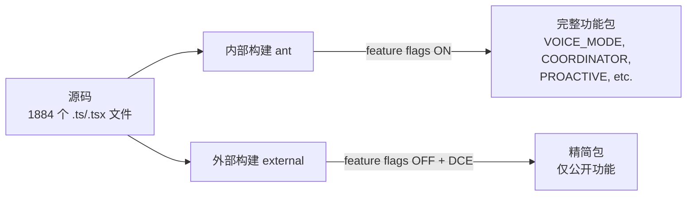
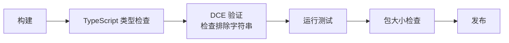
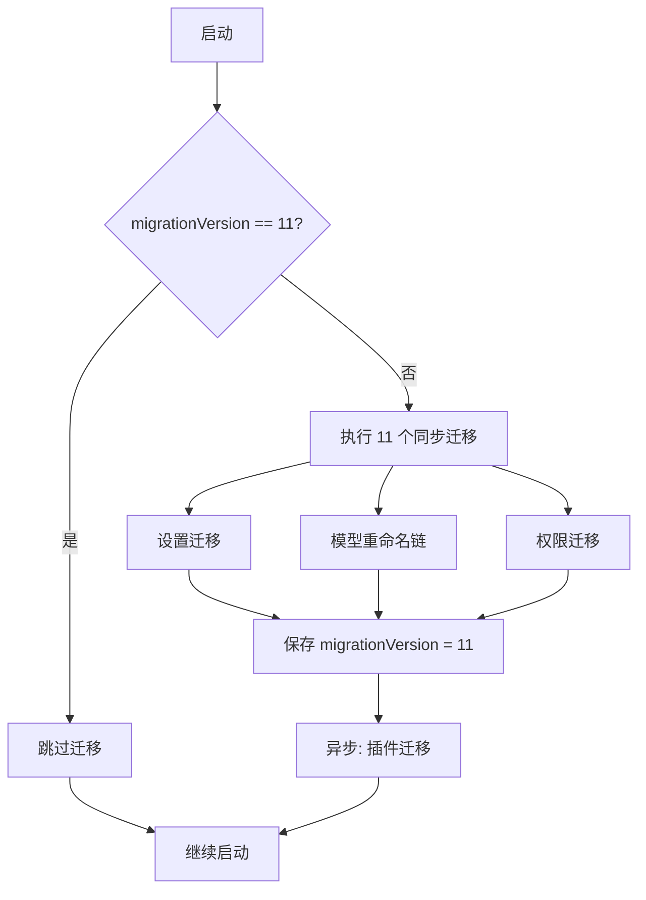

# 第 23 章：构建系统

> "构建系统是软件的骨架 —— 用户看不到它，但它决定了软件的形态、大小和到达用户手中的速度。"

Claude Code 选择了 Bun 作为运行时和打包器，这一决策深刻影响了整个项目的架构。本章将分析其构建系统的设计、依赖管理策略和发布流程。

## 23.1 Bun Runtime

### 23.1.1 为什么选择 Bun

Claude Code 在构建和运行时都依赖 Bun。从源码中可以看到直接使用 Bun 特有的 API：

```typescript
import { feature } from 'bun:bundle'  // Bun 编译时宏
```

`bun:bundle` 是 Bun 打包器的专有模块，`feature()` 函数在打包时被求值为字面量（`true` 或 `false`），实现编译时条件分支。这是 Node.js 生态中没有直接对应物的能力。

选择 Bun 的技术理由包括：

1. **启动速度** —— Bun 的 JavaScript 引擎（JavaScriptCore）启动速度快于 V8
2. **内置打包器** —— 无需 webpack/esbuild 等额外工具
3. **编译时宏** —— `feature()` 实现了零运行时开销的特性开关
4. **TypeScript 原生支持** —— 无需编译步骤即可运行 `.ts` 文件

### 23.1.2 兼容性层

尽管使用 Bun，Claude Code 仍保留了 Node.js 兼容性检查：

```typescript
// src/keybindings/defaultBindings.ts
import { isRunningWithBun } from '../utils/bundledMode.js'

const SUPPORTS_TERMINAL_VT_MODE =
  getPlatform() !== 'windows' ||
  (isRunningWithBun()
    ? satisfies(process.versions.bun, '>=1.2.23')
    : satisfies(process.versions.node, '>=22.17.0 <23.0.0 || >=24.2.0'))
```

这说明 Claude Code 可以同时在 Bun 和 Node.js 上运行，但某些特性的可用性取决于具体的运行时版本。

## 23.2 Bundle 策略

### 23.2.1 双构建配置

Claude Code 有两种构建配置：



### 23.2.2 死代码消除（DCE）

`feature()` 宏与 Bun 打包器的 DCE 配合，实现了精确的代码裁剪：

```typescript
// 源码
const VoiceProvider = feature('VOICE_MODE')
  ? require('../context/voice.js').VoiceProvider
  : ({ children }) => children

// 外部构建后
const VoiceProvider = ({ children }) => children
// voice.js 模块完全不会被打包
```

这种模式遍布整个代码库。在 REPL.tsx 中：

```typescript
// 每个条件导入在外部构建中都被替换为空实现
const useVoiceIntegration = feature('VOICE_MODE')
  ? require('...').useVoiceIntegration
  : () => ({ stripTrailing: () => 0, handleKeyEvent: () => {} })

const useFrustrationDetection = "external" === 'ant'
  ? require('...').useFrustrationDetection
  : () => ({ state: 'closed' })

const getCoordinatorUserContext = feature('COORDINATOR_MODE')
  ? require('...').getCoordinatorUserContext
  : () => ({})
```

### 23.2.3 字符串排除

敏感字符串的保护是构建系统的重要职责。`excluded-strings.txt` 列出了不应出现在外部构建中的字符串：

```
# 内部特性名称
VOICE_MODE
COORDINATOR_MODE
marble_origami

# 内部 UUID 和标识符
<sensitive-uuid>
```

构建后验证步骤会扫描产物，确保这些字符串不存在。

## 23.3 依赖管理

### 23.3.1 依赖策略

从导入分析可以看到 Claude Code 的依赖策略：

```typescript
// 核心 SDK
import { APIUserAbortError } from '@anthropic-ai/sdk'

// React 生态
import React from 'react'
import createReconciler from 'react-reconciler'

// 工具库（使用 lodash-es 的 tree-shakeable 导入）
import uniqBy from 'lodash-es/uniqBy.js'
import throttle from 'lodash-es/throttle.js'
import noop from 'lodash-es/noop.js'

// LRU 缓存
import { LRUCache } from 'lru-cache'

// Yoga 布局
import { getYogaCounters } from 'src/native-ts/yoga-layout/index.js'
```

关键决策：

1. **lodash-es 逐函数导入** —— 而非 `import _ from 'lodash'`，确保 tree shaking 有效
2. **Ink 内部化** —— 而非作为 npm 依赖，获得完全控制权
3. **Yoga WASM** —— 通过 `native-ts/yoga-layout` 加载，而非 npm 的 yoga-layout
4. **Anthropic SDK** —— 使用官方 SDK，但也有自定义 API 层

### 23.3.2 循环依赖管理

代码中有多处明确处理循环依赖的注释：

```typescript
// Inline from utils/toolResultStorage.ts — importing that file pulls in
// sessionStorage → utils/messages → services/api/errors, completing a
// circular-deps loop back through this file via promptCacheBreakDetection.
// Drift is caught by a test asserting equality with the source-of-truth.
export const TIME_BASED_MC_CLEARED_MESSAGE = '[Old tool result content cleared]'
```

```typescript
// Use lazy require to avoid circular dependency with teammate.ts
const teammateUtils =
  require('../utils/teammate.js') as typeof import('../utils/teammate.js')
```

循环依赖管理策略：
1. **内联常量** —— 复制小的常量值并用测试保证一致性
2. **懒加载 require** —— 在函数体内而非顶层导入
3. **类型独立文件** —— 将类型定义放在独立文件（如 `AppStateStore.ts` vs `AppState.tsx`）

### 23.3.3 类型与运行时分离

```typescript
// src/state/AppState.tsx 的注释
// TODO: Remove these re-exports once all callers import directly from
// ./AppStateStore.js. Kept for back-compat during migration so .ts callers
// can incrementally move off the .tsx import and stop pulling React.
export { type AppState, type AppStateStore, type CompletionBoundary,
         getDefaultAppState, IDLE_SPECULATION_STATE,
         type SpeculationResult, type SpeculationState }
  from './AppStateStore.js';
```

`AppStateStore.ts` 是纯类型和逻辑文件（不依赖 React），`AppState.tsx` 包含 React 组件。将类型从 `.tsx` 迁移到 `.ts` 是一个进行中的重构，目标是让非 React 的 `.ts` 文件不需要引入 React 依赖。

## 23.4 发布流程

### 23.4.1 版本管理

从代码中的版本检查可以推断发布流程的严谨性：

```typescript
import { satisfies } from 'src/utils/semver.js'

// 精确到补丁版本的兼容性检查
satisfies(process.versions.bun, '>=1.2.23')
satisfies(process.versions.node, '>=22.17.0 <23.0.0 || >=24.2.0')
```

### 23.4.2 构建验证



### 23.4.3 NPM 发布产物分析

Claude Code 的 NPM 包 `@anthropic-ai/claude-code` 的发布产物结构揭示了构建系统的最终输出：

| 文件 | 类型 | 大小 | 说明 |
|------|------|------|------|
| `cli.js` | application/javascript | ~13 MB | 单文件打包的完整应用 |
| `cli.js.map` | application/json | ~59.8 MB | Source Map（调试用） |
| `vendor/` | folder | ~29.8 MB | 第三方依赖（WASM、native 模块等） |
| `sdk-tools.d.ts` | application/typescript | ~117 KB | SDK 工具类型定义 |
| `package.json` | application/json | ~1.24 KB | 包元数据 |
| `bun.lock` | text/plain | ~596 B | Bun 锁文件 |

几个关键观察：

**单文件打包**：1884 个 TypeScript 源文件被打包为单个 `cli.js`（~13MB）。这意味着 Bun 的 bundler 进行了完整的 tree-shaking、DCE、模块拼接。

**Source Map 体积**：`cli.js.map` 是 `cli.js` 的 4.6 倍大。这是因为 Source Map 保留了原始源码的完整映射，用于 `--inspect` 调试和错误堆栈的源码定位。

**vendor 目录**：不可打包的资源（如 WASM 模块、native addon）通过 `vendor/` 目录分发，而非嵌入到 `cli.js` 中。

### 23.4.4 自动更新

Claude Code 内置了自动更新机制，支持多种安装方式：

```typescript
// src/components/AutoUpdater.tsx
import type { AutoUpdaterResult } from '../utils/autoUpdater.js';

// 两种更新器，根据安装方式自动选择：
// NativeAutoUpdater -- 原生安装（如 Homebrew, snap）
// PackageManagerAutoUpdater -- npm/yarn/bun 安装
```

更新检测在后台异步执行，不阻塞主交互循环。当检测到新版本时，会在 REPL 的状态栏显示更新提示，用户可以选择立即更新或稍后处理。

### 23.4.5 迁移系统 —— 跨版本数据兼容

迁移系统是 Claude Code 版本升级的关键保障。`src/main.tsx` 中定义了迁移的核心机制：

```typescript
// src/main.tsx
// @[MODEL LAUNCH]: Consider any migrations you may need for model strings.
// Bump this when adding a new sync migration so existing users re-run the set.
const CURRENT_MIGRATION_VERSION = 11;

function runMigrations(): void {
  if (getGlobalConfig().migrationVersion !== CURRENT_MIGRATION_VERSION) {
    migrateAutoUpdatesToSettings();
    migrateBypassPermissionsAcceptedToSettings();
    migrateEnableAllProjectMcpServersToSettings();
    migrateSonnet1mToSonnet45();
    migrateSonnet45ToSonnet46();
    migrateOpusToOpus1m();
    migrateLegacyOpusToCurrent();
    migrateReplBridgeEnabledToRemoteControlAtStartup();
    resetAutoModeOptInForDefaultOffer();
    resetProToOpusDefault();

    if ("external" === 'ant') {
      migrateFennecToOpus();  // 仅内部构建
    }

    saveGlobalConfig(prev =>
      prev.migrationVersion === CURRENT_MIGRATION_VERSION
        ? prev
        : { ...prev, migrationVersion: CURRENT_MIGRATION_VERSION }
    );
  }

  // 异步迁移 -- fire-and-forget（非阻塞）
  void migrateInstalledPlugins();
}
```

迁移系统的设计要点：

**版本门控**：`migrationVersion` 记录在全局配置中。只有当本地版本低于 `CURRENT_MIGRATION_VERSION` 时才执行迁移，避免每次启动重复运行 11 次 `saveGlobalConfig`。

**模型重命名链**：多个迁移函数形成了一条模型名称的演进链：
```
Fennec → Opus → Opus 1M → Current
Sonnet 1M → Sonnet 4.5 → Sonnet 4.6
```
这确保了无论用户从哪个版本升级，模型配置都能正确迁移到最新名称。

**同步 vs 异步**：核心配置迁移是同步的（必须在 init 完成前生效），而插件迁移是异步的（`void migrateInstalledPlugins()`），避免阻塞启动。

**幂等性**：每个迁移函数内部检查是否需要执行。例如 `migrateSonnet45ToSonnet46` 只有在发现旧模型名时才修改配置。这保证了迁移可以安全地重复运行。



## 本章小结

Claude Code 的构建系统体现了"不多不少，恰到好处"的工程哲学：

1. **Bun 选型**：编译时宏 `feature()` 实现了零运行时开销的多构建配置，一份代码服务内外部用户
2. **Bundle 策略**：DCE + 字符串排除确保外部构建不泄漏内部功能
3. **依赖管理**：lodash-es 逐函数导入、Ink 内部化、循环依赖的三种处理策略
4. **发布产物**：单文件 `cli.js`（13MB）+ vendor 目录，Source Map 保留完整调试能力
5. **迁移系统**：版本门控 + 幂等迁移 + 模型重命名链，确保无缝升级
